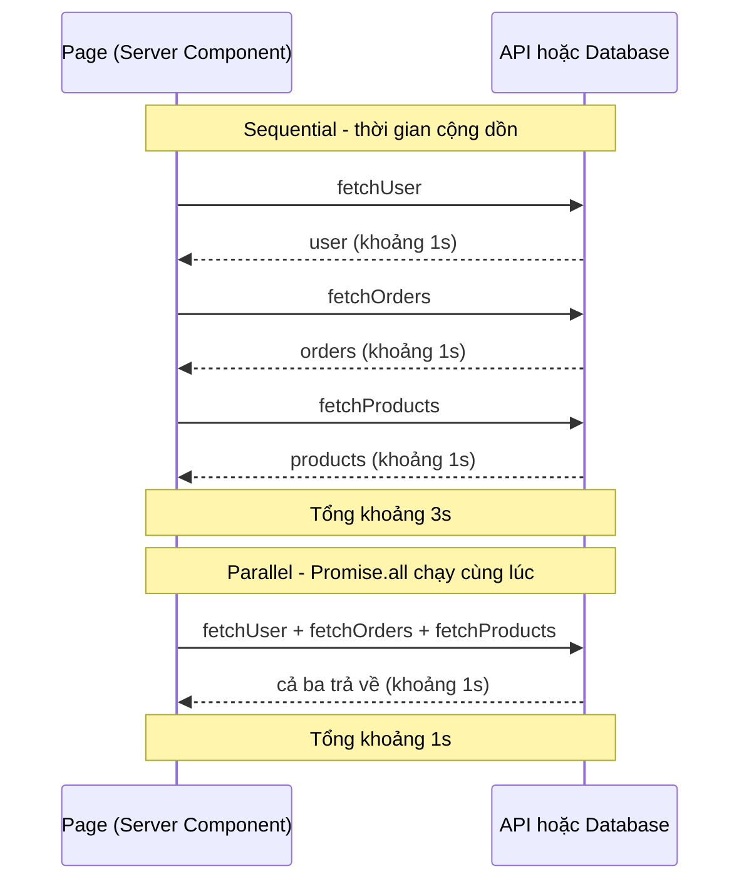

# Data Fetching Patterns

**Data fetching patterns** (các mẫu lấy dữ liệu) là những cách tổ chức việc lấy dữ liệu sao cho trang tải nhanh và mượt hơn. Bài này giới thiệu các kỹ thuật như lấy dữ liệu **parallel** (song song — chạy nhiều request cùng lúc) so với **sequential** (tuần tự — chạy lần lượt), **preloading** (tải trước dữ liệu sớm) và tránh **waterfall** (hiệu ứng thác nước — các request chờ nhau nối tiếp gây chậm). Hiểu các mẫu này giúp người mới tối ưu hiệu năng trong Next.js.

[](pathname:///img/nextjs/data-fetching-patterns.webp)

---

:::note[Ghi nhớ nhanh]

- ⭐ **Luôn parallel khi không có dependency** — `await` tuần tự các request độc lập gây waterfall (cộng dồn thời gian); dùng `Promise.all` để tổng thời gian bằng request chậm nhất.
- **Sequential chỉ khi phụ thuộc** — ví dụ lấy `user` trước rồi mới `fetchOrders(user.id)`.
- **Preload để fetch sớm** — gọi fire-and-forget ở layout, child `await` lại cùng request, Next dedupe nên chỉ gọi mạng một lần.
- ⭐ **Streaming + Suspense** — mỗi Suspense boundary resolve độc lập và stream dần; React 19 `use(promise)` cho phép start nhiều promise song song ngay từ đầu.
- **`loading.tsx` vs Suspense thủ công** — `loading.tsx` wrap cả page khi navigation; Suspense thủ công cho từng phần load riêng.
- **Chỉ stream khi data chậm** — data rất nhanh (`<100ms`) thì render một lần tốt hơn; Suspense hữu ích khi data >500ms.

:::

---

## Mục lục

- [Vì sao cần các data fetching pattern?](#vì-sao-cần-các-data-fetching-pattern)
- [Parallel vs Sequential](#parallel-vs-sequential)
- [Preloading Data](#preloading-data)
- [Waterfall Prevention](#waterfall-prevention)
- [Streaming + Suspense](#streaming--suspense)
- [Câu hỏi phỏng vấn](#câu-hỏi-phỏng-vấn)

---

## Vì sao cần các data fetching pattern?

**Vấn đề:** fetch dữ liệu một cách ngây thơ — `await` tuần tự từng cái dù
chúng độc lập — tạo ra **request waterfall**: thời gian cộng dồn, trang chậm.
Tệ hơn, một phần data chậm có thể chặn hiển thị toàn bộ trang.

```tsx
// Waterfall — 3 request độc lập nhưng chạy nối tiếp
async function Page() {
  const header = await fetchHeader();     // 1s
  const list = await fetchList();         // 1s — chỉ start khi header xong
  const sidebar = await fetchSidebar();   // 1s — chỉ start khi list xong
  // Total: 3s, và không gì hiện ra cho tới khi cả 3 xong
}
```

**Giải pháp:** chọn đúng pattern theo quan hệ dữ liệu — **parallel**
(`Promise.all` hoặc khởi tạo promise trước rồi await) cho data độc lập,
**sequential** chỉ khi phụ thuộc nhau, **preload** để fetch sớm,
**request memoization** (Next dedupe fetch trùng), và **streaming + Suspense**
để hiện phần nhanh trước.

```tsx
// Parallel — 3 request độc lập chạy cùng lúc
async function Page() {
  const [header, list, sidebar] = await Promise.all([
    fetchHeader(),
    fetchList(),
    fetchSidebar(),
  ]);
  // Total: max(1s) = 1s
}
```

:::tip[Dùng thực tế]

- **Tải song song** header + list + sidebar của một trang vì chúng không
  phụ thuộc nhau → tổng thời gian bằng request chậm nhất, không cộng dồn.
- **Tuần tự khi bắt buộc**: lấy `user` trước rồi mới `fetchOrders(user.id)`
  vì cần `id` từ bước trước.
- **Stream phần chậm** bằng Suspense: hiện ngay layout + skeleton, phần
  data nặng (chart, thống kê) tự swap vào khi resolve.
- **Tránh fetch trùng**: gọi `preload` ở layout, child `await` lại cùng
  request — Next dedupe nên chỉ gọi mạng một lần.

:::

---

## Parallel vs Sequential

**Sequential** — fetch tuần tự (mỗi cái đợi cái trước):

```tsx
async function Page() {
  const user = await fetchUser();         // 1s
  const orders = await fetchOrders();     // 1s
  const products = await fetchProducts(); // 1s
  // Total: 3s
}
```

**Parallel** — fetch song song:

```tsx
async function Page() {
  const [user, orders, products] = await Promise.all([
    fetchUser(),
    fetchOrders(),
    fetchProducts(),
  ]);
  // Total: max(1s) = 1s
}
```

Quy tắc: **luôn parallel khi không có dependency**.

So sánh dòng thời gian tương tác giữa Page và nguồn dữ liệu — tuần tự cộng dồn, song song gộp lại:



---

## Sequential cần thiết khi có dependency

```tsx
async function Page() {
  const user = await fetchUser();                  // 1s
  const orders = await fetchOrders(user.id);       // 1s — cần user.id
  // Total: 2s (không tránh được)
}
```

---

## Preloading Data

Khi data **sẽ cần** nhưng không phải ngay → preload song song:

```tsx
import { preload } from "@/lib/cache";

async function Page() {
  preload(userId); // trigger fetch nhưng không await

  return (
    <>
      <Header /> {/* render trước */}
      <UserDetail userId={userId} /> {/* await ở đây, đã fetch xong */}
    </>
  );
}

// utils
export async function preload(userId: string) {
  void fetchUser(userId); // fire-and-forget
}
```

**Pattern: preload trong layout** — data fetch khi parent render, sẵn
sàng khi child cần:

```tsx
// app/dashboard/layout.tsx
import { preloadUser } from "@/lib/preload";

export default async function Layout({ children }) {
  preloadUser(); // start fetch
  return <>{children}</>;
}

// app/dashboard/page.tsx
async function Page() {
  const user = await fetchUser(); // dedupe — đã trong cache từ layout
}
```

---

## Waterfall Prevention

**Anti-pattern — Component waterfall**:

```tsx
// SAI — mỗi component await tuần tự
async function Page() {
  return (
    <>
      <User />     {/* await fetchUser */}
      <Orders />   {/* await fetchOrders — chỉ start khi User done */}
      <Products /> {/* await fetchProducts — chỉ start khi Orders done */}
    </>
  );
}
```

Tại sao? Server Component render tuần tự. Mỗi `await` block render kế tiếp.

**Fix** — preload + parallel:

```tsx
async function Page() {
  // Preload ngay đầu
  const userPromise = fetchUser();
  const ordersPromise = fetchOrders();
  const productsPromise = fetchProducts();

  return (
    <>
      <User promise={userPromise} />
      <Orders promise={ordersPromise} />
      <Products promise={productsPromise} />
    </>
  );
}

async function User({ promise }) {
  const user = await promise;
  return <div>{user.name}</div>;
}
```

Hoặc dùng **Suspense + lazy** — Next.js stream khi resolve:

```tsx
function Page() {
  return (
    <>
      <Suspense fallback={<UserSkeleton />}>
        <User />
      </Suspense>
      <Suspense fallback={<OrdersSkeleton />}>
        <Orders />
      </Suspense>
    </>
  );
}

async function User() {
  const user = await fetchUser();
  return <div>{user.name}</div>;
}

async function Orders() {
  const orders = await fetchOrders();
  return <ul>{orders.map(...)}</ul>;
}
```

Mỗi Suspense boundary **independent** — User và Orders fetch song song,
render khi sẵn sàng.

:::info[Phân tích]

**Suspense + Promise pattern (React 19)**:

```tsx
function Page() {
  const userPromise = fetchUser();      // start ngay
  const ordersPromise = fetchOrders();  // start ngay

  return (
    <>
      <Suspense fallback={<Skeleton />}>
        <UserDetail promise={userPromise} />
      </Suspense>
      <Suspense fallback={<Skeleton />}>
        <OrderList promise={ordersPromise} />
      </Suspense>
    </>
  );
}

function UserDetail({ promise }) {
  const user = use(promise); // React 19 use hook
  return <div>{user.name}</div>;
}
```

Lợi ích:

- Cả 2 promise start **song song** ngay từ đầu.
- Mỗi Suspense resolve **độc lập**.
- HTML stream theo từng resolve.

Đây là pattern data fetching **chuẩn nhất** cho App Router 2026.

:::

---

## Streaming + Suspense

Khi component có data nặng → wrap Suspense để stream:

```tsx
import { Suspense } from "react";

export default function Dashboard() {
  return (
    <div>
      <h1>Dashboard</h1>

      <Suspense fallback={<StatsSkeleton />}>
        <Stats />
      </Suspense>

      <Suspense fallback={<ChartSkeleton />}>
        <Chart />
      </Suspense>

      <Suspense fallback={<RecentSkeleton />}>
        <RecentActivity />
      </Suspense>
    </div>
  );
}
```

User experience:

1. Browser nhận HTML "Dashboard" + 3 skeleton **ngay**.
2. Stats resolve sau 0.5s → swap skeleton thành data.
3. Chart resolve sau 1s → swap.
4. RecentActivity resolve sau 2s → swap.

Mỗi phần load **độc lập**, **song song**. So với fetch hết rồi mới render
= 2s nothing visible.

:::tip[Mẹo]

**Loading.tsx vs Suspense thủ công**:

```tsx
// app/dashboard/loading.tsx
export default function Loading() {
  return <PageSkeleton />;
}

// app/dashboard/page.tsx
async function Dashboard() {
  const data = await fetchAll(); // loading.tsx hiển thị
  return <div>{/* ... */}</div>;
}
```

Loading.tsx wrap **toàn page**. Nếu data từng phần load thời gian khác
nhau → user thấy skeleton lâu.

**Suspense thủ công** trong page → cho phép từng phần load độc lập:

```tsx
async function Dashboard() {
  return (
    <>
      <PageHeader /> {/* render ngay với layout */}
      <Suspense fallback={<StatsSkeleton />}>
        <Stats />
      </Suspense>
    </>
  );
}
```

Combo cả hai cho UX tốt nhất:

- `loading.tsx` → khi navigation đến page.
- Suspense con → khi page mount, từng phần load.

:::

:::warning[Cần lưu ý]

**Trade-off của streaming**:

1. **TTFB cao hơn** — server bắt đầu stream nhưng response time đo có
   thể tệ hơn (HTTP header arrived sau).
2. **HTML structure** — phải có placeholder, không phải HTML rỗng.
3. **SEO** — Google crawl được stream HTML, nhưng cẩn thận với critical content.

Khi data load **rất nhanh** (`<100ms`), Suspense không có ích — page render
một lần là tốt hơn. Suspense shine khi:

- Data lâu (>500ms).
- Multiple sources song song.
- UX cần feedback ngay.

:::


---

## Câu hỏi phỏng vấn

Những câu thường gặp về chủ đề này. Tự trả lời trước, rồi bấm **Xem đáp án** để đối chiếu.

**1. `Request waterfall` là gì? Vì sao nó bị coi là thủ phạm số một làm chậm trang trong ứng dụng hiện đại?**

<details className="qa">
<summary>Xem đáp án</summary>

Waterfall là tình huống các request xếp nối tiếp nhau: request sau chỉ khởi động khi request trước đã xong, nên tổng thời gian là **tổng** các độ trễ thay vì độ trễ lớn nhất.

```tsx
const header = await fetchHeader();     // 1s
const list = await fetchList();         // 1s — chỉ start khi header xong
const sidebar = await fetchSidebar();   // 1s — chỉ start khi list xong
// Total: 3s, và không gì hiện ra cho tới khi cả 3 xong
```

Nó là thủ phạm số một vì phần lớn thời gian một trang chờ đợi là **độ trễ mạng, không phải CPU**. Chạy song song thì ba lần chờ chồng lên nhau, còn tuần tự thì cộng dồn — chênh lệch gấp mấy lần mà không cần tối ưu gì thêm ở backend. Tệ hơn, waterfall thường không lộ ra khi test với dữ liệu nhỏ và mạng nhanh, chỉ bộc lộ trên production với người dùng ở xa. Nó cũng tích tụ theo chiều sâu cây component: mỗi tầng thêm một chặng chờ nữa.

</details>

**2. Cho ba request độc lập, mỗi cái 1 giây. Giải thích tổng thời gian khi chạy tuần tự so với song song, và cách bạn viết lại code để đạt phương án nhanh hơn.**

<details className="qa">
<summary>Xem đáp án</summary>

Tuần tự mất khoảng **3 giây** (1 + 1 + 1), song song mất khoảng **1 giây** — bằng request chậm nhất, vì cả ba cùng chờ trong một khoảng thời gian.

```tsx
// Sequential — 3s
const user = await fetchUser();
const orders = await fetchOrders();
const products = await fetchProducts();

// Parallel — 1s
const [user, orders, products] = await Promise.all([
  fetchUser(),
  fetchOrders(),
  fetchProducts(),
]);
```

Điểm mấu chốt không nằm ở `Promise.all` mà ở chỗ **cả ba Promise được tạo ra trước khi `await` bất kỳ cái nào**. Viết `const p1 = fetchUser(); const p2 = fetchOrders();` rồi mới `await p1; await p2;` cũng cho kết quả song song tương đương, vì hàm async bắt đầu chạy ngay khi được gọi chứ không phải khi được `await`.

Quy tắc rút ra: luôn chạy song song khi các request không phụ thuộc nhau; chỉ tuần tự khi kết quả trước là đầu vào của bước sau.

</details>

**3. Khi nào fetch tuần tự là bắt buộc chứ không phải lỗi thiết kế? Trong tình huống đó còn cách nào rút ngắn thời gian không?**

<details className="qa">
<summary>Xem đáp án</summary>

Bắt buộc tuần tự khi **kết quả bước trước là đầu vào bước sau**:

```tsx
const user = await fetchUser();            // 1s
const orders = await fetchOrders(user.id); // 1s — cần user.id
// Total: 2s, không tránh được bằng Promise.all
```

Vẫn có cách rút ngắn:

- **Gộp ở backend** — thêm một endpoint trả cả user và orders trong một lần gọi, hoặc dùng GraphQL/ORM với `include` để một truy vấn lấy luôn quan hệ.
- **Lấy khoá từ nguồn rẻ hơn** — nếu chỉ cần `user.id` thì thường đã có sẵn trong session, cookie hay chính URL; lúc đó không cần chờ `fetchUser` nữa và hai request thành độc lập.
- **Chạy song song phần không phụ thuộc** — những dữ liệu khác của trang vẫn `Promise.all` cùng lúc với chuỗi phụ thuộc này.
- **Streaming** — tách nhánh phụ thuộc vào `<Suspense>` riêng để phần còn lại của trang hiện ngay, không phải chờ đủ 2 giây.

</details>

**4. So sánh `Promise.all` và `Promise.allSettled` khi lấy dữ liệu cho một dashboard. Một nguồn lỗi thì mỗi cách hành xử ra sao và bạn chọn cái nào?**

<details className="qa">
<summary>Xem đáp án</summary>

| | `Promise.all` | `Promise.allSettled` |
|---|---|---|
| Một nguồn lỗi | Reject ngay, toàn bộ lời gọi thất bại | Vẫn resolve, phần lỗi được đánh dấu `rejected` |
| Kết quả | Mảng giá trị | Mảng object có `status` và `value`/`reason` |
| Hệ quả trên UI | Rơi vào `error.tsx`, cả trang báo lỗi | Render được các khối còn lại, khối lỗi hiện thông báo riêng |

Với dashboard, cách thực dụng là **dùng cả hai theo mức độ quan trọng**: `Promise.all` cho dữ liệu cốt lõi mà thiếu nó trang vô nghĩa (thông tin người dùng, quyền truy cập); `Promise.allSettled` cho các widget bổ trợ như thời tiết, gợi ý, số liệu bên thứ ba — một dịch vụ chết thì chỉ khối đó hiện trạng thái lỗi chứ không kéo sập cả trang.

```tsx
const results = await Promise.allSettled([getWeather(), getTips()]);
const weather = results[0].status === "fulfilled" ? results[0].value : null;
```

Cả hai đều chạy song song nên tổng thời gian như nhau; khác biệt chỉ ở chính sách xử lý lỗi.

</details>

**5. Vì sao đặt nhiều `Server Component` con, mỗi cái tự `await` dữ liệu riêng, vẫn tạo waterfall dù các dữ liệu đó độc lập nhau?**

<details className="qa">
<summary>Xem đáp án</summary>

Vì Server Component được render theo cây và theo thứ tự: khi React gặp một component async đang `await`, nó phải chờ component đó xong mới render tiếp phần sau. Lời gọi fetch của component kế tiếp vì thế chưa hề bắt đầu.

```tsx
async function Page() {
  return (
    <>
      <User />     {/* await fetchUser */}
      <Orders />   {/* fetchOrders chỉ start khi User xong */}
      <Products /> {/* chỉ start khi Orders xong */}
    </>
  );
}
```

Đây là **waterfall theo cây component** — khó thấy hơn waterfall do `await` tuần tự trong một hàm, vì nhìn từng component thì đều hợp lý.

Hai cách chữa: khởi tạo tất cả Promise ở component cha rồi truyền xuống dưới dạng props để các con `await` promise đã chạy sẵn; hoặc bọc mỗi component con trong `<Suspense>` riêng — mỗi boundary là một nhánh render độc lập nên các fetch khởi động song song và stream về khi sẵn sàng. Kỹ thuật preload ở layout cũng phục vụ cùng mục đích.

</details>

**6. Giải thích pattern preload: gọi fire-and-forget ở layout rồi child `await` lại. Cơ chế nào đảm bảo chỉ có đúng một request mạng được gửi đi?**

<details className="qa">
<summary>Xem đáp án</summary>

Layout gọi hàm lấy dữ liệu nhưng **không `await`** — chỉ để châm ngòi cho request chạy sớm, rồi render tiếp ngay:

```tsx
// app/dashboard/layout.tsx
export default async function Layout({ children }) {
  preloadUser();          // fire-and-forget
  return <>{children}</>;
}

// app/dashboard/page.tsx
async function Page() {
  const user = await fetchUser(); // thường đã xong, lấy lại kết quả cũ
}
```

Cơ chế đảm bảo chỉ một request là **request memoization**: trong phạm vi một lần render của một request, Next/React ghi nhớ lời gọi `fetch` theo URL và option, nên lời gọi thứ hai nhận lại đúng Promise của lời gọi đầu chứ không mở kết nối mới. Với hàm không phải `fetch`, bọc bằng `cache()` của React để có hành vi tương đương.

Nhờ vậy thời gian chờ mạng trôi qua song song với việc render layout và các phần khác. Lưu ý xử lý lỗi cho lời gọi chưa `await` (dùng `void` và bắt lỗi) để tránh unhandled rejection.

</details>

**7. `Request Memoization` dedupe dựa trên tiêu chí gì? Với hàm không phải `fetch` (ví dụ query database) thì làm sao để dedupe?**

<details className="qa">
<summary>Xem đáp án</summary>

Với `fetch`, Next dedupe dựa trên **URL cộng với các option của request** (method, headers, body...) trong phạm vi **một lần render của một request**. Hai lời gọi giống hệt nhau chia sẻ chung một Promise; khác một chi tiết nhỏ trong option là coi như hai lời gọi khác nhau.

Với truy vấn database hay bất kỳ hàm async nào khác, dùng `cache()` của React:

```tsx
import { cache } from "react";

export const getUser = cache(async (id: string) => {
  return db.user.findUnique({ where: { id } });
});
```

Khoá memo ở đây là **danh sách tham số**, so sánh theo tham chiếu/giá trị đơn giản — nên truyền id (chuỗi, số) thay vì object mới tạo mỗi lần gọi, nếu không sẽ không bao giờ trúng memo.

Phân biệt rõ hai tầng: memoization sống trong đúng một request và tự biến mất sau đó; còn muốn dữ liệu dùng lại xuyên nhiều request thì đó là việc của Data Cache với `next: { revalidate, tags }`.

</details>

**8. Khi bọc một component chậm trong `Suspense`, chuyện gì thực sự xảy ra ở tầng HTTP response? HTML tới trình duyệt theo trình tự nào?**

<details className="qa">
<summary>Xem đáp án</summary>

Server không chờ render xong mới trả lời. Nó mở một response dạng **chunked** và gửi dần:

1. Ngay lập tức: phần HTML đã sẵn sàng — layout, tiêu đề, và **fallback** của mỗi `<Suspense>` (skeleton) ở đúng vị trí.
2. Kết nối vẫn mở. Khi một boundary resolve, server gửi tiếp một chunk chứa HTML thật của phần đó kèm một đoạn script nhỏ.
3. Đoạn script đó thay fallback bằng nội dung thật ngay trong DOM, không cần chờ các boundary còn lại.
4. Khi mọi boundary xong, response đóng lại, rồi React hydrate.

Với dashboard có ba khối, người dùng thấy tiêu đề và ba skeleton gần như tức thì; khối thống kê hiện sau 0.5s, biểu đồ sau 1s, hoạt động gần đây sau 2s — thay vì màn trắng 2 giây rồi mới thấy tất cả. Các boundary resolve **độc lập và song song**, và thứ tự tới nơi phụ thuộc thứ tự resolve chứ không phải thứ tự trong JSX.

</details>

**9. Một `Suspense` boundary bao cả trang khác gì nhiều boundary nhỏ theo từng khối? Ảnh hưởng tới trải nghiệm người dùng ra sao?**

<details className="qa">
<summary>Xem đáp án</summary>

Một boundary bao cả trang nghĩa là toàn bộ nội dung chỉ xuất hiện khi **phần chậm nhất** xong — người dùng nhìn skeleton suốt thời gian đó, đúng bằng trải nghiệm của việc không streaming, chỉ khác là có khung chờ đẹp hơn.

Nhiều boundary nhỏ thì mỗi khối tự hiện khi dữ liệu của nó sẵn sàng: phần nhanh xuất hiện sớm, phần chậm đến sau, cảm nhận về tốc độ tốt hơn hẳn dù tổng thời gian không đổi.

| | Một boundary cả trang | Nhiều boundary theo khối |
|---|---|---|
| Thời điểm thấy nội dung | Khi phần chậm nhất xong | Ngay khi từng phần xong |
| Cảm nhận tốc độ | Kém | Tốt |
| Rủi ro layout shift | Thấp | Cao hơn nếu skeleton sai kích thước |
| Độ phức tạp | Đơn giản | Phải thiết kế skeleton cho từng khối |

Kinh nghiệm chia boundary: theo **khối nội dung có ý nghĩa** và theo **tốc độ nguồn dữ liệu**, không chia quá vụn kẻo trang nhấp nháy liên tục. Skeleton nên có kích thước gần đúng nội dung thật để tránh giật layout.

</details>

**10. `loading.tsx` và `Suspense` thủ công khác nhau ở phạm vi và thời điểm kích hoạt như thế nào? Khi nào bạn dùng cả hai?**

<details className="qa">
<summary>Xem đáp án</summary>

`loading.tsx` là một `<Suspense>` do Next tự đặt quanh **toàn bộ segment**: nó xuất hiện khi người dùng điều hướng tới route đó và biến mất khi cả page render xong. Ưu điểm là phản hồi tức thì khi chuyển trang; nhược điểm là nếu các phần dữ liệu có tốc độ khác nhau thì người dùng nhìn skeleton của cả trang cho tới khi phần chậm nhất xong.

`<Suspense>` đặt tay trong page có phạm vi hẹp hơn, bao đúng khối chậm, cho phép phần còn lại render ngay:

```tsx
async function Dashboard() {
  return (
    <>
      <PageHeader />
      <Suspense fallback={<StatsSkeleton />}>
        <Stats />
      </Suspense>
    </>
  );
}
```

Kết hợp cả hai cho trải nghiệm tốt nhất: `loading.tsx` lo khoảnh khắc chuyển trang (phản hồi ngay khi bấm link), còn các boundary con lo việc từng khối dữ liệu hiện dần sau khi khung trang đã có. Lưu ý `loading.tsx` áp dụng cho cả các route con nằm trong segment đó.

</details>

**11. React 19 `use(promise)` cho phép làm gì mà `await` trong `Server Component` không làm được? Truyền promise từ Server xuống Client Component có ràng buộc gì?**

<details className="qa">
<summary>Xem đáp án</summary>

`use()` cho phép **đọc giá trị của một Promise ngay trong thân component**, kể cả Client Component — nơi không dùng được `await`. Nhờ vậy component cha có thể khởi tạo tất cả Promise ngay từ đầu (chạy song song) rồi truyền xuống, mỗi con `use()` promise của mình và treo ở đúng boundary của nó:

```tsx
function Page() {
  const userPromise = fetchUser();      // start ngay
  const ordersPromise = fetchOrders();  // start ngay
  return (
    <>
      <Suspense fallback={<Skeleton />}>
        <UserDetail promise={userPromise} />
      </Suspense>
      <Suspense fallback={<Skeleton />}>
        <OrderList promise={ordersPromise} />
      </Suspense>
    </>
  );
}

function UserDetail({ promise }) {
  const user = use(promise);
  return <div>{user.name}</div>;
}
```

`await` trong Server Component thì chặn nhánh render tại chỗ, còn `use()` để component treo trong Suspense mà không chặn phần khác. Ràng buộc khi truyền qua ranh giới server-client: **giá trị Promise trả về phải serialize được**, không được là hàm hay class instance; và phải có `<Suspense>` bọc bên ngoài cùng error boundary để xử lý khi Promise reject.

</details>

**12. Nêu các trade-off của streaming: `TTFB` đo được, layout shift, và khả năng crawl của công cụ tìm kiếm. Bạn xử lý từng cái ra sao?**

<details className="qa">
<summary>Xem đáp án</summary>

- **TTFB** — streaming thường cải thiện thời điểm người dùng thấy nội dung đầu tiên, nhưng cách đo có thể gây hiểu nhầm: response mở sớm rồi kéo dài, nên các công cụ đo "thời gian tải xong" cho con số xấu hơn. Cách xử lý là nhìn đúng chỉ số trải nghiệm — LCP và thời điểm hiển thị nội dung — thay vì tổng thời gian response.
- **Layout shift** — fallback thay bằng nội dung thật có thể làm nhảy bố cục. Xử lý bằng skeleton có kích thước sát nội dung thật, đặt chiều cao tối thiểu hoặc tỷ lệ khung cho vùng ảnh và biểu đồ, và không chia quá nhiều boundary nhỏ.
- **SEO** — bot hiện đại xử lý được HTML stream, nhưng phần nội dung quan trọng cho tìm kiếm (tiêu đề, mô tả, nội dung chính, thẻ meta) thì nên render trong lượt đầu chứ đừng bỏ sau `<Suspense>`; chỉ stream các khối phụ như gợi ý, bình luận, số liệu.

Một lưu ý nữa: đã streaming thì không đặt được HTTP status hay header sau khi response đã mở, nên các quyết định như chuyển hướng hay 404 phải làm trước.

</details>

**13. Khi nào streaming và `Suspense` không đáng dùng, thậm chí làm trang tệ hơn? Ngưỡng nào bạn dùng để quyết định?**

<details className="qa">
<summary>Xem đáp án</summary>

Khi dữ liệu về rất nhanh, streaming chỉ thêm phiền: người dùng thấy một nhịp skeleton loé lên rồi biến mất, kèm nguy cơ giật layout, trong khi render một lần thì mượt hơn. Ngưỡng tham khảo từ bài: dữ liệu dưới khoảng **100ms** thì không cần Suspense; Suspense thật sự phát huy khi dữ liệu mất **trên 500ms**, có nhiều nguồn chạy song song, hoặc người dùng cần thấy phản hồi ngay.

Các trường hợp khác nên tránh:

- **Nội dung cốt lõi cho SEO** — nên nằm trong lượt render đầu.
- **Khối quá nhỏ hoặc quá nhiều boundary** — trang nhấp nháy liên tục, khó chịu hơn là chờ một nhịp.
- **Không có skeleton tử tế** — fallback rỗng gây layout shift lớn.
- **Cần quyết định status code** (redirect, 404) dựa trên dữ liệu đó — phải xử lý trước khi mở stream.

Nguyên tắc chung: streaming là công cụ cho **độ trễ không tránh được**, không phải thứ mặc định rắc lên mọi component.

</details>

**14. Client Component fetch trong `useEffect` tạo ra loại waterfall nào khác với waterfall phía server? Cách nào loại bỏ nó?**

<details className="qa">
<summary>Xem đáp án</summary>

Đó là waterfall **theo tầng tải trang** chứ không chỉ giữa các request: trình duyệt phải tải HTML → tải bundle JS → hydrate → chạy `useEffect` → lúc đó mới gửi request đầu tiên. Nghĩa là request còn chưa bắt đầu tại thời điểm mà Server Component đã trả về dữ liệu xong từ lâu. Nếu component con lại fetch trong `useEffect` dựa vào dữ liệu của cha thì chồng thêm một tầng nữa.

Cách loại bỏ:

- **Chuyển việc lấy dữ liệu lên Server Component** — dữ liệu có sẵn ngay trong HTML đầu tiên, bỏ hẳn hai tầng chờ JS và hydrate.
- **Pattern hybrid** — server lấy dữ liệu khởi tạo rồi truyền xuống làm `initialData` cho TanStack Query, client chỉ refetch khi cần.
- **Prefetch sớm** — bắt đầu request ở component cha và truyền promise xuống, dùng `use()` thay vì `useEffect`.
- **Dùng thư viện client tử tế** — TanStack Query dedupe, cache và chia sẻ dữ liệu giữa các component, tránh mỗi component tự gọi lại.

</details>

**15. Bạn nghi một trang bị waterfall nhưng không chắc ở đâu. Quy trình đo đạc và các công cụ bạn dùng để xác định là gì?**

<details className="qa">
<summary>Xem đáp án</summary>

Quy trình từ ngoài vào trong:

1. **Nhìn tổng thể** — mở tab Network của DevTools, bật throttling để phóng đại độ trễ. Dấu hiệu waterfall rất dễ nhận: các thanh thời gian **xếp so le nối đuôi** thay vì chồng lên nhau. So sánh thời gian trang với thời gian từng API riêng lẻ: nếu trang chậm xấp xỉ tổng các API thì gần như chắc chắn là tuần tự.
2. **Khoanh vùng phía server** — log thời điểm bắt đầu và kết thúc quanh mỗi lời gọi dữ liệu, hoặc dùng trace/APM của nền tảng triển khai để xem sơ đồ thời gian theo request. Server Timing header cũng hữu ích.
3. **Đọc lại code theo cây component** — tìm các `await` liên tiếp trên dữ liệu độc lập, và các component con tự `await` mà không có boundary riêng.
4. **Kiểm tra số truy vấn** — bật log của ORM để phát hiện N+1 ẩn sau giao diện chậm.
5. **Sửa và đo lại** — áp `Promise.all`, preload hoặc `<Suspense>` rồi đo lại đúng chỉ số ban đầu để xác nhận cải thiện thật.

</details>
