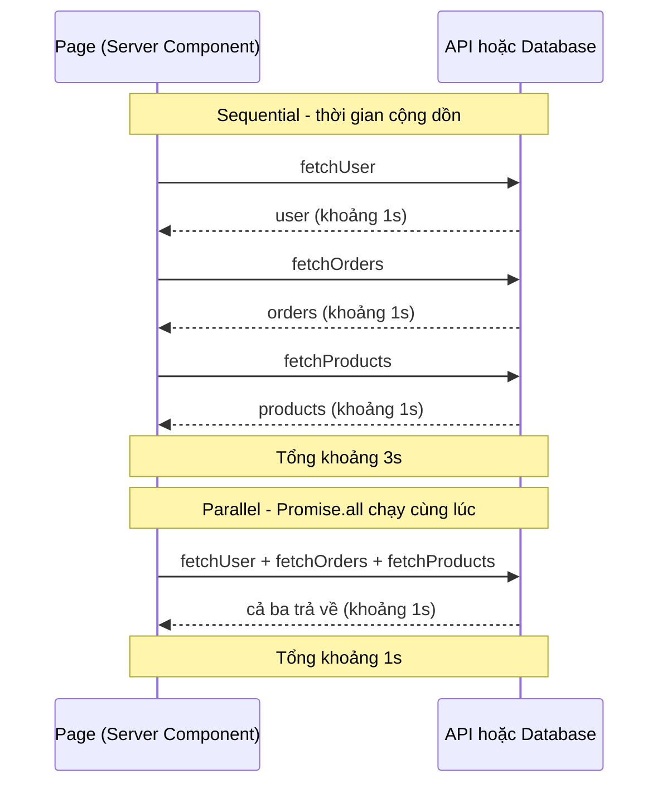

# Data Fetching Patterns

**Data fetching patterns** (các mẫu lấy dữ liệu) là những cách tổ chức việc lấy dữ liệu sao cho trang tải nhanh và mượt hơn. Bài này giới thiệu các kỹ thuật như lấy dữ liệu **parallel** (song song — chạy nhiều request cùng lúc) so với **sequential** (tuần tự — chạy lần lượt), **preloading** (tải trước dữ liệu sớm) và tránh **waterfall** (hiệu ứng thác nước — các request chờ nhau nối tiếp gây chậm). Hiểu các mẫu này giúp người mới tối ưu hiệu năng trong Next.js.

---

:::note[Ghi nhớ nhanh]

- ⭐ **Luôn parallel khi không có dependency** — `await` tuần tự các request độc lập gây waterfall (cộng dồn thời gian); dùng `Promise.all` để tổng thời gian bằng request chậm nhất.
- **Sequential chỉ khi phụ thuộc** — ví dụ lấy `user` trước rồi mới `fetchOrders(user.id)`.
- **Preload để fetch sớm** — gọi fire-and-forget ở layout, child `await` lại cùng request, Next dedupe nên chỉ gọi mạng một lần.
- ⭐ **Streaming + Suspense** — mỗi Suspense boundary resolve độc lập và stream dần; React 19 `use(promise)` cho phép start nhiều promise song song ngay từ đầu.
- **`loading.tsx` vs Suspense thủ công** — `loading.tsx` wrap cả page khi navigation; Suspense thủ công cho từng phần load riêng.
- **Chỉ stream khi data chậm** — data rất nhanh (`<100ms`) thì render một lần tốt hơn; Suspense hữu ích khi data >500ms.

:::

---

## Mục lục

- [Vì sao cần các data fetching pattern?](#vì-sao-cần-các-data-fetching-pattern)
- [Parallel vs Sequential](#parallel-vs-sequential)
- [Preloading Data](#preloading-data)
- [Waterfall Prevention](#waterfall-prevention)
- [Streaming + Suspense](#streaming--suspense)
- [Câu hỏi phỏng vấn](#câu-hỏi-phỏng-vấn)

---

## Vì sao cần các data fetching pattern?

**Vấn đề:** fetch dữ liệu một cách ngây thơ — `await` tuần tự từng cái dù
chúng độc lập — tạo ra **request waterfall**: thời gian cộng dồn, trang chậm.
Tệ hơn, một phần data chậm có thể chặn hiển thị toàn bộ trang.

```tsx
// Waterfall — 3 request độc lập nhưng chạy nối tiếp
async function Page() {
  const header = await fetchHeader();     // 1s
  const list = await fetchList();         // 1s — chỉ start khi header xong
  const sidebar = await fetchSidebar();   // 1s — chỉ start khi list xong
  // Total: 3s, và không gì hiện ra cho tới khi cả 3 xong
}
```

**Giải pháp:** chọn đúng pattern theo quan hệ dữ liệu — **parallel**
(`Promise.all` hoặc khởi tạo promise trước rồi await) cho data độc lập,
**sequential** chỉ khi phụ thuộc nhau, **preload** để fetch sớm,
**request memoization** (Next dedupe fetch trùng), và **streaming + Suspense**
để hiện phần nhanh trước.

```tsx
// Parallel — 3 request độc lập chạy cùng lúc
async function Page() {
  const [header, list, sidebar] = await Promise.all([
    fetchHeader(),
    fetchList(),
    fetchSidebar(),
  ]);
  // Total: max(1s) = 1s
}
```

:::tip[Dùng thực tế]

- **Tải song song** header + list + sidebar của một trang vì chúng không
  phụ thuộc nhau → tổng thời gian bằng request chậm nhất, không cộng dồn.
- **Tuần tự khi bắt buộc**: lấy `user` trước rồi mới `fetchOrders(user.id)`
  vì cần `id` từ bước trước.
- **Stream phần chậm** bằng Suspense: hiện ngay layout + skeleton, phần
  data nặng (chart, thống kê) tự swap vào khi resolve.
- **Tránh fetch trùng**: gọi `preload` ở layout, child `await` lại cùng
  request — Next dedupe nên chỉ gọi mạng một lần.

:::

---

## Parallel vs Sequential

**Sequential** — fetch tuần tự (mỗi cái đợi cái trước):

```tsx
async function Page() {
  const user = await fetchUser();         // 1s
  const orders = await fetchOrders();     // 1s
  const products = await fetchProducts(); // 1s
  // Total: 3s
}
```

**Parallel** — fetch song song:

```tsx
async function Page() {
  const [user, orders, products] = await Promise.all([
    fetchUser(),
    fetchOrders(),
    fetchProducts(),
  ]);
  // Total: max(1s) = 1s
}
```

Quy tắc: **luôn parallel khi không có dependency**.

So sánh dòng thời gian tương tác giữa Page và nguồn dữ liệu — tuần tự cộng dồn, song song gộp lại:



---

## Sequential cần thiết khi có dependency

```tsx
async function Page() {
  const user = await fetchUser();                  // 1s
  const orders = await fetchOrders(user.id);       // 1s — cần user.id
  // Total: 2s (không tránh được)
}
```

---

## Preloading Data

Khi data **sẽ cần** nhưng không phải ngay → preload song song:

```tsx
import { preload } from "@/lib/cache";

async function Page() {
  preload(userId); // trigger fetch nhưng không await

  return (
    <>
      <Header /> {/* render trước */}
      <UserDetail userId={userId} /> {/* await ở đây, đã fetch xong */}
    </>
  );
}

// utils
export async function preload(userId: string) {
  void fetchUser(userId); // fire-and-forget
}
```

**Pattern: preload trong layout** — data fetch khi parent render, sẵn
sàng khi child cần:

```tsx
// app/dashboard/layout.tsx
import { preloadUser } from "@/lib/preload";

export default async function Layout({ children }) {
  preloadUser(); // start fetch
  return <>{children}</>;
}

// app/dashboard/page.tsx
async function Page() {
  const user = await fetchUser(); // dedupe — đã trong cache từ layout
}
```

---

## Waterfall Prevention

**Anti-pattern — Component waterfall**:

```tsx
// SAI — mỗi component await tuần tự
async function Page() {
  return (
    <>
      <User />     {/* await fetchUser */}
      <Orders />   {/* await fetchOrders — chỉ start khi User done */}
      <Products /> {/* await fetchProducts — chỉ start khi Orders done */}
    </>
  );
}
```

Tại sao? Server Component render tuần tự. Mỗi `await` block render kế tiếp.

**Fix** — preload + parallel:

```tsx
async function Page() {
  // Preload ngay đầu
  const userPromise = fetchUser();
  const ordersPromise = fetchOrders();
  const productsPromise = fetchProducts();

  return (
    <>
      <User promise={userPromise} />
      <Orders promise={ordersPromise} />
      <Products promise={productsPromise} />
    </>
  );
}

async function User({ promise }) {
  const user = await promise;
  return <div>{user.name}</div>;
}
```

Hoặc dùng **Suspense + lazy** — Next.js stream khi resolve:

```tsx
function Page() {
  return (
    <>
      <Suspense fallback={<UserSkeleton />}>
        <User />
      </Suspense>
      <Suspense fallback={<OrdersSkeleton />}>
        <Orders />
      </Suspense>
    </>
  );
}

async function User() {
  const user = await fetchUser();
  return <div>{user.name}</div>;
}

async function Orders() {
  const orders = await fetchOrders();
  return <ul>{orders.map(...)}</ul>;
}
```

Mỗi Suspense boundary **independent** — User và Orders fetch song song,
render khi sẵn sàng.

:::info[Phân tích]

**Suspense + Promise pattern (React 19)**:

```tsx
function Page() {
  const userPromise = fetchUser();      // start ngay
  const ordersPromise = fetchOrders();  // start ngay

  return (
    <>
      <Suspense fallback={<Skeleton />}>
        <UserDetail promise={userPromise} />
      </Suspense>
      <Suspense fallback={<Skeleton />}>
        <OrderList promise={ordersPromise} />
      </Suspense>
    </>
  );
}

function UserDetail({ promise }) {
  const user = use(promise); // React 19 use hook
  return <div>{user.name}</div>;
}
```

Lợi ích:

- Cả 2 promise start **song song** ngay từ đầu.
- Mỗi Suspense resolve **độc lập**.
- HTML stream theo từng resolve.

Đây là pattern data fetching **chuẩn nhất** cho App Router 2026.

:::

---

## Streaming + Suspense

Khi component có data nặng → wrap Suspense để stream:

```tsx
import { Suspense } from "react";

export default function Dashboard() {
  return (
    <div>
      <h1>Dashboard</h1>

      <Suspense fallback={<StatsSkeleton />}>
        <Stats />
      </Suspense>

      <Suspense fallback={<ChartSkeleton />}>
        <Chart />
      </Suspense>

      <Suspense fallback={<RecentSkeleton />}>
        <RecentActivity />
      </Suspense>
    </div>
  );
}
```

User experience:

1. Browser nhận HTML "Dashboard" + 3 skeleton **ngay**.
2. Stats resolve sau 0.5s → swap skeleton thành data.
3. Chart resolve sau 1s → swap.
4. RecentActivity resolve sau 2s → swap.

Mỗi phần load **độc lập**, **song song**. So với fetch hết rồi mới render
= 2s nothing visible.

:::tip[Mẹo]

**Loading.tsx vs Suspense thủ công**:

```tsx
// app/dashboard/loading.tsx
export default function Loading() {
  return <PageSkeleton />;
}

// app/dashboard/page.tsx
async function Dashboard() {
  const data = await fetchAll(); // loading.tsx hiển thị
  return <div>{/* ... */}</div>;
}
```

Loading.tsx wrap **toàn page**. Nếu data từng phần load thời gian khác
nhau → user thấy skeleton lâu.

**Suspense thủ công** trong page → cho phép từng phần load độc lập:

```tsx
async function Dashboard() {
  return (
    <>
      <PageHeader /> {/* render ngay với layout */}
      <Suspense fallback={<StatsSkeleton />}>
        <Stats />
      </Suspense>
    </>
  );
}
```

Combo cả hai cho UX tốt nhất:

- `loading.tsx` → khi navigation đến page.
- Suspense con → khi page mount, từng phần load.

:::

:::warning[Cần lưu ý]

**Trade-off của streaming**:

1. **TTFB cao hơn** — server bắt đầu stream nhưng response time đo có
   thể tệ hơn (HTTP header arrived sau).
2. **HTML structure** — phải có placeholder, không phải HTML rỗng.
3. **SEO** — Google crawl được stream HTML, nhưng cẩn thận với critical content.

Khi data load **rất nhanh** (`<100ms`), Suspense không có ích — page render
một lần là tốt hơn. Suspense shine khi:

- Data lâu (>500ms).
- Multiple sources song song.
- UX cần feedback ngay.

:::


---

## Câu hỏi phỏng vấn

Những câu thường gặp về chủ đề này. Tự trả lời trước, rồi đối chiếu lại với nội dung phía trên.

1. `Request waterfall` là gì? Vì sao nó bị coi là thủ phạm số một làm chậm trang trong ứng dụng hiện đại?
2. Cho ba request độc lập, mỗi cái 1 giây. Giải thích tổng thời gian khi chạy tuần tự so với song song, và cách bạn viết lại code để đạt phương án nhanh hơn.
3. Khi nào fetch tuần tự là bắt buộc chứ không phải lỗi thiết kế? Trong tình huống đó còn cách nào rút ngắn thời gian không?
4. So sánh `Promise.all` và `Promise.allSettled` khi lấy dữ liệu cho một dashboard. Một nguồn lỗi thì mỗi cách hành xử ra sao và bạn chọn cái nào?
5. Vì sao đặt nhiều `Server Component` con, mỗi cái tự `await` dữ liệu riêng, vẫn tạo waterfall dù các dữ liệu đó độc lập nhau?
6. Giải thích pattern preload: gọi fire-and-forget ở layout rồi child `await` lại. Cơ chế nào đảm bảo chỉ có đúng một request mạng được gửi đi?
7. `Request Memoization` dedupe dựa trên tiêu chí gì? Với hàm không phải `fetch` (ví dụ query database) thì làm sao để dedupe?
8. Khi bọc một component chậm trong `Suspense`, chuyện gì thực sự xảy ra ở tầng HTTP response? HTML tới trình duyệt theo trình tự nào?
9. Một `Suspense` boundary bao cả trang khác gì nhiều boundary nhỏ theo từng khối? Ảnh hưởng tới trải nghiệm người dùng ra sao?
10. `loading.tsx` và `Suspense` thủ công khác nhau ở phạm vi và thời điểm kích hoạt như thế nào? Khi nào bạn dùng cả hai?
11. React 19 `use(promise)` cho phép làm gì mà `await` trong `Server Component` không làm được? Truyền promise từ Server xuống Client Component có ràng buộc gì?
12. Nêu các trade-off của streaming: `TTFB` đo được, layout shift, và khả năng crawl của công cụ tìm kiếm. Bạn xử lý từng cái ra sao?
13. Khi nào streaming và `Suspense` không đáng dùng, thậm chí làm trang tệ hơn? Ngưỡng nào bạn dùng để quyết định?
14. Client Component fetch trong `useEffect` tạo ra loại waterfall nào khác với waterfall phía server? Cách nào loại bỏ nó?
15. Bạn nghi một trang bị waterfall nhưng không chắc ở đâu. Quy trình đo đạc và các công cụ bạn dùng để xác định là gì?
