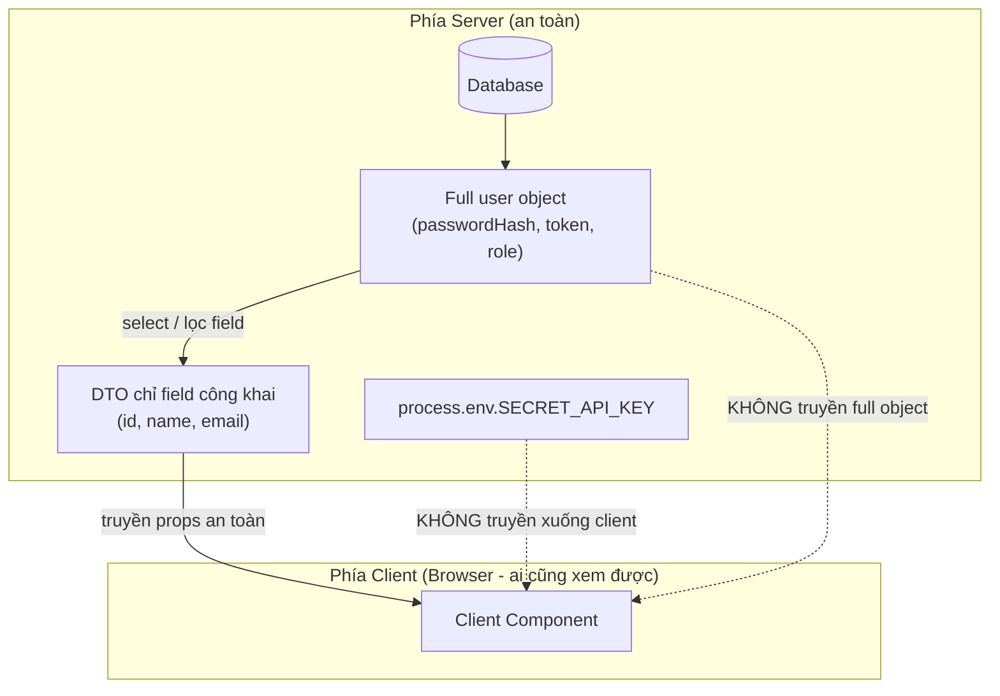

# Sensitive Data và Server Actions

Dữ liệu nhạy cảm (**sensitive data**) là những thông tin bí mật như khóa API, mật khẩu, token mà tuyệt đối không được lộ ra phía trình duyệt. **Server Actions** (hàm chạy trên máy chủ) là cơ chế của Next.js cho phép bạn xử lý logic và truy cập dữ liệu ngay trên server mà không cần tự viết API riêng. Bài này hướng dẫn cách giữ thông tin bí mật ở phía server và tránh rò rỉ ra client khi gửi dữ liệu đi.

[](pathname:///img/nextjs/sensitive-data.webp)

---

:::note[Ghi nhớ nhanh]

- ⭐ **Không truyền secret hay full object xuống Client qua props** — chúng bị nhúng vào client bundle, lộ trong DevTools; chỉ trả DTO đã lọc field bằng Prisma `select`.
- **`server-only` package** — thêm `import "server-only"` vào file server (DB, secret) để build error nếu Client lỡ import.
- **Biến môi trường** — secret để trần (server only); chỉ `NEXT_PUBLIC_*` cho config công khai vì tiền tố này bị inline vào bundle.
- ⭐ **Server Action (`"use server"`)** — thay API route cho mutation internal, type-safe, dùng `useActionState`; nhưng endpoint vẫn public nên phải validate input và access ngay đầu function.
- **`taint` API** — đánh dấu data nhạy cảm để React throw tại build time khi lỡ truyền qua ranh giới Server → Client.

:::

---

## Mục lục

- [Vì sao phải cẩn thận với dữ liệu nhạy cảm?](#vì-sao-phải-cẩn-thận-với-dữ-liệu-nhạy-cảm)
- [Server-only data](#server-only-data)
- [Environment Variables](#environment-variables)
- [Server Actions](#server-actions)
- [Data leak prevention](#data-leak-prevention)
- [Câu hỏi phỏng vấn](#câu-hỏi-phỏng-vấn)

---

## Vì sao phải cẩn thận với dữ liệu nhạy cảm?

Trong App Router, ranh giới server/client khá **mờ** — code Server Component và Client Component nằm cạnh nhau, dễ vô tình kéo secret xuống trình duyệt.

**Vấn đề:**

```tsx
// Server Component
async function Page() {
  const apiKey = process.env.SECRET_API_KEY;
  const user = await db.user.findUnique({ where: { id } });
  // user có: passwordHash, token, role, balance...

  // SAI — truyền secret + full object xuống Client Component qua props
  return <Profile apiKey={apiKey} user={user} />;
}

("use client"); // file Profile.tsx
// apiKey và passwordHash bị NHÚNG vào client bundle → lộ trong DevTools
```

Nếu truyền secret (API key, token, field nhạy cảm của user) từ Server Component xuống Client Component qua props, hoặc dùng biến môi trường sai tiền tố (`NEXT_PUBLIC_*` cho secret), thì secret bị **nhúng vào bundle** gửi xuống trình duyệt → bất kỳ ai cũng đọc được.

**Giải pháp:**

```tsx
// 1. Secret giữ ở server, KHÔNG truyền xuống client
//    Env server không thêm tiền tố NEXT_PUBLIC_
const apiKey = process.env.SECRET_API_KEY; // server only

// 2. Chỉ truyền field cần thiết (DTO) xuống client
const user = await db.user.findUnique({
  where: { id },
  select: { id: true, name: true, email: true }, // bỏ passwordHash, token
});
return <Profile user={user} />;
```

```ts
// lib/db.ts — chặn import nhầm vào client bằng package server-only
import "server-only"; // throw nếu Client Component import file này
```

Giữ dữ liệu nhạy cảm ở **server**: dùng `server-only` chặn import nhầm, chỉ trả field cần thiết (DTO), env secret không có tiền tố `NEXT_PUBLIC_`, và dùng tainting API để cảnh báo khi lỡ truyền object nhạy cảm qua ranh giới.

Sơ đồ dưới minh họa ranh giới server/client: secret và full object phải ở lại server, chỉ DTO đã lọc field mới được vượt ranh giới xuống Client Component:



:::tip[Dùng thực tế]

- **Gọi API key bên thứ ba**: đọc `process.env.SECRET_API_KEY` ngay trong Server Component / Server Action, không bao giờ truyền key xuống client.
- **Trả hồ sơ user**: lọc field bằng Prisma `select` trước khi gửi xuống Client Component, loại `passwordHash`, `token`, `internalNotes`.
- **Module DB**: thêm `import "server-only"` đầu file kết nối database để build error nếu client lỡ import.
- **Biến môi trường**: secret như `STRIPE_SECRET_KEY`, `JWT_SECRET` để trần (server only); chỉ dùng `NEXT_PUBLIC_*` cho config công khai như URL API.

:::

---

## Server-only data

Một số data **không bao giờ** được vào client bundle:

- Database credentials.
- API keys.
- User password, token.
- Internal user data (email khác user, role, balance).

**Pattern dùng `server-only` package**:

```bash
npm install server-only
```

```ts
// lib/db.ts
import "server-only"; // throw nếu import từ client

import { PrismaClient } from "@prisma/client";
export const prisma = new PrismaClient();
```

```tsx
"use client";

// SAI — sẽ build error
import { prisma } from "@/lib/db";
```

Bảo vệ compile-time — không thể vô tình expose.

---

## Environment Variables

Next.js phân loại env:

| Prefix | Available | Use case |
|--------|-----------|----------|
| `DATABASE_URL`, `API_KEY` | **Server only** | Secret |
| `NEXT_PUBLIC_*` | **Server + Client** | Public config |

```env
# .env.local
DATABASE_URL=postgresql://...
JWT_SECRET=...
STRIPE_SECRET_KEY=...

NEXT_PUBLIC_API_URL=https://api.example.com
NEXT_PUBLIC_GA_ID=G-XXXXX
```

```ts
// Server Component / API route — đọc được tất cả
const dbUrl = process.env.DATABASE_URL;
const apiUrl = process.env.NEXT_PUBLIC_API_URL;

// Client Component — chỉ NEXT_PUBLIC_*
const apiUrl = process.env.NEXT_PUBLIC_API_URL; // ✓
const dbUrl = process.env.DATABASE_URL;          // undefined!
```

:::warning[Cần lưu ý]

**Đừng đặt secret trong `NEXT_PUBLIC_*`** — chúng được **inline vào client
bundle**. Bất kỳ ai mở DevTools đều thấy.

```env
# SAI — secret bị expose
NEXT_PUBLIC_STRIPE_SECRET_KEY=sk_live_...
NEXT_PUBLIC_API_TOKEN=...

# ĐÚNG
STRIPE_SECRET_KEY=sk_live_...           # server only
NEXT_PUBLIC_STRIPE_PUBLISHABLE_KEY=pk_  # public OK
```

Stripe có **publishable key** (public OK) và **secret key** (server only)
— đừng nhầm.

:::

**Type-safe env với Zod**:

```ts
// env.ts
import { z } from "zod";

const envSchema = z.object({
  DATABASE_URL: z.string().url(),
  JWT_SECRET: z.string().min(32),
  STRIPE_SECRET_KEY: z.string().startsWith("sk_"),
  NEXT_PUBLIC_API_URL: z.string().url(),
});

export const env = envSchema.parse(process.env);
```

```ts
// lib/db.ts
import { env } from "@/env";
const db = new Client(env.DATABASE_URL); // type-safe
```

Validate at startup → nếu thiếu env, app fail ngay khi start.

---

## Server Actions

**Server Action** = function chạy trên server, gọi từ Client Component.

```tsx
// app/actions.ts
"use server";

import { db } from "@/lib/db";

export async function createUser(formData: FormData) {
  const name = formData.get("name") as string;
  const email = formData.get("email") as string;

  await db.user.create({ data: { name, email } });
}
```

**Gọi từ form**:

```tsx
"use client";

import { createUser } from "@/app/actions";

export default function CreateUserForm() {
  return (
    <form action={createUser}>
      <input name="name" />
      <input name="email" />
      <button type="submit">Create</button>
    </form>
  );
}
```

**Gọi từ JS** — sau button click, không qua form:

```tsx
"use client";

import { createUser } from "@/app/actions";

export default function Button() {
  const handleClick = async () => {
    const formData = new FormData();
    formData.append("name", "An");
    await createUser(formData);
  };

  return <button onClick={handleClick}>Create</button>;
}
```

:::info[Phân tích]

**Server Action thay thế cho API route trong nhiều case**:

| | API Route | Server Action |
|--|-----------|---------------|
| URL accessible | **Có** | Không (internal RPC) |
| Method | GET, POST, PUT, DELETE | POST only |
| Type-safe call | Khai báo thủ công | **Tự động** từ TS |
| Code split | Riêng | Cùng component file |
| Form `action` prop | Không | **Có** (native HTML) |
| Progressive enhancement | Không | **Có** (work no-JS) |
| Public API | **Có** | Không |

**Khi nào API Route, khi nào Server Action?**

| Use case | Dùng |
|----------|------|
| Form submit, button action | **Server Action** |
| Internal mutation, CRUD | **Server Action** |
| Public API cho mobile/third-party | API Route |
| Webhook (Stripe, GitHub) | API Route |
| OAuth callback | API Route |
| File upload phức tạp | API Route hoặc Action với FormData |

Server Action **đơn giản hơn API route** trong 90% case mutation internal.

:::

**Type-safe với Zod**:

```ts
"use server";

import { z } from "zod";

const schema = z.object({
  name: z.string().min(1).max(100),
  email: z.string().email(),
});

export async function createUser(formData: FormData) {
  const result = schema.safeParse({
    name: formData.get("name"),
    email: formData.get("email"),
  });

  if (!result.success) {
    return { error: result.error.flatten() };
  }

  await db.user.create({ data: result.data });
  return { success: true };
}
```

**Action với `useActionState`** (React 19):

```tsx
"use client";

import { useActionState } from "react";
import { createUser } from "./actions";

export default function Form() {
  const [state, formAction, isPending] = useActionState(createUser, null);

  return (
    <form action={formAction}>
      <input name="name" />
      {state?.error?.fieldErrors.name && (
        <p>{state.error.fieldErrors.name[0]}</p>
      )}
      <button disabled={isPending}>{isPending ? "..." : "Save"}</button>
    </form>
  );
}
```

---

## Data leak prevention

**1. Filter response từ Server Component**:

```tsx
// SAI — pass full user object
async function Page() {
  const user = await db.user.findUnique({ where: { id } });
  // user có: password hash, secret_token, internal_notes
  return <UserCard user={user} />; // hash + token vào client!
}

// ĐÚNG — chọn field public
async function Page() {
  const user = await db.user.findUnique({
    where: { id },
    select: { id: true, name: true, email: true }, // không password
  });
  return <UserCard user={user} />;
}
```

**2. Validate access trước query**:

```ts
"use server";

export async function deletePost(postId: string) {
  const session = await getSession();
  if (!session) throw new Error("Unauthorized");

  const post = await db.post.findUnique({ where: { id: postId } });
  if (post.authorId !== session.userId) {
    throw new Error("Forbidden"); // không phải owner
  }

  await db.post.delete({ where: { id: postId } });
}
```

**3. `taint` API** (experimental) — đánh dấu data nhạy cảm:

```ts
import { experimental_taintObjectReference as taint } from "react";

async function getUser(id: string) {
  const user = await db.user.findUnique({ where: { id } });
  taint("Don't pass full user to client", user);
  return user;
}
```

Nếu vô tình pass `user` qua Server → Client boundary, React **throw**
tại build time.

:::tip[Mẹo]

**Quy tắc tổng quát cho data**:

1. **Default: server-only** — load DB trong Server Component.
2. **Whitelist field** trả về (Prisma `select`, Drizzle pick).
3. **Validate access** mọi mutation (Server Action / API route).
4. **`server-only` package** cho file chỉ server.
5. **Env không bao giờ có secret trong `NEXT_PUBLIC_*`**.
6. **Audit dependency** — đảm bảo lib không leak secret (key trong window).

Pattern này gọi là **"Server-first, opt-in client"** — mặc định an toàn.

:::

:::warning[Cần lưu ý]

**Server Action endpoint vẫn public** dù không URL visible:

- Next.js compile thành endpoint hash (vd `/_next/data/...`).
- Hash random nhưng predictable nếu attacker xem source.
- **Phải validate input** ngay đầu function — đừng dựa vào UI.

```ts
"use server";

export async function deleteUser(userId: string) {
  // Đừng giả định "chỉ admin gọi function này"
  const session = await getSession();
  if (session?.role !== "admin") {
    throw new Error("Forbidden"); // BẮT BUỘC check
  }

  await db.user.delete({ where: { id: userId } });
}
```

Nguyên tắc bảo mật: **never trust the client**.

:::


---

## Câu hỏi phỏng vấn

Những câu thường gặp về chủ đề này. Tự trả lời trước, rồi bấm **Xem đáp án** để đối chiếu.

**1. Trong App Router, chính xác thì những gì đi qua ranh giới Server sang Client và bị nhúng vào bundle gửi xuống trình duyệt?**

<details className="qa">
<summary>Xem đáp án</summary>

Có hai luồng khác nhau, đều để lộ dữ liệu:

- **Code của Client Component** (`"use client"`) được đóng gói thành JS bundle tải về trình duyệt. Mọi hằng số, biến `process.env.NEXT_PUBLIC_*` viết trong đó đều nằm nguyên trong file JS, ai mở DevTools cũng đọc được.
- **Props truyền từ Server Component xuống Client Component** được serialize thành payload RSC gửi kèm HTML. Đây là điểm dễ sập nhất: truyền nguyên object user thì `passwordHash`, `token`, `role` đều nằm trong payload dù UI không render chúng.

Ngược lại, code chỉ chạy trong Server Component, biến môi trường không có tiền tố `NEXT_PUBLIC_`, và thân hàm của Server Action thì **không** vào bundle. Quy tắc thực hành: mặc định giữ mọi thứ ở server, chỉ đẩy xuống client DTO đã lọc field bằng Prisma `select`.

</details>

**2. Cơ chế của tiền tố `NEXT_PUBLIC_` là gì? Vì sao đổi giá trị biến đó bắt buộc phải build lại chứ không chỉ restart?**

<details className="qa">
<summary>Xem đáp án</summary>

Next.js phân loại env theo tiền tố:

| Prefix | Đọc được ở đâu | Dùng cho |
|---|---|---|
| `DATABASE_URL`, `API_KEY` | Server only | Secret |
| `NEXT_PUBLIC_*` | Server + Client | Public config |

Với biến `NEXT_PUBLIC_*`, lúc build bundler làm **inline thay thế tĩnh**: mọi chỗ viết `process.env.NEXT_PUBLIC_API_URL` bị thay thẳng bằng chuỗi giá trị trong code đã compile. Trên client không hề tồn tại object `process.env` để tra lúc chạy — giá trị đã "đóng băng" vào file JS.

Vì vậy đổi giá trị trong `.env` rồi chỉ restart là vô ích: bundle cũ vẫn giữ chuỗi cũ. Phải **build lại** để bundler inline giá trị mới. Hệ quả bảo mật: bất kỳ secret nào lỡ đặt dưới `NEXT_PUBLIC_*` đều nằm vĩnh viễn trong bundle đã deploy, xoá env sau đó không cứu được — phải rotate key.

</details>

**3. Bạn truyền nguyên object user lấy từ database xuống `Client Component`. Rủi ro cụ thể là gì và bạn sửa như thế nào?**

<details className="qa">
<summary>Xem đáp án</summary>

Rủi ro: object trả về từ ORM chứa đủ cột của bảng — `passwordHash`, `secret_token`, `internalNotes`, `role`, `balance`. Toàn bộ bị serialize vào payload RSC gửi xuống trình duyệt, kể cả khi component chỉ render mỗi `user.name`. Người dùng bình thường không thấy, nhưng xem network/DevTools là đọc được hết.

Cách sửa — whitelist field ngay tại tầng query:

```tsx
const user = await db.user.findUnique({
  where: { id },
  select: { id: true, name: true, email: true },
});
return <UserCard user={user} />;
```

Nên tạo hẳn một hàm DTO dùng chung (ví dụ `toPublicUser`) để mọi chỗ trả user đều đi qua một cửa, thay vì nhớ viết `select` ở từng query. Kết hợp `taint` cho object gốc để React chặn nếu ai đó lỡ truyền full object qua ranh giới.

</details>

**4. Package `server-only` chặn lỗi ở thời điểm nào và bằng cách nào? Nó khác gì với việc chỉ đặt file trong thư mục `lib/server`?**

<details className="qa">
<summary>Xem đáp án</summary>

`server-only` chặn ở **build time**. Thêm một dòng vào đầu file:

```ts
// lib/db.ts
import "server-only";
import { PrismaClient } from "@prisma/client";
export const prisma = new PrismaClient();
```

Package này có hai bản export khác nhau cho điều kiện môi trường: khi module graph của client kéo nó vào, bản dành cho client cố tình throw, nên bundler báo lỗi build ngay thay vì âm thầm gói code server vào bundle.

Khác biệt với quy ước thư mục: `lib/server` chỉ là **quy ước đặt tên**, không có gì ép buộc. Một ngày nào đó ai đó viết `import { prisma } from "@/lib/server/db"` trong file `"use client"` thì vẫn compile trót lọt, và code kết nối DB cùng chuỗi credentials có thể rò vào bundle. `server-only` biến quy ước mềm thành lỗi cứng, phát hiện ngay ở CI thay vì lúc production.

</details>

**5. So sánh `Server Action` và `Route Handler` trên các trục: khả năng truy cập bằng URL, HTTP method, type safety, progressive enhancement.**

<details className="qa">
<summary>Xem đáp án</summary>

| Tiêu chí | Route Handler (API Route) | Server Action |
|---|---|---|
| Truy cập bằng URL | Có, đường dẫn công khai ổn định | Không có URL do mình đặt (endpoint nội bộ do Next.js sinh) |
| HTTP method | GET, POST, PUT, PATCH, DELETE | POST |
| Type safety | Tự khai báo kiểu request/response thủ công | Tự động từ TypeScript — import hàm là có kiểu |
| Progressive enhancement | Không (phải có JS để fetch) | Có — gắn trực tiếp vào `action` của form, chạy được khi JS chưa load |
| Vị trí code | File route riêng | Cùng nơi với feature, import như hàm thường |

Chọn Server Action cho mutation nội bộ (form submit, CRUD) vì gọn và type-safe. Chọn Route Handler khi cần một URL công khai ổn định: webhook, OAuth callback, API cho app mobile hay bên thứ ba.

</details>

**6. `Server Action` không có URL hiển thị, vậy vì sao vẫn phải kiểm tra xác thực và phân quyền ngay đầu function? Kẻ tấn công gọi nó bằng cách nào?**

<details className="qa">
<summary>Xem đáp án</summary>

Vì mỗi Server Action sau khi build vẫn là một **endpoint HTTP public**, chỉ là được định danh bằng một action id thay vì đường dẫn đẹp. Id đó nằm ngay trong bundle/payload gửi xuống trình duyệt, nên kẻ tấn công chỉ cần xem source hoặc bắt một request hợp lệ rồi tự gửi lại POST với id đó và payload tuỳ ý — không cần đi qua UI, không cần nút bấm nào tồn tại.

Nghĩa là "chỉ admin mới thấy nút xoá" không phải cơ chế bảo mật. Mỗi action phải tự bảo vệ:

```ts
"use server";
export async function deleteUser(userId: string) {
  const session = await getSession();
  if (session?.role !== "admin") throw new Error("Forbidden");
  await db.user.delete({ where: { id: userId } });
}
```

Coi mỗi Server Action như một API endpoint riêng: validate input, xác thực, kiểm tra quyền sở hữu tài nguyên — never trust the client.

</details>

**7. Biến closure mà `Server Action` bắt được từ scope bên ngoài sẽ đi đâu? Next.js xử lý chúng ra sao và vì sao không nên coi đó là biện pháp bảo mật đủ?**

<details className="qa">
<summary>Xem đáp án</summary>

Khi một Server Action được định nghĩa bên trong Server Component và bắt biến từ scope ngoài, giá trị của biến đó phải **đi xuống client rồi quay lại server** trong request gọi action — vì server không giữ state giữa hai request. Next.js mã hoá các giá trị closure này trước khi gửi, bằng khoá gắn với bản build, nên client không đọc trực tiếp được.

Tuy vậy đừng coi đó là lớp bảo mật đủ:

- Dữ liệu vẫn rời khỏi server và nằm trong tay client dưới dạng blob mã hoá — nó vẫn là bề mặt tấn công, và client có thể gửi lại chính blob đó.
- Khoá phụ thuộc build; nhiều instance phải dùng chung khoá, cấu hình sai là hỏng.

Thực hành an toàn: không đưa API key, token, hay full record nhạy cảm vào closure. Chỉ đóng gói định danh tối thiểu (ví dụ `postId`), rồi load lại dữ liệu và kiểm tra quyền ngay trong thân action.

</details>

**8. Vì sao phải validate `FormData` bằng schema (ví dụ `Zod`) ngay trong `Server Action` dù form phía client đã validate rồi?**

<details className="qa">
<summary>Xem đáp án</summary>

Validation ở client chỉ để **trải nghiệm người dùng** — báo lỗi sớm, đỡ round-trip. Nó không ràng buộc gì với kẻ tấn công: action là endpoint public, ai cũng POST thẳng payload bất kỳ được, bỏ qua toàn bộ form.

Ngoài bảo mật còn lý do kiểu dữ liệu: `formData.get("name")` trả về `FormDataEntryValue | null`, ép kiểu bằng `as string` chỉ là lời hứa suông với compiler. Parse bằng schema mới cho dữ liệu vừa đúng kiểu vừa đúng ràng buộc:

```ts
const result = schema.safeParse({
  name: formData.get("name"),
  email: formData.get("email"),
});
if (!result.success) return { error: result.error.flatten() };
await db.user.create({ data: result.data });
```

Dùng `safeParse` để trả lỗi có cấu trúc cho `useActionState` hiển thị, đồng thời chặn mass assignment: chỉ ghi vào DB đúng các field schema cho phép, không đổ thẳng dữ liệu thô từ client.

</details>

**9. Với `useActionState`, bạn trả lỗi về cho người dùng thế nào mà không rò rỉ chi tiết nội bộ như stack trace hay câu SQL?**

<details className="qa">
<summary>Xem đáp án</summary>

Nguyên tắc: action trả về một **object lỗi do mình tự định hình**, không bao giờ ném nguyên exception gốc ra ngoài.

- Lỗi validation: trả cấu trúc đã chuẩn hoá từ Zod, ví dụ `result.error.flatten()` — chỉ chứa tên field và message thân thiện.
- Lỗi hệ thống (DB down, lỗi bên thứ ba): bắt lại, `console.error` phía server để còn debug, rồi trả về một message chung chung như `"Không lưu được, thử lại sau"`.
- Lỗi phân quyền: trả thông điệp trung tính, tránh tiết lộ tài nguyên có tồn tại hay không.

Phía client, `useActionState` chỉ đọc đúng phần đã lọc:

```tsx
const [state, formAction, isPending] = useActionState(createUser, null);
// state?.error?.fieldErrors.name?.[0]
```

Lưu ý giá trị trả về của action cũng đi qua ranh giới server → client, nên đừng nhét record gốc hay object error của ORM vào đó.

</details>

**10. `taint` API (ví dụ `experimental_taintObjectReference`) giải quyết lớp lỗi nào? Nó bắt lỗi ở thời điểm nào và hạn chế của nó là gì?**

<details className="qa">
<summary>Xem đáp án</summary>

Lớp lỗi nó nhắm tới: **vô tình truyền dữ liệu nhạy cảm qua ranh giới Server → Client**, kiểu đưa nguyên object user (có `passwordHash`, `token`) làm props cho Client Component. Thay vì trông chờ code review, bạn đánh dấu ngay tại nguồn:

```ts
import { experimental_taintObjectReference as taint } from "react";

async function getUser(id: string) {
  const user = await db.user.findUnique({ where: { id } });
  taint("Don't pass full user to client", user);
  return user;
}
```

Khi có chỗ nào cố serialize object đã bị taint qua ranh giới, React sẽ throw kèm đúng thông điệp bạn ghi.

Hạn chế:

- Đang là API experimental, cần bật cờ và có thể đổi.
- Chặn theo **tham chiếu object**, nên copy sang object mới hoặc spread field ra là thoát; muốn chặn giá trị riêng lẻ phải dùng biến thể taint giá trị.
- Là lưới an toàn bổ sung, không thay được việc lọc DTO bằng `select`.

</details>

**11. Điều gì bảo vệ `Server Action` khỏi bị gọi chéo trang từ domain khác? Kiểm tra origin và `allowedOrigins` hoạt động ra sao khi có reverse proxy?**

<details className="qa">
<summary>Xem đáp án</summary>

Nhiều lớp cộng lại:

- Server Action chỉ nhận **POST**, nên không bị kích hoạt bởi link hay thẻ `img` đơn thuần.
- Next.js so sánh header `Origin` của request với `Host` của server; lệch nhau thì request bị từ chối — đây là lớp chống CSRF mặc định.
- Cookie phiên nên đặt `SameSite=Lax` (mặc định của trình duyệt) để không bị gửi kèm trong request cross-site.

Vấn đề với reverse proxy: proxy thường ghi đè `Host` thành hostname nội bộ, trong khi `Origin` vẫn là domain người dùng thật, nên so sánh bị lệch và request hợp lệ lại bị chặn. Cách xử lý là khai báo các domain hợp lệ trong `next.config` qua `serverActions.allowedOrigins`, hoặc cấu hình proxy chuyển tiếp đúng header host gốc. Chỉ liệt kê domain mình thực sự sở hữu — đây là allowlist, mở rộng bừa là tự bỏ lớp chống CSRF.

</details>

**12. Một `Server Action` trả về object kết quả cho client. Bạn kiểm soát nội dung trả về thế nào để không vô tình đẩy secret hoặc field nội bộ ra ngoài?**

<details className="qa">
<summary>Xem đáp án</summary>

Giá trị trả về của action cũng bị serialize và gửi xuống trình duyệt y như props, nên phải đối xử với nó như một API response công khai:

- Khai báo **kiểu trả về tường minh** cho action, ví dụ `Promise<{ success: true; id: string } | { error: ... }>`, để TypeScript chặn việc lỡ trả object thừa field.
- Đừng `return` thẳng kết quả của ORM. Map qua DTO hoặc dùng `select` giống như khi truyền props.
- Với mutation, thường chỉ cần trả cờ thành công và id; dữ liệu mới để `revalidatePath` / `revalidateTag` kéo lại từ server.
- Không trả object error gốc (chứa message của driver DB, đôi khi cả câu query hay connection string).

Kết hợp thêm `taint` trên record gốc và review kiểu trả về trong code review; hai thứ này bắt được hầu hết trường hợp lỡ tay.

</details>

**13. Rate limiting cho `Server Action` nên đặt ở đâu và dựa trên khoá nào? Có gì khác so với rate limit một API route thông thường?**

<details className="qa">
<summary>Xem đáp án</summary>

Đặt ở hai chỗ, bổ sung cho nhau:

- **Ngay đầu thân action** — nơi duy nhất biết chắc đang gọi action nào và người dùng nào, nên giới hạn được theo nghiệp vụ (ví dụ 5 lần đổi mật khẩu mỗi giờ).
- **Middleware hoặc lớp edge/WAF phía trước** — chặn lưu lượng thô trước khi chạm vào server và database.

Khoá nên ghép nhiều tầng: id người dùng trong session (chính xác nhất), IP cho khách chưa đăng nhập, cộng thêm định danh của chính action để mỗi thao tác có ngân sách riêng. Bộ đếm phải nằm ở store dùng chung (Redis chẳng hạn) vì serverless có nhiều instance.

Khác với API route: action **không có đường dẫn riêng** để viết rule theo path — mọi action đi qua cùng route và phân biệt bằng action id trong header, nên rule kiểu "giới hạn theo URL" ở tầng proxy gần như vô dụng. Đó là lý do việc chặn trong thân action quan trọng hơn hẳn.

</details>

**14. Liệt kê các tình huống bạn vẫn phải dùng API Route thay vì `Server Action`: webhook, OAuth callback, client mobile. Lý do kỹ thuật của từng cái là gì?**

<details className="qa">
<summary>Xem đáp án</summary>

Điểm chung: khi **bên ngoài cần một URL ổn định** hoặc method khác POST thì Server Action không đáp ứng được.

- **Webhook** (Stripe, GitHub): nhà cung cấp cần một URL cố định để đăng ký, và cần đọc raw body cùng header chữ ký để verify. Action không có URL do mình đặt và không phù hợp cho luồng này.
- **OAuth callback**: provider redirect người dùng bằng **GET** kèm `code` và `state` trên query string. Action chỉ nhận POST nên không xử lý được redirect.
- **Client mobile / bên thứ ba**: cần hợp đồng API công khai, ổn định qua các bản build, nhiều method, phiên bản hoá. Action là RPC nội bộ, định danh sinh ra lúc build, không phải API để công bố.
- Ngoài ra: endpoint trả file/stream, health check, cron endpoint — đều cần GET hoặc URL cố định.

Còn lại — form submit, CRUD nội bộ — dùng Server Action gọn và an toàn hơn.

</details>

**15. Mô tả quy trình bạn dùng để audit một codebase Next.js xem có secret nào đang bị đẩy xuống client bundle hay không.**

<details className="qa">
<summary>Xem đáp án</summary>

Quy trình thực dụng, từ rẻ đến tốn công:

1. **Soát biến môi trường**: liệt kê mọi `NEXT_PUBLIC_*` và xác nhận từng cái đúng là công khai (URL API, GA id, publishable key của Stripe). Bất cứ thứ gì trông như `sk_`, `secret`, `token` là báo động đỏ.
2. **Grep trong bundle đã build**: build production rồi tìm chuỗi nhạy cảm trong thư mục output — tên biến secret, tiền tố key, domain nội bộ. Đây là bằng chứng chắc chắn nhất vì nó soi đúng thứ người dùng tải về.
3. **Rà ranh giới server/client**: tìm các file `"use client"` và xem props chúng nhận — có chỗ nào nhận nguyên object từ ORM thay vì DTO không.
4. **Ép bằng công cụ**: thêm `import "server-only"` vào mọi module DB/secret, bật `taint` cho record nhạy cảm, validate env bằng Zod ở startup.
5. **Chốt chặn CI**: chạy secret scanner và bước grep bundle trong pipeline. Secret nào từng lọt ra bundle đã deploy thì phải rotate, xoá code là chưa đủ.

</details>
