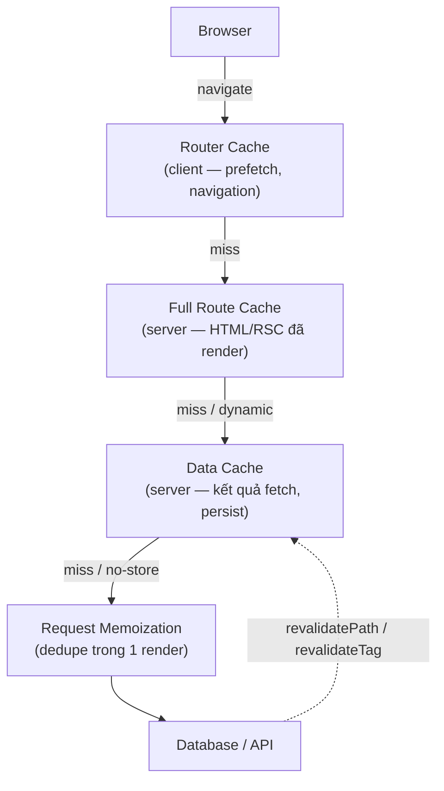

# Caching Layers

**Caching** (lưu đệm) là việc lưu lại kết quả đã tính toán hoặc dữ liệu đã lấy về để lần sau dùng lại ngay mà không phải làm lại từ đầu, giúp trang web nhanh hơn. Next.js có nhiều **layer** (tầng) cache khác nhau, mỗi tầng phục vụ một mục đích riêng. Bài này giới thiệu các tầng cache đó để bạn hiểu dữ liệu được lưu ở đâu và khi nào.

---

:::note[Ghi nhớ nhanh]

- ⭐ **4 layer cache** — Request Memoization (dedupe trong 1 render) → Data Cache (persist giữa request) → Full Route Cache (HTML đã render) → Router Cache (navigation phía client).
- ⭐ **Next.js 15 đổi default** — `fetch()` KHÔNG cache mặc định (`no-store`); phải opt-in `cache: "force-cache"` hoặc `next: { revalidate }`.
- **Request Memoization** — tự động cho `fetch`; hàm non-fetch (vd DB query) dùng `cache()` của React để dedupe.
- **Data Cache** — làm mới bằng `revalidatePath` / `revalidateTag`; gắn `tags` khi fetch để revalidate theo nhóm.
- **Full Route Cache** — điều khiển bằng `dynamic = "force-static" / "force-dynamic"` và `revalidate`.
- **Dữ liệu user-specific phải `cache: "no-store"`** — nếu quên, mọi user share chung một bản cache sai.

:::

---

## Mục lục

- [Vì sao Next.js có nhiều lớp cache?](#vì-sao-nextjs-có-nhiều-lớp-cache)
- [4 layer cache](#4-layer-cache)
- [Fetch Cache](#fetch-cache)
- [Request Memoization](#request-memoization)
- [Data Cache](#data-cache)
- [Full Route Cache](#full-route-cache)
- [Router Cache (Client)](#router-cache-client)
- [Câu hỏi phỏng vấn](#câu-hỏi-phỏng-vấn)

---

## Vì sao Next.js có nhiều lớp cache?

**Vấn đề:** Nếu mỗi request đều fetch lại API/DB và render lại HTML từ đầu thì trang chậm, tốn tài nguyên server và đội chi phí. Nhưng nếu chỉ có một kiểu cache "tất cả hoặc không gì" thì dễ phục vụ dữ liệu cũ sai chỗ. Một request có thể gọi trùng cùng một API ở nhiều component, dữ liệu ít đổi lại bị query liên tục, trang tĩnh vẫn render lại mỗi lần, và điều hướng client thì giật vì phải tải lại từ server.

```tsx
// Mỗi request: gọi trùng + query lại + render lại từ đầu → chậm, tốn kém
async function Header()  { const u = await fetch("/api/user").then(r => r.json()); /* call 1 */ }
async function Sidebar() { const u = await fetch("/api/user").then(r => r.json()); /* call 2 trùng */ }

async function Page() {
  const cfg = await fetch("/api/config").then(r => r.json()); // ít đổi nhưng query mỗi request
  return <>{/* render lại toàn bộ HTML mỗi lần */}</>;
}
```

**Giải pháp:** Next.js tách thành **nhiều lớp cache**, mỗi lớp một mục đích, để cache đúng mức và làm mới đúng lúc:

```tsx
// 1. Request Memoization — dedupe fetch trùng trong CÙNG một request
async function Header()  { const u = await fetch("/api/user").then(r => r.json()); } // 1 HTTP call
async function Sidebar() { const u = await fetch("/api/user").then(r => r.json()); } // dùng lại, không gọi lại

// 2. Data Cache — lưu kết quả fetch GIỮA các request, có thể revalidate
const cfg = await fetch("/api/config", { next: { revalidate: 3600 } }).then(r => r.json());

// 3. Full Route Cache — HTML/RSC tĩnh build sẵn, phục vụ ngay
export const dynamic = "force-static";

// 4. Router Cache — điều hướng client mượt nhờ prefetch
// <Link href="/dashboard" prefetch>Dashboard</Link>
```

:::tip[Dùng thực tế]

- **Dedupe gọi cùng API:** Header và Sidebar cùng gọi `/api/user` trong một render → **Request Memoization** gộp thành 1 HTTP call.
- **Cache dữ liệu ít đổi:** config, tỷ giá, thời tiết → **Data Cache** với `revalidate` để vài giờ mới làm mới một lần.
- **Phục vụ trang tĩnh:** landing page, bài blog → **Full Route Cache** trả HTML build sẵn, không render lại.
- **Điều hướng nhanh:** hover link là **Router Cache** prefetch trước, click chuyển trang gần như tức thì.

:::

---

## 4 layer cache

Next.js App Router có **4 layer cache**:

```
[Browser]
    ↓
Router Cache (client-side, navigation)
    ↓
Full Route Cache (server, rendered HTML)
    ↓
Data Cache (server, fetch results — persist)
    ↓
Request Memoization (per request, React cache)
    ↓
[Database / API]
```

Request chỉ đi xuống tầng dưới khi tầng trên **miss**; mũi tên nét đứt là đường làm mới cache chủ động:



| Layer | Vị trí | Lifetime | Mục đích |
|-------|--------|----------|----------|
| Request Memoization | Server, per request | 1 render | Dedupe fetch trùng |
| Data Cache | Server, persistent | Until revalidate | Share data giữa request |
| Full Route Cache | Server, persistent | Until rebuild/revalidate | Pre-rendered HTML |
| Router Cache | Browser | Session/30s | Navigation tức thì |

---

## Fetch Cache

`fetch()` trong Server Component **mặc định cache**:

```tsx
async function Page() {
  // Cache mãi mãi (cho đến rebuild)
  const data = await fetch("/api/data").then(r => r.json());

  // Cache với revalidate
  const data2 = await fetch("/api/data", {
    next: { revalidate: 60 },
  }).then(r => r.json());

  // Không cache (dynamic)
  const data3 = await fetch("/api/data", {
    cache: "no-store",
  }).then(r => r.json());

  // Cache với tag (cho revalidateTag)
  const data4 = await fetch("/api/data", {
    next: { tags: ["users"] },
  }).then(r => r.json());
}
```

:::warning[Cần lưu ý]

**Next.js 15 thay đổi default cache behavior**:

- **Next.js 14 và trước**: `fetch()` cache mặc định (`force-cache`).
- **Next.js 15**: `fetch()` **không cache mặc định** (`no-store`).

Đây là **breaking change** quan trọng. Phải khai báo `cache: "force-cache"`
hoặc `next: { revalidate }` để cache:

```ts
// Next.js 15
await fetch(url);                                          // KHÔNG cache
await fetch(url, { cache: "force-cache" });                // cache
await fetch(url, { next: { revalidate: 60 } });            // ISR
```

Lý do thay đổi: developer thường confused tại sao data không refresh.
Default "no cache" trực giác hơn — phải opt-in cache.

:::

---

## Request Memoization

**Trong 1 render**, cùng `fetch(url)` chỉ chạy **1 lần** dù gọi nhiều
component:

```tsx
// Component A
async function Header() {
  const user = await fetch("/api/user").then(r => r.json());
  return <p>{user.name}</p>;
}

// Component B
async function Sidebar() {
  const user = await fetch("/api/user").then(r => r.json()); // dedupe
  return ;
}

// Cùng render
function Page() {
  return <><Header /><Sidebar /></>; // 1 HTTP call cho /api/user
}
```

Memoization theo URL + method + options. Tự động cho `fetch`. Cho function
không phải `fetch`, dùng `cache()` từ React:

```ts
import { cache } from "react";

export const getUser = cache(async (id: string) => {
  return await db.user.findUnique({ where: { id } });
});
```

```tsx
// Cùng id → chỉ query DB 1 lần
const a = await getUser("123"); // hit DB
const b = await getUser("123"); // cache, không hit DB
```

---

## Data Cache

**Persist giữa các request** — server-side cache cho fetch result.

```tsx
// Cache mãi (Static)
fetch(url, { cache: "force-cache" });

// ISR
fetch(url, { next: { revalidate: 60 } });

// Cache với tag
fetch(url, { next: { tags: ["products"] } });

// Skip cache
fetch(url, { cache: "no-store" });
```

**Revalidate**:

```ts
import { revalidatePath, revalidateTag } from "next/cache";

// Sau khi update DB
await db.product.update({ ... });

revalidatePath("/products");          // revalidate route
revalidateTag("products");            // revalidate mọi fetch có tag "products"
```

---

## Full Route Cache

Server cache **HTML đã render** của static route.

Build output cho biết:

```
○ /                Static
○ /about           Static
ƒ /dashboard       Dynamic
● /blog/[slug]     ISR
```

- **Static**: cache mãi (rebuild để update).
- **ISR**: cache + auto revalidate.
- **Dynamic**: không cache, render mỗi request.

```ts
// Force route static
export const dynamic = "force-static";

// Force dynamic
export const dynamic = "force-dynamic";

// Revalidate time cho cả route
export const revalidate = 3600;
```

---

## Router Cache (Client)

**Client-side cache** cho navigation — pre-fetch route khi user hover link.

```tsx
import Link from "next/link";

<Link href="/dashboard" prefetch>  {/* default true */}
  Dashboard
</Link>
```

Khi user hover link → Next.js prefetch route + data. Click → navigation
gần như **instant**.

`prefetch={false}` để tắt:

```tsx
<Link href="/heavy-page" prefetch={false}>...</Link>
```

:::info[Phân tích]

**Caching strategy theo content type**:

| Content | Cache | Lý do |
|---------|-------|-------|
| Marketing page | Static (force-cache) | Không đổi |
| Blog post | ISR (revalidate 3600s) | Update thỉnh thoảng |
| Product page | ISR + on-demand revalidate | Update khi admin sửa |
| User dashboard | Dynamic (no-store) | User-specific |
| Real-time data | no-store + client polling | Live |
| Static API (currency, weather) | Cache 1h | Slow change |

**Pattern phổ biến e-commerce**:

```tsx
// app/products/[slug]/page.tsx
export default async function Product({ params }) {
  const { slug } = await params;
  const product = await fetch(`/api/products/${slug}`, {
    next: { tags: [`product-${slug}`] },
  }).then(r => r.json());

  return <ProductDetail product={product} />;
}

// Khi admin update product → trigger revalidate
// app/api/admin/products/[id]/route.ts
import { revalidateTag } from "next/cache";

export async function PUT(request) {
  await updateProduct(...);
  revalidateTag(`product-${id}`);
  return Response.json({ ok: true });
}
```

Lợi ích:

- Page load **instant** (cached HTML).
- Update **lập tức** khi admin sửa (revalidateTag).
- Không tốn DB query cho mỗi user view.

:::

:::tip[Mẹo]

**Debug cache** — Next.js dev console hiện cache hit/miss:

```bash
npm run dev
```

```
GET /products/abc 200 in 50ms (cache: HIT)
GET /products/xyz 200 in 500ms (cache: MISS)
```

Tools:

- **Next.js DevTools** (experimental) — visualize cache.
- **`console.log` trong fetch** — kiểm tra gọi hay không.
- **`x-vercel-cache` header** trên Vercel — hit/miss/stale.

:::

:::warning[Cần lưu ý]

**Cache bug phổ biến**:

**1. Forgot `cache: "no-store"` cho user-specific**:

```ts
async function ProfilePage({ params }) {
  // Mọi user share cache → SAI
  const user = await fetch(`/api/users/${params.id}`).then(r => r.json());
}

// Fix
const user = await fetch(`/api/users/${params.id}`, {
  cache: "no-store",
}).then(r => r.json());
```

**2. Tag không revalidate**:

```ts
fetch(url, { next: { tags: ["users"] } });

// Khi revalidate
revalidateTag("users"); // chú ý chữ — case sensitive
```

**3. Path không match revalidate**:

```ts
revalidatePath("/products"); // không revalidate /products/[slug]

revalidatePath("/products", "page");      // page only
revalidatePath("/products", "layout");    // layout + children
revalidatePath("/products/[slug]", "page"); // dynamic route
```

Test cache thoroughly — đây là source bug khó debug.

:::


---

## Câu hỏi phỏng vấn

Những câu thường gặp về chủ đề này. Tự trả lời trước, rồi đối chiếu lại với nội dung phía trên.

1. Kể tên bốn tầng cache của App Router. Với mỗi tầng, nêu nó nằm ở đâu (server hay client), sống bao lâu và giải quyết vấn đề gì.
2. `Request Memoization` và `Data Cache` khác nhau thế nào? Cùng một `fetch` lặp lại thì tầng nào bắt trước?
3. `Request Memoization` dedupe dựa trên khoá nào? Hai lời gọi cùng URL nhưng khác header có được coi là trùng không?
4. Với hàm không phải `fetch` — ví dụ một query Prisma — làm sao để dedupe trong cùng một render? `cache()` của React hoạt động ra sao?
5. Next.js 15 đổi mặc định của `fetch` sang không cache. Vì sao họ đổi, và bạn rà soát một codebase nâng cấp từ Next.js 14 như thế nào?
6. So sánh `cache: "force-cache"`, `next: { revalidate: 60 }` và `cache: "no-store"`. Mỗi lựa chọn tác động tới tầng cache nào?
7. Điều gì khiến một route chuyển từ static sang dynamic? Kể các API làm route bị opt out khỏi `Full Route Cache`.
8. Đọc build output thấy ký hiệu static, dynamic và ISR — giải thích ý nghĩa từng loại và cách một trang cụ thể rơi vào loại nào.
9. `export const dynamic = "force-static"` và `"force-dynamic"` thay đổi hành vi gì? Chuyện gì xảy ra nếu bạn ép static một trang có gọi `cookies()`?
10. `Router Cache` nằm ở đâu và tồn tại bao lâu? Vì sao người dùng vẫn thấy dữ liệu cũ dù server đã revalidate xong?
11. `router.refresh()` làm gì và không làm gì? Nó khác `revalidatePath` ra sao về phạm vi tác động?
12. Prefetch của `Link` lấy trước những gì? Khi nào bạn tắt prefetch và cái giá phải trả là gì?
13. `Data Cache` dùng chung giữa mọi người dùng. Mô tả cách một trang hồ sơ cá nhân có thể phục vụ nhầm dữ liệu người khác và cách phòng.
14. Gọi `cookies()` hoặc `headers()` trong một component ảnh hưởng thế nào tới khả năng cache của cả route? Bạn khoanh vùng tác động đó ra sao?
15. Phân biệt SSG, ISR và SSR trong App Router theo cách các tầng cache tham gia, chứ không chỉ theo tên gọi.
16. Vì sao `revalidatePath("/products")` không làm mới `/products/abc`? Cần viết thế nào cho đúng với dynamic route?
17. Bạn debug một nghi vấn cache như thế nào? Nêu các dấu hiệu và công cụ dùng để xác định cache hit hay miss.
18. Khi self-host thay vì deploy trên Vercel, `Data Cache` và `Full Route Cache` được lưu ở đâu? Chạy nhiều instance thì phát sinh vấn đề gì?
19. Thiết kế chiến lược cache cho một site thương mại điện tử có trang marketing, danh sách sản phẩm, trang chi tiết và giỏ hàng. Giải thích lựa chọn cho từng loại trang.
