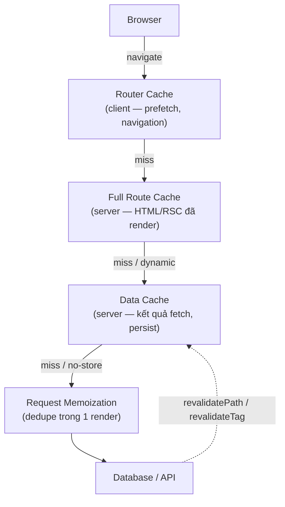

# Caching Layers

**Caching** (lưu đệm) là việc lưu lại kết quả đã tính toán hoặc dữ liệu đã lấy về để lần sau dùng lại ngay mà không phải làm lại từ đầu, giúp trang web nhanh hơn. Next.js có nhiều **layer** (tầng) cache khác nhau, mỗi tầng phục vụ một mục đích riêng. Bài này giới thiệu các tầng cache đó để bạn hiểu dữ liệu được lưu ở đâu và khi nào.

[](pathname:///img/nextjs/caching.webp)

---

:::note[Ghi nhớ nhanh]

- ⭐ **4 layer cache** — Request Memoization (dedupe trong 1 render) → Data Cache (persist giữa request) → Full Route Cache (HTML đã render) → Router Cache (navigation phía client).
- ⭐ **Next.js 15 đổi default** — `fetch()` KHÔNG cache mặc định (`no-store`); phải opt-in `cache: "force-cache"` hoặc `next: { revalidate }`.
- **Request Memoization** — tự động cho `fetch`; hàm non-fetch (vd DB query) dùng `cache()` của React để dedupe.
- **Data Cache** — làm mới bằng `revalidatePath` / `revalidateTag`; gắn `tags` khi fetch để revalidate theo nhóm.
- **Full Route Cache** — điều khiển bằng `dynamic = "force-static" / "force-dynamic"` và `revalidate`.
- **Dữ liệu user-specific phải `cache: "no-store"`** — nếu quên, mọi user share chung một bản cache sai.

:::

---

## Mục lục

- [Vì sao Next.js có nhiều lớp cache?](#vì-sao-nextjs-có-nhiều-lớp-cache)
- [4 layer cache](#4-layer-cache)
- [Fetch Cache](#fetch-cache)
- [Request Memoization](#request-memoization)
- [Data Cache](#data-cache)
- [Full Route Cache](#full-route-cache)
- [Router Cache (Client)](#router-cache-client)
- [Câu hỏi phỏng vấn](#câu-hỏi-phỏng-vấn)

---

## Vì sao Next.js có nhiều lớp cache?

**Vấn đề:** Nếu mỗi request đều fetch lại API/DB và render lại HTML từ đầu thì trang chậm, tốn tài nguyên server và đội chi phí. Nhưng nếu chỉ có một kiểu cache "tất cả hoặc không gì" thì dễ phục vụ dữ liệu cũ sai chỗ. Một request có thể gọi trùng cùng một API ở nhiều component, dữ liệu ít đổi lại bị query liên tục, trang tĩnh vẫn render lại mỗi lần, và điều hướng client thì giật vì phải tải lại từ server.

```tsx
// Mỗi request: gọi trùng + query lại + render lại từ đầu → chậm, tốn kém
async function Header()  { const u = await fetch("/api/user").then(r => r.json()); /* call 1 */ }
async function Sidebar() { const u = await fetch("/api/user").then(r => r.json()); /* call 2 trùng */ }

async function Page() {
  const cfg = await fetch("/api/config").then(r => r.json()); // ít đổi nhưng query mỗi request
  return <>{/* render lại toàn bộ HTML mỗi lần */}</>;
}
```

**Giải pháp:** Next.js tách thành **nhiều lớp cache**, mỗi lớp một mục đích, để cache đúng mức và làm mới đúng lúc:

```tsx
// 1. Request Memoization — dedupe fetch trùng trong CÙNG một request
async function Header()  { const u = await fetch("/api/user").then(r => r.json()); } // 1 HTTP call
async function Sidebar() { const u = await fetch("/api/user").then(r => r.json()); } // dùng lại, không gọi lại

// 2. Data Cache — lưu kết quả fetch GIỮA các request, có thể revalidate
const cfg = await fetch("/api/config", { next: { revalidate: 3600 } }).then(r => r.json());

// 3. Full Route Cache — HTML/RSC tĩnh build sẵn, phục vụ ngay
export const dynamic = "force-static";

// 4. Router Cache — điều hướng client mượt nhờ prefetch
// <Link href="/dashboard" prefetch>Dashboard</Link>
```

:::tip[Dùng thực tế]

- **Dedupe gọi cùng API:** Header và Sidebar cùng gọi `/api/user` trong một render → **Request Memoization** gộp thành 1 HTTP call.
- **Cache dữ liệu ít đổi:** config, tỷ giá, thời tiết → **Data Cache** với `revalidate` để vài giờ mới làm mới một lần.
- **Phục vụ trang tĩnh:** landing page, bài blog → **Full Route Cache** trả HTML build sẵn, không render lại.
- **Điều hướng nhanh:** hover link là **Router Cache** prefetch trước, click chuyển trang gần như tức thì.

:::

---

## 4 layer cache

Next.js App Router có **4 layer cache**:

```
[Browser]
    ↓
Router Cache (client-side, navigation)
    ↓
Full Route Cache (server, rendered HTML)
    ↓
Data Cache (server, fetch results — persist)
    ↓
Request Memoization (per request, React cache)
    ↓
[Database / API]
```

Request chỉ đi xuống tầng dưới khi tầng trên **miss**; mũi tên nét đứt là đường làm mới cache chủ động:



| Layer | Vị trí | Lifetime | Mục đích |
|-------|--------|----------|----------|
| Request Memoization | Server, per request | 1 render | Dedupe fetch trùng |
| Data Cache | Server, persistent | Until revalidate | Share data giữa request |
| Full Route Cache | Server, persistent | Until rebuild/revalidate | Pre-rendered HTML |
| Router Cache | Browser | Session/30s | Navigation tức thì |

---

## Fetch Cache

Từ Next.js 15, `fetch()` trong Server Component **mặc định KHÔNG cache** — phải
opt-in bằng `cache: "force-cache"` hoặc `next: { revalidate }`:

```tsx
async function Page() {
  // Không cache — mặc định của Next.js 15
  const data0 = await fetch("/api/data").then(r => r.json());

  // Cache mãi mãi (cho đến rebuild) — phải khai báo tường minh
  const data = await fetch("/api/data", {
    cache: "force-cache",
  }).then(r => r.json());

  // Cache với revalidate
  const data2 = await fetch("/api/data", {
    next: { revalidate: 60 },
  }).then(r => r.json());

  // Không cache (dynamic)
  const data3 = await fetch("/api/data", {
    cache: "no-store",
  }).then(r => r.json());

  // Cache với tag (cho revalidateTag)
  const data4 = await fetch("/api/data", {
    next: { tags: ["users"] },
  }).then(r => r.json());
}
```

:::warning[Cần lưu ý]

**Next.js 15 thay đổi default cache behavior**:

- **Next.js 14 và trước**: `fetch()` cache mặc định (`force-cache`).
- **Next.js 15**: `fetch()` **không cache mặc định** (`no-store`).

Đây là **breaking change** quan trọng. Phải khai báo `cache: "force-cache"`
hoặc `next: { revalidate }` để cache:

```ts
// Next.js 15
await fetch(url);                                          // KHÔNG cache
await fetch(url, { cache: "force-cache" });                // cache
await fetch(url, { next: { revalidate: 60 } });            // ISR
```

Lý do thay đổi: developer thường confused tại sao data không refresh.
Default "no cache" trực giác hơn — phải opt-in cache.

:::

---

## Request Memoization

**Trong 1 render**, cùng `fetch(url)` chỉ chạy **1 lần** dù gọi nhiều
component:

```tsx
// Component A
async function Header() {
  const user = await fetch("/api/user").then(r => r.json());
  return <p>{user.name}</p>;
}

// Component B
async function Sidebar() {
  const user = await fetch("/api/user").then(r => r.json()); // dedupe
  return ;
}

// Cùng render
function Page() {
  return <><Header /><Sidebar /></>; // 1 HTTP call cho /api/user
}
```

Memoization theo URL + method + options. Tự động cho `fetch`. Cho function
không phải `fetch`, dùng `cache()` từ React:

```ts
import { cache } from "react";

export const getUser = cache(async (id: string) => {
  return await db.user.findUnique({ where: { id } });
});
```

```tsx
// Cùng id → chỉ query DB 1 lần
const a = await getUser("123"); // hit DB
const b = await getUser("123"); // cache, không hit DB
```

---

## Data Cache

**Persist giữa các request** — server-side cache cho fetch result.

```tsx
// Cache mãi (Static)
fetch(url, { cache: "force-cache" });

// ISR
fetch(url, { next: { revalidate: 60 } });

// Cache với tag
fetch(url, { next: { tags: ["products"] } });

// Skip cache
fetch(url, { cache: "no-store" });
```

**Revalidate**:

```ts
import { revalidatePath, revalidateTag } from "next/cache";

// Sau khi update DB
await db.product.update({ ... });

revalidatePath("/products");          // revalidate route
revalidateTag("products");            // revalidate mọi fetch có tag "products"
```

---

## Full Route Cache

Server cache **HTML đã render** của static route.

Build output cho biết:

```
○ /                Static
○ /about           Static
ƒ /dashboard       Dynamic
● /blog/[slug]     ISR
```

- **Static**: cache mãi (rebuild để update).
- **ISR**: cache + auto revalidate.
- **Dynamic**: không cache, render mỗi request.

```ts
// Force route static
export const dynamic = "force-static";

// Force dynamic
export const dynamic = "force-dynamic";

// Revalidate time cho cả route
export const revalidate = 3600;
```

---

## Router Cache (Client)

**Client-side cache** cho navigation — pre-fetch route khi user hover link.

```tsx
import Link from "next/link";

<Link href="/dashboard" prefetch>  {/* default true */}
  Dashboard
</Link>
```

Khi user hover link → Next.js prefetch route + data. Click → navigation
gần như **instant**.

`prefetch={false}` để tắt:

```tsx
<Link href="/heavy-page" prefetch={false}>...</Link>
```

:::info[Phân tích]

**Caching strategy theo content type**:

| Content | Cache | Lý do |
|---------|-------|-------|
| Marketing page | Static (force-cache) | Không đổi |
| Blog post | ISR (revalidate 3600s) | Update thỉnh thoảng |
| Product page | ISR + on-demand revalidate | Update khi admin sửa |
| User dashboard | Dynamic (no-store) | User-specific |
| Real-time data | no-store + client polling | Live |
| Static API (currency, weather) | Cache 1h | Slow change |

**Pattern phổ biến e-commerce**:

```tsx
// app/products/[slug]/page.tsx
export default async function Product({ params }) {
  const { slug } = await params;
  const product = await fetch(`/api/products/${slug}`, {
    next: { tags: [`product-${slug}`] },
  }).then(r => r.json());

  return <ProductDetail product={product} />;
}

// Khi admin update product → trigger revalidate
// app/api/admin/products/[id]/route.ts
import { revalidateTag } from "next/cache";

export async function PUT(request) {
  await updateProduct(...);
  revalidateTag(`product-${id}`);
  return Response.json({ ok: true });
}
```

Lợi ích:

- Page load **instant** (cached HTML).
- Update **lập tức** khi admin sửa (revalidateTag).
- Không tốn DB query cho mỗi user view.

:::

:::tip[Mẹo]

**Debug cache** — Next.js dev console hiện cache hit/miss:

```bash
npm run dev
```

```
GET /products/abc 200 in 50ms (cache: HIT)
GET /products/xyz 200 in 500ms (cache: MISS)
```

Tools:

- **Next.js DevTools** (experimental) — visualize cache.
- **`console.log` trong fetch** — kiểm tra gọi hay không.
- **`x-vercel-cache` header** trên Vercel — hit/miss/stale.

:::

:::warning[Cần lưu ý]

**Cache bug phổ biến**:

**1. Forgot `cache: "no-store"` cho user-specific**:

```ts
async function ProfilePage({ params }) {
  // Mọi user share cache → SAI
  const user = await fetch(`/api/users/${params.id}`).then(r => r.json());
}

// Fix
const user = await fetch(`/api/users/${params.id}`, {
  cache: "no-store",
}).then(r => r.json());
```

**2. Tag không revalidate**:

```ts
fetch(url, { next: { tags: ["users"] } });

// Khi revalidate
revalidateTag("users"); // chú ý chữ — case sensitive
```

**3. Path không match revalidate**:

```ts
revalidatePath("/products"); // không revalidate /products/[slug]

revalidatePath("/products", "page");      // page only
revalidatePath("/products", "layout");    // layout + children
revalidatePath("/products/[slug]", "page"); // dynamic route
```

Test cache thoroughly — đây là source bug khó debug.

:::


---

## Câu hỏi phỏng vấn

Những câu thường gặp về chủ đề này. Tự trả lời trước, rồi bấm **Xem đáp án** để đối chiếu.

**1. Kể tên bốn tầng cache của App Router. Với mỗi tầng, nêu nó nằm ở đâu (server hay client), sống bao lâu và giải quyết vấn đề gì.**

<details className="qa">
<summary>Xem đáp án</summary>

| Layer | Vị trí | Lifetime | Mục đích |
|---|---|---|---|
| Request Memoization | Server, per request | 1 lần render | Dedupe fetch trùng trong cùng một request |
| Data Cache | Server, persistent | Đến khi revalidate | Chia sẻ kết quả fetch giữa các request |
| Full Route Cache | Server, persistent | Đến khi rebuild / revalidate | Phục vụ HTML + payload RSC đã render sẵn |
| Router Cache | Browser | Theo phiên, có thời gian stale ngắn | Điều hướng client gần như tức thì |

Thứ tự request đi qua: từ trình duyệt vào Router Cache → Full Route Cache → Data Cache → Request Memoization → cuối cùng mới tới database/API. Mỗi tầng chỉ đi xuống tầng dưới khi **miss**. Hiểu thứ tự này rất quan trọng khi debug: dữ liệu cũ có thể kẹt ở bất kỳ tầng nào, và `revalidateTag` chỉ chạm tới Data Cache chứ không tự động dọn cache nằm trong trình duyệt người dùng.

</details>

**2. `Request Memoization` và `Data Cache` khác nhau thế nào? Cùng một `fetch` lặp lại thì tầng nào bắt trước?**

<details className="qa">
<summary>Xem đáp án</summary>

Khác nhau ở **phạm vi và tuổi thọ**:

- `Request Memoization` sống trong **một lần render duy nhất**. Header và Sidebar cùng gọi `/api/user` thì chỉ có 1 HTTP call; render xong là quên sạch. Đây là cơ chế của React, không phụ thuộc option cache.
- `Data Cache` **persist giữa các request** và giữa các người dùng, nằm trên server, chỉ mất khi revalidate hoặc hết hạn.

Khi một `fetch` lặp lại trong cùng render, **Request Memoization bắt trước** — nó là tầng trong cùng, sát database nhất trong sơ đồ, nên lời gọi thứ hai không đi đâu cả. Chỉ khi là request mới (render mới) thì mới hỏi tới Data Cache. Hệ quả: `fetch` đặt `cache: "no-store"` vẫn được dedupe trong một render — no-store tắt Data Cache chứ không tắt memoization.

</details>

**3. `Request Memoization` dedupe dựa trên khoá nào? Hai lời gọi cùng URL nhưng khác header có được coi là trùng không?**

<details className="qa">
<summary>Xem đáp án</summary>

Khoá memoization gồm **URL + method + các option của request** (trong đó có headers và body). Hai lời gọi chỉ được coi là trùng khi khớp toàn bộ, nên cùng URL nhưng khác header thì **không trùng** — sẽ có hai HTTP call thật.

```ts
await fetch("/api/user");                                  // call 1
await fetch("/api/user");                                  // dedupe với call 1
await fetch("/api/user", { headers: { "x-role": "admin" } }); // call 2, khác khoá
```

Đây là điểm hay bị bỏ sót: thêm header `Authorization` hay một header trace ngẫu nhiên vào mỗi lời gọi là đủ làm dedupe mất tác dụng, và bạn tự hỏi vì sao API bị gọi nhiều lần. Nếu cần chuẩn hoá, gom lời gọi vào một hàm dùng chung để mọi nơi truyền y hệt option. Với hàm không phải `fetch`, dùng `cache()` của React và khoá chính là tham số truyền vào.

</details>

**4. Với hàm không phải `fetch` — ví dụ một query Prisma — làm sao để dedupe trong cùng một render? `cache()` của React hoạt động ra sao?**

<details className="qa">
<summary>Xem đáp án</summary>

Bọc hàm bằng `cache()` của React:

```ts
import { cache } from "react";

export const getUser = cache(async (id: string) => {
  return await db.user.findUnique({ where: { id } });
});

const a = await getUser("123"); // hit DB
const b = await getUser("123"); // lấy lại kết quả, không hit DB
```

`cache()` trả về một phiên bản có ghi nhớ của hàm: trong **cùng một lần render**, lời gọi có cùng tham số sẽ dùng lại promise đã tạo. Nhờ vậy nhiều component lồng nhau có thể tự lấy dữ liệu chúng cần mà không phải khoan props từ trên xuống.

Vài lưu ý: khoá so sánh tham số theo tham chiếu, nên truyền object mới mỗi lần là mất tác dụng — ưu tiên tham số nguyên thuỷ. Bộ nhớ này reset sau mỗi request, nghĩa là nó **không** thay được Data Cache; muốn dùng lại giữa các request thì cần cơ chế cache dữ liệu riêng.

</details>

**5. Next.js 15 đổi mặc định của `fetch` sang không cache. Vì sao họ đổi, và bạn rà soát một codebase nâng cấp từ Next.js 14 như thế nào?**

<details className="qa">
<summary>Xem đáp án</summary>

Lý do đổi: ở Next.js 14, `fetch` cache mặc định (`force-cache`) khiến rất nhiều người bối rối vì dữ liệu không chịu làm mới, và tệ hơn là vô tình cache dữ liệu riêng của từng user. Mặc định "không cache" trực giác hơn — muốn cache thì phải **opt-in** rõ ràng.

```ts
await fetch(url);                               // Next 15: KHÔNG cache
await fetch(url, { cache: "force-cache" });     // cache
await fetch(url, { next: { revalidate: 60 } }); // ISR
```

Quy trình rà soát khi nâng cấp:

- Liệt kê mọi `fetch` trong Server Component và phân loại: dữ liệu công khai ít đổi hay dữ liệu riêng từng user.
- Với nhóm ít đổi, thêm lại `force-cache` hoặc `next: { revalidate }` — nếu không, trang trước đây tĩnh giờ thành dynamic, tải nặng lên API và hoá đơn hạ tầng tăng.
- So sánh build output trước và sau: route nào từ static chuyển sang dynamic là dấu hiệu cần xem lại.
- Đo lại số lần gọi API thực tế ở môi trường staging.

</details>

**6. So sánh `cache: "force-cache"`, `next: { revalidate: 60 }` và `cache: "no-store"`. Mỗi lựa chọn tác động tới tầng cache nào?**

<details className="qa">
<summary>Xem đáp án</summary>

| Lựa chọn | Data Cache | Ảnh hưởng tới route |
|---|---|---|
| `cache: "force-cache"` | Lưu và dùng lại cho tới khi revalidate chủ động | Route có thể ở dạng static |
| `next: { revalidate: 60 }` | Lưu, sau 60 giây coi là cũ và làm mới ở nền | Route theo kiểu ISR |
| `cache: "no-store"` | Không lưu, mỗi request gọi lại nguồn | Kéo route sang dynamic |

Cả ba đều **không tắt** `Request Memoization` — trong một render, lời gọi trùng vẫn chỉ đi một lần.

Cách chọn: `force-cache` cho dữ liệu gần như bất biến và bạn chủ động làm mới bằng `revalidateTag`; `revalidate` cho dữ liệu chấp nhận cũ trong một khoảng thời gian như tỷ giá, thời tiết, bài blog; `no-store` bắt buộc cho mọi thứ gắn với danh tính người dùng — giỏ hàng, dashboard, hồ sơ cá nhân.

</details>

**7. Điều gì khiến một route chuyển từ static sang dynamic? Kể các API làm route bị opt out khỏi `Full Route Cache`.**

<details className="qa">
<summary>Xem đáp án</summary>

Một route thành dynamic khi Next.js nhận ra kết quả render phụ thuộc vào từng request, nên không thể dựng sẵn một bản HTML dùng chung.

Các nguyên nhân thường gặp:

- Dùng **dynamic API** đọc thông tin của request: `cookies()`, `headers()`, `draftMode()`, và đọc `searchParams` trong page.
- Có `fetch` với `cache: "no-store"` hoặc tương đương trong cây render.
- Khai báo `export const dynamic = "force-dynamic"`.
- Dùng `connection()` hoặc các API báo hiệu phải chờ request thật.

Hệ quả: `Full Route Cache` bị bỏ qua, mỗi request render lại từ đầu. Lưu ý phạm vi — một component con lỡ gọi `cookies()` là kéo cả route xuống dynamic, kể cả phần còn lại hoàn toàn tĩnh. Cách kiểm chứng nhanh là xem build output: route hiện ký hiệu static, ISR hay dynamic.

</details>

**8. Đọc build output thấy ký hiệu static, dynamic và ISR — giải thích ý nghĩa từng loại và cách một trang cụ thể rơi vào loại nào.**

<details className="qa">
<summary>Xem đáp án</summary>

```
○ /                Static
○ /about           Static
ƒ /dashboard       Dynamic
● /blog/[slug]     ISR
```

- **Static**: HTML được dựng lúc build và cache mãi trong `Full Route Cache`; muốn đổi nội dung phải rebuild. Route rơi vào loại này khi không dùng dynamic API và mọi `fetch` đều cache được.
- **ISR**: dựng sẵn nhưng có hạn dùng — có `revalidate` ở cấp route hoặc ở lời gọi `fetch`, hoặc đã khai báo `generateStaticParams` cho dynamic route. Hết hạn thì bản cũ vẫn được phục vụ trong lúc Next.js làm mới ở nền.
- **Dynamic**: render lại mỗi request, không dùng Full Route Cache, do dùng `cookies()`, `headers()`, `no-store` hay `force-dynamic`.

Thói quen tốt: đọc build output mỗi lần deploy: một route âm thầm chuyển từ static sang dynamic thường là dấu hiệu ai đó vừa thêm một dynamic API vào component con.

</details>

**9. `export const dynamic = "force-static"` và `"force-dynamic"` thay đổi hành vi gì? Chuyện gì xảy ra nếu bạn ép static một trang có gọi `cookies()`?**

<details className="qa">
<summary>Xem đáp án</summary>

Hai cờ này ép chế độ render cho **cả route**, bỏ qua suy luận tự động của Next.js:

```ts
export const dynamic = "force-static";  // luôn dựng sẵn
export const dynamic = "force-dynamic"; // luôn render mỗi request
export const revalidate = 3600;         // thời gian làm mới cho cả route
```

`force-dynamic` tắt `Full Route Cache`, thường dùng cho dashboard hay trang phụ thuộc phiên đăng nhập. `force-static` đi ngược lại: buộc route dựng sẵn và coi mọi `fetch` như có cache.

Nếu ép static một trang có gọi `cookies()` hay `headers()`, các API đó không còn dữ liệu thật của request để trả — chúng trả về giá trị rỗng thay vì cookie của người dùng. Kết quả là trang render như thể khách vãng lai: mất trạng thái đăng nhập, hoặc tệ hơn là dựng sẵn một bản HTML rồi phục vụ chung cho mọi người. Cần dữ liệu theo người dùng thì đừng ép static — hãy để route dynamic hoặc đẩy phần đó xuống Client Component.

</details>

**10. `Router Cache` nằm ở đâu và tồn tại bao lâu? Vì sao người dùng vẫn thấy dữ liệu cũ dù server đã revalidate xong?**

<details className="qa">
<summary>Xem đáp án</summary>

`Router Cache` nằm **trong bộ nhớ của trình duyệt**, giữ payload RSC của các route đã ghé qua hoặc đã prefetch. Nó sống theo phiên làm việc: reload trang là mất, và mỗi entry có một khoảng thời gian được coi là còn "tươi". Ở Next.js 15, mặc định segment của page động gần như không được dùng lại, trong khi route đã prefetch tĩnh giữ được vài phút; layout và `loading.js` thì vẫn được tái sử dụng.

Đây chính là lý do gây bối rối: `revalidatePath` và `revalidateTag` chỉ dọn cache **trên server**. Trình duyệt của người dùng vẫn giữ bản RSC cũ trong bộ nhớ, nên điều hướng qua lại bằng `Link` hay nút back vẫn hiện dữ liệu cũ cho tới khi entry hết hạn hoặc reload cứng. Muốn cập nhật ngay trong phiên hiện tại, phía client phải gọi `router.refresh()`, hoặc dùng Server Action — action tự làm mới router sau khi chạy xong.

</details>

**11. `router.refresh()` làm gì và không làm gì? Nó khác `revalidatePath` ra sao về phạm vi tác động?**

<details className="qa">
<summary>Xem đáp án</summary>

`router.refresh()` chạy **ở client**: nó xoá `Router Cache` của phiên hiện tại và yêu cầu server gửi lại payload RSC cho route đang xem. Server Component chạy lại, phần UI được cập nhật nhưng **giữ nguyên state của Client Component** và không reload cả trang — khác hẳn `window.location.reload()`.

Nó **không** dọn `Data Cache`. Nếu dữ liệu vẫn nằm trong Data Cache còn hạn, server render lại sẽ trả đúng giá trị cũ đó.

| | `router.refresh()` | `revalidatePath` / `revalidateTag` |
|---|---|---|
| Chạy ở đâu | Client | Server |
| Tác động tới | Router Cache của một người dùng | Data Cache và Full Route Cache, cho mọi người dùng |
| Dùng khi | Muốn màn hình hiện tại lấy lại dữ liệu | Dữ liệu nguồn đã đổi sau mutation |

Thực tế thường dùng cả hai: revalidate trên server để đánh dấu dữ liệu cũ, rồi làm mới router để người vừa thao tác thấy kết quả ngay.

</details>

**12. Prefetch của `Link` lấy trước những gì? Khi nào bạn tắt prefetch và cái giá phải trả là gì?**

<details className="qa">
<summary>Xem đáp án</summary>

Khi một `Link` lọt vào viewport hoặc người dùng hover, Next.js tải trước payload RSC của route đích và nhét vào `Router Cache`, kèm các chunk JS cần thiết. Click sau đó gần như tức thì vì không phải chờ round-trip.

```tsx
<Link href="/dashboard" prefetch>Dashboard</Link>
<Link href="/heavy-page" prefetch={false}>...</Link>
```

Mức độ lấy trước khác nhau theo loại route: route tĩnh có thể lấy đủ, route động thường chỉ lấy tới ranh giới `loading.js` để còn hiện khung chờ ngay.

Khi nào tắt: danh sách có hàng trăm link (bảng dữ liệu, kết quả tìm kiếm) — prefetch hàng loạt tạo cả đống request thừa, tốn băng thông người dùng và tải vô ích lên server; hoặc route rất nặng mà người dùng hiếm khi vào.

Cái giá: lần điều hướng đầu tiên chậm hơn thấy rõ. Bù lại nên có `loading.js` để người dùng thấy phản hồi ngay.

</details>

**13. `Data Cache` dùng chung giữa mọi người dùng. Mô tả cách một trang hồ sơ cá nhân có thể phục vụ nhầm dữ liệu người khác và cách phòng.**

<details className="qa">
<summary>Xem đáp án</summary>

Kịch bản kinh điển: trang hồ sơ fetch dữ liệu user mà quên tắt cache.

```ts
// SAI — kết quả của user đầu tiên bị lưu và dùng chung
const user = await fetch(`/api/users/${params.id}`).then(r => r.json());

// Fix
const user = await fetch(`/api/users/${params.id}`, {
  cache: "no-store",
}).then(r => r.json());
```

Nguy hiểm hơn là khi định danh không nằm trong URL mà lấy từ cookie hoặc header `Authorization`: khoá cache khi đó giống nhau giữa mọi người, nên người đăng nhập sau có thể nhận đúng dữ liệu của người trước.

Cách phòng:

- Mọi dữ liệu gắn với danh tính đều `cache: "no-store"`.
- Đọc danh tính từ session ngay trong Server Component; việc dùng `cookies()` cũng tự kéo route sang dynamic.
- Đừng đưa token vào URL rồi tưởng là đã tách khoá cache.
- Kiểm thử bằng hai tài khoản khác nhau trên bản production build, không chỉ ở dev.

</details>

**14. Gọi `cookies()` hoặc `headers()` trong một component ảnh hưởng thế nào tới khả năng cache của cả route? Bạn khoanh vùng tác động đó ra sao?**

<details className="qa">
<summary>Xem đáp án</summary>

Hai API đó đọc dữ liệu của request cụ thể, nên Next.js không thể dựng sẵn một bản HTML dùng chung: **cả route** bị opt out khỏi `Full Route Cache` và chuyển sang dynamic. Chỉ cần một component sâu trong cây gọi `cookies()` là đủ, dù 90% trang còn lại hoàn toàn tĩnh.

Các cách khoanh vùng:

- Bọc phần phụ thuộc request trong `<Suspense>` để phần tĩnh vẫn được gửi trước và phần động stream sau.
- Tách phần đó thành Client Component tự gọi API sau khi mount, giữ phần khung của trang ở dạng tĩnh.
- Đẩy logic đọc cookie lên middleware hoặc chỉ đọc trong Server Action, thay vì rải khắp cây render.
- Chia nhỏ route: phần marketing tĩnh tách khỏi phần dashboard cá nhân hoá.

Cách kiểm tra: xem build output, route đáng lẽ static mà hiện dynamic thì đi tìm dynamic API bị lọt vào.

</details>

**15. Phân biệt SSG, ISR và SSR trong App Router theo cách các tầng cache tham gia, chứ không chỉ theo tên gọi.**

<details className="qa">
<summary>Xem đáp án</summary>

| | SSG | ISR | SSR |
|---|---|---|---|
| Khi nào render | Lúc build | Lúc build, rồi làm mới theo hạn | Mỗi request |
| Full Route Cache | Dùng, không hết hạn | Dùng, có hạn theo `revalidate` | Bỏ qua |
| Data Cache | Kết quả fetch được lưu | Lưu và làm mới theo hạn hoặc theo tag | Thường bỏ qua vì `no-store` |
| Cách kích hoạt | Không dùng dynamic API, fetch cache được | `revalidate` ở route hoặc ở fetch | `cookies()`, `headers()`, `no-store`, `force-dynamic` |

Điểm cần nhấn: trong App Router đây không phải ba chế độ bạn chọn bằng một hàm riêng như `getStaticProps` ngày xưa, mà là **kết quả suy ra** từ những API bạn dùng trong cây render. Cùng một route có thể vừa có phần tĩnh vừa có phần động nhờ `<Suspense>`. Vì vậy trả lời phỏng vấn nên nói theo hành vi cache chứ không dừng ở nhãn SSG/ISR/SSR.

</details>

**16. Vì sao `revalidatePath("/products")` không làm mới `/products/abc`? Cần viết thế nào cho đúng với dynamic route?**

<details className="qa">
<summary>Xem đáp án</summary>

Vì `revalidatePath` khớp theo **đường dẫn chính xác** chứ không lan xuống các route con. `/products` và `/products/abc` là hai entry cache riêng biệt.

```ts
revalidatePath("/products");                // chỉ đúng trang danh sách
revalidatePath("/products", "page");        // chỉ page đó
revalidatePath("/products", "layout");      // layout + toàn bộ route con
revalidatePath("/products/[slug]", "page"); // mọi trang chi tiết theo pattern
```

Với dynamic route, phải truyền đúng **chuỗi pattern** `"/products/[slug]"` như khai báo trong thư mục, không phải giá trị cụ thể — trừ khi bạn chỉ muốn làm mới đúng một sản phẩm thì truyền `"/products/abc"`.

Trong thực tế, gắn tag khi fetch thường gọn hơn: fetch trang chi tiết với `next: { tags: [...] }` rồi gọi `revalidateTag` sau khi admin sửa. Tag làm mới đúng nhóm dữ liệu liên quan mà không cần nhớ chính xác cây đường dẫn, và tên tag phân biệt chữ hoa chữ thường.

</details>

**17. Bạn debug một nghi vấn cache như thế nào? Nêu các dấu hiệu và công cụ dùng để xác định cache hit hay miss.**

<details className="qa">
<summary>Xem đáp án</summary>

Bắt đầu bằng việc xác định **tầng nào** đang giữ dữ liệu cũ, vì cách chữa mỗi tầng một khác.

Dấu hiệu và công cụ:

- Console của dev server in kết quả từng request, kèm thời gian và trạng thái cache:

```
GET /products/abc 200 in 50ms (cache: HIT)
GET /products/xyz 200 in 500ms (cache: MISS)
```

- Đặt `console.log` ngay trước lời gọi fetch: log không in ra nghĩa là đã ăn cache.
- Trên Vercel, xem header `x-vercel-cache` với các giá trị hit/miss/stale.
- Next.js DevTools (thử nghiệm) cho phép nhìn trạng thái cache trực quan.

Cách phân tầng: dữ liệu cũ nhưng hard reload thì đúng → nghi `Router Cache`. Hard reload vẫn cũ → nghi `Data Cache` hoặc `Full Route Cache`. Luôn kiểm chứng trên bản production build, vì hành vi cache ở dev khác với production.

</details>

**18. Khi self-host thay vì deploy trên Vercel, `Data Cache` và `Full Route Cache` được lưu ở đâu? Chạy nhiều instance thì phát sinh vấn đề gì?**

<details className="qa">
<summary>Xem đáp án</summary>

Mặc định khi self-host, Next.js lưu cả hai tầng này trên **hệ thống file của chính instance đó**, trong thư mục cache nằm cùng output build. Chạy một process duy nhất thì ổn.

Vấn đề khi scale ra nhiều instance:

- Mỗi instance có một bản cache riêng, làm nóng cache độc lập, nên hai người dùng vào hai instance khác nhau có thể thấy dữ liệu khác nhau.
- `revalidateTag` hay `revalidatePath` chỉ dọn cache của **instance nhận request đó**; các instance khác vẫn phục vụ bản cũ cho tới khi hết hạn.
- Container vốn không có trạng thái bền: mỗi lần deploy hoặc restart là cache trống, dồn tải đột biến vào database.

Giải pháp: cấu hình cache handler tuỳ biến trong `next.config` để đẩy cache ra một store dùng chung như Redis. Khi đó mọi instance đọc ghi cùng một nơi và lệnh revalidate có hiệu lực toàn hệ thống. Nhớ kiểm tra cả khả năng dọn cache khi deploy phiên bản mới.

</details>

**19. Thiết kế chiến lược cache cho một site thương mại điện tử có trang marketing, danh sách sản phẩm, trang chi tiết và giỏ hàng. Giải thích lựa chọn cho từng loại trang.**

<details className="qa">
<summary>Xem đáp án</summary>

| Loại trang | Chiến lược | Lý do |
|---|---|---|
| Marketing, landing | Static (`force-cache`) | Nội dung gần như không đổi, cần nhanh và tốt cho SEO |
| Danh sách sản phẩm | ISR, `revalidate` vài phút | Chấp nhận cũ một chút, đổi lại chịu được lượng truy cập lớn |
| Chi tiết sản phẩm | ISR + tag, revalidate theo yêu cầu | Phải cập nhật ngay khi admin sửa giá hoặc tồn kho |
| Giỏ hàng, tài khoản | Dynamic (`no-store`) | Gắn với từng người dùng, tuyệt đối không dùng chung |

Cốt lõi nằm ở trang chi tiết: fetch kèm tag riêng cho từng sản phẩm, rồi khi admin cập nhật thì gọi `revalidateTag` cho đúng tag đó.

```tsx
const product = await fetch(`/api/products/${slug}`, {
  next: { tags: [`product-${slug}`] },
}).then(r => r.json());
```

Được cả hai: trang tải tức thì từ HTML dựng sẵn, mà nội dung vẫn cập nhật ngay sau khi sửa, không phải rebuild toàn site. Riêng phần biến động mạnh như số lượng tồn kho, nên tách ra component client tự gọi API.

</details>
