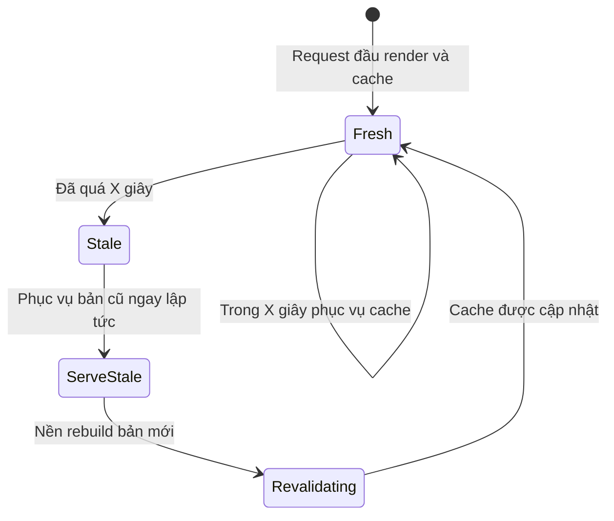
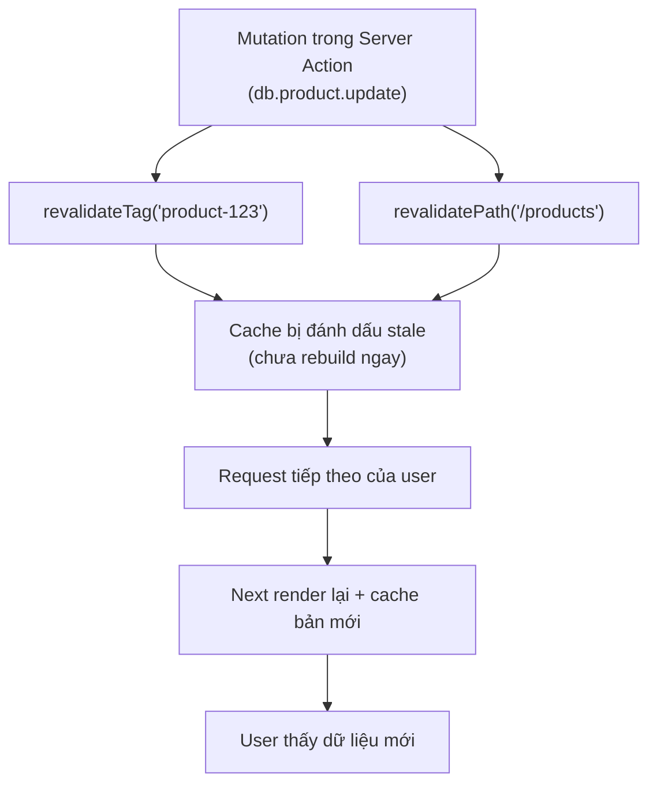

# Cache Management và Revalidation

Quản lý cache (**cache management**) là việc kiểm soát khi nào dữ liệu đã lưu đệm cần được làm mới. **Revalidation** (làm mới lại) là quá trình cập nhật lại dữ liệu cache để người dùng luôn thấy nội dung mới, thay vì dữ liệu cũ. Bài này giới thiệu cách làm mới cache theo thời gian hoặc theo yêu cầu để giữ trang web vừa nhanh vừa chính xác.

---

## Mục lục

- [Vì sao cần quản lý & làm mới cache?](#vì-sao-cần-quản-lý--làm-mới-cache)
- [Time-based revalidation](#time-based-revalidation)
- [On-demand revalidation](#on-demand-revalidation)
- [revalidatePath](#revalidatepath)
- [revalidateTag](#revalidatetag)
- [Cache Invalidation Strategy](#cache-invalidation-strategy)

---

## Vì sao cần quản lý & làm mới cache?

**Vấn đề:**

```tsx
// Trang sản phẩm cache để render nhanh
export const revalidate = false; // cache mãi mãi

async function getProduct(id: string) {
  return fetch(`/api/products/${id}`).then((r) => r.json());
}

// Admin cập nhật giá 100k → 80k trong DB...
// ...nhưng trang vẫn hiện 100k vì còn bản cache CŨ (stale).
// Tắt cache hết thì trang lại chậm — mất hết lợi ích.
```

Cache giúp trang nhanh, nhưng dễ phục vụ dữ liệu **CŨ (stale)**: user cập nhật bài viết hoặc giá nhưng trang vẫn hiện bản cache lỗi thời. Cần cách làm mới **đúng phần, đúng lúc** mà không vứt bỏ lợi ích tốc độ.

**Giải pháp:**

```tsx
// 1. Time-based: tự làm mới định kỳ (ISR)
export const revalidate = 60; // trang sản phẩm refresh mỗi 60s

// 2. On-demand: làm mới NGAY sau khi sửa dữ liệu
"use server";
export async function updateProduct(id: string, data: ProductData) {
  await db.product.update({ where: { id }, data });
  revalidateTag(`product-${id}`); // theo tag
  revalidatePath("/products"); // theo đường dẫn
}

// 3. No-store / dynamic: dữ liệu phải LUÔN tươi
fetch(url, { cache: "no-store" }); // dashboard, số liệu realtime
```

Quản lý cache là cân bằng giữa **tốc độ** và **độ mới**: `revalidate` làm mới theo thời gian, `revalidatePath`/`revalidateTag` làm mới ngay sau mutation, `no-store` cho dữ liệu cần tươi tuyệt đối.

:::tip[Dùng thực tế]

- **Sửa dữ liệu trong Server Action**: gọi `revalidateTag` ngay sau khi update DB để mọi trang dùng tag đó được làm mới tức thì.
- **Trang sản phẩm / bài viết**: đặt `revalidate: 60` (ISR) — giá và nội dung tự cập nhật mỗi phút mà trang vẫn nhanh.
- **Dashboard / số liệu realtime**: dùng `no-store` hoặc route dynamic để luôn lấy dữ liệu mới nhất, không cache.
- **Sau khi submit form bằng Server Action**: `revalidatePath` đúng đường dẫn để user thấy ngay kết quả vừa thay đổi.

:::

---

## Time-based revalidation

Cache **tự refresh sau X giây**:

```ts
// Per fetch
fetch(url, { next: { revalidate: 60 } });

// Cả route
// app/products/page.tsx
export const revalidate = 60;
```

Behavior:

1. Request 1 lúc t=0 → render fresh, cache.
2. Request 2 lúc t=30 → serve cache.
3. Request 3 lúc t=70 → serve cache + trigger background revalidate.
4. Request 4 lúc t=80 → serve **fresh** data.

= **Stale-While-Revalidate (SWR)**. User không bao giờ phải đợi.

Vòng đời của một bản cache theo cơ chế SWR — luôn phục vụ ngay, rebuild ngầm ở nền:



---

## On-demand revalidation

Trigger revalidate **ngay lập tức** khi data đổi.

```ts
import { revalidatePath, revalidateTag } from "next/cache";

// Server Action
"use server";
export async function updateProduct(id: string, data: ProductData) {
  await db.product.update({ where: { id }, data });

  revalidateTag(`product-${id}`);
  revalidatePath("/products");
}
```

```ts
// Route Handler (webhook)
export async function POST(request: Request) {
  const body = await request.json();
  // Webhook từ CMS update content
  revalidateTag(`post-${body.id}`);
  return Response.json({ revalidated: true });
}
```

Điểm mấu chốt: `revalidateTag`/`revalidatePath` chỉ **đánh dấu stale**, không rebuild ngay — request kế tiếp mới render lại và cache bản mới:



---

## revalidatePath

Invalidate cache cho **path cụ thể**:

```ts
revalidatePath("/products");
revalidatePath("/products/abc");      // path động cụ thể
revalidatePath("/products/[slug]");   // toàn dynamic route
```

Type — invalidate cấp độ nào:

```ts
revalidatePath("/products", "page");    // page.tsx only
revalidatePath("/products", "layout");  // layout + page con
```

:::warning[Cần lưu ý]

**Path đúng format**:

```ts
// SAI — path tương đối
revalidatePath("products");        // không hoạt động

// ĐÚNG — absolute
revalidatePath("/products");

// Cho dynamic — dùng template
revalidatePath("/products/[slug]"); // revalidate mọi /products/anything

// Cho specific
revalidatePath("/products/abc");
```

:::

---

## revalidateTag

Invalidate cache có **tag** match:

```ts
// Tag khi fetch
fetch(url, { next: { tags: ["products"] } });

// Revalidate
revalidateTag("products");
```

**Granular tag**:

```ts
// Tag cho từng item
fetch(`/api/products/${id}`, {
  next: { tags: ["products", `product-${id}`] },
});

// Update 1 product → chỉ revalidate cache đó
revalidateTag(`product-${id}`);

// Update bulk → revalidate cả group
revalidateTag("products");
```

:::info[Phân tích]

**Tag strategy cho e-commerce**:

```ts
// Product list page
async function getProducts() {
  return fetch("/api/products", {
    next: { tags: ["products"] },
  }).then(r => r.json());
}

// Product detail page
async function getProduct(id: string) {
  return fetch(`/api/products/${id}`, {
    next: { tags: ["products", `product-${id}`] },
  }).then(r => r.json());
}

// Category page
async function getCategory(slug: string) {
  return fetch(`/api/categories/${slug}/products`, {
    next: { tags: ["products", `category-${slug}`] },
  }).then(r => r.json());
}
```

**Khi admin sửa product**:

```ts
"use server";
export async function updateProduct(id: string, data: ProductUpdate) {
  const product = await db.product.update({
    where: { id },
    data,
    include: { category: true },
  });

  // Revalidate granular
  revalidateTag(`product-${id}`);
  revalidateTag(`category-${product.category.slug}`);
  revalidateTag("products"); // list page
}
```

Mọi page hiển thị product này được refresh — instant cho user.

Lợi ích so với revalidatePath:

- **Granular** — không clear cả route khi chỉ 1 item đổi.
- **Cross-route** — 1 tag áp dụng nhiều page.
- **Composable** — fetch ở nhiều function nhưng tag chung.

:::

---

## Cache Invalidation Strategy

**Pattern dùng nhiều layer**:

```ts
// lib/data/products.ts
import { unstable_cache, revalidateTag } from "next/cache";

export const getProducts = unstable_cache(
  async () => {
    return await db.product.findMany();
  },
  ["products"],                    // cache key
  {
    tags: ["products"],
    revalidate: 3600,              // ISR fallback
  }
);

export async function getProduct(id: string) {
  return unstable_cache(
    async () => db.product.findUnique({ where: { id } }),
    [`product-${id}`],
    { tags: [`product-${id}`, "products"] }
  )();
}

// mutation
export async function updateProduct(id: string, data: ProductUpdate) {
  await db.product.update({ where: { id }, data });
  revalidateTag(`product-${id}`);
  revalidateTag("products");
}
```

`unstable_cache` — cache function (không phải chỉ fetch). Hữu ích cho
DB query, computation.

:::tip[Mẹo]

**Webhook revalidation từ CMS**:

```ts
// app/api/revalidate/route.ts
import { revalidateTag } from "next/cache";
import { type NextRequest, NextResponse } from "next/server";

export async function POST(request: NextRequest) {
  // Verify secret
  const secret = request.headers.get("X-Secret");
  if (secret !== process.env.REVALIDATE_SECRET) {
    return NextResponse.json({ error: "Invalid secret" }, { status: 401 });
  }

  const body = await request.json();
  const { type, slug } = body;

  // Revalidate dựa vào content type
  switch (type) {
    case "blog-post":
      revalidateTag(`post-${slug}`);
      revalidateTag("posts");
      break;
    case "product":
      revalidateTag(`product-${slug}`);
      break;
  }

  return NextResponse.json({ revalidated: true });
}
```

CMS (Sanity, Contentful, Strapi) gọi webhook khi content publish → site
update ngay không cần rebuild.

Pattern này biến **static site** thành **dynamic-feel** mà không sacrifice
performance.

:::

:::warning[Cần lưu ý]

**Revalidation gotcha**:

**1. `revalidatePath` trong loop**:

```ts
for (const id of ids) {
  revalidatePath(`/products/${id}`); // OK
}
// Better: revalidate batch
revalidatePath("/products/[slug]", "page");
```

**2. Tag không exist không lỗi**:

```ts
revalidateTag("non-existent"); // không throw, không làm gì
```

→ Test thật sự — không log/notify khi tag sai.

**3. Cross-revalidate giữa các fetch URL**:

Cùng tag từ nhiều fetch URL → 1 lần revalidate ảnh hưởng tất cả:

```ts
fetch("/api/products/list", { next: { tags: ["products"] } });
fetch("/api/categories/electronics/products", { next: { tags: ["products"] } });

revalidateTag("products"); // cả 2 fetch trên đều invalidate
```

Đây là **feature**, không bug — đảm bảo consistency. Nhưng đôi khi
over-invalidate → cân nhắc tag granular hơn.

:::

:::info[Phân tích]

**Performance impact của revalidation**:

- **revalidateTag/Path**: chỉ mark dirty, **chưa rebuild**. Lần request
  tiếp theo mới rebuild.
- **Background revalidation** (ISR): rebuild song song, user vẫn nhận
  cache cũ.
- **Per-request**: rebuild sẽ chậm hơn lần đầu.

Cost của on-demand revalidate **không cao** — chỉ overhead nhỏ trong
function gọi. Có thể gọi tự do.

Trên Vercel, revalidation share infrastructure với render → không tốn
thêm.

:::
