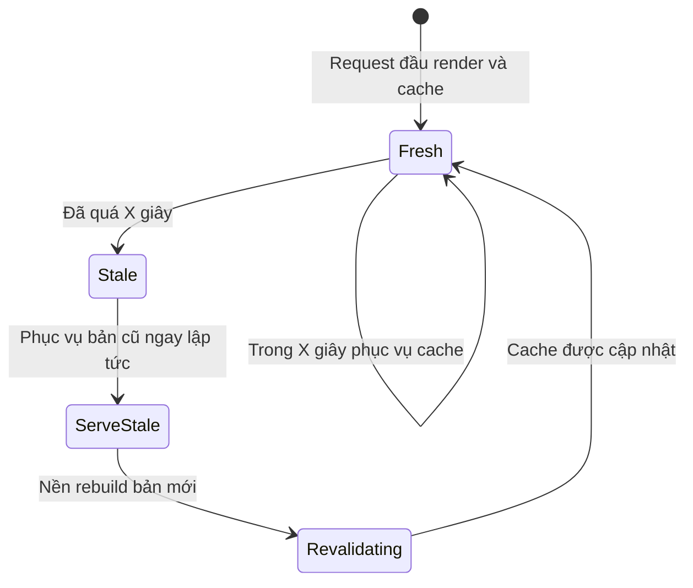
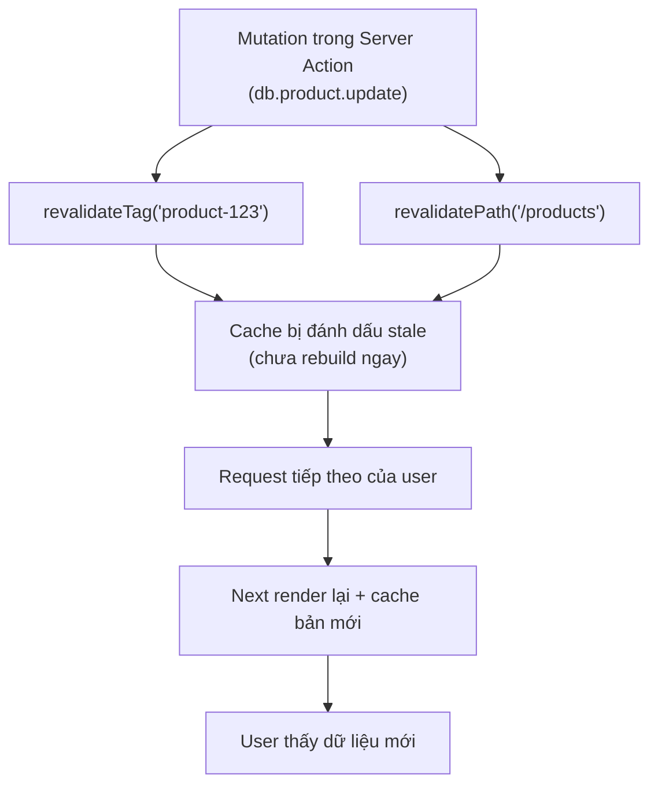

# Cache Management và Revalidation

Quản lý cache (**cache management**) là việc kiểm soát khi nào dữ liệu đã lưu đệm cần được làm mới. **Revalidation** (làm mới lại) là quá trình cập nhật lại dữ liệu cache để người dùng luôn thấy nội dung mới, thay vì dữ liệu cũ. Bài này giới thiệu cách làm mới cache theo thời gian hoặc theo yêu cầu để giữ trang web vừa nhanh vừa chính xác.

[](pathname:///img/nextjs/cache-management.webp)

---

:::note[Ghi nhớ nhanh]

- ⭐ **Time-based (`revalidate: N`) là Stale-While-Revalidate** — phục vụ cache ngay, rebuild ngầm ở nền, user không bao giờ phải đợi.
- ⭐ **On-demand `revalidateTag` / `revalidatePath` chỉ đánh dấu stale** — không rebuild ngay, request kế tiếp mới render lại và cache bản mới.
- **`revalidatePath` cần absolute path** — thêm type `"page"` hoặc `"layout"` để chọn cấp invalidate; template `/products/[slug]` cho dynamic route.
- **`revalidateTag` granular & cross-route** — nhiều fetch cùng một tag thì 1 lần revalidate ảnh hưởng tất cả (đảm bảo consistency).
- **`unstable_cache`** — cache cả hàm (DB query, computation), không chỉ riêng `fetch`.
- **Webhook từ CMS** — gọi Route Handler + `revalidateTag` để static site cập nhật ngay mà không cần rebuild.

:::

---

## Mục lục

- [Vì sao cần quản lý & làm mới cache?](#vì-sao-cần-quản-lý--làm-mới-cache)
- [Time-based revalidation](#time-based-revalidation)
- [On-demand revalidation](#on-demand-revalidation)
- [revalidatePath](#revalidatepath)
- [revalidateTag](#revalidatetag)
- [Cache Invalidation Strategy](#cache-invalidation-strategy)
- [Câu hỏi phỏng vấn](#câu-hỏi-phỏng-vấn)

---

## Vì sao cần quản lý & làm mới cache?

**Vấn đề:**

```tsx
// Trang sản phẩm cache để render nhanh
export const revalidate = false; // cache mãi mãi

async function getProduct(id: string) {
  return fetch(`/api/products/${id}`).then((r) => r.json());
}

// Admin cập nhật giá 100k → 80k trong DB...
// ...nhưng trang vẫn hiện 100k vì còn bản cache CŨ (stale).
// Tắt cache hết thì trang lại chậm — mất hết lợi ích.
```

Cache giúp trang nhanh, nhưng dễ phục vụ dữ liệu **CŨ (stale)**: user cập nhật bài viết hoặc giá nhưng trang vẫn hiện bản cache lỗi thời. Cần cách làm mới **đúng phần, đúng lúc** mà không vứt bỏ lợi ích tốc độ.

**Giải pháp:**

```tsx
// 1. Time-based: tự làm mới định kỳ (ISR)
export const revalidate = 60; // trang sản phẩm refresh mỗi 60s

// 2. On-demand: làm mới NGAY sau khi sửa dữ liệu
"use server";
export async function updateProduct(id: string, data: ProductData) {
  await db.product.update({ where: { id }, data });
  revalidateTag(`product-${id}`); // theo tag
  revalidatePath("/products"); // theo đường dẫn
}

// 3. No-store / dynamic: dữ liệu phải LUÔN tươi
fetch(url, { cache: "no-store" }); // dashboard, số liệu realtime
```

Quản lý cache là cân bằng giữa **tốc độ** và **độ mới**: `revalidate` làm mới theo thời gian, `revalidatePath`/`revalidateTag` làm mới ngay sau mutation, `no-store` cho dữ liệu cần tươi tuyệt đối.

:::tip[Dùng thực tế]

- **Sửa dữ liệu trong Server Action**: gọi `revalidateTag` ngay sau khi update DB để mọi trang dùng tag đó được làm mới tức thì.
- **Trang sản phẩm / bài viết**: đặt `revalidate: 60` (ISR) — giá và nội dung tự cập nhật mỗi phút mà trang vẫn nhanh.
- **Dashboard / số liệu realtime**: dùng `no-store` hoặc route dynamic để luôn lấy dữ liệu mới nhất, không cache.
- **Sau khi submit form bằng Server Action**: `revalidatePath` đúng đường dẫn để user thấy ngay kết quả vừa thay đổi.

:::

---

## Time-based revalidation

Cache **tự refresh sau X giây**:

```ts
// Per fetch
fetch(url, { next: { revalidate: 60 } });

// Cả route
// app/products/page.tsx
export const revalidate = 60;
```

Behavior:

1. Request 1 lúc t=0 → render fresh, cache.
2. Request 2 lúc t=30 → serve cache.
3. Request 3 lúc t=70 → serve cache + trigger background revalidate.
4. Request 4 lúc t=80 → serve **fresh** data.

= **Stale-While-Revalidate (SWR)**. User không bao giờ phải đợi.

Vòng đời của một bản cache theo cơ chế SWR — luôn phục vụ ngay, rebuild ngầm ở nền:



---

## On-demand revalidation

Trigger revalidate **ngay lập tức** khi data đổi.

```ts
import { revalidatePath, revalidateTag } from "next/cache";

// Server Action
"use server";
export async function updateProduct(id: string, data: ProductData) {
  await db.product.update({ where: { id }, data });

  revalidateTag(`product-${id}`);
  revalidatePath("/products");
}
```

```ts
// Route Handler (webhook)
export async function POST(request: Request) {
  const body = await request.json();
  // Webhook từ CMS update content
  revalidateTag(`post-${body.id}`);
  return Response.json({ revalidated: true });
}
```

Điểm mấu chốt: `revalidateTag`/`revalidatePath` chỉ **đánh dấu stale**, không rebuild ngay — request kế tiếp mới render lại và cache bản mới:



---

## revalidatePath

Invalidate cache cho **path cụ thể**:

```ts
revalidatePath("/products");
revalidatePath("/products/abc");      // path động cụ thể
revalidatePath("/products/[slug]");   // toàn dynamic route
```

Type — invalidate cấp độ nào:

```ts
revalidatePath("/products", "page");    // page.tsx only
revalidatePath("/products", "layout");  // layout + page con
```

:::warning[Cần lưu ý]

**Path đúng format**:

```ts
// SAI — path tương đối
revalidatePath("products");        // không hoạt động

// ĐÚNG — absolute
revalidatePath("/products");

// Cho dynamic — dùng template
revalidatePath("/products/[slug]"); // revalidate mọi /products/anything

// Cho specific
revalidatePath("/products/abc");
```

:::

---

## revalidateTag

Invalidate cache có **tag** match:

```ts
// Tag khi fetch
fetch(url, { next: { tags: ["products"] } });

// Revalidate
revalidateTag("products");
```

**Granular tag**:

```ts
// Tag cho từng item
fetch(`/api/products/${id}`, {
  next: { tags: ["products", `product-${id}`] },
});

// Update 1 product → chỉ revalidate cache đó
revalidateTag(`product-${id}`);

// Update bulk → revalidate cả group
revalidateTag("products");
```

:::info[Phân tích]

**Tag strategy cho e-commerce**:

```ts
// Product list page
async function getProducts() {
  return fetch("/api/products", {
    next: { tags: ["products"] },
  }).then(r => r.json());
}

// Product detail page
async function getProduct(id: string) {
  return fetch(`/api/products/${id}`, {
    next: { tags: ["products", `product-${id}`] },
  }).then(r => r.json());
}

// Category page
async function getCategory(slug: string) {
  return fetch(`/api/categories/${slug}/products`, {
    next: { tags: ["products", `category-${slug}`] },
  }).then(r => r.json());
}
```

**Khi admin sửa product**:

```ts
"use server";
export async function updateProduct(id: string, data: ProductUpdate) {
  const product = await db.product.update({
    where: { id },
    data,
    include: { category: true },
  });

  // Revalidate granular
  revalidateTag(`product-${id}`);
  revalidateTag(`category-${product.category.slug}`);
  revalidateTag("products"); // list page
}
```

Mọi page hiển thị product này được refresh — instant cho user.

Lợi ích so với revalidatePath:

- **Granular** — không clear cả route khi chỉ 1 item đổi.
- **Cross-route** — 1 tag áp dụng nhiều page.
- **Composable** — fetch ở nhiều function nhưng tag chung.

:::

---

## Cache Invalidation Strategy

**Pattern dùng nhiều layer**:

```ts
// lib/data/products.ts
import { unstable_cache, revalidateTag } from "next/cache";

export const getProducts = unstable_cache(
  async () => {
    return await db.product.findMany();
  },
  ["products"],                    // cache key
  {
    tags: ["products"],
    revalidate: 3600,              // ISR fallback
  }
);

export async function getProduct(id: string) {
  return unstable_cache(
    async () => db.product.findUnique({ where: { id } }),
    [`product-${id}`],
    { tags: [`product-${id}`, "products"] }
  )();
}

// mutation
export async function updateProduct(id: string, data: ProductUpdate) {
  await db.product.update({ where: { id }, data });
  revalidateTag(`product-${id}`);
  revalidateTag("products");
}
```

`unstable_cache` — cache function (không phải chỉ fetch). Hữu ích cho
DB query, computation.

:::tip[Mẹo]

**Webhook revalidation từ CMS**:

```ts
// app/api/revalidate/route.ts
import { revalidateTag } from "next/cache";
import { type NextRequest, NextResponse } from "next/server";

export async function POST(request: NextRequest) {
  // Verify secret
  const secret = request.headers.get("X-Secret");
  if (secret !== process.env.REVALIDATE_SECRET) {
    return NextResponse.json({ error: "Invalid secret" }, { status: 401 });
  }

  const body = await request.json();
  const { type, slug } = body;

  // Revalidate dựa vào content type
  switch (type) {
    case "blog-post":
      revalidateTag(`post-${slug}`);
      revalidateTag("posts");
      break;
    case "product":
      revalidateTag(`product-${slug}`);
      break;
  }

  return NextResponse.json({ revalidated: true });
}
```

CMS (Sanity, Contentful, Strapi) gọi webhook khi content publish → site
update ngay không cần rebuild.

Pattern này biến **static site** thành **dynamic-feel** mà không sacrifice
performance.

:::

:::warning[Cần lưu ý]

**Revalidation gotcha**:

**1. `revalidatePath` trong loop**:

```ts
for (const id of ids) {
  revalidatePath(`/products/${id}`); // OK
}
// Better: revalidate batch
revalidatePath("/products/[slug]", "page");
```

**2. Tag không exist không lỗi**:

```ts
revalidateTag("non-existent"); // không throw, không làm gì
```

→ Test thật sự — không log/notify khi tag sai.

**3. Cross-revalidate giữa các fetch URL**:

Cùng tag từ nhiều fetch URL → 1 lần revalidate ảnh hưởng tất cả:

```ts
fetch("/api/products/list", { next: { tags: ["products"] } });
fetch("/api/categories/electronics/products", { next: { tags: ["products"] } });

revalidateTag("products"); // cả 2 fetch trên đều invalidate
```

Đây là **feature**, không bug — đảm bảo consistency. Nhưng đôi khi
over-invalidate → cân nhắc tag granular hơn.

:::

:::info[Phân tích]

**Performance impact của revalidation**:

- **revalidateTag/Path**: chỉ mark dirty, **chưa rebuild**. Lần request
  tiếp theo mới rebuild.
- **Background revalidation** (ISR): rebuild song song, user vẫn nhận
  cache cũ.
- **Per-request**: rebuild sẽ chậm hơn lần đầu.

Cost của on-demand revalidate **không cao** — chỉ overhead nhỏ trong
function gọi. Có thể gọi tự do.

Trên Vercel, revalidation share infrastructure với render → không tốn
thêm.

:::


---

## Câu hỏi phỏng vấn

Những câu thường gặp về chủ đề này. Tự trả lời trước, rồi bấm **Xem đáp án** để đối chiếu.

**1. Giải thích cơ chế `Stale-While-Revalidate` của `revalidate: N`. Người dùng nào là người nhận bản cũ và người nào nhận bản mới?**

<details className="qa">
<summary>Xem đáp án</summary>

Ý tưởng: **không ai phải đợi**. Trong N giây đầu, bản cache được coi là còn tươi và phục vụ thẳng. Qua mốc N giây, bản cache thành **stale** nhưng vẫn được trả về ngay lập tức; song song đó Next.js chạy render lại ở nền và ghi đè cache bằng bản mới.

Vì vậy người "xui" nhất chỉ là **người đầu tiên đến sau khi cache hết hạn** — họ vẫn nhận phản hồi nhanh, chỉ là nội dung cũ, đồng thời chính request của họ kích hoạt việc rebuild. Những người đến sau khi rebuild xong mới thấy bản mới.

Đánh đổi cần nói rõ khi phỏng vấn: hệ thống không bao giờ chặn người dùng để chờ dữ liệu, nhưng luôn có một khoảng thời gian nội dung cũ được phục vụ. Với dữ liệu phải chính xác tuyệt đối như số dư hay tồn kho, SWR không phù hợp — phải dùng `no-store` hoặc kết hợp revalidate theo yêu cầu.

</details>

**2. Với `revalidate: 60`, mô tả từng bước điều gì xảy ra ở các mốc thời gian 0 giây, 30 giây, 70 giây và 80 giây.**

<details className="qa">
<summary>Xem đáp án</summary>

- **t = 0**: request đầu tiên, chưa có cache → render thật, trả về cho người dùng và lưu bản kết quả vào cache. Đây là request chậm nhất.
- **t = 30**: còn trong 60 giây → phục vụ thẳng từ cache, không chạm database.
- **t = 70**: đã quá hạn → vẫn trả **bản cũ** ngay lập tức cho người dùng, đồng thời kích hoạt render lại ở nền.
- **t = 80**: bản nền đã xong và ghi đè cache → người dùng nhận **dữ liệu mới**.

Điểm hay bị trả lời sai: ở mốc 70 giây, nhiều người tưởng request đó phải chờ dữ liệu mới. Không — nó vẫn được phục vụ bản cũ, chỉ đóng vai trò người bấm nút khởi động việc làm mới. Cũng lưu ý bộ đếm thời gian tính từ lúc cache được ghi, và nếu không có request nào trong thời gian dài thì chẳng có gì được làm mới cả — hạn chỉ được kiểm tra khi có người ghé thăm.

</details>

**3. Vì sao `revalidateTag` và `revalidatePath` không làm trang cập nhật ngay lập tức? Chúng thực sự làm gì tại thời điểm được gọi?**

<details className="qa">
<summary>Xem đáp án</summary>

Tại thời điểm gọi, chúng chỉ **đánh dấu các entry cache liên quan là stale** — không render lại, không gọi database, không dựng HTML mới. Đó là lý do chi phí của chúng rất rẻ và gọi thoải mái trong Server Action cũng không sao.

Việc rebuild diễn ra ở **request kế tiếp** chạm vào dữ liệu đó: lúc đó cache mới bị coi là miss, Next.js render lại và lưu bản mới.

```ts
"use server";
export async function updateProduct(id: string, data: ProductData) {
  await db.product.update({ where: { id }, data });
  revalidateTag(`product-${id}`); // chỉ đánh dấu stale
}
```

Thiết kế như vậy vì rebuild ngay là lãng phí: nếu sửa 500 sản phẩm mà không ai xem, ta vừa tốn công dựng 500 trang vô ích. Hệ quả thực tế: sau mutation, người vừa thao tác có thể vẫn thấy bản cũ nếu trình duyệt còn giữ `Router Cache`; Server Action tự làm mới router nên thường ổn, còn lại thì gọi `router.refresh()`.

</details>

**4. So sánh `revalidatePath` và `revalidateTag` về độ mịn, phạm vi và khả năng áp dụng chéo route. Khi nào bạn dùng cái nào?**

<details className="qa">
<summary>Xem đáp án</summary>

| Tiêu chí | `revalidatePath` | `revalidateTag` |
|---|---|---|
| Đơn vị | Đường dẫn route | Nhãn gắn vào từng lời gọi lấy dữ liệu |
| Độ mịn | Thô — dọn cả trang | Mịn — đúng phần dữ liệu mang tag |
| Chéo route | Không, phải liệt kê từng path | Có, một tag trải khắp mọi trang dùng nó |
| Khi nào dùng | Biết chính xác trang nào đổi (form submit, một trang cố định) | Một thực thể dữ liệu xuất hiện ở nhiều trang |

Tag mạnh hơn trong hệ thống thật: một sản phẩm hiện ở trang danh sách, trang chi tiết và trang danh mục — gắn cùng tag thì một lệnh revalidate lo hết, không phải đi nhớ đủ đường dẫn. Nhược điểm là phải kỷ luật đặt tên tag, và tag quá rộng dễ dọn nhầm nhiều thứ.

`revalidatePath` vẫn tiện cho những trang tổng hợp không gắn với thực thể cụ thể, như trang chủ hay sitemap.

</details>

**5. `revalidatePath` yêu cầu đường dẫn tuyệt đối và có tham số kiểu `"page"` hoặc `"layout"`. Hai kiểu đó khác nhau ra sao về phạm vi invalidate?**

<details className="qa">
<summary>Xem đáp án</summary>

Đường dẫn phải bắt đầu bằng dấu gạch chéo — truyền `"products"` là không có tác dụng gì, và hàm cũng không báo lỗi.

```ts
revalidatePath("/products", "page");   // chỉ page.tsx của đúng route đó
revalidatePath("/products", "layout"); // layout đó và toàn bộ route con
revalidatePath("/products/[slug]");    // mọi trang khớp pattern động
revalidatePath("/products/abc");       // đúng một trang cụ thể
```

Khác biệt cốt lõi: `"page"` chỉ dọn đúng một mắt lưới, còn `"layout"` dọn từ layout đó **lan xuống toàn bộ cây con** — mạnh hơn nhưng dễ over-invalidate, kéo theo rebuild cả loạt trang không cần thiết.

Với dynamic route, nhớ truyền **chuỗi pattern** `"/products/[slug]"` đúng như tên thư mục, chứ không phải giá trị thật. Muốn làm mới đúng một sản phẩm thì truyền đường dẫn cụ thể. Sai chỗ này là kiểu bug im lặng khó lần nhất: hàm chạy trót lọt nhưng chẳng dọn gì.

</details>

**6. Thiết kế chiến lược đặt tag cho một site thương mại điện tử có trang danh sách, trang chi tiết và trang danh mục. Khi admin sửa một sản phẩm thì cần revalidate những tag nào?**

<details className="qa">
<summary>Xem đáp án</summary>

Nguyên tắc: mỗi lời gọi lấy dữ liệu gắn **một tag rộng theo loại** và **một tag hẹp theo định danh**.

```ts
// danh sách
fetch("/api/products", { next: { tags: ["products"] } });
// chi tiết
fetch(`/api/products/${id}`, { next: { tags: ["products", `product-${id}`] } });
// danh mục
fetch(`/api/categories/${slug}/products`, {
  next: { tags: ["products", `category-${slug}`] },
});
```

Khi admin sửa một sản phẩm, cần dọn cả ba nơi nó xuất hiện:

```ts
revalidateTag(`product-${id}`);                  // trang chi tiết
revalidateTag(`category-${product.category.slug}`); // danh mục chứa nó
revalidateTag("products");                        // trang danh sách
```

Lưu ý nghiệp vụ: nếu thao tác sửa có đổi danh mục, phải revalidate **cả danh mục cũ lẫn danh mục mới**, nếu không sản phẩm vẫn còn nằm lại ở danh mục cũ. Tên tag nên sinh từ một hàm dùng chung để tránh gõ sai — tag phân biệt chữ hoa chữ thường và gọi sai tên thì không có lỗi nào báo cho bạn biết.

</details>

**7. Gọi `revalidateTag` với một tag không tồn tại thì chuyện gì xảy ra? Vì sao điều đó nguy hiểm và bạn phòng ngừa thế nào?**

<details className="qa">
<summary>Xem đáp án</summary>

Không có gì xảy ra cả — hàm chạy im lặng, không throw, không cảnh báo:

```ts
revalidateTag("non-existent"); // không lỗi, không làm gì
```

Nguy hiểm vì đây là **lỗi im lặng**: gõ sai một chữ, sai chữ hoa chữ thường, hoặc đổi tên tag ở chỗ fetch mà quên đổi ở chỗ revalidate — code vẫn xanh, test vẫn qua, chỉ có người dùng thấy giá cũ mãi không đổi. Lỗi loại này thường mất rất lâu mới bị phát hiện.

Cách phòng ngừa:

- Tập trung tên tag vào một nơi duy nhất, sinh bằng hàm có kiểu chặt, ví dụ một helper trả về `product-${id}`, không viết chuỗi rải rác.
- Với TypeScript, ràng buộc tham số bằng union type hoặc template literal type thay vì `string` trần.
- Viết kiểm thử tích hợp thật: sửa dữ liệu, tải lại trang, khẳng định nội dung đã đổi — chỉ cách này mới bắt được tag sai.

</details>

**8. Nhiều `fetch` khác URL nhưng cùng một tag. Một lần `revalidateTag` ảnh hưởng tới tất cả — đây là tính năng hay lỗi, và khi nào nó thành vấn đề?**

<details className="qa">
<summary>Xem đáp án</summary>

Đây là **tính năng**, và là lý do chính khiến tag hữu ích. Nó bảo đảm tính nhất quán: mọi nơi hiển thị cùng một khối dữ liệu đều được làm mới cùng lúc, không còn cảnh trang danh sách hiện giá mới trong khi trang danh mục vẫn giá cũ.

```ts
fetch("/api/products/list", { next: { tags: ["products"] } });
fetch("/api/categories/electronics/products", { next: { tags: ["products"] } });

revalidateTag("products"); // cả hai đều bị đánh dấu stale
```

Nó thành vấn đề khi tag quá rộng so với thay đổi thực tế. Sửa mô tả của một sản phẩm mà dọn luôn tag `products` thì mọi trang danh sách, mọi trang danh mục đều phải render lại — với catalog lớn, đó là một đợt dội tải vào database mà chẳng ai cần.

Cách cân bằng: gắn nhiều tag cho một lời gọi (một hẹp, một rộng), rồi ở chỗ mutation **chọn đúng mức tag cần dọn** theo loại thay đổi: sửa mô tả thì chỉ dọn tag hẹp, đổi giá hay trạng thái bán thì mới dọn tag rộng.

</details>

**9. `unstable_cache` giải quyết được gì mà cache của `fetch` không giải quyết được? Cho một ví dụ thực tế bạn bắt buộc phải dùng nó.**

<details className="qa">
<summary>Xem đáp án</summary>

Cache của `fetch` chỉ hoạt động với request HTTP. Rất nhiều dữ liệu trong ứng dụng không đi qua HTTP: query trực tiếp vào database bằng Prisma hay Drizzle, đọc file, gọi SDK của bên thứ ba, hay một phép tính nặng. `unstable_cache` bọc **cả một hàm** để kết quả của nó cũng vào `Data Cache`, cũng có tag và cũng có `revalidate`.

```ts
export const getProducts = unstable_cache(
  async () => db.product.findMany(),
  ["products"],                       // cache key
  { tags: ["products"], revalidate: 3600 }
);
```

Ví dụ bắt buộc dùng: ứng dụng nối thẳng vào database, không có tầng API ở giữa. Không có `fetch` nào để gắn `next: { tags }`, nên nếu không bọc hàm thì mỗi lần render đều phải truy vấn lại, và cũng không có cách nào để `revalidateTag` chạm tới được. Bọc lại thì query nặng chỉ chạy một lần cho tới khi dữ liệu thật sự đổi, và mutation có thể chủ động dọn cache qua tag.

</details>

**10. Trong `unstable_cache`, tham số cache key và mảng `tags` đóng vai trò khác nhau như thế nào? Quên truyền biến vào key thì hỏng ra sao?**

<details className="qa">
<summary>Xem đáp án</summary>

Hai thứ phục vụ hai mục đích trái chiều:

- **Cache key** (mảng thứ hai) xác định **định danh của bản cache** — dữ liệu nào là dữ liệu nào.
- **`tags`** xác định **cách dọn** — sau này gọi `revalidateTag` với tag nào thì bản cache đó bị đánh dấu stale.

Quên đưa biến vào key là lỗi nghiêm trọng, vì mọi tham số khác nhau sẽ dùng chung **một ô cache duy nhất**:

```ts
// SAI — mọi id chia sẻ cùng một key
unstable_cache(async () => db.product.findUnique({ where: { id } }), ["product"])();

// ĐÚNG — key mang theo id
unstable_cache(
  async () => db.product.findUnique({ where: { id } }),
  [`product-${id}`],
  { tags: [`product-${id}`, "products"] }
)();
```

Hậu quả của bản sai: người xem sản phẩm B nhận được dữ liệu của sản phẩm A. Nếu hàm đó lấy dữ liệu theo người dùng thì đây thành lỗ hổng rò rỉ dữ liệu — lý do nữa để không bao giờ cache dữ liệu gắn danh tính.

</details>

**11. Bạn gọi `revalidateTag` trong `Server Action` nhưng người dùng vẫn thấy dữ liệu cũ sau khi submit. Nêu các nguyên nhân có thể và cách chẩn đoán.**

<details className="qa">
<summary>Xem đáp án</summary>

Các nguyên nhân thường gặp, theo thứ tự nên kiểm tra:

- **Sai tên tag** — chuỗi ở chỗ fetch và chỗ revalidate không khớp, gõ sai hoặc lệch chữ hoa chữ thường. Gọi tag không tồn tại thì im lặng, không có lỗi.
- **Fetch không hề gắn tag** — thiếu `next: { tags: [...] }` nên chẳng có gì để dọn.
- **`Router Cache` phía trình duyệt** còn giữ bản cũ; server đã mới nhưng màn hình hiện tại chưa cập nhật. Thử hard reload để loại trừ; nếu reload là đúng thì đây chính là thủ phạm — dùng `router.refresh()`.
- **Gọi revalidate trước khi mutation hoàn tất**, hoặc trong một nhánh code không chạy tới vì lỗi bị nuốt.
- **Self-host nhiều instance**: lệnh revalidate chỉ chạm instance nhận request, các instance khác vẫn phục vụ bản cũ.

Chẩn đoán: log ngay trước và sau lệnh revalidate, đặt log trong hàm lấy dữ liệu để biết nó có chạy lại không, và luôn kiểm chứng trên production build chứ không phải dev.

</details>

**12. Thiết kế endpoint webhook để CMS trigger revalidation. Bạn xác thực request thế nào và ánh xạ payload sang tag ra sao?**

<details className="qa">
<summary>Xem đáp án</summary>

Endpoint là một Route Handler nhận POST. Xác thực trước, xử lý sau:

```ts
export async function POST(request: NextRequest) {
  const secret = request.headers.get("X-Secret");
  if (secret !== process.env.REVALIDATE_SECRET) {
    return NextResponse.json({ error: "Invalid secret" }, { status: 401 });
  }
  const { type, slug } = await request.json();
  switch (type) {
    case "blog-post":
      revalidateTag(`post-${slug}`);
      revalidateTag("posts");
      break;
    case "product":
      revalidateTag(`product-${slug}`);
      break;
  }
  return NextResponse.json({ revalidated: true });
}
```

Điểm cần nói thêm: secret để trong biến môi trường không có tiền tố công khai; nếu CMS ký payload thì nên xác minh chữ ký trên raw body thay vì so sánh chuỗi. Ánh xạ payload sang tag qua một bảng tra được khai báo tập trung, và với loại nội dung lạ thì trả về mã lỗi rõ ràng thay vì im lặng, để còn phát hiện khi CMS đổi schema.

</details>

**13. So sánh `revalidate = 0`, `cache: "no-store"` và `dynamic = "force-dynamic"`. Ba cách này có tương đương nhau không?**

<details className="qa">
<summary>Xem đáp án</summary>

Kết quả cuối cùng giống nhau — dữ liệu luôn tươi — nhưng **phạm vi tác động khác nhau**, nên không thể coi là tương đương.

| Cách viết | Phạm vi | Tác động |
|---|---|---|
| `cache: "no-store"` | Một lời gọi fetch | Chỉ fetch đó không vào Data Cache; kéo route sang dynamic |
| `export const revalidate = 0` | Cả route | Coi như không có hạn cache, route render lại mỗi request |
| `export const dynamic = "force-dynamic"` | Cả route | Ép dynamic một cách tường minh, mọi fetch bị xử như không cache |

Khi chọn, hãy ưu tiên phạm vi **hẹp nhất đủ dùng**: chỉ một phần dữ liệu cần tươi thì đặt `no-store` đúng chỗ đó, giữ phần còn lại vẫn cache được. Dùng `force-dynamic` là vứt bỏ `Full Route Cache` của cả trang, kể cả những mảng hoàn toàn tĩnh. Về tính rõ ràng khi đọc code, `force-dynamic` nói thẳng ý định hơn `revalidate = 0`, nên nếu thật sự muốn cả route dynamic thì nên dùng nó.

</details>

**14. Over-invalidation là gì? Cho một ví dụ tag quá rộng làm hỏng hiệu năng và cách bạn chia lại tag cho mịn hơn.**

<details className="qa">
<summary>Xem đáp án</summary>

Over-invalidation là dọn cache rộng hơn nhiều so với thay đổi thực tế, khiến hàng loạt trang phải render lại vô ích.

Ví dụ: mọi lời gọi dữ liệu trong site đều gắn đúng một tag `data`. Chỉ cần admin sửa một dòng mô tả là toàn bộ cache của site bị đánh dấu stale; lượt truy cập kế tiếp dội thẳng vào database, thời gian phản hồi tăng vọt, và lợi ích của cache gần như biến mất.

Cách chia lại cho mịn:

- Đặt tag theo **thực thể và định danh**: `product-123` thay vì `products` cho trang chi tiết.
- Cho mỗi lời gọi mang **nhiều tầng tag**: một hẹp, một rộng theo loại, để chỗ mutation chọn đúng mức cần dọn.
- Ở chỗ mutation, xét loại thay đổi: sửa mô tả thì chỉ dọn tag hẹp; đổi giá hay tồn kho — thứ hiện trên trang danh sách — mới dọn tag rộng.

Hướng đi ngược lại cũng sai: tag quá mịn thì dễ sót chỗ và hiển thị dữ liệu không nhất quán giữa các trang.

</details>

**15. Chi phí thực sự của on-demand revalidation là gì? Chuyện gì xảy ra khi hàng nghìn request cùng đến ngay sau khi cache bị đánh dấu stale?**

<details className="qa">
<summary>Xem đáp án</summary>

Bản thân lệnh revalidate **rất rẻ**: nó chỉ đánh dấu stale, không render, không truy vấn. Gọi vài lệnh trong một Server Action gần như không đáng kể.

Chi phí thật nằm ở **sau đó**: những request kế tiếp phải render lại. Nếu đang có lưu lượng lớn và bạn vừa dọn một tag rộng, rất nhiều request cùng gặp cache miss cùng lúc và cùng đi xuống database — hiện tượng dồn tải quen gọi là cache stampede. Trang đang nhanh bỗng chậm hẳn ngay sau một thao tác của admin.

Cách giảm rủi ro:

- Dọn tag hẹp nhất có thể để số trang phải dựng lại ít đi.
- Kết hợp `revalidate` theo thời gian để cơ chế phục vụ bản cũ trong lúc làm mới đỡ đòn thay vì chặn người dùng.
- Không gọi revalidate trong vòng lặp cho từng bản ghi khi cập nhật hàng loạt; gộp lại một lần ở mức phù hợp.
- Có lớp cache dùng chung phía trước database để nhiều request đồng thời không thành nhiều truy vấn.

</details>

**16. Một trang giá sản phẩm phải luôn đúng giá nhưng vẫn cần tải nhanh. Bạn kết hợp time-based và on-demand revalidation như thế nào, và fallback khi webhook thất bại là gì?**

<details className="qa">
<summary>Xem đáp án</summary>

Dùng cả hai, mỗi cái một vai:

- **On-demand là đường chính**: mỗi khi giá đổi trong hệ quản trị hoặc CMS, gọi `revalidateTag` cho đúng sản phẩm. Người dùng thấy giá mới gần như ngay lập tức mà không cần rebuild site.
- **Time-based là lưới an toàn**: đặt thêm `revalidate` (ví dụ một giờ) cho chính lời gọi đó. Nếu webhook chết, lỗi mạng hay deploy làm mất tín hiệu, cache vẫn tự làm mới sau tối đa một giờ thay vì kẹt cũ vĩnh viễn.

```ts
export const getProduct = (id: string) =>
  unstable_cache(async () => db.product.findUnique({ where: { id } }),
    [`product-${id}`],
    { tags: [`product-${id}`, "products"], revalidate: 3600 })();
```

Bổ sung cho chắc: webhook nên có cơ chế thử lại và ghi log để biết lần nào trượt; phần dễ sai lệch nhất như tồn kho thời gian thực thì tách ra một component client tự gọi API. Cách này giữ được tốc độ của trang dựng sẵn mà sai số dữ liệu có trần rõ ràng.

</details>
