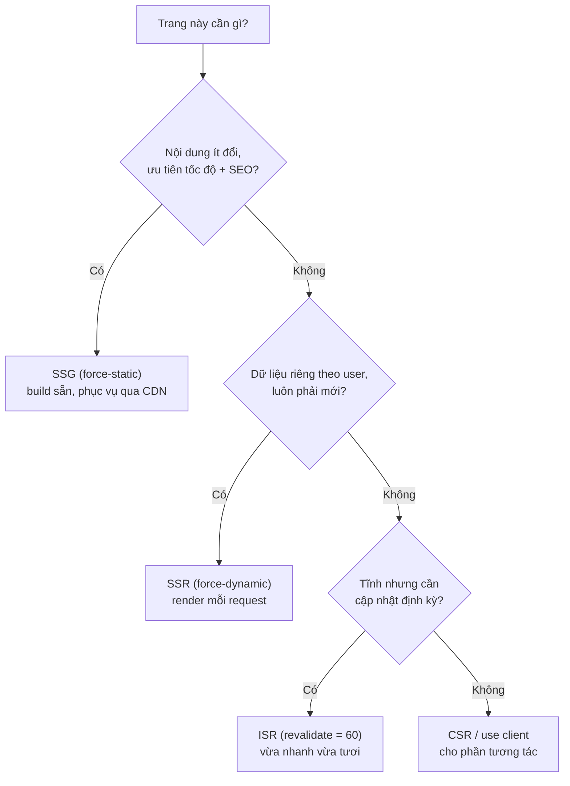

# Server vs Client Components

Trong Next.js, **rendering** (kết xuất, tức quá trình biến code thành giao diện hiển thị) có thể diễn ra ở hai nơi. **Server Components** là các component được dựng sẵn trên máy chủ, còn **Client Components** là các component chạy trong trình duyệt và có thể tương tác với người dùng. Bài này giúp bạn phân biệt hai loại này và biết khi nào nên dùng loại nào.

[](pathname:///img/nextjs/rendering-modes.webp)

---

:::note[Ghi nhớ nhanh]

- ⭐ **Server Component là mặc định** — async, fetch được DB/secret/env, nhưng KHÔNG có hook, event handler hay browser API, và không vào client bundle.
- ⭐ **`"use client"` đánh dấu boundary** ở đầu file — có hook/event/browser API; mọi child import từ đó tự kế thừa là Client.
- **Composition** — Server có thể wrap Client, nhưng Client không import trực tiếp Server; truyền Server qua `children`/prop (pattern "Server in Client").
- **Quy tắc thực dụng** — default Server, chỉ convert sang Client khi cần hook/event, push `"use client"` càng sâu (leaf) càng tốt.
- **Phân biệt 3 directive** — `"use client"` (file Client), `"use server"` đầu file (file chứa Server Actions), `"use server"` trong function (function đó là Server Action).

:::

---

## Mục lục

- [Vì sao có nhiều rendering mode?](#vì-sao-có-nhiều-rendering-mode)
- [Server Components (default)](#server-components-default)
- [Client Components ("use client")](#client-components-use-client)
- [Composition](#composition)
- [Khi nào dùng cái nào?](#khi-nào-dùng-cái-nào)
- ["use server" directive](#use-server-directive)
- [Câu hỏi phỏng vấn](#câu-hỏi-phỏng-vấn)

---

## Vì sao có nhiều rendering mode?

**Vấn đề:** Mỗi trang có yêu cầu khác nhau về **tốc độ**, **SEO** và **độ tươi dữ liệu**. Một chế độ render duy nhất không tối ưu cho tất cả:

```tsx
// Render tất cả mọi trang theo cùng MỘT cách
// → trang marketing cần nhanh + SEO nhưng lại render lại mỗi request (chậm)
// → dashboard cần dữ liệu mới theo user nhưng lại bị cache tĩnh (sai)
// → trang sản phẩm vừa cần nhanh, vừa cần cập nhật giá → không cách nào vừa lòng cả hai
```

**Giải pháp:** Next cho chọn chế độ render **theo từng trang**, cân bằng đánh đổi:

```tsx
// SSG — build sẵn lúc deploy, nhanh nhất + phục vụ qua CDN (trang tĩnh)
export const dynamic = "force-static";

// SSR — render mỗi request, cá nhân hoá theo user (dữ liệu luôn mới)
export const dynamic = "force-dynamic";

// ISR — tĩnh nhưng tự làm mới định kỳ (vừa nhanh vừa cập nhật)
export const revalidate = 60; // giây

// CSR — component "use client" cho phần tương tác trong trình duyệt
// RSC + PPR — kết hợp tĩnh + động trên cùng một trang (shell tĩnh, nội dung động stream sau)
```

Cây quyết định dưới đây giúp chọn chế độ render phù hợp theo yêu cầu của từng trang:



:::tip[Dùng thực tế]

- **Landing / marketing** → **SSG**: nội dung ít đổi, ưu tiên tốc độ và SEO.
- **Trang cá nhân / dashboard** → **SSR**: dữ liệu phải mới và riêng cho từng user.
- **E-commerce (trang sản phẩm)** → **ISR**: tĩnh để nhanh, làm mới định kỳ để cập nhật giá/tồn kho.
- **Phần tương tác (form, counter, filter)** → **CSR** (`"use client"`); **PPR** cho shell tĩnh + nội dung động stream sau.

:::

---

## Server Components (default)

Mặc định trong App Router — mọi component là **Server Component**:

```tsx
// app/page.tsx — Server Component (no "use client")
import { db } from "@/lib/db";

export default async function HomePage() {
  const users = await db.user.findMany(); // chạy server
  return (
    <ul>
      {users.map(u => <li key={u.id}>{u.name}</li>)}
    </ul>
  );
}
```

Đặc điểm:

- **Async function** — `await` data fetching.
- **Không có hook** (useState, useEffect, useContext, useRef).
- **Không có event handler** (onClick, onChange).
- **Không có browser API** (window, document, localStorage).
- **Có thể đọc**: DB, file system, env var, Node API.

→ Render trên server, không vào client bundle.

---

## Client Components ("use client")

Đánh dấu **`"use client"`** ở **đầu file**:

```tsx
// app/components/Counter.tsx
"use client";

import { useState } from "react";

export default function Counter() {
  const [count, setCount] = useState(0);
  return <button onClick={() => setCount(c => c + 1)}>{count}</button>;
}
```

Đặc điểm:

- **Có hook** (useState, useEffect, useContext...).
- **Có event handler**.
- **Truy cập browser API**.
- **Không có** `await` top-level (trừ trong async function).
- **Không truy cập** DB, secret env trực tiếp.

→ Render hybrid: SSR cho HTML initial + hydrate JS bundle client.

:::info[Phân tích]

**`"use client"` đánh dấu boundary**, không phải component đó chỉ render
client:

- Server pre-render HTML lần đầu (SSR).
- Bundle JS gửi về client.
- Client hydrate: gắn event, state, effect.
- Sau đó interactive.

Component được import từ Client Component → cũng là Client (kế thừa).

```tsx
// Counter.tsx có "use client"
// Sub.tsx KHÔNG cần "use client" — vẫn được coi là client
function Sub() {
  return <div>Sub</div>;
}
```

`"use client"` chỉ cần ở **file gốc của boundary** — child tự thừa kế.

:::

---

## Composition

**Server Component có thể wrap Client Component**:

```tsx
// app/page.tsx (Server)
import Counter from "./Counter";

async function HomePage() {
  const data = await fetchData(); // server-side
  return (
    <div>
      <h1>{data.title}</h1>
      <Counter />  {/* Client */}
    </div>
  );
}
```

**Client Component pass children là Server Component qua prop**:

```tsx
// app/page.tsx (Server)
import { ClientWrapper } from "./ClientWrapper";

async function HomePage() {
  const user = await fetchUser();
  return (
    <ClientWrapper>
      <UserCard user={user} /> {/* Server render bên trong wrapper */}
    </ClientWrapper>
  );
}
```

```tsx
// ClientWrapper.tsx
"use client";

export function ClientWrapper({ children }) {
  const [isOpen, setOpen] = useState(false);
  return (
    <div>
      <button onClick={() => setOpen(o => !o)}>Toggle</button>
      {isOpen && children} {/* children là Server, đã render từ server */}
    </div>
  );
}
```

Pattern này gọi là **"Server in Client"** — children được render server,
pass qua như slot.

:::tip[Mẹo]

**Pattern khi cần Server data trong Client tree**:

```tsx
// SAI — Client import Server component
"use client";
import ServerComp from "./ServerComp"; // ServerComp dùng DB

export function ClientWrapper() {
  return <ServerComp />; // sẽ build error
}

// ĐÚNG — Server pass element xuống Client
// page.tsx (Server)
function Page() {
  return (
    <ClientWrapper serverContent={<ServerComp />} />
  );
}
```

Pass JSX element làm prop — element được render server side, Client chỉ
quyết định **đặt ở đâu**.

:::

---

## Khi nào dùng cái nào?

| Need | Component |
|------|-----------|
| Fetch data từ DB/API | **Server** |
| Read secret env (`API_KEY`) | **Server** |
| SEO content | **Server** |
| Component tĩnh không interaction | **Server** |
| `useState`, `useEffect` | **Client** |
| Event handler (onClick) | **Client** |
| Browser API (localStorage, window) | **Client** |
| Animation, gesture | **Client** |
| Form interactive | **Client** (action có thể server) |

**Quy tắc thực dụng**:

- **Default Server**.
- Convert sang Client **chỉ khi cần** hook/event.
- Push `"use client"` **càng sâu trong tree càng tốt** — leaf component
  thôi.

```tsx
// Tệ — toàn page là Client (mất Server benefit)
"use client";
function Page() {
  const [filter, setFilter] = useState("");
  return (
    <>
      <Header />
      <Filter value={filter} onChange={setFilter} />
      <ProductList filter={filter} />
    </>
  );
}

// Tốt — chỉ Filter là Client
function Page() {
  return (
    <>
      <Header />
      <ProductsSection /> {/* Server, fetch data */}
    </>
  );
}

async function ProductsSection() {
  const products = await fetchProducts();
  return <ProductListInteractive products={products} />;
}

"use client";
function ProductListInteractive({ products }) {
  const [filter, setFilter] = useState("");
  return <>{/* ... */}</>;
}
```

---

## "use server" directive

`"use server"` đánh dấu **Server Action** — function chạy server, gọi
từ client:

```ts
// app/actions.ts
"use server";

export async function createPost(formData: FormData) {
  await db.post.create({
    data: { title: formData.get("title") as string },
  });
}
```

Hoặc inline trong component:

```tsx
"use client";

export default function Form() {
  async function action(formData) {
    "use server"; // function này chạy server
    await db.post.create({ data: { title: formData.get("title") } });
  }

  return (
    <form action={action}>
      <input name="title" />
      <button>Save</button>
    </form>
  );
}
```

:::warning[Cần lưu ý]

**Phân biệt 3 directive:**

| Directive | Vị trí | Ý nghĩa |
|-----------|--------|---------|
| `"use client"` | Đầu file | File này + dependency = Client Component |
| `"use server"` | Đầu file | File chứa Server Actions |
| `"use server"` | Trong function | Function này là Server Action |

`"use client"` và `"use server"` **không đối lập** — đánh dấu boundary
khác nhau.

Đừng:

```tsx
// SAI
"use client";
"use server"; // không có ý nghĩa trộn lẫn
```

Server Component **không có directive** — đó là default.

:::

:::info[Phân tích]

**Network payload Server Component vs Client Component**:

Server Component build sinh ra **RSC payload** (JSON-like):

```
M1:{"id":"_ssr_components/Header.js"}
...
[children, props for Header]
```

Client browser nhận:

- **HTML** (initial paint, SEO).
- **RSC payload** (subsequent navigation).
- **JS bundle** (Client Components hydrate).

Server Component update qua RSC payload **không cần ship JS** — chỉ data.
Nhỏ hơn nhiều so với ship cả component code.

→ Lý do bundle Next.js App Router thường **nhỏ hơn** Pages Router cùng
feature.

:::

---

## Câu hỏi phỏng vấn

Những câu thường gặp về chủ đề này. Tự trả lời trước, rồi bấm **Xem đáp án** để đối chiếu.

**1. Trong App Router, một component không có directive nào thì mặc định là loại gì, và điều đó ảnh hưởng thế nào tới lượng JS gửi xuống trình duyệt?**

<details className="qa">
<summary>Xem đáp án</summary>

Mặc định là **Server Component** — không cần khai báo gì, chính vì vậy Server Component không có directive riêng, chỉ Client Component mới phải đánh dấu `"use client"`.

Ảnh hưởng tới bundle rất lớn: code của Server Component **không đi vào client bundle**. Nó chạy trên server, và những gì gửi xuống trình duyệt chỉ là HTML cho lần sơn đầu tiên cùng RSC payload mô tả kết quả render. Thư viện chỉ dùng trong Server Component — thư viện markdown, SDK database, thư viện format ngày tháng nặng nề — cũng ở lại server luôn.

```tsx
// app/page.tsx — Server Component, không directive
export default async function HomePage() {
  const users = await db.user.findMany(); // chạy trên server
  return <ul>{users.map(u => <li key={u.id}>{u.name}</li>)}</ul>;
}
```

Đây là lý do "mặc định Server, chỉ chuyển sang Client khi thật sự cần" là quy tắc thực dụng nhất trong App Router.

</details>

**2. Kể ra những thứ `Server Component` KHÔNG làm được (hook, event handler, browser API) và giải thích vì sao lại có giới hạn đó.**

<details className="qa">
<summary>Xem đáp án</summary>

Server Component không dùng được:

- **Hook trạng thái và vòng đời**: `useState`, `useEffect`, `useContext`, `useRef`.
- **Event handler**: `onClick`, `onChange`.
- **Browser API**: `window`, `document`, `localStorage`.

Lý do chung: nó chạy **một lần trên server rồi kết thúc**. Không có gì tồn tại sau đó để giữ state hay chạy lại khi state đổi, nên `useState` vô nghĩa. Event handler là hàm, mà hàm không serialize được để gửi qua mạng, nên không thể gắn vào HTML. Và browser API đơn giản là không tồn tại trong môi trường Node.

Đổi lại, Server Component được những thứ Client không có: là **async function** nên `await` thẳng vào database, đọc được biến môi trường bí mật, dùng được API của Node. Đây là một sự đánh đổi có chủ đích: mất tính tương tác, lấy về quyền truy cập dữ liệu và bundle nhẹ.

</details>

**3. `"use client"` thực chất đánh dấu điều gì — component đó chỉ chạy trong trình duyệt, hay nó là ranh giới của một nhánh trong cây component?**

<details className="qa">
<summary>Xem đáp án</summary>

Nó đánh dấu **ranh giới (boundary)**, không phải "chỉ chạy ở trình duyệt". Đây là hiểu lầm phổ biến nhất về directive này.

Client Component vẫn được server pre-render ra HTML cho lần tải đầu, giống hệt SSR truyền thống. Cái mà `"use client"` thật sự nói là: từ file này trở xuống, code phải được đóng gói gửi xuống trình duyệt để React còn hydrate và làm cho nó tương tác được.

Vì là ranh giới nên nó **lan xuống**: mọi component được import từ trong nhánh đó cũng trở thành Client, dù bản thân chúng không khai báo gì.

```tsx
// Counter.tsx có "use client"
// Sub.tsx KHÔNG khai báo gì — vẫn được coi là Client
function Sub() {
  return <div>Sub</div>;
}
```

Hệ quả thực tế: đặt `"use client"` càng gần gốc cây thì càng nhiều code bị kéo vào bundle. Chỉ cần khai báo ở đúng file mở đầu ranh giới, các con tự kế thừa.

</details>

**4. Một `Client Component` có được server render HTML lần đầu không? Mô tả các bước từ HTML đầu tiên tới lúc trang tương tác được (`hydration`).**

<details className="qa">
<summary>Xem đáp án</summary>

Có. Client Component vẫn được render trên server ở lần tải đầu — đó là lý do trang không bị trắng và vẫn tốt cho SEO.

Các bước:

- Server render cây component, bao gồm cả Client Component, thành **HTML** và gửi xuống. Người dùng đã nhìn thấy giao diện nhưng bấm chưa ăn.
- Trình duyệt tải **JS bundle** chứa code của các Client Component.
- React chạy **hydration**: duyệt lại cây, gắn event handler vào DOM có sẵn, khởi tạo state và chạy effect.
- Sau bước này trang mới thật sự tương tác được.

Vì vậy tên gọi "Client Component" hơi gây nhầm — chính xác hơn là component **chạy ở cả hai nơi**. Hai hệ quả cần nhớ: có một khoảng thời gian giao diện đã hiện mà chưa bấm được (càng nhiều Client Component thì khoảng này càng dài); và code trong thân component chạy cả trên server, nên đụng thẳng vào `window` ở đó sẽ lỗi — phải đưa vào `useEffect`.

</details>

**5. File A có `"use client"` và import file B (B không khai báo gì) — B là Server hay Client? Giải thích cơ chế kế thừa boundary.**

<details className="qa">
<summary>Xem đáp án</summary>

B là **Client Component**. Không khai báo gì chỉ có nghĩa "mặc định Server" khi module đó được kéo vào từ phía server; còn một khi đã nằm trong nhánh client thì nó được bundle cùng và chạy ở trình duyệt.

Cơ chế: `"use client"` đánh dấu điểm **bắt đầu** của ranh giới trong đồ thị module. Mọi thứ import từ điểm đó trở xuống đều thuộc phía client, nên chỉ cần khai báo ở file gốc của ranh giới, không phải rải directive vào từng file con.

```tsx
// Counter.tsx có "use client"
// Sub.tsx không cần khai báo — vẫn là Client vì được Counter import
```

Điểm dễ vấp: một module tiện ích dùng chung có thể vừa bị Server Component import, vừa bị Client Component import — khi đó nó được gói vào cả hai phía. Nếu module đó đụng tới database hay secret thì phải chặn bằng `import "server-only"` để build báo lỗi ngay thay vì âm thầm đẩy code xuống trình duyệt.

</details>

**6. So sánh `SSG`, `SSR`, `ISR` và `CSR`: mỗi chế độ đánh đổi gì giữa tốc độ, `SEO` và độ tươi của dữ liệu?**

<details className="qa">
<summary>Xem đáp án</summary>

| Chế độ | Render khi nào | Tốc độ | SEO | Độ tươi |
|---|---|---|---|---|
| SSG | Lúc build | Nhanh nhất, phục vụ qua CDN | Tốt | Chỉ đổi khi rebuild |
| ISR | Lúc build, rồi làm mới định kỳ | Gần bằng SSG | Tốt | Cũ tối đa bằng khoảng `revalidate` |
| SSR | Mỗi request | Chậm hơn, phụ thuộc server | Tốt | Luôn mới |
| CSR | Trong trình duyệt sau khi tải JS | Sơn đầu nhanh nhưng nội dung đến muộn | Yếu nhất | Mới, nhưng phải chờ fetch |

Cách chọn theo bài: landing và marketing dùng SSG; dashboard cá nhân hoá dùng SSR; trang sản phẩm dùng ISR để vừa nhanh vừa cập nhật giá; phần tương tác thuần như bộ lọc hay counter thì để CSR bằng `"use client"`.

Điểm cần nhấn: trong App Router đây không phải bốn ô loại trừ nhau — một trang có thể có phần tĩnh và phần động cùng lúc.

</details>

**7. `export const dynamic = "force-static"`, `"force-dynamic"` và `export const revalidate` khác nhau ra sao? Cho ví dụ trang nên dùng từng loại.**

<details className="qa">
<summary>Xem đáp án</summary>

Ba cách khai báo ở cấp route, đều ghi đè suy luận tự động của Next.js:

```ts
export const dynamic = "force-static";  // luôn dựng sẵn
export const dynamic = "force-dynamic"; // luôn render mỗi request
export const revalidate = 60;           // dựng sẵn nhưng làm mới sau 60 giây
```

- `force-static` cho trang chắc chắn không phụ thuộc request: trang giới thiệu, điều khoản sử dụng, landing page.
- `force-dynamic` cho trang gắn với phiên đăng nhập: dashboard, giỏ hàng, trang tài khoản.
- `revalidate` cho trang chấp nhận cũ một chút để đổi lấy tốc độ: danh sách bài viết, trang sản phẩm.

Lưu ý quan trọng: `force-static` mà trang lại gọi `cookies()` hay `headers()` thì các API đó không có dữ liệu thật của request, trang sẽ render như với khách vãng lai — mất trạng thái đăng nhập. Chỉ ép static khi chắc chắn nội dung giống nhau với mọi người.

</details>

**8. Với trang chi tiết sản phẩm e-commerce (giá và tồn kho đổi liên tục nhưng vẫn cần `SEO`), bạn chọn chế độ render nào và lập luận thế nào?**

<details className="qa">
<summary>Xem đáp án</summary>

Chọn **ISR làm nền, kết hợp revalidate theo yêu cầu**, và tách riêng phần biến động mạnh.

Lập luận từng lớp:

- Phần khung có giá trị SEO — tên, mô tả, ảnh, đánh giá — đổi rất ít, nên dựng sẵn để bot và người dùng nhận HTML đầy đủ ngay lập tức.
- Đặt `revalidate` như một lưới an toàn để nội dung không bao giờ kẹt cũ quá lâu.
- Khi admin sửa giá, gọi `revalidateTag` cho đúng sản phẩm để trang cập nhật ngay mà không phải rebuild cả site.
- Riêng tồn kho thời gian thực — thứ thay đổi từng giây và không quan trọng với SEO — tách thành một Client Component tự gọi API sau khi mount.

Vì sao không chọn SSR thuần: mỗi lượt xem đều phải render và truy vấn, với catalog lớn và lưu lượng cao là lãng phí, trong khi 95% nội dung trang chẳng đổi. Vì sao không CSR thuần: nội dung chính đến sau JS, hại SEO — đúng thứ trang sản phẩm cần nhất.

</details>

**9. Vì sao `Client Component` không import trực tiếp được `Server Component`? Cách đúng để đặt một `Server Component` bên trong cây Client là gì?**

<details className="qa">
<summary>Xem đáp án</summary>

Vì import là quan hệ ở tầng module: hễ một file client import file khác, file đó bị kéo vào **bundle client**. Mà Server Component thường chứa truy vấn database, secret, API của Node — những thứ không thể và không được chạy ở trình duyệt. Nên bundler báo lỗi ngay thay vì để lọt.

```tsx
// SAI — Client import Server component
"use client";
import ServerComp from "./ServerComp";
export function ClientWrapper() {
  return <ServerComp />; // build error
}
```

Cách đúng là đảo chiều quan hệ: đừng để Client import Server, hãy để **Server truyền phần tử đã render xuống Client** qua `children` hoặc qua một prop kiểu JSX.

```tsx
// page.tsx (Server)
function Page() {
  return <ClientWrapper serverContent={<ServerComp />} />;
}
```

Lúc này Client Component không hề biết gì về code của Server Component — nó chỉ nhận một phần tử đã dựng sẵn và quyết định đặt ở đâu.

</details>

**10. Giải thích pattern "Server in Client" — truyền qua `children` hoặc JSX element làm prop. Lúc đó phần Server được render ở đâu và khi nào?**

<details className="qa">
<summary>Xem đáp án</summary>

Pattern này cho phép một Client Component bọc ngoài nội dung do Server dựng:

```tsx
// page.tsx (Server)
<ClientWrapper>
  <UserCard user={user} />  {/* Server render bên trong wrapper */}
</ClientWrapper>
```

```tsx
// ClientWrapper.tsx
"use client";
export function ClientWrapper({ children }) {
  const [isOpen, setOpen] = useState(false);
  return <div>{isOpen && children}</div>;
}
```

Phần Server được render **trên server, trong cùng lượt render của trang cha**, rồi kết quả đi xuống client như một phần của payload. Client Component chỉ nhận một slot đã dựng sẵn và quyết định đặt nó ở đâu, hiện hay ẩn.

Hai điểm hay bị hỏi thêm: code của `UserCard` **không** vào bundle client, nên vẫn giữ được lợi ích Server Component. Và vì nó đã render sẵn nên không thể render lại theo state của wrapper — ở ví dụ trên, dù ban đầu bị ẩn, nội dung vẫn được dựng từ trước chứ không chờ tới lúc mở.

</details>

**11. Props truyền từ Server sang Client phải thoả điều kiện gì? Chuyện gì xảy ra nếu bạn truyền một function làm prop?**

<details className="qa">
<summary>Xem đáp án</summary>

Props phải **serialize được**, vì chúng đi qua mạng trong payload RSC. Chấp nhận: chuỗi, số, boolean, `null`, mảng, object thuần, `Date`, `Map`, `Set`, và phần tử JSX. Không chấp nhận: function, class instance, `Symbol`, và các object mang hành vi như client của ORM.

Truyền một function thường sẽ báo lỗi ngay khi render, kèm thông điệp nói rõ prop đó không serialize được.

Ngoại lệ quan trọng: **Server Action** vẫn truyền xuống được, vì nó không được gửi nguyên hàm mà chỉ là một tham chiếu để client gọi ngược về server.

```tsx
// SAI
<ClientComp onSave={() => db.save()} />
// ĐÚNG — action đã đánh dấu "use server"
<ClientComp action={saveAction} />
```

Kèm theo là lưu ý bảo mật đã nói ở bài trước: mọi props qua ranh giới đều lộ ra trình duyệt, nên chỉ truyền DTO đã lọc field, không truyền nguyên bản ghi từ database.

</details>

**12. Vì sao nên đẩy `"use client"` xuống càng sâu (component lá) càng tốt? Nếu đặt ngay đầu `page.tsx` thì bạn mất những lợi ích nào?**

<details className="qa">
<summary>Xem đáp án</summary>

Vì ranh giới lan xuống: đặt ở đâu thì từ đó trở xuống đều thành Client. Đặt ngay đầu `page.tsx` là biến cả trang thành Client và mất gần hết lợi ích của App Router:

- Toàn bộ code component và thư viện chúng dùng bị gói vào bundle — tải lâu hơn, hydrate lâu hơn.
- Không còn `await` thẳng vào database trong component; phải dựng thêm API route và gọi từ `useEffect`, tức thêm một vòng round-trip và mất dữ liệu ở lần sơn đầu.
- Không đọc được biến môi trường bí mật ở đó.

```tsx
// Tệ — cả trang là Client chỉ vì cần một ô lọc
"use client";
function Page() { const [filter, setFilter] = useState(""); /* ... */ }

// Tốt — giữ trang là Server, chỉ phần tương tác là Client
async function ProductsSection() {
  const products = await fetchProducts();
  return <ProductListInteractive products={products} />;
}
```

Nguyên tắc: tìm đúng component lá thật sự cần state hay event, chỉ đánh dấu ở đó.

</details>

**13. Phân biệt ba directive: `"use client"` đầu file, `"use server"` đầu file, và `"use server"` bên trong function. Chúng có đối lập nhau không?**

<details className="qa">
<summary>Xem đáp án</summary>

| Directive | Vị trí | Ý nghĩa |
|---|---|---|
| `"use client"` | Đầu file | File này và mọi thứ nó import thuộc phía Client |
| `"use server"` | Đầu file | Mọi export của file là Server Action |
| `"use server"` | Trong thân function | Riêng function đó là Server Action |

Chúng **không đối lập nhau** — đây là câu hỏi bẫy hay gặp. `"use client"` đánh dấu ranh giới của **component**; `"use server"` đánh dấu **hàm có thể gọi từ client nhưng chạy trên server**. Hai khái niệm khác trục.

Bằng chứng là chúng dùng chung được: một file `"use client"` vẫn có thể import Server Action từ file `"use server"`, hoặc chứa function đánh dấu `"use server"` bên trong.

Cũng lưu ý: Server Component **không có directive** — đó là mặc định. Và viết hai directive chồng nhau ở đầu một file là vô nghĩa, không phải cách để có "cả hai".

</details>

**14. `Server Action` là gì, khác `route handler` (`API route`) ở điểm nào, và khi nào bạn chọn cái nào?**

<details className="qa">
<summary>Xem đáp án</summary>

Server Action là function đánh dấu `"use server"`, chạy trên server nhưng gọi được từ client như một hàm bình thường — không phải tự viết endpoint, tự khai báo kiểu hay tự gọi `fetch`.

| | Route Handler | Server Action |
|---|---|---|
| URL công khai | Có | Không có URL do mình đặt |
| Method | GET, POST, PUT, DELETE | POST |
| Type safety | Khai báo thủ công | Tự động từ TypeScript |
| Gắn vào form | Không | Có, qua prop `action` |
| Hoạt động khi chưa có JS | Không | Có |

Chọn Server Action cho mutation nội bộ: submit form, CRUD trong ứng dụng của mình. Chọn Route Handler khi bên ngoài cần một URL ổn định hoặc method khác POST: webhook, OAuth callback, API cho app mobile hay bên thứ ba.

Lưu ý bảo mật: Server Action tuy không lộ URL nhưng vẫn là endpoint public, nên phải xác thực và validate input ngay đầu function.

</details>

**15. `RSC payload` là gì? Nó khác HTML và khác JS bundle ra sao, và được dùng ở lần tải đầu hay lúc điều hướng sau đó?**

<details className="qa">
<summary>Xem đáp án</summary>

RSC payload là **định dạng dữ liệu mô tả kết quả render** của cây Server Component — gần giống JSON, gồm phần tử đã dựng, props, và các chỗ đánh dấu vị trí của Client Component.

Phân biệt ba thứ trình duyệt nhận được:

- **HTML** — dùng cho lần sơn đầu tiên và cho bot tìm kiếm đọc.
- **RSC payload** — để React dựng lại cây trong bộ nhớ, và dùng cho các lần điều hướng sau.
- **JS bundle** — code của Client Component, cần để hydrate.

Nó được dùng ở **cả hai giai đoạn**: lần tải đầu gửi kèm HTML, và mỗi lần điều hướng sau đó thì server chỉ gửi payload chứ không gửi cả trang HTML mới.

Điểm quan trọng: khi nội dung Server Component đổi, trình duyệt chỉ cần payload mới — **không phải tải thêm JS**, vì code đó vốn không nằm ở client. Đây là lý do gốc khiến App Router tiết kiệm bundle.

</details>

**16. Vì sao bundle của App Router thường nhỏ hơn Pages Router với cùng tính năng?**

<details className="qa">
<summary>Xem đáp án</summary>

Vì ở Pages Router, mọi component đều phải gửi xuống client để hydrate — kể cả những component thuần hiển thị, không có một dòng tương tác nào. Toàn bộ thư viện chúng dùng cũng đi theo.

App Router đảo ngược mặc định: component là Server trừ khi được đánh dấu. Code Server Component **không hề vào bundle**, và những thư viện nặng chỉ dùng ở đó — bộ phân tích markdown, thư viện xử lý ngày tháng, SDK database, thư viện cú pháp highlight — ở lại server luôn.

Thêm nữa, việc cập nhật nội dung diễn ra qua RSC payload, tức chỉ dữ liệu, thay vì phải ship code component.

Cần nói rõ giới hạn khi trả lời: lợi ích này không tự động. Nếu dự án rải `"use client"` ngay đầu các trang thì gần như quay lại mô hình cũ và bundle chẳng nhỏ hơn bao nhiêu. Nó đến từ kỷ luật giữ ranh giới client ở đúng các component lá.

</details>

**17. Bạn cần `useState` cho phần lọc, nhưng dữ liệu lại lấy từ DB bằng secret key — thiết kế cây component thế nào cho đúng?**

<details className="qa">
<summary>Xem đáp án</summary>

Tách làm hai tầng: Server lấy dữ liệu, Client lo tương tác.

```tsx
// Server — đọc DB bằng secret, lọc field trước khi truyền
async function ProductsSection() {
  const products = await fetchProducts(); // secret ở lại server
  return <ProductListInteractive products={products} />;
}

// ProductListInteractive.tsx
"use client";
function ProductListInteractive({ products }) {
  const [filter, setFilter] = useState("");
  // lọc và render phía client
}
```

Những điểm cần nêu khi trả lời:

- Secret và kết nối database chỉ tồn tại ở nhánh Server, không bao giờ đi xuống props.
- Props truyền xuống phải là DTO đã chọn field, vì mọi props qua ranh giới đều lộ trong payload.
- Nếu tập dữ liệu quá lớn để đẩy hết xuống trình duyệt, đổi cách: cho bộ lọc đẩy trạng thái lên URL qua `searchParams` rồi để Server lọc và render lại — vừa đỡ bundle vừa có link chia sẻ được.

</details>

**18. Một thư viện UI bên thứ ba dùng hook nhưng không khai báo `"use client"`, import vào Server Component thì lỗi. Bạn xử lý ra sao?**

<details className="qa">
<summary>Xem đáp án</summary>

Không sửa được thư viện thì tự dựng ranh giới cho nó: tạo một file trung gian có `"use client"` rồi export lại.

```tsx
// components/ui.tsx
"use client";
export { Carousel, Modal } from "some-ui-lib";
```

Sau đó Server Component import từ file trung gian này thay vì import thẳng từ thư viện. Ranh giới nằm ở file của mình, còn thư viện thì nằm trọn trong nhánh client.

Vài lưu ý kèm theo:

- Chỉ export lại những thành phần thật sự cần, đừng gom cả thư viện, kẻo kéo theo cả đống code vào bundle.
- Nếu chỉ vài chỗ dùng và chúng khá nặng, cân nhắc nạp động để không chặn lần tải đầu.
- Thư viện đụng tới `window` ngay lúc import có thể vẫn lỗi khi server pre-render — khi đó phải nạp động và tắt render phía server cho nó.
- Trước khi làm, kiểm tra xem thư viện có bản cập nhật hỗ trợ App Router không; nhiều thư viện đã bổ sung directive ở các phiên bản mới.

</details>

**19. `Context Provider` (theme, auth, react-query) nên đặt ở đâu trong App Router để không biến cả cây thành Client?**

<details className="qa">
<summary>Xem đáp án</summary>

Gom các provider vào một Client Component riêng, rồi cho nó bọc `children` trong layout gốc.

```tsx
// app/providers.tsx
"use client";
export function Providers({ children }) {
  return <ThemeProvider><QueryClientProvider client={qc}>{children}</QueryClientProvider></ThemeProvider>;
}
```

```tsx
// app/layout.tsx — vẫn là Server Component
import { Providers } from "./providers";
export default function RootLayout({ children }) {
  return <html><body><Providers>{children}</Providers></body></html>;
}
```

Mấu chốt nằm ở chỗ `children` được truyền **từ phía Server xuống**, chứ không phải được provider import. Vì ranh giới client chỉ lan theo quan hệ import, các trang nằm trong `children` vẫn là Server Component bình thường, vẫn `await` database được.

Bổ sung: cố gắng đặt provider ở phạm vi hẹp nhất đủ dùng — chỉ nhánh nào cần thì bọc nhánh đó. Và dữ liệu chỉ đọc, không đổi theo tương tác thì truyền bằng props hoặc lấy trực tiếp ở Server Component, không cần context.

</details>

**20. Làm sao đảm bảo code chứa secret không vô tình lọt vào client bundle? Nêu vai trò của `server-only` và quy ước `NEXT_PUBLIC_`.**

<details className="qa">
<summary>Xem đáp án</summary>

Ba lớp bổ trợ nhau:

- **`server-only`**: thêm `import "server-only"` vào đầu mọi module chạm database hay secret. Nếu một nhánh client lỡ import module đó, build **lỗi ngay** thay vì âm thầm gói code vào bundle. Đây là lớp ép buộc ở mức compile, khác hẳn quy ước đặt tên thư mục vốn không ràng buộc gì.
- **Quy ước `NEXT_PUBLIC_`**: chỉ biến có tiền tố này mới đọc được ở client, và giá trị của nó bị **inline tĩnh** vào bundle lúc build. Secret để tên trần, không tiền tố — Client Component đọc sẽ nhận `undefined`. Hệ quả kèm theo: đổi giá trị biến công khai thì phải build lại.
- **Kỷ luật ở ranh giới props**: chỉ truyền DTO đã lọc field, không truyền nguyên bản ghi; có thể dùng `taint` để React chặn khi lỡ tay.

Chốt chặn cuối: build production rồi grep chuỗi nhạy cảm trong thư mục output, và đưa bước đó cùng một secret scanner vào CI.

</details>
