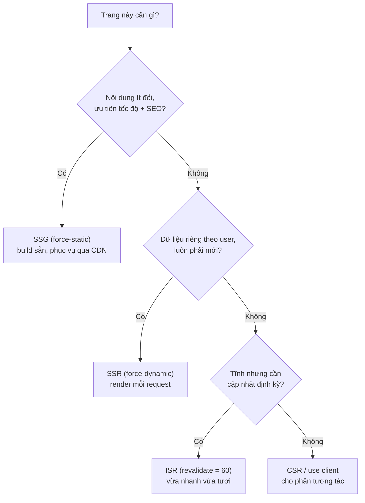

# Server vs Client Components

Trong Next.js, **rendering** (kết xuất, tức quá trình biến code thành giao diện hiển thị) có thể diễn ra ở hai nơi. **Server Components** là các component được dựng sẵn trên máy chủ, còn **Client Components** là các component chạy trong trình duyệt và có thể tương tác với người dùng. Bài này giúp bạn phân biệt hai loại này và biết khi nào nên dùng loại nào.

---

## Mục lục

- [Vì sao có nhiều rendering mode?](#vì-sao-có-nhiều-rendering-mode)
- [Server Components (default)](#server-components-default)
- [Client Components ("use client")](#client-components-use-client)
- [Composition](#composition)
- [Khi nào dùng cái nào?](#khi-nào-dùng-cái-nào)
- ["use server" directive](#use-server-directive)

---

## Vì sao có nhiều rendering mode?

**Vấn đề:** Mỗi trang có yêu cầu khác nhau về **tốc độ**, **SEO** và **độ tươi dữ liệu**. Một chế độ render duy nhất không tối ưu cho tất cả:

```tsx
// Render tất cả mọi trang theo cùng MỘT cách
// → trang marketing cần nhanh + SEO nhưng lại render lại mỗi request (chậm)
// → dashboard cần dữ liệu mới theo user nhưng lại bị cache tĩnh (sai)
// → trang sản phẩm vừa cần nhanh, vừa cần cập nhật giá → không cách nào vừa lòng cả hai
```

**Giải pháp:** Next cho chọn chế độ render **theo từng trang**, cân bằng đánh đổi:

```tsx
// SSG — build sẵn lúc deploy, nhanh nhất + phục vụ qua CDN (trang tĩnh)
export const dynamic = "force-static";

// SSR — render mỗi request, cá nhân hoá theo user (dữ liệu luôn mới)
export const dynamic = "force-dynamic";

// ISR — tĩnh nhưng tự làm mới định kỳ (vừa nhanh vừa cập nhật)
export const revalidate = 60; // giây

// CSR — component "use client" cho phần tương tác trong trình duyệt
// RSC + PPR — kết hợp tĩnh + động trên cùng một trang (shell tĩnh, nội dung động stream sau)
```

Cây quyết định dưới đây giúp chọn chế độ render phù hợp theo yêu cầu của từng trang:



:::tip[Dùng thực tế]

- **Landing / marketing** → **SSG**: nội dung ít đổi, ưu tiên tốc độ và SEO.
- **Trang cá nhân / dashboard** → **SSR**: dữ liệu phải mới và riêng cho từng user.
- **E-commerce (trang sản phẩm)** → **ISR**: tĩnh để nhanh, làm mới định kỳ để cập nhật giá/tồn kho.
- **Phần tương tác (form, counter, filter)** → **CSR** (`"use client"`); **PPR** cho shell tĩnh + nội dung động stream sau.

:::

---

## Server Components (default)

Mặc định trong App Router — mọi component là **Server Component**:

```tsx
// app/page.tsx — Server Component (no "use client")
import { db } from "@/lib/db";

export default async function HomePage() {
  const users = await db.user.findMany(); // chạy server
  return (
    <ul>
      {users.map(u => <li key={u.id}>{u.name}</li>)}
    </ul>
  );
}
```

Đặc điểm:

- **Async function** — `await` data fetching.
- **Không có hook** (useState, useEffect, useContext, useRef).
- **Không có event handler** (onClick, onChange).
- **Không có browser API** (window, document, localStorage).
- **Có thể đọc**: DB, file system, env var, Node API.

→ Render trên server, không vào client bundle.

---

## Client Components ("use client")

Đánh dấu **`"use client"`** ở **đầu file**:

```tsx
// app/components/Counter.tsx
"use client";

import { useState } from "react";

export default function Counter() {
  const [count, setCount] = useState(0);
  return <button onClick={() => setCount(c => c + 1)}>{count}</button>;
}
```

Đặc điểm:

- **Có hook** (useState, useEffect, useContext...).
- **Có event handler**.
- **Truy cập browser API**.
- **Không có** `await` top-level (trừ trong async function).
- **Không truy cập** DB, secret env trực tiếp.

→ Render hybrid: SSR cho HTML initial + hydrate JS bundle client.

:::info[Phân tích]

**`"use client"` đánh dấu boundary**, không phải component đó chỉ render
client:

- Server pre-render HTML lần đầu (SSR).
- Bundle JS gửi về client.
- Client hydrate: gắn event, state, effect.
- Sau đó interactive.

Component được import từ Client Component → cũng là Client (kế thừa).

```tsx
// Counter.tsx có "use client"
// Sub.tsx KHÔNG cần "use client" — vẫn được coi là client
function Sub() {
  return <div>Sub</div>;
}
```

`"use client"` chỉ cần ở **file gốc của boundary** — child tự thừa kế.

:::

---

## Composition

**Server Component có thể wrap Client Component**:

```tsx
// app/page.tsx (Server)
import Counter from "./Counter";

async function HomePage() {
  const data = await fetchData(); // server-side
  return (
    <div>
      <h1>{data.title}</h1>
      <Counter />  {/* Client */}
    </div>
  );
}
```

**Client Component pass children là Server Component qua prop**:

```tsx
// app/page.tsx (Server)
import { ClientWrapper } from "./ClientWrapper";

async function HomePage() {
  const user = await fetchUser();
  return (
    <ClientWrapper>
      <UserCard user={user} /> {/* Server render bên trong wrapper */}
    </ClientWrapper>
  );
}
```

```tsx
// ClientWrapper.tsx
"use client";

export function ClientWrapper({ children }) {
  const [isOpen, setOpen] = useState(false);
  return (
    <div>
      <button onClick={() => setOpen(o => !o)}>Toggle</button>
      {isOpen && children} {/* children là Server, đã render từ server */}
    </div>
  );
}
```

Pattern này gọi là **"Server in Client"** — children được render server,
pass qua như slot.

:::tip[Mẹo]

**Pattern khi cần Server data trong Client tree**:

```tsx
// SAI — Client import Server component
"use client";
import ServerComp from "./ServerComp"; // ServerComp dùng DB

export function ClientWrapper() {
  return <ServerComp />; // sẽ build error
}

// ĐÚNG — Server pass element xuống Client
// page.tsx (Server)
function Page() {
  return (
    <ClientWrapper serverContent={<ServerComp />} />
  );
}
```

Pass JSX element làm prop — element được render server side, Client chỉ
quyết định **đặt ở đâu**.

:::

---

## Khi nào dùng cái nào?

| Need | Component |
|------|-----------|
| Fetch data từ DB/API | **Server** |
| Read secret env (`API_KEY`) | **Server** |
| SEO content | **Server** |
| Component tĩnh không interaction | **Server** |
| `useState`, `useEffect` | **Client** |
| Event handler (onClick) | **Client** |
| Browser API (localStorage, window) | **Client** |
| Animation, gesture | **Client** |
| Form interactive | **Client** (action có thể server) |

**Quy tắc thực dụng**:

- **Default Server**.
- Convert sang Client **chỉ khi cần** hook/event.
- Push `"use client"` **càng sâu trong tree càng tốt** — leaf component
  thôi.

```tsx
// Tệ — toàn page là Client (mất Server benefit)
"use client";
function Page() {
  const [filter, setFilter] = useState("");
  return (
    <>
      <Header />
      <Filter value={filter} onChange={setFilter} />
      <ProductList filter={filter} />
    </>
  );
}

// Tốt — chỉ Filter là Client
function Page() {
  return (
    <>
      <Header />
      <ProductsSection /> {/* Server, fetch data */}
    </>
  );
}

async function ProductsSection() {
  const products = await fetchProducts();
  return <ProductListInteractive products={products} />;
}

"use client";
function ProductListInteractive({ products }) {
  const [filter, setFilter] = useState("");
  return <>{/* ... */}</>;
}
```

---

## "use server" directive

`"use server"` đánh dấu **Server Action** — function chạy server, gọi
từ client:

```ts
// app/actions.ts
"use server";

export async function createPost(formData: FormData) {
  await db.post.create({
    data: { title: formData.get("title") as string },
  });
}
```

Hoặc inline trong component:

```tsx
"use client";

export default function Form() {
  async function action(formData) {
    "use server"; // function này chạy server
    await db.post.create({ data: { title: formData.get("title") } });
  }

  return (
    <form action={action}>
      <input name="title" />
      <button>Save</button>
    </form>
  );
}
```

:::warning[Cần lưu ý]

**Phân biệt 3 directive:**

| Directive | Vị trí | Ý nghĩa |
|-----------|--------|---------|
| `"use client"` | Đầu file | File này + dependency = Client Component |
| `"use server"` | Đầu file | File chứa Server Actions |
| `"use server"` | Trong function | Function này là Server Action |

`"use client"` và `"use server"` **không đối lập** — đánh dấu boundary
khác nhau.

Đừng:

```tsx
// SAI
"use client";
"use server"; // không có ý nghĩa trộn lẫn
```

Server Component **không có directive** — đó là default.

:::

:::info[Phân tích]

**Network payload Server Component vs Client Component**:

Server Component build sinh ra **RSC payload** (JSON-like):

```
M1:{"id":"_ssr_components/Header.js"}
...
[children, props for Header]
```

Client browser nhận:

- **HTML** (initial paint, SEO).
- **RSC payload** (subsequent navigation).
- **JS bundle** (Client Components hydrate).

Server Component update qua RSC payload **không cần ship JS** — chỉ data.
Nhỏ hơn nhiều so với ship cả component code.

→ Lý do bundle Next.js App Router thường **nhỏ hơn** Pages Router cùng
feature.

:::
