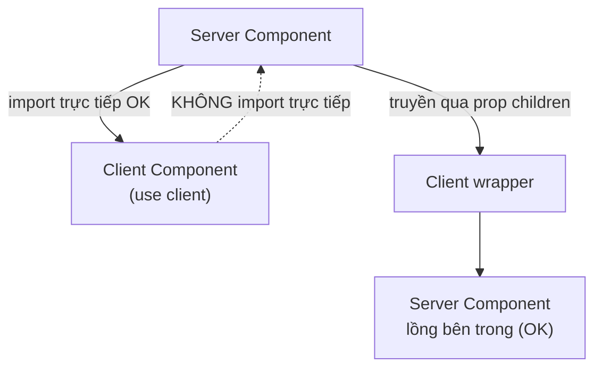
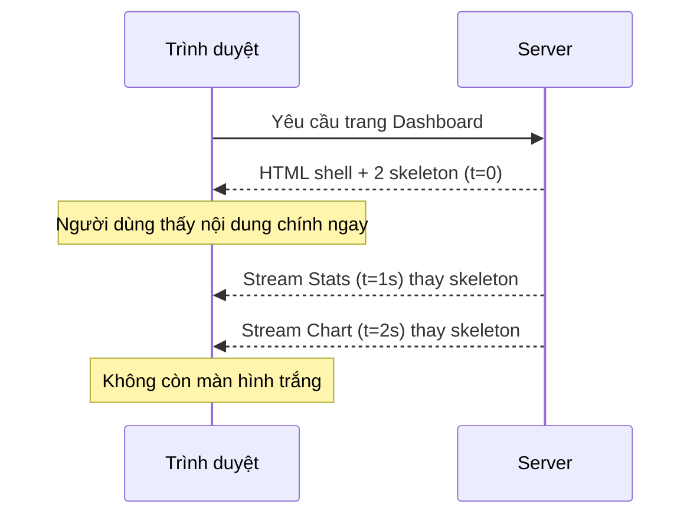

# Boundaries và Streaming

**Boundary** (ranh giới) là điểm phân chia giữa phần code chạy trên server và phần chạy trên client trong cây component. **Streaming** (truyền dần) là kỹ thuật gửi giao diện cho người dùng theo từng phần ngay khi sẵn sàng, thay vì chờ toàn bộ trang dựng xong mới hiển thị. Bài này giúp bạn hiểu cách đặt ranh giới hợp lý và dùng streaming để trang tải nhanh hơn.

[](pathname:///img/nextjs/boundaries-streaming.webp)

---

:::note[Ghi nhớ nhanh]

- ⭐ **Streaming + Suspense** — gửi shell và nội dung chính ngay, bọc phần chậm trong `<Suspense fallback>` để stream sau, tránh màn hình trắng chờ toàn bộ data.
- ⭐ **Không `await` ở parent trước Suspense** — nếu parent await sẽ vẫn bị waterfall; để mỗi component con tự `await` để chạy song song.
- **Props Server → Client phải serializable** — function không truyền được; muốn pass action thì dùng Server Action (bản thân nó serialize được).
- **`server-only` / `client-only`** — package chặn import sai môi trường ngay tại build time.
- **`loading.tsx`** — tự bọc Suspense quanh cả page khi navigation; kết hợp Suspense thủ công bên trong cho từng section load riêng.

:::

---

## Mục lục

- [Vì sao có streaming & Suspense boundary?](#vì-sao-có-streaming--suspense-boundary)
- [Component Boundaries](#component-boundaries)
- [Pass props giữa boundary](#pass-props-giữa-boundary)
- [Server-only / Client-only utility](#server-only--client-only-utility)
- [Streaming với Suspense](#streaming-với-suspense)
- [Loading.tsx](#loadingtsx)
- [Câu hỏi phỏng vấn](#câu-hỏi-phỏng-vấn)

---

## Vì sao có streaming & Suspense boundary?

**Vấn đề:** Nếu một trang chờ **TẤT CẢ** dữ liệu mới gửi HTML, thì chỉ một phần chậm cũng làm **cả trang** trắng/treo lâu.

```tsx
// Cả trang phải đợi phần gợi ý cá nhân hoá (chậm) xong mới hiển thị
async function Page() {
  const main = await fetchMain();           // 0.2s
  const recos = await fetchRecommendations(); // 2s — chậm nhất
  return (
    <>
      <MainContent data={main} />
      <Recommendations data={recos} />
    </>
  );
}
// → User thấy màn hình trắng ~2s, dù nội dung chính đã sẵn từ 0.2s
```

**Giải pháp:** **STREAMING + Suspense boundary** — chia trang thành vùng, phần nào sẵn gửi trước, phần chậm bọc `<Suspense fallback>` (hoặc file `loading.tsx`) hiện skeleton rồi **stream** nội dung thật khi xong.

```tsx
import { Suspense } from "react";

function Page() {
  return (
    <>
      <MainContent />                              {/* gửi ngay */}
      <Suspense fallback={<RecoSkeleton />}>       {/* cô lập phần chậm */}
        <Recommendations />                        {/* stream sau khi xong */}
      </Suspense>
    </>
  );
}

async function Recommendations() {
  const recos = await fetchRecommendations(); // 2s — không chặn phần còn lại
  return <RecoView data={recos} />;
}
// → User thấy nội dung chính ngay (TTFB nhanh), phần gợi ý hiện sau
```

:::tip[Dùng thực tế]

- **Hiện shell + nội dung chính ngay**: header, nav, bài viết gửi trước; người dùng đọc được liền.
- **Stream phần chậm sau**: khối "gợi ý cho bạn", "đánh giá sản phẩm", "sản phẩm liên quan" bọc `<Suspense>` để không chặn trang.
- **`loading.tsx` skeleton tự động**: đặt ở thư mục route, Next.js tự bọc Suspense cho cả page khi điều hướng.
- **Cô lập phần chậm**: một API chậm/lỗi chỉ ảnh hưởng vùng của nó, phần còn lại vẫn hiển thị bình thường.

:::

---

## Component Boundaries

**Boundary** = ranh giới giữa Server Component và Client Component:

```tsx
// page.tsx (Server)
import Counter from "./Counter";  // ← boundary

function Page() {
  return (
    <>
      <ServerHeader />
      <Counter />  {/* Client từ đây */}
    </>
  );
}
```

```tsx
// Counter.tsx (Client)
"use client";

export default function Counter() {
  // Client boundary — mọi thứ dưới đây client
}
```

Rules:

- **Server có thể import Client** — common pattern.
- **Client KHÔNG thể import Server** trực tiếp.
- Pass Server qua children/prop từ Server parent.

```tsx
// SAI
"use client";
import ServerData from "./ServerData"; // build error nếu ServerData dùng DB

// ĐÚNG — Server pass element xuống
// page.tsx (Server)
<ClientWrap>
  <ServerData />
</ClientWrap>
```

Sơ đồ chiều import qua boundary:



---

## Pass props giữa boundary

Props từ Server → Client phải **serializable** (JSON-compatible):

| Pass được | Không pass được |
|-----------|-----------------|
| String, number, boolean | Function (Server-side) |
| Plain object | Class instance (Map, Set, Date OK, custom no) |
| Array | Symbol |
| `null`, `undefined` | Promise (đang work, partial) |
| Date | DOM node |
| Map, Set (React 19+) | |
| Promise (React 19+) | |
| JSX element | |

```tsx
// Server
async function Page() {
  const data = await fetchData();

  return (
    <ClientComp
      title="OK"
      count={42}
      data={data}            // JSON OK
      items={[1, 2, 3]}
      onClick={() => {}}     // SAI — function không serialize
    />
  );
}
```

Để pass action xuống Client, dùng **Server Action**:

```ts
// actions.ts
"use server";
export async function handleClick(id: string) { /* ... */ }
```

```tsx
// page.tsx (Server)
import { handleClick } from "./actions";
import ClientButton from "./ClientButton";

function Page() {
  return <ClientButton onClick={handleClick} />;
}
```

Server Action **serialize được** (chính nó là server endpoint).

---

## Server-only / Client-only utility

**`server-only`** — throw nếu import từ Client:

```bash
npm install server-only
```

```ts
// lib/secret.ts
import "server-only";
export const secret = process.env.SECRET;
```

```tsx
"use client";
import { secret } from "@/lib/secret"; // build error!
```

**`client-only`** — throw nếu chạy server:

```bash
npm install client-only
```

```ts
// lib/browser.ts
import "client-only";
export function getViewport() {
  return { w: window.innerWidth };
}
```

---

## Streaming với Suspense

Server Component stream HTML khi data ready:

```tsx
import { Suspense } from "react";

export default function Dashboard() {
  return (
    <>
      <PageHeader />

      <Suspense fallback={<StatsSkeleton />}>
        <Stats />
      </Suspense>

      <Suspense fallback={<ChartSkeleton />}>
        <Chart />
      </Suspense>
    </>
  );
}

async function Stats() {
  const data = await fetchStats(); // 1s
  return <StatsView data={data} />;
}

async function Chart() {
  const data = await fetchChart(); // 2s
  return <ChartView data={data} />;
}
```

Timeline:

```
t=0:     Browser nhận HTML "Dashboard" + 2 skeleton.
t=1:     Stats stream xuống, swap skeleton.
t=2:     Chart stream xuống, swap skeleton.
```

User thấy progress, không "blank screen 2s".

Luồng streaming theo thời gian:



:::info[Phân tích]

**Streaming protocol — RSC Wire Format**:

Next.js stream HTML + RSC payload chunks qua **HTTP chunked transfer**:

```
HTTP/1.1 200 OK
Content-Type: text/x-component

[chunk 1] HTML shell
[chunk 2] Suspense placeholder
[chunk 3 — sau khi resolve] thực data
```

React on client (qua React Flight) parse chunks, swap placeholder.

Lợi ích:

- **TTFB nhanh** (response header gửi ngay).
- **FCP nhanh** (skeleton hiển thị ngay).
- **TTI tăng dần** (interactive khi từng phần hydrate).

Vercel Analytics đo:

```
LCP: 0.8s    (shell + first content)
FCP: 0.3s    (skeleton)
INP: 50ms    (interactive)
```

So với non-streaming:

```
LCP: 2.5s
FCP: 2.5s
INP: 100ms
```

Streaming → **perceived performance** tốt hơn nhiều.

:::

---

## Loading.tsx

`loading.tsx` automatically wrap **Suspense** quanh page:

```tsx
// app/dashboard/loading.tsx
export default function Loading() {
  return <PageSkeleton />;
}

// app/dashboard/page.tsx
async function Dashboard() {
  const data = await fetchAll(); // Loading.tsx hiển thị khi await
  return <div>{/* ... */}</div>;
}
```

Equivalent với:

```tsx
<Suspense fallback={<PageSkeleton />}>
  <Dashboard />
</Suspense>
```

`loading.tsx` ở level page. Suspense thủ công bên trong → từng section
load riêng.

:::tip[Mẹo]

**Combo `loading.tsx` + Suspense thủ công**:

```
app/dashboard/
├── loading.tsx       # khi navigate đến /dashboard
└── page.tsx          # bên trong dùng Suspense cho section
```

```tsx
// app/dashboard/loading.tsx
export default function Loading() {
  return <DashboardSkeleton />;
}

// app/dashboard/page.tsx
import { Suspense } from "react";

export default function Dashboard() {
  return (
    <>
      <PageHeader /> {/* render ngay, không await */}

      <div className="grid">
        <Suspense fallback={<CardSkeleton />}>
          <UserCard />
        </Suspense>

        <Suspense fallback={<CardSkeleton />}>
          <StatsCard />
        </Suspense>
      </div>
    </>
  );
}
```

Flow:

1. User click link → `loading.tsx` show.
2. Page render → `PageHeader` immediate + 2 skeleton.
3. UserCard, StatsCard stream khi từng cái sẵn sàng.

UX nhất quán: luôn có feedback, không bao giờ blank.

:::

:::warning[Cần lưu ý]

**Suspense + waterfall fix**:

```tsx
// Tệ — Suspense wrap component CÓ await — vẫn waterfall
async function Page() {
  const user = await fetchUser(); // block render
  return (
    <Suspense fallback={<Skeleton />}>
      <Orders /> {/* chỉ start sau khi user xong */}
    </Suspense>
  );
}

// Tốt — không await ở parent
function Page() {
  return (
    <>
      <Suspense fallback={<UserSkeleton />}>
        <User />
      </Suspense>
      <Suspense fallback={<OrderSkeleton />}>
        <Orders />
      </Suspense>
    </>
  );
}

async function User() {
  const user = await fetchUser();
  return /* ... */;
}

async function Orders() {
  const orders = await fetchOrders();
  return /* ... */;
}
```

User và Orders **song song**. Page function không await.

:::

---

## Câu hỏi phỏng vấn

Những câu thường gặp về chủ đề này. Tự trả lời trước, rồi bấm **Xem đáp án** để đối chiếu.

**1. `Streaming` trong Next.js là gì và nó giải quyết vấn đề gì so với cách chờ đủ toàn bộ dữ liệu rồi mới gửi HTML?**

<details className="qa">
<summary>Xem đáp án</summary>

Streaming là gửi HTML **theo từng phần ngay khi phần đó sẵn sàng**, thay vì chờ mọi dữ liệu xong rồi mới gửi một cục.

Vấn đề của cách cũ: một khối chậm kéo cả trang xuống theo.

```tsx
async function Page() {
  const main = await fetchMain();             // 0.2s
  const recos = await fetchRecommendations();  // 2s — chậm nhất
  // → user nhìn màn hình trắng ~2s dù nội dung chính xong từ 0.2s
}
```

Với streaming, phần nhanh đi trước, phần chậm được bọc trong `<Suspense>` và hiện skeleton, rồi nội dung thật được đẩy xuống sau:

```tsx
<MainContent />
<Suspense fallback={<RecoSkeleton />}>
  <Recommendations />
</Suspense>
```

Lợi ích không chỉ là cảm giác nhanh hơn: nó **cô lập rủi ro**. Một API chậm hay lỗi chỉ ảnh hưởng đúng vùng của nó, phần còn lại của trang vẫn hiển thị và dùng được bình thường.

</details>

**2. `Suspense boundary` hoạt động thế nào phía server — server gửi gì trước, gửi gì sau, và trình duyệt ráp lại bằng cách nào?**

<details className="qa">
<summary>Xem đáp án</summary>

Server render cây component và khi gặp một component đang chờ dữ liệu, nó **không dừng lại**: nó gửi ngay phần khung cùng nội dung `fallback` của boundary đó, đánh dấu vị trí bằng một placeholder, rồi tiếp tục render phần khác.

Khi dữ liệu của vùng đó xong, server gửi thêm một chunk chứa nội dung thật kèm chỉ dẫn "chỗ này thay vào placeholder kia". Tất cả đi trên **cùng một kết nối HTTP** theo kiểu chunked transfer, không phải request mới.

Phía trình duyệt, React đọc các chunk đến dần và tráo skeleton bằng nội dung thật, giữ nguyên phần đã hiển thị.

```
t=0: HTML shell + 2 skeleton
t=1: chunk Stats → thay skeleton thứ nhất
t=2: chunk Chart → thay skeleton thứ hai
```

Điểm đáng nhớ: thứ tự các vùng về đích phụ thuộc tốc độ dữ liệu, không theo thứ tự trong code — vùng nào xong trước hiện trước.

</details>

**3. Giải thích vì sao streaming cải thiện rõ `TTFB` và `FCP`, nhưng chưa chắc cải thiện `LCP`.**

<details className="qa">
<summary>Xem đáp án</summary>

- **TTFB** đo lúc byte đầu tiên về tới trình duyệt. Streaming cho phép gửi header và phần shell ngay, không chờ dữ liệu, nên chỉ số này cải thiện gần như chắc chắn.
- **FCP** đo lúc có nội dung đầu tiên được vẽ. Skeleton cũng tính là nội dung, nên FCP cũng tốt lên rõ rệt.
- **LCP** lại đo thời điểm **phần tử lớn nhất** trong khung nhìn hiện ra. Nếu phần tử đó — ảnh banner, khối nội dung chính — nằm trong một `Suspense` chờ API chậm, thì nó vẫn xuất hiện muộn y như cũ. Skeleton không được tính thay.

Bài học thực dụng: đừng bọc nội dung chính vào Suspense chỉ vì thấy streaming có vẻ hay. Hãy để phần lớn nhất và quan trọng nhất render thẳng, chỉ stream những khối phụ như "gợi ý cho bạn" hay "sản phẩm liên quan". Streaming cải thiện **cảm nhận** về tốc độ, nhưng nếu đặt boundary sai chỗ thì chỉ số LCP có thể không nhúc nhích.

</details>

**4. Bạn bọc `Suspense` quanh một component nhưng component cha vẫn `await` — vì sao vẫn bị `waterfall`? Sửa thế nào?**

<details className="qa">
<summary>Xem đáp án</summary>

Vì `await` ở component cha **chặn toàn bộ việc render** của nó. Chừng nào lời gọi đó chưa xong, React còn chưa đi tới cây con, nên `Suspense` bên trong chưa hề được xử lý và component con cũng chưa bắt đầu lấy dữ liệu.

```tsx
// Tệ — vẫn waterfall
async function Page() {
  const user = await fetchUser(); // chặn ở đây
  return (
    <Suspense fallback={<Skeleton />}>
      <Orders /> {/* chỉ khởi động sau khi fetchUser xong */}
    </Suspense>
  );
}
```

Cách sửa: **bỏ `await` ở cha**, để mỗi component con tự lấy dữ liệu của mình trong boundary riêng.

```tsx
function Page() {
  return (
    <>
      <Suspense fallback={<UserSkeleton />}><User /></Suspense>
      <Suspense fallback={<OrderSkeleton />}><Orders /></Suspense>
    </>
  );
}
```

Lúc này hai lời gọi chạy **song song**, tổng thời gian bằng lời gọi chậm nhất chứ không phải tổng cộng. Quy tắc: component cha chỉ nên bố cục, việc chờ dữ liệu đẩy xuống lá.

</details>

**5. Nêu ít nhất hai cách để hai lời gọi dữ liệu độc lập chạy song song thay vì tuần tự trong một Server Component.**

<details className="qa">
<summary>Xem đáp án</summary>

**Cách một — tách thành hai component con, mỗi cái một `Suspense`.** Mỗi con tự `await` phần của mình nên hai lời gọi khởi động cùng lúc, và vùng nào xong trước hiện trước.

**Cách hai — khởi tạo promise trước rồi `await` chung một lần** khi bắt buộc phải lấy cả hai trong cùng component:

```tsx
async function Page() {
  const userPromise = fetchUser();   // khởi động ngay
  const ordersPromise = fetchOrders();
  const [user, orders] = await Promise.all([userPromise, ordersPromise]);
}
```

Điểm mấu chốt là gọi hàm **trước**, `await` **sau** — viết `await fetchUser()` rồi mới `await fetchOrders()` là tuần tự.

Lưu ý thêm: `Promise.all` sẽ hỏng cả cụm nếu một lời gọi lỗi; cần chịu lỗi từng phần thì dùng `Promise.allSettled`, hoặc quay về cách một để mỗi vùng có `error.tsx` riêng. Cách một thường tốt hơn cho trải nghiệm vì không phải chờ cái chậm nhất mới hiện được gì.

</details>

**6. `loading.tsx` tương đương với cấu trúc nào viết tay? Nó bọc `Suspense` ở phạm vi nào của route?**

<details className="qa">
<summary>Xem đáp án</summary>

`loading.tsx` là đường tắt: Next.js tự bọc một `Suspense` quanh nội dung của route, lấy chính component đó làm `fallback`.

```tsx
// app/dashboard/loading.tsx  ⇔  viết tay:
<Suspense fallback={<PageSkeleton />}>
  <Dashboard />
</Suspense>
```

Phạm vi của nó là **cấp segment route nơi đặt file**: nó bao cả `page.tsx` của segment đó và mọi route con bên dưới, nằm bên trong `layout.tsx` cùng cấp. Nghĩa là khi điều hướng, layout và nav vẫn hiện bình thường, chỉ phần nội dung được thay bằng skeleton.

Hệ quả cần nắm: nó là một boundary **thô, tất cả hoặc không gì** — chỉ cần một phần của trang còn chờ là cả vùng nội dung hiện skeleton. Muốn từng khối tự hiện khi sẵn sàng thì phải đặt thêm `Suspense` thủ công bên trong page. Hai thứ này lồng nhau được và thường dùng chung.

</details>

**7. Khi nào dùng `loading.tsx`, khi nào cần `Suspense` thủ công bên trong page? Kết hợp cả hai thì luồng hiển thị diễn ra ra sao?**

<details className="qa">
<summary>Xem đáp án</summary>

- **`loading.tsx`** cho phản hồi tức thì khi điều hướng: người dùng bấm link là thấy ngay skeleton của cả trang, không bị cảm giác treo.
- **`Suspense` thủ công** để chia trang thành nhiều vùng, mỗi vùng hiện độc lập khi dữ liệu của nó xong.

Kết hợp cả hai là bố cục phổ biến nhất:

```
app/dashboard/
├── loading.tsx   # hiện khi điều hướng tới /dashboard
└── page.tsx      # bên trong dùng Suspense cho từng khối
```

Luồng hiển thị:

1. Người dùng bấm link — `loading.tsx` hiện ngay lập tức.
2. Trang bắt đầu render — phần không chờ dữ liệu như `PageHeader` hiện liền, kèm skeleton cho từng khối.
3. `UserCard`, `StatsCard` lần lượt stream xuống khi mỗi cái sẵn sàng.

Kết quả là luôn có phản hồi ở mọi thời điểm, không bao giờ có khoảng trắng. Điều kiện để bước 2 và 3 đúng như mô tả: `page.tsx` **không** được `await` ở cấp ngoài cùng.

</details>

**8. `error.tsx` phối hợp với `Suspense` thế nào khi một vùng đang stream thì gặp lỗi? Phần còn lại của trang có bị ảnh hưởng không?**

<details className="qa">
<summary>Xem đáp án</summary>

`error.tsx` tạo một error boundary cho segment route, và nó bao lấy các vùng bên trong tương tự như `loading.tsx`. Khi một component đang stream ném lỗi, React bắt tại boundary gần nhất và thay vùng đó bằng giao diện lỗi, **không phá phần đã gửi xuống trước đó**.

Vì vậy phần còn lại của trang vẫn hiển thị và dùng được — đây chính là giá trị lớn của việc chia boundary: lỗi được cô lập theo vùng.

Vài điểm hay bị hỏi thêm:

- Muốn mỗi khối có thông báo lỗi riêng, đặt error boundary quanh từng khối chứ đừng dựa vào một `error.tsx` duy nhất ở cấp trang.
- `error.tsx` là Client Component, nhận `reset` để thử lại vùng đó mà không tải lại cả trang.
- Không hiển thị message lỗi thô ra người dùng; log chi tiết ở server, phía client chỉ hiện thông điệp chung.
- Lỗi xảy ra **trước** khi stream bắt đầu thì xử lý dễ hơn; lỗi xảy ra giữa chừng chỉ còn cách thay nội dung vùng, vì header đã gửi đi rồi.

</details>

**9. Mô tả `RSC wire format` và HTTP chunked transfer: các chunk được gửi và parse thế nào trên client?**

<details className="qa">
<summary>Xem đáp án</summary>

Server không trả một file HTML hoàn chỉnh mà mở một response **chunked transfer**: header đi ngay, phần thân được đẩy dần theo nhiều mảnh trên cùng kết nối.

```
HTTP/1.1 200 OK
Content-Type: text/x-component

[chunk 1] HTML shell
[chunk 2] placeholder của Suspense
[chunk 3 — sau khi resolve] nội dung thật
```

Nội dung các chunk theo **RSC wire format**: một định dạng dòng lệnh dạng văn bản mô tả cây đã render — phần tử, props, tham chiếu tới Client Component và các placeholder chờ hoàn thiện. Nó không phải HTML và cũng không phải code JavaScript của component.

Phía client, React đọc luồng này và dựng dần cây trong bộ nhớ, tráo placeholder khi chunk tương ứng về tới. Vì là luồng liên tục nên giao diện cập nhật tăng dần chứ không đợi kết thúc response.

Điểm đáng nói: cùng định dạng đó được dùng lại cho các lần điều hướng sau, khi đó chỉ gửi payload chứ không gửi HTML mới.

</details>

**10. `Selective hydration` là gì và `Suspense` giúp nó ra sao? Một bundle JS nặng ở một vùng có chặn cả trang trở nên tương tác không?**

<details className="qa">
<summary>Xem đáp án</summary>

Selective hydration là việc React hydrate **từng vùng độc lập** thay vì phải hoàn tất cả cây mới cho phép tương tác. Mỗi `Suspense` là một đơn vị hydrate riêng: vùng nào có đủ HTML và JS thì hydrate luôn, không chờ hàng xóm.

Nên câu trả lời cho vế sau là **không**: một khối nặng — chẳng hạn biểu đồ kéo theo thư viện lớn — chỉ làm chậm chính vùng của nó. Nav, form tìm kiếm, nút bấm ở nơi khác đã tương tác được từ trước.

Thêm nữa, React ưu tiên theo hành vi người dùng: nếu ai đó tương tác với một vùng chưa hydrate, vùng đó được đẩy lên đầu hàng đợi.

Hệ quả khi thiết kế: chia boundary quanh những khối nặng về JS, không chỉ quanh khối chậm về dữ liệu. Và kết hợp với việc nạp động cho thư viện lớn để vùng đó không chiếm băng thông của phần quan trọng hơn.

</details>

**11. Nếu người dùng click vào một vùng chưa `hydrate` xong thì React xử lý sự kiện đó thế nào?**

<details className="qa">
<summary>Xem đáp án</summary>

React **không để rơi** sự kiện đó. Nó ghi lại tương tác, ưu tiên hydrate ngay vùng vừa được chạm vào — chen lên trước những vùng khác đang xếp hàng — rồi phát lại sự kiện khi vùng đó đã sẵn sàng. Với người dùng, cảm giác là nút bấm hơi trễ một nhịp chứ không phải bấm vào hư không.

Có giới hạn cần nói rõ khi trả lời:

- Cơ chế này áp dụng cho các sự kiện rời rạc như click; không cứu được mọi loại tương tác, ví dụ gõ liên tục vào ô nhập liệu vẫn có thể rơi mất ký tự.
- Nó chỉ giảm nhẹ hậu quả chứ không thay thế việc giảm lượng JS. Vùng càng nặng thì độ trễ càng rõ.

Hệ quả thực hành: với các điều khiển quan trọng, ưu tiên giữ chúng nhẹ và đặt trong boundary riêng để hydrate sớm; tránh dồn cả trang vào một khối client khổng lồ.

</details>

**12. Kể các kiểu dữ liệu truyền được và KHÔNG truyền được qua boundary Server sang Client. Vì sao lại có ràng buộc serialize?**

<details className="qa">
<summary>Xem đáp án</summary>

| Truyền được | Không truyền được |
|---|---|
| Chuỗi, số, boolean, `null` | Function thường |
| Object thuần, mảng | Instance của class tự định nghĩa |
| `Date` | `Symbol` |
| `Map`, `Set` | DOM node |
| Phần tử JSX | Kết nối database, client của thư viện |

Lý do của ràng buộc: props phải **vượt qua mạng**. Server và trình duyệt là hai tiến trình khác nhau, thứ duy nhất đi giữa chúng là dữ liệu đã mã hoá thành văn bản. Function mang theo closure và tham chiếu tới môi trường của nó — không có cách nào gói lại rồi dựng lại y nguyên ở đầu kia.

```tsx
<ClientComp data={data} onClick={() => {}} /> // onClick báo lỗi
```

Hai lưu ý đi kèm: Server Action là ngoại lệ vì nó chỉ gửi một tham chiếu để gọi ngược về server. Và mọi props qua ranh giới đều lộ ra trình duyệt, nên chỉ truyền DTO đã lọc field.

</details>

**13. Muốn `Client Component` gọi được logic phía server trong khi function không serialize được thì làm cách nào?**

<details className="qa">
<summary>Xem đáp án</summary>

Dùng **Server Action**. Nó là lời giải trực tiếp cho đúng bài toán này: hàm được đánh dấu `"use server"`, và cái đi xuống client không phải thân hàm mà chỉ là một tham chiếu để gọi ngược về server.

```ts
// actions.ts
"use server";
export async function handleClick(id: string) { /* ... */ }
```

```tsx
// page.tsx (Server)
import { handleClick } from "./actions";
return <ClientButton onClick={handleClick} />;
```

Client Component nhận prop đó và gọi như hàm bình thường; Next.js lo phần gửi request về server. Không phải tự dựng API route, không phải tự khai báo kiểu — kiểu suy ra thẳng từ TypeScript.

Cách còn lại là viết Route Handler rồi `fetch` từ client; chọn nó khi cần URL công khai hoặc method khác POST.

Nhắc lại điểm bảo mật: action tuy không lộ URL nhưng vẫn là endpoint public, nên phải xác thực và validate input ngay đầu function, đừng tin rằng chỉ UI của mình gọi nó.

</details>

**14. `server-only` và `client-only` dùng để làm gì, và chúng bắt lỗi ở thời điểm nào — build time hay runtime?**

<details className="qa">
<summary>Xem đáp án</summary>

Hai package nhỏ dựng **hàng rào ở mức module**, và chúng báo lỗi ngay lúc **build**, không phải đợi tới runtime.

```ts
// lib/secret.ts
import "server-only";
export const secret = process.env.SECRET;
```

```ts
// lib/browser.ts
import "client-only";
export function getViewport() { return { w: window.innerWidth }; }
```

- `server-only` chặn module bị kéo vào nhánh client — dùng cho file đụng database, secret, API của Node.
- `client-only` chặn module bị render trên server — dùng cho code đụng `window`, `document`, `localStorage`.

Cơ chế: mỗi package có hai bản export theo điều kiện môi trường, bản dành cho phía "sai" cố tình gây lỗi, nên bundler dừng lại ngay.

Giá trị lớn nhất là biến một **quy ước mềm** — kiểu "nhớ đừng import file này vào client" — thành lỗi cứng bị CI chặn, thay vì một sự cố rò rỉ phát hiện trên production.

</details>

**15. Streaming ảnh hưởng thế nào tới `SEO`? Bot tìm kiếm có đọc được nội dung được stream về sau không?**

<details className="qa">
<summary>Xem đáp án</summary>

Nội dung stream vẫn là **HTML do server sinh ra** trên cùng một response, chỉ là đến muộn hơn vài trăm mili giây. Các công cụ tìm kiếm hiện đại đọc hết response nên nhìn thấy đầy đủ — khác hẳn nội dung do JS ở client dựng sau khi tải xong, vốn phụ thuộc vào việc bot có chịu chạy JS hay không.

Dù vậy vẫn nên thận trọng, và đây là phần ghi điểm khi trả lời:

- Đặt nội dung quan trọng nhất cho SEO — tiêu đề, mô tả, nội dung chính — **ngoài** Suspense, để nó nằm ngay trong shell đầu tiên.
- `metadata` và thẻ head được xử lý sớm, đừng để chúng phụ thuộc vào dữ liệu chậm.
- Vùng stream chậm bất thường có rủi ro bot bỏ ngang; đặt thời gian chờ hợp lý cho các lời gọi dữ liệu.
- Kiểm chứng bằng công cụ xem HTML thực tế mà bot nhận được, đừng đoán.

Chỉ nên stream những khối phụ: gợi ý, đánh giá, sản phẩm liên quan.

</details>

**16. Khi header HTTP đã gửi đi rồi (streaming đã bắt đầu) thì còn đổi được status code hay `redirect` không? Hệ quả với xử lý lỗi là gì?**

<details className="qa">
<summary>Xem đáp án</summary>

Không. Status code và header nằm ở phần đầu response, đã rời server ngay từ chunk đầu tiên. Sau đó có lỗi gì thì response vẫn mang mã 200, và chuyển hướng cũng không còn thực hiện được bằng header nữa — chỉ còn cách xử lý ở phía client sau khi trang đã tải.

Hệ quả khi thiết kế:

- Mọi quyết định về **status và điều hướng** phải xảy ra **trước khi streaming bắt đầu**: kiểm tra đăng nhập và phân quyền ở middleware hoặc ở ngay đầu cây render, trước mọi `await` nằm trong Suspense.
- Kiểm tra sự tồn tại của tài nguyên sớm để còn trả về trang 404 đúng nghĩa; phát hiện muộn thì chỉ hiện được thông báo trong một vùng, trong khi mã trạng thái vẫn là 200 — điều này ảnh hưởng tới SEO.
- Lỗi phát sinh giữa chừng chỉ còn cách thay nội dung vùng đó bằng giao diện lỗi qua error boundary.

Tóm lại: xác thực và điều hướng đặt sớm, chỉ stream phần hiển thị.

</details>

**17. Đặt quá nhiều hoặc quá ít `Suspense boundary` gây hệ quả gì? Bạn chọn mức granularity dựa trên tiêu chí nào?**

<details className="qa">
<summary>Xem đáp án</summary>

**Quá ít**: cả trang chờ theo khối chậm nhất, gần như quay lại cách không streaming; một lỗi cũng kéo sập phạm vi rộng.

**Quá nhiều**: giao diện nhấp nháy vì hàng chục vùng lần lượt tráo chỗ, dễ gây dịch chuyển bố cục, và mỗi boundary còn thêm một chút chi phí cho việc quản lý chunk. Người dùng thấy rối hơn là thấy nhanh.

Tiêu chí chọn mức phù hợp:

- Bọc theo **khối có nghĩa với người dùng** — một thẻ thống kê, một biểu đồ, một danh sách đánh giá — chứ không bọc từng phần tử nhỏ.
- Bọc quanh phần **thật sự chậm hoặc nặng JS**; phần nhanh cứ để render thẳng.
- Giữ nội dung quan trọng nhất và phần tử lớn nhất **ngoài** boundary, vì lý do LCP và SEO.
- Gộp những khối có thời gian tải xấp xỉ nhau vào chung một boundary để đỡ nhấp nháy.

Cách kiểm chứng: xem thời điểm từng vùng về đích trên tab network và đo lại chỉ số trước sau.

</details>

**18. Thiết kế skeleton `fallback` thế nào để tránh `CLS` khi nội dung thật thay chỗ?**

<details className="qa">
<summary>Xem đáp án</summary>

Nguyên tắc duy nhất: skeleton phải **chiếm đúng chỗ** mà nội dung thật sẽ chiếm.

Cách làm cụ thể:

- Cho vùng chứa một chiều cao xác định, hoặc dựng skeleton mô phỏng đúng số dòng, số thẻ, khoảng cách của nội dung thật.
- Đặt tỷ lệ khung hình cho ảnh và video ngay ở skeleton để không bị đẩy nội dung khi ảnh tải xong.
- Dùng cùng hệ thống bố cục — cùng lưới, cùng khoảng đệm — giữa skeleton và nội dung thật, tốt nhất là dùng chung một component khung.
- Với danh sách dài không đoán được số dòng, cố định số dòng skeleton và giữ chiều cao vùng chứa, chấp nhận cuộn thêm còn hơn để trang giật.

Đo lường: xem chỉ số CLS trong công cụ đo hiệu năng của trình duyệt và ghi lại các thay đổi bố cục trong lúc vùng stream về.

Điểm cộng khi trả lời: skeleton nhại đúng hình dáng nội dung không chỉ đẹp mà còn giúp người dùng đoán trước cái sắp hiện, giảm cảm giác chờ.

</details>

**19. `PPR` (Partial Prerendering) liên quan gì tới `Suspense` và streaming? Nó khác gì so với `SSR` thuần có streaming?**

<details className="qa">
<summary>Xem đáp án</summary>

PPR là ý tưởng kết hợp tĩnh và động **trên cùng một trang**: phần khung tĩnh — header, bố cục, nội dung không đổi — được dựng sẵn từ trước và phục vụ ngay như một trang tĩnh, còn những vùng phụ thuộc request được để trống và stream vào sau.

`Suspense` chính là thứ đánh dấu ranh giới giữa hai phần đó: cái gì nằm trong boundary thì được coi là phần động, cái gì ngoài boundary thuộc về shell tĩnh.

Khác biệt với SSR có streaming:

| | SSR + streaming | PPR |
|---|---|---|
| Shell được dựng khi nào | Mỗi request | Trước, từ lúc build |
| Byte đầu tiên đến từ đâu | Server phải render | Có thể phục vụ từ biên, gần như tức thì |
| Phần động | Stream trong cùng request | Stream vào chỗ trống của shell |

Nói ngắn: SSR streaming giúp trang hiện dần, PPR giúp phần khung hiện **ngay lập tức** như trang tĩnh. Đây là tính năng còn ở giai đoạn thử nghiệm, nên khi trả lời nên nêu rõ điều đó.

</details>

**20. Một trang streaming vẫn chậm — bạn dùng chỉ số và công cụ nào để xác định boundary nào đang nghẽn?**

<details className="qa">
<summary>Xem đáp án</summary>

Quy trình từ ngoài vào trong:

- Xem **TTFB, FCP, LCP** trước để biết nghẽn ở đâu. TTFB cao nghĩa là có thứ chặn ngay trước khi stream bắt đầu — thường là một `await` ở component cha, hoặc middleware chậm. TTFB tốt nhưng LCP xấu nghĩa là phần tử lớn nhất đang nằm trong một boundary chậm.
- Mở tab network, xem response của trang: các chunk về ở mốc thời gian nào cho biết vùng nào tới muộn.
- Đo ngay trong code: ghi lại thời gian trước và sau mỗi lời gọi dữ liệu trong từng async component, hoặc dùng cơ chế instrumentation để xuất trace cho từng đoạn.
- Kiểm tra waterfall: hai lời gọi lẽ ra song song mà lại nối đuôi nhau là dấu hiệu `await` đặt sai chỗ.
- Nhìn cả phía cache: một vùng chậm bất thường có thể chỉ đơn giản là đang miss cache.

Sau khi tìm ra thủ phạm, hướng xử lý thường là bỏ `await` ở cha, cho chạy song song, thêm cache, hoặc chuyển khối đó xuống component client.

</details>
