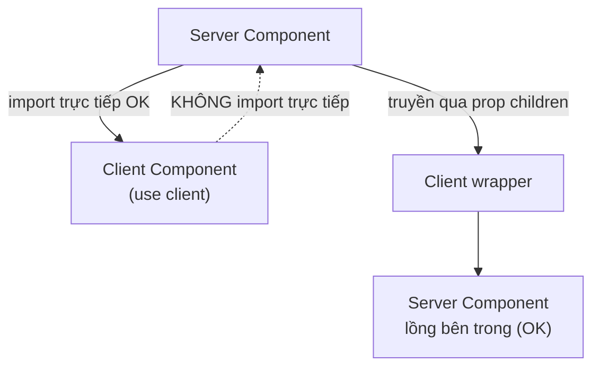
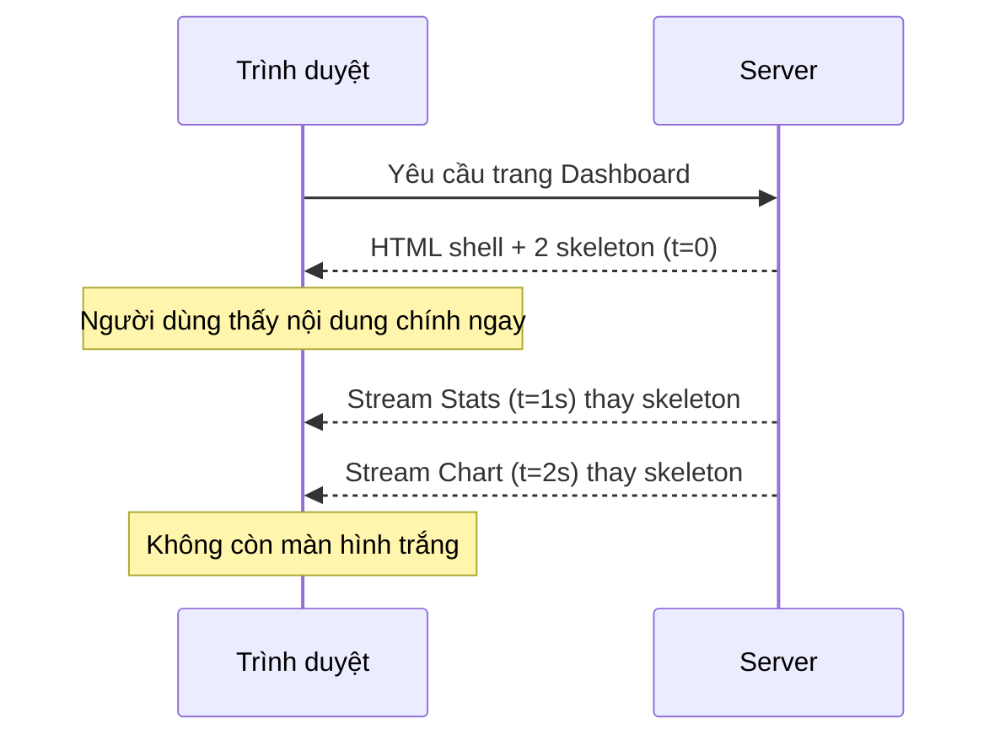

# Boundaries và Streaming

**Boundary** (ranh giới) là điểm phân chia giữa phần code chạy trên server và phần chạy trên client trong cây component. **Streaming** (truyền dần) là kỹ thuật gửi giao diện cho người dùng theo từng phần ngay khi sẵn sàng, thay vì chờ toàn bộ trang dựng xong mới hiển thị. Bài này giúp bạn hiểu cách đặt ranh giới hợp lý và dùng streaming để trang tải nhanh hơn.

---

:::note[Ghi nhớ nhanh]

- ⭐ **Streaming + Suspense** — gửi shell và nội dung chính ngay, bọc phần chậm trong `<Suspense fallback>` để stream sau, tránh màn hình trắng chờ toàn bộ data.
- ⭐ **Không `await` ở parent trước Suspense** — nếu parent await sẽ vẫn bị waterfall; để mỗi component con tự `await` để chạy song song.
- **Props Server → Client phải serializable** — function không truyền được; muốn pass action thì dùng Server Action (bản thân nó serialize được).
- **`server-only` / `client-only`** — package chặn import sai môi trường ngay tại build time.
- **`loading.tsx`** — tự bọc Suspense quanh cả page khi navigation; kết hợp Suspense thủ công bên trong cho từng section load riêng.

:::

---

## Mục lục

- [Vì sao có streaming & Suspense boundary?](#vì-sao-có-streaming--suspense-boundary)
- [Component Boundaries](#component-boundaries)
- [Pass props giữa boundary](#pass-props-giữa-boundary)
- [Server-only / Client-only utility](#server-only--client-only-utility)
- [Streaming với Suspense](#streaming-với-suspense)
- [Loading.tsx](#loadingtsx)
- [Câu hỏi phỏng vấn](#câu-hỏi-phỏng-vấn)

---

## Vì sao có streaming & Suspense boundary?

**Vấn đề:** Nếu một trang chờ **TẤT CẢ** dữ liệu mới gửi HTML, thì chỉ một phần chậm cũng làm **cả trang** trắng/treo lâu.

```tsx
// Cả trang phải đợi phần gợi ý cá nhân hoá (chậm) xong mới hiển thị
async function Page() {
  const main = await fetchMain();           // 0.2s
  const recos = await fetchRecommendations(); // 2s — chậm nhất
  return (
    <>
      <MainContent data={main} />
      <Recommendations data={recos} />
    </>
  );
}
// → User thấy màn hình trắng ~2s, dù nội dung chính đã sẵn từ 0.2s
```

**Giải pháp:** **STREAMING + Suspense boundary** — chia trang thành vùng, phần nào sẵn gửi trước, phần chậm bọc `<Suspense fallback>` (hoặc file `loading.tsx`) hiện skeleton rồi **stream** nội dung thật khi xong.

```tsx
import { Suspense } from "react";

function Page() {
  return (
    <>
      <MainContent />                              {/* gửi ngay */}
      <Suspense fallback={<RecoSkeleton />}>       {/* cô lập phần chậm */}
        <Recommendations />                        {/* stream sau khi xong */}
      </Suspense>
    </>
  );
}

async function Recommendations() {
  const recos = await fetchRecommendations(); // 2s — không chặn phần còn lại
  return <RecoView data={recos} />;
}
// → User thấy nội dung chính ngay (TTFB nhanh), phần gợi ý hiện sau
```

:::tip[Dùng thực tế]

- **Hiện shell + nội dung chính ngay**: header, nav, bài viết gửi trước; người dùng đọc được liền.
- **Stream phần chậm sau**: khối "gợi ý cho bạn", "đánh giá sản phẩm", "sản phẩm liên quan" bọc `<Suspense>` để không chặn trang.
- **`loading.tsx` skeleton tự động**: đặt ở thư mục route, Next.js tự bọc Suspense cho cả page khi điều hướng.
- **Cô lập phần chậm**: một API chậm/lỗi chỉ ảnh hưởng vùng của nó, phần còn lại vẫn hiển thị bình thường.

:::

---

## Component Boundaries

**Boundary** = ranh giới giữa Server Component và Client Component:

```tsx
// page.tsx (Server)
import Counter from "./Counter";  // ← boundary

function Page() {
  return (
    <>
      <ServerHeader />
      <Counter />  {/* Client từ đây */}
    </>
  );
}
```

```tsx
// Counter.tsx (Client)
"use client";

export default function Counter() {
  // Client boundary — mọi thứ dưới đây client
}
```

Rules:

- **Server có thể import Client** — common pattern.
- **Client KHÔNG thể import Server** trực tiếp.
- Pass Server qua children/prop từ Server parent.

```tsx
// SAI
"use client";
import ServerData from "./ServerData"; // build error nếu ServerData dùng DB

// ĐÚNG — Server pass element xuống
// page.tsx (Server)
<ClientWrap>
  <ServerData />
</ClientWrap>
```

Sơ đồ chiều import qua boundary:



---

## Pass props giữa boundary

Props từ Server → Client phải **serializable** (JSON-compatible):

| Pass được | Không pass được |
|-----------|-----------------|
| String, number, boolean | Function (Server-side) |
| Plain object | Class instance (Map, Set, Date OK, custom no) |
| Array | Symbol |
| `null`, `undefined` | Promise (đang work, partial) |
| Date | DOM node |
| Map, Set (React 19+) | |
| Promise (React 19+) | |
| JSX element | |

```tsx
// Server
async function Page() {
  const data = await fetchData();

  return (
    <ClientComp
      title="OK"
      count={42}
      data={data}            // JSON OK
      items={[1, 2, 3]}
      onClick={() => {}}     // SAI — function không serialize
    />
  );
}
```

Để pass action xuống Client, dùng **Server Action**:

```ts
// actions.ts
"use server";
export async function handleClick(id: string) { /* ... */ }
```

```tsx
// page.tsx (Server)
import { handleClick } from "./actions";
import ClientButton from "./ClientButton";

function Page() {
  return <ClientButton onClick={handleClick} />;
}
```

Server Action **serialize được** (chính nó là server endpoint).

---

## Server-only / Client-only utility

**`server-only`** — throw nếu import từ Client:

```bash
npm install server-only
```

```ts
// lib/secret.ts
import "server-only";
export const secret = process.env.SECRET;
```

```tsx
"use client";
import { secret } from "@/lib/secret"; // build error!
```

**`client-only`** — throw nếu chạy server:

```bash
npm install client-only
```

```ts
// lib/browser.ts
import "client-only";
export function getViewport() {
  return { w: window.innerWidth };
}
```

---

## Streaming với Suspense

Server Component stream HTML khi data ready:

```tsx
import { Suspense } from "react";

export default function Dashboard() {
  return (
    <>
      <PageHeader />

      <Suspense fallback={<StatsSkeleton />}>
        <Stats />
      </Suspense>

      <Suspense fallback={<ChartSkeleton />}>
        <Chart />
      </Suspense>
    </>
  );
}

async function Stats() {
  const data = await fetchStats(); // 1s
  return <StatsView data={data} />;
}

async function Chart() {
  const data = await fetchChart(); // 2s
  return <ChartView data={data} />;
}
```

Timeline:

```
t=0:     Browser nhận HTML "Dashboard" + 2 skeleton.
t=1:     Stats stream xuống, swap skeleton.
t=2:     Chart stream xuống, swap skeleton.
```

User thấy progress, không "blank screen 2s".

Luồng streaming theo thời gian:



:::info[Phân tích]

**Streaming protocol — RSC Wire Format**:

Next.js stream HTML + RSC payload chunks qua **HTTP chunked transfer**:

```
HTTP/1.1 200 OK
Content-Type: text/x-component

[chunk 1] HTML shell
[chunk 2] Suspense placeholder
[chunk 3 — sau khi resolve] thực data
```

React on client (qua React Flight) parse chunks, swap placeholder.

Lợi ích:

- **TTFB nhanh** (response header gửi ngay).
- **FCP nhanh** (skeleton hiển thị ngay).
- **TTI tăng dần** (interactive khi từng phần hydrate).

Vercel Analytics đo:

```
LCP: 0.8s    (shell + first content)
FCP: 0.3s    (skeleton)
INP: 50ms    (interactive)
```

So với non-streaming:

```
LCP: 2.5s
FCP: 2.5s
INP: 100ms
```

Streaming → **perceived performance** tốt hơn nhiều.

:::

---

## Loading.tsx

`loading.tsx` automatically wrap **Suspense** quanh page:

```tsx
// app/dashboard/loading.tsx
export default function Loading() {
  return <PageSkeleton />;
}

// app/dashboard/page.tsx
async function Dashboard() {
  const data = await fetchAll(); // Loading.tsx hiển thị khi await
  return <div>{/* ... */}</div>;
}
```

Equivalent với:

```tsx
<Suspense fallback={<PageSkeleton />}>
  <Dashboard />
</Suspense>
```

`loading.tsx` ở level page. Suspense thủ công bên trong → từng section
load riêng.

:::tip[Mẹo]

**Combo `loading.tsx` + Suspense thủ công**:

```
app/dashboard/
├── loading.tsx       # khi navigate đến /dashboard
└── page.tsx          # bên trong dùng Suspense cho section
```

```tsx
// app/dashboard/loading.tsx
export default function Loading() {
  return <DashboardSkeleton />;
}

// app/dashboard/page.tsx
import { Suspense } from "react";

export default function Dashboard() {
  return (
    <>
      <PageHeader /> {/* render ngay, không await */}

      <div className="grid">
        <Suspense fallback={<CardSkeleton />}>
          <UserCard />
        </Suspense>

        <Suspense fallback={<CardSkeleton />}>
          <StatsCard />
        </Suspense>
      </div>
    </>
  );
}
```

Flow:

1. User click link → `loading.tsx` show.
2. Page render → `PageHeader` immediate + 2 skeleton.
3. UserCard, StatsCard stream khi từng cái sẵn sàng.

UX nhất quán: luôn có feedback, không bao giờ blank.

:::

:::warning[Cần lưu ý]

**Suspense + waterfall fix**:

```tsx
// Tệ — Suspense wrap component CÓ await — vẫn waterfall
async function Page() {
  const user = await fetchUser(); // block render
  return (
    <Suspense fallback={<Skeleton />}>
      <Orders /> {/* chỉ start sau khi user xong */}
    </Suspense>
  );
}

// Tốt — không await ở parent
function Page() {
  return (
    <>
      <Suspense fallback={<UserSkeleton />}>
        <User />
      </Suspense>
      <Suspense fallback={<OrderSkeleton />}>
        <Orders />
      </Suspense>
    </>
  );
}

async function User() {
  const user = await fetchUser();
  return /* ... */;
}

async function Orders() {
  const orders = await fetchOrders();
  return /* ... */;
}
```

User và Orders **song song**. Page function không await.

:::

---

## Câu hỏi phỏng vấn

Những câu thường gặp về chủ đề này. Tự trả lời trước, rồi đối chiếu lại với nội dung phía trên.

1. `Streaming` trong Next.js là gì và nó giải quyết vấn đề gì so với cách chờ đủ toàn bộ dữ liệu rồi mới gửi HTML?
2. `Suspense boundary` hoạt động thế nào phía server — server gửi gì trước, gửi gì sau, và trình duyệt ráp lại bằng cách nào?
3. Giải thích vì sao streaming cải thiện rõ `TTFB` và `FCP`, nhưng chưa chắc cải thiện `LCP`.
4. Bạn bọc `Suspense` quanh một component nhưng component cha vẫn `await` — vì sao vẫn bị `waterfall`? Sửa thế nào?
5. Nêu ít nhất hai cách để hai lời gọi dữ liệu độc lập chạy song song thay vì tuần tự trong một Server Component.
6. `loading.tsx` tương đương với cấu trúc nào viết tay? Nó bọc `Suspense` ở phạm vi nào của route?
7. Khi nào dùng `loading.tsx`, khi nào cần `Suspense` thủ công bên trong page? Kết hợp cả hai thì luồng hiển thị diễn ra ra sao?
8. `error.tsx` phối hợp với `Suspense` thế nào khi một vùng đang stream thì gặp lỗi? Phần còn lại của trang có bị ảnh hưởng không?
9. Mô tả `RSC wire format` và HTTP chunked transfer: các chunk được gửi và parse thế nào trên client?
10. `Selective hydration` là gì và `Suspense` giúp nó ra sao? Một bundle JS nặng ở một vùng có chặn cả trang trở nên tương tác không?
11. Nếu người dùng click vào một vùng chưa `hydrate` xong thì React xử lý sự kiện đó thế nào?
12. Kể các kiểu dữ liệu truyền được và KHÔNG truyền được qua boundary Server sang Client. Vì sao lại có ràng buộc serialize?
13. Muốn `Client Component` gọi được logic phía server trong khi function không serialize được thì làm cách nào?
14. `server-only` và `client-only` dùng để làm gì, và chúng bắt lỗi ở thời điểm nào — build time hay runtime?
15. Streaming ảnh hưởng thế nào tới `SEO`? Bot tìm kiếm có đọc được nội dung được stream về sau không?
16. Khi header HTTP đã gửi đi rồi (streaming đã bắt đầu) thì còn đổi được status code hay `redirect` không? Hệ quả với xử lý lỗi là gì?
17. Đặt quá nhiều hoặc quá ít `Suspense boundary` gây hệ quả gì? Bạn chọn mức granularity dựa trên tiêu chí nào?
18. Thiết kế skeleton `fallback` thế nào để tránh `CLS` khi nội dung thật thay chỗ?
19. `PPR` (Partial Prerendering) liên quan gì tới `Suspense` và streaming? Nó khác gì so với `SSR` thuần có streaming?
20. Một trang streaming vẫn chậm — bạn dùng chỉ số và công cụ nào để xác định boundary nào đang nghẽn?
