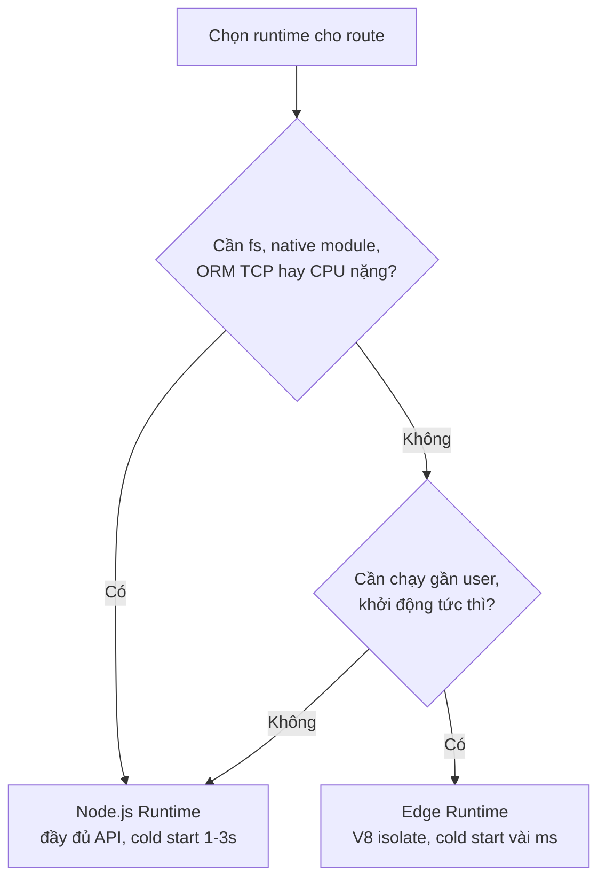

# Node.js vs Edge Runtime

**Runtime** (môi trường chạy) là nền tảng nơi code của bạn thực thi trên server. Next.js cung cấp hai lựa chọn: **Node.js Runtime** đầy đủ tính năng, và **Edge Runtime** nhẹ hơn, chạy gần người dùng để phản hồi nhanh. Bài này so sánh hai môi trường này và gợi ý khi nào nên chọn loại nào.

[](pathname:///img/nextjs/runtimes.webp)

---

:::note[Ghi nhớ nhanh]

- ⭐ **Chọn runtime theo từng route** — khai báo `export const runtime = "nodejs"` hoặc `"edge"` ngay đầu file.
- ⭐ **Node.js vs Edge** — Node.js đầy đủ API (`fs`, native module, ORM TCP, CPU nặng) nhưng cold start 1-3s; Edge chạy trên V8 isolate, chỉ Web Standards, cold start vài ms và chạy gần user toàn cầu.
- **Edge nhiều giới hạn** — không có `fs`/native module/hầu hết ORM, giới hạn bundle (~1MB) và CPU.
- **Mặc định** — Middleware chạy Edge; page và route handler mặc định Node.
- **DB trên Edge cần HTTP driver** — Neon, Turso, PlanetScale, Upstash Redis (không dùng TCP).
- **Pattern hybrid** — Edge cho auth check/gating nhanh, Node cho heavy compute.

:::

---

## Mục lục

- [Vì sao có Node.js runtime & Edge runtime?](#vì-sao-có-nodejs-runtime--edge-runtime)
- [Hai runtime trong Next.js](#hai-runtime-trong-nextjs)
- [Node.js Runtime](#nodejs-runtime)
- [Edge Runtime](#edge-runtime)
- [Khi nào dùng cái nào?](#khi-nào-dùng-cái-nào)
- [Trade-offs](#trade-offs)
- [Câu hỏi phỏng vấn](#câu-hỏi-phỏng-vấn)

---

## Vì sao có Node.js runtime & Edge runtime?

**Vấn đề:** Chạy code server ở **một khu vực** (Node server truyền thống) gây nhiều bất lợi:

```ts
// Server đặt tại 1 region (vd: us-east-1)
// User ở Việt Nam gọi API → request phải vòng nửa vòng Trái Đất
export async function GET() {
  // Cold start chậm: load Node + import deps + connect DB (~1-3s)
  const users = await db.query("SELECT * FROM users");
  return Response.json(users); // User ở xa: độ trễ cao
}
```

- User ở xa server → độ trễ (latency) cao.
- Cold start chậm vì phải khởi động cả tiến trình Node.
- Nhưng nhiều tác vụ lại **cần API đầy đủ của Node** (`fs`, thư viện native, kết nối DB lâu) mà môi trường nhẹ không có.

→ Một runtime duy nhất không hợp mọi nhu cầu: nhanh thì thiếu API, đủ API thì chậm.

**Giải pháp:** Next.js cho **chọn runtime theo từng route**, cân bằng giữa khả năng và độ trễ:

```ts
// Route nặng/DB/thư viện native → Node.js runtime (đầy đủ API Node)
export const runtime = "nodejs";

// Route nhẹ, cần chạy gần user, khởi động tức thì → Edge runtime
export const runtime = "edge";
```

- **Node.js runtime**: đầy đủ API Node, hợp tác vụ nặng, ORM/DB, thư viện native.
- **Edge runtime**: nhẹ, chạy gần user trên toàn cầu, khởi động gần như tức thì, hợp middleware và cá nhân hoá nhanh — nhưng API hạn chế.

Sơ đồ chọn runtime theo nhu cầu của route:



:::tip[Dùng thực tế]

- **API nặng / ORM**: route dùng Prisma, xử lý file, tính toán CPU cao → `export const runtime = "nodejs"`.
- **Middleware / redirect địa lý**: kiểm tra vùng, chuyển hướng theo quốc gia → đặt ở Edge cho gần user.
- **A/B testing**: chia nhánh người dùng cần phản hồi nhanh → chạy ở Edge để giảm độ trễ.
- **Chọn runtime rõ ràng**: khai báo `export const runtime = "edge"` hoặc `"nodejs"` ngay đầu file của route.

:::

---

## Hai runtime trong Next.js

Next.js cho phép mỗi route chọn runtime:

| Runtime | Env | Performance | Tính năng |
|---------|-----|-------------|-----------|
| **Node.js** | Node | Cold start chậm hơn | Đầy đủ Node API |
| **Edge** | V8 isolate | Cold start ~ms | Chỉ Web Standards |

Default: **Node.js** cho page/route handler. **Edge** cho middleware.

Khai báo runtime:

```ts
// app/api/users/route.ts
export const runtime = "edge";    // hoặc "nodejs"

// Áp dụng cho cả file
```

---

## Node.js Runtime

Đầy đủ tính năng:

```ts
import fs from "node:fs";
import { PrismaClient } from "@prisma/client";

export const runtime = "nodejs"; // default

export async function GET() {
  const data = fs.readFileSync("./data.json", "utf-8");
  const users = await new PrismaClient().user.findMany();
  return Response.json({ data, users });
}
```

Có:

- `fs`, `path`, `child_process`, `http`, `crypto`.
- Node API như Buffer, Stream native.
- Mọi npm package Node-only.
- Long-running operation, heavy CPU.

**Cold start**: ~500ms - 2s tùy bundle.

**Phù hợp**:

- Database query với ORM (Prisma cũ chưa Edge).
- File I/O.
- Heavy computation.
- Third-party SDK Node-only (puppeteer, sharp, ffmpeg).

---

## Edge Runtime

Chạy trên **V8 isolate** — light, distributed gần user (CDN edge).

```ts
// app/api/data/route.ts
export const runtime = "edge";

export async function GET(request: Request) {
  const data = await fetch("https://api.example.com/data");
  return new Response(await data.text());
}
```

Có:

- Web Standards: `Request`, `Response`, `fetch`, `URL`, `Headers`, `crypto`.
- `console`, `setTimeout`, `Promise`.
- `TextEncoder`, `TextDecoder`.
- `ReadableStream`, `WritableStream`.

**Không** có:

- `fs`, `path`, `child_process`.
- Node-only API (Buffer cần polyfill).
- Most ORM (Prisma cần Accelerate hoặc HTTP driver).
- Native module (`sharp`, `bcrypt` không work).

**Cold start**: ~vài ms — gần như instant.

**Phù hợp**:

- Auth check (verify JWT signature).
- Header/cookie manipulation.
- Geo routing.
- Light API endpoint.
- A/B testing routing.
- Streaming OpenAI/AI completion.

:::info[Phân tích]

**Tại sao Edge Runtime nhanh?**

1. **V8 isolate** — không phải full Node process. Mỗi isolate ~50-100MB
   memory, share V8 engine.
2. **Distributed** — chạy gần user (300+ location).
3. **No cold start** — isolate "warm" sẵn ở mỗi edge node.
4. **Streaming-friendly** — `ReadableStream` native.

So với Lambda Node:

- Lambda cold start: 1-3s (load Node + import deps + connect DB).
- Edge cold start: 10-50ms.

Edge **không phù hợp** mọi case:

- Bundle size limit (1MB sau gzip Vercel).
- CPU limit (50ms - vài hundred ms tùy provider).
- Không persistent memory state.

→ Dùng Edge cho **light, latency-critical**. Dùng Node cho **complex,
heavy**.

:::

---

## Khi nào dùng cái nào?

**Node.js** khi:

- DB query với Prisma/Drizzle TCP driver.
- File processing (upload, resize image).
- PDF generation.
- Heavy AI inference local.
- Third-party SDK Node-only.

**Edge** khi:

- Middleware (default).
- Auth check qua JWT signature.
- Geo redirect.
- Light proxy API.
- Streaming AI response.
- Vercel KV / Upstash Redis access.

```ts
// Middleware (always Edge)
// middleware.ts
export async function middleware(request) { /* ... */ }

// API route — chọn
export const runtime = "edge";   // hoặc "nodejs"
```

```ts
// Page — chọn (default node)
export const runtime = "edge";

export default async function Page() {
  const data = await fetch(...);
  return <div>{data.title}</div>;
}
```

---

## Trade-offs

| Aspect | Node.js | Edge |
|--------|---------|------|
| Bundle size | Lớn OK (~50MB) | **Nhỏ** (~1MB) |
| Cold start | Chậm (1-3s) | **Nhanh** (~10ms) |
| Latency (warm) | Tùy region | **Thấp** (gần user) |
| Database | Mọi driver | HTTP/serverless only |
| File system | **Có** | Không |
| Heavy CPU | OK | Limited |
| Long task | OK (60s+) | Limited (50ms - 30s) |
| Cost (Vercel) | Per invocation + time | Per request |

:::tip[Mẹo]

**Pattern hybrid** — Edge cho check, Node cho heavy:

```ts
// middleware.ts (Edge) — auth check
export async function middleware(request: NextRequest) {
  const token = request.cookies.get("token")?.value;
  if (!token) return NextResponse.redirect(new URL("/login", request.url));

  // Pass user info xuống
  const requestHeaders = new Headers(request.headers);
  requestHeaders.set("X-User-Id", await getUserIdFromToken(token));

  return NextResponse.next({ request: { headers: requestHeaders } });
}
```

```ts
// app/api/heavy/route.ts (Node) — DB query phức tạp
export const runtime = "nodejs";

export async function GET(request: Request) {
  const userId = request.headers.get("X-User-Id");
  const data = await prisma.user.findMany({ /* complex query */ });
  return Response.json(data);
}
```

Tận dụng Edge cho **fast check, gating**, Node cho **heavy compute**.

:::

:::info[Phân tích]

**Database trên Edge**:

| Provider | Edge support |
|----------|--------------|
| **Neon** (Postgres) | `@neondatabase/serverless` |
| **Turso** (LibSQL) | `@libsql/client` |
| **PlanetScale** | `@planetscale/database` |
| **Vercel Postgres** | `@vercel/postgres` (Neon-backed) |
| **Supabase** | Postgres-js + supabase-js |
| **Upstash Redis** | `@upstash/redis` |
| **MongoDB Atlas** | Data API (HTTP) |

Pattern HTTP-based driver:

- Không TCP — dùng HTTP/WebSocket.
- Latency cao hơn TCP (~50ms overhead per query).
- Nhưng work mọi serverless/edge environment.

Cho **read-heavy + cache**, Edge + serverless DB + KV cache (Upstash) là
combo mạnh — chạy gần user, không tốn cold start.

:::

:::warning[Cần lưu ý]

**Mix Server Component runtime**:

```tsx
// app/page.tsx (Node runtime — default)
import sharp from "sharp"; // Node-only

async function Page() {
  // OK
}
```

```tsx
// app/api/edge-endpoint/route.ts (Edge runtime)
export const runtime = "edge";
import sharp from "sharp"; // BUILD ERROR — sharp không Edge-compat
```

Khi đổi từ Node → Edge: kiểm tra mọi dependency. ESLint sẽ warn nếu
detect.

Migrate Edge cẩn thận — không phải mọi page benefit. Đo lại latency
trước/sau.

:::

---

## Câu hỏi phỏng vấn

Những câu thường gặp về chủ đề này. Tự trả lời trước, rồi bấm **Xem đáp án** để đối chiếu.

**1. Node.js runtime và `edge runtime` khác nhau ở môi trường thực thi thế nào? `V8 isolate` là gì?**

<details className="qa">
<summary>Xem đáp án</summary>

- **Node.js runtime**: code chạy trong một **tiến trình Node đầy đủ** — có `fs`, `path`, `child_process`, `crypto` bản Node, Buffer/Stream native, và dùng được mọi npm package Node-only. Đổi lại phải khởi động cả tiến trình nên cold start ~500ms–2s (trên Lambda có thể 1–3s), và thường chỉ chạy ở một vài region.
- **Edge runtime**: code chạy trên **V8 isolate**, chỉ có tập Web Standards (`Request`, `Response`, `fetch`, `URL`, `Headers`, `TextEncoder`, `ReadableStream`...), được phân phối tới hàng trăm điểm edge gần user.

**V8 isolate** là một "hộp" thực thi JavaScript độc lập bên trong cùng một process V8: mỗi isolate có heap và context riêng, không thấy bộ nhớ của isolate khác, nhưng **dùng chung engine V8 đã nạp sẵn**. Vì không phải bật một process hệ điều hành mới, tạo isolate chỉ tốn vài mili-giây và vài chục MB bộ nhớ — đó là nền tảng kỹ thuật cho tốc độ của Edge.

</details>

**2. Vì sao cold start của Edge chỉ vài mili-giây trong khi Node có thể mất 1-3 giây?**

<details className="qa">
<summary>Xem đáp án</summary>

Cold start của Node phải làm rất nhiều việc trước khi chạy dòng code đầu tiên:

1. Cấp phát container/microVM và khởi động tiến trình Node.
2. Nạp runtime Node, đọc và `import` toàn bộ dependency (bundle có thể hàng chục MB).
3. Thiết lập kết nối ngoài như TCP tới database, khởi tạo ORM client.

Cộng lại thành 1–3 giây.

Edge thì ngược lại: V8 engine **đã chạy sẵn** ở mỗi edge node, việc duy nhất cần làm là tạo một isolate mới và nạp bundle nhỏ (giới hạn ~1MB trên Vercel) vào đó. Không có tiến trình hệ điều hành mới, không chờ handshake TCP, không nạp runtime nặng — nên chỉ mất khoảng 10–50ms, gần như cảm giác "luôn nóng". Giá phải trả là bundle bị giới hạn và chỉ dùng được Web Standards.

</details>

**3. Khai báo runtime cho một route như thế nào, và mặc định của page, route handler, middleware lần lượt là gì?**

<details className="qa">
<summary>Xem đáp án</summary>

Khai báo bằng một export hằng ở **đầu file**, áp dụng cho toàn bộ file đó:

```ts
// app/api/users/route.ts
export const runtime = "edge";   // hoặc "nodejs"

export async function GET() {
  return Response.json({ ok: true });
}
```

Với page cũng viết y hệt trong `app/page.tsx`.

Mặc định:

| Loại | Runtime mặc định |
|---|---|
| Page (Server Component) | `nodejs` |
| Route handler (`route.ts`) | `nodejs` |
| Middleware (`middleware.ts`) | Edge |

Vì middleware chạy trước mọi request và nằm trên đường đi của toàn bộ traffic, nó buộc phải cực nhẹ — nên được đặt ở Edge và không cho phép khai báo lại sang Node.

</details>

**4. Kể những Node API không dùng được trên Edge và giải thích vì sao chúng không tồn tại ở đó.**

<details className="qa">
<summary>Xem đáp án</summary>

Những nhóm API không có trên Edge:

- `fs`, `path` — thao tác file system.
- `child_process` — spawn tiến trình con.
- `net`, `tls`, `dgram` — socket TCP/UDP thô.
- `Buffer` và Stream bản Node (cần polyfill; thay bằng `Uint8Array`, `TextEncoder`, `ReadableStream`).
- Native module biên dịch sẵn như `sharp`, `bcrypt`.

Lý do: Edge **không phải một tiến trình Node** mà là một V8 isolate chạy trong môi trường sandbox đa tenant. Isolate không sở hữu file system riêng, không được phép mở process con hay socket thô vì như vậy sẽ phá vỡ cách ly giữa các tenant chạy chung một máy edge. Native module lại là mã máy `.node` gắn với API của Node và hệ điều hành, không thể nạp vào isolate. Vì vậy Edge chỉ phơi ra tập Web Standards — thứ chạy được an toàn trong sandbox.

</details>

**5. Vì sao ORM dùng TCP driver (Prisma, Drizzle bản thường) không chạy được trên Edge? Có những lựa chọn DB nào thay thế?**

<details className="qa">
<summary>Xem đáp án</summary>

Driver Postgres/MySQL truyền thống nói chuyện qua **socket TCP** với một giao thức nhị phân riêng, cần giữ kết nối sống lâu và pool lại để tái sử dụng. Edge runtime không cho mở socket TCP thô (chỉ có `fetch`/HTTP/WebSocket), lại không giữ state giữa các request, nên mô hình connection pool cũng vô nghĩa. Ngoài ra Prisma engine bản gốc là binary native, không nạp được vào isolate.

Các lựa chọn hoạt động trên Edge đều dùng **driver qua HTTP**:

| Provider | Driver |
|---|---|
| Neon (Postgres) | `@neondatabase/serverless` |
| Vercel Postgres | `@vercel/postgres` (nền Neon) |
| Turso (LibSQL) | `@libsql/client` |
| PlanetScale | `@planetscale/database` |
| Supabase | `supabase-js` |
| Upstash Redis | `@upstash/redis` |
| MongoDB Atlas | Data API (HTTP) |

Với Prisma thì dùng Prisma Accelerate hoặc driver adapter tương thích HTTP thay cho kết nối TCP trực tiếp.

</details>

**6. Driver DB qua HTTP đánh đổi gì so với kết nối TCP truyền thống về độ trễ và connection pooling?**

<details className="qa">
<summary>Xem đáp án</summary>

**Được:** chạy được ở mọi môi trường serverless/edge, không cần giữ kết nối sống, không lo cạn connection pool khi số instance bùng nổ — mỗi query chỉ là một request HTTP stateless.

**Mất:**

- **Overhead mỗi query**: mỗi lần gọi phải qua HTTP (header, TLS handshake nếu chưa keep-alive), cộng thêm khoảng vài chục mili-giây so với TCP đã mở sẵn. Query nhỏ mà gọi nhiều lần liên tiếp (N+1) sẽ lộ điểm yếu rất rõ.
- **Không có transaction dài / session state**: prepared statement, temporary table, `LISTEN/NOTIFY` thường không dùng được hoặc bị hạn chế.
- **Pooling chuyển sang phía provider**: bạn không kiểm soát pool nữa, mà phụ thuộc lớp proxy của nhà cung cấp.

Nguyên tắc thực dụng: gom truy vấn thành ít round-trip nhất, cache kết quả (Upstash Redis, Next.js Data Cache), và nếu cần transaction phức tạp thì đẩy route đó về Node.

</details>

**7. Middleware chạy ở runtime nào, và ràng buộc đó bắt bạn viết middleware theo nguyên tắc nào?**

<details className="qa">
<summary>Xem đáp án</summary>

Middleware luôn chạy ở **Edge runtime**, và nó nằm trên đường đi của *mọi* request khớp `matcher`. Hai điều này dẫn tới các nguyên tắc:

- **Chỉ làm việc nhẹ**: đọc cookie/header, verify chữ ký JWT, redirect, rewrite, gắn header. Mỗi mili-giây ở đây cộng thẳng vào TTFB của toàn site.
- **Không import thư viện nặng hay Node-only** — bundle bị giới hạn và `fs`, `bcrypt`, ORM TCP đều không dùng được.
- **Không truy vấn database** trong middleware; nếu buộc phải kiểm tra gì đó, dùng KV/Redis qua HTTP hoặc đẩy xuống route handler.
- **Không giữ state in-memory**, vì mỗi request có thể rơi vào isolate khác.
- **Thu hẹp `matcher`** để middleware không chạy trên asset tĩnh, ảnh, `_next/static`.

Thực chất middleware nên là "cổng gác" quyết định nhanh đi tiếp hay chuyển hướng, không phải nơi xử lý nghiệp vụ.

</details>

**8. Giới hạn bundle size và CPU time của Edge ảnh hưởng thế nào tới quyết định thiết kế route?**

<details className="qa">
<summary>Xem đáp án</summary>

Trên Vercel, bundle Edge bị giới hạn khoảng **1MB sau gzip**, còn CPU time mỗi request chỉ vào khoảng vài chục tới vài trăm mili-giây (tuỳ provider và gói dịch vụ) — trong khi Node thoải mái bundle hàng chục MB và chạy tác vụ hàng chục giây.

Hệ quả khi thiết kế:

- Route Edge phải **giữ dependency tối thiểu**: một thư viện PDF, một SDK nặng hay `moment` kéo theo locale là đủ vượt hạn mức.
- Mọi việc tốn CPU — resize ảnh, sinh PDF, mã hoá `bcrypt`, parse file lớn, inference model — **phải ở Node**.
- Edge hợp với công việc chủ yếu là **chờ I/O**: gọi API bên ngoài, proxy, stream — thời gian chờ mạng không tính là CPU time.
- Nếu một route vừa cần kiểm tra nhanh vừa cần tính nặng, hãy tách đôi: phần gating ở Edge, phần nặng ở route Node riêng.

</details>

**9. Mô tả pattern hybrid trong luồng xác thực: phần nào nên ở Edge, phần nào nên ở Node, và vì sao?**

<details className="qa">
<summary>Xem đáp án</summary>

Ý tưởng: **Edge gác cổng, Node làm việc nặng**.

```ts
// middleware.ts (Edge) — chặn sớm, gắn thông tin user
export async function middleware(request: NextRequest) {
  const token = request.cookies.get("token")?.value;
  if (!token) return NextResponse.redirect(new URL("/login", request.url));

  const headers = new Headers(request.headers);
  headers.set("X-User-Id", await getUserIdFromToken(token));
  return NextResponse.next({ request: { headers } });
}
```

```ts
// app/api/heavy/route.ts (Node) — truy vấn DB phức tạp
export const runtime = "nodejs";

export async function GET(request: Request) {
  const userId = request.headers.get("X-User-Id");
  return Response.json(await prisma.user.findMany());
}
```

Ở Edge chỉ **verify chữ ký JWT** — thao tác thuần tính toán, không cần DB, chạy gần user nên request không hợp lệ bị chặn ngay mà chưa tốn một lượt gọi tới region gốc. Ở Node mới tra DB, nạp quyền chi tiết, xử lý nghiệp vụ, vì những việc đó cần ORM và CPU mà Edge không có.

</details>

**10. Truyền dữ liệu từ middleware (Edge) xuống route handler hoặc page (Node) bằng cách nào cho an toàn?**

<details className="qa">
<summary>Xem đáp án</summary>

Cách chuẩn là **ghi thêm request header** rồi chuyển tiếp:

```ts
const headers = new Headers(request.headers);
headers.set("X-User-Id", userId);
return NextResponse.next({ request: { headers } });
```

Phía Node đọc lại bằng `request.headers.get("X-User-Id")` (hoặc `headers()` trong Server Component).

Lưu ý an toàn:

- **Xoá/ghi đè header đó trước khi tin tưởng** — client hoàn toàn có thể tự gửi lên `X-User-Id` giả. Middleware phải luôn `set` (ghi đè) chứ không `append`, để giá trị của client bị thay thế.
- Header chỉ nên chứa **dữ liệu đã được xác thực** từ token, không chứa secret vì có thể lọt vào log của hạ tầng.
- Dữ liệu lớn thì đừng nhét vào header (giới hạn kích thước); thay vào đó truyền ID rồi để Node tự tra.
- Nếu cần dữ liệu về phía client, dùng cookie qua `response.cookies.set` với `httpOnly` phù hợp.

</details>

**11. Bạn muốn chuyển một route từ Node sang Edge — checklist kiểm tra gồm những gì?**

<details className="qa">
<summary>Xem đáp án</summary>

1. **Rà dependency**: có package nào dùng `fs`, `path`, `child_process`, native module (`sharp`, `bcrypt`) hay Buffer/Stream Node không? Build sẽ báo lỗi nếu có.
2. **Tầng dữ liệu**: ORM còn dùng TCP driver không? Nếu có, đổi sang HTTP driver (Neon, Turso, PlanetScale, Upstash) hoặc giữ route ở Node.
3. **Bundle size**: ước lượng dung lượng sau tree-shaking, giữ dưới ~1MB gzip.
4. **CPU**: route có vòng lặp nặng, mã hoá, xử lý ảnh/PDF không?
5. **State in-memory**: có cache biến toàn cục, counter, connection pool nào đang được giả định tồn tại giữa request không?
6. **Biến môi trường và secret** vẫn đọc được bình thường, nhưng kiểm tra lại thư viện đọc config.
7. **Đo trước/sau**: ghi lại TTFB và p95 latency ở vài khu vực địa lý; nếu DB ở một region cố định thì Edge có thể không nhanh hơn.
8. Thử ở preview deployment trước khi lên production.

</details>

**12. Edge không giữ state trong bộ nhớ giữa các request — điều đó ảnh hưởng gì tới connection pool, cache in-memory và rate limiting? Giải pháp là gì?**

<details className="qa">
<summary>Xem đáp án</summary>

Mỗi request có thể rơi vào một isolate khác, ở một edge node khác, và isolate có thể bị huỷ bất kỳ lúc nào. Hệ quả:

- **Connection pool** biến thành vô dụng: mỗi lần gọi lại phải mở kết nối mới — đó là lý do Edge chỉ phù hợp với driver HTTP stateless.
- **Cache in-memory** (một `Map` toàn cục) trở nên không đáng tin: hit rate rất thấp và mỗi node có bản riêng, không thể invalidate đồng bộ.
- **Rate limiting** bằng biến đếm cục bộ sai hoàn toàn — user gọi 10 lần có thể rơi vào 10 isolate, mỗi cái đếm 1.

Giải pháp chung là **đẩy state ra kho chia sẻ ngoài**:

- Cache và counter: Upstash Redis / Vercel KV qua HTTP.
- Rate limit: thư viện dựa trên Redis với thuật toán sliding window.
- Dữ liệu tạm giữa các bước: cookie đã ký, hoặc database.
- Cache nội dung HTTP: dùng `Cache-Control` và CDN thay vì bộ nhớ tiến trình.

</details>

**13. Trong tình huống nào Edge KHÔNG giảm được độ trễ, thậm chí còn chậm hơn Node đặt cùng region với DB?**

<details className="qa">
<summary>Xem đáp án</summary>

Khi route **phụ thuộc nặng vào database đặt cố định ở một region**. Lúc đó chạy gần user lại thành phản tác dụng:

- Node đặt cùng region DB: user → server (1 chặng xa) → DB (dưới 1ms) → trả về. Nhiều query cũng gần như miễn phí.
- Edge ở Việt Nam, DB ở `us-east-1`: mỗi query phải vượt nửa vòng Trái Đất, và nếu route cần 5 query tuần tự thì nhân 5 lần độ trễ đó. Đây chính là hiện tượng "waterfall xuyên lục địa".

Các trường hợp khác Edge không giúp gì:

- Route tốn CPU — Edge còn bị giới hạn chặt hơn.
- Route đã được cache tĩnh (SSG/ISR) — CDN đã trả từ edge rồi, runtime không còn ý nghĩa.
- Route gọi tới một third-party API cũng nằm ở một region cố định.

Quy tắc: Edge có lợi khi công việc **ít round-trip tới nguồn dữ liệu tập trung**, hoặc khi dữ liệu cũng được phân tán.

</details>

**14. Cách tính chi phí Edge và Node (ví dụ trên Vercel) khác nhau ra sao, và nó tác động thế nào tới lựa chọn kiến trúc?**

<details className="qa">
<summary>Xem đáp án</summary>

Về mô hình:

- **Node (serverless function)**: tính theo **số lần gọi cộng thời gian thực thi và bộ nhớ cấp phát** — hàm chạy càng lâu, RAM càng lớn thì càng đắt. Thời gian nằm chờ I/O cũng thường bị tính.
- **Edge**: tính chủ yếu theo **số request** (và CPU time thực dùng), không tính thời gian chờ mạng, đơn giá mỗi request thấp hơn.

Tác động tới kiến trúc:

- Route **traffic rất cao nhưng việc nhẹ** (middleware, gating, redirect, proxy, stream) rẻ hơn đáng kể khi đặt ở Edge.
- Route **chạy lâu, tốn RAM** thì Node hợp lý hơn và cũng khả thi hơn về giới hạn kỹ thuật.
- Middleware chạy trên mọi request nên `matcher` quá rộng vừa tốn tiền vừa tốn latency — nên loại trừ asset tĩnh.
- Cache tốt (SSG/ISR, `Cache-Control`) vẫn là cách giảm chi phí mạnh nhất, vì request được CDN trả thẳng, không chạm runtime nào cả.

*(Bảng giá cụ thể thay đổi theo thời điểm — nên kiểm tra lại tài liệu của nhà cung cấp.)*

</details>

**15. Bạn đo lường và so sánh hiệu quả trước/sau khi migrate một route sang Edge bằng chỉ số nào?**

<details className="qa">
<summary>Xem đáp án</summary>

Các chỉ số nên theo dõi:

- **TTFB (Time To First Byte)** — chỉ số phản ánh trực tiếp nhất lợi ích của Edge, đo ở **nhiều khu vực địa lý** chứ không chỉ từ máy dev.
- **Latency p50 / p95 / p99** — trung vị có thể đẹp lên nhưng đuôi p99 mới cho thấy cold start còn hay hết.
- **Tỷ lệ và thời gian cold start** trước/sau.
- **Thời gian truy vấn DB** trong route — đây là nơi Edge dễ tệ đi nếu DB ở xa.
- **Core Web Vitals** (LCP, INP) nếu route phục vụ page — TTFB giảm mà LCP không đổi thì lợi ích chỉ trên giấy.
- **Error rate và timeout** — vượt giới hạn CPU của Edge sẽ lộ ra ở đây.
- **Chi phí** mỗi triệu request.

Cách làm: bật RUM (Vercel Speed Insights hoặc tương đương), giữ cả hai phiên bản chạy song song một thời gian, so sánh trên cùng khung thời gian và cùng tập traffic.

</details>

**16. `sharp` và `bcrypt` không chạy được trên Edge — nêu phương án thay thế cho từng trường hợp.**

<details className="qa">
<summary>Xem đáp án</summary>

Cả hai đều là **native module** (mã máy `.node`), không nạp được vào V8 isolate.

**Thay cho `sharp` (xử lý ảnh):**

- Giữ route xử lý ảnh ở **Node runtime** — đơn giản và đúng nhất.
- Dùng **`next/image`** để Next.js tự tối ưu, hoặc một image CDN (Cloudinary, imgix, Vercel Image Optimization) — Edge chỉ cần redirect/rewrite tới URL đã biến đổi.
- Nếu bắt buộc ở Edge thì chỉ làm được các thao tác nhẹ qua WebAssembly, với giới hạn bundle và CPU rất ngặt.

**Thay cho `bcrypt` (hash mật khẩu):**

- Hash mật khẩu vốn **cố tình tốn CPU**, nên về bản chất không hợp với Edge — hãy để route đăng ký/đăng nhập ở Node.
- Trên Edge, nếu cần thao tác mật mã thì dùng **Web Crypto API** (`crypto.subtle`) cho việc nhẹ như verify chữ ký JWT (HMAC/RSA) — đó mới là phần đúng chỗ của Edge.
- Hoặc uỷ quyền toàn bộ cho nhà cung cấp auth bên ngoài.

</details>

**17. Streaming phản hồi AI (`ReadableStream`) thường được đặt ở Edge — vì sao Edge lại hợp với loại workload này?**

<details className="qa">
<summary>Xem đáp án</summary>

- **Công việc gần như thuần I/O**: route chỉ gọi API model rồi chuyển tiếp từng chunk về client. Nó *chờ* rất lâu nhưng *tính toán* rất ít, nên không đụng giới hạn CPU của Edge; ngược lại nếu chạy ở Node thì lại bị tính tiền theo thời gian chạy suốt lúc chờ.
- **`ReadableStream` là Web Standard có sẵn** trong Edge runtime, ghép thẳng với `Response` mà không cần polyfill Stream của Node.
- **TTFB thấp**: byte đầu tiên tới người dùng nhanh, mà với chat AI thì cảm giác "chữ bắt đầu chạy" quan trọng hơn tổng thời gian.
- **Không cold start**: người dùng không phải đợi 1–3 giây khởi động trước khi thấy token đầu tiên.
- **Bundle nhỏ**: client gọi model qua HTTP, không cần SDK nặng.
- **Không cần state**: mỗi request là một stream độc lập, đúng với mô hình stateless của Edge.

</details>
