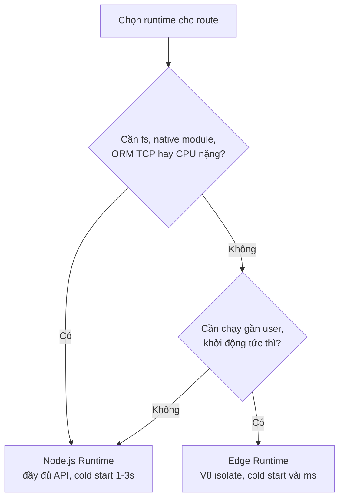

# Node.js vs Edge Runtime

**Runtime** (môi trường chạy) là nền tảng nơi code của bạn thực thi trên server. Next.js cung cấp hai lựa chọn: **Node.js Runtime** đầy đủ tính năng, và **Edge Runtime** nhẹ hơn, chạy gần người dùng để phản hồi nhanh. Bài này so sánh hai môi trường này và gợi ý khi nào nên chọn loại nào.

---

:::note[Ghi nhớ nhanh]

- ⭐ **Chọn runtime theo từng route** — khai báo `export const runtime = "nodejs"` hoặc `"edge"` ngay đầu file.
- ⭐ **Node.js vs Edge** — Node.js đầy đủ API (`fs`, native module, ORM TCP, CPU nặng) nhưng cold start 1-3s; Edge chạy trên V8 isolate, chỉ Web Standards, cold start vài ms và chạy gần user toàn cầu.
- **Edge nhiều giới hạn** — không có `fs`/native module/hầu hết ORM, giới hạn bundle (~1MB) và CPU.
- **Mặc định** — Middleware chạy Edge; page và route handler mặc định Node.
- **DB trên Edge cần HTTP driver** — Neon, Turso, PlanetScale, Upstash Redis (không dùng TCP).
- **Pattern hybrid** — Edge cho auth check/gating nhanh, Node cho heavy compute.

:::

---

## Mục lục

- [Vì sao có Node.js runtime & Edge runtime?](#vì-sao-có-nodejs-runtime--edge-runtime)
- [Hai runtime trong Next.js](#hai-runtime-trong-nextjs)
- [Node.js Runtime](#nodejs-runtime)
- [Edge Runtime](#edge-runtime)
- [Khi nào dùng cái nào?](#khi-nào-dùng-cái-nào)
- [Trade-offs](#trade-offs)
- [Câu hỏi phỏng vấn](#câu-hỏi-phỏng-vấn)

---

## Vì sao có Node.js runtime & Edge runtime?

**Vấn đề:** Chạy code server ở **một khu vực** (Node server truyền thống) gây nhiều bất lợi:

```ts
// Server đặt tại 1 region (vd: us-east-1)
// User ở Việt Nam gọi API → request phải vòng nửa vòng Trái Đất
export async function GET() {
  // Cold start chậm: load Node + import deps + connect DB (~1-3s)
  const users = await db.query("SELECT * FROM users");
  return Response.json(users); // User ở xa: độ trễ cao
}
```

- User ở xa server → độ trễ (latency) cao.
- Cold start chậm vì phải khởi động cả tiến trình Node.
- Nhưng nhiều tác vụ lại **cần API đầy đủ của Node** (`fs`, thư viện native, kết nối DB lâu) mà môi trường nhẹ không có.

→ Một runtime duy nhất không hợp mọi nhu cầu: nhanh thì thiếu API, đủ API thì chậm.

**Giải pháp:** Next.js cho **chọn runtime theo từng route**, cân bằng giữa khả năng và độ trễ:

```ts
// Route nặng/DB/thư viện native → Node.js runtime (đầy đủ API Node)
export const runtime = "nodejs";

// Route nhẹ, cần chạy gần user, khởi động tức thì → Edge runtime
export const runtime = "edge";
```

- **Node.js runtime**: đầy đủ API Node, hợp tác vụ nặng, ORM/DB, thư viện native.
- **Edge runtime**: nhẹ, chạy gần user trên toàn cầu, khởi động gần như tức thì, hợp middleware và cá nhân hoá nhanh — nhưng API hạn chế.

Sơ đồ chọn runtime theo nhu cầu của route:



:::tip[Dùng thực tế]

- **API nặng / ORM**: route dùng Prisma, xử lý file, tính toán CPU cao → `export const runtime = "nodejs"`.
- **Middleware / redirect địa lý**: kiểm tra vùng, chuyển hướng theo quốc gia → đặt ở Edge cho gần user.
- **A/B testing**: chia nhánh người dùng cần phản hồi nhanh → chạy ở Edge để giảm độ trễ.
- **Chọn runtime rõ ràng**: khai báo `export const runtime = "edge"` hoặc `"nodejs"` ngay đầu file của route.

:::

---

## Hai runtime trong Next.js

Next.js cho phép mỗi route chọn runtime:

| Runtime | Env | Performance | Tính năng |
|---------|-----|-------------|-----------|
| **Node.js** | Node | Cold start chậm hơn | Đầy đủ Node API |
| **Edge** | V8 isolate | Cold start ~ms | Chỉ Web Standards |

Default: **Node.js** cho page/route handler. **Edge** cho middleware.

Khai báo runtime:

```ts
// app/api/users/route.ts
export const runtime = "edge";    // hoặc "nodejs"

// Áp dụng cho cả file
```

---

## Node.js Runtime

Đầy đủ tính năng:

```ts
import fs from "node:fs";
import { PrismaClient } from "@prisma/client";

export const runtime = "nodejs"; // default

export async function GET() {
  const data = fs.readFileSync("./data.json", "utf-8");
  const users = await new PrismaClient().user.findMany();
  return Response.json({ data, users });
}
```

Có:

- `fs`, `path`, `child_process`, `http`, `crypto`.
- Node API như Buffer, Stream native.
- Mọi npm package Node-only.
- Long-running operation, heavy CPU.

**Cold start**: ~500ms - 2s tùy bundle.

**Phù hợp**:

- Database query với ORM (Prisma cũ chưa Edge).
- File I/O.
- Heavy computation.
- Third-party SDK Node-only (puppeteer, sharp, ffmpeg).

---

## Edge Runtime

Chạy trên **V8 isolate** — light, distributed gần user (CDN edge).

```ts
// app/api/data/route.ts
export const runtime = "edge";

export async function GET(request: Request) {
  const data = await fetch("https://api.example.com/data");
  return new Response(await data.text());
}
```

Có:

- Web Standards: `Request`, `Response`, `fetch`, `URL`, `Headers`, `crypto`.
- `console`, `setTimeout`, `Promise`.
- `TextEncoder`, `TextDecoder`.
- `ReadableStream`, `WritableStream`.

**Không** có:

- `fs`, `path`, `child_process`.
- Node-only API (Buffer cần polyfill).
- Most ORM (Prisma cần Accelerate hoặc HTTP driver).
- Native module (`sharp`, `bcrypt` không work).

**Cold start**: ~vài ms — gần như instant.

**Phù hợp**:

- Auth check (verify JWT signature).
- Header/cookie manipulation.
- Geo routing.
- Light API endpoint.
- A/B testing routing.
- Streaming OpenAI/AI completion.

:::info[Phân tích]

**Tại sao Edge Runtime nhanh?**

1. **V8 isolate** — không phải full Node process. Mỗi isolate ~50-100MB
   memory, share V8 engine.
2. **Distributed** — chạy gần user (300+ location).
3. **No cold start** — isolate "warm" sẵn ở mỗi edge node.
4. **Streaming-friendly** — `ReadableStream` native.

So với Lambda Node:

- Lambda cold start: 1-3s (load Node + import deps + connect DB).
- Edge cold start: 10-50ms.

Edge **không phù hợp** mọi case:

- Bundle size limit (1MB sau gzip Vercel).
- CPU limit (50ms - vài hundred ms tùy provider).
- Không persistent memory state.

→ Dùng Edge cho **light, latency-critical**. Dùng Node cho **complex,
heavy**.

:::

---

## Khi nào dùng cái nào?

**Node.js** khi:

- DB query với Prisma/Drizzle TCP driver.
- File processing (upload, resize image).
- PDF generation.
- Heavy AI inference local.
- Third-party SDK Node-only.

**Edge** khi:

- Middleware (default).
- Auth check qua JWT signature.
- Geo redirect.
- Light proxy API.
- Streaming AI response.
- Vercel KV / Upstash Redis access.

```ts
// Middleware (always Edge)
// middleware.ts
export async function middleware(request) { /* ... */ }

// API route — chọn
export const runtime = "edge";   // hoặc "nodejs"
```

```ts
// Page — chọn (default node)
export const runtime = "edge";

export default async function Page() {
  const data = await fetch(...);
  return <div>{data.title}</div>;
}
```

---

## Trade-offs

| Aspect | Node.js | Edge |
|--------|---------|------|
| Bundle size | Lớn OK (~50MB) | **Nhỏ** (~1MB) |
| Cold start | Chậm (1-3s) | **Nhanh** (~10ms) |
| Latency (warm) | Tùy region | **Thấp** (gần user) |
| Database | Mọi driver | HTTP/serverless only |
| File system | **Có** | Không |
| Heavy CPU | OK | Limited |
| Long task | OK (60s+) | Limited (50ms - 30s) |
| Cost (Vercel) | Per invocation + time | Per request |

:::tip[Mẹo]

**Pattern hybrid** — Edge cho check, Node cho heavy:

```ts
// middleware.ts (Edge) — auth check
export async function middleware(request: NextRequest) {
  const token = request.cookies.get("token")?.value;
  if (!token) return NextResponse.redirect(new URL("/login", request.url));

  // Pass user info xuống
  const requestHeaders = new Headers(request.headers);
  requestHeaders.set("X-User-Id", await getUserIdFromToken(token));

  return NextResponse.next({ request: { headers: requestHeaders } });
}
```

```ts
// app/api/heavy/route.ts (Node) — DB query phức tạp
export const runtime = "nodejs";

export async function GET(request: Request) {
  const userId = request.headers.get("X-User-Id");
  const data = await prisma.user.findMany({ /* complex query */ });
  return Response.json(data);
}
```

Tận dụng Edge cho **fast check, gating**, Node cho **heavy compute**.

:::

:::info[Phân tích]

**Database trên Edge**:

| Provider | Edge support |
|----------|--------------|
| **Neon** (Postgres) | `@neondatabase/serverless` |
| **Turso** (LibSQL) | `@libsql/client` |
| **PlanetScale** | `@planetscale/database` |
| **Vercel Postgres** | `@vercel/postgres` (Neon-backed) |
| **Supabase** | Postgres-js + supabase-js |
| **Upstash Redis** | `@upstash/redis` |
| **MongoDB Atlas** | Data API (HTTP) |

Pattern HTTP-based driver:

- Không TCP — dùng HTTP/WebSocket.
- Latency cao hơn TCP (~50ms overhead per query).
- Nhưng work mọi serverless/edge environment.

Cho **read-heavy + cache**, Edge + serverless DB + KV cache (Upstash) là
combo mạnh — chạy gần user, không tốn cold start.

:::

:::warning[Cần lưu ý]

**Mix Server Component runtime**:

```tsx
// app/page.tsx (Node runtime — default)
import sharp from "sharp"; // Node-only

async function Page() {
  // OK
}
```

```tsx
// app/api/edge-endpoint/route.ts (Edge runtime)
export const runtime = "edge";
import sharp from "sharp"; // BUILD ERROR — sharp không Edge-compat
```

Khi đổi từ Node → Edge: kiểm tra mọi dependency. ESLint sẽ warn nếu
detect.

Migrate Edge cẩn thận — không phải mọi page benefit. Đo lại latency
trước/sau.

:::

---

## Câu hỏi phỏng vấn

Những câu thường gặp về chủ đề này. Tự trả lời trước, rồi đối chiếu lại với nội dung phía trên.

1. Node.js runtime và `edge runtime` khác nhau ở môi trường thực thi thế nào? `V8 isolate` là gì?
2. Vì sao cold start của Edge chỉ vài mili-giây trong khi Node có thể mất 1-3 giây?
3. Khai báo runtime cho một route như thế nào, và mặc định của page, route handler, middleware lần lượt là gì?
4. Kể những Node API không dùng được trên Edge và giải thích vì sao chúng không tồn tại ở đó.
5. Vì sao ORM dùng TCP driver (Prisma, Drizzle bản thường) không chạy được trên Edge? Có những lựa chọn DB nào thay thế?
6. Driver DB qua HTTP đánh đổi gì so với kết nối TCP truyền thống về độ trễ và connection pooling?
7. Middleware chạy ở runtime nào, và ràng buộc đó bắt bạn viết middleware theo nguyên tắc nào?
8. Giới hạn bundle size và CPU time của Edge ảnh hưởng thế nào tới quyết định thiết kế route?
9. Mô tả pattern hybrid trong luồng xác thực: phần nào nên ở Edge, phần nào nên ở Node, và vì sao?
10. Truyền dữ liệu từ middleware (Edge) xuống route handler hoặc page (Node) bằng cách nào cho an toàn?
11. Bạn muốn chuyển một route từ Node sang Edge — checklist kiểm tra gồm những gì?
12. Edge không giữ state trong bộ nhớ giữa các request — điều đó ảnh hưởng gì tới connection pool, cache in-memory và rate limiting? Giải pháp là gì?
13. Trong tình huống nào Edge KHÔNG giảm được độ trễ, thậm chí còn chậm hơn Node đặt cùng region với DB?
14. Cách tính chi phí Edge và Node (ví dụ trên Vercel) khác nhau ra sao, và nó tác động thế nào tới lựa chọn kiến trúc?
15. Bạn đo lường và so sánh hiệu quả trước/sau khi migrate một route sang Edge bằng chỉ số nào?
16. `sharp` và `bcrypt` không chạy được trên Edge — nêu phương án thay thế cho từng trường hợp.
17. Streaming phản hồi AI (`ReadableStream`) thường được đặt ở Edge — vì sao Edge lại hợp với loại workload này?
