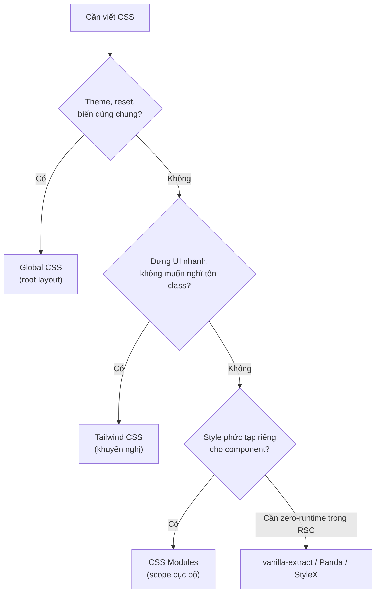

# Writing CSS trong Next.js

**CSS** (ngôn ngữ định kiểu, dùng để tạo màu sắc, bố cục và giao diện cho trang web) có thể được viết theo nhiều cách trong Next.js. Bạn có thể dùng CSS toàn cục (**global CSS**), **CSS Modules** (CSS đóng gói riêng cho từng component), hoặc các thư viện như Tailwind CSS. Bài này giới thiệu các cách viết CSS phổ biến và khi nào nên dùng mỗi cách.

---

:::note[Ghi nhớ nhanh]

- ⭐ **Tailwind v4 là default cho mọi project mới** — utility class, không phải nghĩ tên class, JIT tree-shake nên bundle CSS nhỏ.
- **Global CSS chỉ import 1 lần ở root layout** (`app/layout.tsx`), không import trong component khác.
- **CSS Modules** (`.module.css`) cho component có style riêng — class tự sinh tên unique, scope cục bộ.
- **Tránh CSS-in-JS runtime** (Styled Components, Emotion) với RSC — ưu tiên loại compile-time như vanilla-extract, Panda, StyleX.
- **`clsx` + `tailwind-merge`** để gộp conditional class gọn gàng.

:::

---

## Mục lục

- [Vì sao Next hỗ trợ nhiều cách viết CSS?](#vì-sao-next-hỗ-trợ-nhiều-cách-viết-css)
- [CSS Solutions hỗ trợ](#css-solutions-hỗ-trợ)
- [Global CSS](#global-css)
- [CSS Modules](#css-modules)
- [Tailwind CSS (khuyến nghị)](#tailwind-css-khuyến-nghị)
- [Sass/SCSS](#sassscss)
- [CSS-in-JS lưu ý](#css-in-js-lưu-ý)
- [Câu hỏi phỏng vấn](#câu-hỏi-phỏng-vấn)

---

## Vì sao Next hỗ trợ nhiều cách viết CSS?

**Vấn đề:**

CSS toàn cục dễ **đụng tên class** giữa các component và tải style không dùng:

```css
/* a.css */
.button { background: blue; }

/* b.css — cùng tên .button, ghi đè ngoài ý muốn */
.button { background: red; }
```

Nhiều thư viện CSS-in-JS runtime lại **không hợp Server Components** vì cần JS chạy ở client:

```tsx
// styled-components — runtime ở client, không render trong RSC
const Button = styled.button`
  background: blue;
`;
```

**Giải pháp:**

Next hỗ trợ nhiều cách viết CSS phù hợp kiến trúc của nó, chọn theo dự án:

```tsx
// CSS Modules — scope cục bộ, hợp RSC
import styles from "./Button.module.css";
<button className={styles.button}>Click</button>

// Tailwind — utility, không lo đặt tên class, tự purge tối ưu
<button className="px-4 py-2 bg-blue-500 rounded">Click</button>
```

```css
/* Global CSS — reset, biến dùng chung */
:root { --primary: #0070f3; }

/* Sass — mixin, function cho codebase cần */
```

CSS-in-JS cần cấu hình riêng cho App Router (wrapper, hoặc loại compile-time như vanilla-extract).

Sơ đồ chọn cách viết CSS theo nhu cầu:



:::tip[Dùng thực tế]

- **CSS Modules** cho component có style riêng, tránh đụng tên class.
- **Tailwind** để dựng UI nhanh, không phải nghĩ tên class.
- **Global CSS** cho theme, biến `:root`, reset, import font.
- **CSS-in-JS**: cân nhắc kỹ với RSC — ưu tiên loại compile-time (vanilla-extract, Panda, StyleX).

:::

---

## CSS Solutions hỗ trợ

Next.js hỗ trợ:

| Solution | Built-in | Khuyến nghị 2026 |
|----------|----------|------------------|
| **Global CSS** | ✅ | OK |
| **CSS Modules** | ✅ | OK |
| **Tailwind CSS** | Setup wizard | **Có** |
| **Sass/SCSS** | ✅ | OK |
| **PostCSS** | ✅ | OK |
| **Styled Components / Emotion** | Cần wrapper | **Tránh** (RSC unfriendly) |

---

## Global CSS

Import 1 lần trong **root layout**:

```css
/* app/globals.css */
:root {
  --primary: #0070f3;
  --text: #111;
}

body {
  margin: 0;
  font-family: system-ui, sans-serif;
  color: var(--text);
}

.btn {
  padding: 8px 16px;
  background: var(--primary);
  color: white;
}
```

```tsx
// app/layout.tsx
import "./globals.css";

export default function RootLayout({ children }) {
  return (
    <html>
      <body>{children}</body>
    </html>
  );
}
```

:::warning[Cần lưu ý]

**Global CSS chỉ import trong app/layout.tsx (root)** — không import
trong component khác:

```tsx
// component/Button.tsx
import "./button.css"; // SAI — global CSS chỉ root layout
```

Trong component, dùng **CSS Modules** hoặc **Tailwind**.

:::

---

## CSS Modules

File `.module.css` → class tự generate unique name, scope component:

```css
/* app/components/Button.module.css */
.button {
  padding: 8px 16px;
  border-radius: 4px;
}

.primary {
  background: blue;
  color: white;
}
```

```tsx
// app/components/Button.tsx
import styles from "./Button.module.css";

export function Button({ primary, children }) {
  return (
    <button className={`${styles.button} ${primary ? styles.primary : ""}`}>
      {children}
    </button>
  );
}
```

Built-in, không cần config. Tốt cho:

- Component có style **phức tạp** (animation, pseudo-class, media query).
- Team quen viết CSS truyền thống.
- Không muốn dependency thêm.

---

## Tailwind CSS (khuyến nghị)

Wizard `create-next-app` có option setup sẵn:

```bash
npx create-next-app@latest --tailwind
```

Hoặc thêm vào project có sẵn:

```bash
npm install -D tailwindcss postcss autoprefixer
npx tailwindcss init -p
```

```ts
// tailwind.config.ts
import type { Config } from "tailwindcss";

export default {
  content: [
    "./app/**/*.{ts,tsx}",
    "./components/**/*.{ts,tsx}",
  ],
  theme: { extend: {} },
  plugins: [],
} satisfies Config;
```

```css
/* app/globals.css */
@tailwind base;
@tailwind components;
@tailwind utilities;
```

Dùng:

```tsx
function Card({ children }) {
  return (
    <div className="p-6 bg-white rounded-lg shadow-md hover:shadow-lg transition">
      {children}
    </div>
  );
}
```

**Tailwind v4 (2024+)** — config bằng CSS thay vì JS:

```css
/* app/globals.css */
@import "tailwindcss";

@theme {
  --color-primary: #0070f3;
  --font-sans: system-ui, sans-serif;
}
```

Tailwind v4 nhanh hơn nhiều, không cần PostCSS config thủ công.

:::info[Phân tích]

**Tailwind dominate vì:**

1. **No naming overhead** — không phải nghĩ tên class.
2. **JIT compile** — chỉ build class đã dùng.
3. **Design system built-in** — spacing, color scale chuẩn.
4. **IDE tooling** xuất sắc (autocomplete, color preview).
5. **Tree-shake tốt** — bundle CSS ~10KB cho app trung bình.
6. **shadcn/ui** — copy-paste component ecosystem dựa Tailwind.

Stack chuẩn 2026:

- **Tailwind v4** cho styling.
- **shadcn/ui** cho component.
- **clsx + tailwind-merge** cho conditional class:

```ts
// lib/cn.ts
import { clsx, type ClassValue } from "clsx";
import { twMerge } from "tailwind-merge";

export function cn(...inputs: ClassValue[]) {
  return twMerge(clsx(inputs));
}
```

```tsx
<button className={cn(
  "px-4 py-2 rounded",
  primary && "bg-blue-500 text-white",
  disabled && "opacity-50",
  className // user override
)}>
```

:::

---

## Sass/SCSS

```bash
npm install -D sass
```

```scss
/* app/styles.module.scss */
$primary: #0070f3;

.button {
  padding: 8px 16px;
  background: $primary;

  &:hover {
    opacity: 0.8;
  }

  &.primary {
    background: darken($primary, 10%);
  }
}
```

CSS native đã có **nesting**, **custom property**, `color-mix()` — đa
số case không cần Sass.

Sass còn hữu dụng cho:

- **Mixin** (chưa có native).
- **Function** phức tạp.
- **Module system** `@use`, `@forward`.

Trong project mới, **Tailwind + CSS native** đủ. Sass cho codebase
legacy hoặc team đã quen.

---

## CSS-in-JS lưu ý

:::warning[Cần lưu ý]

**CSS-in-JS truyền thống (Styled Components, Emotion) gặp vấn đề với
React Server Components**:

- Runtime API — generate CSS client-side, không SSR được trong RSC.
- Cần wrapper đặc biệt (`StyledComponentsRegistry`).
- Hydration cost.

Trong App Router, **tránh** Styled Components / Emotion cho project mới.

Alternative **CSS-in-JS hiện đại** compat RSC:

- **vanilla-extract** — compile-time, zero runtime.
- **Panda CSS** — compile-time, atomic CSS.
- **StyleX** (Meta) — atomic, RSC-friendly.

```tsx
// vanilla-extract
import { button } from "./button.css";

<button className={button}>Click</button>
```

```ts
// button.css.ts
import { style } from "@vanilla-extract/css";

export const button = style({
  padding: 16,
  ":hover": { opacity: 0.8 },
});
```

Đây là CSS-in-JS **không runtime cost** — compile thành CSS file thật.

:::

:::tip[Mẹo]

**Recommendation stack CSS Next.js 2026:**

1. **Tailwind v4** — utility, **default cho mọi project mới**.
2. **CSS Modules** — backup khi cần complex CSS (animation phức tạp).
3. **Global CSS** — variables, reset, font import.
4. **shadcn/ui** — copy component, dựa Tailwind.
5. **clsx + tailwind-merge** — utility class management.

Tránh:

- CSS-in-JS runtime (Styled Components, Emotion).
- Inline `style={{ ... }}` cho style phức tạp.

:::

:::info[Phân tích]

**Next.js auto-optimize CSS**:

- **Critical CSS** inline trong `<head>` để no flash.
- **CSS bundling per route** — chỉ load CSS cần thiết cho route.
- **CSS minification** automatic ở production.
- **`@layer`** support (Tailwind v4 dùng).

Bạn không cần config thủ công — Next.js handle tất.

Riêng performance CSS:

- Tailwind PurgeCSS (giờ là JIT) — chỉ build class dùng.
- CSS Modules — scope per component, dead-code elimination.

Bundle CSS thường `<20KB` cho app trung — không phải concern lớn.

:::

---

## Câu hỏi phỏng vấn

Những câu thường gặp về chủ đề này. Tự trả lời trước, rồi đối chiếu lại với nội dung phía trên.

1. Next.js hỗ trợ những cách viết CSS nào? Cách nào là built-in, cách nào cần cấu hình thêm?
2. Vì sao `Global CSS` chỉ nên import một lần ở root layout? Chuyện gì xảy ra nếu import trong một component bất kỳ?
3. `CSS Modules` scope style bằng cơ chế gì, và tên class unique được sinh ra ở thời điểm nào?
4. So sánh `CSS Modules` và Tailwind về bundle size, trải nghiệm phát triển và khả năng bảo trì trong team lớn.
5. Vì sao `CSS-in-JS` runtime như Styled Components hay Emotion gặp vấn đề với `RSC`? Nếu buộc phải dùng thì workaround là gì?
6. `vanilla-extract`, Panda CSS, StyleX khác Styled Components ở điểm cốt lõi nào, và vì sao chúng hợp với `RSC` hơn?
7. Tailwind `JIT` hoạt động ra sao? Vì sao class ghép động kiểu `bg-${color}-500` lại biến mất trong bản production?
8. Tailwind v4 khác v3 ở cách cấu hình như thế nào, và điều đó thay đổi gì trong quy trình setup?
9. `clsx` và `tailwind-merge` giải quyết vấn đề gì? Vì sao chỉ nối chuỗi class thông thường là chưa đủ?
10. `FOUC` là gì, và Next.js xử lý critical CSS ra sao để tránh hiện tượng này?
11. Next.js tách CSS theo route như thế nào, và điều đó ảnh hưởng gì tới thời gian tải từng trang?
12. Khi nào bạn vẫn cần Sass/SCSS dù CSS native đã có nesting, custom property và `color-mix()`?
13. Bạn làm dark mode và theming trong App Router thế nào — CSS variable, biến thể `dark:` của Tailwind, hay class trên `html`? Xử lý chớp sáng lúc tải đầu ra sao?
14. Thiết kế API style cho một component dùng chung sao cho bên ngoài override được class mà không sinh xung đột?
15. Ưu nhược điểm của inline style so với class, và khi nào inline style mới là lựa chọn đúng?
16. Team đang dùng Styled Components ở Pages Router và muốn chuyển sang App Router — bạn lên kế hoạch migrate theo các bước nào?
17. Với một design system dùng chung nhiều sản phẩm, bạn chọn hướng CSS nào và bảo vệ lựa chọn đó bằng lập luận gì?
