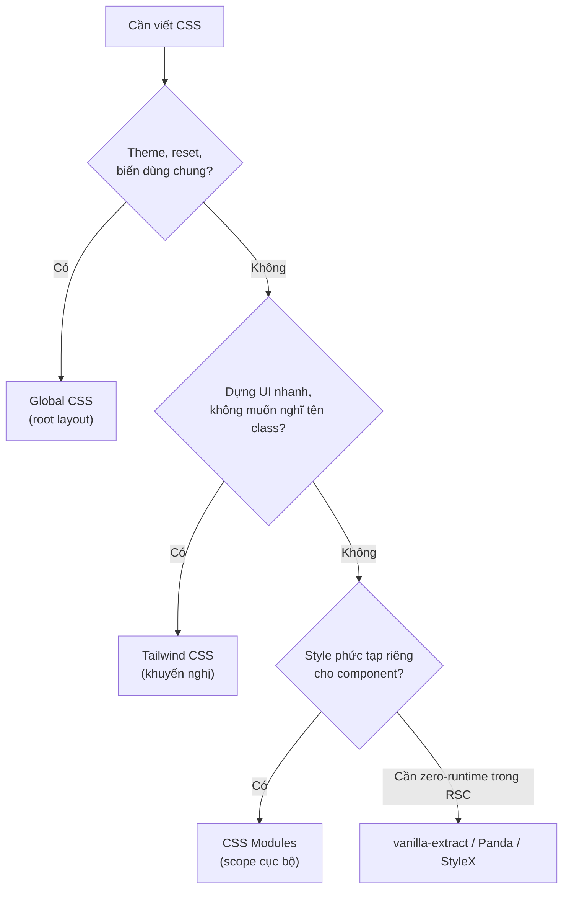

# Writing CSS trong Next.js

**CSS** (ngôn ngữ định kiểu, dùng để tạo màu sắc, bố cục và giao diện cho trang web) có thể được viết theo nhiều cách trong Next.js. Bạn có thể dùng CSS toàn cục (**global CSS**), **CSS Modules** (CSS đóng gói riêng cho từng component), hoặc các thư viện như Tailwind CSS. Bài này giới thiệu các cách viết CSS phổ biến và khi nào nên dùng mỗi cách.

[](pathname:///img/nextjs/writing-css.webp)

---

:::note[Ghi nhớ nhanh]

- ⭐ **Tailwind v4 là default cho mọi project mới** — utility class, không phải nghĩ tên class, JIT tree-shake nên bundle CSS nhỏ.
- **Global CSS chỉ import 1 lần ở root layout** (`app/layout.tsx`), không import trong component khác.
- **CSS Modules** (`.module.css`) cho component có style riêng — class tự sinh tên unique, scope cục bộ.
- **Tránh CSS-in-JS runtime** (Styled Components, Emotion) với RSC — ưu tiên loại compile-time như vanilla-extract, Panda, StyleX.
- **`clsx` + `tailwind-merge`** để gộp conditional class gọn gàng.

:::

---

## Mục lục

- [Vì sao Next hỗ trợ nhiều cách viết CSS?](#vì-sao-next-hỗ-trợ-nhiều-cách-viết-css)
- [CSS Solutions hỗ trợ](#css-solutions-hỗ-trợ)
- [Global CSS](#global-css)
- [CSS Modules](#css-modules)
- [Tailwind CSS (khuyến nghị)](#tailwind-css-khuyến-nghị)
- [Sass/SCSS](#sassscss)
- [CSS-in-JS lưu ý](#css-in-js-lưu-ý)
- [Câu hỏi phỏng vấn](#câu-hỏi-phỏng-vấn)

---

## Vì sao Next hỗ trợ nhiều cách viết CSS?

**Vấn đề:**

CSS toàn cục dễ **đụng tên class** giữa các component và tải style không dùng:

```css
/* a.css */
.button { background: blue; }

/* b.css — cùng tên .button, ghi đè ngoài ý muốn */
.button { background: red; }
```

Nhiều thư viện CSS-in-JS runtime lại **không hợp Server Components** vì cần JS chạy ở client:

```tsx
// styled-components — runtime ở client, không render trong RSC
const Button = styled.button`
  background: blue;
`;
```

**Giải pháp:**

Next hỗ trợ nhiều cách viết CSS phù hợp kiến trúc của nó, chọn theo dự án:

```tsx
// CSS Modules — scope cục bộ, hợp RSC
import styles from "./Button.module.css";
<button className={styles.button}>Click</button>

// Tailwind — utility, không lo đặt tên class, tự purge tối ưu
<button className="px-4 py-2 bg-blue-500 rounded">Click</button>
```

```css
/* Global CSS — reset, biến dùng chung */
:root { --primary: #0070f3; }

/* Sass — mixin, function cho codebase cần */
```

CSS-in-JS cần cấu hình riêng cho App Router (wrapper, hoặc loại compile-time như vanilla-extract).

Sơ đồ chọn cách viết CSS theo nhu cầu:



:::tip[Dùng thực tế]

- **CSS Modules** cho component có style riêng, tránh đụng tên class.
- **Tailwind** để dựng UI nhanh, không phải nghĩ tên class.
- **Global CSS** cho theme, biến `:root`, reset, import font.
- **CSS-in-JS**: cân nhắc kỹ với RSC — ưu tiên loại compile-time (vanilla-extract, Panda, StyleX).

:::

---

## CSS Solutions hỗ trợ

Next.js hỗ trợ:

| Solution | Built-in | Khuyến nghị 2026 |
|----------|----------|------------------|
| **Global CSS** | ✅ | OK |
| **CSS Modules** | ✅ | OK |
| **Tailwind CSS** | Setup wizard | **Có** |
| **Sass/SCSS** | ✅ | OK |
| **PostCSS** | ✅ | OK |
| **Styled Components / Emotion** | Cần wrapper | **Tránh** (RSC unfriendly) |

---

## Global CSS

Import 1 lần trong **root layout**:

```css
/* app/globals.css */
:root {
  --primary: #0070f3;
  --text: #111;
}

body {
  margin: 0;
  font-family: system-ui, sans-serif;
  color: var(--text);
}

.btn {
  padding: 8px 16px;
  background: var(--primary);
  color: white;
}
```

```tsx
// app/layout.tsx
import "./globals.css";

export default function RootLayout({ children }) {
  return (
    <html>
      <body>{children}</body>
    </html>
  );
}
```

:::warning[Cần lưu ý]

**Global CSS chỉ import trong app/layout.tsx (root)** — không import
trong component khác:

```tsx
// component/Button.tsx
import "./button.css"; // SAI — global CSS chỉ root layout
```

Trong component, dùng **CSS Modules** hoặc **Tailwind**.

:::

---

## CSS Modules

File `.module.css` → class tự generate unique name, scope component:

```css
/* app/components/Button.module.css */
.button {
  padding: 8px 16px;
  border-radius: 4px;
}

.primary {
  background: blue;
  color: white;
}
```

```tsx
// app/components/Button.tsx
import styles from "./Button.module.css";

export function Button({ primary, children }) {
  return (
    <button className={`${styles.button} ${primary ? styles.primary : ""}`}>
      {children}
    </button>
  );
}
```

Built-in, không cần config. Tốt cho:

- Component có style **phức tạp** (animation, pseudo-class, media query).
- Team quen viết CSS truyền thống.
- Không muốn dependency thêm.

---

## Tailwind CSS (khuyến nghị)

Wizard `create-next-app` có option setup sẵn:

```bash
npx create-next-app@latest --tailwind
```

Hoặc thêm vào project có sẵn:

```bash
npm install -D tailwindcss postcss autoprefixer
npx tailwindcss init -p
```

```ts
// tailwind.config.ts
import type { Config } from "tailwindcss";

export default {
  content: [
    "./app/**/*.{ts,tsx}",
    "./components/**/*.{ts,tsx}",
  ],
  theme: { extend: {} },
  plugins: [],
} satisfies Config;
```

```css
/* app/globals.css */
@tailwind base;
@tailwind components;
@tailwind utilities;
```

Dùng:

```tsx
function Card({ children }) {
  return (
    <div className="p-6 bg-white rounded-lg shadow-md hover:shadow-lg transition">
      {children}
    </div>
  );
}
```

**Tailwind v4 (2024+)** — config bằng CSS thay vì JS:

```css
/* app/globals.css */
@import "tailwindcss";

@theme {
  --color-primary: #0070f3;
  --font-sans: system-ui, sans-serif;
}
```

Tailwind v4 nhanh hơn nhiều, không cần PostCSS config thủ công.

:::info[Phân tích]

**Tailwind dominate vì:**

1. **No naming overhead** — không phải nghĩ tên class.
2. **JIT compile** — chỉ build class đã dùng.
3. **Design system built-in** — spacing, color scale chuẩn.
4. **IDE tooling** xuất sắc (autocomplete, color preview).
5. **Tree-shake tốt** — bundle CSS ~10KB cho app trung bình.
6. **shadcn/ui** — copy-paste component ecosystem dựa Tailwind.

Stack chuẩn 2026:

- **Tailwind v4** cho styling.
- **shadcn/ui** cho component.
- **clsx + tailwind-merge** cho conditional class:

```ts
// lib/cn.ts
import { clsx, type ClassValue } from "clsx";
import { twMerge } from "tailwind-merge";

export function cn(...inputs: ClassValue[]) {
  return twMerge(clsx(inputs));
}
```

```tsx
<button className={cn(
  "px-4 py-2 rounded",
  primary && "bg-blue-500 text-white",
  disabled && "opacity-50",
  className // user override
)}>
```

:::

---

## Sass/SCSS

```bash
npm install -D sass
```

```scss
/* app/styles.module.scss */
$primary: #0070f3;

.button {
  padding: 8px 16px;
  background: $primary;

  &:hover {
    opacity: 0.8;
  }

  &.primary {
    background: darken($primary, 10%);
  }
}
```

CSS native đã có **nesting**, **custom property**, `color-mix()` — đa
số case không cần Sass.

Sass còn hữu dụng cho:

- **Mixin** (chưa có native).
- **Function** phức tạp.
- **Module system** `@use`, `@forward`.

Trong project mới, **Tailwind + CSS native** đủ. Sass cho codebase
legacy hoặc team đã quen.

---

## CSS-in-JS lưu ý

:::warning[Cần lưu ý]

**CSS-in-JS truyền thống (Styled Components, Emotion) gặp vấn đề với
React Server Components**:

- Runtime API — generate CSS client-side, không SSR được trong RSC.
- Cần wrapper đặc biệt (`StyledComponentsRegistry`).
- Hydration cost.

Trong App Router, **tránh** Styled Components / Emotion cho project mới.

Alternative **CSS-in-JS hiện đại** compat RSC:

- **vanilla-extract** — compile-time, zero runtime.
- **Panda CSS** — compile-time, atomic CSS.
- **StyleX** (Meta) — atomic, RSC-friendly.

```tsx
// vanilla-extract
import { button } from "./button.css";

<button className={button}>Click</button>
```

```ts
// button.css.ts
import { style } from "@vanilla-extract/css";

export const button = style({
  padding: 16,
  ":hover": { opacity: 0.8 },
});
```

Đây là CSS-in-JS **không runtime cost** — compile thành CSS file thật.

:::

:::tip[Mẹo]

**Recommendation stack CSS Next.js 2026:**

1. **Tailwind v4** — utility, **default cho mọi project mới**.
2. **CSS Modules** — backup khi cần complex CSS (animation phức tạp).
3. **Global CSS** — variables, reset, font import.
4. **shadcn/ui** — copy component, dựa Tailwind.
5. **clsx + tailwind-merge** — utility class management.

Tránh:

- CSS-in-JS runtime (Styled Components, Emotion).
- Inline `style={{ ... }}` cho style phức tạp.

:::

:::info[Phân tích]

**Next.js auto-optimize CSS**:

- **Critical CSS** inline trong `<head>` để no flash.
- **CSS bundling per route** — chỉ load CSS cần thiết cho route.
- **CSS minification** automatic ở production.
- **`@layer`** support (Tailwind v4 dùng).

Bạn không cần config thủ công — Next.js handle tất.

Riêng performance CSS:

- Tailwind PurgeCSS (giờ là JIT) — chỉ build class dùng.
- CSS Modules — scope per component, dead-code elimination.

Bundle CSS thường `<20KB` cho app trung — không phải concern lớn.

:::

---

## Câu hỏi phỏng vấn

Những câu thường gặp về chủ đề này. Tự trả lời trước, rồi bấm **Xem đáp án** để đối chiếu.

**1. Next.js hỗ trợ những cách viết CSS nào? Cách nào là built-in, cách nào cần cấu hình thêm?**

<details className="qa">
<summary>Xem đáp án</summary>

| Cách viết | Built-in | Ghi chú |
|---|---|---|
| Global CSS | Có | Import một lần ở root layout |
| CSS Modules (`.module.css`) | Có | Scope cục bộ, không cần config |
| Sass/SCSS | Có | Chỉ cần `npm install -D sass` |
| PostCSS | Có | Next đã cấu hình sẵn pipeline |
| Tailwind CSS | Qua wizard | `create-next-app --tailwind` hoặc cài thủ công |
| Styled Components / Emotion | Không | Cần wrapper registry, nên tránh trong App Router |
| vanilla-extract / Panda / StyleX | Không | Cài thêm plugin, nhưng compile-time nên hợp RSC |

Nói cách khác: Global CSS, CSS Modules, Sass và PostCSS dùng được ngay; Tailwind chỉ cần một bước cài; còn CSS-in-JS runtime mới là thứ phải cấu hình thêm và đi kèm đánh đổi. Khuyến nghị hiện nay cho project mới là **Tailwind v4 + CSS Modules khi cần + Global CSS cho theme**.

</details>

**2. Vì sao `Global CSS` chỉ nên import một lần ở root layout? Chuyện gì xảy ra nếu import trong một component bất kỳ?**

<details className="qa">
<summary>Xem đáp án</summary>

Global CSS **không có scope** — mọi selector trong đó áp dụng cho toàn bộ ứng dụng. Nếu cho phép import rải rác:

- **Thứ tự ghi đè trở nên khó đoán**: file nào được nạp trước/sau phụ thuộc vào thứ tự import và cách bundler chia chunk, nên cùng một selector `.button` ở hai file có thể thắng/thua khác nhau giữa các route.
- **Không thể tree-shake**: style vẫn tồn tại kể cả khi component không được render.
- **Va chạm tên class** giữa các phần của ứng dụng, đúng vấn đề mà CSS Modules sinh ra để giải quyết.

Vì vậy Next.js bắt buộc import global CSS ở **root layout** (`app/layout.tsx`):

```tsx
// app/layout.tsx
import "./globals.css";
```

Trong component thì dùng **CSS Modules** hoặc **Tailwind**. (Ở App Router, Next.js đã nới lỏng hơn Pages Router, nhưng quy ước một điểm nhập duy nhất vẫn là cách an toàn để giữ thứ tự cascade ổn định.)

</details>

**3. `CSS Modules` scope style bằng cơ chế gì, và tên class unique được sinh ra ở thời điểm nào?**

<details className="qa">
<summary>Xem đáp án</summary>

CSS Modules không dùng công nghệ trình duyệt đặc biệt nào — nó **đổi tên class lúc build**. Bundler đọc file `.module.css`, với mỗi class sinh ra một tên duy nhất dựa trên tên file, tên class và một hash nội dung, rồi xuất ra một object ánh xạ:

```css
/* Button.module.css */
.button { padding: 8px 16px; }
```

```tsx
import styles from "./Button.module.css";
// styles.button === "Button_button__3xK1p"
<button className={styles.button}>Click</button>
```

Điểm quan trọng:

- Việc sinh tên xảy ra **ở thời điểm build (compile-time)**, không phải runtime — nên không có chi phí JS khi chạy và hoạt động tốt trong Server Components.
- Vì tên đã được hash, hai component khác nhau cùng đặt tên `.button` sẽ không đụng nhau.
- Kết quả cuối cùng vẫn là một file CSS tĩnh thật, trình duyệt cache được bình thường.

</details>

**4. So sánh `CSS Modules` và Tailwind về bundle size, trải nghiệm phát triển và khả năng bảo trì trong team lớn.**

<details className="qa">
<summary>Xem đáp án</summary>

| Tiêu chí | CSS Modules | Tailwind |
|---|---|---|
| Bundle size | Tỉ lệ thuận với số component; style lặp lại bị nhân bản | JIT chỉ build class đã dùng, class dùng chung nên gần như bão hoà (~10–20KB) |
| Trải nghiệm viết | Phải nghĩ tên class, nhảy qua lại giữa hai file | Viết thẳng trong JSX, autocomplete và preview màu tốt |
| Style phức tạp | Rất mạnh: animation, pseudo-class lồng nhau, media query | Dài dòng hơn, đôi khi phải dùng CSS thường bổ sung |
| Tính nhất quán trong team lớn | Phụ thuộc kỷ luật đặt tên, dễ trôi khỏi design system | Design token có sẵn (spacing, color scale) nên nhất quán tự nhiên |
| Đọc code | JSX sạch, CSS tách riêng | JSX dài, nhiều class trên một dòng |
| Xoá code chết | Khó biết class nào còn dùng | Xoá component là style cũng biến mất |

Thực tế nhiều team dùng **cả hai**: Tailwind làm mặc định cho 95% trường hợp, CSS Modules cho vài component có style thật sự phức tạp.

</details>

**5. Vì sao `CSS-in-JS` runtime như Styled Components hay Emotion gặp vấn đề với `RSC`? Nếu buộc phải dùng thì workaround là gì?**

<details className="qa">
<summary>Xem đáp án</summary>

Các thư viện này sinh CSS **lúc chạy ở phía client**: chúng dùng React context, `useState`/`useContext` và thao tác chèn thẻ style vào DOM. Server Components thì không có state, không có context của client và không chạy JS ở trình duyệt — nên:

- Component dùng `styled.*` buộc phải là Client Component (`"use client"`), mất lợi ích của RSC.
- CSS không được sinh ra sẵn trong HTML từ server nếu không cấu hình gì thêm, dẫn tới nháy giao diện lúc tải.
- Có thêm chi phí hydration và một lượng JS runtime gửi xuống client.

Workaround nếu buộc phải dùng: tạo một **style registry** ở client, ví dụ `StyledComponentsRegistry` bọc `children` trong root layout, dùng `useServerInsertedHTML` để đẩy các quy tắc CSS đã thu thập được vào HTML trả về từ server. Bật `compiler.styledComponents` trong `next.config` để dùng SWC transform. Với project mới, khuyến nghị là **không dùng** mà chọn loại compile-time.

</details>

**6. `vanilla-extract`, Panda CSS, StyleX khác Styled Components ở điểm cốt lõi nào, và vì sao chúng hợp với `RSC` hơn?**

<details className="qa">
<summary>Xem đáp án</summary>

Điểm cốt lõi: chúng là **zero-runtime, compile-time CSS-in-JS**. Bạn vẫn viết style bằng TypeScript, nhưng trình build biến nó thành **file CSS tĩnh và một chuỗi tên class**, không còn thư viện nào chạy ở trình duyệt.

```ts
// button.css.ts — vanilla-extract
import { style } from "@vanilla-extract/css";

export const button = style({
  padding: 16,
  ":hover": { opacity: 0.8 },
});
```

```tsx
import { button } from "./button.css";
<button className={button}>Click</button>
```

Vì sao hợp RSC hơn:

- Kết quả chỉ là `className` — một chuỗi, hoàn toàn serialize được, nên Server Component dùng thoải mái.
- Không cần context, không cần `"use client"`, không cần registry.
- Không có JS runtime gửi xuống client, không có chi phí chèn style lúc hydrate.
- CSS nằm trong file thật nên trình duyệt cache và Next.js tách theo route được.

Đổi lại: style động theo giá trị tuỳ ý lúc runtime bị hạn chế, thường phải mô hình hoá bằng variant hoặc CSS variable.

</details>

**7. Tailwind `JIT` hoạt động ra sao? Vì sao class ghép động kiểu `bg-${color}-500` lại biến mất trong bản production?**

<details className="qa">
<summary>Xem đáp án</summary>

JIT (Just-In-Time) **quét source code** theo các đường dẫn khai báo trong `content` (v3) hoặc tự dò (v4), tìm các chuỗi trông giống tên utility, rồi **chỉ sinh đúng những class tìm thấy**. Nhờ vậy bundle CSS chỉ khoảng chục KB thay vì cả megabyte.

Điểm mấu chốt: quá trình quét là **so khớp chuỗi tĩnh**, Tailwind không chạy code của bạn nên không thể biết `color` sẽ mang giá trị gì:

```tsx
// SAI — Tailwind không thấy chuỗi "bg-red-500" ở đâu cả
<div className={`bg-${color}-500`} />

// ĐÚNG — viết đủ tên class để scanner nhìn thấy
const map = { red: "bg-red-500", blue: "bg-blue-500" };
<div className={map[color]} />
```

Ở dev đôi khi vẫn thấy đúng vì class đó tình cờ được sinh bởi chỗ khác, nhưng khi build production thì nó không tồn tại. Cách khác: dùng `safelist` trong config, hoặc dùng arbitrary value với CSS variable.

</details>

**8. Tailwind v4 khác v3 ở cách cấu hình như thế nào, và điều đó thay đổi gì trong quy trình setup?**

<details className="qa">
<summary>Xem đáp án</summary>

**v3** cấu hình bằng JavaScript và cần ba directive:

```ts
// tailwind.config.ts
export default {
  content: ["./app/**/*.{ts,tsx}"],
  theme: { extend: {} },
} satisfies Config;
```

```css
@tailwind base;
@tailwind components;
@tailwind utilities;
```

Kèm theo là `postcss.config.js` với `tailwindcss` và `autoprefixer`.

**v4** chuyển cấu hình vào chính file CSS:

```css
@import "tailwindcss";

@theme {
  --color-primary: #0070f3;
  --font-sans: system-ui, sans-serif;
}
```

Thay đổi trong quy trình setup:

- Bỏ được `tailwind.config.ts` và phần lớn cấu hình PostCSS thủ công.
- Design token trở thành **CSS custom property**, nên dùng lại được cả ngoài Tailwind và đổi theme lúc runtime dễ hơn.
- Engine mới biên dịch nhanh hơn đáng kể, đường dẫn `content` được tự dò thay vì khai báo tay.

</details>

**9. `clsx` và `tailwind-merge` giải quyết vấn đề gì? Vì sao chỉ nối chuỗi class thông thường là chưa đủ?**

<details className="qa">
<summary>Xem đáp án</summary>

- **`clsx`** gom class theo điều kiện một cách gọn gàng, tự bỏ qua `false`/`undefined`/`null` — thay cho việc nối chuỗi rồi dính khoảng trắng thừa hoặc chữ `"undefined"`.
- **`tailwind-merge`** giải quyết vấn đề Tailwind không biết class nào "thắng": trong CSS, `p-2 p-4` cho kết quả phụ thuộc thứ tự trong file CSS chứ không phải thứ tự trong `className`. Nó phân tích và **giữ lại class sau cùng trong cùng nhóm thuộc tính**, loại bỏ class bị ghi đè.

```ts
// lib/cn.ts
import { clsx, type ClassValue } from "clsx";
import { twMerge } from "tailwind-merge";

export function cn(...inputs: ClassValue[]) {
  return twMerge(clsx(inputs));
}

cn("px-4 py-2", "px-8"); // "py-2 px-8" — px-4 bị loại
```

Điều này đặc biệt quan trọng với component dùng chung có prop `className` để bên ngoài override: không có `twMerge`, override thường không ăn.

</details>

**10. `FOUC` là gì, và Next.js xử lý critical CSS ra sao để tránh hiện tượng này?**

<details className="qa">
<summary>Xem đáp án</summary>

**FOUC (Flash Of Unstyled Content)** là hiện tượng trình duyệt hiển thị HTML thô trong chớp mắt trước khi CSS được tải và áp dụng — chữ nhảy, bố cục xô lệch, gây điểm CLS xấu.

Nguyên nhân thường gặp: CSS được nạp bằng JS sau khi HTML đã render (đúng vấn đề của CSS-in-JS runtime không cấu hình SSR), hoặc stylesheet nằm cuối trang.

Next.js xử lý sẵn:

- **Nội tuyến/ưu tiên CSS cần thiết trong `<head>`** của HTML trả về từ server, để trình duyệt có style ngay lượt vẽ đầu tiên.
- **Tách CSS theo route**, chỉ nạp phần cần cho trang đang xem.
- **Minify** tự động ở production.

Bạn hầu như không phải cấu hình gì. Phần còn lại thuộc về lựa chọn công cụ: dùng CSS Modules, Tailwind hay CSS-in-JS compile-time thì CSS luôn là file tĩnh có sẵn khi HTML tới — còn CSS-in-JS runtime mới cần registry để tránh FOUC.

</details>

**11. Next.js tách CSS theo route như thế nào, và điều đó ảnh hưởng gì tới thời gian tải từng trang?**

<details className="qa">
<summary>Xem đáp án</summary>

Next.js theo dõi **component nào import CSS nào**, rồi gom CSS thành các chunk tương ứng với cây route. Khi người dùng vào `/dashboard`, trình duyệt chỉ nhận CSS của root layout cộng layout và page của nhánh đó, chứ không nhận CSS của `/blog` hay `/admin`.

Ảnh hưởng:

- **Trang đầu nhẹ hơn** — CSS là tài nguyên chặn render, nên cắt bớt giúp First Contentful Paint và LCP tốt lên rõ rệt.
- **Điều hướng phía client**: khi chuyển route, Next tải thêm chunk CSS còn thiếu; do prefetch nên thường đã có sẵn khi người dùng bấm.
- **CSS của layout được chia sẻ**, tải một lần rồi cache cho mọi route con.

Lưu ý: cơ chế này chỉ phát huy khi CSS được import theo component. Nhét mọi thứ vào `globals.css` thì mọi route đều phải tải toàn bộ. Với Tailwind thì bản chất khác — chỉ một file utility dùng chung, nhưng vì JIT nên nó vốn đã rất nhỏ.

</details>

**12. Khi nào bạn vẫn cần Sass/SCSS dù CSS native đã có nesting, custom property và `color-mix()`?**

<details className="qa">
<summary>Xem đáp án</summary>

CSS native ngày nay đã thay được phần lớn Sass: nesting, biến qua custom property, `color-mix()` thay cho `lighten()`/`darken()`. Sass vẫn còn giá trị khi:

- **Cần mixin**: khối quy tắc tái sử dụng có tham số — CSS native chưa có tương đương.
- **Cần function và vòng lặp lúc build**: sinh hàng loạt class theo scale, tính toán phức tạp bằng `@each`, `@for`.
- **Cần hệ thống module**: `@use`/`@forward` để tổ chức thư viện style lớn với namespace rõ ràng.
- **Codebase legacy** đã có hàng nghìn dòng SCSS, hoặc team đã quen — chi phí chuyển đổi không đáng.
- **Cần biến ở thời điểm build**: custom property là runtime nên không dùng được trong media query hay để nối chuỗi selector.

Với project mới, kết luận trong bài là **Tailwind + CSS native đã đủ**; thêm Sass chỉ khi thực sự chạm một trong các nhu cầu trên. Trong Next.js, Sass dùng được ngay sau `npm install -D sass`, kể cả dạng `.module.scss`.

</details>

**13. Bạn làm dark mode và theming trong App Router thế nào — CSS variable, biến thể `dark:` của Tailwind, hay class trên `html`? Xử lý chớp sáng lúc tải đầu ra sao?**

<details className="qa">
<summary>Xem đáp án</summary>

Cách phổ biến là **kết hợp cả ba**, không phải chọn một:

- Định nghĩa **CSS variable** cho token màu trong `globals.css`, một bộ cho light và một bộ ghi đè dưới `.dark`.
- Đặt **class `dark` trên thẻ `html`** làm công tắc.
- Dùng **biến thể `dark:`** của Tailwind (cấu hình theo class) cho những chỗ cần ghi đè cục bộ.

```css
:root { --bg: #fff; --fg: #111; }
.dark { --bg: #111; --fg: #eee; }
body { background: var(--bg); color: var(--fg); }
```

**Chống chớp sáng (flash of wrong theme):** vì HTML từ server không biết lựa chọn của người dùng, phải đặt class trước lượt vẽ đầu tiên. Cách làm là chèn một script nhỏ **chạy đồng bộ trong `<head>`** của root layout, đọc `localStorage` (hoặc cookie) cộng `prefers-color-scheme` rồi gắn class vào `document.documentElement`. Thư viện `next-themes` đóng gói sẵn việc này. Nếu lưu theme bằng **cookie**, server đọc được ngay và render thẳng class đúng — sạch nhất, không cần script chặn.

</details>

**14. Thiết kế API style cho một component dùng chung sao cho bên ngoài override được class mà không sinh xung đột?**

<details className="qa">
<summary>Xem đáp án</summary>

Nguyên tắc: component **nhận `className` từ ngoài và merge nó sau cùng**, đồng thời mô hình hoá các biến thể thành prop thay vì bắt người dùng tự ghép class.

```tsx
function Button({ variant = "primary", className, ...props }) {
  return (
    <button
      className={cn(
        "px-4 py-2 rounded font-medium",
        variant === "primary" && "bg-blue-500 text-white",
        variant === "ghost" && "bg-transparent text-blue-500",
        className // override đến sau cùng
      )}
      {...props}
    />
  );
}
```

Các điểm quan trọng:

- Dùng `cn` (`clsx` + `tailwind-merge`) để class của người dùng thật sự thắng, không phụ thuộc thứ tự trong file CSS.
- **Đưa `variant`/`size` thành prop** (có thể dùng `cva`) để giữ tính nhất quán, `className` chỉ dành cho tinh chỉnh ngoài lệ.
- Với component nhiều phần bên trong, phơi ra `classNames` theo slot thay vì một chuỗi duy nhất.
- Luôn `...props` để truyền tiếp `id`, `aria-*`, `data-*`.
- Nếu dùng CSS Modules, giữ độ đặc hiệu (specificity) thấp để bên ngoài ghi đè được.

</details>

**15. Ưu nhược điểm của inline style so với class, và khi nào inline style mới là lựa chọn đúng?**

<details className="qa">
<summary>Xem đáp án</summary>

| | Inline style | Class (CSS Modules / Tailwind) |
|---|---|---|
| Giá trị động lúc runtime | Rất tiện | Phải qua CSS variable hoặc danh sách class định sẵn |
| Pseudo-class, media query, animation | Không làm được | Đầy đủ |
| Kích thước HTML | Lặp lại trên từng phần tử, phình HTML | CSS tách riêng, cache được |
| Độ đặc hiệu | Rất cao, khó override | Dễ ghép tầng và ghi đè |
| Nhất quán design system | Dễ trôi khỏi token | Bám token |

Inline style đúng khi giá trị **thực sự chỉ biết lúc chạy và liên tục thay đổi**: chiều rộng thanh tiến trình theo phần trăm, vị trí tooltip/popover đã tính toán, `transform` theo thao tác kéo thả, chiều cao item trong danh sách ảo hoá, màu do người dùng chọn.

Mẹo thực dụng: gán giá trị động vào **CSS variable** qua inline style, phần còn lại vẫn viết bằng class — vừa động vừa giữ được pseudo-class và media query.

</details>

**16. Team đang dùng Styled Components ở Pages Router và muốn chuyển sang App Router — bạn lên kế hoạch migrate theo các bước nào?**

<details className="qa">
<summary>Xem đáp án</summary>

Migrate từng bước, không đập đi làm lại:

1. **Giữ chạy được trước đã**: dựng `StyledComponentsRegistry` (dùng `useServerInsertedHTML`) bọc `children` trong root layout và bật `compiler.styledComponents`, để giao diện cũ không vỡ và không FOUC.
2. **Chọn đích đến** cho lâu dài: Tailwind (khuyến nghị) hoặc vanilla-extract/Panda nếu team muốn giữ cách viết style bằng TS.
3. **Chuyển token trước**: đưa màu, spacing, typography trong `ThemeProvider` thành CSS variable trong `globals.css` hoặc `@theme` của Tailwind v4 — bước này dùng chung cho cả hai hệ.
4. **Migrate từ lá lên**: bắt đầu với component nhỏ, không state (Button, Badge, Card), vì đây cũng là nhóm dễ trở thành Server Component nhất.
5. **Đánh dấu tạm** những component còn dùng `styled.*` bằng `"use client"`, coi như nợ kỹ thuật cần trả dần.
6. **Đo lại** JS bundle và LCP sau mỗi đợt để chứng minh giá trị.
7. **Gỡ dependency và registry** khi không còn chỗ nào dùng.

</details>

**17. Với một design system dùng chung nhiều sản phẩm, bạn chọn hướng CSS nào và bảo vệ lựa chọn đó bằng lập luận gì?**

<details className="qa">
<summary>Xem đáp án</summary>

Hướng an toàn nhất: **token bằng CSS custom property + lớp style zero-runtime** (Tailwind với preset dùng chung, hoặc vanilla-extract/Panda/StyleX), phân phối kèm component như mô hình shadcn/ui.

Lập luận bảo vệ:

- **Trung lập với framework**: CSS variable chạy được ở mọi nơi — Next.js, Vite, thậm chí trang tĩnh — nên design system không bị khoá vào React.
- **Hợp RSC**: zero-runtime nghĩa là không ép sản phẩm tiêu thụ phải biến component thành Client Component.
- **Theming nhiều thương hiệu**: chỉ cần ghi đè bộ biến ở cấp `:root` hoặc một class wrapper, không phải build lại thư viện.
- **Không phình bundle**: mỗi sản phẩm chỉ trả tiền cho phần utility thực sự dùng.
- **Dễ override có kiểm soát**: component nhận `className` và merge sau cùng, sản phẩm tinh chỉnh được mà không phải fork.
- **Tránh runtime CSS-in-JS** vì thêm JS, thêm chi phí hydration và ràng buộc phiên bản React giữa các sản phẩm.

Đánh đổi cần nói rõ: phải đầu tư vào tài liệu token và kỷ luật versioning.

</details>
