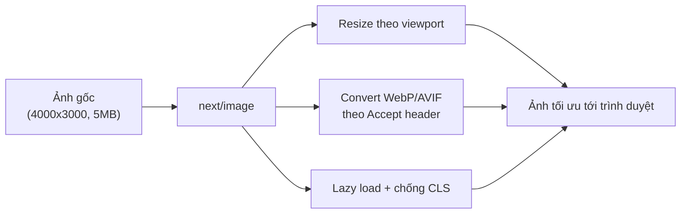
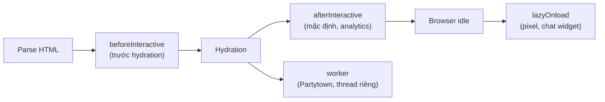

# Asset Optimization: Image, Font, Script

Tối ưu **asset** (tài nguyên tĩnh: ảnh, font chữ, script) là việc giảm dung lượng và thời gian tải các tệp đi kèm trang web để trang hiển thị nhanh hơn. Next.js cung cấp sẵn các thành phần như `next/image`, `next/font` và `next/script` giúp tự động nén ảnh, nạp font hiệu quả và kiểm soát thời điểm chạy script. Nhờ đó người mới chỉ cần dùng đúng công cụ là đã có hiệu năng tốt mà không cần cấu hình thủ công phức tạp.

[](pathname:///img/nextjs/asset-optimization.webp)

---

:::note[Ghi nhớ nhanh]

- ⭐ **Thay `` bằng `<Image>`** — tự nén WebP/AVIF, resize theo viewport, lazy load mặc định và chống CLS (cần `width`/`height` hoặc `fill`).
- **`next/font`** self-host font, preload song song, không nhấp nháy hay layout shift.
- **`next/script`** kiểm soát thời điểm tải qua `strategy` (`afterInteractive` là mặc định, `lazyOnload` cho pixel/chat).
- **`public/`** chứa asset tĩnh nhưng không qua build optimization — hợp favicon, robots.txt, PDF.
- **Video > 5MB** nên dùng streaming service (Mux, Cloudflare Stream) thay vì nhồi vào bundle.

:::

---

## Mục lục

- [Vì sao cần tối ưu asset?](#vì-sao-cần-tối-ưu-asset)
- [next/image](#nextimage)
- [next/font](#nextfont)
- [next/script](#nextscript)
- [Static Assets (public/)](#static-assets-public)
- [Video](#video)
- [Câu hỏi phỏng vấn](#câu-hỏi-phỏng-vấn)

---

## Vì sao cần tối ưu asset?

**Vấn đề:**

```tsx
// Ảnh tải nguyên kích thước gốc (4000x3000, 5MB), sai định dạng, không lazy


// Font Google nạp qua <link> bên thứ ba, render-blocking, nhấp nháy chữ (FOUT/FOIT)
<link href="https://fonts.googleapis.com/css?family=Inter" rel="stylesheet" />

// Script analytics chặn render, chạy ngay khi parse HTML
<script src="https://analytics.example.com/tracker.js"></script>
```

Hậu quả: trang nặng và chậm, layout nhảy (CLS) khi ảnh/font tải xong, chữ
nhấp nháy, render bị chặn. Đây là nguyên nhân hàng đầu kéo điểm hiệu năng và
SEO (Core Web Vitals) xuống thấp.

**Giải pháp:**

```tsx
import Image from "next/image";
import { Inter } from "next/font/google";
import Script from "next/script";

// next/image: tự resize, WebP/AVIF, lazy mặc định, chống CLS nhờ width/height
<Image src="/photo.jpg" alt="..." width={800} height={600} />;

// next/font: self-host, không nhấp nháy, không layout shift
const inter = Inter({ subsets: ["latin"], display: "swap" });

// next/script: kiểm soát thời điểm tải, không chặn render
<Script src="https://analytics.example.com/tracker.js" strategy="afterInteractive" />;
```

:::tip[Dùng thực tế]

- **Thay `` bằng `<Image>`**: ảnh banner/sản phẩm tự nén WebP/AVIF, lazy
  load ảnh ngoài viewport, hết giật layout khi cuộn.
- **Dùng `next/font` cho Google Font**: self-host Inter/Roboto, chữ hiện mượt
  từ đầu, không còn nhấp nháy hay nhảy chữ.
- **Kiểm soát script analytics bằng `next/script`**: GA/pixel chạy
  `afterInteractive` hoặc `lazyOnload`, không chặn lần hiển thị đầu tiên.
- **Cải thiện Core Web Vitals**: LCP, CLS, INP tốt lên rõ → điểm Lighthouse và
  thứ hạng SEO tăng theo.

:::

---

## next/image

Component `<Image>` tự optimize hình:

- Convert sang WebP / AVIF.
- Resize theo viewport.
- Lazy load mặc định.
- Tránh CLS (layout shift) — cần width/height.

Luồng xử lý một ảnh qua `next/image`:



```tsx
import Image from "next/image";

<Image
  src="/photo.jpg"
  alt="Description"
  width={800}
  height={600}
  priority         // load trước (LCP image)
/>
```

Remote image — config domain:

```ts
// next.config.ts
export default {
  images: {
    remotePatterns: [
      {
        protocol: "https",
        hostname: "images.unsplash.com",
      },
    ],
  },
};
```

```tsx
<Image
  src="https://images.unsplash.com/photo-123"
  width={800}
  height={600}
  alt="Unsplash"
/>
```

**Fill mode** — element parent có position:

```tsx
<div className="relative h-64">
  <Image src="/photo.jpg" alt="..." fill className="object-cover" />
</div>
```

**Placeholder blur**:

```tsx
<Image
  src="/photo.jpg"
  width={800}
  height={600}
  alt="..."
  placeholder="blur"
  blurDataURL="data:image/jpeg;base64,..."
/>
```

:::info[Phân tích]

**Tại sao dùng next/image thay ``?**

| | `` | `<Image>` |
|--|---------|-----------|
| Format conversion | Không | **WebP/AVIF tự động** |
| Resize cho mobile | Tải nguyên size | **Multiple size** |
| Lazy load | Cần `loading="lazy"` thủ công | **Default** |
| CLS prevention | Không | **Auto** (cần width/height) |
| Priority hint | Cần `fetchpriority` | `priority` prop |

Next.js Image Optimization Service:

- Build time: serve direct nếu static export.
- Runtime: optimize on-the-fly, cache result.
- Format detect theo `Accept` header.

Trade-off:

- Cần Next.js Image Optimization (Vercel built-in, AWS cần config).
- `width`/`height` bắt buộc (hoặc `fill`).
- Bundle thêm next/image runtime.

:::

---

## next/font

Self-host font, auto preload, **no layout shift**:

```tsx
// app/layout.tsx
import { Inter, Roboto_Mono } from "next/font/google";

const inter = Inter({
  subsets: ["latin"],
  display: "swap",
});

const robotoMono = Roboto_Mono({
  subsets: ["latin"],
  weight: ["400", "700"],
});

export default function RootLayout({ children }) {
  return (
    <html className={inter.className}>
      <body>
        {children}
        <code className={robotoMono.className}>code</code>
      </body>
    </html>
  );
}
```

Font local:

```ts
import localFont from "next/font/local";

const myFont = localFont({
  src: "./fonts/MyFont.woff2",
  display: "swap",
});
```

:::info[Phân tích]

**Tại sao next/font?**

1. **Self-host** — không gọi Google Fonts CDN (privacy + speed).
2. **Preload** — font load song song với HTML.
3. **No layout shift** — size-adjust + fallback metrics calculated.
4. **CSS variable** support:

```tsx
const inter = Inter({ subsets: ["latin"], variable: "--font-inter" });

<html className={inter.variable}>
  <style>{`body { font-family: var(--font-inter); }`}</style>
```

Trước next/font:

- Google Fonts qua `<link>` → 3rd party request, render-blocking.
- Self-host thủ công → preload + CSS @font-face viết tay.

next/font handle hết.

:::

---

## next/script

Component `<Script>` cho **third-party script** với strategy load:

```tsx
import Script from "next/script";

<Script src="https://www.googletagmanager.com/gtag/js?id=GA_ID" />
<Script id="ga-config">
  {`
    window.dataLayer = window.dataLayer || [];
    function gtag(){dataLayer.push(arguments);}
    gtag('js', new Date());
    gtag('config', 'GA_ID');
  `}
</Script>
```

**Strategy**:

```tsx
<Script src="..." strategy="beforeInteractive" />  {/* trước hydration */}
<Script src="..." strategy="afterInteractive" />   {/* mặc định */}
<Script src="..." strategy="lazyOnload" />          {/* idle */}
<Script src="..." strategy="worker" />              {/* Partytown worker */}
```

| Strategy | Khi load | Use case |
|----------|----------|----------|
| `beforeInteractive` | Trước hydration | Critical script (consent, A/B) |
| `afterInteractive` | Sau hydration | Default (analytics) |
| `lazyOnload` | Browser idle | Marketing pixel, chat widget |
| `worker` | Web Worker thread | Heavy script, Partytown |

Sơ đồ thời điểm tải theo từng `strategy`:



**Event handler**:

```tsx
<Script
  src="..."
  onLoad={() => console.log("loaded")}
  onError={(e) => console.error(e)}
/>
```

---

## Static Assets (public/)

Thư mục `public/` chứa file static, accessible từ root:

```
public/
├── favicon.ico       → /favicon.ico
├── robots.txt        → /robots.txt
├── images/
│   └── logo.png      → /images/logo.png
└── docs/
    └── guide.pdf     → /docs/guide.pdf
```

Reference trong code:

```tsx

<Image src="/images/logo.png" width={100} height={50} alt="Logo" />
<a href="/docs/guide.pdf">Download</a>
```

:::warning[Cần lưu ý]

**`public/` không tham gia build optimization**:

- Không minify HTML/CSS/JS trong public.
- Không hash filename → cache header phải set thủ công.
- Phù hợp: favicon, robots.txt, sitemap, manifest.json, PDF, fonts custom.

Không phù hợp:

- Image dùng trong component → import trong `app/` hoặc dùng `<Image>`.
- CSS → import qua module.
- JS → import bình thường.

:::

---

## Video

Next.js không có `<Video>` built-in. Strategy:

**1. File nhỏ trong `public/`**:

```tsx
<video controls width={640}>
  <source src="/intro.mp4" type="video/mp4" />
</video>
```

**2. Streaming service** (khuyến nghị):

- **Mux** — chuyên video, tích hợp tốt.
- **Cloudflare Stream**.
- **Vercel Blob** + adaptive bitrate (HLS).
- **YouTube/Vimeo embed**.

```tsx
import MuxPlayer from "@mux/mux-player-react";

<MuxPlayer
  playbackId="..."
  streamType="on-demand"
  metadata={{ video_title: "Demo" }}
/>
```

:::tip[Mẹo]

**Video performance tips**:

- **Poster image** — show ngay trước video load:

```tsx
<video poster="/poster.jpg" controls>
  <source src="/video.mp4" type="video/mp4" />
</video>
```

- **Preload metadata**:

```tsx
<video preload="metadata" />
```

- **Lazy load** với Intersection Observer hoặc loading="lazy".

- **HLS / DASH** cho video dài → adaptive bitrate (Mux, Cloudflare Stream).

Bundle video lớn vào page → tăng LCP. Dùng streaming service cho mọi video
> 5MB.

:::

:::info[Phân tích]

**Asset optimization checklist Next.js:**

- [ ] Mọi `` → `<Image>` (trừ inline SVG, GIF nhỏ).
- [ ] Font qua `next/font` (Google hoặc local).
- [ ] 3rd party script qua `<Script>` với strategy đúng.
- [ ] Critical resource có `priority`/`preload`.
- [ ] Static asset trong `public/` có cache header dài.
- [ ] Video > 5MB → streaming service.
- [ ] Icon → SVG inline hoặc Lucide React (tree-shake).

Đo trước/sau qua Lighthouse — LCP, CLS, INP cải thiện rõ rệt.

:::

---

## Câu hỏi phỏng vấn

Những câu thường gặp về chủ đề này. Tự trả lời trước, rồi bấm **Xem đáp án** để đối chiếu.

**1. `next/image` làm gì khác thẻ `` thuần? Kể ít nhất bốn tối ưu nó thực hiện tự động.**

<details className="qa">
<summary>Xem đáp án</summary>

`<Image>` là một lớp bọc quanh ``, thêm vào đó một dịch vụ tối ưu ảnh phía server:

- **Chuyển định dạng tự động** sang WebP/AVIF dựa trên `Accept` header của trình duyệt — giảm dung lượng đáng kể so với JPEG/PNG gốc.
- **Resize theo viewport**: sinh nhiều kích thước và gắn `srcset`, điện thoại không phải tải ảnh 4000px.
- **Lazy load mặc định**: ảnh ngoài màn hình chỉ tải khi sắp cuộn tới, không cần tự viết `loading="lazy"`.
- **Chống CLS**: nhờ `width`/`height` (hoặc `fill`), trình duyệt biết trước tỉ lệ khung và giữ chỗ sẵn.
- **Ưu tiên tải** qua prop `priority` cho ảnh LCP, thay cho việc tự đặt `fetchpriority` và `preload`.
- **Placeholder blur** để có trải nghiệm chuyển tiếp mượt.

Kết quả tối ưu được cache lại, nên lần sau phục vụ ngay.

</details>

**2. Vì sao `next/image` bắt buộc có `width`/`height` hoặc `fill`? Điều này liên quan thế nào tới `CLS`?**

<details className="qa">
<summary>Xem đáp án</summary>

Trình duyệt chỉ biết kích thước thật của ảnh sau khi tải xong. Nếu HTML không nói trước tỉ lệ, phần tử ảnh ban đầu cao 0px, rồi khi ảnh về thì nó "đẩy" toàn bộ nội dung bên dưới xuống — đó chính là **layout shift**, và tích luỹ lại thành điểm **CLS (Cumulative Layout Shift)** xấu.

Khi bạn khai báo `width` và `height`, Next.js tính ra **tỉ lệ khung hình** và sinh CSS giữ chỗ tương ứng, nên ô ảnh có đúng chiều cao ngay từ lượt vẽ đầu tiên. Lưu ý hai con số này là **tỉ lệ dự kiến**, không bắt buộc bằng kích thước hiển thị thực tế — CSS vẫn quyết định kích thước cuối cùng.

`fill` dành cho trường hợp không biết trước tỉ lệ: ảnh được định vị tuyệt đối lấp đầy phần tử cha, và chính **phần tử cha** phải có kích thước xác định để giữ chỗ.

</details>

**3. Khi nào nên dùng prop `priority`? Nếu đặt `priority` cho mọi ảnh thì hậu quả là gì?**

<details className="qa">
<summary>Xem đáp án</summary>

`priority` dành cho ảnh **nằm trong màn hình đầu tiên và có khả năng là phần tử LCP** — điển hình là ảnh hero, ảnh bìa bài viết, logo lớn ở đầu trang. Nó tắt lazy load và thêm preload cùng gợi ý fetch priority cao, giúp ảnh bắt đầu tải sớm hơn thay vì phải chờ trình duyệt phát hiện.

```tsx
<Image src="/hero.jpg" alt="Hero" width={1200} height={630} priority />
```

Nếu đặt cho mọi ảnh thì **ưu tiên mất hết ý nghĩa**: hàng chục ảnh cùng tranh nhau băng thông và số kết nối, ảnh hero thật sự bị đẩy lùi, lazy load bị vô hiệu nên cả những ảnh người dùng không bao giờ cuộn tới cũng được tải. Kết quả thường là **LCP tệ hơn** so với khi không dùng gì. Quy tắc thực dụng: mỗi trang chỉ nên có một, nhiều nhất là hai ảnh `priority`.

</details>

**4. `fill` hoạt động ra sao và yêu cầu gì ở phần tử cha? Thường kết hợp với thuộc tính CSS nào?**

<details className="qa">
<summary>Xem đáp án</summary>

`fill` khiến ảnh được định vị **tuyệt đối và giãn kín phần tử cha**, thay vì lấy kích thước từ `width`/`height`. Dùng khi bạn không biết trước tỉ lệ ảnh (ảnh do người dùng tải lên, ảnh từ CMS) hoặc muốn ảnh luôn lấp đầy một khung cố định.

Yêu cầu ở phần tử cha:

- Phải có `position` khác `static` — thường là `relative` (hoặc `absolute`, `fixed`).
- Phải có **kích thước xác định** (chiều cao cụ thể, hoặc `aspect-ratio`), nếu không ảnh sẽ cao 0.

```tsx
<div className="relative h-64 w-full">
  <Image src="/photo.jpg" alt="..." fill className="object-cover" />
</div>
```

Thuộc tính CSS hay đi kèm là **`object-fit`** (`object-cover` để cắt cho đầy khung, `object-contain` để hiện trọn ảnh) và `object-position` để chọn phần được giữ lại. Ngoài ra nên khai báo `sizes` vì với `fill` Next.js không đoán được bề rộng hiển thị.

</details>

**5. Prop `sizes` dùng để làm gì? Thiếu nó với ảnh responsive thì trình duyệt tải ảnh kiểu nào?**

<details className="qa">
<summary>Xem đáp án</summary>

`sizes` cho trình duyệt biết **ảnh sẽ chiếm bao nhiêu bề rộng ở từng ngưỡng màn hình**, để nó chọn biến thể phù hợp trong `srcset` — quyết định này xảy ra rất sớm, trước cả khi CSS được áp dụng.

```tsx
<Image
  src="/photo.jpg"
  fill
  alt="..."
  sizes="(max-width: 768px) 100vw, (max-width: 1200px) 50vw, 33vw"
/>
```

Nếu thiếu, với ảnh dùng `fill` hoặc responsive, Next.js mặc định coi như ảnh rộng bằng **100% viewport** (`100vw`). Hậu quả: một thumbnail chỉ hiển thị 200px vẫn khiến trình duyệt tải biến thể rộng bằng cả màn hình — lãng phí băng thông và làm chậm LCP, nhất là trên màn hình retina nơi hệ số nhân còn gấp đôi.

Ngược lại, khai báo `sizes` quá nhỏ so với thực tế thì ảnh bị vỡ. Nên bám đúng layout CSS thật.

</details>

**6. `placeholder="blur"` với ảnh import tĩnh khác gì với ảnh remote? Vì sao ảnh remote cần `blurDataURL`?**

<details className="qa">
<summary>Xem đáp án</summary>

**Ảnh import tĩnh** (`import hero from "./hero.jpg"`): Next.js có file gốc ngay lúc build, nên nó **tự sinh ảnh mờ thu nhỏ** và nhúng sẵn. Bạn chỉ cần bật placeholder:

```tsx
import hero from "./hero.jpg";
<Image src={hero} alt="..." placeholder="blur" />
```

**Ảnh remote** (`src` là URL chuỗi): lúc build Next.js chưa tải ảnh đó về, thậm chí URL có thể chỉ tồn tại lúc chạy, nên không có gì để sinh bản mờ. Vì vậy bạn phải tự cung cấp:

```tsx
<Image
  src="https://cdn.example.com/photo.jpg"
  width={800}
  height={600}
  alt="..."
  placeholder="blur"
  blurDataURL="data:image/jpeg;base64,..."
/>
```

Cách lấy `blurDataURL` trong thực tế: sinh sẵn lúc upload và lưu vào database cùng bản ghi ảnh, hoặc dùng tính năng biến đổi của image CDN. Giữ chuỗi base64 thật nhỏ (vài chục byte tới ~1KB) vì nó nằm thẳng trong HTML.

</details>

**7. Vì sao ảnh remote phải khai báo trong `remotePatterns`? Đây là biện pháp phòng vấn đề bảo mật nào?**

<details className="qa">
<summary>Xem đáp án</summary>

Endpoint tối ưu ảnh của Next.js nhận URL ảnh qua query string rồi **tự đi tải ảnh đó từ server của bạn**. Nếu không giới hạn nguồn, bất kỳ ai cũng có thể gọi endpoint với URL tuỳ ý:

- **Biến site của bạn thành open proxy**: kẻ xấu dùng tên miền của bạn để phục vụ ảnh của họ, tốn băng thông và chi phí tối ưu — một dạng lạm dụng tài nguyên/DoS về chi phí.
- **SSRF (Server-Side Request Forgery)**: ép server gửi request tới địa chỉ nội bộ hoặc metadata endpoint của cloud.
- **Rủi ro nội dung**: ảnh không mong muốn được phục vụ dưới tên miền đáng tin của bạn.

Vì vậy phải khai báo danh sách cho phép:

```ts
// next.config.ts
export default {
  images: {
    remotePatterns: [
      { protocol: "https", hostname: "images.unsplash.com" },
    ],
  },
};
```

Nên khai báo **càng hẹp càng tốt** — thêm `pathname` và `port` nếu có thể, tránh dùng hostname dạng ký tự đại diện quá rộng.

</details>

**8. Image Optimization chạy ở đâu, tốn chi phí gì, và khi self-host ngoài Vercel thì cần chuẩn bị những gì?**

<details className="qa">
<summary>Xem đáp án</summary>

Ảnh được tối ưu **on-demand ở phía server**: request đầu tiên cho một tổ hợp (nguồn, kích thước, định dạng, chất lượng) sẽ kích hoạt việc resize và chuyển mã, kết quả được **cache** lại để các request sau phục vụ ngay. Với static export thì không có bước này, phải dùng loader ngoài.

Chi phí:

- **CPU và thời gian** cho lần xử lý đầu (ảnh lớn khá tốn).
- **Dung lượng lưu cache**, nhân lên theo số biến thể kích thước và định dạng.
- Trên Vercel còn tính theo số ảnh nguồn được tối ưu.

Khi self-host (Node server, Docker, AWS):

- Cài **`sharp`** — thư viện xử lý ảnh native, và nó chỉ chạy được ở **Node runtime**, không chạy trên Edge.
- Bảo đảm **cache bền vững** giữa các lần deploy và giữa các instance, nếu không mỗi lần khởi động lại phải xử lý lại từ đầu.
- Đặt một CDN phía trước để không đánh thẳng vào server.
- Hoặc đơn giản hơn: cấu hình `images.loader` trỏ sang image CDN bên ngoài (Cloudinary, imgix, Cloudflare Images) và để họ lo.

</details>

**9. `next/font` tối ưu bằng cách nào? Vì sao self-host font vừa nhanh hơn vừa tốt hơn về quyền riêng tư so với gọi Google Fonts CDN?**

<details className="qa">
<summary>Xem đáp án</summary>

`next/font` làm mấy việc **ngay lúc build**:

- **Tải file font về và phục vụ từ chính domain của bạn** (self-host), sinh sẵn `@font-face`.
- **Subset** theo bảng chữ cái khai báo (`subsets: ["latin"]`), cắt bỏ ký tự không dùng.
- **Preload** file font để nó tải song song với HTML thay vì đợi CSS.
- Tính **fallback metrics** (`size-adjust`, `ascent-override`...) để font dự phòng có kích thước gần font thật, gần như triệt tiêu layout shift.

Vì sao tốt hơn gọi Google Fonts CDN:

- **Nhanh hơn**: không phải phân giải DNS, bắt tay TLS với một domain thứ ba; và trước kia CSS của Google còn là tài nguyên chặn render, tạo chuỗi phụ thuộc CSS rồi mới tới file font. Cache của trình duyệt nay đã bị phân vùng theo site nên lợi thế "dùng chung cache" của CDN cũng không còn.
- **Riêng tư hơn**: trình duyệt không gửi IP và User-Agent tới máy chủ bên thứ ba — điểm từng khiến việc nhúng Google Fonts trực tiếp bị coi là vi phạm GDPR ở một số phán quyết tại châu Âu.

</details>

**10. `FOUT` và `FOIT` là gì? `font-display: swap` cùng fallback metrics (`size-adjust`) giải quyết chúng ra sao?**

<details className="qa">
<summary>Xem đáp án</summary>

- **FOIT (Flash Of Invisible Text)**: trong lúc font tuỳ chỉnh đang tải, trình duyệt **giấu hẳn chữ** — người dùng nhìn thấy khoảng trống. Đây là hành vi mặc định (`font-display: auto/block`) với thời gian chặn khoảng 3 giây.
- **FOUT (Flash Of Unstyled Text)**: chữ hiện ngay bằng font dự phòng rồi **đổi sang font thật**, gây cảm giác nhấp nháy và có thể xô lệch layout.

Hai cơ chế xử lý:

- **`font-display: swap`** chọn FOUT thay vì FOIT: nội dung đọc được ngay lập tức. Đây là đánh đổi có lợi cho LCP và trải nghiệm, vì chữ hiện sớm quan trọng hơn việc hiện đúng font ngay từ đầu.
- **Fallback metrics** (`size-adjust`, `ascent-override`, `descent-override`, `line-gap-override`) chỉnh font dự phòng sao cho **chiều cao chữ và bề rộng dòng gần khớp** font thật. Khi font thật về và thay thế, chữ gần như không nhảy — tức là loại bỏ phần layout shift của FOUT, chỉ còn thay đổi hình dáng chữ.

`next/font` bật cả hai cho bạn, nên đây là lý do chính nó "no layout shift".

</details>

**11. So sánh bốn `strategy` của `next/script` và cho ví dụ loại script phù hợp với từng cái.**

<details className="qa">
<summary>Xem đáp án</summary>

| Strategy | Thời điểm tải | Dùng cho |
|---|---|---|
| `beforeInteractive` | Trước khi hydration chạy, chèn vào HTML từ server | Script bắt buộc phải có trước khi trang tương tác: consent management, bot detection, công cụ chia nhánh A/B tránh nháy nội dung |
| `afterInteractive` (mặc định) | Ngay sau khi trang hydrate xong | Analytics, tag manager, đo lường — cần chạy sớm nhưng không chặn hiển thị |
| `lazyOnload` | Khi trình duyệt rảnh (idle), sau khi mọi thứ khác xong | Marketing pixel, chat widget, nút chia sẻ mạng xã hội, bình luận |
| `worker` | Trong Web Worker qua Partytown | Script nặng bên thứ ba mà bạn muốn đẩy ra khỏi luồng chính |

```tsx
<Script src="https://analytics.example.com/tracker.js" strategy="afterInteractive" />
<Script src="https://widget.chat.com/embed.js" strategy="lazyOnload" />
```

Nguyên tắc chọn: script càng ít liên quan tới nội dung chính thì càng đẩy về sau. Chỉ đặt `beforeInteractive` khi thực sự không còn cách nào khác, vì nó nằm trên đường tới hiển thị đầu tiên. Lưu ý `beforeInteractive` chỉ dùng được trong root layout.

</details>

**12. Vì sao script analytics không nên đặt `beforeInteractive`? Nó làm xấu chỉ số nào?**

<details className="qa">
<summary>Xem đáp án</summary>

Vì analytics **không phải điều kiện để trang hiển thị hay tương tác** — mất vài trăm mili-giây dữ liệu đo lường chẳng hại gì, nhưng bắt người dùng chờ thì hại thật.

`beforeInteractive` chèn script vào HTML và chạy trước hydration, nghĩa là nó:

- Chiếm băng thông và kết nối tranh chấp với ảnh hero, CSS, font — làm **LCP** chậm đi.
- Chạy JavaScript trên luồng chính trước khi trang tương tác được, kéo dài thời gian trang "đơ" — làm xấu **INP** (và TBT trong Lighthouse).
- Nếu server của bên thứ ba chậm hoặc lỗi, trang của bạn lãnh hậu quả trực tiếp.

Lựa chọn đúng là `afterInteractive` (mặc định) cho analytics, `lazyOnload` cho pixel quảng cáo và chat widget. Nếu script bên thứ ba quá nặng, cân nhắc `strategy="worker"` để đẩy ra khỏi luồng chính.

</details>

**13. `strategy="worker"` (Partytown) hoạt động thế nào, và hạn chế của nó là gì?**

<details className="qa">
<summary>Xem đáp án</summary>

Partytown chuyển script bên thứ ba sang chạy trong **Web Worker**, tức một luồng riêng không tranh chấp với luồng chính. Vì worker không truy cập được DOM, Partytown dựng một **proxy**: mọi lời gọi tới `document`, `window`, `localStorage` từ trong worker được chặn lại và chuyển tiếp về luồng chính thông qua cơ chế đồng bộ (dùng service worker hoặc `SharedArrayBuffer`) rồi trả kết quả ngược lại. Với script analytics — vốn chủ yếu đọc vài thuộc tính rồi gửi request — cách này hoạt động tốt và giải phóng đáng kể luồng chính.

Hạn chế:

- **Vẫn ở trạng thái thử nghiệm** trong Next.js, cần cài `@builder.io/partytown` và cấu hình thêm.
- Mỗi lần proxy đều tốn overhead, nên script tương tác nhiều với DOM sẽ **chậm hơn** chứ không nhanh hơn.
- Script thao tác DOM thật sự (chèn quảng cáo, vẽ widget, ghi lại phiên) thường **không chạy đúng**.
- Cần cấu hình hạ tầng (service worker, header) và phải kiểm thử kỹ từng script một.

</details>

**14. File đặt trong `public/` khác asset import qua bundler ở điểm nào về hashing, cache header và tối ưu build?**

<details className="qa">
<summary>Xem đáp án</summary>

| | `public/` | Import qua bundler |
|---|---|---|
| Đường dẫn | Giữ nguyên tên, phục vụ từ gốc (`/logo.png`) | Được đổi thành tên có hash nội dung |
| Cache | Không có hash nên **không thể cache vĩnh viễn an toàn**; phải tự đặt header và lo chuyện invalidate | Hash đổi khi nội dung đổi, nên đặt được `immutable` cache một năm |
| Tối ưu build | Không được minify, không tree-shake, không xử lý gì | Được bundler xử lý, nén, loại bỏ nếu không dùng |
| Kiểm tra lúc build | Sai tên file chỉ lộ ra khi 404 lúc chạy | Sai đường dẫn là lỗi build ngay |
| Dùng cho | favicon, `robots.txt`, `sitemap.xml`, `manifest.json`, PDF tải về, file xác thực domain | Ảnh trong component, CSS, JS, font tuỳ chỉnh |

Nguyên tắc: `public/` dành cho file **phải có đúng tên đó ở đúng đường dẫn đó**; mọi thứ còn lại nên đi qua import để hưởng hashing và tối ưu. Ảnh trong `public/` vẫn dùng được với `<Image>` nhưng mất lợi ích tự sinh blur placeholder của ảnh import tĩnh.

</details>

**15. Ba chỉ số Core Web Vitals hiện nay là gì, ngưỡng "good" bao nhiêu, và mỗi công cụ trong bài cải thiện chỉ số nào?**

<details className="qa">
<summary>Xem đáp án</summary>

| Chỉ số | Đo điều gì | Ngưỡng "good" |
|---|---|---|
| **LCP** (Largest Contentful Paint) | Thời điểm khối nội dung lớn nhất hiện ra | ≤ 2,5s |
| **INP** (Interaction to Next Paint) | Độ trễ phản hồi tương tác của người dùng | ≤ 200ms |
| **CLS** (Cumulative Layout Shift) | Mức độ xô lệch bố cục ngoài ý muốn | ≤ 0,1 |

(INP đã thay thế FID từ năm 2024.)

Công cụ nào giúp chỉ số nào:

- **`next/image`** — chủ yếu **LCP** (ảnh nhẹ hơn, đúng kích thước, có `priority`) và **CLS** (giữ chỗ nhờ `width`/`height`).
- **`next/font`** — **CLS** (fallback metrics) và **LCP** (preload, self-host nên chữ hiện sớm).
- **`next/script`** — **INP** và **LCP** (đẩy script bên thứ ba ra khỏi đường tới hiển thị đầu tiên, giải phóng luồng chính).

Đo bằng Lighthouse cho dữ liệu phòng lab, nhưng số thật phải lấy từ RUM trên người dùng thực.

</details>

**16. Trường hợp nào KHÔNG nên dùng `next/image` mà nên để `` hoặc SVG inline?**

<details className="qa">
<summary>Xem đáp án</summary>

- **SVG**: nên inline hoặc dùng ``. SVG vốn đã là vector, nhẹ và co giãn vô hạn — chuyển sang WebP chỉ làm tệ đi. Inline còn cho phép đổi màu bằng CSS `currentColor` và animate. Ngoài ra pipeline tối ưu mặc định không xử lý SVG vì lý do bảo mật (SVG có thể chứa script).
- **Icon nhỏ**: dùng bộ icon component (ví dụ Lucide React) để tree-shake, hoặc sprite — mỗi icon một request tối ưu là lãng phí.
- **Ảnh cực nhỏ / data URI**: chi phí tối ưu lớn hơn lợi ích.
- **GIF động nhỏ**: pipeline có thể không giữ được animation như mong muốn; GIF lớn thì nên chuyển hẳn sang video MP4/WebM.
- **Ảnh từ nguồn không kiểm soát được**, không thể khai báo `remotePatterns` an toàn.
- **Static export hoặc hạ tầng không chạy được dịch vụ tối ưu** mà không muốn cấu hình loader ngoài.
- Ảnh đã được một image CDN khác tối ưu sẵn — khi đó tối ưu hai lần là thừa, trừ khi cấu hình loader trỏ sang CDN đó.

</details>

**17. Vì sao không nên nhét video lớn vào `public/`? Streaming service giải quyết được gì mà file tĩnh không làm được?**

<details className="qa">
<summary>Xem đáp án</summary>

File trong `public/` được phục vụ **nguyên vẹn, một chất lượng duy nhất**. Với video lớn, hậu quả là:

- Repo và bản deploy phình to, build chậm, nhiều nền tảng còn giới hạn dung lượng.
- Người dùng mạng yếu phải tải cùng bản chất lượng cao như người dùng cáp quang → buffer liên tục, LCP tệ nếu video nằm trong màn hình đầu.
- Không có hash tên file nên cache khó kiểm soát; băng thông đổ hết vào origin.

Streaming service (Mux, Cloudflare Stream, Vercel Blob + HLS) mang lại những thứ file tĩnh không có:

- **Adaptive bitrate (HLS/DASH)**: tự chuyển chất lượng theo băng thông thực tế của từng người xem.
- **Transcode sẵn nhiều độ phân giải và codec**, kèm thumbnail/poster tự sinh.
- **Phân phối qua CDN toàn cầu**, hỗ trợ tua nhanh mà không cần tải cả file.
- Bảo vệ nội dung (signed URL, DRM) và **số liệu người xem**.

Với video nhỏ hơn 5MB thì đặt trong `public/` kèm `poster` và `preload="metadata"` vẫn ổn.

</details>

**18. Một trang có `LCP` chậm do ảnh hero — mô tả quy trình chẩn đoán và các bước sửa của bạn theo thứ tự.**

<details className="qa">
<summary>Xem đáp án</summary>

Chẩn đoán trước:

1. Chạy Lighthouse hoặc tab Performance để **xác định đúng phần tử LCP** — đôi khi nó không phải ảnh bạn nghĩ.
2. Mở Network xem **thời điểm request ảnh bắt đầu** so với lúc HTML về: bắt đầu muộn nghĩa là vấn đề ở khâu phát hiện tài nguyên; bắt đầu sớm mà kết thúc muộn nghĩa là ảnh quá nặng.
3. Kiểm tra kích thước tải về so với kích thước hiển thị, và định dạng thật sự được phục vụ.

Sửa theo thứ tự:

1. Dùng `<Image>` nếu còn là `` thuần, để có WebP/AVIF và `srcset`.
2. Thêm **`priority`** cho ảnh hero — bỏ lazy load, thêm preload.
3. Khai báo **`sizes`** đúng theo layout để không tải biến thể quá lớn.
4. Giảm chất lượng xuống mức mắt thường không phân biệt được và cắt ảnh về đúng tỉ lệ cần hiển thị.
5. Xoá mọi thứ chặn đường: font chặn render, script `beforeInteractive`, CSS thừa.
6. Nếu ảnh nằm trong Client Component chỉ render sau khi JS chạy, chuyển sang render phía server để trình duyệt thấy ảnh ngay trong HTML.
7. Đo lại và so sánh trên RUM, không chỉ Lighthouse.

</details>

**19. Bạn preload hay preconnect những tài nguyên nào, và làm sao tránh lạm dụng khiến băng thông bị tranh chấp?**

<details className="qa">
<summary>Xem đáp án</summary>

Nên preload/preconnect rất chọn lọc:

- **Preload**: ảnh LCP (`priority` của `next/image` đã làm việc này), font tuỳ chỉnh dùng ngay trong màn hình đầu (`next/font` cũng tự lo), và CSS/JS then chốt mà trình duyệt phát hiện muộn.
- **Preconnect**: tối đa hai tới ba domain bên thứ ba thật sự nằm trên đường tới nội dung chính — ví dụ image CDN hoặc API cung cấp dữ liệu hiển thị đầu tiên.
- **`dns-prefetch`** là lựa chọn rẻ hơn cho domain chỉ cần đến muộn.

Vì sao lạm dụng lại hại: preload không tạo thêm băng thông, nó chỉ **đổi thứ tự ưu tiên**. Preload mười thứ nghĩa là mười thứ đó cùng tranh nhau với ảnh hero, và chính ảnh hero bị chậm lại — kết quả ngược với mong muốn. Preconnect thừa thì lãng phí kết nối TCP/TLS và pin trên thiết bị di động.

Cách giữ kỷ luật: chỉ preload thứ **chắc chắn dùng trong màn hình đầu**, mỗi lần thêm đều phải đo lại LCP trước/sau, và dọn sạch những khai báo còn sót khi giao diện thay đổi (trình duyệt sẽ cảnh báo trong console nếu tài nguyên preload không được dùng).

</details>
