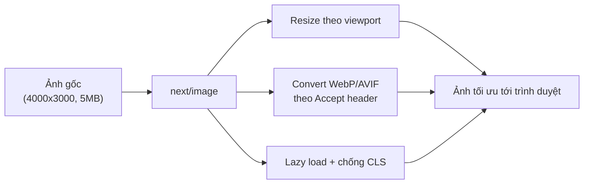
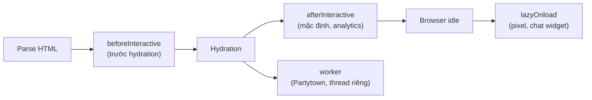

# Asset Optimization: Image, Font, Script

Tối ưu **asset** (tài nguyên tĩnh: ảnh, font chữ, script) là việc giảm dung lượng và thời gian tải các tệp đi kèm trang web để trang hiển thị nhanh hơn. Next.js cung cấp sẵn các thành phần như `next/image`, `next/font` và `next/script` giúp tự động nén ảnh, nạp font hiệu quả và kiểm soát thời điểm chạy script. Nhờ đó người mới chỉ cần dùng đúng công cụ là đã có hiệu năng tốt mà không cần cấu hình thủ công phức tạp.

---

:::note[Ghi nhớ nhanh]

- ⭐ **Thay `` bằng `<Image>`** — tự nén WebP/AVIF, resize theo viewport, lazy load mặc định và chống CLS (cần `width`/`height` hoặc `fill`).
- **`next/font`** self-host font, preload song song, không nhấp nháy hay layout shift.
- **`next/script`** kiểm soát thời điểm tải qua `strategy` (`afterInteractive` là mặc định, `lazyOnload` cho pixel/chat).
- **`public/`** chứa asset tĩnh nhưng không qua build optimization — hợp favicon, robots.txt, PDF.
- **Video > 5MB** nên dùng streaming service (Mux, Cloudflare Stream) thay vì nhồi vào bundle.

:::

---

## Mục lục

- [Vì sao cần tối ưu asset?](#vì-sao-cần-tối-ưu-asset)
- [next/image](#nextimage)
- [next/font](#nextfont)
- [next/script](#nextscript)
- [Static Assets (public/)](#static-assets-public)
- [Video](#video)

---

## Vì sao cần tối ưu asset?

**Vấn đề:**

```tsx
// Ảnh tải nguyên kích thước gốc (4000x3000, 5MB), sai định dạng, không lazy


// Font Google nạp qua <link> bên thứ ba, render-blocking, nhấp nháy chữ (FOUT/FOIT)
<link href="https://fonts.googleapis.com/css?family=Inter" rel="stylesheet" />

// Script analytics chặn render, chạy ngay khi parse HTML
<script src="https://analytics.example.com/tracker.js"></script>
```

Hậu quả: trang nặng và chậm, layout nhảy (CLS) khi ảnh/font tải xong, chữ
nhấp nháy, render bị chặn. Đây là nguyên nhân hàng đầu kéo điểm hiệu năng và
SEO (Core Web Vitals) xuống thấp.

**Giải pháp:**

```tsx
import Image from "next/image";
import { Inter } from "next/font/google";
import Script from "next/script";

// next/image: tự resize, WebP/AVIF, lazy mặc định, chống CLS nhờ width/height
<Image src="/photo.jpg" alt="..." width={800} height={600} />;

// next/font: self-host, không nhấp nháy, không layout shift
const inter = Inter({ subsets: ["latin"], display: "swap" });

// next/script: kiểm soát thời điểm tải, không chặn render
<Script src="https://analytics.example.com/tracker.js" strategy="afterInteractive" />;
```

:::tip[Dùng thực tế]

- **Thay `` bằng `<Image>`**: ảnh banner/sản phẩm tự nén WebP/AVIF, lazy
  load ảnh ngoài viewport, hết giật layout khi cuộn.
- **Dùng `next/font` cho Google Font**: self-host Inter/Roboto, chữ hiện mượt
  từ đầu, không còn nhấp nháy hay nhảy chữ.
- **Kiểm soát script analytics bằng `next/script`**: GA/pixel chạy
  `afterInteractive` hoặc `lazyOnload`, không chặn lần hiển thị đầu tiên.
- **Cải thiện Core Web Vitals**: LCP, CLS, INP tốt lên rõ → điểm Lighthouse và
  thứ hạng SEO tăng theo.

:::

---

## next/image

Component `<Image>` tự optimize hình:

- Convert sang WebP / AVIF.
- Resize theo viewport.
- Lazy load mặc định.
- Tránh CLS (layout shift) — cần width/height.

Luồng xử lý một ảnh qua `next/image`:



```tsx
import Image from "next/image";

<Image
  src="/photo.jpg"
  alt="Description"
  width={800}
  height={600}
  priority         // load trước (LCP image)
/>
```

Remote image — config domain:

```ts
// next.config.ts
export default {
  images: {
    remotePatterns: [
      {
        protocol: "https",
        hostname: "images.unsplash.com",
      },
    ],
  },
};
```

```tsx
<Image
  src="https://images.unsplash.com/photo-123"
  width={800}
  height={600}
  alt="Unsplash"
/>
```

**Fill mode** — element parent có position:

```tsx
<div className="relative h-64">
  <Image src="/photo.jpg" alt="..." fill className="object-cover" />
</div>
```

**Placeholder blur**:

```tsx
<Image
  src="/photo.jpg"
  width={800}
  height={600}
  alt="..."
  placeholder="blur"
  blurDataURL="data:image/jpeg;base64,..."
/>
```

:::info[Phân tích]

**Tại sao dùng next/image thay ``?**

| | `` | `<Image>` |
|--|---------|-----------|
| Format conversion | Không | **WebP/AVIF tự động** |
| Resize cho mobile | Tải nguyên size | **Multiple size** |
| Lazy load | Cần `loading="lazy"` thủ công | **Default** |
| CLS prevention | Không | **Auto** (cần width/height) |
| Priority hint | Cần `fetchpriority` | `priority` prop |

Next.js Image Optimization Service:

- Build time: serve direct nếu static export.
- Runtime: optimize on-the-fly, cache result.
- Format detect theo `Accept` header.

Trade-off:

- Cần Next.js Image Optimization (Vercel built-in, AWS cần config).
- `width`/`height` bắt buộc (hoặc `fill`).
- Bundle thêm next/image runtime.

:::

---

## next/font

Self-host font, auto preload, **no layout shift**:

```tsx
// app/layout.tsx
import { Inter, Roboto_Mono } from "next/font/google";

const inter = Inter({
  subsets: ["latin"],
  display: "swap",
});

const robotoMono = Roboto_Mono({
  subsets: ["latin"],
  weight: ["400", "700"],
});

export default function RootLayout({ children }) {
  return (
    <html className={inter.className}>
      <body>
        {children}
        <code className={robotoMono.className}>code</code>
      </body>
    </html>
  );
}
```

Font local:

```ts
import localFont from "next/font/local";

const myFont = localFont({
  src: "./fonts/MyFont.woff2",
  display: "swap",
});
```

:::info[Phân tích]

**Tại sao next/font?**

1. **Self-host** — không gọi Google Fonts CDN (privacy + speed).
2. **Preload** — font load song song với HTML.
3. **No layout shift** — size-adjust + fallback metrics calculated.
4. **CSS variable** support:

```tsx
const inter = Inter({ subsets: ["latin"], variable: "--font-inter" });

<html className={inter.variable}>
  <style>{`body { font-family: var(--font-inter); }`}</style>
```

Trước next/font:

- Google Fonts qua `<link>` → 3rd party request, render-blocking.
- Self-host thủ công → preload + CSS @font-face viết tay.

next/font handle hết.

:::

---

## next/script

Component `<Script>` cho **third-party script** với strategy load:

```tsx
import Script from "next/script";

<Script src="https://www.googletagmanager.com/gtag/js?id=GA_ID" />
<Script id="ga-config">
  {`
    window.dataLayer = window.dataLayer || [];
    function gtag(){dataLayer.push(arguments);}
    gtag('js', new Date());
    gtag('config', 'GA_ID');
  `}
</Script>
```

**Strategy**:

```tsx
<Script src="..." strategy="beforeInteractive" />  {/* trước hydration */}
<Script src="..." strategy="afterInteractive" />   {/* mặc định */}
<Script src="..." strategy="lazyOnload" />          {/* idle */}
<Script src="..." strategy="worker" />              {/* Partytown worker */}
```

| Strategy | Khi load | Use case |
|----------|----------|----------|
| `beforeInteractive` | Trước hydration | Critical script (consent, A/B) |
| `afterInteractive` | Sau hydration | Default (analytics) |
| `lazyOnload` | Browser idle | Marketing pixel, chat widget |
| `worker` | Web Worker thread | Heavy script, Partytown |

Sơ đồ thời điểm tải theo từng `strategy`:



**Event handler**:

```tsx
<Script
  src="..."
  onLoad={() => console.log("loaded")}
  onError={(e) => console.error(e)}
/>
```

---

## Static Assets (public/)

Thư mục `public/` chứa file static, accessible từ root:

```
public/
├── favicon.ico       → /favicon.ico
├── robots.txt        → /robots.txt
├── images/
│   └── logo.png      → /images/logo.png
└── docs/
    └── guide.pdf     → /docs/guide.pdf
```

Reference trong code:

```tsx

<Image src="/images/logo.png" width={100} height={50} alt="Logo" />
<a href="/docs/guide.pdf">Download</a>
```

:::warning[Cần lưu ý]

**`public/` không tham gia build optimization**:

- Không minify HTML/CSS/JS trong public.
- Không hash filename → cache header phải set thủ công.
- Phù hợp: favicon, robots.txt, sitemap, manifest.json, PDF, fonts custom.

Không phù hợp:

- Image dùng trong component → import trong `app/` hoặc dùng `<Image>`.
- CSS → import qua module.
- JS → import bình thường.

:::

---

## Video

Next.js không có `<Video>` built-in. Strategy:

**1. File nhỏ trong `public/`**:

```tsx
<video controls width={640}>
  <source src="/intro.mp4" type="video/mp4" />
</video>
```

**2. Streaming service** (khuyến nghị):

- **Mux** — chuyên video, tích hợp tốt.
- **Cloudflare Stream**.
- **Vercel Blob** + adaptive bitrate (HLS).
- **YouTube/Vimeo embed**.

```tsx
import MuxPlayer from "@mux/mux-player-react";

<MuxPlayer
  playbackId="..."
  streamType="on-demand"
  metadata={{ video_title: "Demo" }}
/>
```

:::tip[Mẹo]

**Video performance tips**:

- **Poster image** — show ngay trước video load:

```tsx
<video poster="/poster.jpg" controls>
  <source src="/video.mp4" type="video/mp4" />
</video>
```

- **Preload metadata**:

```tsx
<video preload="metadata" />
```

- **Lazy load** với Intersection Observer hoặc loading="lazy".

- **HLS / DASH** cho video dài → adaptive bitrate (Mux, Cloudflare Stream).

Bundle video lớn vào page → tăng LCP. Dùng streaming service cho mọi video
> 5MB.

:::

:::info[Phân tích]

**Asset optimization checklist Next.js:**

- [ ] Mọi `` → `<Image>` (trừ inline SVG, GIF nhỏ).
- [ ] Font qua `next/font` (Google hoặc local).
- [ ] 3rd party script qua `<Script>` với strategy đúng.
- [ ] Critical resource có `priority`/`preload`.
- [ ] Static asset trong `public/` có cache header dài.
- [ ] Video > 5MB → streaming service.
- [ ] Icon → SVG inline hoặc Lucide React (tree-shake).

Đo trước/sau qua Lighthouse — LCP, CLS, INP cải thiện rõ rệt.

:::
