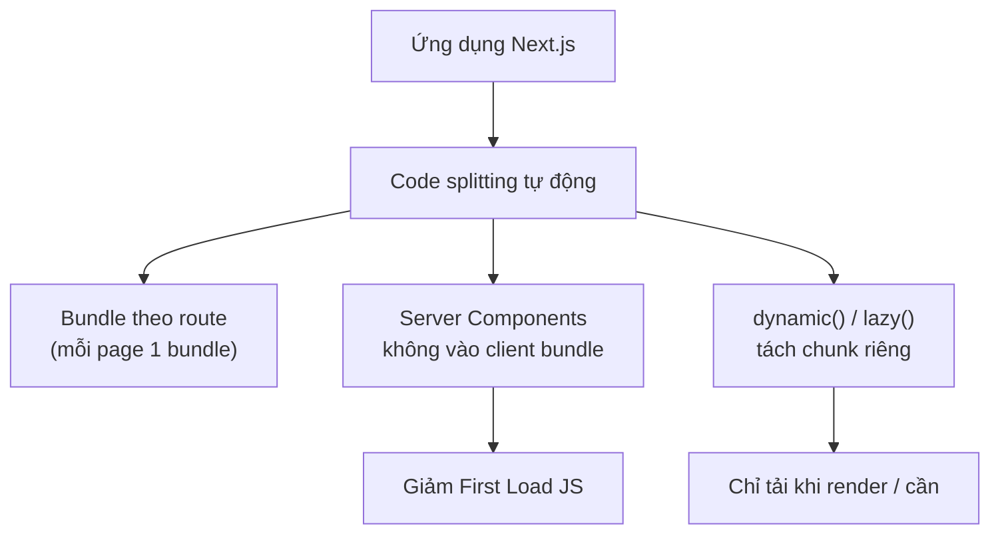

# Code Optimization: Metadata, Lazy Loading, Bundling

Tối ưu code là cách giảm lượng JavaScript phải tải và chạy trên trình duyệt để ứng dụng nhẹ và nhanh hơn. Bài này giới thiệu **metadata** (dữ liệu mô tả trang dùng cho SEO), **lazy loading** (chỉ nạp thành phần khi thật sự cần) và **bundling** (gói các tệp mã nguồn lại với nhau). Hiểu các kỹ thuật này giúp người mới biết cách chia nhỏ và nạp code đúng lúc thay vì tải tất cả ngay từ đầu.

[](pathname:///img/nextjs/code-optimization.webp)

---

:::note[Ghi nhớ nhanh]

- ⭐ **`dynamic()` lazy load component nặng** (chart, editor, map) để chúng không vào initial bundle — chỉ dùng trong Client Component.
- **Metadata API** (`export const metadata` / `generateMetadata`) tự sinh `<head>` cho SEO; `fetch` được dedupe giữa metadata và page.
- **Ưu tiên Server Component** để giảm First Load JS gửi xuống trình duyệt.
- **Tree-shaking**: import đường dẫn con (`lodash/debounce`) thay vì cả thư viện; `optimizePackageImports` cho icon library.
- **Mục tiêu First Load JS < 200KB**, nhưng đừng `dynamic()` mọi thứ — over-fragmentation gây nhiều HTTP request.

:::

---

## Mục lục

- [Vì sao cần tối ưu code (bundle)?](#vì-sao-cần-tối-ưu-code-bundle)
- [Metadata API (SEO)](#metadata-api-seo)
- [Dynamic Metadata](#dynamic-metadata)
- [Lazy Loading với dynamic()](#lazy-loading-với-dynamic)
- [Code Splitting](#code-splitting)
- [Package Bundling](#package-bundling)
- [Câu hỏi phỏng vấn](#câu-hỏi-phỏng-vấn)

---

## Vì sao cần tối ưu code (bundle)?

**Vấn đề:**

```tsx
// Gói TẤT CẢ JS vào một bundle to → tải lâu, hydration chậm, máy yếu giật
"use client";
import _ from "lodash";          // nhập cả thư viện dù chỉ dùng 1 hàm
import HeavyChart from "./HeavyChart";   // chart nặng tải ngay cả khi chưa xem
import RichEditor from "./RichEditor";   // editor nặng nằm trong initial bundle

export default function Dashboard() {
  // Toàn bộ chart + editor + lodash vào client bundle → First Load JS phình to
  return <div>{/* ... */}</div>;
}
```

**Giải pháp:**

```tsx
// Tối ưu code: chỉ nạp JS khi cần, đẩy bớt JS ra khỏi client
import dynamic from "next/dynamic";
import debounce from "lodash/debounce"; // tree-shaking: chỉ lấy 1 hàm

// dynamic(): lazy load component nặng, không vào initial bundle
const HeavyChart = dynamic(() => import("./HeavyChart"), {
  loading: () => <Skeleton />,
});

// Next.js tự code splitting theo route → mỗi page là 1 bundle riêng
// Ưu tiên Server Component để GIẢM JS gửi xuống client
export default function Dashboard() {
  return (
    <div>
      <Header />          {/* Server Component — không tốn JS client */}
      <HeavyChart />      {/* chỉ tải JS chart khi render */}
    </div>
  );
}
// Dùng bundle analyzer (ANALYZE=true npm run build) để tìm chunk to cần cắt
```

:::tip[Dùng thực tế]

- **Lazy load chart/editor**: bọc component nặng (biểu đồ, rich text editor, bản đồ) bằng `dynamic()` để chúng chỉ tải khi người dùng thật sự mở.
- **Tách thư viện nặng**: import named/đường dẫn con (`lodash/debounce`) thay vì `import _ from "lodash"` để tree-shaking cắt phần thừa.
- **Đẩy logic sang Server Component**: giữ phần tĩnh ở server, chỉ phần tương tác mới `"use client"` → giảm First Load JS xuống trình duyệt.
- **Phân tích bundle**: chạy `ANALYZE=true npm run build`, tìm chunk lớn nhất rồi quyết định thay lib, lazy load hay tách client/server.

:::

---

## Metadata API (SEO)

Export `metadata` từ page/layout — Next.js tự thêm `<head>`:

```tsx
// app/page.tsx
import type { Metadata } from "next";

export const metadata: Metadata = {
  title: "Home | My App",
  description: "Welcome to my app",
  openGraph: {
    title: "Home",
    description: "Welcome",
    images: ["/og-image.png"],
  },
  twitter: {
    card: "summary_large_image",
  },
};

export default function HomePage() { /* ... */ }
```

Metadata thường dùng:

```ts
{
  title: "...",
  description: "...",

  keywords: ["next.js", "react"],
  authors: [{ name: "An" }],

  // Social
  openGraph: {
    type: "website",
    url: "https://example.com",
    title: "...",
    description: "...",
    images: [{ url: "/og.png", width: 1200, height: 630 }],
  },
  twitter: {
    card: "summary_large_image",
    site: "@username",
  },

  // Robots
  robots: {
    index: true,
    follow: true,
  },

  // Canonical
  alternates: {
    canonical: "https://example.com/about",
    languages: {
      "en": "/en/about",
      "vi": "/vi/about",
    },
  },

  // Icons
  icons: {
    icon: "/favicon.ico",
    apple: "/apple-icon.png",
  },
}
```

**Template** trong root layout — combine với page:

```ts
// app/layout.tsx
export const metadata: Metadata = {
  title: {
    default: "My App",
    template: "%s | My App",
  },
};

// app/about/page.tsx
export const metadata: Metadata = {
  title: "About",  // sẽ thành "About | My App"
};
```

---

## Dynamic Metadata

`generateMetadata` function — async, dynamic theo data:

```tsx
// app/blog/[slug]/page.tsx
import type { Metadata } from "next";

export async function generateMetadata({
  params,
}: {
  params: Promise<{ slug: string }>;
}): Promise<Metadata> {
  const { slug } = await params;
  const post = await fetchPost(slug);

  return {
    title: post.title,
    description: post.excerpt,
    openGraph: {
      images: [post.coverImage],
    },
  };
}

export default async function BlogPost({ params }) { /* ... */ }
```

:::info[Phân tích]

**Metadata dedup với page fetch**:

Trong App Router, `fetch()` được **memoize trong 1 request**:

```tsx
async function generateMetadata({ params }) {
  const post = await fetchPost(slug); // gọi 1 lần
  return { title: post.title };
}

export default async function Page({ params }) {
  const post = await fetchPost(slug); // dedupe — không gọi lại API
  return <article>{post.content}</article>;
}
```

→ Không lo về performance khi fetch cùng data ở metadata + page. Next.js
+ React `cache()` handle.

:::

---

## Lazy Loading với dynamic()

Import component **lazy** — không vào initial bundle:

```tsx
import dynamic from "next/dynamic";

const HeavyChart = dynamic(() => import("./HeavyChart"), {
  loading: () => <Skeleton />,
});

export default function Dashboard() {
  return (
    <div>
      <Header />
      <HeavyChart /> {/* chỉ load JS khi render */}
    </div>
  );
}
```

Disable SSR (cho component dùng browser API):

```tsx
const Map = dynamic(() => import("./Map"), {
  ssr: false,
  loading: () => <p>Loading map...</p>,
});
```

:::warning[Cần lưu ý]

**`dynamic` chỉ work trong Client Component** trong App Router. Server
Component dùng **Suspense + lazy** kiểu khác:

```tsx
// Server Component
import { Suspense, lazy } from "react";

const LazyHeavy = lazy(() => import("./Heavy"));

export default function Page() {
  return (
    <Suspense fallback={<Skeleton />}>
      <LazyHeavy />
    </Suspense>
  );
}
```

`dynamic({ ssr: false })` — buộc client-only render, dùng cho widget
phụ thuộc browser (canvas, mapbox, charting).

:::

---

## Code Splitting

Next.js **tự code split**:

- **Per route** — mỗi page là 1 bundle.
- **Per component lazy** — `dynamic()`/`lazy()`.
- **Per Client Component boundary** — Server Components không vào bundle.

Sơ đồ các cách Next.js tách nhỏ code:



Xem bundle:

```bash
npm run build
```

```
Route (app)                Size      First Load JS
┌ ○ /                    5.2 kB        85 kB
├ ○ /about               2.1 kB        82 kB
├ ƒ /dashboard          15.3 kB        95 kB
└ ƒ /dashboard/chart    22.4 kB       102 kB (extra chart bundle)
```

**First Load JS** — bundle tải khi vào page lần đầu.

:::tip[Mẹo]

**Tối ưu bundle size**:

**1. Tree-shake**: import named, không import all:

```ts
// Tệ — import all
import _ from "lodash";

// Tốt — named
import { debounce } from "lodash-es";

// Tốt hơn — function riêng
import debounce from "lodash/debounce";
```

**2. Replace heavy library**:

- `moment` → `date-fns` hoặc `dayjs`.
- `lodash` → native ES + 1-2 function riêng.
- `axios` → `fetch` native.

**3. Tách Client/Server**:

```tsx
// Tệ — toàn page client
"use client";
function Page() {
  // Heavy chart luôn trong client bundle
}

// Tốt — server wrap
function Page() {
  return (
    <>
      <Header />
      <ClientChart />  {/* chỉ chart bundle vào client */}
    </>
  );
}
```

**4. Analyze**:

```bash
npm install -D @next/bundle-analyzer
ANALYZE=true npm run build
```

:::

---

## Package Bundling

Next.js có **`serverExternalPackages`** — không bundle package server:

```ts
// next.config.ts
export default {
  serverExternalPackages: ["sharp", "@prisma/client"],
};
```

→ Native module hoặc package lớn không bundle vào server output → faster
cold start.

**`transpilePackages`** — buộc transpile package từ node_modules:

```ts
export default {
  transpilePackages: ["some-untranspiled-pkg"],
};
```

Dùng khi package publish ESM mà bundler không xử lý được.

**`optimizePackageImports`** — auto tree-shake package không tự tree-shake:

```ts
export default {
  experimental: {
    optimizePackageImports: ["lucide-react", "@radix-ui/react-icons"],
  },
};
```

```tsx
// Trước
import { Search, User, Settings } from "lucide-react"; // bundle hết
// Bundle: ~50KB

// Sau (với optimizePackageImports)
import { Search, User, Settings } from "lucide-react";
// Bundle: chỉ ~5KB cho 3 icon
```

Đặc biệt hữu ích cho **icon library** (Lucide, Heroicons), **utility lib**.

:::info[Phân tích]

**Bundle optimization workflow**:

1. **Build + analyze** baseline:

```bash
ANALYZE=true npm run build
```

2. **Identify largest chunk** — package nào chiếm size.

3. **Apply optimization**:
   - `optimizePackageImports` cho icon/util.
   - `serverExternalPackages` cho native module.
   - Replace heavy lib.
   - Dynamic import cho component lớn.

4. **Re-analyze** → đo improvement.

5. **Repeat** cho large chunk còn lại.

Target: **First Load JS < 200KB** cho page chính. Báo cáo Vercel có
hint khi vượt ngưỡng.

:::

:::warning[Cần lưu ý]

**Bundle quá nhỏ cũng không tốt** — over-fragmentation gây nhiều HTTP
request, slow on poor network.

Sweet spot:

- Initial bundle: 100-200KB gzipped.
- Per-route extra: `<50KB`.
- Lazy chunks: chỉ tách khi `>50KB`.

Đừng cố `dynamic()` mọi component — overhead networking đôi khi tệ hơn.

:::

---

## Câu hỏi phỏng vấn

Những câu thường gặp về chủ đề này. Tự trả lời trước, rồi bấm **Xem đáp án** để đối chiếu.

**1. `Code splitting` là gì, và Next.js tự động tách bundle theo những ranh giới nào?**

<details className="qa">
<summary>Xem đáp án</summary>

**Code splitting** là kỹ thuật chia JavaScript thành nhiều chunk nhỏ để trình duyệt **chỉ tải phần cần cho màn hình hiện tại**, thay vì một file khổng lồ chứa toàn bộ ứng dụng.

Next.js tách tự động theo ba ranh giới:

- **Theo route**: mỗi page có bundle riêng. Vào `/about` thì không phải tải code của `/dashboard`.
- **Theo ranh giới Client Component**: mọi thứ là Server Component **không gửi JS xuống client** chút nào — đây là cách cắt mạnh nhất, vì code không chỉ được hoãn mà biến mất hẳn khỏi bundle.
- **Theo lazy import**: `dynamic()` hoặc `React.lazy()` tạo chunk riêng, chỉ tải khi component thực sự được render.

Ngoài ra code dùng chung giữa nhiều route được gom vào **shared chunk** để tải một lần rồi cache. Output của `next build` hiển thị `Size` (riêng route) và `First Load JS` (tổng phải tải khi vào route đó lần đầu).

</details>

**2. Giải thích `tree shaking`: vì sao `import _ from "lodash"` làm phình bundle còn `import debounce from "lodash/debounce"` thì không?**

<details className="qa">
<summary>Xem đáp án</summary>

**Tree shaking** là việc bundler phân tích đồ thị import/export **tĩnh** của ES Module và loại bỏ những export không ai dùng.

Vấn đề với `lodash` bản gốc: nó được publish dưới dạng **CommonJS**, nơi `module.exports` là một object được dựng lúc chạy. Bundler không thể chứng minh an toàn rằng phần nào không dùng, nên giữ lại toàn bộ (~70KB).

```ts
// Tệ — kéo cả thư viện
import _ from "lodash";

// Tốt — import trực tiếp file của một hàm
import debounce from "lodash/debounce";

// Tốt — bản ESM có thể tree-shake
import { debounce } from "lodash-es";
```

Điều kiện để tree shaking hoạt động: thư viện phải là ESM, import phải tĩnh (không phải `require` có điều kiện), và không có **side effect** ẩn — package khai báo `sideEffects: false` trong `package.json` để bundler mạnh dạn cắt.

</details>

**3. Khác nhau giữa import tĩnh và `dynamic()` của `next/dynamic`? `dynamic()` ảnh hưởng thế nào tới initial bundle?**

<details className="qa">
<summary>Xem đáp án</summary>

**Import tĩnh** nối module vào đồ thị phụ thuộc của route, nên code đó nằm trong bundle ban đầu và được tải dù người dùng có nhìn thấy component hay không.

**`dynamic()`** bọc một `import()` động, khiến bundler cắt module thành **chunk riêng**; chunk chỉ được tải khi component được render lần đầu.

```tsx
import dynamic from "next/dynamic";

const HeavyChart = dynamic(() => import("./HeavyChart"), {
  loading: () => <Skeleton />,
});
```

Ảnh hưởng tới initial bundle: kích thước tải lần đầu giảm đúng bằng phần code đã tách ra (kèm phụ thuộc riêng của nó). Đổi lại có **một lượt request mạng phụ** lúc component xuất hiện, nên cần `loading` để tránh khoảng trống.

Chỉ nên dùng cho component thật sự nặng và **không hiển thị ngay** — biểu đồ, rich text editor, bản đồ, modal. Tách một component 5KB chỉ khiến người dùng chờ thêm một round-trip.

</details>

**4. Khi nào nên đặt `ssr: false` trong `dynamic()`, và bạn đánh đổi điều gì về SEO cũng như `LCP`?**

<details className="qa">
<summary>Xem đáp án</summary>

Đặt `ssr: false` khi component **chỉ chạy được trong trình duyệt** — dùng `window`, `document`, `localStorage`, canvas/WebGL, thư viện bản đồ như Mapbox/Leaflet, hoặc thư viện đọc trực tiếp kích thước DOM. Không có nó, bước render phía server sẽ ném lỗi vì các API đó không tồn tại.

```tsx
const Map = dynamic(() => import("./Map"), {
  ssr: false,
  loading: () => <p>Loading map...</p>,
});
```

Đánh đổi:

- **SEO**: nội dung của component **không nằm trong HTML** trả về từ server, nên bot không thấy (hoặc chỉ thấy nếu nó chịu chạy JS). Tuyệt đối không dùng cho nội dung chính cần index.
- **LCP**: nếu phần tử lớn nhất nằm trong component này, người dùng phải chờ tải JS, hydrate rồi mới thấy — LCP xấu đi rõ.
- **CLS**: cần `loading` giữ đúng chỗ, nếu không bố cục sẽ nhảy khi component xuất hiện.

Nguyên tắc: `ssr: false` cho tiện ích phụ nằm dưới màn hình đầu, không cho nội dung chính.

</details>

**5. Trong App Router, vì sao `next/dynamic` chỉ dùng được trong Client Component, còn Server Component phải dùng `Suspense` kèm `lazy`?**

<details className="qa">
<summary>Xem đáp án</summary>

`next/dynamic` sinh ra ranh giới lazy **ở phía client**: nó cần quản lý trạng thái tải, render `loading`, và tuỳ chọn `ssr: false` vốn chỉ có nghĩa khi có một client runtime để hoãn việc render. Server Component chạy một lần trên server, không có state, không hydrate, nên những cơ chế đó không áp dụng — đặc biệt `ssr: false` là vô nghĩa trong ngữ cảnh server.

Ở Server Component, cách tương đương là để React **stream** phần chậm:

```tsx
import { Suspense } from "react";
import Heavy from "./Heavy";

export default function Page() {
  return (
    <Suspense fallback={<Skeleton />}>
      <Heavy />
    </Suspense>
  );
}
```

Khác biệt bản chất: ở Server Component, thứ được hoãn là **dữ liệu và HTML** — server gửi fallback trước rồi stream phần thật xuống sau. Ở Client Component, thứ được hoãn là **JavaScript**. Ngoài ra bản thân Server Component đã không đóng góp gì vào client bundle, nên "lazy load để giảm bundle" không còn là mục tiêu ở đó.

</details>

**6. Chỉ số `First Load JS` trong output của `next build` nghĩa là gì, và bạn coi ngưỡng bao nhiêu là chấp nhận được?**

<details className="qa">
<summary>Xem đáp án</summary>

**First Load JS** là **tổng lượng JavaScript trình duyệt phải tải khi vào thẳng route đó lần đầu**: chunk riêng của route, cộng các shared chunk (framework React, runtime Next.js, code dùng chung giữa các route). Nó khác cột `Size` — cột đó chỉ là phần riêng của route.

```
Route (app)                Size      First Load JS
┌ ○ /                    5.2 kB        85 kB
├ ƒ /dashboard          15.3 kB        95 kB
```

Ngưỡng tham khảo trong bài:

- **Dưới 200KB (gzipped)** cho page chính là mục tiêu hợp lý.
- Mỗi route thêm nên dưới ~50KB.
- Dưới 100KB là rất tốt.

Lưu ý khi diễn giải: con số này là dung lượng đã nén, chưa tính CSS, ảnh và script bên thứ ba — nên một trang "85 kB" vẫn có thể chậm nếu nhúng nhiều tag bên ngoài. Và quan trọng hơn con số tuyệt đối là **xu hướng**: theo dõi để bundle không âm thầm phình lên qua từng PR.

</details>

**7. Bạn dùng công cụ nào để tìm chunk nặng, và quy trình tối ưu bundle của bạn gồm những bước nào?**

<details className="qa">
<summary>Xem đáp án</summary>

Công cụ chính là **`@next/bundle-analyzer`**, cho ra bản đồ treemap thấy rõ package nào chiếm chỗ:

```bash
npm install -D @next/bundle-analyzer
ANALYZE=true npm run build
```

Bổ sung: bảng tóm tắt của chính `next build`, Coverage tab của DevTools để xem bao nhiêu JS thực sự được dùng, và các dịch vụ so sánh kích thước package.

Quy trình:

1. **Đo baseline** và ghi lại con số.
2. **Tìm chunk lớn nhất** rồi truy ngược xem ai import nó.
3. **Áp dụng cách xử lý phù hợp** — thường theo thứ tự hiệu quả: chuyển component sang Server Component; thay thư viện nặng bằng bản nhẹ; bật `optimizePackageImports` cho thư viện barrel; `dynamic()` cho component nặng hiển thị muộn; `serverExternalPackages` cho native module.
4. **Đo lại** để xác nhận cải thiện thật.
5. **Lặp** cho chunk lớn kế tiếp, và dừng khi lợi ích không còn đáng công.
6. **Chốt lại bằng ngân sách bundle** kiểm tra trong CI để không trôi ngược.

</details>

**8. So sánh `serverExternalPackages`, `transpilePackages` và `optimizePackageImports` — mỗi option giải quyết vấn đề gì?**

<details className="qa">
<summary>Xem đáp án</summary>

| Option | Vấn đề giải quyết | Ví dụ |
|---|---|---|
| `serverExternalPackages` | Package chạy ở **server** không nên bị bundle — thường là native module hoặc thư viện lớn; bundle chúng gây lỗi hoặc làm output nặng, cold start chậm | `sharp`, `@prisma/client` |
| `transpilePackages` | Package trong `node_modules` được publish ở dạng chưa biên dịch (ESM hiện đại, TS, JSX) mà môi trường đích không hiểu | Thư viện nội bộ trong monorepo |
| `optimizePackageImports` | Package dùng **barrel file** nên import vài thứ lại kéo cả thư viện | `lucide-react`, `@radix-ui/react-icons` |

```ts
// next.config.ts
export default {
  serverExternalPackages: ["sharp", "@prisma/client"],
  transpilePackages: ["some-untranspiled-pkg"],
  experimental: {
    optimizePackageImports: ["lucide-react"],
  },
};
```

Tóm gọn: một cái nói "đừng bundle", một cái nói "hãy biên dịch giúp", một cái nói "hãy cắt bớt phần thừa". Chúng tác động ở ba khâu khác nhau nên hoàn toàn dùng chung được.

</details>

**9. Vì sao `optimizePackageImports` đặc biệt hiệu quả với thư viện icon dạng barrel file? Cơ chế bên dưới là gì?**

<details className="qa">
<summary>Xem đáp án</summary>

Thư viện icon thường có một **barrel file** — một `index.js` re-export hàng nghìn icon. Khi bạn viết:

```tsx
import { Search, User, Settings } from "lucide-react";
```

bundler phải nạp và phân tích toàn bộ barrel đó. Về lý thuyết tree shaking sẽ cắt phần thừa, nhưng thực tế việc phân tích hàng nghìn module rất chậm và thường không cắt sạch — kết quả có thể là hàng chục KB cho ba icon, cộng thời gian build tăng vọt.

`optimizePackageImports` **viết lại import lúc biên dịch**, biến câu lệnh trên thành các import trỏ thẳng tới file của từng icon:

```tsx
import Search from "lucide-react/dist/esm/icons/search";
```

Nhờ vậy bundler chỉ chạm đúng ba module. Kết quả trong bài: từ ~50KB xuống ~5KB cho ba icon, kèm build nhanh hơn rõ rệt. Lợi ích tương tự với các thư viện UI và utility dùng barrel. Một số package phổ biến đã được Next.js bật sẵn, phần còn lại bạn khai báo thêm.

</details>

**10. Metadata API hoạt động ra sao, và khác nhau giữa `metadata` tĩnh với `generateMetadata` async là gì?**

<details className="qa">
<summary>Xem đáp án</summary>

Bạn không tự viết thẻ trong `<head>`; thay vào đó **export metadata từ page hoặc layout**, Next.js gom lại theo cây route (page ghi đè layout) rồi sinh thẻ HTML tương ứng — `title`, `description`, Open Graph, Twitter card, `robots`, canonical, icon.

**`metadata` tĩnh** — dùng khi nội dung biết trước lúc build:

```tsx
export const metadata: Metadata = {
  title: "Home | My App",
  description: "Welcome to my app",
};
```

**`generateMetadata`** — hàm async, dùng khi metadata phụ thuộc dữ liệu động (params, dữ liệu từ API):

```tsx
export async function generateMetadata({ params }): Promise<Metadata> {
  const { slug } = await params;
  const post = await fetchPost(slug);
  return { title: post.title, description: post.excerpt };
}
```

Khác biệt chính: một bên là object hằng, không tốn chi phí runtime; một bên chạy trên server, nhận `params` và `searchParams`, có thể `await` dữ liệu. Không được export cả hai trong cùng một file. Quan trọng với SEO vì các thẻ này nằm sẵn trong HTML từ server, không cần JS.

</details>

**11. Nếu `generateMetadata` và page cùng `fetch` một API thì có bị gọi hai lần không? Giải thích cơ chế memoize/dedupe.**

<details className="qa">
<summary>Xem đáp án</summary>

**Không** — chỉ gọi mạng một lần, miễn là hai nơi dùng cùng URL và cùng tuỳ chọn.

```tsx
async function generateMetadata({ params }) {
  const post = await fetchPost(slug); // gọi thật
  return { title: post.title };
}

export default async function Page({ params }) {
  const post = await fetchPost(slug); // dedupe — dùng lại kết quả
  return <article>{post.content}</article>;
}
```

Cơ chế: trong App Router, `fetch` được **memoize trong phạm vi một lần render request**. Next.js tạo khoá từ URL và options; lần gọi thứ hai trùng khoá sẽ nhận lại cùng promise thay vì đi ra mạng. Bộ nhớ tạm này sống trong vòng đời của request rồi bị bỏ, khác với Data Cache vốn tồn tại xuyên request.

Với nguồn dữ liệu **không dùng `fetch`** — truy vấn database qua ORM chẳng hạn — cơ chế này không tự áp dụng. Khi đó bọc hàm bằng **`cache()` của React** để có hiệu quả tương đương:

```ts
import { cache } from "react";
export const getPost = cache(async (slug: string) => db.post.find(slug));
```

</details>

**12. `title.template` ở root layout kết hợp với metadata của từng page như thế nào?**

<details className="qa">
<summary>Xem đáp án</summary>

`title` có thể là object với `default` và `template`. `template` chứa ký tự thay thế `%s`, và **mọi page con** chỉ cần khai báo phần riêng của mình:

```ts
// app/layout.tsx
export const metadata: Metadata = {
  title: {
    default: "My App",
    template: "%s | My App",
  },
};

// app/about/page.tsx
export const metadata: Metadata = {
  title: "About", // render thành "About | My App"
};
```

Các quy tắc cần nhớ:

- **`default`** được dùng khi route con không khai báo `title` nào.
- **`template` chỉ áp dụng cho route con**, không áp cho chính segment khai báo nó — tiêu đề của layout gốc là `default`.
- Layout lồng nhau có thể khai báo template riêng, ghi đè template của cấp trên cho nhánh đó.
- Muốn một page thoát khỏi template, dùng `title: { absolute: "..." }`.

Lợi ích: giữ hậu tố thương hiệu nhất quán toàn site mà không phải lặp lại ở từng page.

</details>

**13. Chuyển một phần UI từ Client Component sang Server Component giúp giảm bundle ra sao, và giới hạn của cách này là gì?**

<details className="qa">
<summary>Xem đáp án</summary>

Đây là cách giảm bundle **triệt để nhất**: code của Server Component không chỉ được hoãn tải mà **không bao giờ được gửi xuống trình duyệt**. Cùng với nó, mọi thư viện mà component đó import — thư viện markdown, thư viện định dạng ngày, SDK truy vấn dữ liệu — cũng biến mất khỏi client bundle. Client chỉ nhận kết quả đã render.

Kỹ thuật thường dùng là **đẩy ranh giới `"use client"` xuống càng sâu càng tốt**: thay vì đánh dấu cả trang là client, chỉ đánh dấu đúng nút bấm hay form cần tương tác.

Giới hạn:

- Server Component **không có state, effect, ref, event handler**, không dùng được browser API. Mọi thứ cần tương tác vẫn phải là client.
- **Props truyền từ server sang client phải serialize được** — không truyền hàm, class instance hay `Date` phức tạp một cách tuỳ tiện.
- Không dùng được context của React ở phía server theo cách quen thuộc.
- Server Component **render lại ở server**, nên phần tương tác cần cập nhật tức thì vẫn phải nằm ở client.
- Thư viện UI cũ chưa hỗ trợ RSC có thể buộc phải bọc client.

</details>

**14. Vì sao chia chunk quá nhỏ (over-fragmentation) lại có hại? Bạn cân bằng số lượng chunk và kích thước chunk thế nào?**

<details className="qa">
<summary>Xem đáp án</summary>

Mỗi chunk là một **request riêng** với chi phí cố định: round-trip mạng, header, thời gian xử lý. Chia quá nhỏ dẫn tới:

- **Waterfall**: chunk A tải xong mới biết cần chunk B, chuỗi phụ thuộc kéo dài, đặc biệt đau trên mạng di động độ trễ cao.
- **Mất hiệu quả nén**: gzip/brotli nén kém hơn trên nhiều file nhỏ so với một file gộp.
- **Nhiều khoảnh khắc `loading`** nhấp nháy, trải nghiệm rời rạc và dễ gây layout shift.
- Overhead runtime của module loader tăng theo số chunk.

Ngưỡng tham khảo trong bài:

- Initial bundle: **100–200KB** gzipped.
- Mỗi route thêm: dưới ~50KB.
- Chỉ tách chunk lazy khi phần đó **lớn hơn ~50KB**.

Cách cân bằng thực dụng: tách theo **hành vi người dùng** chứ không theo con số — cái gì không hiện trong màn hình đầu và không phải ai cũng mở (modal, tab phụ, biểu đồ, editor) thì tách; phần còn lại gộp chung. Sau mỗi lần tách thì đo lại, đừng `dynamic()` theo phản xạ.

</details>

**15. Tình huống: trang dashboard có `First Load JS` khoảng `400KB` và `LCP` chậm — bạn điều tra rồi xử lý theo thứ tự nào?**

<details className="qa">
<summary>Xem đáp án</summary>

Điều tra:

1. `ANALYZE=true npm run build` để xem treemap, tìm ra vài package chiếm phần lớn dung lượng.
2. Kiểm tra **ranh giới `"use client"`**: rất thường gặp trường hợp cả trang bị đánh dấu client chỉ vì một nút bấm, kéo theo mọi thứ vào bundle.
3. Xem Performance/Network để biết LCP đang chờ **JS** hay chờ **dữ liệu/ảnh** — hai nguyên nhân này cần cách chữa khác nhau.

Xử lý theo thứ tự lợi ích giảm dần:

1. **Thu hẹp ranh giới client**: chuyển phần tĩnh về Server Component — thường cắt được nhiều nhất mà không đổi kiến trúc.
2. **Thay thư viện nặng**: `moment` sang `date-fns`/`dayjs`, bỏ `axios` dùng `fetch`, bỏ `lodash` toàn phần.
3. **Bật `optimizePackageImports`** cho thư viện icon và UI dạng barrel.
4. **`dynamic()`** cho biểu đồ, editor, bảng lớn — những thứ nằm dưới màn hình đầu, kèm skeleton giữ chỗ.
5. **Streaming với `Suspense`** để phần khung hiện ngay, dữ liệu chậm về sau — cải thiện cảm nhận về LCP.
6. Rà lại **script bên thứ ba** và ảnh hero (`priority`, `sizes`).
7. Đo lại, rồi đặt **ngân sách bundle trong CI** để giữ kết quả.

</details>
