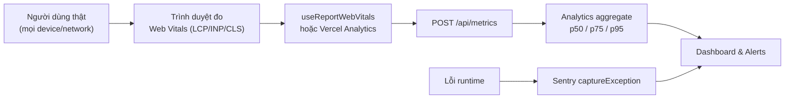
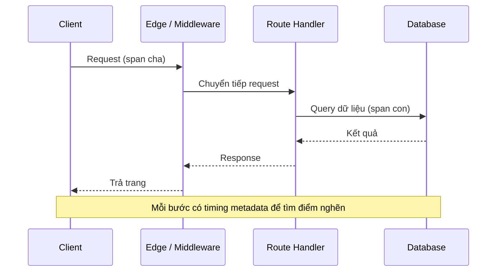

# Monitoring và Observability

**Monitoring** (giám sát) là việc theo dõi tình trạng hoạt động và hiệu năng của ứng dụng khi nó đang chạy thực tế. **Observability** (khả năng quan sát) đi xa hơn, giúp bạn hiểu được vì sao ứng dụng hoạt động như vậy thông qua số liệu, log và dấu vết (trace). Với người mới, đây là cách phát hiện sớm lỗi và điểm chậm trên môi trường người dùng thật thay vì chỉ đoán mò.

[](pathname:///img/nextjs/monitoring.webp)

---

:::note[Ghi nhớ nhanh]

- ⭐ **Đo Web Vitals từ người dùng thật (field data)** bằng `useReportWebVitals` — quan trọng hơn lab data (Lighthouse/CI) vì phản ánh device/network thực.
- **Vercel Analytics + Speed Insights** track page view và Web Vitals real users, tổng hợp p50/p75/p95.
- **`instrumentation.ts` + OpenTelemetry** (`@vercel/otel`) cho distributed tracing, tìm bước chậm trong hệ thống.
- **Sentry** bắt lỗi production tự động (exception, promise rejection, render error) qua `captureException`.
- **Sampling rate** để tiết kiệm cost — không log/trace 100% traffic production.

:::

---

## Mục lục

- [Vì sao cần monitoring?](#vì-sao-cần-monitoring)
- [Web Vitals](#web-vitals)
- [Next.js Analytics](#nextjs-analytics)
- [Instrumentation](#instrumentation)
- [OpenTelemetry](#opentelemetry)
- [Error tracking](#error-tracking)
- [Câu hỏi phỏng vấn](#câu-hỏi-phỏng-vấn)

---

## Vì sao cần monitoring?

**Vấn đề:**

```tsx
// "Trên máy mình chạy nhanh mà!" — máy dev: Mac M-series, mạng cáp quang.
// Người dùng thật: iPhone 8, 3G, ở vùng xa server → trải nghiệm khác hẳn.
//
// Lỗi production xảy ra âm thầm:
try {
  await checkout();
} catch (err) {
  // Không log, không báo → tới khi khách phàn nàn mới biết, đã mất đơn.
}
//
// Tối ưu mò: sửa lung tung mà không có số liệu → không biết có cải thiện thật không.
```

Đo trên máy dev (lab data) không đại diện cho người dùng thật. Lỗi production không tự lộ ra, và nếu không đo thì không biết phải tối ưu cái gì.

**Giải pháp:**

```tsx
// Đo Core Web Vitals từ NGƯỜI DÙNG THẬT (field data)
"use client";
import { useReportWebVitals } from "next/web-vitals";

export function WebVitals() {
  useReportWebVitals((metric) => {
    // Gửi LCP / CLS / INP thực địa về analytics
    fetch("/api/metrics", { method: "POST", body: JSON.stringify(metric) });
  });
  return null;
}

// Theo dõi lỗi production tự động (Sentry)
import * as Sentry from "@sentry/nextjs";

try {
  await checkout();
} catch (err) {
  Sentry.captureException(err, { tags: { feature: "checkout" } });
  throw err;
}

// Tracing để tìm bước chậm trong toàn hệ thống (OpenTelemetry)
import { registerOTel } from "@vercel/otel";
registerOTel({ serviceName: "my-app" });
```

Monitoring và observability biến phỏng đoán thành **số liệu thật**: đo Web Vitals từ người dùng (`useReportWebVitals`, Vercel Analytics), theo dõi lỗi (Sentry), tracing (OpenTelemetry) và log có cấu trúc. Mọi quyết định tối ưu đều dựa trên dữ liệu đo được, không đoán mò.

Sơ đồ dưới đây mô tả luồng thu thập số liệu thực địa (field data) từ người dùng thật về dashboard và cảnh báo:



:::tip[Dùng thực tế]

- **Thu thập Web Vitals thực địa**: dùng `useReportWebVitals` hoặc Vercel Analytics để xem LCP/CLS/INP p75 của người dùng thật, không chỉ điểm Lighthouse trên CI.
- **Cảnh báo khi lỗi tăng**: Sentry gửi alert khi 5xx error rate vượt ngưỡng, biết ngay thay vì chờ khách phàn nàn.
- **Theo dõi API chậm**: trace span của OpenTelemetry chỉ ra route handler hay DB query nào đang là điểm nghẽn.
- **Đo tác động sau mỗi lần tối ưu**: so p75 Web Vitals trước/sau khi sửa để xác nhận thay đổi thực sự giúp người dùng nhanh hơn.

:::

---

## Web Vitals

Next.js report Web Vitals tự động qua hook:

```tsx
// app/layout.tsx hoặc client component
"use client";

import { useReportWebVitals } from "next/web-vitals";

export function WebVitals() {
  useReportWebVitals((metric) => {
    console.log(metric);
    // Gửi tới analytics:
    // gtag("event", metric.name, { value: metric.value });
    // fetch("/api/metrics", { method: "POST", body: JSON.stringify(metric) });
  });

  return null;
}
```

Metric:

- **LCP** (Largest Contentful Paint) — < 2.5s.
- **INP** (Interaction to Next Paint) — < 200ms.
- **CLS** (Cumulative Layout Shift) — < 0.1.
- **FCP** (First Contentful Paint).
- **TTFB** (Time to First Byte).

---

## Next.js Analytics

**Vercel Analytics** — built-in cho deployment Vercel:

```bash
npm install @vercel/analytics
```

```tsx
// app/layout.tsx
import { Analytics } from "@vercel/analytics/next";

export default function RootLayout({ children }) {
  return (
    <html>
      <body>
        {children}
        <Analytics />
      </body>
    </html>
  );
}
```

Tự động track:

- Page view.
- Web Vitals real users.
- Custom event (`track("event-name", { ... })`).

**Speed Insights** — đo performance real:

```bash
npm install @vercel/speed-insights
```

```tsx
import { SpeedInsights } from "@vercel/speed-insights/next";

<body>
  {children}
  <SpeedInsights />
</body>
```

:::info[Phân tích]

**Field Data vs Lab Data**:

- **Lab** (Lighthouse, PageSpeed): test trên CI, simulated network.
- **Field** (Vercel Analytics, RUM): user thật, mọi device/network.

Field Data quan trọng hơn vì:

- User thật trên iPhone 8 + 3G chậm hơn nhiều CI.
- Phản ánh **trải nghiệm thực**.
- Geographic distribution.

Vercel Analytics aggregate Field Data → dashboard với p50, p75, p95.

Alternative:

- **Google Search Console** — Core Web Vitals report.
- **CrUX (Chrome User Experience Report)** — public dataset.
- **Sentry Performance** — kết hợp error + perf.
- **Datadog RUM** — enterprise.

:::

---

## Instrumentation

Next.js có `instrumentation.ts` cho **setup observability**:

```ts
// instrumentation.ts (root project)
export async function register() {
  if (process.env.NEXT_RUNTIME === "nodejs") {
    await import("./instrumentation.node");
  }
}
```

```ts
// instrumentation.node.ts
import { registerOTel } from "@vercel/otel";

registerOTel({
  serviceName: "my-app",
});
```

Chạy 1 lần khi server start. Use case:

- Setup OpenTelemetry.
- Init Sentry.
- Init monitoring agent.
- Log app start.

---

## OpenTelemetry

Standard observability framework. Next.js có integration sẵn:

```bash
npm install @vercel/otel
```

```ts
// instrumentation.ts
import { registerOTel } from "@vercel/otel";

export function register() {
  registerOTel({
    serviceName: "my-app",
    traceExporter: "auto", // hoặc custom
  });
}
```

Tự động trace:

- HTTP request.
- Route handler invocation.
- `fetch()` outgoing.
- DB query (nếu instrument).

Export ra:

- **Vercel** Observability Plus.
- **Honeycomb**, **Datadog**, **New Relic**, **Sentry**.
- **Jaeger** self-hosted.

:::tip[Mẹo]

**Custom trace span**:

```ts
import { trace } from "@opentelemetry/api";

async function processOrder(orderId: string) {
  const tracer = trace.getTracer("my-app");

  return tracer.startActiveSpan("processOrder", async (span) => {
    span.setAttribute("order.id", orderId);

    try {
      const order = await db.order.findUnique({ where: { id: orderId } });
      span.setAttribute("order.total", order.total);
      // ...
      return order;
    } catch (err) {
      span.recordException(err);
      throw err;
    } finally {
      span.end();
    }
  });
}
```

Trace cho phép debug **distributed system** — request đi qua client →
edge → API → DB, mỗi step có timing và metadata.



:::

---

## Error tracking

**Sentry** (phổ biến nhất):

```bash
npm install @sentry/nextjs
npx @sentry/wizard@latest -i nextjs
```

Auto setup:

- `sentry.client.config.ts`.
- `sentry.server.config.ts`.
- `sentry.edge.config.ts`.
- Source map upload.

```ts
// sentry.client.config.ts
import * as Sentry from "@sentry/nextjs";

Sentry.init({
  dsn: process.env.NEXT_PUBLIC_SENTRY_DSN,
  tracesSampleRate: 1.0, // 100% trace, giảm cho production
  replaysSessionSampleRate: 0.1,
  replaysOnErrorSampleRate: 1.0,
  integrations: [
    Sentry.replayIntegration(),
  ],
});
```

Sentry tự bắt:

- Unhandled exception.
- Promise rejection.
- React render error.
- Route handler error.

Custom:

```ts
import * as Sentry from "@sentry/nextjs";

try {
  await dangerous();
} catch (err) {
  Sentry.captureException(err, {
    tags: { feature: "checkout" },
    user: { id: userId },
    extra: { orderId },
  });
  throw err;
}
```

Alternative:

- **Bugsnag**.
- **Rollbar**.
- **LogRocket** — Sentry-like + session replay.
- **PostHog** — analytics + error tracking + replay.

:::info[Phân tích]

**Logging strategy 2026**:

```
Local dev → console.log
Production → structured logger → log aggregator
```

**Pino** — fast Node logger:

```ts
import pino from "pino";

const logger = pino({
  level: process.env.LOG_LEVEL ?? "info",
});

logger.info({ userId, action: "login" }, "User logged in");
logger.error({ err, userId }, "Failed to load");
```

Log aggregator:

- **Vercel Logs** — built-in cho Vercel deploy.
- **Axiom** — log + metric, generous free tier.
- **Datadog** — enterprise.
- **Better Stack** (Logtail).

Pattern: log **JSON structured** → query/filter dễ.

:::

:::tip[Mẹo]

**Monitoring checklist Next.js production**:

- [ ] **Vercel Analytics** + **Speed Insights** (nếu deploy Vercel).
- [ ] **Sentry** cho error tracking + source map.
- [ ] **Web Vitals** report tới analytics.
- [ ] **OpenTelemetry** cho distributed trace (nếu microservices).
- [ ] **Structured logging** (Pino + log aggregator).
- [ ] **Alerts** cho:
  - 5xx error rate > 1%.
  - LCP p75 > 4s.
  - Cold start time > 3s.
  - DB connection failure.

Pattern này cover 80% issue trước khi user complain.

:::

:::warning[Cần lưu ý]

**Cost của monitoring**:

- Sentry: per event + replay.
- Datadog: per host + custom metric.
- Logtail: per GB log.

Sampling rate quan trọng — không log/trace 100% production traffic:

```ts
Sentry.init({
  tracesSampleRate: process.env.NODE_ENV === "production" ? 0.1 : 1.0,
  // 10% sample production, 100% dev
});
```

Hoặc dùng **dynamic sampling** — sample cao cho error, thấp cho success:

```ts
tracesSampler: (samplingContext) => {
  if (samplingContext.parentSampled) return 1.0;
  if (samplingContext.transactionContext.op === "http.server") return 0.1;
  return 0.01;
}
```

Cost effective nhưng vẫn detect được issue.

:::

---

## Câu hỏi phỏng vấn

Những câu thường gặp về chủ đề này. Tự trả lời trước, rồi bấm **Xem đáp án** để đối chiếu.

**1. Monitoring và observability khác nhau ở điểm nào?**

<details className="qa">
<summary>Xem đáp án</summary>

- **Monitoring** là theo dõi những thứ bạn **đã biết trước là cần theo dõi**: tỉ lệ lỗi 5xx, thời gian phản hồi, CPU, LCP p75. Nó trả lời câu hỏi *"hệ thống có đang khoẻ không?"* và kích hoạt cảnh báo khi vượt ngưỡng. Về bản chất là tập hợp dashboard và alert dựng sẵn.
- **Observability** là khả năng **suy ra trạng thái bên trong hệ thống từ dữ liệu nó phát ra**, đủ để trả lời cả những câu hỏi bạn chưa nghĩ tới trước khi sự cố xảy ra — *"vì sao riêng người dùng ở Singapore, đăng nhập bằng Google, trên trang checkout lại chậm từ 14h hôm qua?"*.

Quan hệ giữa hai khái niệm: monitoring cho bạn biết **có vấn đề**, observability cho bạn biết **vấn đề ở đâu và vì sao**. Observability được xây trên ba trụ cột metrics, logs, traces cùng dữ liệu giàu chiều (attribute, tag) để có thể cắt lát tuỳ ý. Trong bài, Vercel Analytics và Speed Insights nghiêng về monitoring, còn OpenTelemetry với trace và Sentry với ngữ cảnh lỗi là phần observability.

</details>

**2. Core Web Vitals gồm những metric nào, và ngưỡng "good" của `LCP`, `INP`, `CLS` là bao nhiêu?**

<details className="qa">
<summary>Xem đáp án</summary>

| Metric | Đo điều gì | Good | Cần cải thiện | Kém |
|---|---|---|---|---|
| **LCP** (Largest Contentful Paint) | Thời điểm khối nội dung lớn nhất hiện ra | ≤ 2,5s | 2,5–4s | > 4s |
| **INP** (Interaction to Next Paint) | Độ trễ phản hồi của tương tác | ≤ 200ms | 200–500ms | > 500ms |
| **CLS** (Cumulative Layout Shift) | Mức xô lệch bố cục ngoài ý muốn | ≤ 0,1 | 0,1–0,25 | > 0,25 |

Ba chỉ số này tương ứng ba khía cạnh trải nghiệm: **tải nhanh**, **phản hồi nhanh**, **ổn định về thị giác**, và chúng là tín hiệu xếp hạng của Google.

Ngoài ba chỉ số chính, `useReportWebVitals` còn báo các metric hỗ trợ dùng để chẩn đoán:

- **FCP** (First Contentful Paint) — byte nội dung đầu tiên được vẽ.
- **TTFB** (Time to First Byte) — phản ánh tốc độ phía server.

TTFB và FCP không phải Core Web Vitals nhưng rất hữu ích khi truy nguyên nguyên nhân LCP chậm.

</details>

**3. Vì sao Web Vitals được đánh giá ở phân vị 75 (`p75`) thay vì giá trị trung bình?**

<details className="qa">
<summary>Xem đáp án</summary>

Phân bố hiệu năng thực tế **lệch rất mạnh**: đa số lượt tải nhanh, một đuôi dài các lượt rất chậm trên máy yếu, mạng kém. Giá trị trung bình bị đuôi này kéo méo và đồng thời che giấu nó — một con số "trung bình 2,1s" có thể đang gồm 20% người dùng chịu 8 giây.

`p75` nghĩa là **75% lượt truy cập nhanh bằng hoặc hơn con số đó**. Ưu điểm:

- **Đại diện cho đa số người dùng**, không chỉ nhóm thiết bị tốt.
- **Bền với giá trị ngoại lai** hơn trung bình, nhưng vẫn phản ánh nhóm chịu thiệt.
- Không quá khắt khe như p95/p99 — vốn hay bị chi phối bởi các trường hợp cực đoan ngoài tầm kiểm soát.

Đây cũng là mốc Google dùng để đánh giá một site "đạt" Core Web Vitals: p75 của cả ba chỉ số phải nằm trong ngưỡng good. Trong thực tế nên xem cả **p50, p75, p95** cùng lúc — p50 cho biết trải nghiệm điển hình, khoảng cách giữa p50 và p95 cho biết mức độ không đồng đều.

</details>

**4. `Field data` (RUM) khác `lab data` (Lighthouse) thế nào? Khi hai nguồn mâu thuẫn thì bạn tin nguồn nào và vì sao?**

<details className="qa">
<summary>Xem đáp án</summary>

| | Lab data | Field data (RUM) |
|---|---|---|
| Nguồn | Chạy mô phỏng trên CI hoặc máy dev | Người dùng thật, mọi thiết bị và mạng |
| Tính lặp lại | Cao, cùng điều kiện mỗi lần | Thấp, nhiễu theo traffic |
| Đo được INP thật | Không (chỉ ước lượng qua TBT) | Có |
| Dùng để | Phát hiện hồi quy trước khi deploy, thử nghiệm giả thuyết | Đánh giá trải nghiệm thật, xếp hạng SEO |
| Công cụ | Lighthouse, PageSpeed lab | Vercel Speed Insights, CrUX, Search Console |

Khi mâu thuẫn, **tin field data**, vì đó mới là điều người dùng thật trải qua và cũng là thứ Google dùng để đánh giá. Lab chạy trên máy CI khoẻ, mạng mô phỏng, cache lạnh, không có extension, không có script quảng cáo thật, và không bao giờ có người bấm nên không đo được INP.

Nhưng đừng bỏ lab: nó là công cụ **chẩn đoán và phòng ngừa** — cho bạn waterfall chi tiết và cảnh báo hồi quy trước khi lên production. Cách dùng đúng là lab để gác cổng và tìm nguyên nhân, field để xác nhận kết quả.

</details>

**5. `useReportWebVitals` hoạt động ra sao, và bạn gửi metric thu được về đâu để tổng hợp?**

<details className="qa">
<summary>Xem đáp án</summary>

Đây là hook của `next/web-vitals`, dùng trong Client Component. Nó đăng ký lắng nghe các Performance API của trình duyệt và **gọi callback mỗi khi một metric được chốt giá trị** (LCP chốt khi người dùng tương tác hoặc rời trang, CLS tích luỹ tới khi trang ẩn).

```tsx
"use client";
import { useReportWebVitals } from "next/web-vitals";

export function WebVitals() {
  useReportWebVitals((metric) => {
    fetch("/api/metrics", {
      method: "POST",
      body: JSON.stringify(metric),
    });
  });
  return null;
}
```

Object `metric` gồm `name`, `value`, `id`, `rating` và `navigationType`.

Gửi đi đâu:

- Route handler nội bộ rồi đẩy vào kho dữ liệu của bạn (Axiom, ClickHouse, BigQuery).
- Google Analytics qua `gtag("event", metric.name, ...)`.
- Vercel Speed Insights hoặc một nhà cung cấp RUM — cách này khỏi tự dựng gì.

Lưu ý thực hành: dùng `navigator.sendBeacon` (hoặc `fetch` với `keepalive`) để không mất dữ liệu khi người dùng đóng tab, và đừng để việc gửi metric tự nó làm chậm trang.

</details>

**6. `INP` thay `FID` từ 2024 — khác biệt về cách đo là gì, và nguyên nhân `INP` xấu trong app Next thường đến từ đâu?**

<details className="qa">
<summary>Xem đáp án</summary>

- **FID (First Input Delay)** chỉ đo **độ trễ trước khi trình duyệt bắt đầu xử lý tương tác đầu tiên**. Nó bỏ qua thời gian chạy handler và thời gian vẽ lại, lại chỉ tính đúng một lần trong cả phiên — nên rất dễ "đạt" dù app thực tế ì ạch.
- **INP** đo **toàn bộ** một tương tác: độ trễ đầu vào, thời gian chạy event handler, và thời gian tới khi khung hình kế tiếp được vẽ. Nó xét **mọi tương tác** trong suốt phiên rồi lấy giá trị đại diện gần với trường hợp tệ nhất. Vì vậy INP phản ánh đúng cảm giác "bấm mà không thấy gì xảy ra".

Nguyên nhân INP xấu thường gặp trong app Next:

- **Bundle client quá lớn**, hydration dài, luồng chính bị chiếm.
- **Long task** do script bên thứ ba (analytics, chat, quảng cáo).
- Render lại tốn kém khi state đổi: danh sách lớn không ảo hoá, context đặt quá cao khiến cả cây render lại.
- Xử lý nặng đặt ngay trong event handler thay vì hoãn lại.
- Thiếu phản hồi thị giác tức thì khi bấm (không có trạng thái pending).

Cách chữa: đẩy code sang Server Component, tách nhỏ chunk, hoãn script bên thứ ba, memo hoá và ảo hoá danh sách.

</details>

**7. `CLS` phát sinh từ những nguyên nhân nào, và `next/image` cùng `next/font` giảm nó bằng cách gì?**

<details className="qa">
<summary>Xem đáp án</summary>

Nguyên nhân phổ biến:

- **Ảnh không khai báo kích thước** — khi tải xong, ảnh đẩy nội dung bên dưới xuống.
- **Font tuỳ chỉnh** có kích thước chữ khác font dự phòng, khi hoán đổi làm dòng chữ co giãn.
- **Nội dung chèn động**: banner, quảng cáo, thông báo cookie, nội dung tải muộn được chèn vào trên phần đang đọc.
- **Iframe hoặc widget** không có chỗ giữ sẵn.
- Animation làm đổi thuộc tính ảnh hưởng layout (`height`, `top`) thay vì `transform`.

Hai công cụ trong bài:

- **`next/image`** dùng `width`/`height` (hoặc `fill` với cha có kích thước) để sinh sẵn tỉ lệ khung, nên ô ảnh giữ đúng chỗ ngay từ lượt vẽ đầu.
- **`next/font`** tính **fallback metrics** (`size-adjust`, `ascent-override`...) để font dự phòng có kích thước gần font thật; khi font thật về, chữ gần như không nhảy. Nó cũng preload và self-host nên thời gian hoán đổi ngắn hơn.

Phần còn lại phụ thuộc bạn: luôn giữ chỗ sẵn (skeleton, `min-height`) cho mọi nội dung tải muộn.

</details>

**8. `TTFB` cao thì bạn nghi ngờ những nguyên nhân nào (cache miss, cold start, query chậm, render động)?**

<details className="qa">
<summary>Xem đáp án</summary>

TTFB gồm thời gian mạng cộng thời gian server sinh ra byte đầu tiên. Thứ tự nghi ngờ:

- **Cache miss**: trang đáng lẽ tĩnh (SSG/ISR) lại bị render động mỗi request. Kiểm tra output của `next build` xem route là `○` (static) hay `ƒ` (dynamic), và xem header cache của CDN là HIT hay MISS.
- **Cold start**: instance serverless vừa khởi động — TTFB rất cao nhưng chỉ ở một phần nhỏ request, thường sau thời gian vắng traffic hoặc ngay sau deploy.
- **Query chậm hoặc waterfall dữ liệu**: nhiều lần `await` tuần tự, thiếu index, N+1. Trace của OpenTelemetry chỉ ra ngay span nào chiếm thời gian.
- **API bên thứ ba chậm** trong luồng render, không có timeout.
- **Khoảng cách địa lý** giữa người dùng, server và database.
- **Render động không cần thiết**: dùng `cookies()`/`headers()` hoặc `no-store` ở chỗ không cần, khiến cả route mất khả năng cache.

Hướng xử lý: tăng độ phủ cache, chạy song song các truy vấn độc lập, dùng `Suspense` để stream phần khung ra trước, đặt DB gần runtime.

</details>

**9. File `instrumentation.ts` dùng để làm gì, chạy vào thời điểm nào, và vì sao phải kiểm tra `NEXT_RUNTIME` bên trong?**

<details className="qa">
<summary>Xem đáp án</summary>

`instrumentation.ts` đặt ở gốc project, export hàm `register()` được Next.js gọi **một lần khi server khởi động**, trước khi phục vụ request đầu tiên. Đây là chỗ đúng để khởi tạo mọi thứ thuộc về observability: OpenTelemetry, Sentry phía server, agent APM, logger, hoặc kiểm tra biến môi trường bắt buộc.

```ts
export async function register() {
  if (process.env.NEXT_RUNTIME === "nodejs") {
    await import("./instrumentation.node");
  }
}
```

Vì sao phải kiểm tra `NEXT_RUNTIME`: file này được nạp trong **cả Node runtime lẫn Edge runtime**. Phần lớn SDK observability dựa trên API chỉ có ở Node (`async_hooks`, module native, truy cập file). Nạp chúng trong Edge sẽ gây lỗi build hoặc lỗi lúc chạy. Biến này nhận giá trị `"nodejs"` hoặc `"edge"`, cho phép bạn nhánh hoá và `import()` động đúng gói cho từng môi trường.

Ngoài `register()`, file này còn có thể export `onRequestError` để bắt lỗi server tập trung — nhiều SDK, trong đó có Sentry, dùng hook đó.

</details>

**10. `OpenTelemetry` giải quyết bài toán gì? Giải thích `trace`, `span` và quan hệ cha-con giữa các span.**

<details className="qa">
<summary>Xem đáp án</summary>

OpenTelemetry là **chuẩn mở** để sinh, thu thập và xuất dữ liệu quan sát (trace, metric, log). Nó giải quyết hai bài toán: theo dõi một request đi xuyên nhiều dịch vụ, và **tránh khoá vào một nhà cung cấp** — cùng một đoạn code instrument có thể xuất sang Honeycomb, Datadog, New Relic, Sentry hay Jaeger self-host.

Khái niệm:

- **Span** là một đơn vị công việc có tên, thời điểm bắt đầu/kết thúc, trạng thái và các attribute (ví dụ `order.id`). Một truy vấn DB là một span, một lần gọi `fetch` là một span.
- **Trace** là toàn bộ tập span của **một request duy nhất**, chia sẻ chung một `trace id`.
- **Quan hệ cha-con**: mỗi span ghi `parent span id`, tạo thành cây. Span gốc là điểm vào (request HTTP), span con là các bước bên trong. Khi gọi sang dịch vụ khác, ngữ cảnh trace được truyền qua header nên cây vẫn nối liền — đó là ý nghĩa của "distributed tracing".

```ts
const tracer = trace.getTracer("my-app");
return tracer.startActiveSpan("processOrder", async (span) => {
  span.setAttribute("order.id", orderId);
  try { return await db.order.findUnique({ where: { id: orderId } }); }
  finally { span.end(); }
});
```

Nhìn cây span là thấy ngay bước nào chiếm thời gian.

</details>

**11. Ba trụ cột observability (`metrics`, `logs`, `traces`) khác nhau và bổ sung cho nhau như thế nào?**

<details className="qa">
<summary>Xem đáp án</summary>

| Trụ cột | Bản chất | Trả lời câu hỏi | Chi phí |
|---|---|---|---|
| **Metrics** | Số liệu tổng hợp theo thời gian (counter, histogram) | *Có vấn đề không?* Tỉ lệ lỗi, p75 LCP, số request/giây | Rẻ, lưu lâu được |
| **Logs** | Sự kiện rời rạc kèm ngữ cảnh chi tiết | *Chính xác chuyện gì đã xảy ra ở bước này?* | Tốn dung lượng |
| **Traces** | Đường đi của một request qua các thành phần | *Chậm ở đâu, gọi qua những gì?* | Tốn, thường phải sampling |

Chúng bổ sung theo một quy trình điều tra điển hình:

1. **Metric** kích hoạt cảnh báo — p75 LCP vượt ngưỡng, 5xx tăng.
2. **Trace** khoanh vùng — span nào đang chiếm phần lớn thời gian, ở dịch vụ nào.
3. **Log** cho chi tiết cuối cùng — thông điệp lỗi, tham số truy vấn, id người dùng.

Chìa khoá để ba nguồn phối hợp được là **dữ liệu tương quan**: log nên chứa `trace id` và `span id`, để từ một trace nhảy thẳng sang đúng nhóm log. Điều này đòi hỏi **structured logging** dạng JSON (ví dụ với Pino) thay vì `console.log` chuỗi thô.

</details>

**12. Trong Next.js, `error.tsx`, `global-error.tsx` và `Sentry.captureException` phối hợp ra sao để không bỏ lọt lỗi production?**

<details className="qa">
<summary>Xem đáp án</summary>

Ba thứ này ở ba tầng khác nhau:

- **`error.tsx`** là error boundary cho một segment route. Nó phải là Client Component, nhận `error` và `reset`, và thay thế phần UI bị lỗi trong khi layout cha vẫn còn. Đây là nơi hiển thị thông báo thân thiện và nút thử lại.
- **`global-error.tsx`** bắt lỗi xảy ra ở **chính root layout** — tầng mà `error.tsx` không với tới. Nó thay thế toàn bộ trang nên phải tự render cả thẻ `html` và `body`, và chỉ hoạt động ở production.
- **`Sentry.captureException`** là phần **báo cáo**. Error boundary chỉ lo giao diện, không tự gửi lỗi đi đâu cả — nếu không gọi, lỗi hiển thị đẹp rồi biến mất không dấu vết.

Cách phối hợp: trong `error.tsx` và `global-error.tsx`, gọi `captureException(error)` trong `useEffect` khi component mount. Bổ sung ở phía server bằng hook `onRequestError` trong `instrumentation.ts` để bắt lỗi của Server Component và route handler. Lưu ý Next.js **che chi tiết lỗi server ở production** và chỉ đưa ra `error.digest` — dùng digest đó để nối sự cố người dùng gặp với bản ghi trong Sentry.

</details>

**13. Vì sao cần upload `source map` cho Sentry, và rủi ro bảo mật khi để lộ source map công khai là gì?**

<details className="qa">
<summary>Xem đáp án</summary>

Code lên production đã được minify và bundle, nên stack trace trả về trông như `at t (chunk-4f2a.js:1:28471)` — hoàn toàn vô dụng cho việc gỡ lỗi. **Source map** ánh xạ ngược vị trí đó về file, dòng, tên hàm gốc, giúp Sentry hiển thị đúng đoạn code và biến ban đầu.

Cách làm đúng: **upload source map cho Sentry lúc build rồi xoá khỏi bản deploy công khai** (wizard `@sentry/wizard` cấu hình sẵn việc này). Sentry giữ bản riêng để giải mã, còn trình duyệt không tải được.

Rủi ro nếu để source map công khai:

- Lộ **toàn bộ source code gốc** — logic nghiệp vụ, thuật toán, tên endpoint nội bộ, feature flag chưa ra mắt.
- Lộ **comment và mã chết**, đôi khi kèm khoá hoặc URL nội bộ vô tình lẫn vào bundle.
- Giúp kẻ tấn công **tìm điểm yếu nhanh hơn nhiều** so với đọc code đã minify.

Lưu ý bổ sung: mọi thứ trong client bundle vốn đã có thể đọc được, source map chỉ khiến việc đó dễ hơn rất nhiều — nên nguyên tắc không đặt secret trong client bundle vẫn là bắt buộc.

</details>

**14. `tracesSampleRate` và dynamic sampling khác nhau ra sao? Bạn chọn tỷ lệ thế nào để cân bằng chi phí với khả năng phát hiện sự cố?**

<details className="qa">
<summary>Xem đáp án</summary>

- **`tracesSampleRate`** là tỉ lệ **cố định**: một con số áp cho mọi transaction.

```ts
Sentry.init({
  tracesSampleRate: process.env.NODE_ENV === "production" ? 0.1 : 1.0,
});
```

- **Dynamic sampling** dùng `tracesSampler`, quyết định theo **ngữ cảnh từng transaction** — loại route, người dùng, kết quả:

```ts
tracesSampler: (samplingContext) => {
  if (samplingContext.parentSampled) return 1.0;
  if (samplingContext.transactionContext.op === "http.server") return 0.1;
  return 0.01;
}
```

Chọn tỉ lệ theo nguyên tắc:

- **Lấy mẫu cao cho thứ hiếm và quan trọng**: lỗi, route thanh toán, API chậm — gần 100%.
- **Lấy mẫu thấp cho thứ nhiều và bình thường**: trang chủ, healthcheck, asset — 1–10% đã đủ để dựng thống kê.
- Giữ `parentSampled` để **một trace không bị đứt đoạn** giữa các dịch vụ.
- Dev và staging để 100% cho dễ gỡ lỗi.
- Đặt **ngưỡng chi tiêu** và xem lại hàng tháng; traffic tăng gấp đôi thì chi phí cũng vậy.

Lưu ý: sampling chỉ áp cho trace và phần đo hiệu năng — **lỗi thì nên gửi gần như toàn bộ**, vì mỗi lỗi bỏ lọt là một sự cố không nhìn thấy.

</details>

**15. Bạn đặt những alert nào cho một app Next production, và ngưỡng cảnh báo bao nhiêu là hợp lý?**

<details className="qa">
<summary>Xem đáp án</summary>

Bộ cảnh báo tối thiểu theo checklist trong bài:

- **Tỉ lệ lỗi 5xx > 1%** trong khung 5 phút — dấu hiệu sự cố đang diễn ra.
- **LCP p75 > 4s** — đã rơi khỏi ngưỡng chấp nhận được.
- **Thời gian cold start > 3s**.
- **Lỗi kết nối database**, hoặc pool cạn.
- **Lỗi mới xuất hiện** (regression) và lỗi tăng đột biến so với baseline — Sentry phát hiện được kiểu này.
- **TTFB p95** và tỉ lệ timeout của các API phụ thuộc.
- **Ngân sách chi phí** của chính hệ thống monitoring.

Nguyên tắc đặt ngưỡng:

- Dựa trên **baseline thật** của app bạn, không lấy con số của người khác.
- Cảnh báo theo **tỉ lệ và xu hướng**, không theo số tuyệt đối — "5xx chiếm 1% request" hữu ích hơn "có 50 lỗi".
- Dùng **cửa sổ thời gian** đủ dài để lọc nhiễu, tránh cảnh báo vì một request lẻ.
- Chia mức độ: cái nào gọi điện lúc nửa đêm, cái nào chỉ cần một tin nhắn trong kênh chung.
- **Cảnh báo giả là kẻ thù**: alert kêu suốt sẽ bị mọi người phớt lờ, và khi có sự cố thật thì không ai để ý.

</details>

**16. Tình huống: `LCP` `p75` tăng vọt ngay sau khi deploy nhưng Lighthouse trên CI vẫn xanh — bạn điều tra theo hướng nào?**

<details className="qa">
<summary>Xem đáp án</summary>

Mâu thuẫn này gần như luôn nằm ở khoảng cách giữa môi trường lab và thực tế. Hướng điều tra:

1. **Cắt lát field data** theo thiết bị, quốc gia, loại mạng, route và loại điều hướng. LCP p75 toàn site tăng thường do một phân khúc cụ thể — ví dụ chỉ mobile, chỉ một khu vực, hoặc chỉ một trang có traffic lớn.
2. **Kiểm tra cache và render mode**: deploy vừa rồi có vô tình biến một route tĩnh thành động không (thêm `cookies()`, `no-store`, hay một `searchParams` mới)? CI luôn chạy trên bản build ấm, còn người dùng thật gặp cache lạnh và cold start.
3. **Xem TTFB** trong field data — nếu TTFB tăng theo thì vấn đề ở server/cache, không phải ở tài nguyên phía trước.
4. **So sánh phần tử LCP** trước và sau: có thể ảnh hero đổi nguồn, mất `priority`, hoặc bị đẩy vào một component `dynamic({ ssr: false })`.
5. **Rà script bên thứ ba** mới thêm, và các thay đổi ranh giới `"use client"` làm bundle phình lên.
6. **Đối chiếu trace** để xem route handler hay truy vấn nào chậm đi.
7. Nếu không tìm ra nhanh, **rollback trước rồi điều tra sau**, và bổ sung kiểm tra Lighthouse với throttling sát thực tế hơn vào CI để lần sau bắt được sớm.

</details>
