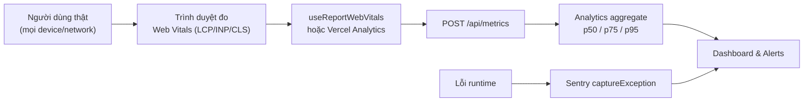
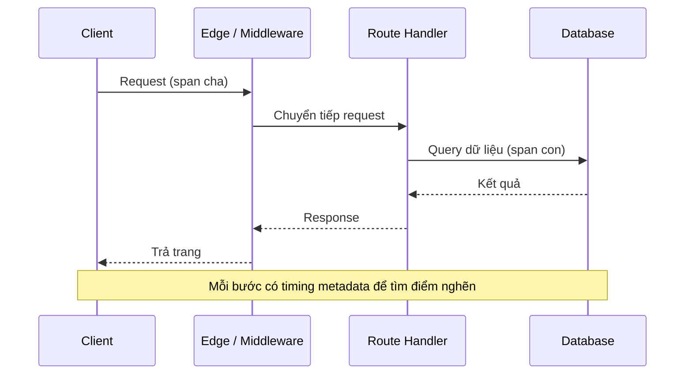

# Monitoring và Observability

**Monitoring** (giám sát) là việc theo dõi tình trạng hoạt động và hiệu năng của ứng dụng khi nó đang chạy thực tế. **Observability** (khả năng quan sát) đi xa hơn, giúp bạn hiểu được vì sao ứng dụng hoạt động như vậy thông qua số liệu, log và dấu vết (trace). Với người mới, đây là cách phát hiện sớm lỗi và điểm chậm trên môi trường người dùng thật thay vì chỉ đoán mò.

---

## Mục lục

- [Vì sao cần monitoring?](#vì-sao-cần-monitoring)
- [Web Vitals](#web-vitals)
- [Next.js Analytics](#nextjs-analytics)
- [Instrumentation](#instrumentation)
- [OpenTelemetry](#opentelemetry)
- [Error tracking](#error-tracking)

---

## Vì sao cần monitoring?

**Vấn đề:**

```tsx
// "Trên máy mình chạy nhanh mà!" — máy dev: Mac M-series, mạng cáp quang.
// Người dùng thật: iPhone 8, 3G, ở vùng xa server → trải nghiệm khác hẳn.
//
// Lỗi production xảy ra âm thầm:
try {
  await checkout();
} catch (err) {
  // Không log, không báo → tới khi khách phàn nàn mới biết, đã mất đơn.
}
//
// Tối ưu mò: sửa lung tung mà không có số liệu → không biết có cải thiện thật không.
```

Đo trên máy dev (lab data) không đại diện cho người dùng thật. Lỗi production không tự lộ ra, và nếu không đo thì không biết phải tối ưu cái gì.

**Giải pháp:**

```tsx
// Đo Core Web Vitals từ NGƯỜI DÙNG THẬT (field data)
"use client";
import { useReportWebVitals } from "next/web-vitals";

export function WebVitals() {
  useReportWebVitals((metric) => {
    // Gửi LCP / CLS / INP thực địa về analytics
    fetch("/api/metrics", { method: "POST", body: JSON.stringify(metric) });
  });
  return null;
}

// Theo dõi lỗi production tự động (Sentry)
import * as Sentry from "@sentry/nextjs";

try {
  await checkout();
} catch (err) {
  Sentry.captureException(err, { tags: { feature: "checkout" } });
  throw err;
}

// Tracing để tìm bước chậm trong toàn hệ thống (OpenTelemetry)
import { registerOTel } from "@vercel/otel";
registerOTel({ serviceName: "my-app" });
```

Monitoring và observability biến phỏng đoán thành **số liệu thật**: đo Web Vitals từ người dùng (`useReportWebVitals`, Vercel Analytics), theo dõi lỗi (Sentry), tracing (OpenTelemetry) và log có cấu trúc. Mọi quyết định tối ưu đều dựa trên dữ liệu đo được, không đoán mò.

Sơ đồ dưới đây mô tả luồng thu thập số liệu thực địa (field data) từ người dùng thật về dashboard và cảnh báo:



:::tip[Dùng thực tế]

- **Thu thập Web Vitals thực địa**: dùng `useReportWebVitals` hoặc Vercel Analytics để xem LCP/CLS/INP p75 của người dùng thật, không chỉ điểm Lighthouse trên CI.
- **Cảnh báo khi lỗi tăng**: Sentry gửi alert khi 5xx error rate vượt ngưỡng, biết ngay thay vì chờ khách phàn nàn.
- **Theo dõi API chậm**: trace span của OpenTelemetry chỉ ra route handler hay DB query nào đang là điểm nghẽn.
- **Đo tác động sau mỗi lần tối ưu**: so p75 Web Vitals trước/sau khi sửa để xác nhận thay đổi thực sự giúp người dùng nhanh hơn.

:::

---

## Web Vitals

Next.js report Web Vitals tự động qua hook:

```tsx
// app/layout.tsx hoặc client component
"use client";

import { useReportWebVitals } from "next/web-vitals";

export function WebVitals() {
  useReportWebVitals((metric) => {
    console.log(metric);
    // Gửi tới analytics:
    // gtag("event", metric.name, { value: metric.value });
    // fetch("/api/metrics", { method: "POST", body: JSON.stringify(metric) });
  });

  return null;
}
```

Metric:

- **LCP** (Largest Contentful Paint) — < 2.5s.
- **INP** (Interaction to Next Paint) — < 200ms.
- **CLS** (Cumulative Layout Shift) — < 0.1.
- **FCP** (First Contentful Paint).
- **TTFB** (Time to First Byte).

---

## Next.js Analytics

**Vercel Analytics** — built-in cho deployment Vercel:

```bash
npm install @vercel/analytics
```

```tsx
// app/layout.tsx
import { Analytics } from "@vercel/analytics/next";

export default function RootLayout({ children }) {
  return (
    <html>
      <body>
        {children}
        <Analytics />
      </body>
    </html>
  );
}
```

Tự động track:

- Page view.
- Web Vitals real users.
- Custom event (`track("event-name", { ... })`).

**Speed Insights** — đo performance real:

```bash
npm install @vercel/speed-insights
```

```tsx
import { SpeedInsights } from "@vercel/speed-insights/next";

<body>
  {children}
  <SpeedInsights />
</body>
```

:::info[Phân tích]

**Field Data vs Lab Data**:

- **Lab** (Lighthouse, PageSpeed): test trên CI, simulated network.
- **Field** (Vercel Analytics, RUM): user thật, mọi device/network.

Field Data quan trọng hơn vì:

- User thật trên iPhone 8 + 3G chậm hơn nhiều CI.
- Phản ánh **trải nghiệm thực**.
- Geographic distribution.

Vercel Analytics aggregate Field Data → dashboard với p50, p75, p95.

Alternative:

- **Google Search Console** — Core Web Vitals report.
- **CrUX (Chrome User Experience Report)** — public dataset.
- **Sentry Performance** — kết hợp error + perf.
- **Datadog RUM** — enterprise.

:::

---

## Instrumentation

Next.js có `instrumentation.ts` cho **setup observability**:

```ts
// instrumentation.ts (root project)
export async function register() {
  if (process.env.NEXT_RUNTIME === "nodejs") {
    await import("./instrumentation.node");
  }
}
```

```ts
// instrumentation.node.ts
import { registerOTel } from "@vercel/otel";

registerOTel({
  serviceName: "my-app",
});
```

Chạy 1 lần khi server start. Use case:

- Setup OpenTelemetry.
- Init Sentry.
- Init monitoring agent.
- Log app start.

---

## OpenTelemetry

Standard observability framework. Next.js có integration sẵn:

```bash
npm install @vercel/otel
```

```ts
// instrumentation.ts
import { registerOTel } from "@vercel/otel";

export function register() {
  registerOTel({
    serviceName: "my-app",
    traceExporter: "auto", // hoặc custom
  });
}
```

Tự động trace:

- HTTP request.
- Route handler invocation.
- `fetch()` outgoing.
- DB query (nếu instrument).

Export ra:

- **Vercel** Observability Plus.
- **Honeycomb**, **Datadog**, **New Relic**, **Sentry**.
- **Jaeger** self-hosted.

:::tip[Mẹo]

**Custom trace span**:

```ts
import { trace } from "@opentelemetry/api";

async function processOrder(orderId: string) {
  const tracer = trace.getTracer("my-app");

  return tracer.startActiveSpan("processOrder", async (span) => {
    span.setAttribute("order.id", orderId);

    try {
      const order = await db.order.findUnique({ where: { id: orderId } });
      span.setAttribute("order.total", order.total);
      // ...
      return order;
    } catch (err) {
      span.recordException(err);
      throw err;
    } finally {
      span.end();
    }
  });
}
```

Trace cho phép debug **distributed system** — request đi qua client →
edge → API → DB, mỗi step có timing và metadata.



:::

---

## Error tracking

**Sentry** (phổ biến nhất):

```bash
npm install @sentry/nextjs
npx @sentry/wizard@latest -i nextjs
```

Auto setup:

- `sentry.client.config.ts`.
- `sentry.server.config.ts`.
- `sentry.edge.config.ts`.
- Source map upload.

```ts
// sentry.client.config.ts
import * as Sentry from "@sentry/nextjs";

Sentry.init({
  dsn: process.env.NEXT_PUBLIC_SENTRY_DSN,
  tracesSampleRate: 1.0, // 100% trace, giảm cho production
  replaysSessionSampleRate: 0.1,
  replaysOnErrorSampleRate: 1.0,
  integrations: [
    Sentry.replayIntegration(),
  ],
});
```

Sentry tự bắt:

- Unhandled exception.
- Promise rejection.
- React render error.
- Route handler error.

Custom:

```ts
import * as Sentry from "@sentry/nextjs";

try {
  await dangerous();
} catch (err) {
  Sentry.captureException(err, {
    tags: { feature: "checkout" },
    user: { id: userId },
    extra: { orderId },
  });
  throw err;
}
```

Alternative:

- **Bugsnag**.
- **Rollbar**.
- **LogRocket** — Sentry-like + session replay.
- **PostHog** — analytics + error tracking + replay.

:::info[Phân tích]

**Logging strategy 2026**:

```
Local dev → console.log
Production → structured logger → log aggregator
```

**Pino** — fast Node logger:

```ts
import pino from "pino";

const logger = pino({
  level: process.env.LOG_LEVEL ?? "info",
});

logger.info({ userId, action: "login" }, "User logged in");
logger.error({ err, userId }, "Failed to load");
```

Log aggregator:

- **Vercel Logs** — built-in cho Vercel deploy.
- **Axiom** — log + metric, generous free tier.
- **Datadog** — enterprise.
- **Better Stack** (Logtail).

Pattern: log **JSON structured** → query/filter dễ.

:::

:::tip[Mẹo]

**Monitoring checklist Next.js production**:

- [ ] **Vercel Analytics** + **Speed Insights** (nếu deploy Vercel).
- [ ] **Sentry** cho error tracking + source map.
- [ ] **Web Vitals** report tới analytics.
- [ ] **OpenTelemetry** cho distributed trace (nếu microservices).
- [ ] **Structured logging** (Pino + log aggregator).
- [ ] **Alerts** cho:
  - 5xx error rate > 1%.
  - LCP p75 > 4s.
  - Cold start time > 3s.
  - DB connection failure.

Pattern này cover 80% issue trước khi user complain.

:::

:::warning[Cần lưu ý]

**Cost của monitoring**:

- Sentry: per event + replay.
- Datadog: per host + custom metric.
- Logtail: per GB log.

Sampling rate quan trọng — không log/trace 100% production traffic:

```ts
Sentry.init({
  tracesSampleRate: process.env.NODE_ENV === "production" ? 0.1 : 1.0,
  // 10% sample production, 100% dev
});
```

Hoặc dùng **dynamic sampling** — sample cao cho error, thấp cho success:

```ts
tracesSampler: (samplingContext) => {
  if (samplingContext.parentSampled) return 1.0;
  if (samplingContext.transactionContext.op === "http.server") return 0.1;
  return 0.01;
}
```

Cost effective nhưng vẫn detect được issue.

:::
