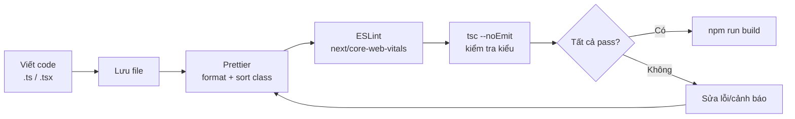

# TypeScript, ESLint, Environment Variables

Bài này giới thiệu các công cụ cấu hình nền tảng cho dự án Next.js: **TypeScript** (ngôn ngữ thêm kiểu dữ liệu cho JavaScript để bắt lỗi sớm), **ESLint** (công cụ kiểm tra và cảnh báo lỗi/phong cách code) và **environment variables** (biến môi trường: giá trị cấu hình như khoá API tách khỏi mã nguồn). Nắm vững những thứ này giúp người mới viết code an toàn, nhất quán và dễ bảo trì hơn.

[](pathname:///img/nextjs/typescript-linting.webp)

---

:::note[Ghi nhớ nhanh]

- ⭐ **`NEXT_PUBLIC_*` được inline vào client bundle tại build time** — đổi giá trị phải rebuild; cần config runtime thì fetch qua API route.
- **TypeScript first-class**: `strict: true`, kiểm tra kiểu bằng `tsc --noEmit` (build cũng chạy type check).
- **ESLint** dùng config `next/core-web-vitals` (bắt lỗi ``, custom font, `<a>` thay `<Link>`).
- **Type-safe env** với Zod hoặc `@t3-oss/env-nextjs` — tách server/client, fail build nếu env thiếu/sai.
- **MDX native** qua `@next/mdx`; site content-heavy dùng thêm Contentlayer/Velite.

:::

---

## Mục lục

- [TypeScript Setup](#typescript-setup)
- [Generated Types](#generated-types)
- [ESLint](#eslint)
- [Prettier](#prettier)
- [Environment Variables](#environment-variables)
- [Markdown / MDX](#markdown--mdx)
- [Câu hỏi phỏng vấn](#câu-hỏi-phỏng-vấn)

---

## TypeScript Setup

Next.js có TypeScript **first-class** — `create-next-app` setup sẵn.

```bash
npx create-next-app@latest --typescript
```

`tsconfig.json` mặc định:

```json
{
  "compilerOptions": {
    "target": "ES2022",
    "lib": ["dom", "dom.iterable", "esnext"],
    "module": "esnext",
    "moduleResolution": "bundler",
    "strict": true,
    "noEmit": true,
    "jsx": "preserve",
    "incremental": true,
    "plugins": [{ "name": "next" }],
    "paths": { "@/*": ["./*"] }
  },
  "include": ["next-env.d.ts", "**/*.ts", "**/*.tsx", ".next/types/**/*.ts"],
  "exclude": ["node_modules"]
}
```

Run type check:

```bash
npx tsc --noEmit
```

`npm run build` cũng chạy type check.

---

## Generated Types

Next.js generate types tự động:

- **`next-env.d.ts`** — global types cho Next.js.
- **`.next/types/`** — type cho page params, route segment.

```tsx
// app/blog/[slug]/page.tsx
import type { Metadata } from "next";

// Type được generate dựa folder structure
type Props = {
  params: Promise<{ slug: string }>;
  searchParams: Promise<{ q?: string }>;
};

export default async function Page({ params, searchParams }: Props) {
  const { slug } = await params;
  const { q } = await searchParams;
  // ...
}
```

:::info[Phân tích]

**TypedRoutes** (experimental) — type-safe link:

```ts
// next.config.ts
export default {
  experimental: {
    typedRoutes: true,
  },
};
```

```tsx
import Link from "next/link";

<Link href="/dashboard" />              // OK
<Link href="/typo-dashboard" />         // Type error
<Link href={`/blog/${slug}`} />         // OK với dynamic route
<Link href="/blog/[slug]" />            // Type error (cần param thật)
```

Tương lai sẽ stable. Pair với TanStack Router → type-safe routing trong
toàn React ecosystem.

:::

---

## ESLint

Next.js đi kèm config:

```bash
npx create-next-app@latest --eslint
```

`eslint.config.mjs` (flat config Next.js 15+):

```js
import { dirname } from "path";
import { fileURLToPath } from "url";
import { FlatCompat } from "@eslint/eslintrc";

const __filename = fileURLToPath(import.meta.url);
const __dirname = dirname(__filename);

const compat = new FlatCompat({ baseDirectory: __dirname });

export default [
  ...compat.extends("next/core-web-vitals", "next/typescript"),
];
```

Rules quan trọng từ `next/core-web-vitals`:

- `@next/next/no-img-element` — dùng `<Image>` thay ``.
- `@next/next/no-page-custom-font` — dùng `next/font`.
- `@next/next/no-html-link-for-pages` — dùng `<Link>`.
- `react-hooks/rules-of-hooks`.
- `react-hooks/exhaustive-deps`.

Run:

```bash
npm run lint
npm run lint -- --fix
```

---

## Prettier

```bash
npm install -D prettier eslint-config-prettier
```

`.prettierrc`:

```json
{
  "semi": true,
  "singleQuote": false,
  "tabWidth": 2,
  "trailingComma": "all",
  "printWidth": 100,
  "plugins": ["prettier-plugin-tailwindcss"]
}
```

`prettier-plugin-tailwindcss` — sort Tailwind class theo recommendation
order tự động.

Ba công cụ Prettier, ESLint và TypeScript ghép thành một pipeline kiểm tra chất lượng: mỗi lần lưu file, code lần lượt được format, lint và kiểm tra kiểu trước khi build:



VS Code setting:

```json
// .vscode/settings.json
{
  "editor.formatOnSave": true,
  "editor.defaultFormatter": "esbenp.prettier-vscode"
}
```

---

## Environment Variables

`.env.local` — local dev (gitignored):

```env
DATABASE_URL=postgresql://localhost:5432/mydb
JWT_SECRET=...
STRIPE_SECRET_KEY=sk_test_...

NEXT_PUBLIC_API_URL=http://localhost:3000/api
NEXT_PUBLIC_GA_ID=G-XXX
```

Priority:

```
.env.production.local
.env.local
.env.production / .env.development
.env
```

`.env.local` **chỉ load local** — không production. `.env.production.local`
cho production secret.

**Type-safe env** (khuyến nghị):

```ts
// env.ts
import { z } from "zod";

const envSchema = z.object({
  DATABASE_URL: z.string().url(),
  JWT_SECRET: z.string().min(32),

  NEXT_PUBLIC_API_URL: z.string().url(),
  NEXT_PUBLIC_GA_ID: z.string().optional(),
});

export const env = envSchema.parse({
  DATABASE_URL: process.env.DATABASE_URL,
  JWT_SECRET: process.env.JWT_SECRET,
  NEXT_PUBLIC_API_URL: process.env.NEXT_PUBLIC_API_URL,
  NEXT_PUBLIC_GA_ID: process.env.NEXT_PUBLIC_GA_ID,
});
```

```ts
import { env } from "@/env";

const db = new Client(env.DATABASE_URL); // type-safe + validated
```

:::info[Phân tích]

**`@t3-oss/env-nextjs`** — package chuyên cho env validation Next.js:

```ts
// env.ts
import { createEnv } from "@t3-oss/env-nextjs";
import { z } from "zod";

export const env = createEnv({
  server: {
    DATABASE_URL: z.string().url(),
    JWT_SECRET: z.string().min(32),
  },
  client: {
    NEXT_PUBLIC_API_URL: z.string().url(),
  },
  runtimeEnv: {
    DATABASE_URL: process.env.DATABASE_URL,
    JWT_SECRET: process.env.JWT_SECRET,
    NEXT_PUBLIC_API_URL: process.env.NEXT_PUBLIC_API_URL,
  },
});
```

Lợi ích:

- **Separation** server/client tường minh.
- **Build-time check** — fail build nếu env thiếu/sai.
- **Type-safe** — autocomplete.
- **Prevent leak** — server env không lộ client.

:::

:::warning[Cần lưu ý]

**`NEXT_PUBLIC_*` được inline vào client bundle tại build time**:

```env
NEXT_PUBLIC_API_URL=https://api.example.com
```

```tsx
// Code
const url = process.env.NEXT_PUBLIC_API_URL;

// Compiled
const url = "https://api.example.com";  // hardcoded
```

→ Đổi env value cần **rebuild**. Không thể đổi runtime.

Nếu cần config runtime cho client → fetch từ API route:

```ts
// app/api/config/route.ts
export async function GET() {
  return Response.json({
    apiUrl: process.env.API_URL,
    features: { newUI: true },
  });
}
```

```tsx
"use client";
const { data: config } = useQuery({
  queryKey: ["config"],
  queryFn: () => fetch("/api/config").then(r => r.json()),
});
```

:::

---

## Markdown / MDX

Next.js hỗ trợ MDX native:

```bash
npm install @next/mdx @mdx-js/loader @mdx-js/react @types/mdx
```

```ts
// next.config.ts
import withMDX from "@next/mdx";

export default withMDX({
  extension: /\.mdx?$/,
  options: {
    remarkPlugins: [],
    rehypePlugins: [],
  },
})({
  pageExtensions: ["ts", "tsx", "js", "jsx", "md", "mdx"],
});
```

```mdx
{/* app/about/page.mdx */}
import { Highlight } from "@/components/Highlight";

# About

This is **MDX** with <Highlight>React components</Highlight>.
```

`page.mdx` → render như `page.tsx`.

**Content-heavy site** thường dùng:

- **next-mdx-remote** — MDX runtime, dùng cho dynamic content (blog từ DB).
- **Contentlayer 2** — content + type-safe.
- **Velite** — successor của Contentlayer.

:::tip[Mẹo]

**Pattern blog site**:

```
content/
└── posts/
    ├── post-1.mdx
    └── post-2.mdx

app/
├── blog/
│   ├── page.tsx              # list posts
│   └── [slug]/page.tsx        # render MDX
└── lib/
    └── posts.ts               # parse MDX, frontmatter
```

```ts
// app/lib/posts.ts
import fs from "node:fs/promises";
import path from "node:path";
import matter from "gray-matter";

export async function getPosts() {
  const dir = path.join(process.cwd(), "content/posts");
  const files = await fs.readdir(dir);

  return Promise.all(files.map(async (file) => {
    const raw = await fs.readFile(path.join(dir, file), "utf-8");
    const { data, content } = matter(raw);
    return {
      slug: file.replace(".mdx", ""),
      title: data.title as string,
      date: data.date as string,
      content,
    };
  }));
}
```

Velite / Contentlayer auto handle phần này + type-safe schema.

:::

---

## Câu hỏi phỏng vấn

Những câu thường gặp về chủ đề này. Tự trả lời trước, rồi bấm **Xem đáp án** để đối chiếu.

**1. `strict: true` trong `tsconfig.json` bật những kiểm tra nào, và vì sao nên bật ngay từ đầu dự án?**

<details className="qa">
<summary>Xem đáp án</summary>

`strict: true` là "công tắc tổng" bật cùng lúc một nhóm cờ kiểm tra nghiêm ngặt, đáng nhớ nhất:

- `noImplicitAny` — tham số/biến không suy luận được kiểu thì báo lỗi thay vì ngầm hiểu là `any`.
- `strictNullChecks` — `null` và `undefined` không còn gán được vào mọi kiểu; đây là cờ giá trị nhất, chặn sớm lỗi kinh điển "cannot read property of undefined".
- `strictFunctionTypes`, `strictBindCallApply` — kiểm tra kiểu tham số hàm và `bind`/`call`/`apply` chặt hơn.
- `strictPropertyInitialization` — property của class phải được khởi tạo.
- `noImplicitThis`, `alwaysStrict`, `useUnknownInCatchVariables` — biến trong `catch` là `unknown` thay vì `any`.

Nên bật ngay từ đầu vì bật muộn trên codebase lớn sẽ sinh ra hàng trăm lỗi cùng lúc, rất khó dọn; trong khi dự án mới thì chi phí gần như bằng 0. `create-next-app` đã đặt sẵn `strict: true` chính vì lý do này.

</details>

**2. `tsc --noEmit` khác gì với type check lúc chạy `next build`? Vì sao vẫn nên chạy riêng bước này trong CI?**

<details className="qa">
<summary>Xem đáp án</summary>

| | `tsc --noEmit` | Type check trong `next build` |
|---|---|---|
| Phạm vi | Toàn bộ file nằm trong `include` của `tsconfig.json` | Gắn với quá trình build của Next.js |
| Output | Chỉ kiểm tra kiểu, không sinh file (`noEmit`) | Build ra `.next/` |
| Tốc độ | Nhanh, chỉ một pass type check | Chậm hơn vì kèm compile, bundle, optimize |
| Có thể tắt | Không | Có — `typescript.ignoreBuildErrors: true` |

Nên chạy riêng trong CI vì:

- **Nhanh và fail sớm**: biết lỗi kiểu sau vài chục giây thay vì chờ build xong.
- **Bao phủ rộng hơn**: file test, script, util không nằm trong graph của bundler vẫn được kiểm tra.
- **Không phụ thuộc cấu hình Next**: nếu ai đó lỡ bật `ignoreBuildErrors`, bước `tsc --noEmit` vẫn giữ được hàng rào.

</details>

**3. `moduleResolution: "bundler"` khác `"node"` ở điểm nào, và khi nào bạn cần đổi?**

<details className="qa">
<summary>Xem đáp án</summary>

- `"node"` (còn gọi `node10`) mô phỏng cách Node.js cũ resolve CommonJS: tìm `index.js`, tự thêm đuôi file, **không hiểu** trường `exports` trong `package.json`.
- `"bundler"` (TypeScript 5.0+) mô phỏng cách các bundler hiện đại (webpack, Turbopack, Vite) hoạt động: **hiểu `exports`/`imports` conditions**, cho phép import không cần ghi đuôi `.js`, và không bắt buộc các quy tắc khắt khe của ESM thuần.

Dùng `"bundler"` khi code luôn đi qua bundler — đúng trường hợp app Next.js, nên đây là mặc định của `create-next-app`. Cần đổi sang `"node16"`/`"nodenext"` khi bạn viết code chạy thẳng bằng Node (script, package publish lên npm) vì lúc đó phải tuân thủ đúng luật ESM/CJS của Node, kể cả việc ghi rõ đuôi file khi import.

</details>

**4. Alias `@/*` khai báo trong `paths` hoạt động thế nào, và cần cấu hình tương ứng ở đâu để Vitest/Jest hiểu được?**

<details className="qa">
<summary>Xem đáp án</summary>

`paths` trong `tsconfig.json` chỉ là **ánh xạ dành cho TypeScript** — giúp editor và `tsc` biết `@/lib/db` thật ra là `./lib/db`. Bản thân nó không đổi được cách runtime hay bundler resolve module; với Next.js, webpack/Turbopack tự đọc `tsconfig.json` nên alias chạy được ngay mà không cần khai thêm.

Test runner thì không tự biết, phải khai lại:

```ts
// vitest.config.ts
import tsconfigPaths from "vite-tsconfig-paths";
export default { plugins: [tsconfigPaths()] };
// hoặc: resolve: { alias: { "@": path.resolve(__dirname, "./") } }
```

```js
// jest.config.js
module.exports = {
  moduleNameMapper: { "^@/(.*)$": "<rootDir>/$1" },
};
```

Nguyên tắc chung: mỗi công cụ tham gia resolve module (TS, bundler, test runner, `ts-node`) đều cần biết alias — hoặc khai lại, hoặc dùng plugin đọc chung từ `tsconfig.json` để tránh lệch cấu hình.

</details>

**5. Trong Next 15, `params` và `searchParams` trở thành `Promise` — vì sao có thay đổi này, và nó ảnh hưởng gì tới cách viết page?**

<details className="qa">
<summary>Xem đáp án</summary>

Next 15 chuyển các API phụ thuộc request (`params`, `searchParams`, và cả `cookies()`, `headers()`) sang dạng **bất đồng bộ**. Lý do: để Next có thể bắt đầu render phần tĩnh của trang **trước khi** biết thông tin request, phục vụ streaming và Partial Prerendering — phần nào không đụng tới request thì prerender sẵn, phần nào cần thì chờ Promise resolve rồi stream xuống sau.

Hệ quả khi viết page: component phải là `async` và `await` trước khi dùng.

```tsx
type Props = {
  params: Promise<{ slug: string }>;
  searchParams: Promise<{ q?: string }>;
};

export default async function Page({ params, searchParams }: Props) {
  const { slug } = await params;
  const { q } = await searchParams;
  return <Article slug={slug} query={q} />;
}
```

Với Client Component không dùng được `await`, đọc bằng hook `React.use(params)`. Đây là breaking change khi nâng cấp từ Next 14, và codemod chính thức của Next hỗ trợ chuyển đổi tự động phần lớn trường hợp.

</details>

**6. `typedRoutes` giải quyết vấn đề gì, và hạn chế hiện tại của nó là gì?**

<details className="qa">
<summary>Xem đáp án</summary>

`typedRoutes` sinh kiểu cho toàn bộ route dựa trên cấu trúc thư mục, biến `href` của `next/link` và các hàm điều hướng từ `string` tự do thành **union các route có thật**. Nhờ vậy lỗi gõ nhầm đường dẫn bị bắt lúc compile thay vì thành 404 lúc chạy, và khi đổi tên folder thì mọi chỗ link hỏng đều hiện đỏ ngay.

```tsx
<Link href="/dashboard" />       // OK
<Link href="/typo-dashboard" />  // Type error
<Link href="/blog/[slug]" />     // Type error — cần param thật
```

Hạn chế:

- Vẫn là tính năng **experimental**, phải bật thủ công trong `next.config` và API có thể đổi.
- Chỉ suy ra được từ cấu trúc file, nên route sinh động ở tầng khác (rewrite, middleware, link ra ngoài) không được bao phủ.
- Chuỗi ghép động phức tạp đôi khi không khớp kiểu, phải ép kiểu thủ công.
- Cần build/dev chạy một lần để sinh type, nên type có thể "trễ" ngay sau khi vừa tạo route mới.

</details>

**7. Flat config (`eslint.config.mjs`) khác `.eslintrc` ở điểm nào, và `FlatCompat` sinh ra để làm gì?**

<details className="qa">
<summary>Xem đáp án</summary>

| | `.eslintrc.*` (legacy) | `eslint.config.mjs` (flat) |
|---|---|---|
| Định dạng | JSON/YAML/JS, cấu hình khai báo | File JS thật, export một **mảng** config object |
| Nạp plugin | Chuỗi tên (`"plugin:x/y"`), ESLint tự resolve | `import` trực tiếp — rõ ràng, dùng được resolution của Node |
| Kế thừa | `extends` + cascade theo thư mục cha | Không cascade; thứ tự trong mảng quyết định, object sau ghi đè object trước |
| Phạm vi file | `overrides` | Trường `files`/`ignores` ngay trong mỗi object |

Flat config dễ suy luận hơn vì bạn thấy rõ cái gì ghi đè cái gì, và không còn "ma thuật" resolve tên plugin. ESLint 9 lấy flat config làm mặc định.

`FlatCompat` là cầu nối: nhiều preset (trong đó có `next/core-web-vitals`) vẫn viết theo định dạng cũ, nên `compat.extends("next/core-web-vitals")` sẽ dịch preset legacy đó sang các object flat config tương đương để dùng trong mảng mới.

</details>

**8. Config `next/core-web-vitals` bổ sung gì so với `next`? Kể vài rule tiêu biểu và lý do chúng tồn tại.**

<details className="qa">
<summary>Xem đáp án</summary>

Config `next` là bộ rule nền của Next.js, chủ yếu ở mức cảnh báo. `next/core-web-vitals` kế thừa nó rồi **siết các rule ảnh hưởng tới Core Web Vitals lên mức error**, để lỗi làm tụt LCP/CLS không bị lọt qua vì lập trình viên bỏ qua warning.

Vài rule tiêu biểu:

- `@next/next/no-img-element` — dùng `<Image>` thay thẻ `` thuần, để có tối ưu kích thước, lazy load và đặt sẵn tỉ lệ khung hình (tránh layout shift → tốt cho CLS).
- `@next/next/no-page-custom-font` — font tuỳ chỉnh phải nạp qua `next/font` để được self-host và preload, tránh render-blocking làm chậm LCP.
- `@next/next/no-html-link-for-pages` — dùng `<Link>` thay `<a>` cho route nội bộ, giữ client-side navigation và prefetch.
- `@next/next/no-sync-scripts` — script đồng bộ chặn parse HTML.

Kèm theo là nhóm rule React cốt lõi: `react-hooks/rules-of-hooks` và `react-hooks/exhaustive-deps`.

</details>

**9. Vì sao cần `eslint-config-prettier` khi dùng đồng thời ESLint và Prettier?**

<details className="qa">
<summary>Xem đáp án</summary>

ESLint vốn có một nhóm rule về **format** (`semi`, `quotes`, `indent`, `comma-dangle`...). Khi Prettier cũng format file theo luật riêng của nó, hai bên dễ đánh nhau: Prettier viết ra một dạng, ESLint lại báo lỗi chính dạng đó — lưu file xong là màn hình đầy gạch đỏ vô nghĩa, và `--fix` có thể chạy qua chạy lại không hội tụ.

`eslint-config-prettier` không thêm rule nào cả — nó chỉ **tắt toàn bộ rule format của ESLint** có khả năng xung đột với Prettier. Cách đặt: để nó ở **cuối** danh sách extends/mảng flat config, vì object sau ghi đè object trước.

Kết quả là phân vai rõ ràng: Prettier lo hình thức, ESLint lo chất lượng logic. Có package `eslint-plugin-prettier` chạy Prettier như một rule ESLint, nhưng cách này làm lint chậm và tạo nhiễu lỗi, nên thường khuyến nghị chạy Prettier riêng.

</details>

**10. Phân chia trách nhiệm giữa TypeScript, ESLint và Prettier: mỗi công cụ bắt loại vấn đề nào, và vì sao không thay thế được nhau?**

<details className="qa">
<summary>Xem đáp án</summary>

| Công cụ | Bắt loại vấn đề gì | Ví dụ |
|---|---|---|
| **TypeScript** | Sai về **kiểu và hợp đồng dữ liệu** | Truyền `string` vào tham số `number`, đọc property không tồn tại, quên xử lý `undefined` |
| **ESLint** | Sai về **cách viết / logic đáng ngờ** mà kiểu vẫn hợp lệ | Thiếu dependency trong `useEffect`, gọi hook trong điều kiện, dùng `` thay `<Image>`, biến khai báo không dùng |
| **Prettier** | Sai về **hình thức trình bày** | Xuống dòng, thụt lề, dấu nháy, dấu phẩy cuối, thứ tự class Tailwind |

Không thay thế nhau vì ba tầng vấn đề hoàn toàn khác nhau: code đúng kiểu vẫn có thể sai logic, và code đúng logic vẫn có thể trình bày lộn xộn. Prettier không hiểu ngữ nghĩa chương trình; ESLint hiểu cú pháp nhưng phần lớn rule không có thông tin kiểu; TypeScript hiểu kiểu nhưng không quan tâm bạn quên dependency array hay xuống dòng ở đâu. Trong pipeline, chúng chạy nối tiếp: format → lint → type check → build.

</details>

**11. Thứ tự ưu tiên nạp các file `.env.*` trong Next.js ra sao, và file nào không bao giờ được load ở production?**

<details className="qa">
<summary>Xem đáp án</summary>

Next.js nạp nhiều file và biến ở file ưu tiên cao **ghi đè** file ưu tiên thấp (biến đã có sẵn trong môi trường hệ thống vẫn thắng tất cả). Với môi trường production, thứ tự từ cao xuống thấp:

```
.env.production.local
.env.local
.env.production
.env
```

Với `next dev` thì `.env.development.local` và `.env.development` đóng vai trò tương ứng.

File **`.env.local` không được load khi `NODE_ENV=test`** — để test chạy trên bộ dữ liệu sạch, không dính giá trị máy cá nhân. Còn ở production, `.env.local` vẫn được đọc nếu file tồn tại trên server; điểm quan trọng là `.env.local` luôn nằm trong `.gitignore` nên thực tế nó không đi kèm lên server — đây là nơi để secret của máy dev, còn secret production nên đặt qua biến môi trường của nền tảng hosting hoặc `.env.production.local`.

</details>

**12. Vì sao biến `NEXT_PUBLIC_*` bị inline vào client bundle tại build time, và hệ quả gì khi cần đổi cấu hình lúc runtime?**

<details className="qa">
<summary>Xem đáp án</summary>

Trình duyệt không có `process.env`. Để code client dùng được biến môi trường, bundler phải **thay thế tĩnh** chuỗi `process.env.NEXT_PUBLIC_X` bằng giá trị literal ngay lúc build:

```tsx
// Code
const url = process.env.NEXT_PUBLIC_API_URL;

// Sau khi build
const url = "https://api.example.com"; // hardcoded trong JS bundle
```

Tiền tố `NEXT_PUBLIC_` là cách khai báo tường minh "biến này được phép công khai", giúp Next biết biến nào được inline và biến nào phải giữ lại phía server.

Hệ quả:

- **Đổi giá trị bắt buộc rebuild** — không thể sửa biến môi trường rồi restart container là xong.
- **Giá trị là public** — bất kỳ ai xem source bundle đều đọc được, nên tuyệt đối không đặt secret ở đây.

Khi cần config đổi được lúc runtime, đưa giá trị xuống client qua một API route (`/api/config`) đọc `process.env` phía server, hoặc truyền từ Server Component xuống làm props.

</details>

**13. Làm sao đảm bảo secret phía server không rò rỉ xuống client? Vai trò của package `server-only` là gì?**

<details className="qa">
<summary>Xem đáp án</summary>

Các lớp phòng thủ:

- **Không đặt tiền tố `NEXT_PUBLIC_`** cho secret — biến không có tiền tố này không bao giờ được inline vào bundle client.
- **Tách file**: gom code chạm secret (query DB, gọi API có key) vào module riêng, chỉ import từ Server Component / Route Handler / Server Action.
- **Không trả secret trong props** truyền từ Server Component xuống Client Component — props bị serialize vào payload RSC và lộ ra trình duyệt.
- **Validate env tách server/client** bằng `@t3-oss/env-nextjs` để không vô tình đọc biến server trong code client.

Package `server-only` là "chuông báo động" ở tầng build: chỉ cần thêm `import "server-only";` đầu file, nếu có bất kỳ Client Component nào (file có `"use client"`) import module đó — dù gián tiếp qua nhiều lớp — **build sẽ fail** với thông báo rõ ràng. Nhờ vậy lỗi rò rỉ bị chặn lúc compile thay vì phát hiện trên production. Package đối xứng `client-only` bảo vệ chiều ngược lại.

</details>

**14. Vì sao nên validate biến môi trường bằng Zod hoặc `@t3-oss/env-nextjs` thay vì đọc thẳng `process.env`?**

<details className="qa">
<summary>Xem đáp án</summary>

Đọc thẳng `process.env` có ba vấn đề:

- Kiểu luôn là `string | undefined`, nên chỗ nào cũng phải `!` hoặc `??`, và TypeScript không giúp gì.
- Thiếu biến thì lỗi chỉ lộ ra **lúc runtime**, thường là ở request đầu tiên trên production, với thông báo mơ hồ kiểu "connection string undefined".
- Gõ sai tên biến (`DATBASE_URL`) không ai phát hiện.

Validate bằng schema đảo ngược tất cả:

```ts
const envSchema = z.object({
  DATABASE_URL: z.string().url(),
  JWT_SECRET: z.string().min(32),
});
export const env = envSchema.parse(process.env);
```

- **Fail fast** — thiếu hoặc sai định dạng thì fail ngay lúc khởi động/build, kèm thông báo chỉ đúng biến nào sai.
- **Type-safe + autocomplete** — `env.DATABASE_URL` là `string`, không phải `string | undefined`.
- Ép được cả ràng buộc giá trị (`.url()`, `.min(32)`, enum cho `NODE_ENV`).

`@t3-oss/env-nextjs` bọc thêm phần đặc thù Next: khai báo tách `server` và `client`, chặn việc đọc biến server từ code client.

</details>

**15. Khi self-host bằng Docker và muốn dùng chung một image cho nhiều môi trường, bạn xử lý biến cấu hình phía client thế nào?**

<details className="qa">
<summary>Xem đáp án</summary>

Mâu thuẫn nằm ở chỗ `NEXT_PUBLIC_*` được inline lúc build, nên một image build với `NEXT_PUBLIC_API_URL` của staging sẽ mãi trỏ về staging — trái với nguyên tắc "build once, deploy anywhere".

Cách xử lý:

- **Đưa config xuống client lúc runtime**: tạo một Route Handler đọc biến server (không có tiền tố public) và trả JSON, client fetch khi khởi động.

  ```ts
  // app/api/config/route.ts
  export async function GET() {
    return Response.json({ apiUrl: process.env.API_URL });
  }
  ```

- **Đọc ở Server Component rồi truyền xuống làm props** — không cần thêm round-trip, phù hợp với giá trị không nhạy cảm.
- **Gọi API qua đường tương đối** (`/api/...`) và để Next/reverse proxy rewrite sang backend tương ứng từng môi trường — thường là cách gọn nhất, bỏ luôn nhu cầu biết URL tuyệt đối.

Nếu vẫn muốn inline, lựa chọn còn lại là build riêng image cho từng môi trường và chấp nhận mất tính "một image dùng chung".

</details>

**16. `ignoreBuildErrors` và `ignoreDuringBuilds` trong `next.config` — khi nào chấp nhận bật, và rủi ro đi kèm là gì?**

<details className="qa">
<summary>Xem đáp án</summary>

Hai cờ này tắt hàng rào chất lượng trong `next build`:

```ts
// next.config.ts
export default {
  typescript: { ignoreBuildErrors: true }, // bỏ qua lỗi type
  eslint: { ignoreDuringBuilds: true },    // bỏ qua lỗi lint
};
```

Trường hợp chấp nhận được:

- **Đang migrate** một codebase lớn sang TypeScript hoặc nâng cấp major version, lỗi còn tồn đọng nhưng cần deploy được.
- **CI đã chạy `tsc --noEmit` và `eslint` ở bước riêng** — lúc này tắt trong build chỉ để tiết kiệm thời gian, hàng rào vẫn còn nguyên ở chỗ khác.
- Cần hotfix gấp production, và có ticket dọn ngay sau đó.

Rủi ro: bật rồi rất dễ quên tắt, nợ kỹ thuật âm thầm tích lại, và lỗi kiểu thật sự (ví dụ đọc property không tồn tại) sẽ đi thẳng ra production thành lỗi runtime. Nguyên tắc an toàn: nếu bật, phải kèm bước kiểm tra tương đương trong CI và một ticket có hạn để gỡ bỏ.

</details>
