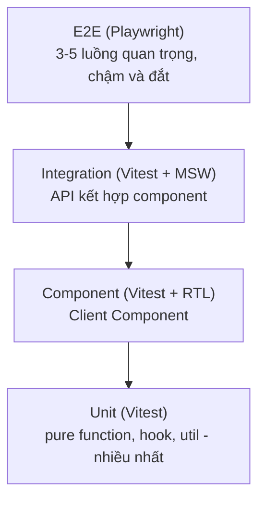

# Testing Next.js App

**Testing** (kiểm thử) là việc viết các đoạn mã tự động để kiểm tra ứng dụng chạy đúng như mong đợi, giúp phát hiện lỗi trước khi đưa lên môi trường thật. Bài này hướng dẫn cách kiểm thử các thành phần đặc trưng của Next.js như Server Component, Client Component và Server Action. Với người mới, thói quen viết test giúp bạn tự tin sửa code mà không lo làm hỏng tính năng cũ.

[](pathname:///img/nextjs/testing.webp)

---

:::note[Ghi nhớ nhanh]

- ⭐ **Server Component async chưa có test util chính thức** — workaround: test business logic riêng, hoặc render bằng `renderToString`.
- **Vitest + React Testing Library** cho unit/component; **Playwright** cho E2E luồng thật (login, checkout).
- **Test Client Component** bằng RTL: render, click, kiểm tra state cập nhật.
- **Test Server Action** gọi thẳng hàm với `FormData` mock, kiểm tra validation và kết quả.
- **MSW** intercept `fetch` ở network layer để mock; theo mô hình testing pyramid (nhiều unit, ít E2E).

:::

---

## Mục lục

- [Vì sao cần test ứng dụng Next?](#vì-sao-cần-test-ứng-dụng-next)
- [Setup Vitest](#setup-vitest)
- [Test Server Component](#test-server-component)
- [Test Client Component](#test-client-component)
- [Test Server Action](#test-server-action)
- [E2E với Playwright](#e2e-với-playwright)
- [Storybook](#storybook)
- [Câu hỏi phỏng vấn](#câu-hỏi-phỏng-vấn)

---

## Vì sao cần test ứng dụng Next?

**Vấn đề:** Một app Next có nhiều tầng đan xen — Server Component, Client Component, Route Handler, Middleware, Server Action. Mỗi tầng chạy ở môi trường khác nhau (server vs browser), nên khi refactor rất dễ vỡ ngầm mà không ai biết.

```tsx
// Đổi getPosts() từ fetch sang đọc DB trực tiếp...
export default async function Page() {
  const posts = await getPosts(); // còn chạy đúng trên server không?
  return <PostList posts={posts} />; // PostList có vỡ khi posts rỗng?
}
// Test tay từng trang vừa chậm vừa sót — lỗi chỉ lộ ra ở production, rất tốn kém.
```

**Giải pháp:** Test tự động đa tầng — unit/integration cho logic và component bằng Vitest + RTL (riêng Server Component async cần workaround như mục dưới), còn E2E bằng Playwright cho luồng thật end-to-end (vì nhiều thứ chỉ đúng khi server chạy thật). Bắt lỗi sớm, tự tin refactor.

```ts
// Logic & component: Vitest + RTL (nhanh, chạy hàng loạt)
const posts = await getPosts();
expect(posts).toHaveLength(1);

// Luồng thật: Playwright (chạy server thật, đúng như người dùng)
await page.goto("/login");
await expect(page).toHaveURL("/dashboard");
```

:::tip[Dùng thực tế]

- Test Client Component bằng RTL: render `<Counter />`, click button, kiểm tra state cập nhật đúng.
- E2E luồng đăng nhập / checkout bằng Playwright: chạy qua server thật từ đầu tới cuối như người dùng.
- Test Route Handler / Server Action: gọi thẳng hàm với input mock, kiểm tra validation và kết quả trả về.
- Chống regression khi nâng cấp Next: chạy lại toàn bộ test sau khi bump version để bắt lỗi vỡ ngầm ngay.

:::

---

## Setup Vitest

```bash
npm install -D vitest @testing-library/react @testing-library/jest-dom jsdom @vitejs/plugin-react
```

`vitest.config.ts`:

```ts
import { defineConfig } from "vitest/config";
import react from "@vitejs/plugin-react";
import path from "path";

export default defineConfig({
  plugins: [react()],
  test: {
    environment: "jsdom",
    globals: true,
    setupFiles: ["./test/setup.ts"],
  },
  resolve: {
    alias: { "@": path.resolve(__dirname, "./") },
  },
});
```

```ts
// test/setup.ts
import "@testing-library/jest-dom/vitest";
```

```json
// package.json
{
  "scripts": {
    "test": "vitest",
    "test:run": "vitest run",
    "test:ui": "vitest --ui"
  }
}
```

---

## Test Server Component

Server Component **async** — chưa có official test util từ React. Workaround:

**Cách 1 — Test logic riêng**:

```ts
// app/posts/page.tsx
export default async function Page() {
  const posts = await getPosts();
  return <PostList posts={posts} />;
}
```

```ts
// posts.test.ts
import { describe, it, expect, vi } from "vitest";
import { getPosts } from "@/lib/posts";

vi.mock("@/lib/db", () => ({
  db: {
    post: {
      findMany: vi.fn().mockResolvedValue([{ id: 1, title: "Hi" }]),
    },
  },
}));

describe("getPosts", () => {
  it("trả danh sách posts", async () => {
    const posts = await getPosts();
    expect(posts).toHaveLength(1);
  });
});
```

→ Test **business logic** thay vì render Server Component.

**Cách 2 — Render bằng `renderToString`** (experimental):

```ts
import { renderToString } from "react-dom/server";

const html = renderToString(await Page());
expect(html).toContain("Hi");
```

Workaround vì test framework hiện chưa support async component natively.

---

## Test Client Component

Standard React Testing Library:

```tsx
// Counter.tsx
"use client";

import { useState } from "react";

export function Counter() {
  const [count, setCount] = useState(0);
  return (
    <div>
      <p>Count: {count}</p>
      <button onClick={() => setCount(c => c + 1)}>+</button>
    </div>
  );
}
```

```ts
// Counter.test.tsx
import { describe, it, expect } from "vitest";
import { render, screen } from "@testing-library/react";
import userEvent from "@testing-library/user-event";
import { Counter } from "./Counter";

describe("Counter", () => {
  it("increment khi click", async () => {
    const user = userEvent.setup();
    render(<Counter />);

    expect(screen.getByText("Count: 0")).toBeInTheDocument();
    await user.click(screen.getByRole("button"));
    expect(screen.getByText("Count: 1")).toBeInTheDocument();
  });
});
```

---

## Test Server Action

Test function trực tiếp:

```ts
// app/actions.ts
"use server";

export async function createPost(formData: FormData) {
  const title = formData.get("title");
  if (!title) throw new Error("Title required");
  return db.post.create({ data: { title: title as string } });
}
```

```ts
// actions.test.ts
import { describe, it, expect, vi } from "vitest";
import { createPost } from "./actions";

vi.mock("@/lib/db", () => ({
  db: { post: { create: vi.fn() } },
}));

describe("createPost", () => {
  it("throw khi thiếu title", async () => {
    const formData = new FormData();
    await expect(createPost(formData)).rejects.toThrow("Title required");
  });

  it("tạo post khi có title", async () => {
    const formData = new FormData();
    formData.append("title", "Hello");
    await createPost(formData);
    expect(db.post.create).toHaveBeenCalledWith({ data: { title: "Hello" } });
  });
});
```

---

## E2E với Playwright

```bash
npm init playwright@latest
```

Auto setup config + sample tests.

```ts
// tests/auth.spec.ts
import { test, expect } from "@playwright/test";

test("login flow", async ({ page }) => {
  await page.goto("/login");

  await page.getByLabel("Email").fill("user@example.com");
  await page.getByLabel("Password").fill("password");
  await page.getByRole("button", { name: "Sign in" }).click();

  await expect(page).toHaveURL("/dashboard");
  await expect(page.getByText("Welcome back")).toBeVisible();
});
```

Run:

```bash
npx playwright test
npx playwright test --ui   # UI mode
npx playwright codegen      # record interaction
```

:::info[Phân tích]

**Playwright vs Cypress**:

| | Playwright | Cypress |
|--|-----------|---------|
| Vendor | Microsoft | Cypress.io |
| Multi-browser | **Chromium, Firefox, WebKit** | Chrome, Firefox, Edge |
| Parallel | Native | Cần Cypress Cloud |
| Speed | **Nhanh hơn** | Chậm hơn |
| Network mocking | Native | Native |
| Debugging | Trace viewer (cực mạnh) | Time travel |
| Mobile testing | Emulation | Emulation |
| Adoption 2026 | **Tăng** | Giảm |

Playwright được khuyến nghị hơn 2024+ — performance, multi-browser, tooling.

:::

---

## Storybook

Develop + test component **isolated**:

```bash
npx storybook@latest init
```

```tsx
// Button.stories.tsx
import type { Meta, StoryObj } from "@storybook/nextjs";
import { Button } from "./Button";

const meta = {
  component: Button,
} satisfies Meta<typeof Button>;

export default meta;
type Story = StoryObj<typeof meta>;

export const Primary: Story = {
  args: { variant: "primary", children: "Save" },
};

export const Disabled: Story = {
  args: { disabled: true, children: "Disabled" },
};
```

Run:

```bash
npm run storybook
```

Lợi ích:

- Develop component không cần render trong app context.
- Document API tự động từ TypeScript.
- Visual regression test (Chromatic).
- Stakeholder review UI without dev environment.

:::tip[Mẹo]

**Testing strategy cho Next.js project:**

Các tầng test xếp thành kim tự tháp: nhiều unit test ở đáy (nhanh, rẻ), thu hẹp dần lên tới vài luồng E2E ở đỉnh (chậm, đắt):



| Layer | Tool | Mục tiêu |
|-------|------|----------|
| **Unit** | Vitest | Pure function, hook, util |
| **Component** | Vitest + RTL | Client Component logic |
| **Integration** | Vitest + MSW | API + component combined |
| **E2E** | Playwright | Critical user flow |
| **Visual** | Storybook + Chromatic | UI regression |

**Coverage target**:

- Utils: 90%+ (pure, dễ test).
- Components: 70%+ (UI, optional).
- API routes: 80%+ (logic, validation).
- E2E: 3-5 critical flow (login, checkout, signup).

Đừng cố 100% — diminishing return sau 80%. Focus test:

- Logic có **branch nhiều**.
- Code đã có bug (regression).
- Business critical (payment, auth).

:::

:::warning[Cần lưu ý]

**Server Component testing đang còn evolve**:

- React team working on official test utility.
- Workaround tạm: test logic riêng, render bằng `renderToString`.
- E2E (Playwright) thực sự test page Server Component → chạy thật.

Đợi feature stable. Hiện tại E2E + unit test cho logic riêng là pattern
phổ biến.

Lib alternative đang phát triển:

- `next/experimental/testing` — official Next.js test utility (đang work).
- `vitest-environment-nextjs` — community.

:::

:::info[Phân tích]

**Mock với MSW** (Mock Service Worker) cho test:

```bash
npm install -D msw
```

```ts
// test/mocks/handlers.ts
import { http, HttpResponse } from "msw";

export const handlers = [
  http.get("/api/users", () => {
    return HttpResponse.json([{ id: 1, name: "An" }]);
  }),
];
```

```ts
// test/setup.ts
import { setupServer } from "msw/node";
import { handlers } from "./mocks/handlers";

const server = setupServer(...handlers);

beforeAll(() => server.listen());
afterEach(() => server.resetHandlers());
afterAll(() => server.close());
```

MSW intercept `fetch` ở network layer → component test mà không touch
network thật. Compat cả unit test + E2E.

:::

---

## Câu hỏi phỏng vấn

Những câu thường gặp về chủ đề này. Tự trả lời trước, rồi bấm **Xem đáp án** để đối chiếu.

**1. Testing pyramid trong một dự án Next gồm những tầng nào, và tỷ lệ giữa các tầng nên ra sao?**

<details className="qa">
<summary>Xem đáp án</summary>

Từ đáy lên đỉnh:

| Tầng | Tool | Mục tiêu |
|---|---|---|
| **Unit** | Vitest | Pure function, hook, util — nhiều nhất |
| **Component** | Vitest + RTL | Logic của Client Component |
| **Integration** | Vitest + MSW | Component ghép với tầng API |
| **E2E** | Playwright | Luồng người dùng quan trọng |
| **Visual** | Storybook + Chromatic | Regression giao diện |

Tỷ lệ: đáy rộng, đỉnh hẹp. Unit test chiếm phần lớn vì chạy trong mili-giây, viết nhanh, chỉ rõ chỗ hỏng; càng lên cao test càng chậm, đắt và dễ flaky nên số lượng giảm dần. Ở tầng E2E thường chỉ giữ **3–5 luồng critical** (đăng nhập, thanh toán, đăng ký).

Lý do giữ hình kim tự tháp: nếu đảo ngược thành "ice cream cone" (ít unit, nhiều E2E), bộ test sẽ chạy hàng chục phút, hỏng vặt liên tục và không ai chỉ ra được lỗi nằm ở đâu.

</details>

**2. Unit test, integration test và E2E test khác nhau thế nào về chi phí, tốc độ và độ tin cậy?**

<details className="qa">
<summary>Xem đáp án</summary>

| Tiêu chí | Unit | Integration | E2E |
|---|---|---|---|
| Phạm vi | Một hàm/component, mọi thứ khác mock | Vài module ghép với nhau, mock ở biên (network, DB) | Toàn hệ thống chạy thật qua trình duyệt |
| Tốc độ | Mili-giây | Vài trăm ms tới vài giây | Vài giây tới vài phút mỗi test |
| Chi phí viết & bảo trì | Thấp | Trung bình | Cao — cần seed data, môi trường, xử lý flaky |
| Khả năng định vị lỗi | Rất tốt — chỉ đúng hàm sai | Khá | Kém — chỉ biết "luồng checkout hỏng" |
| Độ tin cậy về hành vi thật | Thấp (mock nhiều, có thể mock sai thực tế) | Trung bình | Cao nhất — đúng cái người dùng trải nghiệm |
| Ổn định (ít flaky) | Cao | Khá | Thấp nhất |

Nghịch lý cốt lõi: test càng giống thực tế thì càng đáng tin nhưng càng chậm và dễ vỡ. Vì vậy chiến lược là dùng unit test làm lưới dày bắt logic, và dành E2E cho vài luồng mà "sai là mất tiền".

</details>

**3. Vì sao React Testing Library khuyến khích query theo role/label thay vì theo class hay cấu trúc DOM?**

<details className="qa">
<summary>Xem đáp án</summary>

Triết lý của RTL: *"test giống cách người dùng sử dụng phần mềm"*. Người dùng không biết `div.btn-primary--large` là gì; họ thấy "một nút ghi Sign in".

- **Bền vững khi refactor**: đổi class Tailwind, bọc thêm một lớp `div`, hay chuyển sang CSS Module đều không làm test vỡ — vì hành vi không đổi. Query theo class/cấu trúc DOM thì vỡ ngay dù giao diện vẫn đúng.
- **Ép code accessible**: muốn `getByRole("button", { name: "Sign in" })` chạy được thì phải có thẻ semantic và nhãn đúng. Test vô tình trở thành kiểm tra a11y.
- **Test đúng thứ đáng test**: khẳng định "có nút Sign in và bấm được" có giá trị, còn "phần tử này có class `.btn`" thì không.

Thứ tự ưu tiên khuyến nghị: `getByRole` → `getByLabelText` → `getByPlaceholderText` → `getByText` → cuối cùng mới `getByTestId` khi không còn cách nào khác.

</details>

**4. Vì sao Jest/Vitest chưa test được async Server Component? Lỗi thường gặp là gì và cách xử lý tạm thời ra sao?**

<details className="qa">
<summary>Xem đáp án</summary>

Server Component có thể là hàm `async` trả về Promise. React Testing Library và `react-dom/test-utils` được thiết kế cho model render đồng bộ phía client, nên khi gặp component trả Promise chúng không biết chờ — React báo lỗi kiểu *"Objects are not valid as a React child (found: [object Promise])"* hoặc *"async/await is not yet supported in Client Components"*. Thêm nữa, Server Component thường đụng vào `fs`, DB, `cookies()` — những thứ không tồn tại trong môi trường `jsdom`.

Hai workaround trong bài:

- **Tách business logic ra hàm riêng rồi test hàm đó**, mock tầng DB:

  ```ts
  vi.mock("@/lib/db", () => ({
    db: { post: { findMany: vi.fn().mockResolvedValue([{ id: 1, title: "Hi" }]) } },
  }));
  const posts = await getPosts();
  expect(posts).toHaveLength(1);
  ```

- **Gọi component rồi render chuỗi HTML** (experimental): `renderToString(await Page())` rồi kiểm tra nội dung.

Về dài hạn, React và Next đang làm test utility chính thức (`next/experimental/testing`); hiện tại pattern phổ biến là unit test cho logic + E2E cho phần render.

</details>

**5. Trong thực tế bạn test Server Component bằng cách nào — tách business logic ra hay dựa vào E2E? Vì sao?**

<details className="qa">
<summary>Xem đáp án</summary>

Kết hợp cả hai, mỗi cách trả lời một câu hỏi khác nhau:

- **Tách business logic** (`getPosts`, `formatPrice`, hàm truy vấn DB) ra khỏi component rồi unit test — nhanh, rẻ, bao phủ được nhiều nhánh: dữ liệu rỗng, lỗi DB, phân trang, quyền truy cập. Phần lớn rủi ro thật nằm ở đây, và cách này không vướng hạn chế của test util.
- **Dựa vào E2E (Playwright)** cho phần "component có render ra đúng không" — vì Playwright chạy server Next thật, nên Server Component, streaming, `cookies()`, caching đều hoạt động đúng như production. Đây là cách duy nhất hiện nay kiểm tra được toàn bộ pipeline render server.

Ưu tiên thực dụng: component giữ mỏng (chỉ gọi hàm và ghép JSX), logic đẩy hết xuống tầng `lib/` để unit test; sau đó vài E2E phủ các trang quan trọng. Tránh đầu tư nhiều vào `renderToString` vì nó là workaround dễ vỡ khi React/Next thay đổi.

</details>

**6. Test một Server Action cần chuẩn bị những gì (dựng `FormData`, mock tầng DB, kiểm tra validation)?**

<details className="qa">
<summary>Xem đáp án</summary>

Server Action bản chất chỉ là một hàm async, nên test bằng cách **gọi thẳng nó** — không cần dựng request hay server:

```ts
vi.mock("@/lib/db", () => ({ db: { post: { create: vi.fn() } } }));

it("throw khi thiếu title", async () => {
  const formData = new FormData();
  await expect(createPost(formData)).rejects.toThrow("Title required");
});

it("tạo post khi có title", async () => {
  const formData = new FormData();
  formData.append("title", "Hello");
  await createPost(formData);
  expect(db.post.create).toHaveBeenCalledWith({ data: { title: "Hello" } });
});
```

Cần chuẩn bị:

- **Input thật**: dựng `FormData` bằng `append`, vì action nhận `FormData` chứ không phải object.
- **Mock tầng dữ liệu** (`vi.mock` module DB) để test không đụng DB thật và kiểm tra được hàm nào được gọi với tham số nào.
- **Ca validation**: thiếu trường, sai định dạng, vượt giới hạn — kiểm tra action ném lỗi hoặc trả về object lỗi đúng như thiết kế.
- **Mock các side effect khác** nếu action gọi `revalidatePath`, `redirect`, hoặc đọc session.

</details>

**7. Làm sao test một Route Handler (`app/api/.../route.ts`) mà không phải chạy server thật?**

<details className="qa">
<summary>Xem đáp án</summary>

Route Handler cũng chỉ là hàm export nhận `Request` và trả `Response` — hai đối tượng thuộc Web API chuẩn, có sẵn trong Node 18+ và trong môi trường test. Vì vậy gọi trực tiếp là đủ:

```ts
import { POST } from "@/app/api/posts/route";

it("trả 400 khi thiếu title", async () => {
  const req = new Request("http://localhost/api/posts", {
    method: "POST",
    body: JSON.stringify({}),
    headers: { "Content-Type": "application/json" },
  });
  const res = await POST(req);
  expect(res.status).toBe(400);
  expect(await res.json()).toMatchObject({ error: expect.any(String) });
});
```

Lưu ý:

- Chạy ở `environment: "node"` thay vì `jsdom` cho các file test API — gần với runtime thật hơn.
- Route động cần truyền tham số thứ hai chứa `params` (trong Next 15 là Promise).
- Mock tầng DB và các API bên ngoài; nếu handler gọi `cookies()`/`headers()` thì phải mock `next/headers`.
- Kiểm tra cả status code, body và header quan trọng (ví dụ `Cache-Control`).

</details>

**8. `MSW` chặn request ở tầng nào, và ưu điểm so với việc mock trực tiếp module gọi API là gì?**

<details className="qa">
<summary>Xem đáp án</summary>

MSW (Mock Service Worker) chặn ở **tầng network** — trong Node nó patch cơ chế request của runtime qua `setupServer`, còn trong trình duyệt nó dùng Service Worker. Code ứng dụng vẫn gọi `fetch` bình thường và hoàn toàn không biết mình đang bị mock.

```ts
export const handlers = [
  http.get("/api/users", () => HttpResponse.json([{ id: 1, name: "An" }])),
];
```

Ưu điểm so với `vi.mock` module gọi API:

- **Không sửa code để test được**: không cần inject client, không cần biết module nào gọi API.
- **Test đúng thứ cần test**: bạn khẳng định "khi server trả dữ liệu này thì UI hiển thị thế kia", thay vì khẳng định "hàm `getUsers` được gọi".
- **Bền khi refactor**: đổi từ `axios` sang `fetch`, gộp/tách hàm service — handler vẫn chạy.
- **Dùng lại được** cho unit test, integration test, Storybook và cả dev mode khi backend chưa xong.
- **Mô phỏng được ca khó**: lỗi 500, timeout, trả về dữ liệu rỗng.

</details>

**9. So sánh Playwright và Cypress về kiến trúc, hỗ trợ đa trình duyệt, chạy song song và công cụ debug.**

<details className="qa">
<summary>Xem đáp án</summary>

| | Playwright | Cypress |
|---|---|---|
| Vendor | Microsoft | Cypress.io |
| Kiến trúc | Test chạy ở Node, điều khiển trình duyệt qua giao thức ngoài tiến trình | Test chạy **bên trong** trình duyệt, cùng vòng đời với ứng dụng |
| Đa trình duyệt | Chromium, Firefox, **WebKit** (Safari engine) | Chrome, Firefox, Edge — không có WebKit thật |
| Chạy song song | Native, nhiều worker ngay trong CLI | Cần Cypress Cloud để orchestrate |
| Tốc độ | Nhanh hơn | Chậm hơn |
| Debug | Trace viewer (timeline, snapshot DOM, network), UI mode, `codegen` | Time travel trong test runner |
| Đa tab / đa origin / nhiều user | Hỗ trợ tự nhiên nhờ chạy ngoài trình duyệt | Vướng do kiến trúc in-browser |

Điểm mấu chốt là kiến trúc: vì Cypress chạy trong trình duyệt nên nó bị ràng buộc bởi chính sách same-origin và khó xử lý nhiều tab/context; Playwright đứng ngoài nên thoải mái hơn. Bài này khuyến nghị Playwright cho dự án mới nhờ tốc độ, đa trình duyệt và tooling debug.

</details>

**10. Playwright xử lý auto-waiting ra sao, và vì sao nên tránh `waitForTimeout` cố định?**

<details className="qa">
<summary>Xem đáp án</summary>

Trước mỗi hành động, Playwright tự chạy một loạt **actionability check** trên phần tử và lặp lại cho tới khi đạt hoặc hết timeout: phần tử đã gắn vào DOM, hiển thị, ổn định (không còn animation), nhận được sự kiện (không bị phần tử khác che), và enabled. Tương tự, các assertion dạng `await expect(...).toBeVisible()` sẽ **retry** cho tới khi đúng.

```ts
await page.getByRole("button", { name: "Sign in" }).click(); // tự chờ nút sẵn sàng
await expect(page).toHaveURL("/dashboard");                   // tự retry
```

Vì sao tránh `waitForTimeout` cố định:

- **Chậm một cách vô ích**: `waitForTimeout(3000)` luôn tốn đủ 3 giây kể cả khi trang sẵn sàng sau 100ms; nhân lên hàng trăm test là hàng chục phút CI.
- **Vẫn flaky**: máy CI chậm hơn máy dev, 3 giây có ngày không đủ — test hỏng ngẫu nhiên.
- **Che giấu vấn đề thật**: nó không mô tả điều kiện bạn đang chờ, nên khi hỏng không ai biết vì sao.

Thay bằng chờ có điều kiện: assertion tự retry, `waitForURL`, `waitForResponse`, hoặc chờ một phần tử/trạng thái cụ thể xuất hiện.

</details>

**11. Bạn xử lý test flaky thế nào — nguyên nhân thường gặp và chiến lược khắc phục là gì?**

<details className="qa">
<summary>Xem đáp án</summary>

Nguyên nhân thường gặp:

- **Chờ theo thời gian cố định** thay vì chờ điều kiện.
- **Test phụ thuộc lẫn nhau** hoặc dùng chung dữ liệu — chạy song song hoặc đổi thứ tự là vỡ.
- **Dữ liệu không xác định**: `Date.now()`, `Math.random()`, timezone, locale, dữ liệu tồn dư từ lần chạy trước.
- **Race condition thật trong ứng dụng** — test đang tố cáo một bug có thật.
- **Phụ thuộc mạng/API bên ngoài** không ổn định.
- **Animation, lazy load, virtualized list** khiến phần tử xuất hiện trễ.

Chiến lược:

- Thay mọi `sleep` bằng chờ có điều kiện; dùng assertion tự retry.
- Cô lập dữ liệu mỗi test (xem câu về seed) và không chia sẻ state toàn cục.
- Cố định nguồn không xác định: fake timer, mock ngày giờ, chốt timezone và locale trong config.
- Mock API bên ngoài bằng MSW hoặc route interception.
- **Đo trước khi đoán**: bật retry để thu trace/video, xem trace viewer tìm nguyên nhân thật.
- **Quarantine** test flaky (đánh dấu và tách ra) thay vì để nó làm hỏng niềm tin vào cả bộ test, nhưng phải có hạn sửa — retry chỉ là băng dán, không phải cách chữa.

</details>

**12. Chiến lược seed và dọn dữ liệu ra sao để các test E2E chạy song song vẫn độc lập với nhau?**

<details className="qa">
<summary>Xem đáp án</summary>

Nguyên tắc: mỗi test phải tự chuẩn bị điều kiện của mình và không giả định trạng thái do test khác để lại.

Các cách thường dùng, từ nhẹ tới nặng:

- **Dữ liệu riêng theo test**: sinh định danh duy nhất (`user-${Date.now()}-${workerIndex}`, hoặc UUID) cho email, tên sản phẩm... Hai worker chạy song song không giẫm chân nhau vì thao tác trên bản ghi khác nhau.
- **Tạo qua API/fixture thay vì qua UI**: dựng dữ liệu bằng lời gọi API trong `beforeEach` nhanh và ổn định hơn nhiều so với click qua giao diện.
- **Dọn theo phạm vi**: xoá đúng những bản ghi test vừa tạo trong `afterEach`, thay vì truncate cả bảng (truncate sẽ phá test đang chạy song song).
- **Cô lập mạnh hơn khi cần**: mỗi worker một schema/database riêng, hoặc chạy DB trong container dựng lại giữa các lần chạy.
- **Transaction rollback** cho test tầng thấp — nhanh nhất, nhưng thường không dùng được cho E2E vì request đi qua tiến trình server riêng.

Điểm quan trọng: dọn dẹp phải chạy cả khi test fail, và bộ test phải chạy được nhiều lần liên tiếp mà không cần reset tay.

</details>

**13. Làm sao để E2E vượt qua bước đăng nhập nhanh mà vẫn an toàn (`storageState`, tái sử dụng session)?**

<details className="qa">
<summary>Xem đáp án</summary>

Đăng nhập qua UI trong mỗi test vừa chậm vừa dễ flaky. Cách chuẩn của Playwright là đăng nhập **một lần**, lưu cookie/localStorage ra file `storageState`, rồi mọi test khác khởi động với trạng thái đã đăng nhập:

```ts
// auth.setup.ts — chạy một lần trước các project khác
await page.goto("/login");
await page.getByLabel("Email").fill(process.env.E2E_USER!);
await page.getByLabel("Password").fill(process.env.E2E_PASS!);
await page.getByRole("button", { name: "Sign in" }).click();
await page.context().storageState({ path: "playwright/.auth/user.json" });
```

Sau đó khai `storageState: "playwright/.auth/user.json"` trong `use` của project chính.

Về an toàn:

- Tài khoản test là **tài khoản riêng của môi trường test**, không bao giờ dùng tài khoản thật/production.
- Mật khẩu lấy từ biến môi trường hoặc secret của CI, không hardcode trong repo.
- File `.auth/*.json` chứa session hợp lệ → phải nằm trong `.gitignore`, không upload làm artifact.
- Nhiều vai trò (admin, user thường) thì lưu nhiều file state khác nhau.
- Vẫn giữ **một** test đi qua luồng đăng nhập thật, vì đó cũng là chức năng cần kiểm thử.

</details>

**14. Vì sao khi test Client Component thường phải mock `next/navigation` (`useRouter`, `useSearchParams`)?**

<details className="qa">
<summary>Xem đáp án</summary>

Các hook trong `next/navigation` lấy dữ liệu từ **context do Next.js cung cấp lúc runtime** (router state, URL hiện tại, segment đang active). Khi RTL render component một mình trong `jsdom`, context đó không tồn tại, nên `useRouter()` trả về `null` và component ném lỗi kiểu *"invariant expected app router to be mounted"*.

Cách xử lý: mock module và trả về các hàm giả:

```ts
const push = vi.fn();
vi.mock("next/navigation", () => ({
  useRouter: () => ({ push, replace: vi.fn(), refresh: vi.fn() }),
  useSearchParams: () => new URLSearchParams("?q=next"),
  usePathname: () => "/posts",
}));
```

Lợi ích kép: ngoài việc component render được, bạn còn **khẳng định được hành vi điều hướng** — ví dụ bấm nút xong thì `push` được gọi với `/dashboard`.

Cách giảm nhu cầu mock: tách component thành phần thuần (nhận props) và phần mỏng đọc router, rồi chỉ unit test phần thuần; phần điều hướng thật để E2E kiểm tra.

</details>

**15. Storybook và visual regression test đóng vai trò gì trong quy trình, và khi nào đáng đầu tư?**

<details className="qa">
<summary>Xem đáp án</summary>

**Storybook** là môi trường phát triển và xem component **biệt lập**, không cần chạy cả app hay dựng đúng dữ liệu. Vai trò:

- Phát triển component với đủ trạng thái (loading, empty, error, disabled) mà không phải mò qua UI.
- Tài liệu sống cho design system, sinh tự động từ kiểu TypeScript.
- Chỗ để designer/PM xem và duyệt UI mà không cần môi trường dev.

**Visual regression test** (Chromatic hoặc chụp ảnh so sánh bằng Playwright) chụp ảnh từng story và so với bản chuẩn, báo cáo mọi thay đổi pixel. Nó bắt đúng loại lỗi mà test hành vi bỏ sót: lệch layout, mất màu, vỡ giao diện sau khi sửa CSS toàn cục hay nâng cấp thư viện UI.

Đáng đầu tư khi: có **design system / thư viện component dùng chung**, nhiều người cùng sửa CSS, sản phẩm coi trọng độ chỉn chu giao diện, hoặc hay nâng cấp thư viện UI. Ngược lại, với app nội bộ nhỏ, UI đổi liên tục thì chi phí duyệt ảnh chuẩn (và nhiễu do font/rendering khác máy) thường lớn hơn lợi ích.

</details>

**16. Mức coverage bao nhiêu là hợp lý, và vì sao đuổi theo 100% thường không đáng?**

<details className="qa">
<summary>Xem đáp án</summary>

Mức tham chiếu thực dụng theo bài:

- Utils / pure function: **90%+** — dễ test, giá trị cao.
- Component: **70%+** — phần UI thuần có thể bỏ qua.
- API route / Server Action: **80%+** — nhiều logic và validation.
- E2E: không đo bằng %, mà là **3–5 luồng critical** (login, checkout, signup).

Vì sao 100% không đáng:

- **Diminishing return**: sau khoảng 80%, phần còn lại thường là getter, mapping đơn giản, nhánh lỗi hiếm — tốn nhiều công mà ít khi phát hiện bug.
- **Coverage đo lượng, không đo chất**: một test chỉ gọi hàm rồi không assert gì vẫn tính là "đã phủ". Ép chỉ tiêu 100% dễ sinh ra test rỗng, thậm chí phản tác dụng vì tạo cảm giác an toàn giả.
- **Chi phí bảo trì**: test phủ chi tiết cách cài đặt sẽ vỡ mỗi lần refactor.

Nên tập trung vào: logic có nhiều nhánh, code từng có bug (test chống regression), và phần business critical như thanh toán, xác thực, phân quyền.

</details>

**17. Bạn sắp xếp các tầng test vào pipeline CI/CD thế nào để vừa bắt lỗi sớm vừa giữ thời gian build chấp nhận được?**

<details className="qa">
<summary>Xem đáp án</summary>

Nguyên tắc: **rẻ trước, đắt sau** — cái gì nhanh và hay bắt lỗi thì chạy trước để fail fast.

Thứ tự gợi ý trên mỗi pull request:

1. **Trước khi commit (local)**: Prettier + ESLint trên file thay đổi qua pre-commit hook — phản hồi tính bằng giây.
2. **CI bước 1 (chạy song song)**: `tsc --noEmit`, `eslint`, và unit + component test bằng Vitest. Toàn bộ nên xong trong vài phút.
3. **CI bước 2**: `next build` — bắt lỗi chỉ lộ ra lúc build (import sai, lỗi prerender).
4. **CI bước 3**: E2E Playwright trên bản build hoặc preview deployment, chạy song song nhiều worker, chỉ với bộ luồng critical.
5. **Sau khi merge / nightly**: bộ E2E đầy đủ, visual regression, test đa trình duyệt, kiểm thử hiệu năng — những thứ chậm nhưng không cần chặn PR.

Kỹ thuật giữ thời gian build chấp nhận được: cache `node_modules` và cache build của Next, chạy song song job, chỉ chạy test liên quan tới file thay đổi trên PR, tách bộ test chậm sang luồng nightly, và đặt **branch protection** ở các bước bắt buộc để không ai merge khi CI đỏ.

</details>
