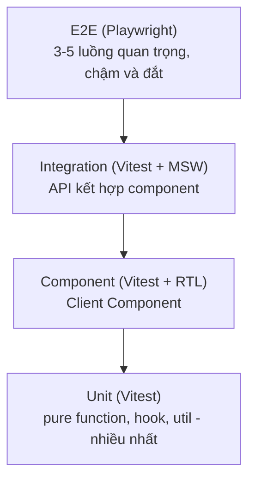

# Testing Next.js App

**Testing** (kiểm thử) là việc viết các đoạn mã tự động để kiểm tra ứng dụng chạy đúng như mong đợi, giúp phát hiện lỗi trước khi đưa lên môi trường thật. Bài này hướng dẫn cách kiểm thử các thành phần đặc trưng của Next.js như Server Component, Client Component và Server Action. Với người mới, thói quen viết test giúp bạn tự tin sửa code mà không lo làm hỏng tính năng cũ.

---

:::note[Ghi nhớ nhanh]

- ⭐ **Server Component async chưa có test util chính thức** — workaround: test business logic riêng, hoặc render bằng `renderToString`.
- **Vitest + React Testing Library** cho unit/component; **Playwright** cho E2E luồng thật (login, checkout).
- **Test Client Component** bằng RTL: render, click, kiểm tra state cập nhật.
- **Test Server Action** gọi thẳng hàm với `FormData` mock, kiểm tra validation và kết quả.
- **MSW** intercept `fetch` ở network layer để mock; theo mô hình testing pyramid (nhiều unit, ít E2E).

:::

---

## Mục lục

- [Vì sao cần test ứng dụng Next?](#vì-sao-cần-test-ứng-dụng-next)
- [Setup Vitest](#setup-vitest)
- [Test Server Component](#test-server-component)
- [Test Client Component](#test-client-component)
- [Test Server Action](#test-server-action)
- [E2E với Playwright](#e2e-với-playwright)
- [Storybook](#storybook)
- [Câu hỏi phỏng vấn](#câu-hỏi-phỏng-vấn)

---

## Vì sao cần test ứng dụng Next?

**Vấn đề:** Một app Next có nhiều tầng đan xen — Server Component, Client Component, Route Handler, Middleware, Server Action. Mỗi tầng chạy ở môi trường khác nhau (server vs browser), nên khi refactor rất dễ vỡ ngầm mà không ai biết.

```tsx
// Đổi getPosts() từ fetch sang đọc DB trực tiếp...
export default async function Page() {
  const posts = await getPosts(); // còn chạy đúng trên server không?
  return <PostList posts={posts} />; // PostList có vỡ khi posts rỗng?
}
// Test tay từng trang vừa chậm vừa sót — lỗi chỉ lộ ra ở production, rất tốn kém.
```

**Giải pháp:** Test tự động đa tầng — unit/integration cho logic và component bằng Vitest + RTL (riêng Server Component async cần workaround như mục dưới), còn E2E bằng Playwright cho luồng thật end-to-end (vì nhiều thứ chỉ đúng khi server chạy thật). Bắt lỗi sớm, tự tin refactor.

```ts
// Logic & component: Vitest + RTL (nhanh, chạy hàng loạt)
const posts = await getPosts();
expect(posts).toHaveLength(1);

// Luồng thật: Playwright (chạy server thật, đúng như người dùng)
await page.goto("/login");
await expect(page).toHaveURL("/dashboard");
```

:::tip[Dùng thực tế]

- Test Client Component bằng RTL: render `<Counter />`, click button, kiểm tra state cập nhật đúng.
- E2E luồng đăng nhập / checkout bằng Playwright: chạy qua server thật từ đầu tới cuối như người dùng.
- Test Route Handler / Server Action: gọi thẳng hàm với input mock, kiểm tra validation và kết quả trả về.
- Chống regression khi nâng cấp Next: chạy lại toàn bộ test sau khi bump version để bắt lỗi vỡ ngầm ngay.

:::

---

## Setup Vitest

```bash
npm install -D vitest @testing-library/react @testing-library/jest-dom jsdom @vitejs/plugin-react
```

`vitest.config.ts`:

```ts
import { defineConfig } from "vitest/config";
import react from "@vitejs/plugin-react";
import path from "path";

export default defineConfig({
  plugins: [react()],
  test: {
    environment: "jsdom",
    globals: true,
    setupFiles: ["./test/setup.ts"],
  },
  resolve: {
    alias: { "@": path.resolve(__dirname, "./") },
  },
});
```

```ts
// test/setup.ts
import "@testing-library/jest-dom/vitest";
```

```json
// package.json
{
  "scripts": {
    "test": "vitest",
    "test:run": "vitest run",
    "test:ui": "vitest --ui"
  }
}
```

---

## Test Server Component

Server Component **async** — chưa có official test util từ React. Workaround:

**Cách 1 — Test logic riêng**:

```ts
// app/posts/page.tsx
export default async function Page() {
  const posts = await getPosts();
  return <PostList posts={posts} />;
}
```

```ts
// posts.test.ts
import { describe, it, expect, vi } from "vitest";
import { getPosts } from "@/lib/posts";

vi.mock("@/lib/db", () => ({
  db: {
    post: {
      findMany: vi.fn().mockResolvedValue([{ id: 1, title: "Hi" }]),
    },
  },
}));

describe("getPosts", () => {
  it("trả danh sách posts", async () => {
    const posts = await getPosts();
    expect(posts).toHaveLength(1);
  });
});
```

→ Test **business logic** thay vì render Server Component.

**Cách 2 — Render bằng `renderToString`** (experimental):

```ts
import { renderToString } from "react-dom/server";

const html = renderToString(await Page());
expect(html).toContain("Hi");
```

Workaround vì test framework hiện chưa support async component natively.

---

## Test Client Component

Standard React Testing Library:

```tsx
// Counter.tsx
"use client";

import { useState } from "react";

export function Counter() {
  const [count, setCount] = useState(0);
  return (
    <div>
      <p>Count: {count}</p>
      <button onClick={() => setCount(c => c + 1)}>+</button>
    </div>
  );
}
```

```ts
// Counter.test.tsx
import { describe, it, expect } from "vitest";
import { render, screen } from "@testing-library/react";
import userEvent from "@testing-library/user-event";
import { Counter } from "./Counter";

describe("Counter", () => {
  it("increment khi click", async () => {
    const user = userEvent.setup();
    render(<Counter />);

    expect(screen.getByText("Count: 0")).toBeInTheDocument();
    await user.click(screen.getByRole("button"));
    expect(screen.getByText("Count: 1")).toBeInTheDocument();
  });
});
```

---

## Test Server Action

Test function trực tiếp:

```ts
// app/actions.ts
"use server";

export async function createPost(formData: FormData) {
  const title = formData.get("title");
  if (!title) throw new Error("Title required");
  return db.post.create({ data: { title: title as string } });
}
```

```ts
// actions.test.ts
import { describe, it, expect, vi } from "vitest";
import { createPost } from "./actions";

vi.mock("@/lib/db", () => ({
  db: { post: { create: vi.fn() } },
}));

describe("createPost", () => {
  it("throw khi thiếu title", async () => {
    const formData = new FormData();
    await expect(createPost(formData)).rejects.toThrow("Title required");
  });

  it("tạo post khi có title", async () => {
    const formData = new FormData();
    formData.append("title", "Hello");
    await createPost(formData);
    expect(db.post.create).toHaveBeenCalledWith({ data: { title: "Hello" } });
  });
});
```

---

## E2E với Playwright

```bash
npm init playwright@latest
```

Auto setup config + sample tests.

```ts
// tests/auth.spec.ts
import { test, expect } from "@playwright/test";

test("login flow", async ({ page }) => {
  await page.goto("/login");

  await page.getByLabel("Email").fill("user@example.com");
  await page.getByLabel("Password").fill("password");
  await page.getByRole("button", { name: "Sign in" }).click();

  await expect(page).toHaveURL("/dashboard");
  await expect(page.getByText("Welcome back")).toBeVisible();
});
```

Run:

```bash
npx playwright test
npx playwright test --ui   # UI mode
npx playwright codegen      # record interaction
```

:::info[Phân tích]

**Playwright vs Cypress**:

| | Playwright | Cypress |
|--|-----------|---------|
| Vendor | Microsoft | Cypress.io |
| Multi-browser | **Chromium, Firefox, WebKit** | Chrome, Firefox, Edge |
| Parallel | Native | Cần Cypress Cloud |
| Speed | **Nhanh hơn** | Chậm hơn |
| Network mocking | Native | Native |
| Debugging | Trace viewer (cực mạnh) | Time travel |
| Mobile testing | Emulation | Emulation |
| Adoption 2026 | **Tăng** | Giảm |

Playwright được khuyến nghị hơn 2024+ — performance, multi-browser, tooling.

:::

---

## Storybook

Develop + test component **isolated**:

```bash
npx storybook@latest init
```

```tsx
// Button.stories.tsx
import type { Meta, StoryObj } from "@storybook/nextjs";
import { Button } from "./Button";

const meta = {
  component: Button,
} satisfies Meta<typeof Button>;

export default meta;
type Story = StoryObj<typeof meta>;

export const Primary: Story = {
  args: { variant: "primary", children: "Save" },
};

export const Disabled: Story = {
  args: { disabled: true, children: "Disabled" },
};
```

Run:

```bash
npm run storybook
```

Lợi ích:

- Develop component không cần render trong app context.
- Document API tự động từ TypeScript.
- Visual regression test (Chromatic).
- Stakeholder review UI without dev environment.

:::tip[Mẹo]

**Testing strategy cho Next.js project:**

Các tầng test xếp thành kim tự tháp: nhiều unit test ở đáy (nhanh, rẻ), thu hẹp dần lên tới vài luồng E2E ở đỉnh (chậm, đắt):



| Layer | Tool | Mục tiêu |
|-------|------|----------|
| **Unit** | Vitest | Pure function, hook, util |
| **Component** | Vitest + RTL | Client Component logic |
| **Integration** | Vitest + MSW | API + component combined |
| **E2E** | Playwright | Critical user flow |
| **Visual** | Storybook + Chromatic | UI regression |

**Coverage target**:

- Utils: 90%+ (pure, dễ test).
- Components: 70%+ (UI, optional).
- API routes: 80%+ (logic, validation).
- E2E: 3-5 critical flow (login, checkout, signup).

Đừng cố 100% — diminishing return sau 80%. Focus test:

- Logic có **branch nhiều**.
- Code đã có bug (regression).
- Business critical (payment, auth).

:::

:::warning[Cần lưu ý]

**Server Component testing đang còn evolve**:

- React team working on official test utility.
- Workaround tạm: test logic riêng, render bằng `renderToString`.
- E2E (Playwright) thực sự test page Server Component → chạy thật.

Đợi feature stable. Hiện tại E2E + unit test cho logic riêng là pattern
phổ biến.

Lib alternative đang phát triển:

- `next/experimental/testing` — official Next.js test utility (đang work).
- `vitest-environment-nextjs` — community.

:::

:::info[Phân tích]

**Mock với MSW** (Mock Service Worker) cho test:

```bash
npm install -D msw
```

```ts
// test/mocks/handlers.ts
import { http, HttpResponse } from "msw";

export const handlers = [
  http.get("/api/users", () => {
    return HttpResponse.json([{ id: 1, name: "An" }]);
  }),
];
```

```ts
// test/setup.ts
import { setupServer } from "msw/node";
import { handlers } from "./mocks/handlers";

const server = setupServer(...handlers);

beforeAll(() => server.listen());
afterEach(() => server.resetHandlers());
afterAll(() => server.close());
```

MSW intercept `fetch` ở network layer → component test mà không touch
network thật. Compat cả unit test + E2E.

:::

---

## Câu hỏi phỏng vấn

Những câu thường gặp về chủ đề này. Tự trả lời trước, rồi đối chiếu lại với nội dung phía trên.

1. Testing pyramid trong một dự án Next gồm những tầng nào, và tỷ lệ giữa các tầng nên ra sao?
2. Unit test, integration test và E2E test khác nhau thế nào về chi phí, tốc độ và độ tin cậy?
3. Vì sao React Testing Library khuyến khích query theo role/label thay vì theo class hay cấu trúc DOM?
4. Vì sao Jest/Vitest chưa test được async Server Component? Lỗi thường gặp là gì và cách xử lý tạm thời ra sao?
5. Trong thực tế bạn test Server Component bằng cách nào — tách business logic ra hay dựa vào E2E? Vì sao?
6. Test một Server Action cần chuẩn bị những gì (dựng `FormData`, mock tầng DB, kiểm tra validation)?
7. Làm sao test một Route Handler (`app/api/.../route.ts`) mà không phải chạy server thật?
8. `MSW` chặn request ở tầng nào, và ưu điểm so với việc mock trực tiếp module gọi API là gì?
9. So sánh Playwright và Cypress về kiến trúc, hỗ trợ đa trình duyệt, chạy song song và công cụ debug.
10. Playwright xử lý auto-waiting ra sao, và vì sao nên tránh `waitForTimeout` cố định?
11. Bạn xử lý test flaky thế nào — nguyên nhân thường gặp và chiến lược khắc phục là gì?
12. Chiến lược seed và dọn dữ liệu ra sao để các test E2E chạy song song vẫn độc lập với nhau?
13. Làm sao để E2E vượt qua bước đăng nhập nhanh mà vẫn an toàn (`storageState`, tái sử dụng session)?
14. Vì sao khi test Client Component thường phải mock `next/navigation` (`useRouter`, `useSearchParams`)?
15. Storybook và visual regression test đóng vai trò gì trong quy trình, và khi nào đáng đầu tư?
16. Mức coverage bao nhiêu là hợp lý, và vì sao đuổi theo 100% thường không đáng?
17. Bạn sắp xếp các tầng test vào pipeline CI/CD thế nào để vừa bắt lỗi sớm vừa giữ thời gian build chấp nhận được?
