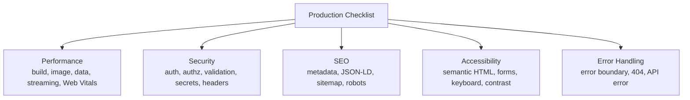

# Production Checklist

**Production** (môi trường vận hành thật, nơi người dùng cuối truy cập) đòi hỏi ứng dụng phải nhanh, an toàn và ổn định. **Checklist** (danh sách kiểm tra) là tập hợp các hạng mục cần rà soát trước khi đưa ứng dụng lên môi trường này, bao gồm hiệu năng, bảo mật, SEO và khả năng truy cập. Với người mới, đi qua từng mục giúp bạn không bỏ sót bước quan trọng nào trước ngày ra mắt.

Checklist được chia thành 5 nhóm hạng mục chính, mỗi nhóm gom các mục kiểm tra liên quan:



---

## Mục lục

- [Performance Checklist](#performance-checklist)
- [Security Checklist](#security-checklist)
- [SEO Checklist](#seo-checklist)
- [Accessibility (a11y)](#accessibility-a11y)
- [Error Handling](#error-handling)

---

## Performance Checklist

**Build & bundle:**

- [ ] Build mode production (`npm run build`).
- [ ] First Load JS < 200KB.
- [ ] No CommonJS package (slow tree-shake).
- [ ] Use `optimizePackageImports` cho icon library.
- [ ] Bundle analyzer chạy thường xuyên.

**Images & Fonts:**

- [ ] Mọi `` chuyển sang `<Image>`.
- [ ] LCP image có `priority`.
- [ ] Font qua `next/font`.
- [ ] Image format: WebP/AVIF, không PNG nếu không cần transparency.

**Data fetching:**

- [ ] Server Components fetch trực tiếp (không qua API trung gian).
- [ ] Parallel fetch (`Promise.all`) khi không có dependency.
- [ ] Cache strategy đúng (Static/ISR/Dynamic).
- [ ] revalidate tag/path khi mutation.

**Streaming:**

- [ ] Suspense quanh component data-heavy.
- [ ] `loading.tsx` cho page có data load lâu.
- [ ] Skeleton thay vì spinner.

**Web Vitals targets:**

- [ ] LCP < 2.5s (75 percentile).
- [ ] INP < 200ms.
- [ ] CLS < 0.1.
- [ ] TTFB < 800ms.

---

## Security Checklist

**Authentication:**

- [ ] Session cookie: `httpOnly + secure + sameSite=lax`.
- [ ] CSRF protection (Server Actions tự có).
- [ ] Rate limiting cho auth endpoint.
- [ ] Password hash với bcrypt/argon2 (không SHA).
- [ ] JWT verify ở middleware (Edge).

**Authorization:**

- [ ] Server Action verify session đầu function.
- [ ] Mọi DB mutation check ownership.
- [ ] Admin role check tường minh.
- [ ] Không expose internal ID nếu không cần.

**Input validation:**

- [ ] Schema validate (Zod) mọi user input.
- [ ] Sanitize HTML user (`DOMPurify`).
- [ ] Validate file upload (size, type, magic bytes).
- [ ] SQL injection prevention (ORM tự handle, raw query phải parameterize).

**Secrets:**

- [ ] Secret trong env, không hardcode.
- [ ] `NEXT_PUBLIC_*` không có secret.
- [ ] `.env.local` trong `.gitignore`.
- [ ] `server-only` package cho file DB/auth.
- [ ] Rotate secret khi nghi ngờ leak.

**Headers:**

- [ ] CSP (Content Security Policy).
- [ ] X-Frame-Options: DENY (chống clickjacking).
- [ ] X-Content-Type-Options: nosniff.
- [ ] Strict-Transport-Security.
- [ ] Referrer-Policy.

```ts
// next.config.ts
export default {
  headers: async () => [
    {
      source: "/(.*)",
      headers: [
        { key: "X-Frame-Options", value: "DENY" },
        { key: "X-Content-Type-Options", value: "nosniff" },
        { key: "Referrer-Policy", value: "strict-origin-when-cross-origin" },
        {
          key: "Strict-Transport-Security",
          value: "max-age=31536000; includeSubDomains",
        },
        {
          key: "Permissions-Policy",
          value: "camera=(), microphone=(), geolocation=()",
        },
      ],
    },
  ],
};
```

:::info[Phân tích]

**CSP setup** — mạnh nhất nhưng phức tạp:

```ts
const cspHeader = `
  default-src 'self';
  script-src 'self' 'nonce-${nonce}' 'strict-dynamic';
  style-src 'self' 'unsafe-inline';
  img-src 'self' blob: data:;
  font-src 'self';
  object-src 'none';
  base-uri 'self';
  form-action 'self';
  frame-ancestors 'none';
  upgrade-insecure-requests;
`.replace(/\s{2,}/g, " ").trim();
```

CSP block:

- Inline script không có nonce.
- External resource không whitelist.
- `<iframe>` chèn vào trang.
- Mixed content (HTTP trong HTTPS).

Test kỹ trước deploy — CSP sai gây trang trắng.

:::

---

## SEO Checklist

**Metadata:**

- [ ] `title` tag mọi page (unique).
- [ ] `description` (155 chars).
- [ ] Open Graph image (1200×630).
- [ ] Twitter card.
- [ ] Canonical URL.
- [ ] Hreflang (nếu multi-lang).

**Structured data** (JSON-LD):

```tsx
import Script from "next/script";

export default function ProductPage({ product }) {
  return (
    <>
      <Script type="application/ld+json" id="product-schema">
        {JSON.stringify({
          "@context": "https://schema.org",
          "@type": "Product",
          name: product.name,
          description: product.description,
          image: product.image,
          offers: {
            "@type": "Offer",
            price: product.price,
            priceCurrency: "VND",
          },
        })}
      </Script>
      {/* ... */}
    </>
  );
}
```

**Sitemap & Robots**:

```ts
// app/sitemap.ts
import type { MetadataRoute } from "next";

export default async function sitemap(): Promise<MetadataRoute.Sitemap> {
  const posts = await getPosts();
  return [
    { url: "https://example.com", lastModified: new Date(), priority: 1 },
    ...posts.map(p => ({
      url: `https://example.com/blog/${p.slug}`,
      lastModified: new Date(p.updatedAt),
    })),
  ];
}
```

```ts
// app/robots.ts
import type { MetadataRoute } from "next";

export default function robots(): MetadataRoute.Robots {
  return {
    rules: { userAgent: "*", allow: "/", disallow: "/admin/" },
    sitemap: "https://example.com/sitemap.xml",
  };
}
```

---

## Accessibility (a11y)

**Semantic HTML:**

- [ ] `<button>` cho action, không `<div onClick>`.
- [ ] `<a>` cho navigation.
- [ ] `<nav>`, `<main>`, `<header>`, `<footer>`, `<article>`.
- [ ] Heading hierarchy đúng (h1 → h2 → h3).

**Forms:**

- [ ] `<label>` gắn `<input>` (qua `htmlFor` hoặc nesting).
- [ ] `aria-invalid` khi error.
- [ ] `aria-describedby` cho error message.
- [ ] Focus indicator visible.

**Images:**

- [ ] `alt` cho mọi image (decorative thì `alt=""`).
- [ ] Icon `aria-label` hoặc `<span class="sr-only">`.

**Keyboard navigation:**

- [ ] Tab order logic.
- [ ] Esc đóng modal.
- [ ] Enter submit form.
- [ ] No keyboard trap.

**Color contrast:**

- [ ] Text/background contrast ratio ≥ 4.5:1.
- [ ] Large text ≥ 3:1.
- [ ] Không phụ thuộc màu (kèm icon, text).

**Tools:**

- **axe DevTools** — Chrome extension.
- **Lighthouse Accessibility** — built-in.
- **eslint-plugin-jsx-a11y** — lint a11y rule.

---

## Error Handling

**Error boundary**:

```tsx
// app/error.tsx (global error boundary)
"use client";

export default function Error({ error, reset }) {
  useEffect(() => {
    // Log to Sentry
    Sentry.captureException(error);
  }, [error]);

  return (
    <div>
      <h2>Đã có lỗi</h2>
      <button onClick={reset}>Thử lại</button>
    </div>
  );
}
```

**Not found**:

```tsx
// app/not-found.tsx
export default function NotFound() {
  return (
    <div>
      <h2>404 - Không tìm thấy</h2>
      <Link href="/">Về trang chủ</Link>
    </div>
  );
}
```

**API error response**:

```ts
export async function GET() {
  try {
    const data = await fetchData();
    return Response.json(data);
  } catch (err) {
    Sentry.captureException(err);
    return Response.json(
      { error: "Internal error" },  // không expose detail
      { status: 500 }
    );
  }
}
```

:::tip[Mẹo]

**Pre-deploy checklist 30 mục**:

1. ✅ `npm run build` không lỗi.
2. ✅ `npm run lint` không warning.
3. ✅ TypeScript no error.
4. ✅ Test suite pass.
5. ✅ E2E test pass.
6. ✅ Lighthouse mobile ≥ 90.
7. ✅ Bundle size acceptable.
8. ✅ Image optimized.
9. ✅ Font không layout shift.
10. ✅ SEO metadata đầy đủ.
11. ✅ Sitemap + robots.
12. ✅ Open Graph image.
13. ✅ CSP header set.
14. ✅ Security header full.
15. ✅ HTTPS only.
16. ✅ Cookie `httpOnly + secure`.
17. ✅ Rate limiting auth.
18. ✅ Input validation.
19. ✅ Error tracking (Sentry).
20. ✅ Analytics setup.
21. ✅ Monitoring uptime.
22. ✅ Database backup.
23. ✅ Env variable production.
24. ✅ Secret rotated.
25. ✅ Logging structured.
26. ✅ Cache strategy tested.
27. ✅ A11y audit pass.
28. ✅ Mobile tested real device.
29. ✅ Rollback plan.
30. ✅ On-call rotation.

Đi qua từng item — đừng dựa vào memory.

:::
