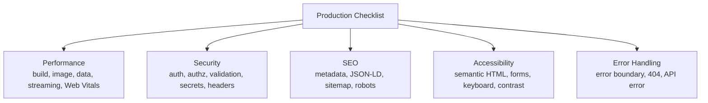

# Production Checklist

**Production** (môi trường vận hành thật, nơi người dùng cuối truy cập) đòi hỏi ứng dụng phải nhanh, an toàn và ổn định. **Checklist** (danh sách kiểm tra) là tập hợp các hạng mục cần rà soát trước khi đưa ứng dụng lên môi trường này, bao gồm hiệu năng, bảo mật, SEO và khả năng truy cập. Với người mới, đi qua từng mục giúp bạn không bỏ sót bước quan trọng nào trước ngày ra mắt.

Checklist được chia thành 5 nhóm hạng mục chính, mỗi nhóm gom các mục kiểm tra liên quan:



[](pathname:///img/nextjs/production-checklist.webp)

---

:::note[Ghi nhớ nhanh]

- ⭐ **5 nhóm cần rà soát trước khi lên production**: Performance, Security, SEO, Accessibility, Error Handling.
- **Performance**: First Load JS < 200KB, mọi `` → `<Image>`, đạt Web Vitals target (LCP < 2.5s, INP < 200ms, CLS < 0.1).
- **Security**: secret trong env (không hardcode), security header (CSP, `X-Frame-Options`, HSTS), cookie `httpOnly + secure`.
- **SEO**: metadata unique, JSON-LD, `sitemap.ts` + `robots.ts`; **A11y**: semantic HTML, label form, contrast ≥ 4.5:1.
- **Error handling**: `error.tsx`, `not-found.tsx`, API error không lộ chi tiết — dùng **checklist 30 mục** trước deploy.

:::

---

## Mục lục

- [Performance Checklist](#performance-checklist)
- [Security Checklist](#security-checklist)
- [SEO Checklist](#seo-checklist)
- [Accessibility (a11y)](#accessibility-a11y)
- [Error Handling](#error-handling)
- [Câu hỏi phỏng vấn](#câu-hỏi-phỏng-vấn)

---

## Performance Checklist

**Build & bundle:**

- [ ] Build mode production (`npm run build`).
- [ ] First Load JS < 200KB.
- [ ] No CommonJS package (slow tree-shake).
- [ ] Use `optimizePackageImports` cho icon library.
- [ ] Bundle analyzer chạy thường xuyên.

**Images & Fonts:**

- [ ] Mọi `` chuyển sang `<Image>`.
- [ ] LCP image có `priority`.
- [ ] Font qua `next/font`.
- [ ] Image format: WebP/AVIF, không PNG nếu không cần transparency.

**Data fetching:**

- [ ] Server Components fetch trực tiếp (không qua API trung gian).
- [ ] Parallel fetch (`Promise.all`) khi không có dependency.
- [ ] Cache strategy đúng (Static/ISR/Dynamic).
- [ ] revalidate tag/path khi mutation.

**Streaming:**

- [ ] Suspense quanh component data-heavy.
- [ ] `loading.tsx` cho page có data load lâu.
- [ ] Skeleton thay vì spinner.

**Web Vitals targets:**

- [ ] LCP < 2.5s (75 percentile).
- [ ] INP < 200ms.
- [ ] CLS < 0.1.
- [ ] TTFB < 800ms.

---

## Security Checklist

**Authentication:**

- [ ] Session cookie: `httpOnly + secure + sameSite=lax`.
- [ ] CSRF protection (Server Actions tự có).
- [ ] Rate limiting cho auth endpoint.
- [ ] Password hash với bcrypt/argon2 (không SHA).
- [ ] JWT verify ở middleware (Edge).

**Authorization:**

- [ ] Server Action verify session đầu function.
- [ ] Mọi DB mutation check ownership.
- [ ] Admin role check tường minh.
- [ ] Không expose internal ID nếu không cần.

**Input validation:**

- [ ] Schema validate (Zod) mọi user input.
- [ ] Sanitize HTML user (`DOMPurify`).
- [ ] Validate file upload (size, type, magic bytes).
- [ ] SQL injection prevention (ORM tự handle, raw query phải parameterize).

**Secrets:**

- [ ] Secret trong env, không hardcode.
- [ ] `NEXT_PUBLIC_*` không có secret.
- [ ] `.env.local` trong `.gitignore`.
- [ ] `server-only` package cho file DB/auth.
- [ ] Rotate secret khi nghi ngờ leak.

**Headers:**

- [ ] CSP (Content Security Policy).
- [ ] X-Frame-Options: DENY (chống clickjacking).
- [ ] X-Content-Type-Options: nosniff.
- [ ] Strict-Transport-Security.
- [ ] Referrer-Policy.

```ts
// next.config.ts
export default {
  headers: async () => [
    {
      source: "/(.*)",
      headers: [
        { key: "X-Frame-Options", value: "DENY" },
        { key: "X-Content-Type-Options", value: "nosniff" },
        { key: "Referrer-Policy", value: "strict-origin-when-cross-origin" },
        {
          key: "Strict-Transport-Security",
          value: "max-age=31536000; includeSubDomains",
        },
        {
          key: "Permissions-Policy",
          value: "camera=(), microphone=(), geolocation=()",
        },
      ],
    },
  ],
};
```

:::info[Phân tích]

**CSP setup** — mạnh nhất nhưng phức tạp:

```ts
const cspHeader = `
  default-src 'self';
  script-src 'self' 'nonce-${nonce}' 'strict-dynamic';
  style-src 'self' 'unsafe-inline';
  img-src 'self' blob: data:;
  font-src 'self';
  object-src 'none';
  base-uri 'self';
  form-action 'self';
  frame-ancestors 'none';
  upgrade-insecure-requests;
`.replace(/\s{2,}/g, " ").trim();
```

CSP block:

- Inline script không có nonce.
- External resource không whitelist.
- `<iframe>` chèn vào trang.
- Mixed content (HTTP trong HTTPS).

Test kỹ trước deploy — CSP sai gây trang trắng.

:::

---

## SEO Checklist

**Metadata:**

- [ ] `title` tag mọi page (unique).
- [ ] `description` (155 chars).
- [ ] Open Graph image (1200×630).
- [ ] Twitter card.
- [ ] Canonical URL.
- [ ] Hreflang (nếu multi-lang).

**Structured data** (JSON-LD):

```tsx
import Script from "next/script";

export default function ProductPage({ product }) {
  return (
    <>
      <Script type="application/ld+json" id="product-schema">
        {JSON.stringify({
          "@context": "https://schema.org",
          "@type": "Product",
          name: product.name,
          description: product.description,
          image: product.image,
          offers: {
            "@type": "Offer",
            price: product.price,
            priceCurrency: "VND",
          },
        })}
      </Script>
      {/* ... */}
    </>
  );
}
```

**Sitemap & Robots**:

```ts
// app/sitemap.ts
import type { MetadataRoute } from "next";

export default async function sitemap(): Promise<MetadataRoute.Sitemap> {
  const posts = await getPosts();
  return [
    { url: "https://example.com", lastModified: new Date(), priority: 1 },
    ...posts.map(p => ({
      url: `https://example.com/blog/${p.slug}`,
      lastModified: new Date(p.updatedAt),
    })),
  ];
}
```

```ts
// app/robots.ts
import type { MetadataRoute } from "next";

export default function robots(): MetadataRoute.Robots {
  return {
    rules: { userAgent: "*", allow: "/", disallow: "/admin/" },
    sitemap: "https://example.com/sitemap.xml",
  };
}
```

---

## Accessibility (a11y)

**Semantic HTML:**

- [ ] `<button>` cho action, không `<div onClick>`.
- [ ] `<a>` cho navigation.
- [ ] `<nav>`, `<main>`, `<header>`, `<footer>`, `<article>`.
- [ ] Heading hierarchy đúng (h1 → h2 → h3).

**Forms:**

- [ ] `<label>` gắn `<input>` (qua `htmlFor` hoặc nesting).
- [ ] `aria-invalid` khi error.
- [ ] `aria-describedby` cho error message.
- [ ] Focus indicator visible.

**Images:**

- [ ] `alt` cho mọi image (decorative thì `alt=""`).
- [ ] Icon `aria-label` hoặc `<span class="sr-only">`.

**Keyboard navigation:**

- [ ] Tab order logic.
- [ ] Esc đóng modal.
- [ ] Enter submit form.
- [ ] No keyboard trap.

**Color contrast:**

- [ ] Text/background contrast ratio ≥ 4.5:1.
- [ ] Large text ≥ 3:1.
- [ ] Không phụ thuộc màu (kèm icon, text).

**Tools:**

- **axe DevTools** — Chrome extension.
- **Lighthouse Accessibility** — built-in.
- **eslint-plugin-jsx-a11y** — lint a11y rule.

---

## Error Handling

**Error boundary**:

```tsx
// app/error.tsx (global error boundary)
"use client";

export default function Error({ error, reset }) {
  useEffect(() => {
    // Log to Sentry
    Sentry.captureException(error);
  }, [error]);

  return (
    <div>
      <h2>Đã có lỗi</h2>
      <button onClick={reset}>Thử lại</button>
    </div>
  );
}
```

**Not found**:

```tsx
// app/not-found.tsx
export default function NotFound() {
  return (
    <div>
      <h2>404 - Không tìm thấy</h2>
      <Link href="/">Về trang chủ</Link>
    </div>
  );
}
```

**API error response**:

```ts
export async function GET() {
  try {
    const data = await fetchData();
    return Response.json(data);
  } catch (err) {
    Sentry.captureException(err);
    return Response.json(
      { error: "Internal error" },  // không expose detail
      { status: 500 }
    );
  }
}
```

:::tip[Mẹo]

**Pre-deploy checklist 30 mục**:

1. ✅ `npm run build` không lỗi.
2. ✅ `npm run lint` không warning.
3. ✅ TypeScript no error.
4. ✅ Test suite pass.
5. ✅ E2E test pass.
6. ✅ Lighthouse mobile ≥ 90.
7. ✅ Bundle size acceptable.
8. ✅ Image optimized.
9. ✅ Font không layout shift.
10. ✅ SEO metadata đầy đủ.
11. ✅ Sitemap + robots.
12. ✅ Open Graph image.
13. ✅ CSP header set.
14. ✅ Security header full.
15. ✅ HTTPS only.
16. ✅ Cookie `httpOnly + secure`.
17. ✅ Rate limiting auth.
18. ✅ Input validation.
19. ✅ Error tracking (Sentry).
20. ✅ Analytics setup.
21. ✅ Monitoring uptime.
22. ✅ Database backup.
23. ✅ Env variable production.
24. ✅ Secret rotated.
25. ✅ Logging structured.
26. ✅ Cache strategy tested.
27. ✅ A11y audit pass.
28. ✅ Mobile tested real device.
29. ✅ Rollback plan.
30. ✅ On-call rotation.

Đi qua từng item — đừng dựa vào memory.

:::

---

## Câu hỏi phỏng vấn

Những câu thường gặp về chủ đề này. Tự trả lời trước, rồi bấm **Xem đáp án** để đối chiếu.

**1. Trước khi deploy production bạn rà soát những nhóm hạng mục nào, và vì sao cần checklist thay vì dựa vào trí nhớ?**

<details className="qa">
<summary>Xem đáp án</summary>

Năm nhóm chính:

- **Performance** — build/bundle, ảnh và font, chiến lược fetch dữ liệu, streaming, các ngưỡng Web Vitals.
- **Security** — xác thực, phân quyền, validate input, quản lý secret, security header.
- **SEO** — metadata unique, canonical, Open Graph, JSON-LD, `sitemap.ts`, `robots.ts`.
- **Accessibility** — semantic HTML, label cho form, điều hướng bằng bàn phím, độ tương phản.
- **Error handling** — `error.tsx`, `not-found.tsx`, response lỗi API không lộ chi tiết.

Vì sao cần checklist: những hạng mục này **hiếm khi lộ ra lúc dev** (ở local luôn có HTTPS giả, dữ liệu nhỏ, mạng nhanh, chỉ một người dùng), nên rất dễ quên. Việc quên lại có hậu quả không đối xứng — thiếu một security header hay để lọt secret có thể gây sự cố lớn, trong khi chi phí rà soát chỉ vài phút. Checklist còn giúp bàn giao giữa các thành viên, tạo cơ sở cho việc tự động hoá dần từng mục vào CI, và biến kinh nghiệm từ sự cố cũ thành quy trình thay vì trí nhớ cá nhân.

</details>

**2. Vì sao phải chạy `next build` rồi `next start` ở local trước khi deploy, thay vì chỉ kiểm thử trên `next dev`?**

<details className="qa">
<summary>Xem đáp án</summary>

`next dev` và bản production khác nhau về bản chất:

| | `next dev` | `next build` + `next start` |
|---|---|---|
| Biên dịch | On-demand theo từng route đang xem | Build sẵn toàn bộ, tối ưu và minify |
| Cache / ISR | Phần lớn bị tắt để dev thấy thay đổi ngay | Hoạt động đầy đủ |
| Static generation | Không prerender như thật | Prerender thật — lỗi lúc prerender lộ ra ở đây |
| React | Có dev warning, double-render trong Strict Mode | Bản production, tree-shake, bỏ dev code |
| Hiệu năng | Không đại diện | Gần đúng production |

Những lỗi chỉ xuất hiện khi build: dùng API của browser (`window`, `localStorage`) trong code chạy lúc prerender, thiếu biến môi trường, lỗi type/lint chặn build, `generateStaticParams` sai, hoặc trang lẽ ra static nhưng vô tình thành dynamic. Ngoài ra, chỉ có bản build mới cho con số **First Load JS** thật để đối chiếu với ngưỡng trong checklist, và mới đo Lighthouse có ý nghĩa.

</details>

**3. Những mục nào trong checklist ảnh hưởng trực tiếp tới `LCP`, và bạn kiểm chứng chúng bằng cách nào?**

<details className="qa">
<summary>Xem đáp án</summary>

`LCP` (Largest Contentful Paint) đo thời điểm phần tử nội dung lớn nhất hiện ra; mục tiêu **dưới 2.5s ở phân vị 75**. Các mục liên quan trực tiếp:

- **TTFB dưới 800ms** — server trả byte đầu chậm thì LCP không thể nhanh; liên quan tới chiến lược cache (Static/ISR/Dynamic) và vị trí server so với người dùng.
- **Ảnh LCP có `priority`** và dùng `<Image>` với định dạng WebP/AVIF, kích thước đúng.
- **Font qua `next/font`** — tự self-host và preload, tránh chặn render.
- **First Load JS nhỏ** (dưới 200KB) — bundle lớn làm trễ hydration và cả render.
- **Fetch song song bằng `Promise.all`**, đặt Suspense quanh phần chậm để nội dung chính hiện trước.

Kiểm chứng theo hai lớp:

- **Lab**: Lighthouse trên bản `next build` + `next start` (chế độ mobile, có throttle), Chrome DevTools Performance để biết phần tử LCP thật là gì.
- **Field**: dữ liệu người dùng thật qua `useReportWebVitals`, Vercel Speed Insights hoặc CrUX — đây mới là con số Google dùng để xếp hạng. Số liệu lab chỉ để chẩn đoán.

</details>

**4. Vì sao ảnh `LCP` cần `priority`, và điều gì xảy ra nếu gắn `priority` cho mọi ảnh trong trang?**

<details className="qa">
<summary>Xem đáp án</summary>

Mặc định `<Image>` dùng lazy loading: trình duyệt chỉ tải ảnh khi nó sắp vào viewport. Với ảnh hero nằm ngay đầu trang, cơ chế này phản tác dụng — trình duyệt phải parse HTML, dựng layout rồi mới biết cần ảnh, làm LCP trễ đi đáng kể. Thuộc tính `priority` tắt lazy loading và chèn `<link rel="preload">` cho ảnh đó, để việc tải bắt đầu ngay từ đầu.

```tsx
<Image src="/hero.jpg" alt="Hero" width={1200} height={630} priority />
```

Nếu gắn `priority` cho mọi ảnh thì mất hoàn toàn ý nghĩa: "ưu tiên tất cả" bằng "không ưu tiên gì". Hậu quả cụ thể:

- Hàng chục ảnh cùng tranh băng thông và số kết nối với nhau, với cả CSS/JS quan trọng — ảnh LCP về sau chứ không sớm hơn.
- Tải cả ảnh người dùng không bao giờ cuộn tới, tốn dữ liệu di động.
- Next.js sẽ cảnh báo trong console khi phát hiện quá nhiều ảnh `priority`.

Quy tắc: chỉ ảnh LCP (thường là một, tối đa vài ảnh trong màn hình đầu) mới đặt `priority`.

</details>

**5. Kể các security header quan trọng và tác dụng của từng cái: `CSP`, `X-Frame-Options`, `HSTS`, `X-Content-Type-Options`, `Referrer-Policy`.**

<details className="qa">
<summary>Xem đáp án</summary>

| Header | Tác dụng |
|---|---|
| **Content-Security-Policy** | Khai báo nguồn tài nguyên được phép nạp/thực thi (script, style, ảnh, frame). Lớp phòng thủ mạnh nhất chống XSS: script inline hoặc script từ domain lạ bị chặn dù kẻ tấn công chèn được vào HTML |
| **X-Frame-Options: DENY** | Cấm trang bị nhúng trong `iframe` — chống **clickjacking** (phủ trang thật dưới một giao diện giả để lừa người dùng bấm). Bản hiện đại tương đương là `frame-ancestors` trong CSP |
| **Strict-Transport-Security (HSTS)** | Buộc trình duyệt chỉ truy cập site qua HTTPS trong khoảng `max-age`, kể cả khi người dùng gõ `http://`. Chống tấn công hạ cấp giao thức và man-in-the-middle ở request đầu |
| **X-Content-Type-Options: nosniff** | Cấm trình duyệt "đoán" kiểu nội dung khác với `Content-Type` khai báo. Chặn kiểu tấn công upload file trông như ảnh nhưng được thực thi như JavaScript |
| **Referrer-Policy** | Giới hạn thông tin URL gửi kèm khi người dùng rời trang; `strict-origin-when-cross-origin` chỉ gửi origin ra ngoài, tránh rò token hay đường dẫn nội bộ nằm trong URL |

Thêm `Permissions-Policy` để tắt các API nhạy cảm (camera, micro, định vị) không dùng tới. Trong Next.js, tất cả khai báo trong hàm `headers()` của `next.config`.

</details>

**6. `CSP` với `nonce` kèm `strict-dynamic` hoạt động ra sao? Vì sao triển khai `CSP` dễ gây trắng trang, và bạn rollout thế nào cho an toàn?**

<details className="qa">
<summary>Xem đáp án</summary>

Cơ chế: mỗi request, server sinh một chuỗi ngẫu nhiên **nonce**, đưa vào header CSP (`script-src 'self' 'nonce-...'`) và gắn cùng giá trị đó vào các thẻ `script` hợp lệ. Script nào không mang nonce đúng — ví dụ script do kẻ tấn công chèn qua XSS — bị trình duyệt từ chối thực thi. Vì nonce đổi theo từng request nên kẻ tấn công không đoán trước được, và trang phải là dynamic (thường sinh nonce trong middleware).

`strict-dynamic` bổ sung: script đã được tin cậy nhờ nonce thì các script nó tự nạp cũng được tin cậy. Nhờ đó không phải liệt kê từng domain CDN, và các allowlist theo host (vốn dễ bị bypass) bị bỏ qua.

Vì sao dễ trắng trang: chỉ cần sót một nguồn (analytics, widget chat, Google Fonts, `unsafe-eval` mà thư viện cần, inline style của UI library) là script chính bị chặn và ứng dụng không hydrate được — người dùng thấy trang trắng.

Rollout an toàn:

- Bật ở chế độ **`Content-Security-Policy-Report-Only`** trước, kèm endpoint nhận report.
- Thu thập vi phạm vài ngày trên traffic thật, bổ sung dần nguồn hợp lệ.
- Áp dụng cho một phần traffic hoặc môi trường staging trước.
- Khi chuyển sang chế độ chặn, giữ sẵn kế hoạch rollback nhanh.

</details>

**7. Cookie phiên nên đặt những thuộc tính nào, và mỗi thuộc tính chống được loại tấn công gì?**

<details className="qa">
<summary>Xem đáp án</summary>

| Thuộc tính | Tác dụng bảo mật |
|---|---|
| `httpOnly` | JavaScript không đọc được cookie qua `document.cookie` → XSS có xảy ra cũng không đánh cắp được session |
| `secure` | Cookie chỉ gửi qua HTTPS → chống nghe lén trên mạng không an toàn |
| `sameSite=lax` (hoặc `strict`) | Trình duyệt không gửi cookie kèm request khởi phát từ site khác → chống **CSRF**. `lax` vẫn cho phép điều hướng bằng link nên cân bằng tốt giữa an toàn và trải nghiệm |
| `path=/` | Giới hạn phạm vi đường dẫn cookie được gửi |
| `maxAge` / `expires` | Giới hạn vòng đời phiên — cookie bị đánh cắp cũng chỉ dùng được trong thời gian ngắn |
| Tiền tố `__Host-` | Buộc cookie phải có `secure`, `path=/` và không có `domain` — chống cookie bị ghi đè từ subdomain |

Ngoài thuộc tính, phần quan trọng không kém là nội dung: cookie nên chứa **session id ngẫu nhiên** hoặc token đã ký/mã hoá, không chứa dữ liệu nhạy cảm dạng thô; và phải **xoay session id sau khi đăng nhập** để chống session fixation, đồng thời huỷ session phía server khi đăng xuất.

</details>

**8. Vì sao hash mật khẩu phải dùng `bcrypt`/`argon2` chứ không dùng `SHA-256`?**

<details className="qa">
<summary>Xem đáp án</summary>

`SHA-256` là hàm băm **được thiết kế để chạy nhanh** — đúng cho việc kiểm tra toàn vẹn dữ liệu, nhưng là thảm hoạ cho mật khẩu. Một GPU phổ thông tính được hàng tỷ hash SHA-256 mỗi giây, nên khi database bị lộ, kẻ tấn công dò toàn bộ mật khẩu phổ biến trong thời gian rất ngắn. Nó cũng không có salt sẵn, nên hai người cùng mật khẩu sẽ cùng hash, và rainbow table dùng lại được.

`bcrypt` và `argon2` là **password hashing function** chuyên dụng:

- **Cố tình chậm và có tham số chi phí** (`cost`/`rounds`): tăng tham số khi phần cứng mạnh lên, giữ chi phí tấn công luôn cao trong khi người dùng chỉ tốn vài trăm mili-giây khi đăng nhập.
- **Salt ngẫu nhiên tự sinh**, nhúng luôn trong chuỗi hash → vô hiệu hoá rainbow table và ẩn việc trùng mật khẩu.
- `argon2id` còn **tốn nhiều bộ nhớ**, làm giảm mạnh lợi thế song song của GPU/ASIC — đây là lựa chọn được khuyến nghị cho dự án mới; `bcrypt` vẫn chấp nhận được và rất phổ biến.

Kèm theo: đặt chính sách độ dài tối thiểu, đối chiếu với danh sách mật khẩu đã rò rỉ, và rate limit endpoint đăng nhập.

</details>

**9. Server Action có tự chống `CSRF` không? Vì sao vẫn phải kiểm tra session và quyền ở đầu mỗi action?**

<details className="qa">
<summary>Xem đáp án</summary>

Có một lớp bảo vệ sẵn: Server Action luôn là request `POST` và Next.js đối chiếu header `Origin` với `Host` của server, từ chối request đến từ origin lạ. Cộng thêm cookie `sameSite=lax`, nguy cơ CSRF cổ điển được chặn khá tốt.

Nhưng chống CSRF **không phải** là xác thực hay phân quyền. Điểm mấu chốt: Server Action khi build sẽ trở thành một **endpoint công khai có id riêng**, và bất kỳ ai đã đăng nhập (hoặc thậm chí chưa đăng nhập) đều có thể gọi thẳng endpoint đó bằng `curl` với payload tuỳ ý — không đi qua giao diện, không qua bất kỳ điều kiện `if` nào bạn viết ở phía client.

Vì vậy mỗi action phải tự bảo vệ, coi như đang viết một API endpoint:

```ts
"use server";
export async function deletePost(id: string) {
  const session = await auth();
  if (!session) throw new Error("Unauthorized");
  const post = await db.post.findUnique({ where: { id } });
  if (post?.authorId !== session.user.id) throw new Error("Forbidden");
  // ...
}
```

Nghĩa là: xác thực session, kiểm tra quyền sở hữu trên đúng bản ghi, và validate input bằng Zod — ngay ở đầu hàm, cho mọi action.

</details>

**10. Làm sao chắc chắn không có secret nào lọt xuống client bundle, và bạn kiểm tra điều đó bằng cách nào?**

<details className="qa">
<summary>Xem đáp án</summary>

Phòng ngừa:

- **Không đặt secret sau tiền tố `NEXT_PUBLIC_`** — mọi biến có tiền tố này bị inline vào bundle và ai cũng đọc được.
- **`server-only`** ở đầu các module chạm DB/auth: nếu có Client Component import phải nó, build fail ngay.
- **Không truyền secret qua props** từ Server Component xuống Client Component — props bị serialize vào payload RSC.
- `.env.local` nằm trong `.gitignore`; secret production đặt trong secret manager của nền tảng.

Kiểm tra:

- **Grep bundle sau khi build**: tìm chuỗi đặc trưng của secret trong `.next/static` — ví dụ tìm tiền tố khoá (`sk_live`, `-----BEGIN`) hoặc chính giá trị secret.
- **Xem tab Network / View Source** trên trang thật, kiểm tra cả payload RSC chứ không chỉ file JS.
- **Secret scanning trong CI** (gitleaks, TruffleHog, GitHub secret scanning) chặn commit chứa khoá.
- **Code review** tập trung vào mọi chỗ thêm biến `NEXT_PUBLIC_*`.

Và nguyên tắc cuối: nếu nghi ngờ đã lộ, **rotate ngay** — không phán đoán "chắc không ai thấy".

</details>

**11. Rate limiting nên đặt ở tầng nào (middleware, edge, reverse proxy, WAF), và mỗi lựa chọn đánh đổi ra sao?**

<details className="qa">
<summary>Xem đáp án</summary>

| Tầng | Ưu điểm | Đánh đổi |
|---|---|---|
| **WAF / CDN** (Cloudflare, AWS WAF) | Chặn ở xa nhất, trước khi tốn tài nguyên của bạn; chịu được tấn công lớn | Luật thô, khó gắn với logic nghiệp vụ (theo user id, theo gói dịch vụ); phụ thuộc nhà cung cấp |
| **Reverse proxy** (Nginx, API gateway) | Dùng chung cho mọi service phía sau, cấu hình tập trung | Không biết ngữ cảnh ứng dụng; không dùng được khi deploy serverless |
| **Middleware / Edge của Next** | Chạy trước mọi route, biết cookie và đường dẫn, dễ giới hạn riêng cho `/api/auth` | Cần bộ đếm chia sẻ ngoài tiến trình (Redis/Upstash) vì instance là vô trạng thái; thêm độ trễ mỗi request |
| **Trong Route Handler / Server Action** | Chi tiết nhất — giới hạn theo user, theo hành động, theo tài nguyên | Request đã đi sâu vào hệ thống rồi mới bị chặn, tốn tài nguyên hơn |

Thực tế nên **xếp lớp**: WAF/CDN chặn tấn công thô và bot; middleware giới hạn theo IP cho nhóm endpoint nhạy cảm (đăng nhập, quên mật khẩu, gửi OTP); trong action/handler giới hạn theo user cho các thao tác đắt tiền. Điểm cần nhớ: lưu bộ đếm ở store dùng chung, trả `429` kèm `Retry-After`, và chọn khoá giới hạn cẩn thận (IP dễ bị NAT gộp chung, nên kết hợp với user id khi có).

</details>

**12. Checklist SEO gồm metadata unique, canonical, Open Graph, `sitemap.ts`, `robots.ts` — mỗi thứ giải quyết vấn đề gì?**

<details className="qa">
<summary>Xem đáp án</summary>

- **Metadata unique** (`title` và `description` riêng cho từng trang): quyết định dòng tiêu đề và đoạn mô tả hiển thị trên trang kết quả tìm kiếm, ảnh hưởng trực tiếp tới tỷ lệ click. Nhiều trang dùng chung một tiêu đề khiến công cụ tìm kiếm khó phân biệt và đánh giá thấp.
- **Canonical URL**: chỉ ra đâu là địa chỉ chính thức khi cùng một nội dung truy cập được qua nhiều URL (có/không `www`, kèm tham số UTM, phân trang, sắp xếp). Giúp gom "điểm" về một URL thay vì chia nhỏ, và tránh bị coi là nội dung trùng lặp.
- **Open Graph + Twitter card**: quyết định thẻ xem trước khi link được chia sẻ lên mạng xã hội hay ứng dụng chat — ảnh 1200×630, tiêu đề, mô tả. Không liên quan trực tiếp tới xếp hạng nhưng ảnh hưởng lớn tới lượt click từ mạng xã hội.
- **`sitemap.ts`**: liệt kê toàn bộ URL kèm thời điểm cập nhật, giúp bot phát hiện nhanh trang mới hoặc trang nằm sâu, ít link trỏ tới.
- **`robots.ts`**: nói cho bot biết được phép thu thập phần nào (chặn `/admin/`, trang nội bộ) và trỏ tới sitemap. Lưu ý nó điều khiển **crawl**, muốn loại khỏi kết quả tìm kiếm thì phải dùng `noindex`.

</details>

**13. `JSON-LD` structured data mang lại lợi ích gì, và chèn vào trang Next thế nào cho đúng?**

<details className="qa">
<summary>Xem đáp án</summary>

JSON-LD mô tả nội dung trang theo từ vựng `schema.org` dưới dạng dữ liệu máy đọc được: đây là sản phẩm, giá bao nhiêu, còn hàng không; đây là bài viết, ai viết, đăng khi nào. Lợi ích:

- **Rich result** trên trang tìm kiếm: sao đánh giá, giá, breadcrumb, câu hỏi thường gặp, thời lượng công thức nấu ăn — chiếm nhiều diện tích hơn và tăng tỷ lệ click.
- Giúp công cụ tìm kiếm (và ngày càng nhiều trợ lý AI) **hiểu đúng thực thể** trên trang thay vì đoán từ văn bản.

Cách chèn trong Next.js — dùng `next/script` với `type="application/ld+json"`:

```tsx
<Script type="application/ld+json" id="product-schema">
  {JSON.stringify({
    "@context": "https://schema.org",
    "@type": "Product",
    name: product.name,
    offers: { "@type": "Offer", price: product.price, priceCurrency: "VND" },
  })}
</Script>
```

Lưu ý: mỗi script cần `id` riêng; dữ liệu trong JSON-LD **phải khớp với nội dung hiển thị** (khai giá khác giá thật có thể bị phạt); và nên kiểm tra bằng Rich Results Test / Schema Markup Validator trước khi deploy.

</details>

**14. Những lỗi accessibility hay gặp nhất là gì, và bạn phòng ngừa bằng `eslint-plugin-jsx-a11y` cùng audit tự động ra sao?**

<details className="qa">
<summary>Xem đáp án</summary>

Lỗi phổ biến:

- Dùng `div` có `onClick` thay cho `button` — không focus được bằng Tab, không kích hoạt bằng Enter/Space, screen reader không nhận ra là nút.
- Thiếu `alt` cho ảnh, hoặc ngược lại: ảnh trang trí lại có `alt` mô tả gây nhiễu (nên để `alt=""`).
- Input không có `label` gắn qua `htmlFor`, chỉ có placeholder.
- Tương phản màu dưới 4.5:1, và chỉ dùng màu để báo lỗi mà không kèm icon/chữ.
- Tự tắt focus outline bằng CSS mà không thay bằng chỉ báo khác.
- Thứ tự heading nhảy cóc, modal không đóng bằng Esc, focus bị kẹt trong modal.

Phòng ngừa nhiều lớp:

- **`eslint-plugin-jsx-a11y`** bắt lỗi ngay khi viết code: thiếu `alt`, `onClick` trên phần tử không tương tác, `label` không gắn control, `tabIndex` dương.
- **Audit tự động trong CI**: Lighthouse CI hoặc `axe-core` chạy qua Playwright trên các trang chính, đặt ngưỡng chặn merge.
- **Kiểm tra tay** cho phần tự động không bắt được: đi hết trang chỉ bằng bàn phím, và nghe thử bằng screen reader (VoiceOver/NVDA).

Lưu ý thực tế: công cụ tự động chỉ phát hiện được khoảng một phần các vấn đề a11y, phần còn lại phải kiểm tra bằng người.

</details>

**15. `error.tsx`, `global-error.tsx` và `not-found.tsx` khác nhau thế nào về phạm vi bắt lỗi?**

<details className="qa">
<summary>Xem đáp án</summary>

| File | Bắt cái gì | Phạm vi thay thế |
|---|---|---|
| `error.tsx` | Lỗi ném ra trong khi render page và các component con của segment đó | Thay phần nội dung của segment; layout cha vẫn giữ nguyên |
| `global-error.tsx` | Lỗi trong **root layout** hoặc root template — nơi `error.tsx` không với tới | Thay toàn bộ trang, nên phải tự render cả `html` và `body` |
| `not-found.tsx` | Khi gọi `notFound()` hoặc URL không khớp route nào | Hiển thị giao diện 404 kèm status code 404 |

Điểm quan trọng:

- `error.tsx` bắt buộc là Client Component (`"use client"`) và nhận hai props: `error` và `reset` — `reset` cho phép thử render lại segment mà không tải lại trang.
- `error.tsx` **không bắt được** lỗi trong chính layout cùng cấp (vì error boundary nằm bên trong layout đó); muốn bắt thì đặt `error.tsx` ở cấp cha.
- `global-error.tsx` chỉ hoạt động ở production, và nên giữ thật đơn giản vì môi trường lúc đó đã hỏng.
- Có thể đặt `error.tsx`/`not-found.tsx` ở nhiều cấp để lỗi được xử lý cục bộ, phần còn lại của trang vẫn dùng được.

Nhớ log lỗi về Sentry trong `useEffect` của `error.tsx`, vì phía người dùng chỉ thấy thông báo chung chung.

</details>

**16. Vì sao response lỗi của API không nên trả chi tiết exception, và bạn vẫn debug được nhờ cơ chế nào?**

<details className="qa">
<summary>Xem đáp án</summary>

Trả nguyên exception ra ngoài là rò rỉ thông tin cho kẻ tấn công: stack trace lộ cấu trúc thư mục và phiên bản thư viện (từ đó tra lỗ hổng đã biết), thông báo của ORM lộ tên bảng/cột, chuỗi kết nối có thể lộ host và cả tài khoản DB. Thông báo chi tiết còn giúp dò tìm — ví dụ phân biệt "email không tồn tại" với "sai mật khẩu" cho phép liệt kê tài khoản. Ngoài ra thông điệp kỹ thuật cũng vô nghĩa với người dùng cuối.

Cách làm đúng: ra ngoài trả thông điệp chung và mã trạng thái phù hợp, chi tiết giữ lại phía server.

```ts
catch (err) {
  const eventId = Sentry.captureException(err);
  return Response.json({ error: "Internal error", eventId }, { status: 500 });
}
```

Vẫn debug được nhờ:

- **Error tracking** (Sentry) lưu đầy đủ stack trace, breadcrumb, thông tin request và user.
- **Structured logging** với `requestId`/`traceId` để nối các log rời rạc thành một luồng.
- Trả **mã tham chiếu** (`eventId`) cho người dùng để bộ phận hỗ trợ tra đúng sự cố.
- Phân biệt rõ: lỗi validation (4xx) có thể nói cụ thể trường nào sai; lỗi hệ thống (5xx) thì luôn chung chung.

</details>

**17. Bạn thiết kế pipeline CI/CD và kế hoạch rollback ra sao cho một app Next?**

<details className="qa">
<summary>Xem đáp án</summary>

Pipeline theo thứ tự rẻ trước, đắt sau:

1. **Trên mỗi PR**: cài đặt kèm cache → chạy song song `tsc --noEmit`, `eslint`, unit/component test → `next build` → E2E Playwright trên preview deployment. Branch protection chặn merge nếu có bước đỏ.
2. **Preview deployment cho mỗi PR** để review UI và chạy test trên môi trường gần production.
3. **Merge vào nhánh chính** → deploy staging → smoke test tự động → promote lên production.
4. Với thay đổi rủi ro cao: **canary / phần trăm traffic** hoặc feature flag để bật dần, tách việc "deploy code" khỏi việc "bật tính năng".

Kế hoạch rollback:

- **Immutable deployment**: mỗi lần deploy là một bản bất biến có URL riêng, rollback bằng cách trỏ traffic về bản trước — tính bằng giây, không cần build lại.
- **Feature flag** để tắt tính năng hỏng mà không cần rollback toàn bộ.
- **Migration DB phải tương thích ngược** (expand rồi mới contract), vì rollback code dễ nhưng rollback schema thì không. Luôn có backup và đã thử phục hồi.
- Viết sẵn **runbook**: ai bấm rollback, ngưỡng nào thì bấm, thông báo ở đâu — để lúc sự cố không phải nghĩ.

</details>

**18. Sau khi deploy xong, trong 30 phút đầu bạn xác minh những gì (smoke test, metric, log, alert)?**

<details className="qa">
<summary>Xem đáp án</summary>

**Smoke test ngay lập tức** — các luồng sống còn: trang chủ tải được, đăng nhập/đăng xuất, một luồng nghiệp vụ chính (đặt hàng, tạo bản ghi), một API quan trọng. Nên tự động hoá và cho chạy ngay sau khi deploy, kiểm tra trên cả mobile.

**Metric cần theo dõi:**

- Tỷ lệ lỗi (4xx và đặc biệt 5xx) so với mức nền trước deploy.
- Độ trễ p50/p95/p99 và TTFB.
- Lưu lượng và số request — tụt đột ngột cũng là dấu hiệu hỏng.
- Tài nguyên: CPU, bộ nhớ, số kết nối DB, tỷ lệ cache hit.
- Chỉ số nghiệp vụ: số đơn hàng, số lượt đăng ký — chỉ số này bắt được loại lỗi mà hệ thống vẫn trả 200.

**Log và error tracking**: xem có loại exception nào mới xuất hiện sau deploy trong Sentry, lọc theo release để so sánh với bản trước.

**Alert**: xác nhận các cảnh báo vẫn hoạt động (không bị tắt trong lúc deploy), và có người trực sẵn sàng.

Nguyên tắc: định trước **ngưỡng rollback** ("5xx vượt 1% trong 5 phút thì rollback") và đừng deploy lớn vào cuối ngày hay trước kỳ nghỉ.

</details>
