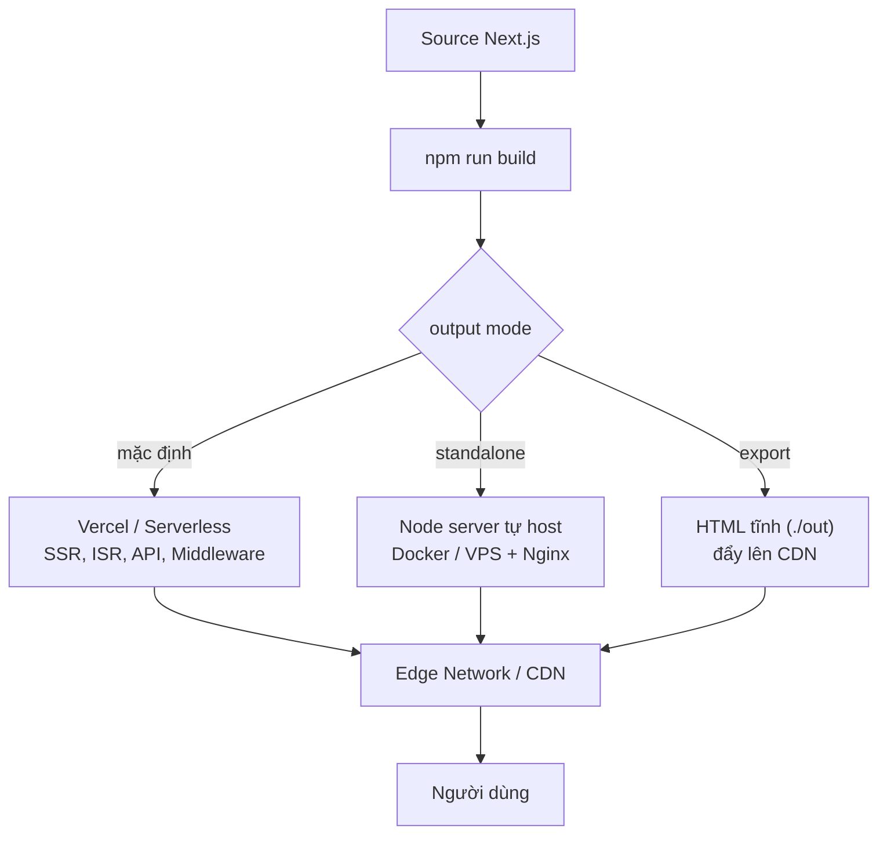

# Deployment Options

**Deployment** (triển khai) là quá trình đưa ứng dụng Next.js từ máy của bạn lên một máy chủ trực tuyến để mọi người có thể truy cập qua Internet. Bài này so sánh các nền tảng triển khai phổ biến như Vercel, Netlify, Cloudflare Pages và AWS Amplify. Với người mới, hiểu các lựa chọn này giúp bạn chọn nơi lưu trữ phù hợp với nhu cầu và ngân sách của dự án.

---

:::note[Ghi nhớ nhanh]

- ⭐ **Vercel là lựa chọn default** — từ team Next.js, zero-config, hỗ trợ đầy đủ nhất (SSR, ISR, Edge, Image Optimization, Preview).
- **`output` mode quyết định đường deploy**: mặc định (Vercel/serverless), `standalone` (tự host), `export` (HTML tĩnh).
- **Self-host** dùng `output: 'standalone'` + Node/Docker/Nginx — nhưng tự lo SSL, CDN, scaling, ISR cache.
- **Static export bỏ nhiều feature server** (SSR data, Server Actions, API routes, Middleware, ISR) — chỉ hợp blog/docs/portfolio.
- **Alternative**: Netlify, Cloudflare Pages (edge-first, free tier rộng), AWS Amplify (hệ sinh thái AWS).

:::

---

## Mục lục

- [Vì sao deploy Next.js cần lưu ý riêng?](#vì-sao-deploy-nextjs-cần-lưu-ý-riêng)
- [Vercel (khuyến nghị)](#vercel-khuyến-nghị)
- [Netlify](#netlify)
- [Cloudflare Pages](#cloudflare-pages)
- [AWS Amplify](#aws-amplify)
- [Self-hosted Node.js](#self-hosted-nodejs)
- [Docker](#docker)
- [Static Export](#static-export)
- [Câu hỏi phỏng vấn](#câu-hỏi-phỏng-vấn)

---

## Vì sao deploy Next.js cần lưu ý riêng?

**Vấn đề:**

Next.js **không chỉ là static site**. Một phần ứng dụng chạy ở **server**:

```
- SSR / ISR        → render trang lúc request, revalidate theo thời gian
- Route Handler    → /api/* xử lý logic backend
- Middleware       → chạy trước mỗi request (auth, redirect)
- Server Actions   → mutation chạy trên server
```

Nếu deploy như **web tĩnh thuần**, các tính năng động trên sẽ **mất**. Còn tự
host thì phải tự lo: chạy **Node server**, build output đúng cách, **biến môi
trường** production, **cache/ISR**, và **scale** khi traffic tăng.

**Giải pháp:**

Chọn cách deploy **khớp với khả năng app đang dùng**:

```ts
// next.config.ts

// 1. Self-host (Docker/VPS): gói gọn để chạy Node server
export default { output: "standalone" };

// 2. Site thuần tĩnh (KHÔNG dùng tính năng server)
export default { output: "export" };

// 3. Vercel: không cần config — tối ưu sẵn cho Next.js
export default {};
```

```bash
# Self-host standalone — chỉ cần Node, không cần cả node_modules
node .next/standalone/server.js

# Vercel — zero-config, auto detect Next.js
vercel
```

Tùy `output` mode chọn lúc build, cùng một source Next.js sẽ đi theo các đường triển khai khác nhau nhưng đều được phục vụ qua CDN tới người dùng:



:::tip[Dùng thực tế]

- **Deploy nhanh lên Vercel**: app có SSR/Server Actions → `vercel` hoặc
  connect GitHub, không cần cấu hình gì thêm.
- **Docker standalone tự host**: cần kiểm soát hạ tầng → `output: 'standalone'`
  gói gọn server vào image nhỏ, chạy `node server.js`.
- **Static export cho site thuần tĩnh**: blog/docs/portfolio không có
  auth/mutation → `output: 'export'` rồi đẩy `./out` lên CDN.
- **Cấu hình biến môi trường production**: tách env theo môi trường, set region
  gần user, và lưu ý ISR cache khác nhau giữa Vercel và self-host.

:::

---

## Vercel (khuyến nghị)

[Vercel](https://vercel.com) — từ team Next.js, **hỗ trợ đầy đủ nhất**.

**Deploy 1 click**:

```bash
npm install -g vercel
vercel
```

Hoặc connect GitHub → auto deploy mỗi push.

Tính năng built-in:

- **Edge Network** — CDN global.
- **Serverless Functions** — API routes auto deploy.
- **Edge Functions** — middleware + edge runtime.
- **Image Optimization** — built-in.
- **Web Analytics** + Speed Insights.
- **Preview Deployment** — mỗi PR có URL riêng.
- **ISR** + on-demand revalidation.
- **Cron jobs**, **Logs**, **Monitoring**.

```ts
// vercel.json
{
  "crons": [{
    "path": "/api/cron/cleanup",
    "schedule": "0 0 * * *"
  }]
}
```

:::info[Phân tích]

**Free tier Vercel đủ cho hầu hết hobby project**:

- 100GB bandwidth / month.
- 100GB-Hours Function execution.
- 1000 Image Optimization.
- Edge Functions: 500k execution.

Production app cần Pro ($20/user/month):

- Bandwidth unlimited (fair use).
- Function execution lớn hơn.
- Password protection.
- Team collaboration.

Vercel **deeply integrated** với Next.js — feature Next.js mới luôn ra
Vercel trước.

Trade-off:

- **Vendor lock-in** mức độ — một số feature (ISR cache, Edge Config)
  Vercel-specific.
- **Cost scale** — traffic lớn có thể đắt hơn AWS/Cloudflare.
- **Cold start** vẫn có (mạnh hơn Lambda nhưng không zero).

:::

---

## Netlify

```bash
npm install -g netlify-cli
netlify deploy --prod
```

Hỗ trợ Next.js qua **`@netlify/plugin-nextjs`** — auto setup.

Tính năng:

- Edge Functions.
- Image CDN.
- Forms (no code backend).
- Identity (auth).
- Split Testing.

So với Vercel: **support Next.js đầy đủ** nhưng có thể lag 1-2 phiên bản.
Trade-off: ecosystem rộng hơn cho non-Next.js (Astro, Hugo, Eleventy).

---

## Cloudflare Pages

Triển khai qua **Cloudflare Pages + Workers**:

```bash
npx wrangler pages deploy
```

Hoặc connect GitHub trong dashboard.

Đặc biệt:

- **Edge-first** — chạy gần user (300+ location).
- **Free tier rất rộng** — 100k req/day, không cap bandwidth.
- **Native Web Standards** — phù hợp Next.js Edge Runtime.
- **R2 storage** — S3-compat, không egress fee.

Limitation:

- Next.js Image Optimization cần config.
- Một số feature Node-only không work.
- ISR có support nhưng khác Vercel.

Phù hợp **edge-heavy app** hoặc **cost-conscious** project.

---

## AWS Amplify

```bash
npm install -g @aws-amplify/cli
amplify init
amplify hosting add
amplify publish
```

Hosting trên AWS với Next.js support full.

Phù hợp:

- App đã trong AWS ecosystem.
- Cần tích hợp Cognito, AppSync, S3.
- Enterprise compliance (SOC2, HIPAA).

Trade-off: setup phức tạp hơn Vercel, UI/UX kém hơn.

Alternative AWS:

- **SST.dev** — IaC framework cho Next.js trên AWS.
- **OpenNext.js** — adapter cho Lambda/CloudFront.

---

## Self-hosted Node.js

Chạy `npm start` trên bất kỳ Node server:

```bash
npm run build
npm start
# Mặc định port 3000
```

PM2 process manager:

```bash
npm install -g pm2
pm2 start npm --name "my-app" -- start
pm2 save
pm2 startup
```

Reverse proxy với Nginx:

```nginx
server {
  listen 80;
  server_name example.com;

  location / {
    proxy_pass http://localhost:3000;
    proxy_http_version 1.1;
    proxy_set_header Upgrade $http_upgrade;
    proxy_set_header Connection 'upgrade';
    proxy_set_header Host $host;
    proxy_cache_bypass $http_upgrade;
  }
}
```

Phù hợp:

- Control hoàn toàn hosting.
- Đã có infrastructure (VPS, K8s).
- Cost-sensitive — VPS $5/month không cap traffic.

Trade-off:

- Tự handle: SSL, CDN, scaling, monitoring, backup.
- Image Optimization không built-in — phải tự setup hoặc `unoptimized`.
- ISR cache local, không distributed.

---

## Docker

```dockerfile
# Dockerfile
FROM node:20-alpine AS deps
WORKDIR /app
COPY package*.json ./
RUN npm ci

FROM node:20-alpine AS builder
WORKDIR /app
COPY --from=deps /app/node_modules ./node_modules
COPY . .
RUN npm run build

FROM node:20-alpine AS runner
WORKDIR /app
ENV NODE_ENV=production
COPY --from=builder /app/.next/standalone ./
COPY --from=builder /app/.next/static ./.next/static
COPY --from=builder /app/public ./public

EXPOSE 3000
CMD ["node", "server.js"]
```

`next.config.ts`:

```ts
export default {
  output: "standalone", // tạo .next/standalone tự contained
};
```

Build + run:

```bash
docker build -t my-app .
docker run -p 3000:3000 my-app
```

Phù hợp:

- Deploy Kubernetes.
- CI/CD pipeline có Docker.
- Cần reproducibility.
- Multi-cloud strategy.

---

## Static Export

Export site thành **HTML/CSS/JS tĩnh** — host bất kỳ CDN:

```ts
// next.config.ts
export default {
  output: "export",
};
```

```bash
npm run build
# Tạo folder ./out với HTML tĩnh
```

Deploy lên:

- **GitHub Pages**.
- **Cloudflare Pages** (static mode).
- **Netlify** (static).
- **S3 + CloudFront**.
- **Surge, Render**.

:::warning[Cần lưu ý]

**Static export bỏ qua nhiều feature Next.js:**

- ❌ Server Components data fetching.
- ❌ Server Actions.
- ❌ API routes.
- ❌ Middleware.
- ❌ Dynamic routes runtime.
- ❌ ISR.
- ❌ `Image` optimization (cần `unoptimized: true`).
- ❌ `cookies()`, `headers()`, `searchParams`.

Phù hợp **content site tĩnh**: blog, docs, portfolio.

Không phù hợp **app có auth, mutation, real-time** — phải dùng deploy mode
khác.

:::

:::info[Phân tích]

**Lựa chọn deployment 2026**:

```
SaaS / Internal app / có Server Actions?
├─ Vercel (default, easiest)
├─ Netlify (alternative similar)
└─ Self-host Docker (control max)

Edge-heavy / global?
├─ Vercel (Edge Functions)
└─ Cloudflare Pages

AWS ecosystem?
├─ Amplify (managed)
└─ SST/OpenNext (self-managed)

Static content (blog, docs)?
├─ Static Export → CDN
└─ Vercel (vẫn OK, free tier rộng)

Cost-conscious / hobby?
├─ Vercel Free
├─ Cloudflare Pages Free
└─ Self-host VPS $5/month
```

**Vercel** là default cho phần lớn project — DX tốt nhất, support Next.js
đầy đủ. Migrate sang option khác khi cost hoặc compliance buộc.

:::

:::tip[Mẹo]

**Production deployment workflow**:

1. **Branch protection** — main không direct push.
2. **PR workflow**:
   - CI: lint, type-check, test.
   - Preview deploy (Vercel auto).
   - Review.
   - Merge.
3. **Auto deploy** từ main → production.
4. **Smoke test** sau deploy:
   - Health check endpoint.
   - Critical flow (login, checkout).
5. **Rollback ready**:
   - Vercel: 1-click revert deploy.
   - Self-host: git revert + redeploy.

Pattern này cover **fast iteration + safety**. Mỗi PR test isolated, main
luôn deployable.

:::

---

## Câu hỏi phỏng vấn

Những câu thường gặp về chủ đề này. Tự trả lời trước, rồi đối chiếu lại với nội dung phía trên.

1. Vì sao deploy Next.js khác với deploy một site tĩnh thuần? Những phần nào của ứng dụng bắt buộc phải chạy trên server?
2. Ba giá trị của `output` trong `next.config.ts` (mặc định, `standalone`, `export`) khác nhau ra sao, và mỗi cái sinh ra artifact gì?
3. `output: 'standalone'` giải quyết vấn đề gì khi đóng gói Docker? Vì sao image không cần copy cả `node_modules`?
4. Trong Dockerfile multi-stage ở bài, vì sao vẫn phải copy riêng `.next/static` và `public` sau khi đã copy `.next/standalone`?
5. Static export (`output: 'export'`) làm mất những tính năng nào? Kể ít nhất năm thứ và giải thích vì sao chúng không thể chạy khi không có server.
6. Khi nào bạn chọn Vercel, khi nào tự host? Nêu tiêu chí về chi phí, compliance và năng lực DevOps của đội.
7. `Vendor lock-in` với Vercel thể hiện ở đâu? Feature nào khó port sang nền tảng khác nhất?
8. `ISR` hoạt động khác nhau thế nào giữa Vercel và self-host nhiều instance? Vấn đề gì xảy ra khi cache không được chia sẻ giữa các instance?
9. Biến môi trường tiền tố `NEXT_PUBLIC_` khác biến chỉ dùng ở server ra sao? Hậu quả nếu đặt nhầm API key vào biến public là gì?
10. Biến môi trường nào bị "đóng băng" lúc build, biến nào đọc được lúc runtime? Điều đó ảnh hưởng thế nào khi muốn dùng chung một Docker image cho nhiều môi trường?
11. `Preview deployment` cho mỗi PR mang lại lợi ích gì trong quy trình review? Khi tự host bạn dựng lại cơ chế này bằng cách nào?
12. Tự host thì phải tự lo những gì mà Vercel làm sẵn? Kể theo nhóm: SSL, CDN, scaling, image optimization, logging và monitoring.
13. Vì sao cần reverse proxy (Nginx) đứng trước Node server? Các dòng `proxy_set_header` trong cấu hình mẫu phục vụ mục đích gì?
14. `Cold start` là gì trong mô hình serverless? Nó ảnh hưởng tới trải nghiệm ra sao và có những cách nào giảm nhẹ?
15. Chiến lược rollback khi bản deploy mới hỏng khác nhau thế nào giữa Vercel và self-host? Bạn chuẩn bị sẵn những gì trước khi deploy?
16. Cloudflare Pages và Workers hợp với loại app nào? Giới hạn nào của môi trường edge khiến một số code chỉ chạy được trên Node?
17. Vì sao Image Optimization là điểm đau khi tự host hoặc static export? Có những phương án thay thế nào?
18. Thiết kế `health check` và `smoke test` sau deploy như thế nào để phát hiện sớm bản hỏng trước khi người dùng gặp?
