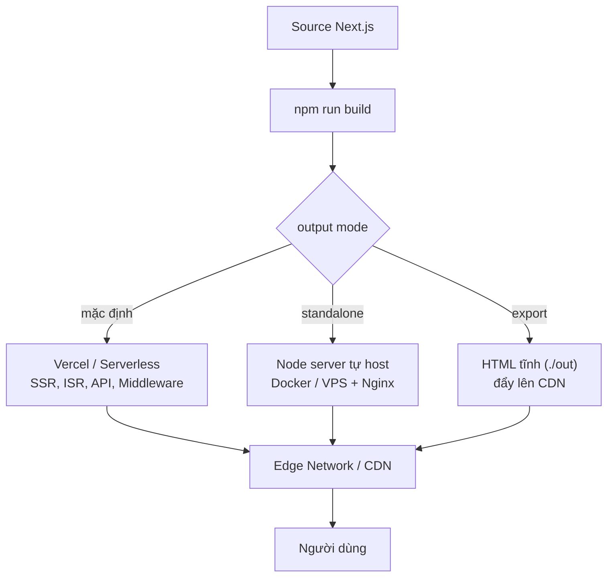

# Deployment Options

**Deployment** (triển khai) là quá trình đưa ứng dụng Next.js từ máy của bạn lên một máy chủ trực tuyến để mọi người có thể truy cập qua Internet. Bài này so sánh các nền tảng triển khai phổ biến như Vercel, Netlify, Cloudflare Pages và AWS Amplify. Với người mới, hiểu các lựa chọn này giúp bạn chọn nơi lưu trữ phù hợp với nhu cầu và ngân sách của dự án.

[](pathname:///img/nextjs/deployment.webp)

---

:::note[Ghi nhớ nhanh]

- ⭐ **Vercel là lựa chọn default** — từ team Next.js, zero-config, hỗ trợ đầy đủ nhất (SSR, ISR, Edge, Image Optimization, Preview).
- **`output` mode quyết định đường deploy**: mặc định (Vercel/serverless), `standalone` (tự host), `export` (HTML tĩnh).
- **Self-host** dùng `output: 'standalone'` + Node/Docker/Nginx — nhưng tự lo SSL, CDN, scaling, ISR cache.
- **Static export bỏ nhiều feature server** (SSR data, Server Actions, API routes, Middleware, ISR) — chỉ hợp blog/docs/portfolio.
- **Alternative**: Netlify, Cloudflare Pages (edge-first, free tier rộng), AWS Amplify (hệ sinh thái AWS).

:::

---

## Mục lục

- [Vì sao deploy Next.js cần lưu ý riêng?](#vì-sao-deploy-nextjs-cần-lưu-ý-riêng)
- [Vercel (khuyến nghị)](#vercel-khuyến-nghị)
- [Netlify](#netlify)
- [Cloudflare Pages](#cloudflare-pages)
- [AWS Amplify](#aws-amplify)
- [Self-hosted Node.js](#self-hosted-nodejs)
- [Docker](#docker)
- [Static Export](#static-export)
- [Câu hỏi phỏng vấn](#câu-hỏi-phỏng-vấn)

---

## Vì sao deploy Next.js cần lưu ý riêng?

**Vấn đề:**

Next.js **không chỉ là static site**. Một phần ứng dụng chạy ở **server**:

```
- SSR / ISR        → render trang lúc request, revalidate theo thời gian
- Route Handler    → /api/* xử lý logic backend
- Middleware       → chạy trước mỗi request (auth, redirect)
- Server Actions   → mutation chạy trên server
```

Nếu deploy như **web tĩnh thuần**, các tính năng động trên sẽ **mất**. Còn tự
host thì phải tự lo: chạy **Node server**, build output đúng cách, **biến môi
trường** production, **cache/ISR**, và **scale** khi traffic tăng.

**Giải pháp:**

Chọn cách deploy **khớp với khả năng app đang dùng**:

```ts
// next.config.ts

// 1. Self-host (Docker/VPS): gói gọn để chạy Node server
export default { output: "standalone" };

// 2. Site thuần tĩnh (KHÔNG dùng tính năng server)
export default { output: "export" };

// 3. Vercel: không cần config — tối ưu sẵn cho Next.js
export default {};
```

```bash
# Self-host standalone — chỉ cần Node, không cần cả node_modules
node .next/standalone/server.js

# Vercel — zero-config, auto detect Next.js
vercel
```

Tùy `output` mode chọn lúc build, cùng một source Next.js sẽ đi theo các đường triển khai khác nhau nhưng đều được phục vụ qua CDN tới người dùng:



:::tip[Dùng thực tế]

- **Deploy nhanh lên Vercel**: app có SSR/Server Actions → `vercel` hoặc
  connect GitHub, không cần cấu hình gì thêm.
- **Docker standalone tự host**: cần kiểm soát hạ tầng → `output: 'standalone'`
  gói gọn server vào image nhỏ, chạy `node server.js`.
- **Static export cho site thuần tĩnh**: blog/docs/portfolio không có
  auth/mutation → `output: 'export'` rồi đẩy `./out` lên CDN.
- **Cấu hình biến môi trường production**: tách env theo môi trường, set region
  gần user, và lưu ý ISR cache khác nhau giữa Vercel và self-host.

:::

---

## Vercel (khuyến nghị)

[Vercel](https://vercel.com) — từ team Next.js, **hỗ trợ đầy đủ nhất**.

**Deploy 1 click**:

```bash
npm install -g vercel
vercel
```

Hoặc connect GitHub → auto deploy mỗi push.

Tính năng built-in:

- **Edge Network** — CDN global.
- **Serverless Functions** — API routes auto deploy.
- **Edge Functions** — middleware + edge runtime.
- **Image Optimization** — built-in.
- **Web Analytics** + Speed Insights.
- **Preview Deployment** — mỗi PR có URL riêng.
- **ISR** + on-demand revalidation.
- **Cron jobs**, **Logs**, **Monitoring**.

```ts
// vercel.json
{
  "crons": [{
    "path": "/api/cron/cleanup",
    "schedule": "0 0 * * *"
  }]
}
```

:::info[Phân tích]

**Free tier Vercel đủ cho hầu hết hobby project**:

- 100GB bandwidth / month.
- 100GB-Hours Function execution.
- 1000 Image Optimization.
- Edge Functions: 500k execution.

Production app cần Pro ($20/user/month):

- Bandwidth unlimited (fair use).
- Function execution lớn hơn.
- Password protection.
- Team collaboration.

Vercel **deeply integrated** với Next.js — feature Next.js mới luôn ra
Vercel trước.

Trade-off:

- **Vendor lock-in** mức độ — một số feature (ISR cache, Edge Config)
  Vercel-specific.
- **Cost scale** — traffic lớn có thể đắt hơn AWS/Cloudflare.
- **Cold start** vẫn có (mạnh hơn Lambda nhưng không zero).

:::

---

## Netlify

```bash
npm install -g netlify-cli
netlify deploy --prod
```

Hỗ trợ Next.js qua **`@netlify/plugin-nextjs`** — auto setup.

Tính năng:

- Edge Functions.
- Image CDN.
- Forms (no code backend).
- Identity (auth).
- Split Testing.

So với Vercel: **support Next.js đầy đủ** nhưng có thể lag 1-2 phiên bản.
Trade-off: ecosystem rộng hơn cho non-Next.js (Astro, Hugo, Eleventy).

---

## Cloudflare Pages

Triển khai qua **Cloudflare Pages + Workers**:

```bash
npx wrangler pages deploy
```

Hoặc connect GitHub trong dashboard.

Đặc biệt:

- **Edge-first** — chạy gần user (300+ location).
- **Free tier rất rộng** — 100k req/day, không cap bandwidth.
- **Native Web Standards** — phù hợp Next.js Edge Runtime.
- **R2 storage** — S3-compat, không egress fee.

Limitation:

- Next.js Image Optimization cần config.
- Một số feature Node-only không work.
- ISR có support nhưng khác Vercel.

Phù hợp **edge-heavy app** hoặc **cost-conscious** project.

---

## AWS Amplify

```bash
npm install -g @aws-amplify/cli
amplify init
amplify hosting add
amplify publish
```

Hosting trên AWS với Next.js support full.

Phù hợp:

- App đã trong AWS ecosystem.
- Cần tích hợp Cognito, AppSync, S3.
- Enterprise compliance (SOC2, HIPAA).

Trade-off: setup phức tạp hơn Vercel, UI/UX kém hơn.

Alternative AWS:

- **SST.dev** — IaC framework cho Next.js trên AWS.
- **OpenNext.js** — adapter cho Lambda/CloudFront.

---

## Self-hosted Node.js

Chạy `npm start` trên bất kỳ Node server:

```bash
npm run build
npm start
# Mặc định port 3000
```

PM2 process manager:

```bash
npm install -g pm2
pm2 start npm --name "my-app" -- start
pm2 save
pm2 startup
```

Reverse proxy với Nginx:

```nginx
server {
  listen 80;
  server_name example.com;

  location / {
    proxy_pass http://localhost:3000;
    proxy_http_version 1.1;
    proxy_set_header Upgrade $http_upgrade;
    proxy_set_header Connection 'upgrade';
    proxy_set_header Host $host;
    proxy_cache_bypass $http_upgrade;
  }
}
```

Phù hợp:

- Control hoàn toàn hosting.
- Đã có infrastructure (VPS, K8s).
- Cost-sensitive — VPS $5/month không cap traffic.

Trade-off:

- Tự handle: SSL, CDN, scaling, monitoring, backup.
- Image Optimization không built-in — phải tự setup hoặc `unoptimized`.
- ISR cache local, không distributed.

---

## Docker

```dockerfile
# Dockerfile
FROM node:20-alpine AS deps
WORKDIR /app
COPY package*.json ./
RUN npm ci

FROM node:20-alpine AS builder
WORKDIR /app
COPY --from=deps /app/node_modules ./node_modules
COPY . .
RUN npm run build

FROM node:20-alpine AS runner
WORKDIR /app
ENV NODE_ENV=production
COPY --from=builder /app/.next/standalone ./
COPY --from=builder /app/.next/static ./.next/static
COPY --from=builder /app/public ./public

EXPOSE 3000
CMD ["node", "server.js"]
```

`next.config.ts`:

```ts
export default {
  output: "standalone", // tạo .next/standalone tự contained
};
```

Build + run:

```bash
docker build -t my-app .
docker run -p 3000:3000 my-app
```

Phù hợp:

- Deploy Kubernetes.
- CI/CD pipeline có Docker.
- Cần reproducibility.
- Multi-cloud strategy.

---

## Static Export

Export site thành **HTML/CSS/JS tĩnh** — host bất kỳ CDN:

```ts
// next.config.ts
export default {
  output: "export",
};
```

```bash
npm run build
# Tạo folder ./out với HTML tĩnh
```

Deploy lên:

- **GitHub Pages**.
- **Cloudflare Pages** (static mode).
- **Netlify** (static).
- **S3 + CloudFront**.
- **Surge, Render**.

:::warning[Cần lưu ý]

**Static export bỏ qua nhiều feature Next.js:**

- ❌ Server Components data fetching.
- ❌ Server Actions.
- ❌ API routes.
- ❌ Middleware.
- ❌ Dynamic routes runtime.
- ❌ ISR.
- ❌ `Image` optimization (cần `unoptimized: true`).
- ❌ `cookies()`, `headers()`, `searchParams`.

Phù hợp **content site tĩnh**: blog, docs, portfolio.

Không phù hợp **app có auth, mutation, real-time** — phải dùng deploy mode
khác.

:::

:::info[Phân tích]

**Lựa chọn deployment 2026**:

```
SaaS / Internal app / có Server Actions?
├─ Vercel (default, easiest)
├─ Netlify (alternative similar)
└─ Self-host Docker (control max)

Edge-heavy / global?
├─ Vercel (Edge Functions)
└─ Cloudflare Pages

AWS ecosystem?
├─ Amplify (managed)
└─ SST/OpenNext (self-managed)

Static content (blog, docs)?
├─ Static Export → CDN
└─ Vercel (vẫn OK, free tier rộng)

Cost-conscious / hobby?
├─ Vercel Free
├─ Cloudflare Pages Free
└─ Self-host VPS $5/month
```

**Vercel** là default cho phần lớn project — DX tốt nhất, support Next.js
đầy đủ. Migrate sang option khác khi cost hoặc compliance buộc.

:::

:::tip[Mẹo]

**Production deployment workflow**:

1. **Branch protection** — main không direct push.
2. **PR workflow**:
   - CI: lint, type-check, test.
   - Preview deploy (Vercel auto).
   - Review.
   - Merge.
3. **Auto deploy** từ main → production.
4. **Smoke test** sau deploy:
   - Health check endpoint.
   - Critical flow (login, checkout).
5. **Rollback ready**:
   - Vercel: 1-click revert deploy.
   - Self-host: git revert + redeploy.

Pattern này cover **fast iteration + safety**. Mỗi PR test isolated, main
luôn deployable.

:::

---

## Câu hỏi phỏng vấn

Những câu thường gặp về chủ đề này. Tự trả lời trước, rồi bấm **Xem đáp án** để đối chiếu.

**1. Vì sao deploy Next.js khác với deploy một site tĩnh thuần? Những phần nào của ứng dụng bắt buộc phải chạy trên server?**

<details className="qa">
<summary>Xem đáp án</summary>

Site tĩnh thuần chỉ cần đẩy file HTML/CSS/JS lên CDN là xong. Next.js thì ngoài phần tĩnh còn có một **phần bắt buộc chạy trên server**, nên hạ tầng phải có nơi thực thi JavaScript phía server chứ không chỉ phục vụ file.

Những phần cần server:

- **SSR / ISR** — render trang tại thời điểm request, hoặc render lại theo chu kỳ revalidate.
- **Route Handler (`/api/*`)** — xử lý logic backend, nhận request và trả response.
- **Middleware** — chạy trước mỗi request để kiểm tra auth, redirect, rewrite.
- **Server Actions** — mutation thực thi trên server.
- **Server Component fetch dữ liệu**, cùng các API phụ thuộc request như `cookies()`, `headers()`.
- **Image Optimization** — resize và chuyển định dạng ảnh theo yêu cầu.

Vì vậy nếu deploy như web tĩnh thuần, toàn bộ những tính năng trên biến mất. Điều cần quyết định sớm là: app dùng những tính năng nào, từ đó chọn `output` mode và nền tảng tương ứng.

</details>

**2. Ba giá trị của `output` trong `next.config.ts` (mặc định, `standalone`, `export`) khác nhau ra sao, và mỗi cái sinh ra artifact gì?**

<details className="qa">
<summary>Xem đáp án</summary>

| `output` | Artifact sinh ra | Cần gì để chạy | Dùng khi |
|---|---|---|---|
| *(mặc định)* | Thư mục `.next` đầy đủ, chạy bằng `next start`; nền tảng như Vercel tự cắt thành serverless/edge function | Node + `node_modules` đầy đủ, hoặc adapter của nền tảng | Deploy lên Vercel/Netlify, hoặc chạy `next start` trên server sẵn có |
| `standalone` | `.next/standalone/` gồm `server.js` và **chỉ những dependency thực sự được dùng** | Chỉ cần Node runtime | Docker, Kubernetes, VPS — cần image nhỏ và gói gọn |
| `export` | Thư mục `./out/` chứa HTML/CSS/JS tĩnh | Bất kỳ static host/CDN nào | Blog, docs, portfolio — không dùng tính năng server |

```ts
export default { output: "standalone" }; // tự host
export default { output: "export" };     // site tĩnh
export default {};                       // Vercel, zero-config
```

Điểm mấu chốt: `standalone` vẫn giữ **toàn bộ** tính năng server (SSR, API route, Middleware, Server Actions), chỉ khác ở cách đóng gói; còn `export` thì **loại bỏ** các tính năng đó vì không có server nào chạy.

</details>

**3. `output: 'standalone'` giải quyết vấn đề gì khi đóng gói Docker? Vì sao image không cần copy cả `node_modules`?**

<details className="qa">
<summary>Xem đáp án</summary>

Vấn đề: một Docker image Next.js làm theo cách ngây thơ phải copy cả `node_modules` — thường vài trăm MB tới hơn 1GB, chứa đầy devDependency, file test, source map, tài liệu của thư viện. Image to thì build lâu, đẩy/kéo chậm, tốn tiền lưu trữ và mở rộng bề mặt tấn công.

`output: 'standalone'` giải quyết bằng cách **phân tích đồ thị phụ thuộc** lúc build (dựa trên công cụ trace của Vercel): Next lần theo các lệnh `require`/`import` thực sự được dùng trong runtime server, rồi copy đúng những file đó vào `.next/standalone`, kèm một `server.js` khởi động sẵn.

Kết quả:

- Image thường nhỏ đi nhiều lần vì bỏ toàn bộ devDependency và phần không dùng tới của các package.
- Runtime chỉ cần Node — không chạy `npm install` trong tầng cuối, không cần `next` CLI.
- Khởi động bằng `CMD ["node", "server.js"]` thay vì `next start`.

Lưu ý: phải bật `output: "standalone"` **trước khi build**, và vẫn phải copy thêm hai thư mục tĩnh (xem câu sau).

</details>

**4. Trong Dockerfile multi-stage ở bài, vì sao vẫn phải copy riêng `.next/static` và `public` sau khi đã copy `.next/standalone`?**

<details className="qa">
<summary>Xem đáp án</summary>

Vì quá trình trace chỉ gom những file mà **code server cần để chạy**. `.next/static` (JS/CSS đã build, có hash trong tên) và `public` (ảnh, favicon, robots.txt) là **tài sản tĩnh gửi thẳng tới trình duyệt**, không nằm trong đồ thị `require` nào cả, nên trace không thấy và không copy.

Next để vậy có chủ ý: kịch bản khuyến nghị là đẩy hai thư mục này lên CDN và để CDN phục vụ, còn container chỉ lo phần động. Nhưng nếu bạn muốn container tự phục vụ luôn (trường hợp phổ biến), phải copy tay:

```dockerfile
COPY --from=builder /app/.next/standalone ./
COPY --from=builder /app/.next/static ./.next/static
COPY --from=builder /app/public ./public
```

Triệu chứng khi quên: trang trả HTML nhưng không có CSS và JS, console báo 404 cho các file trong `/_next/static/...`, giao diện vỡ và không tương tác được; quên `public` thì ảnh và favicon 404. Thứ tự cũng quan trọng — copy `standalone` trước để nó không ghi đè hai thư mục kia.

</details>

**5. Static export (`output: 'export'`) làm mất những tính năng nào? Kể ít nhất năm thứ và giải thích vì sao chúng không thể chạy khi không có server.**

<details className="qa">
<summary>Xem đáp án</summary>

Sau khi export, sản phẩm chỉ còn file tĩnh trong `./out` — không có tiến trình nào chạy khi người dùng truy cập, nên mọi thứ cần xử lý tại thời điểm request đều mất:

- **Server Actions** — là lời gọi POST tới server để thực hiện mutation; không có server thì không có endpoint nhận.
- **Route Handler (`/api/*`)** — bản chất là hàm chạy theo request.
- **Middleware** — chạy trước mỗi request để redirect/rewrite; CDN chỉ trả file có sẵn.
- **ISR và SSR** — cần render lại theo thời gian hoặc theo request; export chỉ render một lần lúc build.
- **`cookies()`, `headers()`, `searchParams` phía server** — đây là dữ liệu của từng request, mà lúc build chưa có request nào.
- **Image Optimization** — cần server resize ảnh theo kích thước yêu cầu, nên phải đặt `unoptimized: true` hoặc dùng loader ngoài.
- **Dynamic route không xác định trước** — mọi đường dẫn phải liệt kê được qua `generateStaticParams` lúc build.

Vì vậy export chỉ hợp với blog, docs, portfolio. App có đăng nhập, mutation hay dữ liệu thay đổi liên tục phải chọn mode khác.

</details>

**6. Khi nào bạn chọn Vercel, khi nào tự host? Nêu tiêu chí về chi phí, compliance và năng lực DevOps của đội.**

<details className="qa">
<summary>Xem đáp án</summary>

| Tiêu chí | Nghiêng về Vercel | Nghiêng về tự host |
|---|---|---|
| **Chi phí** | Traffic vừa và nhỏ; free tier hoặc Pro rẻ hơn nhiều so với lương một DevOps | Traffic rất lớn, nhiều băng thông/ảnh — lúc đó VPS hoặc AWS thường rẻ hơn đáng kể |
| **Compliance** | Yêu cầu thông thường | Bắt buộc dữ liệu nằm trong nước, mạng nội bộ, hoặc chuẩn riêng của ngành |
| **Năng lực đội** | Đội nhỏ, không có DevOps chuyên trách | Đã có hạ tầng (K8s, VPS) và người vận hành |
| **Tính năng Next** | Cần đầy đủ và mới nhất (ISR phân tán, Image Optimization, Preview) | Chấp nhận tự dựng lại các phần đó |
| **Tốc độ ra sản phẩm** | Nhanh nhất — zero-config, preview mỗi PR | Chậm hơn, cần dựng pipeline |

Cách chọn thực dụng: **mặc định là Vercel**, vì chi phí kỹ thuật ẩn của tự host (SSL, CDN, scaling, monitoring, backup, on-call) thường lớn hơn hoá đơn. Chuyển sang tự host khi có lý do rõ ràng — hoá đơn vượt chi phí vận hành, hoặc ràng buộc pháp lý/hạ tầng buộc phải làm vậy. Giữ app chạy được bằng `output: "standalone"` ngay từ đầu giúp việc chuyển đổi sau này đỡ đau.

</details>

**7. `Vendor lock-in` với Vercel thể hiện ở đâu? Feature nào khó port sang nền tảng khác nhất?**

<details className="qa">
<summary>Xem đáp án</summary>

Bản thân mã nguồn Next.js là mã nguồn mở và chạy được chỗ khác, nên lock-in ở đây là **mức độ**, không phải tuyệt đối. Nó nằm ở các dịch vụ hạ tầng bao quanh:

- **ISR và cache phân tán** — Vercel có hạ tầng cache dùng chung cho mọi instance, kèm on-demand revalidation qua `revalidateTag`/`revalidatePath`. Tự dựng lại phần này (cache handler tuỳ biến với Redis) là việc khó nhất và dễ sai nhất.
- **Image Optimization** — service resize ảnh kèm CDN, tính vào hạn mức của Vercel; tự host phải tự dựng hoặc mua dịch vụ ngoài.
- **Edge Middleware / Edge Functions** chạy trên runtime riêng của Vercel.
- **Edge Config, KV, Blob, Cron, Analytics/Speed Insights, Preview Deployment** — tiện nhưng đều là API riêng.

Khó port nhất là **ISR cache phân tán** và **Image Optimization**, vì chúng là dịch vụ hạ tầng chứ không phải mã nguồn.

Giảm rủi ro: hạn chế dùng API riêng của nền tảng trong code nghiệp vụ, giữ khả năng build bằng `standalone`, và biết tới các adapter thay thế như OpenNext (Lambda/CloudFront) hoặc SST.

</details>

**8. `ISR` hoạt động khác nhau thế nào giữa Vercel và self-host nhiều instance? Vấn đề gì xảy ra khi cache không được chia sẻ giữa các instance?**

<details className="qa">
<summary>Xem đáp án</summary>

Trên Vercel, cache ISR nằm ở **tầng hạ tầng dùng chung**: mọi instance đọc và ghi cùng một kho, nên một lần revalidate là toàn hệ thống thấy nội dung mới.

Khi tự host, mặc định Next lưu cache ISR vào **hệ thống file cục bộ** của từng instance. Với nhiều container sau load balancer, mỗi instance có một bản cache riêng:

- **Nội dung không nhất quán** — người dùng F5 vài lần có thể thấy lúc nội dung mới, lúc nội dung cũ, tuỳ rơi vào instance nào.
- **`revalidateTag`/`revalidatePath` chỉ tác dụng lên instance nhận request đó**, các instance khác vẫn phục vụ bản cũ cho tới khi tự hết hạn.
- **Lãng phí** — mỗi instance tự render lại cùng một trang, tăng tải lên DB/API.
- **Mất cache khi scale** — container mới khởi động với cache rỗng; container bị thay thế mang cache đi mất.

Cách xử lý: cấu hình **cache handler tuỳ biến** (`cacheHandler` trong `next.config`) trỏ vào một store dùng chung như Redis, và tắt cache trong bộ nhớ của từng instance. Nếu chỉ chạy một instance thì mặc định vẫn ổn.

</details>

**9. Biến môi trường tiền tố `NEXT_PUBLIC_` khác biến chỉ dùng ở server ra sao? Hậu quả nếu đặt nhầm API key vào biến public là gì?**

<details className="qa">
<summary>Xem đáp án</summary>

- **Biến không có tiền tố**: chỉ tồn tại trong tiến trình server. Code client đọc `process.env.X` sẽ nhận `undefined` — giá trị không bao giờ rời khỏi server.
- **Biến có tiền tố `NEXT_PUBLIC_`**: được bundler **thay thế bằng giá trị literal ngay lúc build** và nằm trong file JS gửi xuống trình duyệt. Tiền tố chính là lời khai báo tường minh "biến này là công khai".

Hậu quả khi đặt nhầm API key (ví dụ `NEXT_PUBLIC_STRIPE_SECRET_KEY`):

- Khoá nằm nguyên văn trong bundle — chỉ cần mở DevTools hoặc `curl` file JS là đọc được, không cần kỹ năng gì.
- Bot quét mã nguồn công khai tìm thấy rất nhanh; khoá có thể bị dùng để rút tiền, gọi API tính phí, hoặc truy cập dữ liệu.
- Xoá biến đi **không đủ** — bundle cũ có thể còn trong cache CDN, trong lịch sử build, trong Git.

Xử lý khi đã lỡ: **rotate khoá ngay lập tức**, rà soát log xem có bị lạm dụng chưa, rồi mới sửa code. Phòng ngừa: `server-only` cho module nhạy cảm, secret scanning trong CI, và review kỹ mọi lần thêm biến `NEXT_PUBLIC_*`.

</details>

**10. Biến môi trường nào bị "đóng băng" lúc build, biến nào đọc được lúc runtime? Điều đó ảnh hưởng thế nào khi muốn dùng chung một Docker image cho nhiều môi trường?**

<details className="qa">
<summary>Xem đáp án</summary>

- **Đóng băng lúc build**: mọi biến `NEXT_PUBLIC_*` (bị inline thành chuỗi trong bundle client), và cả biến server nào được đọc trong quá trình prerender trang tĩnh — giá trị lúc build sẽ nằm luôn trong HTML đã render sẵn.
- **Đọc được lúc runtime**: biến server dùng trong code chạy theo request — Route Handler, Server Action, Server Component của trang dynamic, Middleware. Những chỗ này đọc `process.env` của tiến trình đang chạy, nên đổi biến rồi restart container là có hiệu lực.

Ảnh hưởng tới mô hình "build once, deploy anywhere": nếu build image với `NEXT_PUBLIC_API_URL` của staging thì image đó vĩnh viễn trỏ về staging, dù bạn truyền biến khác lúc `docker run`.

Cách xử lý:

- Đưa cấu hình client xuống **lúc runtime**: Route Handler `/api/config` đọc biến server và trả JSON, hoặc Server Component đọc rồi truyền xuống props.
- Dùng **đường dẫn tương đối** (`/api/...`) và để proxy/rewrite trỏ sang backend từng môi trường — thường là cách gọn nhất.
- Nếu chấp nhận đánh đổi, build image riêng cho từng môi trường.

</details>

**11. `Preview deployment` cho mỗi PR mang lại lợi ích gì trong quy trình review? Khi tự host bạn dựng lại cơ chế này bằng cách nào?**

<details className="qa">
<summary>Xem đáp án</summary>

Lợi ích:

- **Reviewer xem được sản phẩm thật**, không phải đọc diff rồi tưởng tượng; bắt được lỗi giao diện, luồng bấm sai, responsive vỡ.
- **Người không code cũng tham gia được** — designer, PM, QA chỉ cần mở link.
- **Môi trường gần production** (bản build thật) nên lộ ra lỗi mà `next dev` giấu.
- **Nơi chạy E2E tự động** trước khi merge, và mỗi PR độc lập nên không giẫm chân nhau.

Tự dựng lại khi self-host:

- CI build Docker image cho mỗi PR, tag theo số PR, deploy lên namespace/cluster tạm.
- Cấp subdomain wildcard theo PR, ví dụ `pr-123.preview.example.com`, qua ingress hoặc reverse proxy.
- Bot bình luận link vào PR; **tự động dọn** môi trường khi PR đóng để khỏi tốn tài nguyên.
- Dùng DB riêng cho preview (schema tạm hoặc bản seed), không bao giờ trỏ vào DB production.
- Bảo vệ bằng basic auth hoặc VPN để preview không bị index và lộ ra ngoài.

Chi phí dựng và vận hành phần này chính là một trong những lý do chính khiến nhiều đội chọn nền tảng managed.

</details>

**12. Tự host thì phải tự lo những gì mà Vercel làm sẵn? Kể theo nhóm: SSL, CDN, scaling, image optimization, logging và monitoring.**

<details className="qa">
<summary>Xem đáp án</summary>

- **SSL/TLS**: xin và **tự động gia hạn** chứng chỉ (Let's Encrypt qua certbot/Caddy/Traefik), cấu hình HSTS, chuyển hướng HTTP sang HTTPS. Quên gia hạn là site sập.
- **CDN**: đặt CDN trước server, cấu hình cache cho `/_next/static` (bất biến, cache dài) và cho ảnh; xử lý purge khi deploy. Không có CDN thì người dùng ở xa chịu độ trễ lớn.
- **Scaling**: dựng nhiều instance, load balancer, health check, auto-scaling theo tải; xử lý deploy không downtime (rolling update) và cache ISR dùng chung giữa các instance.
- **Image Optimization**: cài `sharp`, dành CPU/bộ nhớ cho việc resize, cache ảnh đã tối ưu — hoặc chuyển sang dịch vụ ảnh bên ngoài, hoặc chấp nhận `unoptimized`.
- **Logging**: gom log từ nhiều container về một nơi (ELK, Loki, CloudWatch), log có cấu trúc kèm `requestId`, đặt chính sách lưu trữ.
- **Monitoring**: uptime check, dashboard metric (tỷ lệ lỗi, độ trễ, CPU/RAM), alert và lịch trực; thêm error tracking và đo Web Vitals từ người dùng thật.

Kèm theo là **backup + thử phục hồi**, vá bảo mật hệ điều hành, và quy trình rollback. Đây là công việc liên tục, không phải cấu hình một lần.

</details>

**13. Vì sao cần reverse proxy (Nginx) đứng trước Node server? Các dòng `proxy_set_header` trong cấu hình mẫu phục vụ mục đích gì?**

<details className="qa">
<summary>Xem đáp án</summary>

Vai trò của reverse proxy:

- **Kết thúc TLS** — Nginx giữ chứng chỉ, Node chỉ chạy HTTP ở cổng 3000 trong mạng nội bộ.
- **Chạy ở cổng 80/443** và ẩn cổng thật; một máy phục vụ nhiều domain/ứng dụng.
- **Load balancing** sang nhiều tiến trình Node, kèm health check.
- **Phục vụ file tĩnh, nén gzip/brotli, cache, rate limit, chặn IP** — hiệu quả hơn nhiều so với để Node làm.
- **Lớp đệm an toàn**: đặt giới hạn kích thước body, timeout, che bớt server ứng dụng khỏi Internet.

Các header trong cấu hình mẫu:

- `proxy_http_version 1.1` — bật HTTP/1.1, điều kiện cần để nâng cấp kết nối.
- `proxy_set_header Upgrade $http_upgrade` và `Connection 'upgrade'` — chuyển tiếp yêu cầu nâng cấp giao thức, giúp **WebSocket** (và HMR lúc dev) hoạt động qua proxy.
- `proxy_set_header Host $host` — giữ nguyên hostname người dùng gõ; thiếu nó thì ứng dụng thấy `localhost`, khiến redirect, canonical URL và cookie domain đều sai.
- `proxy_cache_bypass $http_upgrade` — không lấy từ cache với request nâng cấp giao thức.

Thực tế nên thêm `X-Forwarded-For` và `X-Forwarded-Proto` để ứng dụng biết IP thật và biết client đang dùng HTTPS.

</details>

**14. `Cold start` là gì trong mô hình serverless? Nó ảnh hưởng tới trải nghiệm ra sao và có những cách nào giảm nhẹ?**

<details className="qa">
<summary>Xem đáp án</summary>

Serverless không giữ tiến trình chạy liên tục: khi không có request, instance bị thu hồi. Request tới lúc đó phải chờ nền tảng **khởi tạo lại từ đầu** — cấp môi trường, tải mã, khởi động runtime, chạy code khởi tạo (kết nối DB, đọc config) — trước khi xử lý. Độ trễ thêm đó gọi là **cold start**, thường từ vài trăm mili-giây tới vài giây.

Ảnh hưởng: người dùng đầu tiên sau giai đoạn rảnh thấy trang tải chậm bất thường; TTFB và LCP xấu đi; ảnh hưởng nặng nhất với site ít traffic hoặc traffic phân bố không đều (và với API nội bộ gọi chuỗi nhiều function thì cộng dồn).

Cách giảm nhẹ:

- **Giảm kích thước bundle của function** và số dependency — ít mã thì nạp nhanh.
- **Tránh việc nặng ở phạm vi module**; khởi tạo lười (lazy) và tái sử dụng kết nối giữa các lần gọi.
- **Dùng connection pooler** cho DB thay vì mở kết nối mới mỗi lần.
- **Edge runtime** khởi động nhanh hơn nhiều so với Node runtime, phù hợp cho middleware và endpoint đơn giản.
- **Prerender/ISR** cho trang đọc nhiều — trang tĩnh phục vụ từ CDN thì không chạm tới function.
- Chọn **region gần người dùng và gần database**.

</details>

**15. Chiến lược rollback khi bản deploy mới hỏng khác nhau thế nào giữa Vercel và self-host? Bạn chuẩn bị sẵn những gì trước khi deploy?**

<details className="qa">
<summary>Xem đáp án</summary>

| | Vercel | Self-host |
|---|---|---|
| Cách rollback | Bấm promote lại deployment cũ — mỗi bản build là bất biến và vẫn còn URL riêng | Deploy lại image/tag trước đó (`kubectl rollout undo`, đổi tag container), hoặc `git revert` rồi build lại |
| Thời gian | Vài giây, không build lại | Vài giây nếu giữ sẵn image cũ; vài phút nếu phải build lại |
| Rủi ro | Thấp | Phụ thuộc vào việc có giữ artifact cũ và pipeline có tự động hay không |

Chuẩn bị trước khi deploy:

- **Artifact bất biến, đánh version** — luôn giữ vài bản trước để quay lại ngay, không phải build lại từ source.
- **Migration DB tương thích ngược** (thêm cột trước, bỏ cột ở lần sau): code rollback được nhưng schema thì không, nên đây là điểm dễ chết nhất.
- **Feature flag** để tắt tính năng hỏng mà không cần rollback cả bản.
- **Backup DB mới và đã thử phục hồi**.
- **Runbook**: ai được bấm rollback, ngưỡng nào thì bấm (ví dụ 5xx vượt 1% trong 5 phút), báo ở kênh nào.
- **Smoke test tự động** chạy ngay sau deploy để phát hiện sớm.
- Deploy dần (canary/rolling) thay vì đổi toàn bộ một lúc, và tránh deploy lớn cuối ngày.

</details>

**16. Cloudflare Pages và Workers hợp với loại app nào? Giới hạn nào của môi trường edge khiến một số code chỉ chạy được trên Node?**

<details className="qa">
<summary>Xem đáp án</summary>

Hợp với: app **edge-heavy** cần độ trễ thấp cho người dùng toàn cầu, app chủ yếu đọc dữ liệu/định tuyến/cá nhân hoá nhẹ, dự án **quan tâm chi phí** (free tier rộng, không tính phí egress cho R2), và app viết theo Web Standards. Không hợp với workload nặng phía Node hoặc phụ thuộc nhiều thư viện Node-only.

Giới hạn của môi trường edge:

- **Không có Node API đầy đủ** — không `fs`, `net`, `child_process`, `dns`; nhiều package npm phổ biến vì thế không chạy (driver DB dùng TCP thuần, thư viện crypto native, `sharp`).
- **Không có native addon** (mã C++ biên dịch sẵn).
- **Giới hạn kích thước bundle** và **giới hạn thời gian CPU** mỗi request — không hợp tác vụ tính toán nặng hay chạy dài.
- **Không có hệ thống file ghi được và không có state giữa các request** — phải dùng KV/R2/D1 hoặc dịch vụ ngoài.
- Kết nối DB thường phải đi qua **HTTP proxy/driver serverless** thay vì kết nối TCP trực tiếp.

Vì vậy Next.js phân biệt `nodejs` và `edge` runtime: đặt middleware và endpoint đơn giản lên edge, còn phần cần Node thì giữ ở Node runtime.

</details>

**17. Vì sao Image Optimization là điểm đau khi tự host hoặc static export? Có những phương án thay thế nào?**

<details className="qa">
<summary>Xem đáp án</summary>

`<Image>` của Next hoạt động nhờ một **service phía server**: nhận yêu cầu kèm kích thước và định dạng, resize ảnh gốc, chuyển sang WebP/AVIF, rồi cache kết quả. Trên Vercel đây là hạ tầng có sẵn kèm CDN.

Khó khăn khi tự host:

- Phải cài `sharp` và dành **CPU cùng bộ nhớ** cho việc resize — tốn kém và có thể làm nghẽn server khi traffic tăng.
- Cần **cache ảnh đã tối ưu** ở nơi bền vững; nếu để trong container thì mất mỗi lần deploy hoặc scale, và mỗi instance lại tự xử lý lại.
- Là **bề mặt tấn công**: endpoint tối ưu ảnh nếu không giới hạn domain và kích thước có thể bị lạm dụng làm nơi xử lý ảnh miễn phí.

Với static export thì đơn giản là **không có server nào để resize**.

Phương án thay thế:

- **Custom loader** trỏ sang dịch vụ ảnh (Cloudinary, imgix, Cloudflare Images, ImageKit) — họ lo resize và CDN.
- **CDN có tính năng tối ưu ảnh** đặt trước ứng dụng.
- **`unoptimized: true`** kèm việc tự chuẩn bị sẵn ảnh nhiều kích thước lúc build — chấp nhận thủ công hơn.
- Tự dựng một service resize riêng, tách khỏi tiến trình chính, có cache ở object storage.

Dù chọn cách nào vẫn nên giữ `width`/`height` để tránh layout shift.

</details>

**18. Thiết kế `health check` và `smoke test` sau deploy như thế nào để phát hiện sớm bản hỏng trước khi người dùng gặp?**

<details className="qa">
<summary>Xem đáp án</summary>

**Health check** — endpoint nhẹ cho load balancer/orchestrator gọi liên tục. Nên tách hai loại:

- *Liveness*: tiến trình còn sống không — trả 200 ngay, không chạm dependency.
- *Readiness*: đã sẵn sàng nhận traffic chưa — kiểm tra kết nối DB, cache, các dependency bắt buộc.

```ts
// app/api/health/route.ts
export async function GET() {
  try {
    await db.$queryRaw`SELECT 1`;
    return Response.json({ status: "ok", version: process.env.APP_VERSION });
  } catch {
    return Response.json({ status: "degraded" }, { status: 503 });
  }
}
```

Nguyên tắc: phải nhanh (dưới vài trăm ms), không cần auth nhưng **không lộ thông tin nội bộ**, và không kiểm tra dependency không thiết yếu để tránh báo hỏng dây chuyền.

**Smoke test** — bộ test tự động chạy ngay sau khi deploy, phủ vài luồng sống còn: trang chủ trả 200 và có nội dung, đăng nhập/đăng xuất, một API quan trọng, một luồng nghiệp vụ chính. Chạy trên môi trường vừa deploy, giữ dưới vài phút và cực kỳ ổn định (test smoke flaky thì vô dụng).

Ghép vào pipeline: deploy staging → smoke test → promote production → smoke test lại → theo dõi tỷ lệ lỗi và độ trễ trong 30 phút đầu; vượt ngưỡng đã định thì rollback tự động.

</details>
