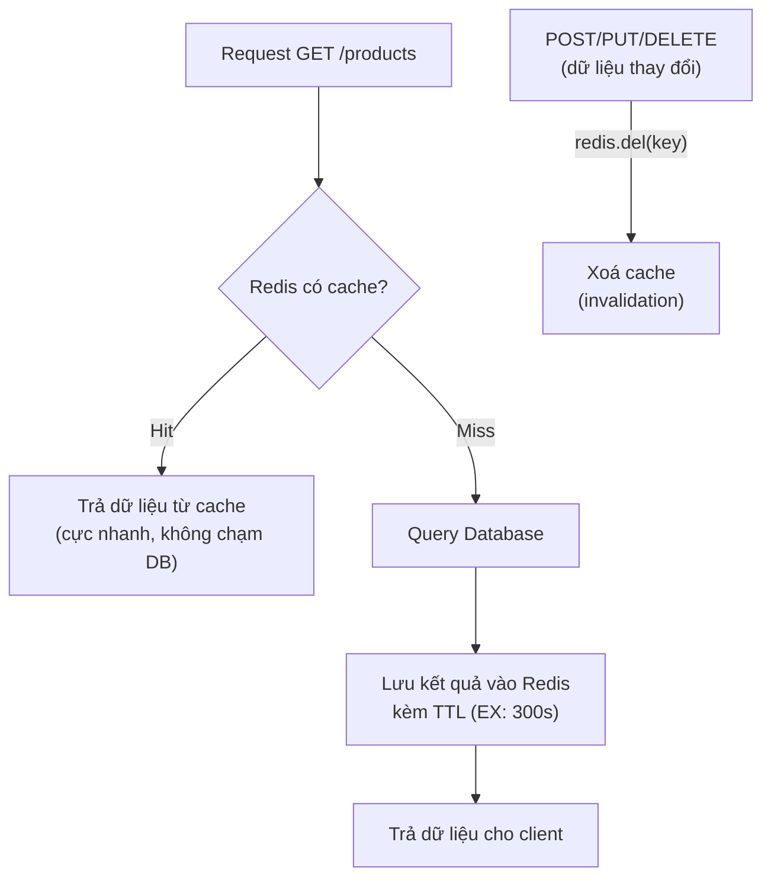

# Redis & Caching

Redis là kho dữ liệu lưu trong bộ nhớ (in-memory) nên tốc độ truy xuất cực nhanh, thường được dùng để caching, lưu session hay giới hạn tốc độ truy cập. Khi cache lại kết quả tốn công tính toán, ứng dụng phản hồi nhanh hơn và giảm tải cho database. Bài này hướng dẫn cách kết nối Redis, dùng các lệnh cơ bản, viết cache middleware và xử lý việc xoá cache khi dữ liệu thay đổi.

---

## Mục lục

- [Vì sao cần Redis caching?](#vì-sao-cần-redis-caching)
- [Redis là gì?](#redis-là-gì)
- [Cài đặt](#cài-đặt)
- [Kết nối](#kết-nối)
- [Các lệnh cơ bản](#các-lệnh-cơ-bản)
- [Cache Middleware](#cache-middleware)
- [Cache Invalidation](#cache-invalidation)
- [Tóm tắt](#tóm-tắt)

---

## Vì sao cần Redis caching?

**Vấn đề:**

```js
// Cùng một dữ liệu (trang chủ, danh mục) bị query lại nhiều lần
app.get('/products', async (req, res) => {
  // Mỗi request đều đánh thẳng vào DB
  const products = await Product.find().limit(100);
  res.json(products);
});
// Khi lượng truy cập lớn → DB phải lặp lại cùng query tốn thời gian
// → phản hồi chậm, DB tải nặng và dễ nghẽn
```

**Giải pháp:**

```js
// Redis: kho dữ liệu in-memory cực nhanh, dùng làm CACHE
app.get('/products', async (req, res) => {
  const key = 'cache:/products';

  // Cache-aside: đọc cache trước
  const cached = await redis.get(key);
  if (cached) return res.json(JSON.parse(cached));

  // Miss → query DB rồi lưu lại với TTL
  const products = await Product.find().limit(100);
  await redis.set(key, JSON.stringify(products), { EX: 300 });
  res.json(products);
});
// → giảm tải DB, tăng tốc phản hồi
```

Luồng cache-aside: đọc cache trước, miss thì mới đánh xuống database; khi dữ liệu thay đổi phải xoá cache:



:::tip[Dùng thực tế]
- **Cache query nóng:** lưu kết quả query tốn kém với TTL để đọc lại tức thì.
- **Session store:** lưu session đăng nhập, chia sẻ giữa nhiều instance.
- **Rate limiting:** đếm số request theo IP/user để chặn lạm dụng.
- **Queue & pub/sub:** hàng đợi job và truyền tin giữa các service.
:::

## Redis là gì?

Redis là **in-memory data store** cực nhanh, dùng cho caching, session storage, rate limiting, pub/sub.

## Cài đặt

```bash
npm install redis
```

## Kết nối

```js
const { createClient } = require('redis');

const redis = createClient({
  url: process.env.REDIS_URL || 'redis://localhost:6379',
});

redis.on('error', err => console.error('Redis error:', err));

await redis.connect();
console.log('Redis connected');
```

## Các lệnh cơ bản

```js
// String
await redis.set('key', 'value');
await redis.set('key', 'value', { EX: 3600 }); // Expire sau 1 giờ
const value = await redis.get('key');

// JSON (lưu object)
await redis.set('user:1', JSON.stringify({ name: 'Alice', age: 25 }));
const user = JSON.parse(await redis.get('user:1'));

// Delete
await redis.del('key');

// Check exists
const exists = await redis.exists('key');
```

## Cache Middleware

```js
function cache(ttlSeconds) {
  return async (req, res, next) => {
    const key = `cache:${req.originalUrl}`;

    const cached = await redis.get(key);
    if (cached) {
      return res.json(JSON.parse(cached));
    }

    // Override res.json để cache response
    const originalJson = res.json.bind(res);
    res.json = (data) => {
      redis.set(key, JSON.stringify(data), { EX: ttlSeconds });
      return originalJson(data);
    };

    next();
  };
}

// Cache endpoint 5 phút
router.get('/products', cache(300), productController.getAll);
```

## Cache Invalidation

```js
// Xoá cache khi data thay đổi
router.post('/products', async (req, res) => {
  const product = await Product.create(req.body);

  // Invalidate cache
  await redis.del('cache:/api/products');

  res.status(201).json(product);
});
```

## Tóm tắt

- Redis cực nhanh cho caching và session storage
- Set TTL (Time To Live) để auto-expire
- Cache middleware giúp cache API responses
- Luôn invalidate cache khi data thay đổi
