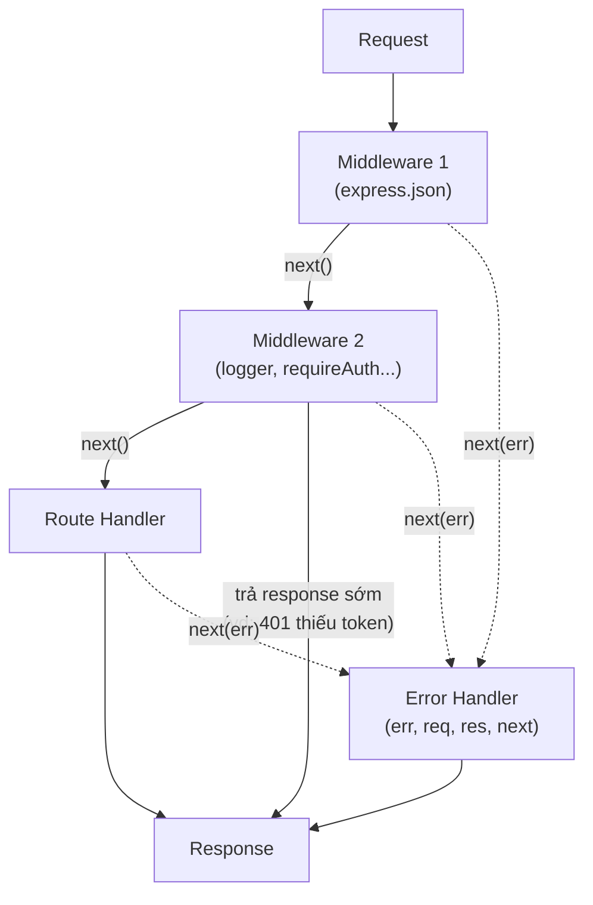

# Middleware trong Express

Middleware là những hàm trung gian xử lý request theo chuỗi trước khi tới route handler, ví dụ như ghi log, kiểm tra đăng nhập hay parse dữ liệu. Hiểu middleware giúp bạn tổ chức ứng dụng Express gọn gàng và tái sử dụng được nhiều phần xử lý chung. Bài này giải thích cấu trúc middleware, các loại built-in và third-party, cách viết middleware riêng, và lưu ý quan trọng về thứ tự.

---

## Mục lục

- [Vì sao có middleware?](#vì-sao-có-middleware)
- [Middleware là gì?](#middleware-là-gì)
- [Cấu trúc Middleware](#cấu-trúc-middleware)
- [Application-level Middleware](#application-level-middleware)
- [Built-in Middleware](#built-in-middleware)
- [Third-party Middleware phổ biến](#third-party-middleware-phổ-biến)
- [Custom Middleware thực tế](#custom-middleware-thực-tế)
- [Error Handling Middleware](#error-handling-middleware)
- [Thứ tự Middleware quan trọng](#thứ-tự-middleware-quan-trọng)
- [Tóm tắt](#tóm-tắt)

---

## Vì sao có middleware?

**Vấn đề:** Nhiều route cần CÙNG xử lý trước/sau như nhau: ghi log, kiểm tra đăng nhập, parse body, bật CORS, đo thời gian. Nếu nhét các đoạn này vào TỪNG handler thì code bị lặp khắp nơi và rất khó bảo trì.

```js
// Mỗi route lặp lại cùng một logic
app.get('/users', (req, res) => {
  console.log(`${req.method} ${req.url}`); // log
  if (!req.headers.authorization) return res.status(401).end(); // auth
  // ...xử lý chính
});

app.get('/products', (req, res) => {
  console.log(`${req.method} ${req.url}`); // log (lặp)
  if (!req.headers.authorization) return res.status(401).end(); // auth (lặp)
  // ...xử lý chính
});
```

**Giải pháp:** Middleware là các hàm `(req, res, next)` xếp thành CHUỖI xử lý request. Mỗi middleware làm một việc rồi gọi `next()` để chuyển tiếp. Viết một lần, tái sử dụng, gắn toàn cục hoặc theo từng route.

```js
// Viết một lần, dùng lại khắp nơi
const logger = (req, res, next) => {
  console.log(`${req.method} ${req.url}`);
  next();
};

const requireAuth = (req, res, next) => {
  if (!req.headers.authorization) return res.status(401).end();
  next();
};

app.use(logger); // gắn toàn cục cho mọi route

app.get('/users', requireAuth, (req, res) => {
  // chỉ còn xử lý chính
});

app.get('/products', requireAuth, (req, res) => {
  // chỉ còn xử lý chính
});
```

:::tip[Dùng thực tế]

- **Logger toàn cục:** `app.use(logger)` ghi log mọi request ở một chỗ.
- **Auth bảo vệ route:** `app.get('/profile', requireAuth, ...)` chặn request chưa đăng nhập.
- **Parse body:** `app.use(express.json())` tự đọc JSON vào `req.body`.
- **Bảo mật & CORS:** `app.use(helmet())`, `app.use(cors())` và error-handling middleware đặt cuối để bắt lỗi tập trung.

:::

## Middleware là gì?

Middleware là hàm có quyền truy cập `req`, `res`, và hàm `next()`. Chúng xử lý request theo chuỗi (pipeline).

```
Request → Middleware 1 → Middleware 2 → Route Handler → Response
```

Sơ đồ chuỗi middleware — mỗi hàm gọi `next()` để chuyển tiếp, hoặc trả response sớm, hoặc đẩy lỗi xuống error handler:



## Cấu trúc Middleware

```js
function myMiddleware(req, res, next) {
  // Xử lý gì đó...
  console.log(`${req.method} ${req.url}`);

  // Chuyển sang middleware tiếp theo
  next();
}
```

## Application-level Middleware

```js
const express = require('express');
const app = express();

// Áp dụng cho TẤT CẢ routes
app.use((req, res, next) => {
  console.log(`[${new Date().toISOString()}] ${req.method} ${req.url}`);
  next();
});

// Áp dụng cho path cụ thể
app.use('/api', (req, res, next) => {
  console.log('API request');
  next();
});
```

## Built-in Middleware

```js
// Parse JSON body
app.use(express.json());

// Parse URL-encoded body (form data)
app.use(express.urlencoded({ extended: true }));

// Serve static files
app.use(express.static('public'));
```

## Third-party Middleware phổ biến

```bash
npm install cors helmet morgan
```

```js
const cors = require('cors');
const helmet = require('helmet');
const morgan = require('morgan');

// CORS — Cross-Origin Resource Sharing
app.use(cors());

// Helmet — Security headers
app.use(helmet());

// Morgan — HTTP request logger
app.use(morgan('dev'));
```

## Custom Middleware thực tế

### Request Logger

```js
function requestLogger(req, res, next) {
  const start = Date.now();

  res.on('finish', () => {
    const duration = Date.now() - start;
    console.log(`${req.method} ${req.url} ${res.statusCode} - ${duration}ms`);
  });

  next();
}

app.use(requestLogger);
```

### Auth Middleware

```js
function requireAuth(req, res, next) {
  const token = req.headers['authorization']?.split(' ')[1];

  if (!token) {
    return res.status(401).json({ error: 'Token required' });
  }

  try {
    const decoded = jwt.verify(token, process.env.JWT_SECRET);
    req.user = decoded;
    next();
  } catch {
    res.status(401).json({ error: 'Invalid token' });
  }
}

// Áp dụng cho routes cần auth
app.get('/profile', requireAuth, (req, res) => {
  res.json({ user: req.user });
});
```

## Error Handling Middleware

Error middleware có **4 tham số** `(err, req, res, next)`:

```js
// Đặt SAU tất cả routes
app.use((err, req, res, next) => {
  console.error(err.stack);
  res.status(err.status || 500).json({
    error: {
      message: err.message || 'Internal Server Error',
    },
  });
});
```

## Thứ tự Middleware quan trọng

```js
// 1. Built-in & third-party middleware
app.use(express.json());
app.use(cors());
app.use(morgan('dev'));

// 2. Custom middleware
app.use(requestLogger);

// 3. Routes
app.use('/api/users', userRouter);
app.use('/api/products', productRouter);

// 4. 404 handler
app.use((req, res) => {
  res.status(404).json({ error: 'Not Found' });
});

// 5. Error handler (LUÔN ở cuối)
app.use((err, req, res, next) => {
  res.status(500).json({ error: err.message });
});
```

## Tóm tắt

- Middleware là hàm xử lý request theo chuỗi
- Gọi `next()` để chuyển sang middleware tiếp theo
- Thứ tự `app.use()` rất quan trọng
- Error middleware có 4 tham số, đặt cuối cùng
