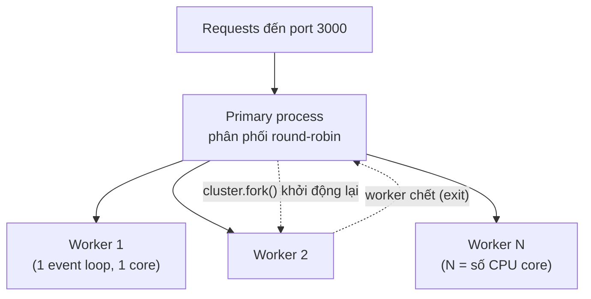

# Performance Optimization

Tối ưu hiệu năng giúp ứng dụng Node.js phản hồi nhanh hơn và phục vụ được nhiều người dùng hơn. Bài này giới thiệu các kỹ thuật như nén response, chạy đa tiến trình (clustering), caching, streaming dữ liệu lớn và giám sát hệ thống. Hiểu các cách này giúp bạn tránh nghẽn và tận dụng tối đa tài nguyên server.

---

:::note[Ghi nhớ nhanh]

- ⭐ **Node chạy một luồng, đừng block event loop** — việc nặng CPU đồng bộ sẽ treo mọi request; đẩy sang `worker_threads` hoặc queue.
- ⭐ **`Clustering`/PM2 tận dụng đa core** — `cluster.fork()` theo số CPU, mỗi worker là một process riêng chia sẻ cùng port.
- **`compression()` giảm bandwidth** — nén Gzip response để truyền nhẹ hơn.
- **Cache kết quả nặng** — dùng in-memory `Map` (hoặc Redis) để khỏi tính lại, giảm tải database.
- **Stream cho file lớn** — dùng `createReadStream().pipe(res)` thay `readFileSync` để không nổ RAM.
- **Monitor** — theo dõi event loop lag và `process.memoryUsage()` để phát hiện nghẽn, rò rỉ bộ nhớ.

:::

---

## Mục lục

- [Vì sao cần tối ưu hiệu năng Node?](#vì-sao-cần-tối-ưu-hiệu-năng-node)
- [Compression](#compression)
- [Clustering](#clustering)
- [Caching Strategies](#caching-strategies)
- [Streaming cho large data](#streaming-cho-large-data)
- [Monitoring](#monitoring)
- [Checklist Performance](#checklist-performance)
- [Tóm tắt](#tóm-tắt)

---

## Vì sao cần tối ưu hiệu năng Node?

Node chạy JavaScript trên **một luồng duy nhất** với một event loop. Nếu xử lý việc nặng CPU đồng bộ ngay trong luồng này, mọi request khác sẽ bị treo cho đến khi việc đó xong.

**Vấn đề:**

```js
// Việc nặng CPU chạy đồng bộ -> BLOCK event loop
app.get('/report', (req, res) => {
  let total = 0;
  for (let i = 0; i < 5_000_000_000; i++) {
    total += i; // Vòng lặp lớn chiếm trọn luồng
  }
  res.json({ total });
});
// Trong lúc /report chạy: mọi request khác (kể cả /health) đều bị treo.
// Server cũng chỉ dùng 1 core, còn rò rỉ bộ nhớ thì làm chậm dần theo thời gian.
```

**Giải pháp:**

```js
// 1. Đẩy việc nặng sang worker_threads (không chặn event loop chính)
const { Worker } = require('worker_threads');

app.get('/report', (req, res) => {
  const worker = new Worker('./report-worker.js');
  worker.on('message', (total) => res.json({ total }));
  worker.on('error', (err) => res.status(500).json({ error: err.message }));
});

// 2. Cluster/PM2 để dùng hết nhiều core (xem mục Clustering)
// 3. Cache kết quả nóng để khỏi tính lại (xem mục Caching Strategies)
// 4. Stream dữ liệu lớn thay vì nạp hết vào RAM (xem mục Streaming)
```

:::tip[Dùng thực tế]

- Xử lý ảnh/nén/mã hoá nặng: đẩy sang `worker_threads` hoặc hàng đợi (queue) để luồng chính vẫn phục vụ request.
- API nhiều người dùng: bật cluster hoặc chạy PM2 cluster để tận dụng tất cả CPU core.
- Endpoint trả dữ liệu tốn công tính: cache kết quả (vd Redis) để các lần sau lấy ngay, giảm tải database.
- Tải/xuất file lớn (CSV, log, video): dùng stream thay vì `readFileSync` để không nổ RAM.

:::

## Compression

```bash
npm install compression
```

```js
const compression = require('compression');
app.use(compression()); // Gzip response
```

## Clustering

Tận dụng tất cả CPU cores:

```js
const cluster = require('cluster');
const os = require('os');

if (cluster.isPrimary) {
  const numCPUs = os.cpus().length;
  console.log(`Primary ${process.pid} starting ${numCPUs} workers`);

  for (let i = 0; i < numCPUs; i++) {
    cluster.fork();
  }

  cluster.on('exit', (worker) => {
    console.log(`Worker ${worker.process.pid} died. Restarting...`);
    cluster.fork();
  });
} else {
  const app = require('./app');
  app.listen(3000, () => {
    console.log(`Worker ${process.pid} started`);
  });
}
```

Mô hình cluster: primary fork ra N worker (mỗi worker là một process Node riêng với event loop riêng), cùng chia sẻ port 3000:



## Caching Strategies

```js
// In-memory cache đơn giản
const cache = new Map();

function cacheMiddleware(ttl) {
  return (req, res, next) => {
    const key = req.originalUrl;
    const cached = cache.get(key);

    if (cached && Date.now() - cached.timestamp < ttl) {
      return res.json(cached.data);
    }

    const originalJson = res.json.bind(res);
    res.json = (data) => {
      cache.set(key, { data, timestamp: Date.now() });
      return originalJson(data);
    };

    next();
  };
}
```

## Streaming cho large data

```js
const fs = require('fs');

// BAD: Đọc toàn bộ file vào memory
app.get('/download', (req, res) => {
  const data = fs.readFileSync('large-file.csv');
  res.send(data); // Tốn RAM!
});

// GOOD: Stream file
app.get('/download', (req, res) => {
  const stream = fs.createReadStream('large-file.csv');
  res.setHeader('Content-Type', 'text/csv');
  stream.pipe(res); // Stream trực tiếp, không tốn RAM
});
```

## Monitoring

```bash
# Built-in profiler
node --prof app.js

# Memory usage
process.memoryUsage();

# Event loop lag
const start = Date.now();
setImmediate(() => {
  const lag = Date.now() - start;
  console.log(`Event loop lag: ${lag}ms`);
});
```

## Checklist Performance

- [ ] Compression enabled
- [ ] Cluster mode hoặc PM2 cluster
- [ ] Database queries optimized (indexes, N+1)
- [ ] Caching cho heavy queries
- [ ] Stream cho large files
- [ ] Connection pooling
- [ ] Avoid synchronous operations

## Tóm tắt

- Compression giảm bandwidth
- Clustering tận dụng multi-core
- Cache responses để giảm database load
- Stream cho large data thay vì load vào memory
- Monitor event loop lag và memory usage
