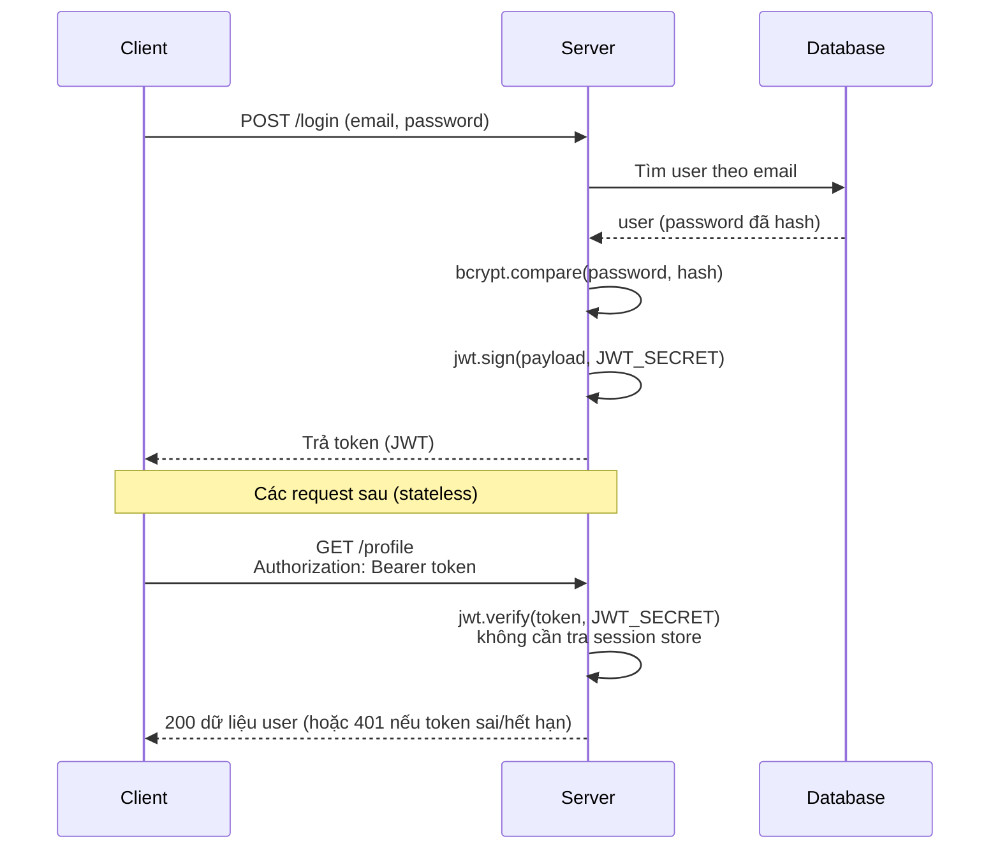

# JWT Authentication

JWT (JSON Web Token) là cách phổ biến để xác thực người dùng trong ứng dụng Node.js mà không cần lưu session trên server. Bài này hướng dẫn bạn dùng JWT cùng bcrypt để làm chức năng đăng ký, đăng nhập và bảo vệ route bằng middleware. Đây là nền tảng quan trọng cho bất kỳ API nào cần biết "người dùng này là ai".

---

:::note[Ghi nhớ nhanh]

- ⭐ **JWT cho xác thực stateless** — token được ký số tự chứa thông tin user, server chỉ cần verify chữ ký, không cần lưu session → scale ngang dễ.
- **`jwt.sign` / `jwt.verify`** — tạo token với `JWT_SECRET` và `expiresIn`; xác minh khi có request.
- **Hash password bằng bcrypt** — salt rounds >= 12, đăng nhập dùng `bcrypt.compare` để so khớp.
- **Gửi token qua header** — `Authorization: Bearer <token>`; middleware `requireAuth` tách và verify token để bảo vệ route.
- **Access + refresh token** — access token sống ngắn cho an toàn; không lưu dữ liệu nhạy cảm trong payload.

:::

---

## Mục lục

- [JWT là gì?](#jwt-là-gì)
- [Vì sao dùng JWT?](#vì-sao-dùng-jwt)
- [Cài đặt](#cài-đặt)
- [Đăng ký (Register)](#đăng-ký-register)
- [Đăng nhập (Login)](#đăng-nhập-login)
- [Auth Middleware](#auth-middleware)
- [Tóm tắt](#tóm-tắt)

---

## JWT là gì?

**JSON Web Token** (JWT) là chuẩn mở để truyền thông tin an toàn giữa các bên dưới dạng JSON object, được ký số (signed).

Cấu trúc: `header.payload.signature`

## Vì sao dùng JWT?

**Vấn đề:** Xác thực bằng **session lưu ở server**: mỗi request phải tra cứu session trong bộ nhớ/DB của server. Khi scale ra nhiều server, các server phải **chia sẻ session store** (sticky session hoặc Redis) → phức tạp, khó scale ngang, và khó dùng cho API/mobile có nhiều loại client.

```js
// Session: server phải lưu và tra cứu state cho mỗi request
const session = await sessionStore.get(req.cookies.sid);
if (!session) return res.status(401).json({ error: 'Not logged in' });
req.user = session.user; // Cần store dùng chung khi có nhiều server
```

**Giải pháp:** JWT là token được **ký số**, **tự chứa** thông tin user (claims). Server chỉ cần **xác minh chữ ký** (stateless), không cần lưu session → scale ngang dễ, hợp với API/mobile/microservice. Đánh đổi: khó thu hồi trước hạn → dùng **access token ngắn hạn + refresh token**.

```js
// JWT: token tự chứa thông tin, server chỉ verify chữ ký (stateless)
const decoded = jwt.verify(token, process.env.JWT_SECRET);
req.user = decoded; // Không cần truy vấn store nào cả
```

Luồng xác thực JWT đầy đủ, từ đăng nhập đến truy cập route được bảo vệ:



:::tip[Dùng thực tế]

- **API stateless nhiều server:** không cần session store dùng chung, scale ngang thoải mái.
- **Đăng nhập mobile/SPA:** client giữ token và gửi kèm mỗi request, không phụ thuộc cookie.
- **Chia sẻ auth giữa microservice:** mỗi service tự verify token bằng secret/public key.
- **Access + refresh token:** access token sống ngắn cho an toàn, refresh token cấp lại token mới.

:::

## Cài đặt

```bash
npm install jsonwebtoken bcryptjs
```

## Đăng ký (Register)

```js
const bcrypt = require('bcryptjs');
const jwt = require('jsonwebtoken');

router.post('/register', async (req, res) => {
  const { name, email, password } = req.body;

  // Kiểm tra email đã tồn tại
  const existing = await User.findOne({ email });
  if (existing) {
    return res.status(400).json({ error: 'Email already exists' });
  }

  // Hash password
  const salt = await bcrypt.genSalt(12);
  const hashedPassword = await bcrypt.hash(password, salt);

  // Tạo user
  const user = await User.create({
    name,
    email,
    password: hashedPassword,
  });

  // Tạo JWT
  const token = jwt.sign(
    { id: user.id, email: user.email },
    process.env.JWT_SECRET,
    { expiresIn: '7d' }
  );

  res.status(201).json({ token, user: { id: user.id, name, email } });
});
```

## Đăng nhập (Login)

```js
router.post('/login', async (req, res) => {
  const { email, password } = req.body;

  // Tìm user
  const user = await User.findOne({ email });
  if (!user) {
    return res.status(401).json({ error: 'Invalid credentials' });
  }

  // So sánh password
  const isMatch = await bcrypt.compare(password, user.password);
  if (!isMatch) {
    return res.status(401).json({ error: 'Invalid credentials' });
  }

  // Tạo JWT
  const token = jwt.sign(
    { id: user.id, email: user.email },
    process.env.JWT_SECRET,
    { expiresIn: '7d' }
  );

  res.json({ token });
});
```

## Auth Middleware

```js
function requireAuth(req, res, next) {
  const authHeader = req.headers['authorization'];
  const token = authHeader?.split(' ')[1]; // "Bearer <token>"

  if (!token) {
    return res.status(401).json({ error: 'Access token required' });
  }

  try {
    const decoded = jwt.verify(token, process.env.JWT_SECRET);
    req.user = decoded;
    next();
  } catch (err) {
    return res.status(401).json({ error: 'Invalid or expired token' });
  }
}

// Protected route
router.get('/profile', requireAuth, async (req, res) => {
  const user = await User.findById(req.user.id).select('-password');
  res.json(user);
});
```

## Tóm tắt

- JWT cho stateless authentication
- Luôn hash password với bcrypt (salt rounds >= 12)
- Token gửi qua `Authorization: Bearer <token>`
- Middleware `requireAuth` bảo vệ routes
- Không lưu sensitive data trong JWT payload
