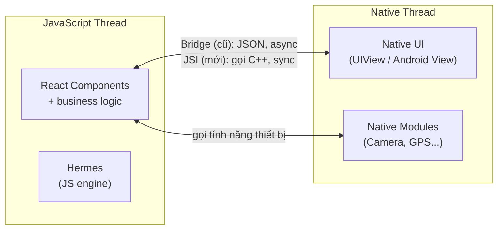

# Giới thiệu React Native

**React Native** là framework do **Meta** (Facebook) phát triển -- cho phép viết app mobile **iOS, Android** (và cả Web, Windows, macOS) bằng **JavaScript/TypeScript + React**. Một codebase, nhiều platform.

**Tương tự đơn giản:** Trước React Native, muốn làm app vừa iOS vừa Android phải viết **2 lần** -- Swift cho iOS, Kotlin cho Android. React Native giống **một "phiên dịch viên"** -- bạn viết bằng JS, framework dịch ra component native của từng OS. App vẫn **chạy mượt như native** vì các UI element là native thật.

---

:::note[Ghi nhớ nhanh]

- ⭐ **RN = một codebase JS/TS + React, render ra UI native THẬT** — Meta phát triển, chạy iOS/Android (và web, desktop).
- ⭐ **New Architecture (JSI + Fabric + TurboModules)** — thay Bridge cũ (JSON, async) bằng gọi C++ trực tiếp, đồng bộ, nhanh hơn.
- **Không phải WebView (khác Ionic), cũng không tự vẽ canvas (khác Flutter)** — dùng native component thật + hệ sinh thái npm.
- **Mọi text phải nằm trong `<Text>`, style là object** — không có `<div>`/CSS như web.
- **Nên bắt đầu với Expo + TypeScript + Hermes** — Hermes là JS engine tối ưu mobile (start nhanh, app nhẹ), mặc định từ RN 0.70+.

:::

---

## Mục lục

- [Vì sao React Native ra đời?](#vì-sao-react-native-ra-đời)
- [1. React Native là gì?](#1-react-native-là-gì)
- [2. Tại sao dùng React Native?](#2-tại-sao-dùng-react-native)
- [3. Kiến trúc cơ bản](#3-kiến-trúc-cơ-bản)
- [4. Alternatives -- các framework khác](#4-alternatives-các-framework-khác)
- [5. Lịch sử và xu hướng](#5-lịch-sử-và-xu-hướng)
- [Khi nào dùng?](#khi-nào-dùng)
- [Lỗi thường gặp](#lỗi-thường-gặp)
- [Câu hỏi phỏng vấn](#câu-hỏi-phỏng-vấn)

---

## Vì sao React Native ra đời?

**Vấn đề:** Làm app native "chuẩn" buộc phải viết **2 codebase riêng** -- Swift/Objective-C cho iOS, Kotlin/Java cho Android. Cùng một màn hình phải code 2 lần, cần 2 đội, tốn gấp đôi thời gian và chi phí, dễ lệch tính năng giữa 2 nền tảng. Hướng "web nhúng" như Cordova/Ionic gói app trong **WebView** thì rẻ hơn nhưng trải nghiệm **không thật sự native** -- cuộn giật, animation kém mượt, cảm giác như mở website trong app.

**Giải pháp:** React Native cho phép viết **một lần** bằng React/JavaScript, nhưng render ra **component native THẬT** (không phải WebView) cho cả iOS lẫn Android. Nhờ vậy chia sẻ được phần lớn code, tái dùng kiến thức React, và iterate nhanh nhờ hot reload.

```tsx
import { View, Text } from 'react-native';

// Viet MOT lan -> chay tren ca iOS va Android voi UI native that
export default function Welcome() {
  return (
    <View>
      <Text>Mot codebase, render native ca 2 nen tang</Text>
    </View>
  );
}
```

Khác với Flutter (Dart + tự vẽ UI bằng canvas), React Native dùng **JS + UI native** và đứng trên hệ sinh thái JS/npm khổng lồ.

:::tip[Dùng thực tế]

- **App cross-platform tiết kiệm chi phí:** cần cả iOS + Android nhưng ngân sách giới hạn, một đội ship cả hai.
- **Đội web React chuyển sang mobile:** tái dùng kiến thức React, lên tay nhanh mà không phải học Swift/Kotlin từ đầu.
- **MVP mobile nhanh:** dựng sản phẩm thử nghiệm gọn nhẹ, iterate liên tục nhờ hot reload.
- **Chia sẻ logic web ↔ app:** dùng lại business logic, validation, state giữa web React và app mobile.

:::

---

## 1. React Native là gì?

React Native (RN) là framework UI cho mobile. Đặc điểm chính:

- **JavaScript + React** -- viết component giống React web
- **Native UI thật** -- không phải WebView, không phải canvas vẽ lại
- **Cross-platform** -- iOS, Android dùng chung code (~85-95%)
- **Hot reload** -- sửa code thấy ngay

```jsx
import { View, Text } from 'react-native';

export default function App() {
  return (
    <View>
      <Text>Xin chao React Native!</Text>
    </View>
  );
}
```

`<View>` dịch thành `UIView` trên iOS, `android.view.View` trên Android. Khác hoàn toàn web `<div>`.

---

## 2. Tại sao dùng React Native?

| Lợi ích                | Giải thích                                     |
| ---------------------- | ---------------------------------------------- |
| **Một codebase**       | iOS + Android cùng code, giảm 50% effort       |
| **Reuse skills**       | Dev React web học RN rất nhanh                 |
| **Performance native**| Native UI, không phải WebView                  |
| **Hot Reload**         | Iterate nhanh -- không build lại               |
| **Ecosystem JS**       | Tận dụng npm package, Expo                     |
| **Community lớn**      | Meta + Microsoft + Shopify maintain            |

### Ai đang dùng?

Facebook, Instagram, Messenger, Discord, Shopify, Microsoft Teams, Walmart, Tesla, Coinbase, Uber Eats...

---

## 3. Kiến trúc cơ bản

```
[JavaScript Thread]              [Native Thread]
    |                                |
    | React Components               | Native UI (UIView/View)
    | Business logic                 | Native modules (Camera, GPS...)
    |                                |
    +------- Bridge / JSI -----------+
              (giao tiep 2 chieu)
```



**Giải thích thuật ngữ:**

- **Bridge** (kiến trúc cũ): cầu nối JS ↔ Native qua message JSON, async
- **JSI (JavaScript Interface)** (kiến trúc mới, "New Architecture"): JS gọi C++ trực tiếp, đồng bộ, nhanh hơn
- **Fabric**: renderer mới của RN
- **TurboModules**: native module thế hệ mới qua JSI
- **Hermes**: JS engine của RN (thay JSC, V8) -- nhẹ, start nhanh

So sánh cách giao tiếp giữa hai kiến trúc — điểm nghẽn của Bridge cũ là phải tuần tự hoá JSON và chạy bất đồng bộ:

```mermaid
flowchart TB
    subgraph Old["Kiến trúc cũ (Bridge)"]
        direction LR
        JS1["JS"] -->|"tuần tự hoá JSON<br/>(async, có độ trễ)"| B(["Bridge"])
        B --> N1["Native"]
    end
    subgraph New["New Architecture (JSI)"]
        direction LR
        JS2["JS"] <-->|"gọi C++ trực tiếp<br/>(sync, gần như zero overhead)"| N2["Native<br/>Fabric + TurboModules"]
    end
    Old --> New

---

## 4. Alternatives -- các framework khác

| Framework        | Ngôn ngữ          | Cách render UI                   |
| ---------------- | ----------------- | -------------------------------- |
| **React Native** | JavaScript/TS     | Native UI thật                   |
| **Flutter**      | Dart              | Tự vẽ bằng Skia (canvas)         |
| **Ionic**        | JavaScript/TS     | WebView (Capacitor/Cordova)      |
| **Xamarin/MAUI** | C#                | Native UI                        |
| **Native (Swift/Kotlin)** | Swift/Kotlin | Native (chuẩn)                |
| **Kotlin Multiplatform** | Kotlin   | UI native riêng từng platform    |

### React Native vs Flutter

| Tiêu chí       | React Native              | Flutter                     |
| -------------- | ------------------------- | --------------------------- |
| Ngôn ngữ       | JS/TS (quen)              | Dart (mới với nhiều người)  |
| UI             | Native component thật     | Vẽ bằng canvas (Skia)       |
| Hiệu năng      | Tốt (mới: rất tốt với JSI)| Rất tốt                     |
| Ecosystem      | npm khổng lồ              | pub.dev (nhỏ hơn)           |
| Hot reload     | Có                        | Có (nhanh hơn)              |
| Học            | Dễ nếu biết React          | Trung bình (học Dart)       |

Cả 2 đều tốt -- chọn theo team + use case.

---

## 5. Lịch sử và xu hướng

| Năm   | Sự kiện                                            |
| ----- | -------------------------------------------------- |
| 2015  | Meta open-source React Native                      |
| 2018  | Bridge architecture trở thành bottleneck           |
| 2020  | Hermes engine release                              |
| 2021+ | New Architecture (Fabric + TurboModules + JSI)     |
| 2024+ | New Architecture là default                        |

### Xu hướng hiện tại

- **Expo dominate** -- nhiều dev mới dùng Expo thay vì RN CLI thuần
- **TypeScript-first** -- mặc định cho project mới
- **React Native Web** -- chia sẻ code với web
- **Server Components** -- đang được thử nghiệm

---

## Khi nào dùng?

- **Chọn React Native khi:**
  - Cần app vừa iOS + Android, ngân sách giới hạn
  - Team biết React/JavaScript
  - App business logic phức tạp nhưng UI không phức tạp đặc biệt
  - Cần ship nhanh, iterate nhiều
- **KHÔNG nên RN khi:**
  - Game (Unity, Unreal tốt hơn)
  - App phụ thuộc nặng API native (AR, sensor đặc biệt)
  - Cần performance tối đa cho UI heavy (Flutter cân nhắc)
- **Best practice:**
  - Bắt đầu với **Expo** -- đơn giản, đầy đủ
  - Dùng **TypeScript** ngay từ đầu
  - **Hermes engine** mặc định
  - **New Architecture** cho project mới

---

## Lỗi thường gặp

### Lỗi 1: Nghĩ RN = HTML/CSS

```jsx
// SAI -- khong co div, span, h1
<div>Hello</div>

// DUNG -- View, Text
<View>
  <Text>Hello</Text>
</View>
```

Mọi text **phải trong `<Text>`**, không nằm trực tiếp trong View.

### Lỗi 2: CSS thường

```jsx
// SAI -- RN khong dung CSS
<View style="background: red" />

// DUNG -- object style
<View style={{ backgroundColor: 'red' }} />
```

### Lỗi 3: Cho rằng RN = native 100%

RN dùng native UI, nhưng business logic chạy trong JS engine -- vẫn có overhead bridge (kiến trúc cũ). New Architecture đã cải thiện đáng kể.

### Lỗi 4: Không hiểu Expo vs Bare workflow

- **Expo managed**: dễ start, hạn chế native customization
- **Bare (RN CLI)**: full quyền kiểm soát, setup phức tạp
- **Expo prebuild**: trung gian -- vẫn dùng Expo tooling nhưng access native

---

## Câu hỏi phỏng vấn

### Câu 1: React Native khác React thế nào?

**Trả lời:**

- **React**: render DOM trong browser (`<div>`, `<span>`)
- **React Native**: render native UI mobile (`<View>`, `<Text>`)

Cả 2 cùng concept (component, state, props, hooks). Khác về platform target và component primitive.

### Câu 2: RN vs Flutter -- chọn cái nào?

**Trả lời:**

- **RN**: nếu team biết React, ecosystem JS rộng, native UI thật
- **Flutter**: nếu team thoải mái Dart, cần UI custom phức tạp, performance đỉnh

Không có "tốt hơn" tuyệt đối -- phụ thuộc skill team và requirement app.

### Câu 3: Bridge và JSI khác gì?

**Trả lời:**

- **Bridge** (cũ): JS ↔ Native qua message JSON, **async**, có overhead
- **JSI** (mới): JS gọi C++ trực tiếp, **sync**, gần như zero overhead

New Architecture (Fabric + TurboModules + JSI) là tương lai của RN.

### Câu 4: Expo là gì?

**Trả lời:** Framework + platform built trên RN. Cung cấp:

- **Pre-configured tooling** -- không cần Xcode/Android Studio cho dev
- **Library** -- camera, location, push notification...
- **EAS** -- build, submit, OTA update

Phù hợp dev mới hoặc team không muốn quản lý native.

### Câu 5: Hermes là gì?

**Trả lời:** JavaScript engine của Meta, tối ưu cho mobile. Mặc định trên RN từ 0.70+:

- **Start nhanh hơn** JSC (giảm time-to-interactive)
- **App size nhỏ hơn**
- **Memory thấp hơn**
- **Bytecode** pre-compile -- không parse JS lúc runtime
