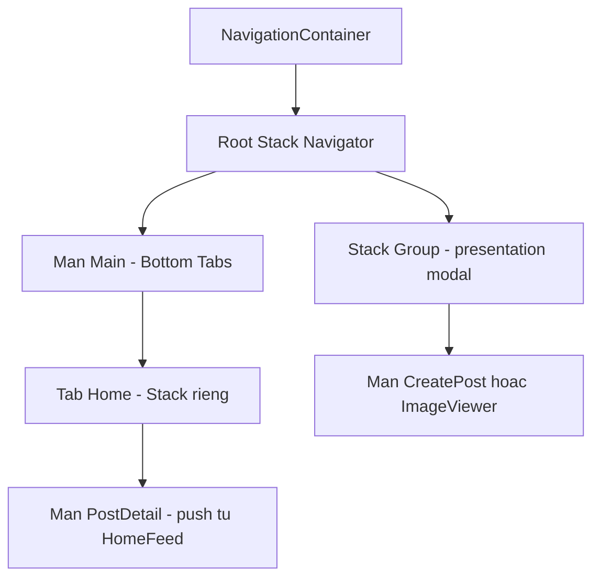

# Navigation với React Navigation 7

**React Navigation** là thư viện điều hướng (navigation -- chuyển màn hình và quản lý "chồng" các màn hình đã mở) phổ biến nhất cho React Native, đóng vai trò tương tự `react-router` trên web nhưng thiết kế riêng cho trải nghiệm mobile: gesture vuốt để quay lại, animation chuyển màn hình đúng cảm giác từng nền tảng, tích hợp sâu với deep link và push notification. Ở phiên bản 7, thư viện bổ sung **static API** (khai báo navigator dạng object, không cần JSX) bên cạnh **dynamic API** quen thuộc, đồng thời làm rõ ngữ nghĩa giữa `navigate`, `push` và `popTo`. Bài này đi từ cấu trúc cơ bản (`NavigationContainer`, Stack, Tabs) tới các chủ đề nâng cao hơn: lồng navigator, TypeScript, auth flow, deep linking và tối ưu hiệu năng.

**Tương tự đơn giản:** React Navigation giống một cuốn sổ tay nhiều trang xếp chồng lên nhau -- mở trang mới là `push`, gấp lại một trang là `goBack`, còn các tab dưới cùng màn hình là những cuốn sổ tay khác nhau mà bạn chuyển qua lại.

---

:::note[Ghi nhớ nhanh]

- ⭐ **Native Stack** (`createNativeStackNavigator`) là lựa chọn mặc định -- dùng navigation controller/fragment thật của nền tảng, animation và gesture back mượt như app native; chỉ cần `@react-navigation/stack` (JS-based) khi cần transition tuỳ biến sâu.
- ⭐ **`navigation.popTo`** (mới ở v7) dùng để quay về một màn đã có sẵn trong stack; `navigation.push` luôn tạo instance mới -- đừng nhầm hai API này.
- **Static API** (`createStaticNavigation`) mới ở v7 -- khai báo navigator dạng object, tự sinh cấu hình `linking`, giảm boilerplate cho cây màn hình cố định.
- **Màn hình KHÔNG unmount** khi bị đẩy xuống dưới trong stack -- phải dùng `useFocusEffect` / `useIsFocused` để biết khi nào màn thực sự đang hiển thị.
- **`freezeOnBlur`** trên native-stack giúp đóng băng render của màn hình đang bị che khuất, tiết kiệm CPU/memory cho stack sâu nhiều tầng; khai báo `RootParamList` toàn cục giúp `navigation.navigate` có gợi ý kiểu ở mọi nơi trong app.

:::

---

## Mục lục

- [Vì sao cần React Navigation?](#vì-sao-cần-react-navigation)
- [1. NavigationContainer](#1-navigationcontainer)
- [2. Stack Navigator Native Stack và JS Stack](#2-stack-navigator-native-stack-và-js-stack)
- [3. Bottom Tabs Navigator](#3-bottom-tabs-navigator)
- [4. Lồng Navigator Tabs trong Stack và Modal](#4-lồng-navigator-tabs-trong-stack-và-modal)
- [5. Static API trong React Navigation 7](#5-static-api-trong-react-navigation-7)
- [6. Truyền Params và Điều hướng](#6-truyền-params-và-điều-hướng)
- [7. Typing với TypeScript](#7-typing-với-typescript)
- [8. Header Options](#8-header-options)
- [9. Hooks Điều hướng](#9-hooks-điều-hướng)
- [10. Lifecycle Màn hình trong Stack](#10-lifecycle-màn-hình-trong-stack)
- [11. Điều hướng Ngoài Component](#11-điều-hướng-ngoài-component)
- [12. Auth Flow](#12-auth-flow)
- [13. Deep Linking](#13-deep-linking)
- [14. Lưu và Khôi phục State](#14-lưu-và-khôi-phục-state)
- [15. Hiệu năng](#15-hiệu-năng)
- [Khi nào dùng?](#khi-nào-dùng)
- [Lỗi thường gặp](#lỗi-thường-gặp)
- [Câu hỏi phỏng vấn](#câu-hỏi-phỏng-vấn)

---

## Vì sao cần React Navigation?

**Vấn đề:** Nếu tự "chế" điều hướng bằng `useState` để nhớ màn đang hiển thị, ta phải tự tay quản lý toàn bộ chồng màn hình, animation, gesture quay lại, và không có cách nào để một link bên ngoài (deep link, push notification) mở thẳng vào đúng màn.

```tsx
// Cach cu - tu "chuyen man hinh" bang state, khong co stack that
function App() {
  const [screen, setScreen] = useState<'home' | 'detail'>('home');
  const [detailId, setDetailId] = useState<string | null>(null);

  if (screen === 'detail') {
    return <DetailScreen id={detailId} onBack={() => setScreen('home')} />; // tu viet lai "goBack"
  }

  return (
    <HomeScreen
      onPressItem={(id) => {
        setDetailId(id);
        setScreen('detail'); // khong co animation, khong gesture
      }}
    />
  );
}
```

Cách này không có back gesture vuốt cạnh màn hình, không animation chuyển màn, không xếp chồng được nhiều màn (VD Product A -> Product B -> Product C), không deep link, và params không được typed.

**Giải pháp:** React Navigation cung cấp các **navigator khai báo** (Stack, Tabs, Drawer...) quản lý một chồng màn hình thật, animation và gesture quay lại đúng theo nền tảng, hỗ trợ deep linking và params có kiểu.

```tsx
// Cach moi - Native Stack quan ly stack that + gesture + animation
const Stack = createNativeStackNavigator<RootStackParamList>();

function App() {
  return (
    <NavigationContainer>
      <Stack.Navigator>
        <Stack.Screen name="Home" component={HomeScreen} />
        <Stack.Screen name="Detail" component={DetailScreen} />
      </Stack.Navigator>
    </NavigationContainer>
  );
}
```

:::tip[Dùng thực tế]

- **Onboarding -> Đăng nhập -> App chính**: chuyển nhóm màn hình theo điều kiện đăng nhập bằng `Stack.Group`.
- **App có menu chính**: Bottom Tabs (Home, Search, Thông báo, Cá nhân), mỗi tab giữ một Stack riêng để push màn chi tiết mà không mất tab bar.
- **Tạo bài viết / xem ảnh toàn màn hình**: `Stack.Screen` với `presentation: 'modal'`, đóng bằng vuốt xuống.
- **Mở thẳng một màn từ push notification hoặc universal link** (VD tin nhắn, đơn hàng) mà không cần người dùng tự điều hướng lại từ đầu.

:::

---

## 1. NavigationContainer

`NavigationContainer` là component gốc quản lý toàn bộ cây điều hướng: state hiện tại (route nào đang active), lịch sử back, và (nếu có) cấu hình deep linking. Toàn bộ navigator phải nằm bên trong đúng **một** `NavigationContainer` ở gốc cây component.

```tsx
import { NavigationContainer } from '@react-navigation/native';

export default function App() {
  return (
    <NavigationContainer
      onReady={() => console.log('Navigation container da san sang')}
      onStateChange={(state) => console.log('State dieu huong thay doi', state)}
    >
      <RootNavigator />
    </NavigationContainer>
  );
}
```

Nếu lồng hai `NavigationContainer` trực tiếp vào nhau, React Navigation sẽ cảnh báo "nested NavigationContainer". Trường hợp thật sự cần một cây điều hướng độc lập bên trong một màn hình khác (VD một mini-app/plugin nhúng), bọc nó bằng `NavigationIndependentTree` thay vì một `NavigationContainer` thứ hai trực tiếp:

```tsx
<NavigationIndependentTree>
  <NavigationContainer>
    <MiniStackNavigator />
  </NavigationContainer>
</NavigationIndependentTree>
```

`NavigationContainer` cũng nhận `ref` để điều hướng từ bên ngoài React tree -- xem [phần 11](#11-điều-hướng-ngoài-component).

---

## 2. Stack Navigator Native Stack và JS Stack

React Navigation có hai kiểu Stack Navigator:

- **`@react-navigation/native-stack`** (khuyến nghị mặc định): dùng navigation controller thật của từng nền tảng (native view hierarchy qua `react-native-screens`), nên animation, gesture vuốt-để-quay-lại và header đều là **native thật**, hiệu năng tốt và cảm giác đúng chuẩn hệ điều hành.
- **`@react-navigation/stack`** (JS Stack): triển khai lại stack bằng JavaScript, `Animated` và gesture-handler. Chậm hơn và không phải native thật, nhưng linh hoạt hơn khi cần transition tuỳ biến sâu mà native-stack không hỗ trợ.

```tsx
import { createNativeStackNavigator } from '@react-navigation/native-stack';

export type RootStackParamList = {
  Home: undefined;
  Detail: { itemId: string };
};

const Stack = createNativeStackNavigator<RootStackParamList>();

function RootNavigator() {
  return (
    // fullScreenGestureEnabled: vuot tu bat ky diem nao tren man, khong chi canh trai
    <Stack.Navigator
      initialRouteName="Home"
      screenOptions={{ headerShown: true, gestureEnabled: true, fullScreenGestureEnabled: true }}
    >
      <Stack.Screen name="Home" component={HomeScreen} options={{ title: 'Trang chu' }} />
      <Stack.Screen name="Detail" component={DetailScreen} />
    </Stack.Navigator>
  );
}
```

Cài đặt cho native-stack cần thêm `react-native-screens` và `react-native-safe-area-context` (bắt buộc từ RootView xuống dưới phải có `SafeAreaProvider`; New Architecture bật mặc định thì `react-native-screens` 4.x đã hỗ trợ Fabric sẵn, không cần cấu hình thêm). **Chọn cái nào?** Mặc định luôn dùng native-stack, chỉ cân nhắc JS Stack khi cần một transition rất đặc thù mà native-stack chưa hỗ trợ.

---

## 3. Bottom Tabs Navigator

`@react-navigation/bottom-tabs` tạo thanh tab dưới cùng màn hình -- điều hướng chính của phần lớn app mobile.

```tsx
import { createBottomTabNavigator } from '@react-navigation/bottom-tabs';

export type MainTabParamList = {
  Home: undefined;
  Search: undefined;
  Profile: undefined;
};

const Tab = createBottomTabNavigator<MainTabParamList>();

function MainTabs() {
  return (
    <Tab.Navigator
      screenOptions={({ route }) => ({
        headerShown: false,
        tabBarIcon: ({ color, size }) => <TabIcon name={route.name} color={color} size={size} />,
      })}
    >
      <Tab.Screen name="Home" component={HomeStack} options={{ tabBarLabel: 'Trang chu' }} />
      <Tab.Screen name="Search" component={SearchStack} options={{ tabBarLabel: 'Tim kiem' }} />
      <Tab.Screen name="Profile" component={ProfileStack} options={{ tabBarLabel: 'Ca nhan', tabBarBadge: 3 }} />
    </Tab.Navigator>
  );
}
```

Mỗi `Tab.Screen` thường trỏ tới **một Stack riêng** (`HomeStack`, `SearchStack`...) chứ không phải một màn hình đơn -- nhờ vậy push chi tiết trong một tab vẫn giữ nguyên tab bar phía dưới. Mặc định, bottom tabs **lazy** (chỉ render nội dung tab khi tab đó được focus lần đầu) -- xem thêm ở [phần 15](#15-hiệu-năng).

---

## 4. Lồng Navigator Tabs trong Stack và Modal

Kiến trúc phổ biến nhất: một **Root Stack** chứa `MainTabs` (là một navigator lồng bên trong) làm màn hình chính, cộng thêm các màn hình modal (tạo bài viết, xem ảnh) nằm ngang hàng với `Main` để hiển thị đè lên toàn bộ tab bar.

```tsx
const RootStack = createNativeStackNavigator<RootStackParamList>();

function RootNavigator() {
  return (
    <RootStack.Navigator screenOptions={{ headerShown: false }}>
      <RootStack.Screen name="Main" component={MainTabs} />

      <RootStack.Group screenOptions={{ presentation: 'modal' }}>
        <RootStack.Screen name="CreatePost" component={CreatePostScreen} />
        <RootStack.Screen name="ImageViewer" component={ImageViewerScreen} />
      </RootStack.Group>
    </RootStack.Navigator>
  );
}
```



Mỗi tab tự quản lý stack con của riêng nó, ví dụ tab Home:

```tsx
const HomeStack_ = createNativeStackNavigator<HomeStackParamList>();

function HomeStack() {
  return (
    <HomeStack_.Navigator>
      <HomeStack_.Screen name="HomeFeed" component={HomeFeedScreen} />
      <HomeStack_.Screen name="PostDetail" component={PostDetailScreen} />
    </HomeStack_.Navigator>
  );
}
```

Nhờ vậy: đứng ở tab Home, push `PostDetail` vẫn thấy tab bar biến mất đúng lúc header đẩy vào (vì `PostDetail` nằm trong stack của Home), còn bấm nút "Tạo bài" ở bất kỳ tab nào cũng mở modal đè lên toàn bộ, kể cả tab bar (vì `CreatePost` nằm ở Root Stack, ngoài `MainTabs`).

---

## 5. Static API trong React Navigation 7

Trước v7, cách duy nhất để khai báo navigator là JSX (**dynamic API**) như các ví dụ trên. Từ v7, có thêm **static API**: khai báo navigator dưới dạng một object cấu hình, không cần JSX, và tự sinh cấu hình `linking` từ thuộc tính `linking` khai báo ngay trên từng màn hình.

```tsx
import { createStaticNavigation, type StaticParamList } from '@react-navigation/native';
import { createNativeStackNavigator } from '@react-navigation/native-stack';

const RootStack = createNativeStackNavigator({
  screens: {
    Home: {
      screen: HomeScreen,
      options: { title: 'Trang chu' },
    },
    Detail: {
      screen: DetailScreen,
      linking: {
        path: 'detail/:itemId',   // tu dong gop vao linking config cua ca app
      },
    },
  },
});

type RootStackParamList = StaticParamList<typeof RootStack>;

declare global {
  namespace ReactNavigation {
    interface RootParamList extends RootStackParamList {}
  }
}

const Navigation = createStaticNavigation(RootStack);

export default function App() {
  return <Navigation />;
}
```

`createStaticNavigation` tự dựng sẵn `NavigationContainer` bên trong, nên không cần bọc thủ công nữa; muốn truyền `ref` hay các prop khác của container thì truyền trực tiếp vào component `Navigation` trả về. **Chọn static hay dynamic?** Static API phù hợp khi cây màn hình khá cố định và biết trước lúc build, giúp `linking` gần như tự sinh, giảm boilerplate. Dynamic API (JSX) vẫn cần thiết khi cấu trúc navigator phụ thuộc **state runtime** -- ví dụ auth flow đổi nhóm màn hình theo trạng thái đăng nhập (xem [phần 12](#12-auth-flow)), hoặc khi cần truyền thêm prop runtime cho màn hình qua render-callback. Phần lớn app production có auth flow vẫn dùng dynamic API ở navigator gốc vì lý do này.

---

## 6. Truyền Params và Điều hướng

Params được truyền khi gọi điều hướng, và đọc lại qua `route.params` trong màn đích.

```tsx
// Man A - dieu huong sang man B kem params
navigation.navigate('Detail', { itemId: '42' });

// Man B - doc params qua props.route hoac hook useRoute()
function DetailScreen({ route }: NativeStackScreenProps<RootStackParamList, 'Detail'>) {
  const { itemId } = route.params;
  return <Text>San pham {itemId}</Text>;
}
```

Bốn phương thức điều hướng hay dùng nhất, và khác biệt quan trọng giữa chúng:

- **`navigation.navigate(name, params)`** -- đi tới màn theo tên; nếu màn đó đang là instance gần nhất trong stack, React Navigation ưu tiên cập nhật params trên instance đó thay vì tạo mới, còn nếu chưa có sẽ push mới.
- **`navigation.push(name, params)`** -- luôn thêm một instance **mới** vào stack, kể cả khi cùng tên màn hình. Hữu ích cho các luồng lặp lại như Sản phẩm A -> Sản phẩm liên quan B -> Sản phẩm liên quan C.
- **`navigation.popTo(name, params)`** -- API mới ở v7, pop ngược stack cho tới khi tìm thấy màn có tên chỉ định (giữ instance cũ, không tạo mới); nếu tên đó không tồn tại trong stack, hành vi sẽ tương đương push mới. Đây là cách rõ ràng để "quay về một màn cụ thể" thay vì trông chờ vào `navigate`.
- **`navigation.goBack()`** -- quay lại đúng một bước, giống thao tác vuốt back hoặc nút back vật lý.

```tsx
// Push nhieu instance cung 1 man hinh (VD san pham lien quan)
navigation.push('ProductDetail', { productId: relatedId });

// Quay ve 1 man da co san trong stack thay vi push moi
navigation.popTo('Home');

// Quay lai dung 1 buoc
navigation.goBack();
```

Lưu ý: React Navigation merge params bằng `SET_PARAMS` -- chỉ ghi đè field nào được truyền vào. Nếu một field optional cần "xoá" ở lần điều hướng sau, phải truyền tường minh giá trị `undefined` cho field đó thay vì bỏ qua, tránh giữ lại params cũ (stale params) khi mở lại màn bằng một đường khác.

---

## 7. Typing với TypeScript

Khai báo `RootStackParamList` mô tả tên route và kiểu params tương ứng, rồi mở rộng nó vào namespace toàn cục `ReactNavigation` để mọi nơi trong app (kể cả không truyền generic) đều được gợi ý kiểu.

```tsx
export type RootStackParamList = {
  Home: undefined;
  Detail: { itemId: string };
  Profile: { userId: string; tab?: 'posts' | 'about' };
};

declare global {
  namespace ReactNavigation {
    interface RootParamList extends RootStackParamList {}
  }
}
```

Đặt khối `declare global` này ở một file trung tâm (VD `navigation/types.ts`) và import nó ở entry point của app -- mọi `useNavigation()` hay `navigation.navigate(...)` ở bất kỳ file nào cũng được typed mà không cần truyền generic thủ công. Với từng màn hình, dùng `NativeStackScreenProps` để có kiểu đầy đủ cho cả `navigation` và `route`:

```tsx
import type { NativeStackScreenProps } from '@react-navigation/native-stack';

type DetailProps = NativeStackScreenProps<RootStackParamList, 'Detail'>;

function DetailScreen({ route, navigation }: DetailProps) {
  const { itemId } = route.params; // itemId: string, khong can ep kieu
  return <Text onPress={() => navigation.goBack()}>San pham {itemId}</Text>;
}
```

Nếu chỉ cần đọc `route` bên trong một component con (không nhận props trực tiếp từ navigator), dùng `useRoute<RouteProp<RootStackParamList, 'Detail'>>()`.

---

## 8. Header Options

Native-stack render header bằng thành phần native của từng nền tảng, cấu hình qua `options` (theo từng màn) hoặc `screenOptions` (áp cho cả navigator).

```tsx
<Stack.Screen
  name="Detail"
  component={DetailScreen}
  options={({ route }) => ({
    title: `San pham ${route.params.itemId}`,
    headerRight: () => (
      <Pressable onPress={onShare}>
        <Text>Chia se</Text>
      </Pressable>
    ),
    headerStyle: { backgroundColor: '#111111' },
    headerTintColor: '#ffffff',
  })}
/>
```

Các option hay dùng: `title`, `headerShown`, `headerLeft` / `headerRight` (render function tuỳ biến nút), `headerStyle`, `headerTintColor`, `headerBackTitle` (chỉ iOS), `headerLargeTitle` (iOS, kiểu tiêu đề lớn của App Store). **Thực tế hay gặp:** nhiều app tắt hẳn header mặc định (`screenOptions={{ headerShown: false }}` ở navigator gốc) rồi tự vẽ header riêng bên trong từng màn hình để toàn quyền kiểm soát layout, animation ẩn/hiện theo cuộn, hoặc đồng bộ với design system riêng của app -- lúc đó `SafeAreaView`/`useSafeAreaInsets` từ `react-native-safe-area-context` thay thế phần chừa khoảng trống mà header native vốn tự lo.

---

## 9. Hooks Điều hướng

Bốn hook từ `@react-navigation/native` hay dùng nhất khi làm việc trong các component không trực tiếp nhận props từ navigator:

- **`useNavigation()`** -- lấy đối tượng `navigation` ở bất kỳ component con nào, không cần truyền props qua nhiều tầng.
- **`useRoute()`** -- lấy route hiện tại (tên + params) theo cách tương tự.
- **`useIsFocused()`** -- trả về `boolean`, `true` khi màn đang hiển thị; re-render component mỗi khi trạng thái focus thay đổi.
- **`useFocusEffect(callback)`** -- chạy effect mỗi khi màn được focus, và chạy cleanup khi màn bị blur (tương tự `useEffect` nhưng gắn theo vòng đời focus thay vì mount/unmount).

```tsx
import { useCallback } from 'react';
import { useFocusEffect, useIsFocused, useNavigation, useRoute } from '@react-navigation/native';

function ChatScreen() {
  const navigation = useNavigation();
  const route = useRoute();
  const isFocused = useIsFocused();

  useFocusEffect(
    useCallback(() => {
      const subscription = subscribeToTyping();
      return () => subscription.unsubscribe(); // chay khi man bi blur hoac unmount
    }, []),
  );

  return <Text>{isFocused ? 'Dang xem man chat' : 'Da roi man chat'}</Text>;
}
```

`useFocusEffect` là lựa chọn đúng cho mọi side-effect chỉ nên chạy khi màn **đang hiển thị** -- xem lý do ở phần tiếp theo.

---

## 10. Lifecycle Màn hình trong Stack

Điểm rất dễ hiểu nhầm: khi `push` một màn hình mới lên trên, các màn hình bên dưới **không unmount** -- chúng vẫn được giữ nguyên trong cây component (để quay lại vẫn còn scroll position, state form...), chỉ có sự kiện **focus/blur** được bắn ra. Hệ quả: nếu một side-effect (phát nhạc, đếm giờ, subscribe socket) được khởi động bằng `useEffect(fn, [])` thông thường, nó sẽ **tiếp tục chạy ngầm** sau khi người dùng đã push sang màn khác, vì component gốc chưa hề unmount.

```tsx
// SAI -- video van phat khi da push man khac len tren
useEffect(() => {
  player.play();
  return () => player.pause(); // chi chay khi MAN NAY thuc su unmount (pop het khoi stack)
}, []);

// DUNG -- dung theo focus, dung khi bi che boi man khac
useFocusEffect(
  useCallback(() => {
    player.play();
    return () => player.pause(); // chay ngay khi blur, khong can doi unmount
  }, []),
);
```

Màn hình chỉ thực sự unmount khi bị lấy ra khỏi lịch sử của stack -- ví dụ `goBack()`, `popTo()` xoá nó khỏi stack, hoặc gọi `reset()` để thay toàn bộ state điều hướng.

---

## 11. Điều hướng Ngoài Component

Đôi khi cần điều hướng từ nơi không phải component React: một handler xử lý push notification, một interceptor gọi API trả về 401 cần đưa người dùng về màn đăng nhập, hoặc một action trong store (Zustand/Redux). `createNavigationContainerRef` tạo một `ref` dùng được ở bất kỳ đâu.

```tsx
import { createNavigationContainerRef } from '@react-navigation/native';

export const navigationRef = createNavigationContainerRef<RootStackParamList>();

export function navigate<RouteName extends keyof RootStackParamList>(
  name: RouteName,
  params?: RootStackParamList[RouteName],
): void {
  if (navigationRef.isReady()) {
    // @ts-expect-error - overload cua navigate voi generic phuc tap, ep kieu tai 1 diem
    navigationRef.navigate(name, params);
  }
}

// Gan ref nay vao NavigationContainer:
// <NavigationContainer ref={navigationRef}><RootNavigator /></NavigationContainer>
```

Luôn kiểm tra `navigationRef.isReady()` trước khi gọi -- `NavigationContainer` có thể chưa mount xong (VD app vừa khởi động nguội, người dùng vừa bấm vào push notification trước khi UI kịp render); cách xử lý an toàn là lưu tạm ý định điều hướng vào một biến/state ngoài rồi "xả" nó trong callback `onReady` của `NavigationContainer`. Trước khi gọi `navigate`, cũng có thể kiểm tra `navigationRef.canGoBack()` khi chỉ muốn `goBack()` an toàn (tránh gọi khi đang ở màn gốc, không còn gì để lùi).

---

## 12. Auth Flow

React Navigation không có một "navigator riêng cho auth" -- auth flow chỉ đơn giản là **render có điều kiện** hai nhóm màn hình khác nhau tuỳ theo trạng thái đăng nhập.

```tsx
function RootNavigator() {
  const isSignedIn = useAuthStore((state) => Boolean(state.token));

  return (
    <Stack.Navigator screenOptions={{ headerShown: false }}>
      {isSignedIn ? (
        <Stack.Group>
          <Stack.Screen name="Main" component={MainTabs} />
          <Stack.Screen name="Detail" component={DetailScreen} />
        </Stack.Group>
      ) : (
        <Stack.Group>
          <Stack.Screen name="SignIn" component={SignInScreen} />
          <Stack.Screen name="SignUp" component={SignUpScreen} />
        </Stack.Group>
      )}
    </Stack.Navigator>
  );
}
```

Khi `isSignedIn` đổi giá trị, React Navigation tự động unmount nhóm màn hình cũ và mount nhóm mới (kèm animation chuyển đổi mặc định), không cần tự gọi `reset()` thủ công. Vì cấu trúc navigator ở đây phụ thuộc **state runtime**, đây chính là trường hợp bắt buộc phải dùng dynamic API (JSX) ở navigator gốc, dù phần còn lại của app có dùng static API cho từng cụm màn hình con.

---

## 13. Deep Linking

`linking` là prop của `NavigationContainer` mô tả những URL scheme/domain app nhận (`prefixes`) và mỗi URL path map tới route nào (`config.screens` -- cấu trúc **mirror đúng** cấu trúc lồng navigator).

```tsx
const linking = {
  prefixes: ['myapp://', 'https://myapp.example.com'],
  config: {
    screens: {
      Main: {
        screens: {
          Home: {
            screens: {
              HomeFeed: '',
              PostDetail: 'post/:postId',
            },
          },
          Search: 'search',
        },
      },
      CreatePost: 'create-post',
    },
  },
};

// Gan vao: <NavigationContainer linking={linking} fallback={<Loading />}>...</NavigationContainer>
```

Với **static API** (xem [phần 5](#5-static-api-trong-react-navigation-7)), phần lớn cấu hình này có thể tự sinh từ thuộc tính `linking` khai báo ngay trên từng screen, không cần viết lại object `config.screens` thủ công. Deep link chỉ hoạt động trên JS khi hệ điều hành đã biết chuyển URL cho app -- universal link (iOS) và app link (Android) còn cần cấu hình native bổ sung (Associated Domains, intent filter) nằm ngoài phạm vi React Navigation. Ngoài ra phải xử lý cả hai tình huống: app đang mở (lắng nghe sự kiện `url`) và app đang đóng hẳn (đọc URL khởi động ban đầu) -- xem thêm ở bảng lỗi thường gặp bên dưới.

---

## 14. Lưu và Khôi phục State

`NavigationContainer` hỗ trợ lưu lại toàn bộ state điều hướng và khôi phục lại sau khi app khởi động lại, qua `onStateChange` và `initialState`.

```tsx
const PERSISTENCE_KEY = 'NAVIGATION_STATE_V1';

function App() {
  const [isReady, setIsReady] = useState(false);
  const [initialState, setInitialState] = useState();

  useEffect(() => {
    AsyncStorage.getItem(PERSISTENCE_KEY)
      .then((saved) => saved && setInitialState(JSON.parse(saved)))
      .finally(() => setIsReady(true));
  }, []);

  if (!isReady) return null; // tranh render voi state rong lan dau

  return (
    <NavigationContainer
      initialState={initialState}
      onStateChange={(state) => AsyncStorage.setItem(PERSISTENCE_KEY, JSON.stringify(state))}
    >
      <RootNavigator />
    </NavigationContainer>
  );
}
```

Cẩn trọng khi bật ở production: nếu cấu trúc navigator thay đổi giữa các bản build (đổi tên route, xoá màn hình...), state đã lưu từ bản cũ có thể không còn khớp và gây lỗi khi khôi phục. Cách an toàn: chỉ bật persist state ở môi trường dev, hoặc gắn version vào key lưu trữ và validate state trước khi truyền vào `initialState`.

---

## 15. Hiệu năng

Hai cấu hình đáng chú ý nhất khi app có nhiều màn hình xếp chồng:

- **`freezeOnBlur`** (screen option của native-stack) -- đóng băng việc render lại của những màn hình đang bị che khuất (không phải màn trên cùng), giảm tải CPU/memory cho stack sâu nhiều tầng. Hành vi mặc định có thể khác nhau giữa các bản `react-native-screens`, nên kiểm tra lại tài liệu của phiên bản đang dùng và bật tường minh nếu cần: `screenOptions={{ freezeOnBlur: true }}`.
- **`lazy`** (option của bottom-tabs, mặc định `true`) -- chỉ render nội dung một tab khi tab đó được focus lần đầu tiên, thay vì render sẵn toàn bộ tab ngay khi app khởi động.

```tsx
<Tab.Navigator
  screenOptions={{
    lazy: true,          // gia tri mac dinh - khong render truoc tab chua mo
  }}
>
  ...
</Tab.Navigator>
```

Ngoài ra, `detachInactiveScreens` (bottom-tabs, mặc định bật) phối hợp với `react-native-screens` để gỡ view native của tab không active khỏi cây hiển thị, giảm thêm bộ nhớ tiêu tốn khi app có nhiều tab nặng (danh sách dài, ảnh, video).

---

## Khi nào dùng?

| Nhu cầu | Chọn |
| --- | --- |
| Điều hướng cơ bản, push/pop màn hình | Native Stack |
| Cần transition tuỳ biến sâu mà native-stack chưa hỗ trợ | JS Stack `@react-navigation/stack` |
| Menu chính của app, 3-5 mục ngang dưới màn hình | Bottom Tabs |
| Hiển thị đè lên toàn app, đóng bằng vuốt xuống | Stack Group với `presentation: 'modal'` |
| App có cây màn hình cố định, ít logic điều kiện | Static API |
| Auth flow, cấu trúc navigator phụ thuộc state runtime | Dynamic API |
| Mở đúng một màn từ link ngoài hoặc notification | `linking` config kết hợp `createNavigationContainerRef` |

---

## Lỗi thường gặp

| Lỗi | Nguyên nhân | Cách sửa |
| --- | --- | --- |
| Gọi `navigate` ngay khi app vừa khởi động không có tác dụng | `NavigationContainer` chưa mount xong, `navigationRef` chưa `isReady()` | Kiểm tra `isReady()` trước khi gọi, hoặc lưu tạm ý định điều hướng và xả trong `onReady` |
| Params cũ (stale) xuất hiện lại khi mở màn qua đường khác | React Navigation merge `SET_PARAMS`, chỉ ghi đè field được truyền | Luôn truyền đủ field optional, kể cả `undefined`, mỗi lần `navigate` |
| Nhạc/video/timer vẫn chạy ngầm sau khi push màn khác lên trên | Dùng `useEffect` thông thường, trong khi màn cũ không unmount khi bị đẩy xuống | Chuyển side-effect sang `useFocusEffect`, dừng ở cleanup khi blur |
| TypeScript không gợi ý tên route, báo lỗi kiểu string không hợp lệ | Chưa khai báo `declare global { namespace ReactNavigation { interface RootParamList } }`, hoặc quên generic khi tạo navigator | Khai báo `RootParamList` toàn cục một lần, dùng `createNativeStackNavigator<ParamList>()` |
| Deep link mở app nhưng không nhảy đúng màn lúc app đang đóng hẳn | Chỉ xử lý sự kiện `url` lúc app đang mở, thiếu xử lý URL khởi động ban đầu, hoặc `config.screens` không khớp cấu trúc lồng navigator | Test cả hai trường hợp app đang mở và app đóng hẳn, đối chiếu `config.screens` với đúng cây navigator |
| Modal không có hiệu ứng vuốt xuống để đóng trên Android | Thiếu `gestureEnabled`, hoặc cấu hình `presentation` chưa đúng cho từng nền tảng | Kiểm tra lại `options` của nhóm modal, test riêng iOS và Android vì hành vi mặc định khác nhau |

---

## Câu hỏi phỏng vấn

Những câu thường gặp về chủ đề này. Tự trả lời trước, rồi bấm **Xem đáp án** để đối chiếu.

**1. `NavigationContainer` là gì và vì sao chỉ nên có một cái ở gốc app?**

<details className="qa">
<summary>Xem đáp án</summary>

`NavigationContainer` quản lý toàn bộ cây điều hướng: state route hiện tại, lịch sử back, cấu hình `linking`. Toàn bộ navigator phải nằm trong đúng một `NavigationContainer` ở gốc; lồng thêm một cái nữa trực tiếp bên trong sẽ bị cảnh báo "nested NavigationContainer". Cần một cây điều hướng độc lập (VD mini-app nhúng) thì bọc bằng `NavigationIndependentTree` thay vì thêm container thứ hai.

</details>

**2. Native Stack khác `@react-navigation/stack` (JS Stack) ở điểm nào?**

<details className="qa">
<summary>Xem đáp án</summary>

Native Stack dùng navigation controller/fragment thật của nền tảng (qua `react-native-screens`), animation và gesture back là native thật, hiệu năng tốt hơn. JS Stack triển khai lại bằng JavaScript + `Animated` + gesture-handler, chậm hơn nhưng linh hoạt hơn khi cần transition tuỳ biến sâu. Mặc định nên chọn Native Stack.

</details>

**3. Static API và Dynamic API trong React Navigation 7 khác nhau thế nào, khi nào chọn cái nào?**

<details className="qa">
<summary>Xem đáp án</summary>

Dynamic API là cách JSX quen thuộc (`<Stack.Navigator><Stack.Screen /></Stack.Navigator>`), linh hoạt, render được có điều kiện theo state runtime. Static API (mới ở v7) khai báo navigator dưới dạng object cấu hình qua `createNativeStackNavigator({ screens: {...} })`, tự sinh `linking` từ thuộc tính `linking` trên từng screen, ít boilerplate hơn cho cây màn hình cố định. Auth flow hay bất kỳ cấu trúc phụ thuộc state runtime nào vẫn cần dynamic API.

</details>

**4. `navigate`, `push`, `popTo`, `goBack` khác nhau ra sao?**

<details className="qa">
<summary>Xem đáp án</summary>

- `navigate(name, params)`: đi tới màn theo tên, ưu tiên cập nhật instance gần nhất nếu đã có, chưa có thì push mới.
- `push(name, params)`: luôn tạo instance mới, kể cả trùng tên màn hình.
- `popTo(name, params)` (mới ở v7): pop ngược stack tới màn có tên chỉ định, giữ instance cũ.
- `goBack()`: lùi đúng một bước.

</details>

**5. Làm sao để `navigation.navigate` có gợi ý kiểu (type-safe) ở mọi nơi trong app?**

<details className="qa">
<summary>Xem đáp án</summary>

Khai báo `RootStackParamList` mô tả tên route và kiểu params, rồi mở rộng vào namespace toàn cục:

```ts
declare global {
  namespace ReactNavigation {
    interface RootParamList extends RootStackParamList {}
  }
}
```

Sau đó mọi `useNavigation()` / `navigation.navigate(...)` trong app đều được typed mà không cần truyền generic thủ công.

</details>

**6. Màn hình trước có bị unmount khi push một màn mới lên trên không? Vì sao điều này quan trọng?**

<details className="qa">
<summary>Xem đáp án</summary>

Không. Màn hình bên dưới vẫn được giữ nguyên trong cây component, chỉ nhận sự kiện blur (mất focus) chứ không unmount -- giúp giữ nguyên state/scroll khi quay lại. Hệ quả: side-effect khởi động bằng `useEffect` thông thường (phát nhạc, timer) sẽ tiếp tục chạy ngầm sau khi push màn khác, phải dùng `useFocusEffect` để dừng đúng lúc.

</details>

**7. `useFocusEffect` khác `useEffect` thế nào?**

<details className="qa">
<summary>Xem đáp án</summary>

`useEffect` chạy theo vòng đời mount/unmount của component. `useFocusEffect` chạy mỗi khi màn hình được **focus**, và cleanup chạy khi màn **blur** -- kể cả khi component chưa hề unmount (vì bị đẩy xuống dưới trong stack). Phù hợp cho side-effect chỉ nên hoạt động lúc màn đang hiển thị.

</details>

**8. `useIsFocused` dùng để làm gì, khác `useFocusEffect` ở điểm nào?**

<details className="qa">
<summary>Xem đáp án</summary>

`useIsFocused()` trả về giá trị `boolean` cho biết màn có đang focus hay không, và re-render component khi giá trị đó đổi -- dùng khi cần **đọc** trạng thái focus ngay trong phần render (VD đổi UI). `useFocusEffect` dùng khi cần **chạy side-effect** (subscribe, timer) theo focus/blur, không phải chỉ đọc giá trị.

</details>

**9. Làm sao điều hướng từ bên ngoài component React, ví dụ từ một push notification handler?**

<details className="qa">
<summary>Xem đáp án</summary>

Tạo `navigationRef` bằng `createNavigationContainerRef()`, truyền vào prop `ref` của `NavigationContainer`, rồi gọi `navigationRef.navigate(...)` từ bất kỳ đâu sau khi kiểm tra `navigationRef.isReady()`. Nếu gọi trước khi container sẵn sàng (VD app vừa khởi động nguội), cần lưu tạm ý định điều hướng rồi xả lại trong callback `onReady`.

</details>

**10. Auth flow (đổi giữa màn đăng nhập và app chính) thường được cài đặt thế nào trong React Navigation?**

<details className="qa">
<summary>Xem đáp án</summary>

Không có navigator riêng cho auth -- chỉ là render có điều kiện hai `Stack.Group` khác nhau (nhóm màn đăng nhập / nhóm màn app chính) dựa trên state đăng nhập. Khi state đổi, React Navigation tự unmount nhóm cũ và mount nhóm mới kèm animation, không cần gọi `reset()` thủ công. Đây là lý do navigator gốc thường phải dùng dynamic API dù phần còn lại của app dùng static API.

</details>

**11. Deep linking trong React Navigation hoạt động ra sao, `linking` config gồm những gì?**

<details className="qa">
<summary>Xem đáp án</summary>

`linking` là prop của `NavigationContainer` gồm `prefixes` (danh sách scheme/domain app nhận) và `config.screens` (map path URL tới tên route, cấu trúc mirror đúng cây navigator lồng nhau). Phải xử lý cả hai tình huống: app đang mở (lắng nghe sự kiện `url`) và app đóng hẳn (đọc URL khởi động ban đầu). Universal link/app link còn cần cấu hình native bổ sung ngoài phạm vi JS.

</details>

**12. `freezeOnBlur` và `lazy` trong bottom tabs giúp ích gì cho hiệu năng?**

<details className="qa">
<summary>Xem đáp án</summary>

`freezeOnBlur` (native-stack) đóng băng render của màn hình đang bị che khuất, giảm tải CPU/memory cho stack sâu. `lazy` (bottom-tabs, mặc định `true`) chỉ render nội dung một tab khi tab đó được focus lần đầu, tránh render sẵn toàn bộ tab ngay lúc app khởi động. Kết hợp `detachInactiveScreens` còn gỡ bớt view native của tab không active khỏi cây hiển thị.

</details>
