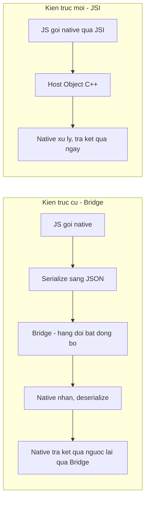
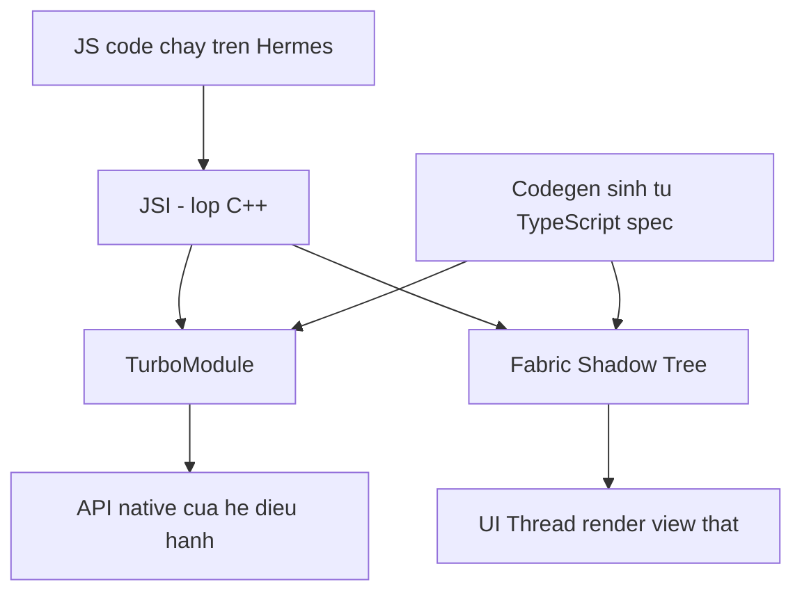
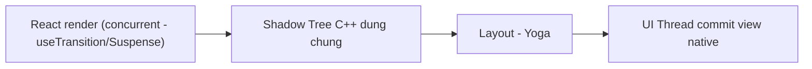

# New Architecture: JSI, TurboModules, Fabric

Bài **Native Modules** đã giới thiệu nhanh khái niệm TurboModule. Bài này đi sâu vào **New Architecture** -- bộ khung kiến trúc mới của React Native, thay thế **bridge** (cầu nối JS ↔ Native kiểu cũ, giao tiếp bất đồng bộ qua JSON) bằng **JSI** (JavaScript Interface -- lớp C++ cho JS gọi thẳng sang native). Từ đó sinh ra **TurboModules** (native module thế hệ mới) và **Fabric** (renderer thế hệ mới).

**Tương tự đơn giản:** Kiến trúc cũ giống **gửi thư qua bưu điện** -- muốn nói gì với native phải viết ra (serialize JSON), bỏ vào phong bì, chờ người đưa thư (bridge) mang đi rồi mang thư trả lời về. Kiến trúc mới giống **gọi điện thoại trực tiếp** (JSI) -- nói chuyện ngay lập tức, không cần đóng gói.

---

:::note[Ghi nhớ nhanh]

- ⭐ **Bridge cũ** -- mọi lệnh JS ↔ Native phải serialize thành JSON, đi qua hàng đợi bất đồng bộ, không gọi được đồng bộ, có độ trễ.
- ⭐ **JSI** thay bridge bằng liên kết C++ trực tiếp -- JS giữ tham chiếu tới đối tượng native (**Host Object**) và gọi hàm gần như đồng bộ, không cần JSON.
- **TurboModules** (native module) và **Fabric** (renderer) đều xây trên JSI; **Codegen** sinh interface C++ từ spec TypeScript để đảm bảo type-safe lúc build.
- Từ RN 0.76 New Architecture bật **mặc định**; từ RN 0.82 không còn tuỳ chọn tắt. Code kiến trúc cũ đang được gỡ dần qua từng bản, nhưng **interop layer vẫn còn** (0.85 vẫn có) để thư viện viết kiểu cũ chạy tạm.
- **Nitro Modules** (`react-native-nitro-modules`) là một lớp DX khác xây trên cùng nền JSI, không thay thế TurboModules mà là cách viết native module khác, ít boilerplate hơn.
- Chọn thư viện mới luôn phải kiểm tra "hỗ trợ New Architecture" -- lib chỉ hỗ trợ Old Architecture hiện chạy nhờ interop layer, và sẽ ngừng hoạt động khi lớp này bị gỡ.

:::

---

## Mục lục

- [Vì sao New Architecture ra đời?](#vì-sao-new-architecture-ra-đời)
- [1. Kiến trúc cũ vs kiến trúc mới](#1-kiến-trúc-cũ-vs-kiến-trúc-mới)
- [2. JSI (JavaScript Interface)](#2-jsi-javascript-interface)
- [3. TurboModules và Codegen](#3-turbomodules-và-codegen)
- [4. Fabric: renderer mới](#4-fabric-renderer-mới)
- [5. Bridgeless Mode](#5-bridgeless-mode)
- [6. Hermes: JS engine của React Native](#6-hermes-js-engine-của-react-native)
- [7. Mốc version bắt buộc New Architecture](#7-mốc-version-bắt-buộc-new-architecture)
- [8. Nitro Modules](#8-nitro-modules)
- [9. Viết một TurboModule spec đơn giản](#9-viết-một-turbomodule-spec-đơn-giản)
- [10. Mô hình JS SDK gọi native module của host app](#10-mô-hình-js-sdk-gọi-native-module-của-host-app)
- [11. Tác động tới việc chọn thư viện](#11-tác-động-tới-việc-chọn-thư-viện)
- [Khi nào dùng?](#khi-nào-dùng)
- [Lỗi thường gặp](#lỗi-thường-gặp)
- [Câu hỏi phỏng vấn](#câu-hỏi-phỏng-vấn)

---

## Vì sao New Architecture ra đời?

**Vấn đề:** Kiến trúc RN cũ (gọi tắt **Old Architecture**) giao tiếp JS ↔ Native qua một **bridge** duy nhất: mọi lời gọi (gọi native module, cập nhật UI, nhận event) đều phải **serialize thành JSON**, xếp vào hàng đợi, gửi bất đồng bộ sang thread khác, rồi deserialize ở đầu nhận. Cách này có 3 vấn đề: (1) không gọi được đồng bộ (`await` giả lập bằng Promise, không có "gọi và lấy kết quả ngay"), (2) tốn CPU cho serialize/deserialize khi dữ liệu lớn hoặc gọi liên tục (animation, scroll), (3) JS và UI Manager giữ **2 cây layout riêng** phải đồng bộ qua bridge, dễ lệch frame gây giật khi JS thread bận.

```ts
// Cach cu: goi native module qua Bridge -- luon bat dong bo, du chi can 1 gia tri int
import { NativeModules } from 'react-native';

const { DeviceInfo } = NativeModules;

async function getBatteryLevel() {
  // JS -> serialize JSON -> Bridge queue -> Native -> serialize JSON -> Bridge -> JS
  const level = await DeviceInfo.getBatteryLevel();
  return level;
}
```

**Giải pháp:** **New Architecture** thay bridge bằng **JSI** -- lớp C++ cho JS engine (Hermes) giữ tham chiếu trực tiếp tới đối tượng native và gọi hàm ngay, không qua JSON, không qua hàng đợi bất đồng bộ bắt buộc. Trên nền JSI, RN xây **TurboModules** (thay Native Module cũ) và **Fabric** (thay UI Manager cũ, dùng chung một cây layout C++ với JS).

```ts
// Cach moi: TurboModule qua JSI -- interface duoc Codegen sinh tu TypeScript spec
import DeviceInfo from './NativeDeviceInfo'; // TurboModuleRegistry.getEnforcing<Spec>(...)

async function getBatteryLevel() {
  // JS giu tham chieu truc tiep toi native object qua JSI, khong serialize JSON toan bo
  return DeviceInfo.getBatteryLevel();
}
```

:::tip[Dùng thực tế]

- App cần đo layout (`measure`) đồng bộ **trước khi paint** để tránh nháy UI (ví dụ bottom sheet, tooltip theo vị trí).
- Animation/gesture chạy mượt 60fps ngay cả khi JS thread bận xử lý logic nặng.
- Tích hợp SDK native nặng (camera, mã hoá, ML on-device) cần hiệu năng gọi hàm cao, gọi liên tục.
- Từ một mốc version nhất định, dự án **buộc phải** chạy New Architecture để nâng cấp RN -- không còn là lựa chọn.

:::

---

## 1. Kiến trúc cũ vs kiến trúc mới



| | Old Architecture | New Architecture |
|---|---|---|
| Giao tiếp JS ↔ Native | Bridge, serialize JSON, bất đồng bộ | JSI, tham chiếu C++ trực tiếp, gần như đồng bộ |
| Native module | Native Module (Bridge classic), load hết lúc khởi động | TurboModule, **lazy load** -- chỉ load khi JS gọi lần đầu |
| Renderer | UI Manager, 2 cây layout (JS + native) đồng bộ qua bridge | Fabric, 1 cây layout (**Shadow Tree**) dùng chung bằng C++ |
| Type safety | Không, tự khai báo tay, dễ lệch native/JS | **Codegen** sinh interface từ spec TypeScript lúc build |
| Đường truyền JS ↔ Native | Luôn qua bridge, kể cả khi không cần | **Bridgeless mode** -- bỏ hẳn bridge, chỉ còn JSI |

---

## 2. JSI (JavaScript Interface)

**JSI** là một lớp **C++** nằm giữa JS engine (Hermes) và code native. Thay vì JS engine chỉ biết chạy JavaScript thuần rồi giao tiếp ra ngoài qua bridge, JSI cho phép JS engine giữ **tham chiếu trực tiếp** tới một đối tượng C++ (gọi là **Host Object**) và gọi hàm trên đối tượng đó gần như đồng bộ -- giống gọi một object JS bình thường, nhưng bên dưới là code native.



Điểm quan trọng của JSI:

- **Gọi đồng bộ được** -- vì JS giữ tham chiếu C++ trực tiếp, không bắt buộc phải đi qua hàng đợi bất đồng bộ như bridge. (Vẫn nên ưu tiên API bất đồng bộ -- `Promise`/`async` -- cho các thao tác chậm hoặc I/O, vì gọi đồng bộ sẽ chặn JS thread; RN team khuyến nghị chỉ dùng gọi đồng bộ khi thật sự cần, ví dụ `measure` layout trước paint.)
- **Không phụ thuộc một JS engine cụ thể** -- JSI là interface trừu tượng, engine nào implement được (Hermes, JSC, V8...) cũng chạy được New Architecture.
- **Nền tảng chung** cho cả TurboModules lẫn Fabric -- cả hai đều là Host Object/Host Function xây trên JSI.

---

## 3. TurboModules và Codegen

**TurboModule** là native module thế hệ mới, thay cho Native Module (Bridge classic) đã học ở bài trước. So với Bridge classic:

- **Lazy load** -- chỉ khởi tạo module native khi JS gọi lần đầu tiên, không load hết mọi module lúc app khởi động (giảm thời gian start-up).
- **Type-safe nhờ Codegen** -- interface JS ↔ Native được **sinh tự động** từ một spec TypeScript, không phải viết tay 2 lần (native + JS) rồi hy vọng khớp nhau.
- Gọi qua JSI nên nhanh hơn và có thể gọi đồng bộ khi cần.

**Codegen** là bước build-time: đọc file spec TypeScript (ví dụ `NativeXxx.ts`), sinh ra code interface C++/Objective-C++/Java tương ứng. Thư viện native chỉ cần implement đúng interface đã sinh, không cần tự viết lớp bridging thủ công như Bridge classic. Codegen chạy cho cả TurboModule lẫn Fabric (component native cũng có spec TypeScript riêng, sinh interface View tương tự).

Thư viện muốn hỗ trợ Codegen phải khai báo `codegenConfig` trong `package.json`, trỏ tới file spec -- đây cũng là dấu hiệu nhanh để kiểm tra một lib đã hỗ trợ New Architecture chưa (xem mục 11).

---

## 4. Fabric: renderer mới

**Fabric** thay thế **UI Manager** -- hệ renderer cũ của RN. Khác biệt cốt lõi:

- **Shadow Tree dùng chung** -- Old Architecture giữ 2 cây layout (một bên JS, một bên native UI Manager) phải đồng bộ qua bridge mỗi lần cập nhật. Fabric dùng **một cây Shadow Tree viết bằng C++**, cả JS lẫn UI thread cùng đọc/ghi trực tiếp qua JSI -- không cần đồng bộ 2 cây riêng biệt.
- **Đọc layout đồng bộ** -- một số thao tác đo đạc (ví dụ lấy vị trí/kích thước view) có thể thực hiện đồng bộ trong cùng một pha render, giảm hiện tượng nháy UI (layout jump) từng gặp ở kiến trúc cũ.
- **Khớp với concurrent rendering của React 18/19** -- Fabric hỗ trợ ưu tiên công việc render (priority-based rendering), cho phép các API concurrent của React như `useTransition`, `Suspense` hoạt động đúng nghĩa trên mobile: React có thể tạm dừng/ưu tiên lại việc render mà không phải chờ một vòng bridge riêng.



Về phía component tuỳ biến, viết **Native View Component** thời New Architecture cũng qua Codegen (spec TypeScript cho props/event của view), tương tự cách viết TurboModule -- không còn viết `ViewManager` tay như trước.

---

## 5. Bridgeless Mode

**Bridgeless mode** là bước cuối cùng của quá trình bỏ bridge: **không khởi tạo bridge nữa**, toàn bộ giao tiếp JS ↔ Native (module lẫn UI) đi qua JSI. Ở các bản RN mà New Architecture còn tuỳ chọn, bridgeless chỉ bật khi TurboModules + Fabric đều bật; các bản RN mới hơn (bridgeless đã ổn định và trở thành mặc định) không còn đường vòng nào tạo lại bridge cũ.

Hệ quả thực tế: code nào còn `NativeModules.XXX` kiểu cũ hiện vẫn chạy được là nhờ interop layer (mục 7). Lớp này là giải pháp tạm và sẽ bị gỡ ở các bản sau, nên cần migrate sớm.

---

## 6. Hermes: JS engine của React Native

**Hermes** là JS engine mặc định của React Native (thay cho JSC trước đây), tối ưu riêng cho mobile:

- **Bytecode precompile lúc build** -- Hermes biên dịch JavaScript sang **bytecode** ngay khi build app (qua Metro + Hermes compiler), thay vì parse JS thuần lúc app khởi động trên máy người dùng. Nhờ vậy thời gian start-up nhanh hơn đáng kể, đặc biệt trên máy yếu.
- **Garbage Collector (GC) riêng cho mobile** -- được thiết kế cho ràng buộc bộ nhớ hạn chế của thiết bị di động, khác GC của JS engine desktop.
- **Debug qua React Native DevTools** -- công cụ debug tích hợp sẵn (mở bằng cách nhấn `j` trong terminal Metro), tự gắn vào runtime Hermes qua Chrome DevTools Protocol để xem console, breakpoint, profiler -- không cần cài thêm Flipper như trước.
- Từ các bản RN gần đây, Hermes có bản nâng cấp (**Hermes V1**) cải thiện thêm compiler và VM, dần trở thành mặc định.

Hermes không bắt buộc phải đi cùng New Architecture về mặt khái niệm (JSC cũng từng chạy được New Architecture), nhưng thực tế gần như mọi app RN hiện nay đều dùng Hermes, và các cải tiến engine mới nhất chỉ tập trung phát triển cho Hermes.

---

## 7. Mốc version bắt buộc New Architecture

Đây là phần cần nói đúng mức độ chắc chắn: các mốc dưới đây dựa trên thông báo chính thức từ blog React Native, nhưng số hiệu bản patch cụ thể có thể lệch nhẹ theo thời điểm bạn đọc bài -- xu hướng chung thì chắc chắn: **New Architecture đã là con đường duy nhất, không còn quay lại được**.

- **RN 0.76**: New Architecture ổn định và **bật mặc định** cho project mới (kèm React Native DevTools).
- **RN 0.82**: bỏ hẳn khả năng tắt New Architecture -- cờ kiểu `newArchEnabled=false` (Android) hoặc biến môi trường tắt New Arch khi cài CocoaPods (iOS) **bị bỏ qua**, app luôn chạy New Architecture dù cấu hình cũ còn sót lại.
- Các bản kế tiếp: Hermes V1 dần trở thành mặc định, cải thiện thêm React DevTools.
- **RN 0.85** (bản đang dùng cho bài này): chỉ chạy New Architecture, phần code kiến trúc cũ tiếp tục được thu gọn. **Interop layer** (lớp tương thích cho phép Native Module viết kiểu Bridge classic chạy trên New Architecture) **vẫn còn**, được điều khiển bằng feature flag nội bộ (`useTurboModuleInterop`). Nhờ vậy nhiều thư viện chưa migrate vẫn chạy được, nhưng đây là lưới an toàn tạm thời: team React Native đã thông báo sẽ gỡ dần, nên đừng dựa vào nó lâu dài.

Nói cách khác: nếu bạn bắt đầu project mới ở version hiện tại, không có "chọn kiến trúc" nữa -- chỉ có New Architecture.

---

## 8. Nitro Modules

**Nitro Modules** (thư viện cộng đồng `react-native-nitro-modules`) là một cách khác để viết native module, xây trên cùng nền **JSI** như TurboModules nhưng nhắm tới trải nghiệm viết code tốt hơn:

- Thay vì "TurboModule" (mỗi module là một **singleton**, method giống hàm static), Nitro dùng khái niệm **HybridObject** -- giống một instance object thật, có thể tạo nhiều instance.
- Codegen của TurboModules chạy **lúc build app** (mỗi app build lại phải chạy lại); Nitro dùng công cụ sinh code riêng chạy **tường minh bởi người viết thư viện** trước khi publish -- code sinh sẵn đã nằm trong gói npm, không cần build lại ở phía app dùng thư viện.
- Nitro hướng tới giảm boilerplate: tương tác Swift/Kotlin trực tiếp hơn, ít lớp bridging thủ công hơn so với việc viết TurboModule "thô".
- Theo benchmark do các tác giả thư viện native hiệu năng cao công bố, Nitro nhanh hơn TurboModules đáng kể ở tác vụ gọi hàm nhiều lần liên tục -- tuy vậy đây là số liệu tự benchmark, chưa phải kiểm chứng độc lập, nên chỉ nên xem là "định hướng nhanh hơn", không lấy con số tuyệt đối làm cam kết.

Nitro **không thay thế** TurboModules ở tầng kiến trúc RN chính thức -- nó là một lựa chọn cộng đồng, phù hợp khi bạn tự viết thư viện native cần tối ưu tối đa và chấp nhận thêm một công cụ build riêng ngoài Codegen mặc định của RN.

```ts
// Minh hoa spec kieu Nitro (HybridObject) - cu phap cu the co the thay doi theo phien ban thu vien
interface MathModule extends HybridObject {
  add(a: number, b: number): Promise<number>;
}

// So sanh: spec TurboModule tuong duong
export interface Spec extends TurboModule {
  add(a: number, b: number): Promise<number>;
}
```

---

## 9. Viết một TurboModule spec đơn giản

Bước đầu tiên khi viết TurboModule là khai báo **spec TypeScript** -- Codegen sẽ đọc file này để sinh interface native.

```ts
// NativeDeviceInfo.ts
import type { TurboModule } from 'react-native';
import { TurboModuleRegistry } from 'react-native';

export interface Spec extends TurboModule {
  // Method bat dong bo -- nen dung mac dinh cho hau het truong hop
  getDeviceName(): Promise<string>;

  // Method dong bo -- JSI cho phep, nhung chi nen dung khi thuc su can
  // (vi du can gia tri ngay truoc khi render, khong the cho Promise resolve)
  getBatteryLevelSync(): number;

  // Constants doc luc khoi tao module, khong doi trong vong doi app
  getConstants(): {
    isTablet: boolean;
    osVersion: string;
  };
}

export default TurboModuleRegistry.getEnforcing<Spec>('DeviceInfo');
```

Sau khi có spec, Codegen sinh interface native tương ứng lúc build (Android: Java/Kotlin interface; iOS: Objective-C++/Swift protocol). Phía native chỉ cần implement đúng interface đã sinh:

```kotlin
// android/.../DeviceInfoModule.kt -- implement interface da duoc Codegen sinh tu Spec
class DeviceInfoModule(reactContext: ReactApplicationContext) :
    NativeDeviceInfoSpec(reactContext) {

    override fun getName() = "DeviceInfo"

    override fun getDeviceName(promise: Promise) {
        promise.resolve(android.os.Build.MODEL)
    }

    override fun getBatteryLevelSync(): Double {
        // Doc pin dong bo qua BatteryManager
        return 0.8
    }

    override fun getConstants(): Map<String, Any> {
        return mapOf(
            "isTablet" to false,
            "osVersion" to android.os.Build.VERSION.RELEASE,
        )
    }
}
```

```ts
// Su dung trong component
import DeviceInfo from './NativeDeviceInfo';

async function showBattery() {
  const name = await DeviceInfo.getDeviceName();
  const level = DeviceInfo.getBatteryLevelSync(); // goi dong bo qua JSI
  console.log(name, level);
}
```

---

## 10. Mô hình JS SDK gọi native module của host app

Một tình huống khác với việc tự viết TurboModule cho chính app của bạn: khi bạn viết một **JS SDK** (ví dụ SDK chat, SDK mini-app) được **nhúng chạy trong một app khác** (gọi là **host app**) mà bạn không kiểm soát toàn bộ codebase native của họ. SDK không thể "định nghĩa" TurboModule cho host app -- module thật do host implement, SDK chỉ biết **tên module** và **hợp đồng dữ liệu** đã thống nhất trước.

Mô hình phổ biến cho tình huống này là **bridge object + event emitter**, thay vì gọi trực tiếp method trả `Promise` như TurboModule chuẩn:

- SDK lấy tham chiếu module native qua tên (thử `TurboModuleRegistry` trước cho New Architecture, rồi **fallback** `NativeModules` cho các bản host cũ hơn) -- để một bản SDK build ra chạy được trên nhiều version host khác nhau, không phải build lại SDK theo từng app.
- Thay vì định nghĩa hàng chục method riêng lẻ (khó version hoá giữa nhiều bản host), SDK gọi một hàm **`dispatch(type, payload)`** tổng quát -- `type` là tên lệnh, `payload` là dữ liệu (thường phải `JSON.stringify` vì đây là ranh giới giữa hai codebase độc lập, không chia sẻ type native).
- Muốn "chờ kết quả" (giống `await` một `Promise`), SDK gắn thêm một **correlation id** (`rid`) vào payload gửi đi, rồi lắng nghe qua **`NativeEventEmitter`** trên **một kênh event chung** (ví dụ `hostEvent`), lọc theo trường `type` kết quả và đúng `rid` để khớp đúng lời gọi đang chờ.
- Luôn có **timeout**: nếu host (bản cũ, hoặc thiếu tính năng) không bao giờ phát sự kiện trả lời, Promise phải tự resolve về lỗi sau một khoảng thời gian -- không được để treo vĩnh viễn.

```ts
// hostBridge.ts -- SDK goi vao native module do host app cung cap (khong phai do SDK viet)
import { NativeEventEmitter, NativeModules, TurboModuleRegistry } from 'react-native';

function getHostNative(): Record<string, any> | null {
  try {
    const tm = (TurboModuleRegistry as { get(name: string): unknown }).get('HostBridge');
    if (tm) return tm as Record<string, any>;
  } catch {
    // Old Architecture hoac host chua expose TurboModule -- roi ve NativeModules
  }
  return (NativeModules.HostBridge as Record<string, any> | undefined) ?? null;
}

let ridCounter = 0;

export function requestHost(type: string, payload: unknown, timeoutMs = 5000): Promise<unknown> {
  const native = getHostNative();
  if (!native?.dispatch) {
    return Promise.resolve({ error: { code: 'unsupported', message: 'host chua ho tro' } });
  }

  return new Promise((resolve) => {
    const rid = `r_${(ridCounter += 1)}`;
    const emitter = new NativeEventEmitter(NativeModules.HostBridge);

    const timer = setTimeout(() => {
      sub.remove();
      resolve({ error: { code: 'timeout', message: `host khong phan hoi ${type}` } });
    }, timeoutMs);

    const sub = emitter.addListener('hostEvent', (e: { type?: string; data?: any }) => {
      if (e?.type === 'result' && e.data?.rid === rid) {
        clearTimeout(timer);
        sub.remove();
        resolve(e.data.result);
      }
    });

    native.dispatch(type, JSON.stringify({ ...(payload as object), rid }));
  });
}
```

```ts
// api/feature.ts -- 1 lop mong bao boc requestHost cho tung nhom chuc nang cua SDK
export async function doSomething(input: string) {
  const result = await requestHost('feature.doSomething', { input });
  return result;
}
```

Vì sao dùng cách này thay vì để host tự viết một TurboModule chuẩn trả `Promise` trực tiếp: vì tập lệnh (`type`) mà host hỗ trợ **mở rộng dần qua nhiều bản app**, còn SDK phải chạy được trên **nhiều bản host cũ/mới cùng lúc**. Một kênh `dispatch` + `hostEvent` chung cho phép host thêm lệnh mới ở bản sau mà không phải đổi interface TurboModule (không bắt SDK/app build lại Codegen mỗi lần thêm một API). Đây là lựa chọn kiến trúc ứng dụng, không phải yêu cầu bắt buộc của bản thân TurboModule -- TurboModule chuẩn vẫn hỗ trợ trả `Promise` trực tiếp bình thường như ví dụ ở mục 9.

---

## 11. Tác động tới việc chọn thư viện

Từ khi New Architecture trở thành bắt buộc, việc chọn thư viện native cho project cần thêm bước kiểm tra:

- Kiểm tra badge/ghi chú "**New Architecture**" trên trang thư viện (npm README, hoặc trang tổng hợp cộng đồng liệt kê trạng thái hỗ trợ của các lib RN phổ biến).
- Mở `package.json` của thư viện, tìm field **`codegenConfig`** -- có nghĩa là thư viện đã có spec TypeScript cho Codegen, tức đã migrate sang TurboModule/Fabric.
- Xem CHANGELOG/issues trên GitHub của thư viện có nhắc "Fabric", "TurboModule", "New Architecture" gần đây không.
- Với thư viện chưa migrate: hiện vẫn chạy tạm được nhờ interop layer (có thể kèm cảnh báo hoặc lỗi lặt vặt ở các tính năng dựa vào bridge cũ). Khi interop layer bị gỡ ở bản RN tương lai, thư viện đó sẽ không chạy nữa -- nên tìm bản thay thế, tự viết wrapper TurboModule, hoặc cân nhắc Nitro Modules nếu chấp nhận tự maintain phần native.
- Với dự án dùng Expo: **Expo Modules API** vẫn là lựa chọn hiện đại, ít boilerplate, đã tương thích New Architecture mặc định.

---

## Khi nào dùng?

| Tình huống | Nên làm gì |
|---|---|
| Bắt đầu project RN mới ở version hiện tại | Không cần chọn gì thêm -- New Architecture là mặc định và bắt buộc |
| Đang có project cũ dùng Bridge classic | Lên kế hoạch migrate native module sang TurboModule spec + Codegen trước khi nâng cấp RN qua mốc bỏ interop layer |
| Cần viết native module mới, hiệu năng cao | Viết TurboModule chuẩn (Expo Modules API hoặc RN CLI); cân nhắc Nitro Modules nếu cần tối ưu sâu và chấp nhận thêm công cụ build |
| Viết SDK/plugin nhúng chạy trong nhiều app host khác nhau | Dùng mô hình bridge object (`dispatch` + `hostEvent` + correlation id) thay vì method TurboModule cố định, để tương thích nhiều bản host |
| Cần debug hiệu năng start-up, bytecode | Dùng React Native DevTools (Metro, phím `j`) và công cụ phân tích bytecode Hermes |

---

## Lỗi thường gặp

| Lỗi | Nguyên nhân | Cách sửa |
|---|---|---|
| Native module `undefined` trên New Architecture | Module viết theo Bridge classic, chưa có spec TypeScript + Codegen, và không được interop layer nhận diện | Viết lại theo `TurboModuleRegistry.getEnforcing<Spec>` (giải pháp lâu dài), hoặc kiểm tra thư viện đã đăng ký đúng qua autolinking |
| Build fail sau khi nâng cấp RN dù trước đó chạy được | Cấu hình cũ còn set tắt New Architecture (`newArchEnabled=false`...), nhưng bản RN mới bỏ qua cờ này | Xoá cấu hình tắt New Arch, migrate toàn bộ native module còn lại |
| Cài một thư viện native mà build báo thiếu interface/type | Thư viện chưa khai báo `codegenConfig`, Codegen không sinh được interface | Kiểm tra thư viện có bản mới hỗ trợ New Architecture chưa, hoặc thay thế lib khác |
| Gọi TurboModule bị treo vô thời hạn khi tích hợp qua SDK nhúng | Native side dùng cơ chế `dispatch` + event bus chung thay vì trả `Promise` trực tiếp, thiếu timeout | Luôn set `timeoutMs` khi chờ kết quả qua kênh event chung, không chờ vô hạn |
| App chậm start-up bất thường sau khi thêm thư viện lớn | Thư viện chưa tận dụng lazy load của TurboModule, hoặc bundle JS chưa được Hermes precompile đúng cách | Kiểm tra thư viện có đúng chuẩn TurboModule (lazy load), xác nhận build production dùng Hermes bytecode |

---

## Câu hỏi phỏng vấn

Những câu thường gặp về chủ đề này. Tự trả lời trước, rồi bấm **Xem đáp án** để đối chiếu.

**1. Bridge cũ hoạt động thế nào và vì sao chậm?**

<details className="qa">
<summary>Xem đáp án</summary>

Mọi lời gọi JS ↔ Native phải serialize thành JSON, xếp vào hàng đợi, gửi bất đồng bộ, rồi deserialize ở đầu nhận. Chậm vì: luôn phải serialize/deserialize (tốn CPU khi dữ liệu lớn hoặc gọi liên tục), không gọi đồng bộ được, và JS/UI Manager giữ 2 cây layout riêng phải đồng bộ qua bridge.

</details>

**2. JSI là gì, khác Bridge ra sao?**

<details className="qa">
<summary>Xem đáp án</summary>

JSI (JavaScript Interface) là lớp C++ cho JS engine giữ tham chiếu trực tiếp tới đối tượng native (Host Object) và gọi hàm gần như đồng bộ, không cần serialize JSON hay đi qua hàng đợi bất đồng bộ như Bridge. JSI là nền tảng chung cho cả TurboModules lẫn Fabric.

</details>

**3. TurboModule khác Native Module (Bridge classic) thế nào?**

<details className="qa">
<summary>Xem đáp án</summary>

- Chạy qua JSI, có thể gọi đồng bộ khi cần (Bridge classic luôn bất đồng bộ)
- Lazy load -- chỉ khởi tạo khi JS gọi lần đầu, thay vì load hết lúc app khởi động
- Type-safe nhờ Codegen sinh interface từ spec TypeScript, không viết tay 2 lần như trước

</details>

**4. Fabric giải quyết vấn đề gì của UI Manager cũ?**

<details className="qa">
<summary>Xem đáp án</summary>

UI Manager cũ giữ 2 cây layout riêng (JS và native) phải đồng bộ qua bridge mỗi lần cập nhật, dễ lệch frame gây giật. Fabric dùng một Shadow Tree C++ dùng chung, JS và UI thread cùng đọc/ghi qua JSI, cho phép đọc layout đồng bộ và khớp với concurrent rendering của React (useTransition, Suspense).

</details>

**5. Codegen dùng để làm gì trong New Architecture?**

<details className="qa">
<summary>Xem đáp án</summary>

Codegen đọc spec TypeScript (native module hoặc native view component) lúc build, sinh ra interface C++/Java/Objective-C++ tương ứng. Nhờ đó phía native chỉ cần implement đúng interface đã sinh, đảm bảo type khớp giữa JS và native mà không phải viết tay bridging thủ công.

</details>

**6. Bridgeless mode nghĩa là gì?**

<details className="qa">
<summary>Xem đáp án</summary>

Là chế độ không khởi tạo bridge nữa -- toàn bộ giao tiếp JS ↔ Native (module và UI) đều đi qua JSI. Đây là bước cuối cùng của quá trình loại bỏ bridge khỏi React Native.

</details>

**7. Hermes là gì, liên quan gì tới New Architecture?**

<details className="qa">
<summary>Xem đáp án</summary>

Hermes là JS engine mặc định của RN, biên dịch JavaScript sang bytecode ngay lúc build (giảm thời gian start-up), có GC riêng tối ưu cho mobile, và có thể debug qua React Native DevTools. Hermes không bắt buộc phải đi cùng New Architecture về khái niệm, nhưng thực tế các cải tiến engine mới nhất đều tập trung cho Hermes.

</details>

**8. Từ version nào New Architecture bắt buộc, không tắt được nữa?**

<details className="qa">
<summary>Xem đáp án</summary>

RN 0.76 bật New Architecture mặc định cho project mới; từ RN 0.82, cờ tắt New Architecture bị bỏ qua hoàn toàn -- app luôn chạy New Architecture. Các bản sau tiếp tục gỡ dần code kiến trúc cũ, nhưng tới 0.85 interop layer vẫn còn để thư viện cũ chạy tạm.

</details>

**9. Interop layer là gì, tồn tại tới khi nào?**

<details className="qa">
<summary>Xem đáp án</summary>

Là lớp tương thích cho phép Native Module viết theo Bridge classic vẫn chạy tạm được trên New Architecture (có thể kèm cảnh báo hiệu năng), giúp app chưa migrate hết thư viện vẫn nâng cấp RN được. Tới RN 0.85 lớp này vẫn còn, nhưng đây là giải pháp chuyển tiếp: team React Native sẽ gỡ nó ở các bản sau, nên thư viện cần migrate sang TurboModule/Fabric.

</details>

**10. Nitro Modules khác TurboModules ở điểm nào?**

<details className="qa">
<summary>Xem đáp án</summary>

Cả hai đều xây trên JSI. TurboModule là singleton, method giống hàm static, Codegen chạy lúc build app. Nitro dùng khái niệm HybridObject (giống instance object thật), sinh code trước bởi tác giả thư viện (không cần build lại ở app dùng), hướng tới ít boilerplate và tương tác Swift/Kotlin trực tiếp hơn. Nitro là lựa chọn cộng đồng, không thay thế TurboModules ở tầng kiến trúc chính thức của RN.

</details>

**11. Vì sao một số SDK dùng cơ chế "dispatch + event" thay vì gọi TurboModule trả Promise trực tiếp?**

<details className="qa">
<summary>Xem đáp án</summary>

Vì SDK chạy nhúng trong nhiều bản host app khác nhau, không kiểm soát lịch build/Codegen của host. Một kênh `dispatch(type, payload)` + lắng nghe kết quả qua một event chung (lọc theo correlation id) cho phép host thêm lệnh mới ở bản sau mà không phải đổi interface TurboModule, còn SDK vẫn chạy được trên cả bản host cũ lẫn mới.

</details>

**12. Khi chọn thư viện native cho project mới, cần kiểm tra gì?**

<details className="qa">
<summary>Xem đáp án</summary>

- Badge/ghi chú "hỗ trợ New Architecture" trên trang thư viện
- `package.json` có `codegenConfig` hay không
- CHANGELOG/issues gần đây có nhắc Fabric/TurboModule không
- Không dựa lâu dài vào interop layer: khi nó bị gỡ ở bản RN tương lai, thư viện chưa migrate sẽ ngừng hoạt động

</details>
