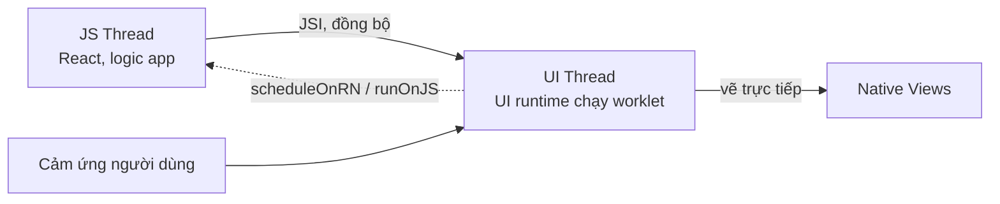
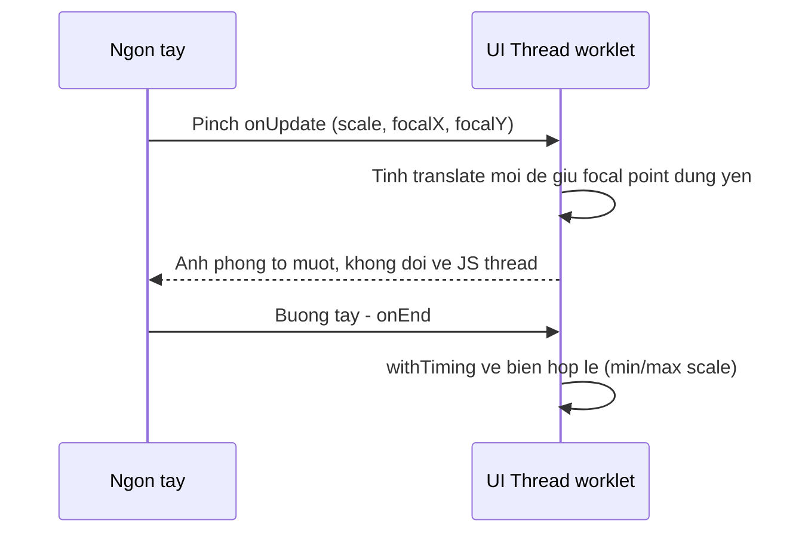

# Animation & Gesture nâng cao: Reanimated 4, Gesture Handler, Keyboard

Bài [Interactions](../09-interactions/1_interactions.md) đã giới thiệu sơ lược `Pressable`, `react-native-gesture-handler`, `Animated` và `Reanimated`. Bài này đi sâu vào cách viết animation và gesture **chuyên nghiệp**: chạy hoàn toàn trên **UI thread** (luồng xử lý giao diện, tách biệt khỏi JS thread) bằng **worklet** (hàm JavaScript được biên dịch để chạy trực tiếp trên UI thread), kết hợp gesture với animation (kéo-thả, pinch-zoom, swipe-to-dismiss), animation kiểu CSS mới của Reanimated 4, layout animation tự động, và cách xử lý bàn phím + safe area cho một màn hình phức tạp như chat — nơi mọi kỹ thuật này gặp nhau cùng lúc.

**Tương tự đơn giản:** Nếu JS thread là "bộ não" ra quyết định logic, UI thread là "cơ bắp" thực thi chuyển động. Reanimated cho phép "cơ bắp" tự phản xạ theo cử chỉ (kéo tới đâu, lò xo bật lại tới đó) mà không cần hỏi "bộ não" từng khung hình — đó là lý do animation mượt 60fps ngay cả khi JS thread đang bận tải dữ liệu.

---

:::note[Ghi nhớ nhanh]

- ⭐ **Reanimated 4 chỉ chạy trên New Architecture.** Runtime worklet tách thành package riêng `react-native-worklets`; babel plugin đổi tên thành `react-native-worklets/plugin` và **phải là plugin cuối cùng** trong `babel.config.js`.
- ⭐ **`runOnJS` từ `react-native-reanimated` đã deprecated** — khuyến nghị dùng `scheduleOnRN` từ `react-native-worklets` để gọi hàm JS thread từ trong worklet.
- **Shared value** (`useSharedValue`) sống trên cả hai thread, đọc/ghi qua `.value`, đổi giá trị **không** gây React re-render.
- Gesture kết hợp animation (`Gesture.Pan()` + `withSpring`) chạy toàn bộ trên UI thread — không qua bridge mỗi frame nên mượt kể cả khi JS thread bận.
- `react-native-keyboard-controller` cần bọc `KeyboardProvider` ở gốc app (bắt buộc trên Android) để né bàn phím chính xác trên Android 15 edge-to-edge.
- Bàn phím và safe area bottom inset là hai đại lượng **loại trừ lẫn nhau**, không cộng dồn — lỗi hay gặp nhất khi ghép composer chat.

:::

---

## Mục lục

- [Vì sao cần Reanimated 4 và Gesture Handler nâng cao?](#vì-sao-cần-reanimated-4-và-gesture-handler-nâng-cao)
- [1. UI thread và JS thread](#1-ui-thread-và-js-thread)
- [2. Shared Value và Worklet](#2-shared-value-và-worklet)
- [3. useAnimatedStyle và các hàm animation](#3-useanimatedstyle-và-các-hàm-animation)
- [4. Gọi ngược JS thread bằng runOnJS và scheduleOnRN](#4-gọi-ngược-js-thread-bằng-runonjs-và-scheduleonrn)
- [5. CSS Animations và Transitions trong Reanimated 4](#5-css-animations-và-transitions-trong-reanimated-4)
- [6. Layout Animations entering exiting và LinearTransition](#6-layout-animations-entering-exiting-và-lineartransition)
- [7. Gesture Handler nâng cao kết hợp nhiều gesture](#7-gesture-handler-nâng-cao-kết-hợp-nhiều-gesture)
- [8. Kéo thả Swipe to dismiss và Pinch to zoom](#8-kéo-thả-swipe-to-dismiss-và-pinch-to-zoom)
- [9. useAnimatedScrollHandler](#9-useanimatedscrollhandler)
- [10. Bàn phím trong màn chat](#10-bàn-phím-trong-màn-chat)
- [11. Safe Area nâng cao](#11-safe-area-nâng-cao)
- [12. Hiệu năng và thực hành tốt](#12-hiệu-năng-và-thực-hành-tốt)
- [Khi nào dùng?](#khi-nào-dùng)
- [Lỗi thường gặp](#lỗi-thường-gặp)
- [Câu hỏi phỏng vấn](#câu-hỏi-phỏng-vấn)

---

## Vì sao cần Reanimated 4 và Gesture Handler nâng cao?

**Vấn đề:** Với `Animated` core + `PanResponder`/`onPanResponderMove`, mọi cập nhật vị trí phải chạy trên **JS thread** rồi gửi lệnh vẽ sang native mỗi frame. Khi JS thread bận (render lại danh sách, gọi API, parse JSON), animation và gesture **giật cục** — đặc biệt rõ với thao tác phức tạp như kéo-thả có animation đàn hồi, hay pinch-zoom ảnh cần tính toán mỗi frame.

```jsx
// Cach cu: PanResponder + setState moi frame
const [scale, setScale] = useState(1);

const responder = PanResponder.create({
  onPanResponderMove: (evt, gesture) => {
    const nextScale = computeScale(gesture);
    setScale(nextScale);              // setState -> re-render -> lag khi JS ban
  },
  onPanResponderRelease: () => {
    // Animated.spring cung phai doi JS thread ra lenh moi frame
    Animated.spring(scaleValue, { toValue: 1 }).start();
  },
});
```

**Giải pháp:** Reanimated định nghĩa animation bằng **worklet** — hàm được biên dịch để chạy trực tiếp trên **UI thread**, đọc/ghi **shared value** đồng bộ. Gesture Handler cũng bắt cử chỉ trên native thread. Khi ghép hai thứ lại, toàn bộ chuỗi "chạm → tính toán → vẽ" không cần đi qua JS thread một lần nào — animation vẫn mượt 60fps dù JS thread đang treo.

```tsx
// Cach moi: Gesture + Shared Value, chay toan bo tren UI thread
const scale = useSharedValue(1);

const pinch = Gesture.Pinch()
  .onUpdate((e) => {
    scale.value = e.scale;            // ghi shared value tren UI thread
  })
  .onEnd(() => {
    scale.value = withSpring(1);      // animation cung chay tren UI thread
  });

const style = useAnimatedStyle(() => ({
  transform: [{ scale: scale.value }],
}));
```

:::tip[Dùng thực tế]

- **Kéo-thả reorder danh sách**: thẻ trượt theo tay, thẻ khác tự "nhường chỗ" bằng `LinearTransition`, thả tay thẻ đàn hồi (`withSpring`) về đúng vị trí.
- **Bottom sheet vuốt**: kéo lên/xuống bám tay 1:1, snap về điểm gần nhất bằng `withDecay` + velocity.
- **Pinch-to-zoom ảnh**: giữ nguyên điểm chạm (focal point) khi phóng to, giới hạn biên bằng `withTiming`.
- **Swipe-to-dismiss thông báo/modal**: vuốt qua ngưỡng → bay ra khỏi màn hình; chưa đủ ngưỡng → bật lại vị trí cũ.

:::

---

## 1. UI thread và JS thread

React Native chạy hai luồng chính:

- **JS thread**: chạy code JavaScript — logic app, tính toán, React reconciliation, gọi API.
- **UI thread** (native main thread): render view, nhận input cảm ứng, vẽ lên màn hình.

Với New Architecture, JS thread và native giao tiếp qua **JSI** (JavaScript Interface — cầu nối đồng bộ, thay cho bridge bất đồng bộ cũ) nên đã nhanh hơn nhiều so với kiến trúc cũ. Nhưng animation/gesture phức tạp vẫn cần chạy **ngay trên UI thread** để không phụ thuộc việc JS thread có đang rảnh hay không. Đó là lý do Reanimated dựng thêm một **UI runtime** riêng (một runtime JavaScript thứ hai, sống trên UI thread) — worklet biên dịch để chạy trong runtime này.



**Điểm mấu chốt:** worklet đọc/ghi shared value và chạy animation *ngay tại chỗ* trên UI thread, không cần hỏi ý JS thread. Chỉ khi cần gọi ngược một hàm JS bình thường (setState, dispatch, `console.log`, gọi API) mới cần "gửi tin nhắn" từ UI thread về JS thread — xem [phần 4](#4-gọi-ngược-js-thread-bằng-runonjs-và-scheduleonrn).

---

## 2. Shared Value và Worklet

### `useSharedValue`

`useSharedValue(initial)` tạo một object có thuộc tính `.value`, có thể đọc/ghi từ **cả JS thread lẫn UI thread**. Đổi `.value` **không** gây React re-render — hoàn toàn khác `useState`.

```tsx
import { useSharedValue } from 'react-native-reanimated';

const offset = useSharedValue(0);

// Doc/ghi tu JS thread (vi du trong onPress)
offset.value = 100;

// Doc trong worklet (UI thread) qua useAnimatedStyle - xem phan 3
```

### Worklet

Worklet là hàm JavaScript được đánh dấu bằng directive `'worklet';` ở dòng đầu (hoặc tự động — hầu hết callback của `useAnimatedStyle`, `Gesture.*`, `withTiming`... đã được babel plugin `react-native-worklets/plugin` tự "workletize"). Khi build, plugin biên dịch hàm này để chạy được trên UI runtime.

```tsx
function double(x: number) {
  'worklet';
  return x * 2;
}
```

```bash
npm install react-native-reanimated react-native-worklets
```

```js title="babel.config.js"
module.exports = {
  presets: ['module:@react-native/babel-preset'],
  // Reanimated 4 tach worklet runtime sang package rieng `react-native-worklets`.
  // Plugin nay PHAI la plugin CUOI CUNG trong mang plugins.
  plugins: ['react-native-worklets/plugin'],
};
```

---

## 3. useAnimatedStyle và các hàm animation

`useAnimatedStyle(() => ({...}))` trả về một style **phản ứng** theo shared value — mỗi lần `.value` đổi, worklet bên trong chạy lại trên UI thread và style cập nhật ngay, không qua React render.

```tsx
import Animated, {
  useSharedValue,
  useAnimatedStyle,
  withTiming,
  withSpring,
} from 'react-native-reanimated';

function FadeInBox() {
  const opacity = useSharedValue(0);
  const translateY = useSharedValue(20);

  useEffect(() => {
    opacity.value = withTiming(1, { duration: 300 });
    translateY.value = withSpring(0);
  }, []);

  const style = useAnimatedStyle(() => ({
    opacity: opacity.value,
    transform: [{ translateY: translateY.value }],
  }));

  return <Animated.View style={[styles.box, style]} />;
}
```

### Các hàm animation

| Hàm | Dùng khi | Ví dụ |
|---|---|---|
| `withTiming(toValue, config)` | Animation có thời lượng cố định, easing | `withTiming(1, { duration: 250 })` |
| `withSpring(toValue, config)` | Cảm giác đàn hồi tự nhiên (kéo-thả, bật lại) | `withSpring(0, { damping: 15 })` |
| `withDecay(config)` | Trôi tiếp theo quán tính (velocity) rồi dừng dần | `withDecay({ velocity: e.velocityX })` |
| `withSequence(...anims)` | Chạy animation nối tiếp nhau | `withSequence(withTiming(1.2), withTiming(1))` |
| `withRepeat(anim, count, reverse)` | Lặp lại (pulse, shimmer, loading dot) | `withRepeat(withTiming(1), -1, true)` |

```tsx
// Pulse vo han - hay dung cho skeleton loading / nut ghi am
scale.value = withRepeat(
  withSequence(withTiming(1.15, { duration: 400 }), withTiming(1, { duration: 400 })),
  -1,   // -1 = lap vo han
  false,
);

// Troi tiep theo quan tinh sau khi tha tay, roi bat vao bien
translateX.value = withDecay({
  velocity: e.velocityX,
  clamp: [0, MAX_SCROLL],
});
```

---

## 4. Gọi ngược JS thread bằng runOnJS và scheduleOnRN

Worklet chạy trên UI thread nên **không thể** gọi trực tiếp hàm JS bình thường (setState, dispatch Redux, `navigation.navigate`, gọi API...). Cần "lên lịch" hàm đó chạy lại trên JS thread.

- **`runOnJS`** (từ `react-native-reanimated`): API cũ, đã **deprecated** nhưng vẫn hoạt động (giữ tương thích ngược). Cách dùng: bọc hàm rồi gọi kết quả như một hàm mới.
- **`scheduleOnRN`** (từ `react-native-worklets`): API khuyến nghị thay thế, gọi thẳng không cần bọc hai lớp.

```tsx
// Cach cu (van chay, nhung IDE se bao deprecated)
import { runOnJS } from 'react-native-reanimated';

const pan = Gesture.Pan().onEnd((e) => {
  'worklet';
  if (e.translationX > 100) {
    runOnJS(onSwipeDismiss)();   // boc ham roi goi
  }
});

// Cach moi khuyen nghi (Reanimated 4 + react-native-worklets)
import { scheduleOnRN } from 'react-native-worklets';

const pan2 = Gesture.Pan().onEnd((e) => {
  'worklet';
  if (e.translationX > 100) {
    scheduleOnRN(onSwipeDismiss);   // goi thang, khong can boc
  }
});
```

Nếu chưa chắc phiên bản `react-native-worklets` trong dự án có export `scheduleOnRN` hay chưa, `runOnJS` vẫn là lựa chọn an toàn — chỉ là API cũ hơn.

---

## 5. CSS Animations và Transitions trong Reanimated 4

Reanimated 4 thêm cách viết animation theo cú pháp gần giống **CSS animation trên web** — khai báo keyframe trực tiếp trong style, không cần `useSharedValue`/`useAnimatedStyle` cho các hiệu ứng đơn giản (fade khi mount, pulse liên tục).

```tsx
import Animated from 'react-native-reanimated';

const fadeInKeyframes = {
  from: { opacity: 0, transform: [{ translateY: 12 }] },
  to: { opacity: 1, transform: [{ translateY: 0 }] },
};

function Toast() {
  return (
    <Animated.View
      style={{
        animationName: fadeInKeyframes,
        animationDuration: '300ms',
        animationTimingFunction: 'ease-out',
        animationFillMode: 'forwards',
      }}
    >
      <Text>Đã lưu</Text>
    </Animated.View>
  );
}
```

**Transition** (đổi mượt khi một giá trị style thay đổi giữa hai lần render, giống `transition` trên CSS):

```tsx
function ToggleBox({ active }: { active: boolean }) {
  return (
    <Animated.View
      style={{
        backgroundColor: active ? '#4f8cff' : '#e5e5e5',
        transitionProperty: 'backgroundColor',
        transitionDuration: '200ms',
      }}
    />
  );
}
```

Đây là tính năng **mới** của Reanimated 4, phù hợp cho animation trang trí đơn giản (không cần đọc giá trị mỗi frame theo gesture). Với animation phức tạp gắn liền gesture, `useSharedValue` + `useAnimatedStyle` vẫn là cách chính, ổn định hơn.

---

## 6. Layout Animations entering exiting và LinearTransition

Layout animation tự động animate việc **mount/unmount** và **đổi vị trí/kích thước** của component — không cần tự tính toán transform.

```tsx
import Animated, { FadeIn, FadeOut, LinearTransition } from 'react-native-reanimated';

function MessageBubble({ message, onRemove }: Props) {
  return (
    <Animated.View
      entering={FadeIn.duration(200)}
      exiting={FadeOut.duration(150)}
      layout={LinearTransition.springify()}
    >
      <Text>{message.text}</Text>
    </Animated.View>
  );
}
```

- `entering`/`exiting`: animation chạy khi component **mount**/**unmount** (ví dụ: tin nhắn mới bay vào, xoá tin nhắn mờ dần đi).
- `layout={LinearTransition}`: khi component đổi **vị trí** (do phần tử khác trong danh sách bị thêm/xoá phía trên), component tự trượt mượt sang vị trí mới thay vì "nhảy" tức thì.

```tsx
// Danh sach reorder: xoa 1 item, cac item con lai tu truot len
{items.map((item) => (
  <Animated.View key={item.id} layout={LinearTransition} exiting={FadeOut}>
    <Row item={item} />
  </Animated.View>
))}
```

---

## 7. Gesture Handler nâng cao kết hợp nhiều gesture

Bài Interactions đã giới thiệu `Gesture.Pan/Tap/Pinch/LongPress` cơ bản. Điểm nâng cao ở đây là **kết hợp nhiều gesture** và quyết định gesture nào chạy trên UI thread (mặc định, khi callback chỉ đọc/ghi shared value) hay ép chạy trên JS thread (`.runOnJS(true)`, khi callback cần gọi thẳng hàm JS như `setState` mà không dùng shared value).

```tsx
import { Gesture, GestureDetector, GestureHandlerRootView } from 'react-native-gesture-handler';

const pan = Gesture.Pan().onUpdate((e) => {
  translateX.value = e.translationX;
});

const pinch = Gesture.Pinch().onUpdate((e) => {
  scale.value = e.scale;
});

const doubleTap = Gesture.Tap().numberOfTaps(2).onEnd(() => {
  scale.value = withTiming(scale.value > 1 ? 1 : 2);
});

// Simultaneous: ca hai cung chay dong thoi (pan + pinch anh)
const composed = Gesture.Simultaneous(pan, pinch);

// Exclusive: cai dau tien activate se "thang", cai sau khong chay nua
const withDoubleTap = Gesture.Exclusive(doubleTap, composed);

// Race: nhieu gesture cung theo doi, cai nao activate truoc thi thang, cac cai con lai huy
const raced = Gesture.Race(pan, Gesture.Native());
```

```tsx
// Bat buoc bao GestureHandlerRootView o goc app - thieu se loi im lang tren Android
export default function App() {
  return (
    <GestureHandlerRootView style={{ flex: 1 }}>
      <MyApp />
    </GestureHandlerRootView>
  );
}
```

**Khi nào dùng `.runOnJS(true)`?** Một số dự án chủ động chọn viết gesture handler chạy callback trên JS thread bằng RN `Animated` (không dùng Reanimated worklet) — thường vì lý do kích thước bundle (không muốn kéo native dep Reanimated vào một phần app), chấp nhận đánh đổi mượt mà lấy gọn nhẹ. Cách viết chuẩn, mượt nhất vẫn là dùng shared value + worklet như các ví dụ trên.

---

## 8. Kéo thả Swipe to dismiss và Pinch to zoom

### Kéo-thả có đàn hồi

```tsx
function DraggableCard() {
  const translateX = useSharedValue(0);
  const translateY = useSharedValue(0);

  const pan = Gesture.Pan()
    .onUpdate((e) => {
      translateX.value = e.translationX;
      translateY.value = e.translationY;
    })
    .onEnd(() => {
      // Buong tay - lo xo tra ve vi tri cu
      translateX.value = withSpring(0);
      translateY.value = withSpring(0);
    });

  const style = useAnimatedStyle(() => ({
    transform: [
      { translateX: translateX.value },
      { translateY: translateY.value },
    ],
  }));

  return (
    <GestureDetector gesture={pan}>
      <Animated.View style={[styles.card, style]} />
    </GestureDetector>
  );
}
```

### Swipe to dismiss

```tsx
const DISMISS_THRESHOLD = 120;

function DismissibleRow({ onDismiss }: { onDismiss: () => void }) {
  const translateX = useSharedValue(0);

  const pan = Gesture.Pan()
    .onUpdate((e) => {
      translateX.value = e.translationX;
    })
    .onEnd((e) => {
      const passedThreshold = Math.abs(e.translationX) > DISMISS_THRESHOLD;
      if (passedThreshold) {
        translateX.value = withTiming(
          Math.sign(e.translationX) * 500,
          { duration: 200 },
          (finished) => {
            if (finished) scheduleOnRN(onDismiss);
          },
        );
      } else {
        translateX.value = withSpring(0);
      }
    });

  const style = useAnimatedStyle(() => ({
    transform: [{ translateX: translateX.value }],
    opacity: 1 - Math.min(Math.abs(translateX.value) / 300, 1),
  }));

  return (
    <GestureDetector gesture={pan}>
      <Animated.View style={style}>{/* noi dung row */}</Animated.View>
    </GestureDetector>
  );
}
```

`withTiming`/`withSpring` nhận tham số thứ 3 là **callback** chạy khi animation xong — callback này cũng là worklet, nên cần `scheduleOnRN`/`runOnJS` nếu muốn gọi hàm JS (như `onDismiss` ở trên) bên trong.

### Pinch to zoom giữ focal point



```tsx
function ZoomableImage() {
  const scale = useSharedValue(1);
  const savedScale = useSharedValue(1);
  const translateX = useSharedValue(0);
  const translateY = useSharedValue(0);

  const pinch = Gesture.Pinch()
    .onUpdate((e) => {
      scale.value = savedScale.value * e.scale;
    })
    .onEnd(() => {
      savedScale.value = scale.value;
      if (scale.value < 1) {
        scale.value = withTiming(1);
        savedScale.value = 1;
      }
    });

  const style = useAnimatedStyle(() => ({
    transform: [
      { translateX: translateX.value },
      { translateY: translateY.value },
      { scale: scale.value },
    ],
  }));

  return (
    <GestureDetector gesture={pinch}>
      <Animated.Image source={{ uri: '...' }} style={[styles.image, style]} />
    </GestureDetector>
  );
}
```

Toán học chính xác cho "giữ nguyên điểm chạm" (dịch chuyển theo `focalX`/`focalY` tương đối tâm ảnh) khá dài — điểm quan trọng cần nhớ là mọi phép tính đều chạy trong worklet `onUpdate`, không có bước nào quay lại JS thread.

---

## 9. useAnimatedScrollHandler

Bắt sự kiện scroll và chạy worklet ngay trên UI thread — dùng cho header co giãn, ẩn/hiện thanh điều hướng theo hướng cuộn, parallax.

```tsx
import Animated, { useAnimatedScrollHandler, useAnimatedStyle, interpolate } from 'react-native-reanimated';

function CollapsibleHeaderList() {
  const scrollY = useSharedValue(0);

  const scrollHandler = useAnimatedScrollHandler({
    onScroll: (event) => {
      scrollY.value = event.contentOffset.y;
    },
  });

  const headerStyle = useAnimatedStyle(() => ({
    height: interpolate(scrollY.value, [0, 120], [180, 60], 'clamp'),
    opacity: interpolate(scrollY.value, [0, 100], [1, 0.4], 'clamp'),
  }));

  return (
    <View style={{ flex: 1 }}>
      <Animated.View style={[styles.header, headerStyle]} />
      <Animated.FlatList
        data={messages}
        renderItem={renderItem}
        onScroll={scrollHandler}
        scrollEventThrottle={16}
      />
    </View>
  );
}
```

`Animated.FlatList` (component đã được `Animated.createAnimatedComponent` bọc sẵn từ Reanimated) là bắt buộc — `FlatList` thường của RN không hỗ trợ `onScroll` dạng worklet.

---

## 10. Bàn phím trong màn chat

Màn hình chat là nơi khó nhất để xử lý bàn phím: composer (ô nhập liệu) phải **dính đáy**, danh sách tin nhắn phải **co giãn** theo chiều cao bàn phím mà không giật, và hành vi Android/iOS khác nhau đáng kể.

### Bọc gốc app

```tsx
import { KeyboardProvider } from 'react-native-keyboard-controller';

export default function App() {
  return (
    <KeyboardProvider>
      <MyApp />
    </KeyboardProvider>
  );
}
```

`KeyboardProvider` **bắt buộc trên Android** để các component né bàn phím của thư viện hoạt động đúng với chế độ edge-to-edge (Android 15 trở lên bật mặc định). Trên iOS có thể bỏ qua nếu chỉ dùng `KeyboardAvoidingView` gốc của React Native.

### Composer dính đáy

```tsx
import { KeyboardStickyView } from 'react-native-keyboard-controller';

function ChatComposer() {
  return (
    <KeyboardStickyView offset={{ closed: 0, opened: 0 }}>
      <View style={styles.composerRow}>
        <TextInput style={styles.input} placeholder="Nhắn tin..." />
        <SendButton />
      </View>
    </KeyboardStickyView>
  );
}
```

`KeyboardStickyView` ghim view ngay phía trên bàn phím, tự trượt theo animation mở/đóng bàn phím của hệ điều hành — không cần tự tính padding.

### Danh sách tin nhắn co giãn theo bàn phím

```tsx
import { KeyboardAvoidingView } from 'react-native-keyboard-controller';

function ChatScreen() {
  return (
    <KeyboardAvoidingView style={{ flex: 1 }} behavior="padding">
      <FlatList
        data={messages}
        renderItem={renderItem}
        inverted
        style={{ flex: 1 }}
      />
      <ChatComposer />
    </KeyboardAvoidingView>
  );
}
```

### Tự vẽ animation theo bàn phím (nâng cao)

Khi cần hiệu ứng tuỳ biến (ví dụ composer phồng lên kèm animation riêng), dùng `useReanimatedKeyboardAnimation` — trả về **shared value** `height`/`progress` để đưa thẳng vào `useAnimatedStyle`.

```tsx
import { useReanimatedKeyboardAnimation } from 'react-native-keyboard-controller';

function CustomComposer() {
  const { height, progress } = useReanimatedKeyboardAnimation();

  const style = useAnimatedStyle(() => ({
    transform: [{ translateY: height.value }],
  }));

  return <Animated.View style={[styles.composer, style]} />;
}
```

`useKeyboardAnimation` (không có tiền tố `useReanimated`) là bản dùng RN `Animated` thay vì shared value Reanimated — chọn hook phù hợp với hệ animation đang dùng trong màn hình đó.

---

## 11. Safe Area nâng cao

`react-native-safe-area-context` cho biết vùng an toàn để đặt nội dung, tránh notch, Dynamic Island (iPhone), và thanh điều hướng Android edge-to-edge (gesture bar/nút back ảo).

```tsx
import { SafeAreaProvider, useSafeAreaInsets, SafeAreaView } from 'react-native-safe-area-context';

// Goc app
export default function App() {
  return (
    <SafeAreaProvider>
      <MyApp />
    </SafeAreaProvider>
  );
}

// Man hinh chat: chi can inset duoi cho composer, header da co SafeAreaView rieng
function ChatScreen() {
  const insets = useSafeAreaInsets();

  return (
    <View style={{ flex: 1, paddingBottom: insets.bottom }}>
      {/* ... */}
    </View>
  );
}
```

`SafeAreaView` với prop `edges` cho phép chỉ áp dụng inset ở một số cạnh (tránh double-padding khi header đã tự set):

```tsx
<SafeAreaView edges={['top']} style={styles.header}>
  <Text>Tiêu đề</Text>
</SafeAreaView>
```

**Điểm dễ sai nhất:** bàn phím mở ra thì `insets.bottom` (an toàn phía dưới khi *không* có bàn phím) và chiều cao bàn phím **không được cộng dồn** — khi bàn phím đang hiện, phần dưới cùng của bàn phím đã là "đáy an toàn" mới. Công thức đúng là lấy giá trị lớn hơn giữa hai bên, không phải tổng:

```tsx
// SAI - cong don, composer bi day len qua cao
const paddingBottom = insets.bottom + keyboardHeight;

// DUNG - bam phim dang mo thi insets.bottom khong con y nghia rieng
const paddingBottom = keyboardHeight > 0 ? keyboardHeight : insets.bottom;
```

Trong thực tế, các component của `react-native-keyboard-controller` (`KeyboardAvoidingView`, `KeyboardStickyView`) đã tự xử lý phần này — chỉ cần tự tính tay khi viết animation tuỳ biến như phần 10.

---

## 12. Hiệu năng và thực hành tốt

- **Không đọc `.value` trong thân component** (ngoài worklet) — chỉ đọc bên trong `useAnimatedStyle`, `useDerivedValue`, hoặc các callback gesture/animation. Đọc trong render sẽ không phản ứng và có thể log warning "Reading from `value` during component render".
- **Giữ worklet gọn, tránh gọi hàm JS thường xuyên** — mỗi lần `runOnJS`/`scheduleOnRN` là một lượt "nhắn tin" qua thread khác, gọi dồn dập (mỗi frame) sẽ triệt tiêu lợi ích chạy trên UI thread.
- **Dùng `useDerivedValue` thay vì tính lại trong nhiều `useAnimatedStyle`** khi nhiều style phụ thuộc cùng một phép tính, tránh lặp tính toán.
- **Test trên bản release/production**, không chỉ Dev — Reanimated + New Architecture ở chế độ Dev chậm hơn đáng kể do thêm kiểm tra debug.
- **Đo bằng Flipper/Perf Monitor** trước khi tối ưu — animation "cảm thấy giật" nhiều khi do JS thread bận (re-render danh sách dài) chứ không phải do animation.
- **Layout animation (`entering`/`exiting`/`layout`) không miễn phí** với danh sách rất dài — cân nhắc tắt trên item ở xa viewport nếu đo được giật.

---

## Khi nào dùng?

| Nhu cầu | Công cụ |
|---|---|
| Animation đơn giản khi mount (fade, pulse) | CSS animation (`animationName`) hoặc `entering`/`exiting` |
| Animation gắn với gesture (kéo, pinch) | `useSharedValue` + `useAnimatedStyle` + `Gesture.*` |
| Danh sách thêm/xoá/reorder mượt | `layout={LinearTransition}` |
| Header co giãn theo scroll | `useAnimatedScrollHandler` + `interpolate` |
| Composer chat dính đáy bàn phím | `KeyboardStickyView` / `KeyboardAvoidingView` (keyboard-controller) |
| Animation tuỳ biến theo bàn phím | `useReanimatedKeyboardAnimation` |
| Tránh notch/Dynamic Island/nav bar Android | `useSafeAreaInsets`, `SafeAreaView` với `edges` |
| Gọi setState/API từ trong worklet | `scheduleOnRN` (mới) hoặc `runOnJS` (cũ, vẫn chạy) |

---

## Lỗi thường gặp

| Lỗi | Nguyên nhân | Cách sửa |
|---|---|---|
| Build lỗi liên quan babel/worklet | Thiếu hoặc đặt sai vị trí `react-native-worklets/plugin` | Thêm plugin, đặt **cuối cùng** trong mảng `plugins` của `babel.config.js` |
| Gesture không phản hồi trên Android, im lặng không lỗi | Thiếu `GestureHandlerRootView` bọc gốc app | Bọc `<GestureHandlerRootView style={{ flex: 1 }}>` ở ngoài cùng |
| Warning "Reading from value during render" | Đọc `sharedValue.value` trực tiếp trong JSX/thân component | Chuyển vào `useAnimatedStyle`/`useDerivedValue` |
| Composer chat bị đẩy lên quá cao khi mở bàn phím | Cộng `insets.bottom + keyboardHeight` thay vì lấy giá trị lớn hơn | Dùng công thức loại trừ (xem phần 11), hoặc để `KeyboardAvoidingView`/`KeyboardStickyView` tự lo |
| Android 15: bàn phím không đẩy composer (edge-to-edge) | RN `KeyboardAvoidingView` gốc chưa xử lý đúng edge-to-edge | Dùng `KeyboardAvoidingView` của `react-native-keyboard-controller`, bọc `KeyboardProvider` |
| `runOnJS`/`scheduleOnRN` gọi liên tục làm animation giật | Gọi hàm JS mỗi frame trong `onUpdate` thay vì chỉ ở `onEnd` | Chỉ gọi ngược JS thread khi thật cần (kết thúc gesture, vượt ngưỡng), không gọi mỗi frame |
| Animation layout property (`width`, `height`) giật trên máy cũ | Animate trực tiếp layout property thay vì `transform` | Ưu tiên `transform: [{ scale }]` thay vì đổi `width`/`height` khi có thể |

---

## Câu hỏi phỏng vấn

Những câu thường gặp về chủ đề này. Tự trả lời trước, rồi bấm **Xem đáp án** để đối chiếu.

**1. Shared value khác gì `useState`?**

<details className="qa">
<summary>Xem đáp án</summary>

`useSharedValue` tạo object có `.value`, đọc/ghi được từ cả JS thread và UI thread, đổi giá trị **không** gây React re-render — cập nhật animation trực tiếp trên UI thread. `useState` đổi giá trị luôn kích hoạt re-render trên JS thread, không phù hợp cho animation chạy mỗi frame.

</details>

**2. Worklet là gì và vì sao cần babel plugin?**

<details className="qa">
<summary>Xem đáp án</summary>

Worklet là hàm JavaScript được đánh dấu (`'worklet';` hoặc tự động bởi các API của Reanimated/Gesture Handler) để biên dịch thành dạng chạy được trên **UI runtime** — một runtime JavaScript thứ hai sống trên UI thread. Babel plugin `react-native-worklets/plugin` thực hiện việc "workletize" này lúc build; thiếu plugin, hàm vẫn chỉ chạy được trên JS thread như bình thường.

</details>

**3. `runOnJS` và `scheduleOnRN` khác nhau thế nào?**

<details className="qa">
<summary>Xem đáp án</summary>

Cả hai đều dùng để gọi một hàm JS bình thường từ bên trong worklet (UI thread → JS thread). `runOnJS` (từ `react-native-reanimated`) là API cũ, nay đã **deprecated**, cách dùng là bọc hàm rồi gọi: `runOnJS(fn)(args)`. `scheduleOnRN` (từ `react-native-worklets`) là API khuyến nghị thay thế, gọi thẳng: `scheduleOnRN(fn, args)`. Cả hai đều vẫn hoạt động.

</details>

**4. Vì sao Reanimated 4 yêu cầu New Architecture?**

<details className="qa">
<summary>Xem đáp án</summary>

Reanimated 4 dựa vào JSI và cơ chế UI runtime chạy song song với JS runtime — hạ tầng này gắn với New Architecture (Fabric + TurboModules). Với Old Architecture, chỉ dùng được Reanimated bản 3 trở về trước.

</details>

**5. `withTiming` và `withSpring` khác nhau ở điểm nào?**

<details className="qa">
<summary>Xem đáp án</summary>

`withTiming` chạy theo thời lượng cố định (`duration`) và easing xác định trước — phù hợp khi cần animation kết thúc đúng lúc. `withSpring` mô phỏng vật lý lò xo (damping, stiffness), thời lượng không cố định, cảm giác tự nhiên hơn cho tương tác kéo-thả, bật lại.

</details>

**6. `Gesture.Simultaneous`, `Gesture.Exclusive`, `Gesture.Race` khác nhau ra sao?**

<details className="qa">
<summary>Xem đáp án</summary>

- `Simultaneous`: nhiều gesture cùng chạy đồng thời (ví dụ pan + pinch khi zoom ảnh).
- `Exclusive`: ưu tiên theo thứ tự khai báo — gesture đầu tiên activate sẽ chặn các gesture sau.
- `Race`: nhiều gesture cùng "chờ", gesture nào activate trước thắng, các gesture còn lại bị huỷ.

</details>

**7. `entering`/`exiting` và `layout` (LinearTransition) khác nhau chỗ nào?**

<details className="qa">
<summary>Xem đáp án</summary>

`entering`/`exiting` animate khi component **mount**/**unmount** (ví dụ tin nhắn mới xuất hiện, bị xoá). `layout` (thường dùng `LinearTransition`) animate khi component **đổi vị trí hoặc kích thước** giữa hai lần render mà vẫn tồn tại — ví dụ các item bên dưới tự trượt lên khi một item phía trên bị xoá.

</details>

**8. Vì sao cần `GestureHandlerRootView`?**

<details className="qa">
<summary>Xem đáp án</summary>

Gesture Handler cần một root view native để quản lý toàn bộ cây gesture của app. Thiếu nó, gesture trên Android thường không hoạt động (đôi khi không báo lỗi rõ ràng), còn iOS có thể vẫn chạy được ở một số trường hợp nhưng không đảm bảo đúng hành vi.

</details>

**9. Vì sao Android cần `KeyboardProvider` còn iOS có thể không cần?**

<details className="qa">
<summary>Xem đáp án</summary>

`react-native-keyboard-controller` dùng `WindowInsetsAnimationCallback` (API riêng của Android) để theo dõi bàn phím chính xác trong chế độ edge-to-edge — cơ chế này cần được khởi tạo qua `KeyboardProvider`. Trên iOS, `KeyboardAvoidingView` gốc của React Native vẫn hoạt động tốt trong nhiều trường hợp nên một số app chọn không kéo thêm native dependency ở nền tảng này.

</details>

**10. Vì sao không nên cộng `insets.bottom` với chiều cao bàn phím?**

<details className="qa">
<summary>Xem đáp án</summary>

`insets.bottom` là khoảng an toàn khi **không** có bàn phím (ví dụ vùng thanh điều hướng cử chỉ). Khi bàn phím mở, đáy bàn phím đã trở thành ranh giới an toàn mới — cộng dồn cả hai sẽ đẩy nội dung lên cao hơn cần thiết. Công thức đúng là lấy giá trị lớn hơn (bàn phím đang mở thì dùng chiều cao bàn phím, đóng thì dùng `insets.bottom`).

</details>

**11. `useAnimatedScrollHandler` khác gì so với `onScroll` thường?**

<details className="qa">
<summary>Xem đáp án</summary>

`onScroll` thường của `ScrollView`/`FlatList` chạy callback trên JS thread. `useAnimatedScrollHandler` tạo một handler worklet, đọc vị trí cuộn và cập nhật shared value ngay trên UI thread — cho phép animation theo scroll (header co giãn, parallax) mượt mà không phụ thuộc JS thread.

</details>

**12. Khi nào nên dùng CSS animation mới của Reanimated 4 thay vì `useSharedValue`?**

<details className="qa">
<summary>Xem đáp án</summary>

CSS animation (`animationName`, `transitionProperty`...) phù hợp cho hiệu ứng trang trí đơn giản, không cần đọc giá trị theo gesture mỗi frame (fade khi mount, đổi màu khi đổi trạng thái). Khi animation phải phản ứng theo cử chỉ liên tục (kéo, pinch, scroll), `useSharedValue` + `useAnimatedStyle` vẫn là cách chính vì kiểm soát được từng khung hình.

</details>
