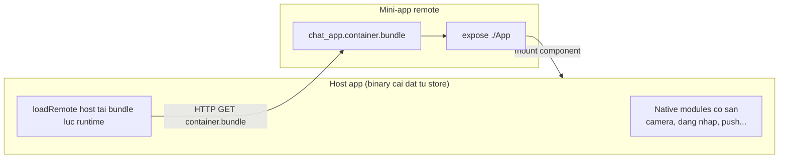
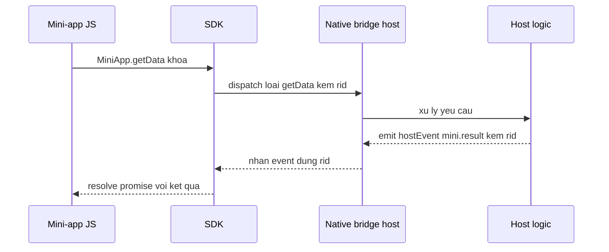
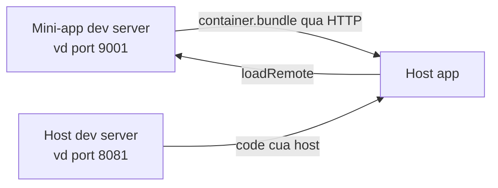
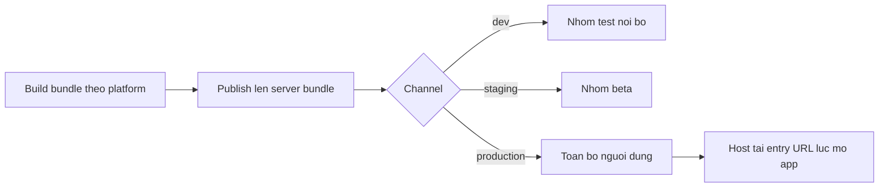

# Super-app với Re.Pack & Module Federation

**Super-app** là một app "vỏ" (gọi là **host**) chứa nhiều module con độc lập gọi là **mini-app** (còn gọi là **remote**) -- mỗi mini-app là một tính năng lớn (chat, ví điện tử, đặt vé...) được đóng gói, build và **phát hành riêng**, không phụ thuộc vào lịch release của app chính. Kỹ thuật đứng sau là **Module Federation** (MF) -- cho phép nhiều bundle JavaScript build **tách rời nhau** vẫn gọi được code của nhau **lúc runtime**, qua HTTP, thay vì phải gộp chung một bundle lúc build như cách làm truyền thống.

**Tương tự đơn giản:** Host là **trung tâm thương mại**, mini-app là **từng gian hàng**. Trung tâm xây một lần, gian hàng nào cũng thay bảng hiệu, sửa hàng hoá được **mà không cần đập lại cả toà nhà**.

---

:::note[Ghi nhớ nhanh]

- ⭐ **Metro không hỗ trợ code splitting runtime** -- mọi thứ gộp vào 1 bundle lúc build. Re.Pack 5 (dựa trên **Rspack**) thay Metro để làm được Module Federation trên React Native.
- ⭐ **Shared dependency phải khớp version tuyệt đối giữa host và mini-app** -- lệch version của một native module (react-native-screens, reanimated...) gây lỗi `RUNTIME-006` hoặc crash `"Tried to register two views with the same name"`.
- **Host = provider** (`eager: true`, cấp sẵn mọi native module đã build vào binary); **mini-app = consumer** (`import: false`, không bundle bản riêng, luôn xin bản của host).
- **`loadRemote()`** tải và thực thi bundle của mini-app lúc runtime, sau khi host đã `registerRemotes()` với một entry URL trỏ tới file `*.container.bundle`.
- Mini-app gọi năng lực gốc (chụp ảnh, đăng nhập, thông báo...) qua một **SDK riêng** được host cấp như singleton -- SDK chuyển tiếp lời gọi tới host qua **native bridge**, không tự đụng native code.
- Mini-app **không thể tự thêm native module mới** nếu binary của host chưa build sẵn module đó -- muốn thêm phải phát hành bản host mới qua store.

:::

---

## Mục lục

- [Vì sao Metro không đủ, phải cần Re.Pack?](#vì-sao-metro-không-đủ-phải-cần-repack)
- [1. Kiến trúc host và mini-app](#1-kiến-trúc-host-và-mini-app)
- [2. Cấu hình phía mini-app expose một entry](#2-cấu-hình-phía-mini-app-expose-một-entry)
- [3. Cấu hình phía host đăng ký remote và tải runtime](#3-cấu-hình-phía-host-đăng-ký-remote-và-tải-runtime)
- [4. Shared dependencies singleton eager import false](#4-shared-dependencies-singleton-eager-import-false)
- [5. Vì sao version shared phải khớp tuyệt đối](#5-vì-sao-version-shared-phải-khớp-tuyệt-đối)
- [6. Preload shared để tránh bị tree-shake](#6-preload-shared-để-tránh-bị-tree-shake)
- [7. Mini-app SDK gọi năng lực host qua native bridge](#7-mini-app-sdk-gọi-năng-lực-host-qua-native-bridge)
- [8. Dev flow hai dev server và deep link](#8-dev-flow-hai-dev-server-và-deep-link)
- [9. Build publish bundle và OTA theo channel](#9-build-publish-bundle-và-ota-theo-channel)
- [10. Ranh giới mini-app không thêm được native code](#10-ranh-giới-mini-app-không-thêm-được-native-code)
- [Khi nào dùng?](#khi-nào-dùng)
- [Lỗi thường gặp](#lỗi-thường-gặp)
- [Câu hỏi phỏng vấn](#câu-hỏi-phỏng-vấn)

---

## Vì sao Metro không đủ, phải cần Re.Pack?

**Vấn đề:** Bundler mặc định của React Native là **Metro** -- nó gom **toàn bộ** code (app chính + mọi tính năng) thành **một bundle JS duy nhất** ngay lúc build. Metro không có khái niệm "tải thêm code từ một server khác lúc app đang chạy", cũng không hỗ trợ **Module Federation**. Hệ quả: một super-app có 10 tính năng lớn thì sửa 1 dòng ở tính năng chat cũng phải build lại, test lại, và phát hành lại **toàn bộ app** qua App Store/Play Store -- kể cả khi 9 tính năng còn lại không đổi gì.

```js
// Metro: build 1 lan, gop het vao 1 bundle -- khong the tach chat-miniapp
// ra thanh 1 artifact rieng de deploy doc lap
module.exports = {
  transformer: { getTransformOptions: async () => ({}) },
  // khong co khai niem "remote module tai qua HTTP luc runtime"
};
```

**Giải pháp:** **Re.Pack 5** là bundler thay thế Metro cho React Native, xây trên nền **Rspack** (bundler viết bằng Rust, tương thích API với webpack). Vì tương thích webpack, Re.Pack thừa hưởng được **Module Federation** -- cơ chế cho phép build nhiều "container" JS **độc lập**, mỗi container có thể **expose** (phơi ra) một số module, và container khác **tải nó lúc runtime** qua một URL HTTP, giống như tải một trang web con.

```js
// rspack.config.mjs cua mini-app (remote) -- build ra 1 file rieng, publish rieng
import * as Repack from '@callstack/repack';

export default (env) => ({
  // ...
  plugins: [
    new Repack.RepackPlugin(),
    new Repack.plugins.ModuleFederationPluginV2({
      name: 'chat_app',
      filename: 'chat_app.container.bundle', // artifact publish rieng, khong dinh vao host
      exposes: { './App': './src/app/App' },
    }),
  ],
});
```

:::tip[Dùng thực tế]

- **Nhiều team ship độc lập:** team chat và team ví không đụng code của nhau, không chờ nhau release.
- **OTA riêng cho từng mini-app:** sửa lỗi tính năng chat, publish bundle mới, người dùng nhận bản vá **ngay lần mở app tiếp theo** -- không qua review store.
- **App chính nhẹ hơn:** những tính năng ít dùng chỉ tải bundle khi người dùng thực sự mở tới, không đóng gói sẵn vào app cài đặt ban đầu.
- **Thử nghiệm A/B / rollout theo kênh:** publish một bản mini-app cho nhóm nhỏ người dùng (channel `beta`) trước khi phát hành đại trà.

:::

---

## 1. Kiến trúc host và mini-app

Trong Module Federation có hai vai trò:

- **Host**: app vỏ, chứa navigation gốc, các native module đã build sẵn (camera, đăng nhập, push notification...), và logic **tải + mount** mini-app lúc runtime. Host **không expose** gì cả -- nó chỉ tiêu thụ (consume).
- **Mini-app (remote)**: một bundle JS build riêng, **expose** đúng một entry point (thường là component gốc `./App`) để host mount vào. Mini-app không có `remotes` -- nó không tải module từ container khác.



Host chạy `registerRemotes()` để khai báo "mini-app tên X nằm ở URL Y", sau đó gọi `loadRemote('X/App')` để tải và thực thi bundle đó, nhận về component React để render như một component bình thường.

---

## 2. Cấu hình phía mini-app expose một entry

Phía mini-app (remote), plugin `ModuleFederationPluginV2` cần ba thứ chính: `name` (định danh MF, phải là identifier JS hợp lệ -- không chứa dấu `-`), `exposes` (danh sách module cho bên ngoài mượn), và `filename` (tên file bundle xuất ra).

```js
// rspack.config.mjs -- mini-app "chat-miniapp"
import * as Repack from '@callstack/repack';

export default (env) => ({
  mode: env.mode,
  entry: './index.js',
  plugins: [
    new Repack.RepackPlugin(),
    new Repack.plugins.ModuleFederationPluginV2({
      name: 'chat_miniapp', // JS identifier -- host se khai remotes: { chat_miniapp: ... }
      filename: 'chat_miniapp.container.bundle',
      exposes: {
        './App': './src/app/App', // component goc, host se loadRemote('chat_miniapp/App')
      },
      shared: {
        // xem muc 4
      },
    }),
  ],
});
```

Một vài lưu ý bundling đặc thù React Native (khác web):

- Bundle publish cho mobile thường phải là **một file duy nhất** (không tách chunk rời) vì hạ tầng ký số/verify bundle chỉ ký một file. Cấu hình `output.asyncChunks: false` và `optimization.splitChunks: false` để ép mọi chunk gộp vào container.
- `dts` (tự sinh type definitions runtime qua WebSocket) nên **tắt** trên React Native -- cơ chế đó dựa vào WebSocket dev-only, không tương thích môi trường app di động.

---

## 3. Cấu hình phía host đăng ký remote và tải runtime

Host **không khai `remotes` cố định trong config build** khi cần đổi mini-app linh hoạt lúc runtime (ví dụ cho phép nhập slug/host/port trên màn hình debug). Thay vào đó, host đăng ký remote **bằng code**, qua API runtime của package `@module-federation/runtime` (nền tảng chạy dưới `@module-federation/enhanced` mà `ModuleFederationPluginV2` sử dụng):

```tsx
import { getInstance, loadRemote } from '@module-federation/runtime';

type RemoteModule = { default: React.ComponentType };

function registerAndLoad(slug: string, entryUrl: string) {
  const instance = getInstance();
  instance?.registerRemotes(
    [{ name: slug, entry: entryUrl }], // entry PHAI la URL container.bundle, khong phai manifest.json
    { force: false },
  );
}

async function launchMiniApp(slug: string) {
  const mod = await loadRemote<RemoteModule>(`${slug}/App`);
  if (!mod?.default) throw new Error(`loadRemote("${slug}/App") tra ve module rong`);
  return mod.default; // component React, mount binh thuong
}
```

Component tải được **không dùng `React.lazy`/`Suspense`** trong nhiều pattern thực tế -- việc `loadRemote` (bất đồng bộ + có thể timeout) được xử lý **trước**, ở tầng logic, rồi mới truyền component đã resolve xuống UI. Lý do: kiểm soát được trạng thái loading/lỗi/retry rõ ràng, và tránh vòng lặp render lại khi mini-app lỗi giữa chừng.

```tsx
function MiniAppContainer({ Component }: { Component: React.ComponentType }) {
  return (
    <View style={{ flex: 1 }}>
      <Component />
    </View>
  );
}
```

Việc **tải bundle qua HTTP** (thay vì `import` tĩnh) đi qua một `ScriptManager` (do Re.Pack cung cấp) với một `resolver` tự viết -- resolver quyết định URL thật của từng file cần tải, ví dụ theo quy ước:

```
{baseUrl}/{platform}/{slug}.container.bundle   // bundle chinh (container)
{baseUrl}/{platform}/{chunkId}.chunk.bundle    // cac chunk phu (neu co)
```

---

## 4. Shared dependencies singleton eager import false

Nếu mỗi bên (host và mini-app) tự bundle riêng bản `react`, `react-native`, hay một native module, sẽ có **hai bản instance khác nhau** chạy song song trong cùng app -- với các module có native view (ví dụ thư viện màn hình, gesture), điều này gây đăng ký trùng native component. Module Federation giải quyết bằng khai báo `shared`: một dependency được đánh dấu **share** sẽ chỉ tồn tại **một bản duy nhất** trong runtime, dùng chung giữa host và mọi mini-app.

Có ba cờ quan trọng:

| Cờ | Ý nghĩa |
|---|---|
| `singleton: true` | Ép chỉ một instance của module này tồn tại trong toàn bộ share scope, dù nhiều bên cùng khai `shared`. |
| `eager` | `true`: bundle module này **ngay vào container**, sẵn sàng cấp cho bên khác dùng ngay (thường đặt ở **host**). `false`: không bundle sẵn, chỉ tải khi cần (thường đặt ở **mini-app**). |
| `import: false` | Mini-app khai `import: false` cho một dependency nghĩa là **không bundle bản dự phòng (fallback)** -- nếu host không cấp được, mini-app sẽ lỗi ngay thay vì âm thầm dùng bản riêng. |

```js
// Phia HOST -- provider: eager true, khong co import:false (host la ben CAP)
shared: {
  react: { singleton: true, eager: true, requiredVersion: '19.2.3', version: '19.2.3' },
  'react-native': { singleton: true, eager: true, requiredVersion: '0.85.2', version: '0.85.2' },
  'react-native-screens': { singleton: true, eager: true, requiredVersion: '^4.26.2', version: '4.26.2' },
}
```

```js
// Phia MINI-APP -- consumer: eager false, import:false (khong bundle fallback,
// luon xin ban cua host)
shared: {
  react: {
    singleton: true,
    eager: false,
    import: false, // host luon cung cap -> mini-app khong bundle fallback
    requiredVersion: '19.2.3',
    version: '19.2.3',
  },
  'react-native-screens': {
    singleton: true,
    eager: false,
    import: false,
    requiredVersion: '^4.26.2',
    version: '4.26.2',
  },
}
```

Với những package **thuần JS, không có native code** (ví dụ một SDK nội bộ không phụ thuộc runtime gì đặc biệt), mini-app có thể **giữ lại fallback** (không đặt `import: false`) -- nếu host chưa kịp cấp bản mới, mini-app vẫn chạy được bằng bản đã bundle sẵn của chính nó, chỉ là không dùng chung instance với host.

---

## 5. Vì sao version shared phải khớp tuyệt đối

**Vấn đề:** Với các thư viện có **native view/module** (đăng ký component gốc dưới một cái tên cố định, ví dụ tên view `PasteInput`), nếu host build sẵn version `A` nhưng mini-app khai `requiredVersion` không tương thích với `A`, cơ chế negotiate (thoả thuận version) của Module Federation runtime sẽ thất bại. Runtime báo lỗi dạng mã `RUNTIME-006` (share module không thoả mãn version yêu cầu), và tuỳ cấu hình fallback, mini-app có thể rơi vào bundle bản JS riêng của nó -- bản riêng này cố đăng ký lại **cùng một native view** với native side, gây crash:

```
Invariant Violation: Tried to register two views with the same name PasteInput
```

```js
// SAI -- host build san 2.0.1 nhung mini-app doi ^3.0.0 -> negotiate that bai
// HOST
'@vendor/paste-input': { singleton: true, eager: true, version: '2.0.1' },
// MINI-APP
'@vendor/paste-input': { singleton: true, import: false, requiredVersion: '^3.0.0' },
```

**Giải pháp:** Với mọi shared dependency có native code, `version` và `requiredVersion` giữa host và mọi mini-app phải được **đồng bộ thủ công** mỗi khi một bên nâng cấp -- không có cơ chế tự động phát hiện lệch giữa hai repo build riêng. Cách phòng ngừa thực tế:

- Giữ một danh sách (checklist/gate script) so khớp `shared` giữa `rspack.config` của host và của từng mini-app trước khi publish.
- Khi một native module đổi version ở host, phải publish một bản mini-app mới khai đúng `requiredVersion` mới -- **không** giả định version cũ vẫn tương thích.
- Với dependency thuần JS không có native view, lệch version ít rủi ro hơn (không có xung đột đăng ký native), nhưng vẫn nên khớp để tránh hành vi khác nhau giữa hai bản.

---

## 6. Preload shared để tránh bị tree-shake

**Vấn đề:** Bundler (Rspack) sẽ **tree-shake** (loại bỏ) mọi module mà host không thực sự `import` ở đâu trong code UI của nó. Nếu một native module chỉ được khai trong `shared` của rspack config (để cấp cho mini-app) nhưng **không có dòng import nào** trong code host dùng tới nó trực tiếp, bundler coi đó là "không dùng" và loại khỏi bundle cuối -- kể cả khi đã đặt `eager: true`. Kết quả: share scope của host **thiếu module đó**, mini-app gọi `import: false` tới nó sẽ nhận về `undefined`, và crash ngay khi mini-app cố dùng.

```js
// host khai shared nhung KHONG co code nao import truc tiep package nay
// -> bundler tree-shake mat -> mini-app goi vao se la undefined
shared: {
  'some-native-lib': { singleton: true, eager: true, version: '1.0.0' },
}
```

**Giải pháp:** Thêm một file **side-effect import** -- import "trần" (không lấy giá trị gì) từng package đã khai trong `shared` nhưng UI host không trực tiếp dùng. File này được import **đầu tiên**, trước cả lúc gọi `loadRemote()`, để ép bundler giữ các module đó lại trong graph phụ thuộc của host.

```ts
// src/federation/preloadShared.ts
// Chi de dang ky module vao dependency graph cua host -- khong dung gia tri gi.
// Them shared moi o rspack.config thi PHAI them import tuong ung o day.
import 'some-native-lib';
import 'another-shared-package';
```

```ts
// entry point cua host (import DAU TIEN, truoc moi thu lien quan federation)
import './src/federation/preloadShared';
import { loadRemote } from '@module-federation/runtime';
// ...
```

---

## 7. Mini-app SDK gọi năng lực host qua native bridge

Mini-app không tự viết native code (xem [mục 10](#10-ranh-giới-mini-app-không-thêm-được-native-code)) -- nó gọi các năng lực của host (lấy dữ liệu người dùng, mở màn hình gốc, ghi nhận metric, gửi thông báo...) qua một **SDK riêng**, được cả host lẫn mọi mini-app import như một **dependency share, singleton, eager ở host**. SDK là một tầng JS mỏng, bên dưới nó gọi tới một **native bridge module** (ví dụ một TurboModule tên `HostBridge`) mà chỉ host mới có, bằng cơ chế **dispatch một loại hành động kèm dữ liệu, rồi lắng nghe một sự kiện kết quả**.

```ts
// Be mat SDK -- mini-app import nhu 1 package thong thuong
import MiniApp from '@vendor/miniapp-sdk';

// Doc du lieu tu host
const profile = await MiniApp.getData('user.profile');

// Lang nghe vong doi tang cha (host dang o nen / quay lai)
const unsubscribe = MiniApp.on('backRequest', () => {
  // mini-app tu quyet dinh co dong man hinh hay khong
});
```

```ts
// Duoi tang SDK -- goi native bridge qua dispatch + cho event ket qua (RPC don gian)
function request(type: string, payload: unknown): Promise<unknown> {
  return new Promise((resolve) => {
    const rid = `r_${Date.now()}`;
    const sub = nativeEventEmitter.addListener('hostEvent', (e) => {
      if (e.type === 'mini.result' && e.data?.__rid === rid) {
        sub.remove();
        resolve(e.data.result);
      }
    });
    nativeBridge.dispatch(type, JSON.stringify({ ...payload, __rid: rid }));
  });
}
```



Vì SDK dùng chung một instance (singleton, eager ở host) giữa host và mọi mini-app, việc nâng cấp SDK (thêm API mới) đòi hỏi rebuild **cả gói SDK** rồi publish bundle mới cho từng mini-app dùng bản đó -- quên bước rebuild sẽ khiến mini-app vẫn chạy API cũ dù đã sửa code nguồn.

---

## 8. Dev flow hai dev server và deep link

Vì host và mini-app là **hai project build riêng**, khi phát triển cần chạy **hai dev server song song trên hai cổng khác nhau**:



```bash
# Terminal 1 -- dev server CUA mini-app
cd chat-miniapp && npm start   # vd cong 9001

# Terminal 2 -- dev server CUA host + chay app
cd host-app
npm start                       # vd cong 8081
npm run ios      # hoac: npm run android
```

Trên **Android emulator**, `localhost` của emulator không phải là máy host thật -- phải trỏ về `10.0.2.2`, hoặc forward cổng bằng `adb reverse` cho cả hai dev server:

```bash
adb reverse tcp:9001 tcp:9001   # dev server cua mini-app
adb reverse tcp:8081 tcp:8081   # dev server cua host
```

Để tester không phải gõ tay host/port/slug trên thiết bị, host có thể khai một **URL scheme** (deep link) tự điền form kết nối và tự kết nối:

```
myapp://connect?host=192.168.1.20&port=9001&slug=chat_miniapp
```

Scheme này được khai trong cấu hình native của host (`Info.plist` trên iOS, `AndroidManifest.xml` trên Android), và code JS lắng nghe qua API xử lý deep link của React Native để đọc query string, lưu lại cấu hình, rồi chạy lại luồng `registerRemotes` + `loadRemote` ở [mục 3](#3-cấu-hình-phía-host-đăng-ký-remote-và-tải-runtime).

---

## 9. Build publish bundle và OTA theo channel

Lệnh build (bundler CLI của Re.Pack) build ra **một bundle riêng cho từng nền tảng**, đặt tên theo quy ước `<tên-mini-app>.container.bundle`:

```bash
# Build production, phat sinh vd: chat_miniapp.container.bundle
npx react-native webpack-bundle --platform ios --mode production
npx react-native webpack-bundle --platform android --mode production
```

Bundle này (đã build, có thể đã ký số) được **publish** lên một server lưu trữ bundle, thường theo khái niệm **channel** (kênh phát hành) -- ví dụ `dev`, `staging`, `production` -- để có thể thử một bản mới cho một nhóm nhỏ trước khi phát hành đại trà. Host, khi khởi động, xây URL entry theo quy ước cố định và tải bundle tương ứng:

```
{base-url}/{platform}/{slug}.container.bundle
```



Vì bundle được tải **lúc runtime, không qua store**, đây chính là kênh **OTA (over-the-air update)** cho riêng phần mini-app -- sửa lỗi hay thêm tính năng JS không cần chờ duyệt app. Một số điểm cần quản lý chặt khi vận hành:

- **Versioning:** mỗi lần publish gắn một version rõ ràng (ví dụ theo semver), lưu lại lịch sử các bản đã publish theo từng channel.
- **Rollback:** giữ được bản trước để **quay lại ngay** nếu bản mới publish gây lỗi trên diện rộng -- không cần build lại, chỉ cần trỏ channel về bản cũ.
- **"Chạy tốt trên dev server" không đảm bảo gì cho bản đã publish:** dev server phục vụ bundle chưa tối ưu/chưa ký, hành vi có thể khác bản production đã qua bước build + ký số thật sự -- luôn kiểm tra lại trên một bản đã publish trước khi yên tâm.

---

## 10. Ranh giới mini-app không thêm được native code

Mini-app là **một bundle JavaScript thuần** -- nó **không thể** mang theo native code (Swift/Kotlin/Objective-C/Java) của riêng nó vào app khi chạy. Mọi native module mà mini-app dùng (camera, thanh toán, sinh trắc học...) phải đã được **biên dịch sẵn vào binary của host** từ trước, thông qua khai báo `shared` (host là bên `eager: true`, cấp sẵn).

| Muốn làm | Có tự làm được ở mini-app không? |
|---|---|
| Sửa logic nghiệp vụ, UI, luồng màn hình | Có -- publish bundle mới là xong, không cần đụng host |
| Gọi một native module **host đã có sẵn** | Có -- khai `shared` với `import: false`, dùng qua SDK/API tương ứng |
| Dùng một **thư viện native hoàn toàn mới** chưa từng có ở host | Không -- phải thêm native module đó vào host, build bản host mới, phát hành qua store, rồi mini-app mới publish bản dùng được nó |
| Đổi cấu hình build native (permission, entitlement) | Không -- nằm ở project host, ngoài phạm vi bundle JS của mini-app |

Vì ranh giới này, khi lên kế hoạch một tính năng mini-app, câu hỏi đầu tiên luôn là: *"host đã có sẵn native module cần dùng chưa?"* -- nếu chưa, tính năng đó buộc phải đi qua một chu kỳ phát hành host (chậm hơn nhiều so với OTA JS thuần tuý).

---

## Khi nào dùng?

| Tình huống | Có nên dùng super-app + Module Federation? |
|---|---|
| App có nhiều team lớn, ship tính năng độc lập, cần OTA nhanh | Nên -- đúng bài toán MF giải quyết |
| App nhỏ, một team, ít tính năng, ít áp lực release độc lập | Không cần -- MF thêm độ phức tạp vận hành (đồng bộ shared version, hạ tầng publish) không tương xứng lợi ích |
| Cần thêm native module mới thường xuyên cho một tính năng | Cân nhắc kỹ -- mỗi lần thêm native module vẫn phải qua chu kỳ phát hành host |
| Muốn A/B test hoặc rollout theo nhóm người dùng ở tầng JS | Nên -- channel + rollback phù hợp bài toán này |
| Team chưa có hạ tầng publish/ký bundle/quản lý channel | Cần build hạ tầng đó trước, MF chỉ là phần bundler |

---

## Lỗi thường gặp

| Lỗi | Nguyên nhân | Cách sửa |
|---|---|---|
| `RUNTIME-006` lúc tải mini-app | `requiredVersion` của mini-app không thoả mãn `version` host đang cấp | Đồng bộ lại `version`/`requiredVersion` của shared dependency đó giữa host và mini-app |
| `Tried to register two views with the same name` | Một native module có view bị bundle **hai lần** (host + mini-app), thường do version lệch hoặc thiếu preload | Kiểm tra `shared` khớp version tuyệt đối; đảm bảo mini-app khai `import: false` cho module đó |
| `loadRemote` trả về module rỗng / `undefined is not a function` | Host khai `shared`/`eager: true` nhưng module đó bị tree-shake vì không ai import trực tiếp | Thêm side-effect import cho module đó vào file preload, import trước `loadRemote` |
| Host nạp nhầm `mf-manifest.json` thay vì `container.bundle` | Entry URL trỏ tới file manifest thay vì bundle thật | Đặt `entry` là URL `.container.bundle`; MF runtime coi entry `.json` khác với entry bundle thuần |
| Android emulator không tải được bundle mini-app | Emulator không resolve được `localhost` của máy host thật | Dùng `10.0.2.2` thay `localhost`, hoặc `adb reverse tcp:<port> tcp:<port>` cho cả hai dev server |
| Mini-app crash khi gọi một API host chưa hỗ trợ | Mini-app publish bản mới dùng native module host binh cũ chưa có | Kiểm tra "host đã có native module này chưa" trước khi publish; SDK nên tự degrade an toàn khi host chưa hỗ trợ |

---

## Câu hỏi phỏng vấn

Những câu thường gặp về chủ đề này. Tự trả lời trước, rồi bấm **Xem đáp án** để đối chiếu.

**1. Super-app là gì, host và mini-app khác nhau thế nào?**

<details className="qa">
<summary>Xem đáp án</summary>

Super-app là một app chứa nhiều module tính năng độc lập. **Host** là app vỏ, chứa navigation gốc và mọi native module đã build sẵn, đóng vai trò **provider** (cấp) trong Module Federation. **Mini-app** (remote) là bundle JS build riêng, expose một entry component, đóng vai trò **consumer** (tiêu thụ) -- nó tải và mount vào host lúc runtime, không có `remotes` riêng.

</details>

**2. Vì sao Metro không dùng được cho kiến trúc super-app kiểu này?**

<details className="qa">
<summary>Xem đáp án</summary>

Metro gộp toàn bộ code thành một bundle duy nhất lúc build, không hỗ trợ tải module từ một bundle khác lúc runtime (không có Module Federation). Muốn tách mini-app thành artifact publish độc lập, cần một bundler tương thích webpack -- đó là lý do Re.Pack (dựa trên Rspack) được dùng thay Metro.

</details>

**3. `ModuleFederationPluginV2` cần khai báo gì ở phía mini-app (remote)?**

<details className="qa">
<summary>Xem đáp án</summary>

Ba phần chính: `name` (định danh MF, phải là JS identifier hợp lệ), `exposes` (module cho bên ngoài mượn, ví dụ `'./App'`), và `shared` (danh sách dependency dùng chung với host). `filename` đặt tên file bundle xuất ra, quy ước dạng `<name>.container.bundle`.

</details>

**4. `loadRemote()` hoạt động thế nào, cần chuẩn bị gì trước khi gọi?**

<details className="qa">
<summary>Xem đáp án</summary>

Trước khi gọi `loadRemote('slug/App')`, host phải `registerRemotes()` khai báo entry URL (trỏ tới file `*.container.bundle`) cho slug đó. `loadRemote` sau đó tải bundle qua HTTP, thực thi nó, và trả về module đã expose (thường có dạng `{ default: Component }`) để host render như component React bình thường.

</details>

**5. `singleton`, `eager`, `import: false` trong khai báo `shared` nghĩa là gì?**

<details className="qa">
<summary>Xem đáp án</summary>

- `singleton: true`: ép chỉ một instance của module tồn tại trong toàn runtime, dùng chung giữa host và mọi mini-app.
- `eager`: `true` bundle module ngay vào container để cấp sẵn (host thường đặt `true`); `false` không bundle sẵn, chỉ tải khi cần (mini-app thường đặt `false`).
- `import: false`: mini-app không bundle bản dự phòng (fallback) của module đó -- luôn đòi bản từ host, thiếu thì lỗi ngay thay vì âm thầm dùng bản riêng.

</details>

**6. Vì sao version của một shared dependency phải khớp tuyệt đối giữa host và mini-app?**

<details className="qa">
<summary>Xem đáp án</summary>

Với dependency có native view/module, hai bản khác version chạy song song sẽ cố đăng ký cùng một native component hai lần, gây crash `"Tried to register two views with the same name"`. Ngoài ra cơ chế negotiate version của MF runtime có thể từ chối thẳng nếu `requiredVersion` không thoả mãn `version` được cấp, trả lỗi dạng `RUNTIME-006`.

</details>

**7. Vì sao một shared dependency dù đã khai `eager: true` ở host vẫn có thể bị thiếu lúc runtime?**

<details className="qa">
<summary>Xem đáp án</summary>

Vì bundler tree-shake mọi module mà code UI của host không trực tiếp `import`. Nếu module đó chỉ được khai trong cấu hình `shared` mà không có dòng import nào dùng tới trong code thật, nó bị loại khỏi bundle. Cách khắc phục là thêm side-effect import (`import 'package'` không lấy giá trị) trong một file preload, import trước khi `loadRemote` chạy lần đầu.

</details>

**8. Mini-app gọi năng lực gốc (camera, đăng nhập...) bằng cách nào nếu không có native code riêng?**

<details className="qa">
<summary>Xem đáp án</summary>

Qua một SDK riêng được host và mọi mini-app dùng chung như một shared singleton (eager ở host). SDK là tầng JS mỏng, phía dưới gọi một native bridge module (chỉ host mới có) bằng cách dispatch một loại hành động kèm dữ liệu, rồi lắng nghe một sự kiện kết quả (một dạng RPC đơn giản qua sự kiện native).

</details>

**9. Vì sao dev flow cần chạy hai dev server, và Android emulator cần thêm bước gì?**

<details className="qa">
<summary>Xem đáp án</summary>

Host và mini-app là hai project build riêng nên mỗi bên có dev server riêng, chạy trên cổng khác nhau. Android emulator không resolve được `localhost` của máy host thật -- phải trỏ về địa chỉ đặc biệt của emulator (`10.0.2.2`) hoặc forward cổng bằng `adb reverse tcp:<port> tcp:<port>` cho cả hai dev server.

</details>

**10. OTA theo channel nghĩa là gì, và vì sao cần giữ khả năng rollback?**

<details className="qa">
<summary>Xem đáp án</summary>

Bundle mini-app sau khi build được publish lên server theo một "channel" (kênh phát hành, ví dụ dev/staging/production) -- host tải bundle tương ứng lúc khởi động, không cần qua store. Vì cập nhật này bỏ qua bước review của store, cần giữ lịch sử các bản đã publish theo version để có thể **rollback nhanh** về bản cũ nếu bản mới gây lỗi diện rộng, tránh phải chờ một chu kỳ build+publish mới để sửa.

</details>

**11. Vì sao "chạy tốt trên dev server" không đảm bảo mini-app chạy đúng khi đã publish?**

<details className="qa">
<summary>Xem đáp án</summary>

Dev server phục vụ bundle chưa qua bước build production thật sự (tối ưu hoá, ký số...), hành vi có thể khác so với bundle đã publish. Thêm shared dependency mới mà chưa publish bản host tương ứng, hoặc phiên bản shared trên dev server khác với bản đã lên production, có thể khiến tính năng "biến mất im lặng" trên bản thật dù dev vẫn chạy bình thường.

</details>

**12. Vì sao mini-app không thể tự thêm một native module hoàn toàn mới?**

<details className="qa">
<summary>Xem đáp án</summary>

Mini-app chỉ là bundle JavaScript, không mang theo được code native (Swift/Kotlin...). Mọi native module nó dùng phải đã được biên dịch sẵn vào binary của host từ trước. Muốn dùng một thư viện native mới, phải thêm vào project host, build và phát hành bản host mới qua store -- rồi mini-app mới publish bản khai `shared` dùng được module đó.

</details>
