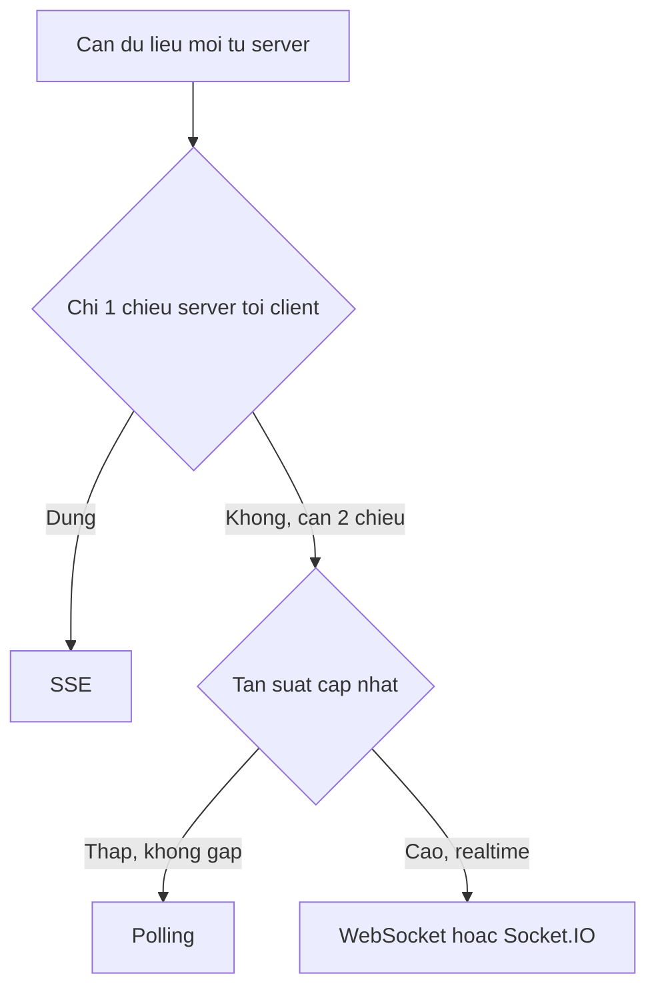
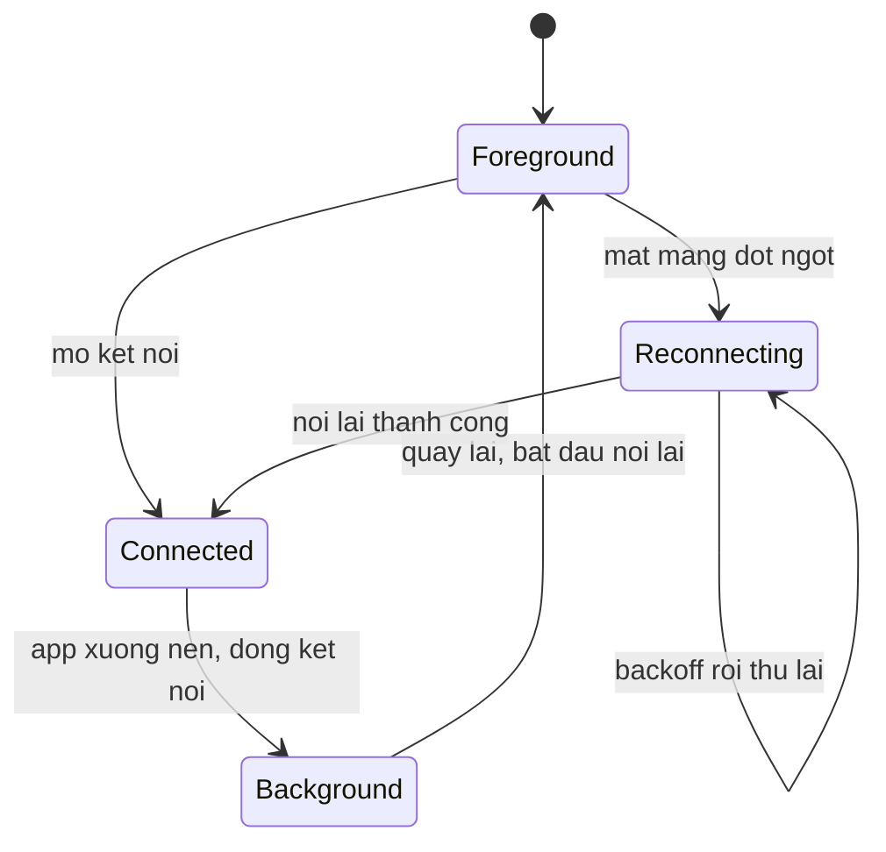
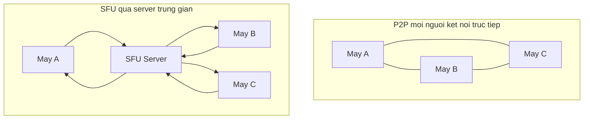

# Realtime: WebSocket, Socket.IO & WebRTC

Realtime (thời gian thực) là cách app nhận dữ liệu mới ngay khi nó xảy ra ở server, thay vì phải tự hỏi lại liên tục. Bài Networking trước đã nói về REST API và `fetch` -- hợp cho kiểu "hỏi rồi nhận", còn realtime hợp cho kiểu "server tự báo khi có gì mới": tin nhắn chat đến, đơn hàng đổi trạng thái, hay cuộc gọi video. Bài này tập trung vào ba công cụ chính: **WebSocket** (kênh 2 chiều luôn mở), **Socket.IO** (thư viện bọc WebSocket kèm tiện ích reconnect/room), và **WebRTC** (kết nối media trực tiếp cho audio/video call).

**Tương tự đơn giản:** Realtime giống việc bạn cầm bộ đàm (walkie-talkie) thay vì gọi điện hỏi "có tin gì mới chưa" mỗi 5 giây -- kênh luôn mở, bên kia nói gì là nghe ngay.

---

:::note[Ghi nhớ nhanh]

- ⭐ **WebSocket** giữ 1 kết nối mở 2 chiều -- server đẩy dữ liệu ngay khi có, không cần app hỏi lại như polling.
- **Socket.IO** bọc WebSocket kèm tự động reconnect, room/namespace, acknowledgement -- nhưng server cũng phải dùng Socket.IO, không ghép được với WebSocket thuần.
- ⭐ **Mobile khác web**: app xuống nền thì hệ điều hành (đặc biệt iOS) có thể treo hoặc đóng luôn kết nối mạng -- luôn chủ động ngắt khi background và nối lại + đồng bộ dữ liệu khi quay lại foreground.
- **Backoff + jitter** khi reconnect để tránh hàng loạt client cùng nối lại một lúc làm quá tải server.
- **WebRTC** dùng cho audio/video call thật: signaling qua kênh riêng (thường là WebSocket), media đi qua ICE/STUN/TURN; phòng đông người dùng SFU (như LiveKit) thay vì kết nối trực tiếp P2P.
- Luôn dùng `wss://` (có TLS) và token ngắn hạn -- không nhét token cố định vào URL public.

:::

---

## Mục lục

- [Vì sao realtime cần nhiều hơn REST API?](#vì-sao-realtime-cần-nhiều-hơn-rest-api)
- [1. Polling, Long-polling, WebSocket, SSE](#1-polling-long-polling-websocket-sse)
- [2. WebSocket API trong React Native](#2-websocket-api-trong-react-native)
- [3. Socket.IO Client](#3-socketio-client)
- [4. Vòng đời app và AppState](#4-vòng-đời-app-và-appstate)
- [5. Mất mạng và Reconnect](#5-mất-mạng-và-reconnect)
- [6. Đồng bộ dữ liệu sau khi Reconnect](#6-đồng-bộ-dữ-liệu-sau-khi-reconnect)
- [7. Quản lý Socket Singleton, Hook và Zustand](#7-quản-lý-socket-singleton-hook-và-zustand)
- [8. WebRTC cơ bản](#8-webrtc-cơ-bản)
- [9. LiveKit trong React Native](#9-livekit-trong-react-native)
- [10. Bảo mật kết nối Realtime](#10-bảo-mật-kết-nối-realtime)
- [Khi nào dùng?](#khi-nào-dùng)
- [Lỗi thường gặp](#lỗi-thường-gặp)
- [Câu hỏi phỏng vấn](#câu-hỏi-phỏng-vấn)

---

## Vì sao realtime cần nhiều hơn REST API?

**Vấn đề:** Nếu chỉ có REST, cách duy nhất để biết "có gì mới chưa" là **hỏi lại định kỳ** (polling). Tin nhắn đến trễ vài giây, tốn pin và tốn data vì phần lớn request trả về "không có gì mới".

```tsx
// Polling: hoi lien tuc moi 3s xem co tin nhan moi khong
useEffect(() => {
  const id = setInterval(async () => {
    const res = await fetch(`https://api.example.com/messages?after=${lastId}`);
    const msgs = await res.json();
    if (msgs.length) appendMessages(msgs); // tin nhan den cham vai giay, ton pin/data
  }, 3000);
  return () => clearInterval(id);
}, [lastId]);
```

**Giải pháp:** Mở 1 kết nối WebSocket, giữ nguyên và để server chủ động đẩy dữ liệu ngay khi có, không cần hỏi lại.

```tsx
useEffect(() => {
  const ws = new WebSocket('wss://realtime.example.com');
  ws.onmessage = (e) => {
    const msg = JSON.parse(e.data);
    appendMessages([msg]); // server day ngay khi co tin nhan moi
  };
  return () => ws.close();
}, []);
```

:::tip[Dùng thực tế]

- **Chat 1-1 / nhóm**: tin nhắn, trạng thái "đang gõ", đã đọc.
- **Notification sống**: đơn hàng đổi trạng thái, số dư ví thay đổi.
- **Dashboard số liệu live**: giá coin, số người đang online.
- **Audio/video call**: WebRTC, thường qua nền tảng có sẵn như LiveKit.

:::

---

## 1. Polling, Long-polling, WebSocket, SSE

Bốn cách phổ biến để lấy dữ liệu "mới", khác nhau ở ai chủ động và độ trễ:

- **Polling**: client tự `setInterval` gọi lại API. Đơn giản nhất nhưng độ trễ = khoảng polling, và phần lớn request trả về rỗng.
- **Long-polling**: client gọi 1 request, server **giữ** request đó (không trả lời ngay) cho tới khi có dữ liệu mới hoặc hết timeout, trả về rồi client gọi lại ngay lập tức. Giảm số request rỗng nhưng vẫn tốn một round-trip HTTP mỗi lượt.
- **SSE (Server-Sent Events)**: server giữ 1 kết nối HTTP mở, liên tục đẩy sự kiện dạng text xuống client. Chỉ **1 chiều** (server → client). React Native không có `EventSource` built-in như trình duyệt (cần polyfill/thư viện riêng), nên ít dùng trong RN so với WebSocket.
- **WebSocket**: 1 kết nối mở, **2 chiều**, độ trễ thấp nhất -- lựa chọn mặc định cho realtime trên mobile.

| Cách | Ai chủ động | Độ trễ | Ghi chú |
| --- | --- | --- | --- |
| Polling | Client hỏi định kỳ | Theo khoảng polling | Đơn giản, tốn request thừa |
| Long-polling | Client hỏi, server giữ | Gần thời gian thực | Tốn 1 connection HTTP liên tục |
| SSE | Server đẩy | Thấp | Chỉ 1 chiều, cần polyfill trên RN |
| WebSocket | 2 chiều | Thấp nhất | Chuẩn cho chat/realtime mobile |



---

## 2. WebSocket API trong React Native

React Native có sẵn `WebSocket` (global), API gần giống trình duyệt -- không cần cài thêm thư viện cho trường hợp cơ bản.

```tsx
const ws = new WebSocket('wss://realtime.example.com/ws?token=' + token);

ws.onopen = () => {
  console.log('Da ket noi');
};

ws.onmessage = (event) => {
  const data = JSON.parse(event.data);
  handleMessage(data);
};

ws.onerror = (event) => {
  console.log('Loi WebSocket', event.message);
};

ws.onclose = (event) => {
  console.log('Da dong', event.code, event.reason);
};

// Gui message
ws.send(JSON.stringify({ type: 'ping' }));

// Dong chu dong, kem code + ly do
ws.close(1000, 'client dong chu dong');
```

### Heartbeat

WebSocket không tự có cơ chế "ping server còn sống không" ở tầng ứng dụng. Hạ tầng mạng di động (proxy, NAT, cân bằng tải) có thể âm thầm đóng kết nối im lặng lâu mà cả hai phía không biết. Giải pháp: tự gửi heartbeat định kỳ, nếu không nhận `pong` trong thời gian cho phép thì coi kết nối đã chết và chủ động đóng để trigger reconnect.

```tsx
// Heartbeat: gui ping dinh ky, khong nhan pong kip thi coi ket noi da chet
function useHeartbeat(ws: WebSocket | null, intervalMs = 15000, timeoutMs = 5000) {
  useEffect(() => {
    if (!ws) return;

    let pongTimeout: ReturnType<typeof setTimeout>;
    const pingId = setInterval(() => {
      ws.send(JSON.stringify({ type: 'ping' }));
      pongTimeout = setTimeout(() => {
        ws.close(4000, 'heartbeat timeout'); // ep dong -> logic reconnect ben ngoai lo tiep
      }, timeoutMs);
    }, intervalMs);

    const onMessage = (e: MessageEvent) => {
      const data = JSON.parse(e.data);
      if (data.type === 'pong') clearTimeout(pongTimeout);
    };
    ws.addEventListener('message', onMessage);

    return () => {
      clearInterval(pingId);
      clearTimeout(pongTimeout);
      ws.removeEventListener('message', onMessage);
    };
  }, [ws, intervalMs, timeoutMs]);
}
```

---

## 3. Socket.IO Client

`socket.io-client` (bản 4.x) là thư viện phổ biến bọc WebSocket, thêm tự động reconnect, room/namespace, và acknowledgement (ack) cho từng message. **Lưu ý:** server cũng phải dùng Socket.IO -- nó có protocol riêng nằm trên WebSocket, không tương thích ngược với client WebSocket thuần.

```bash
npm install socket.io-client@^4
```

```tsx
import { io, Socket } from 'socket.io-client';

const socket: Socket = io('https://realtime.example.com', {
  transports: ['websocket'],       // bo qua fallback long-polling, di thang WebSocket
  auth: { token },                   // gui token luc handshake, khong nhet vao query string
  reconnection: true,
  reconnectionAttempts: Infinity,
  reconnectionDelay: 1000,
  reconnectionDelayMax: 10000,
});

socket.on('connect', () => {
  console.log('Connected', socket.id);
});

socket.on('disconnect', (reason) => {
  console.log('Disconnected', reason); // 'io server disconnect' | 'transport close' | ...
});

socket.on('connect_error', (err) => {
  console.log('Connect error', err.message);
});

// Nhan event tuy y tu server
socket.on('message', (msg) => {
  appendMessage(msg);
});

// Gui event kem acknowledgement -- server xac nhan da nhan/xu ly xong
socket.emit('send_message', { text: 'hi' }, (ack: { ok: boolean; id: string }) => {
  if (ack.ok) markMessageSent(ack.id);
});
```

### Rooms

Room là nhóm logic phía server để chỉ gửi event cho những client đã tham gia đúng cuộc trò chuyện/kênh đó, thay vì broadcast toàn bộ.

```tsx
// Join room cua 1 cuoc tro chuyen cu the
socket.emit('join_room', { roomId: 'conversation-42' });

socket.on('room_message', (msg) => {
  // Chi nhan tin nhan cua room da join
  appendMessage(msg);
});

socket.emit('leave_room', { roomId: 'conversation-42' });
```

---

## 4. Vòng đời app và AppState

Trên web, tab đứng yên vẫn giữ kết nối. Trên mobile thì khác: khi app xuống nền, hệ điều hành có thể tạm dừng JS, và **iOS thường đóng hẳn kết nối mạng của socket sau một khoảng ngắn ở background** để tiết kiệm pin. Coi như kết nối vẫn sống khi app ở nền là sai lầm phổ biến nhất khi làm realtime trên RN.

Cách đúng: theo dõi `AppState`, chủ động đóng kết nối khi app rời `active`, và nối lại (kèm đồng bộ dữ liệu) khi quay lại `active`.

```tsx
import { AppState, AppStateStatus } from 'react-native';
import { useEffect, useRef } from 'react';

function useSocketLifecycle(connect: () => void, disconnect: () => void) {
  const appState = useRef(AppState.currentState);

  useEffect(() => {
    const sub = AppState.addEventListener('change', (next: AppStateStatus) => {
      if (appState.current.match(/inactive|background/) && next === 'active') {
        connect(); // quay lai foreground -> noi lai + resync
      } else if (next.match(/inactive|background/)) {
        disconnect(); // xuong nen -> chu dong dong, khong doi OS ngat giua chung
      }
      appState.current = next;
    });
    return () => sub.remove();
  }, [connect, disconnect]);
}
```



---

## 5. Mất mạng và Reconnect

`@react-native-community/netinfo` cho biết thiết bị còn mạng hay không -- cần thiết vì mất mạng và app-background là hai nguyên nhân ngắt kết nối khác nhau, nhưng xử lý theo cùng một hướng: chủ động đóng thay vì để socket treo im lặng.

```bash
npx expo install @react-native-community/netinfo
```

```tsx
import NetInfo from '@react-native-community/netinfo';
import { useEffect } from 'react';

useEffect(() => {
  const unsub = NetInfo.addEventListener((state) => {
    if (!state.isConnected && socket.connected) {
      // Mat mang that su -- khong doi socket tu bao loi, chu dong ngat
      socket.disconnect();
    }
    if (state.isConnected && !socket.connected) {
      socket.connect();
    }
  });
  return () => unsub();
}, []);
```

### Backoff + jitter

Nếu một sự cố khiến hàng nghìn client cùng mất kết nối, và tất cả cùng thử nối lại sau đúng 1 khoảng thời gian cố định, server vừa hồi phục sẽ lập tức bị dội một loạt request cùng lúc ("thundering herd"). Giải pháp: tăng dần thời gian chờ theo cấp số nhân (**exponential backoff**), cộng thêm một khoảng ngẫu nhiên (**jitter**) để rải đều các lượt thử lại.

```tsx
// Backoff mu + jitter ngau nhien -- trai deu thoi diem reconnect giua cac client
function nextBackoffMs(attempt: number, baseMs = 1000, maxMs = 30000) {
  const exp = Math.min(maxMs, baseMs * 2 ** attempt);
  const jitter = Math.random() * exp * 0.3; // +-30%
  return Math.round(exp * 0.7 + jitter);
}

let attempt = 0;

function scheduleReconnect() {
  const delay = nextBackoffMs(attempt);
  attempt += 1;
  setTimeout(() => socket.connect(), delay);
}

socket.on('connect', () => {
  attempt = 0; // reset khi noi lai thanh cong
});

socket.on('disconnect', () => {
  scheduleReconnect();
});
```

---

## 6. Đồng bộ dữ liệu sau khi Reconnect

Trong lúc mất kết nối, mọi event server gửi đều **rơi mất** -- không có cơ chế replay tự động trừ khi client tự yêu cầu. Cách phổ biến: client nhớ **cursor** (id của message/event cuối cùng đã nhận), gửi kèm cursor này khi vừa reconnect để server trả lại đúng phần bị bỏ lỡ.

```tsx
let lastMessageId: string | null = null;

socket.on('message', (msg) => {
  lastMessageId = msg.id;
  appendMessageDeduped(msg);
});

socket.on('connect', () => {
  // Gui cursor de server biet client da nhan den dau, tra lai phan bi mien
  socket.emit('resync', { after: lastMessageId }, (missed: Message[]) => {
    missed.forEach(appendMessageDeduped);
  });
});

// Dedupe: tin nhan co the den 2 lan (resync + event realtime khac) -- loc theo id
function appendMessageDeduped(msg: Message) {
  setMessages((prev) => (prev.some((m) => m.id === msg.id) ? prev : [...prev, msg]));
}
```

### Optimistic UI cho chat

Người dùng mong tin nhắn hiện ra **ngay** khi bấm gửi, không phải chờ server xác nhận. Cách làm: thêm tin nhắn vào danh sách với trạng thái tạm ("đang gửi"), rồi cập nhật lại trạng thái thật khi có acknowledgement, hoặc đánh dấu lỗi nếu thất bại/timeout.

```tsx
function sendMessage(text: string) {
  const tempId = `local-${Date.now()}`;
  setMessages((prev) => [...prev, { id: tempId, text, status: 'sending' }]);

  socket.emit('send_message', { text, tempId }, (ack: { ok: boolean; id: string }) => {
    setMessages((prev) =>
      prev.map((m) =>
        m.id === tempId
          ? { ...m, id: ack.id, status: ack.ok ? 'sent' : 'failed' }
          : m
      )
    );
  });
}
```

**Rủi ro cần nhớ:** nếu server đã xử lý xong nhưng ack bị mất trên đường về (mất mạng đúng lúc đó), client tưởng là thất bại và có thể gửi lại -- nên kèm `tempId` để server nhận diện và loại trùng ở phía nó.

---

## 7. Quản lý Socket Singleton, Hook và Zustand

Một sai lầm thường gặp: mỗi màn hình/component tự gọi `io(...)` khi mount -- kết quả là nhiều kết nối song song tới cùng một server cho cùng một người dùng. Cách đúng: một **service** giữ **singleton** (chỉ 1 instance socket cho toàn app), một **hook** để component subscribe vào vòng đời của nó, và một **Zustand store** giữ trạng thái (đã kết nối chưa, dữ liệu gì) để nhiều màn hình cùng đọc mà không phải truyền prop qua nhiều lớp.

```tsx
// socketService.ts -- singleton, tao duy nhat 1 lan cho toan app
import { io, Socket } from 'socket.io-client';

let socket: Socket | null = null;

export function getSocket(token: string): Socket {
  if (socket) return socket;
  socket = io('https://realtime.example.com', {
    transports: ['websocket'],
    auth: { token },
    autoConnect: false,
  });
  return socket;
}

export function destroySocket(): void {
  socket?.disconnect();
  socket = null;
}
```

```tsx
// socketStore.ts -- Zustand giu trang thai ket noi, doc duoc tu nhieu man hinh
import { create } from 'zustand';

type SocketStatus = 'idle' | 'connecting' | 'connected' | 'disconnected';

type SocketStore = {
  status: SocketStatus;
  setStatus: (status: SocketStatus) => void;
};

export const useSocketStore = create<SocketStore>((set) => ({
  status: 'idle',
  setStatus: (status) => set({ status }),
}));
```

```tsx
// useRealtimeConnection.ts -- hook noi socket voi AppState + store, goi 1 lan o root app
import { useEffect } from 'react';

export function useRealtimeConnection(token: string) {
  const setStatus = useSocketStore((s) => s.setStatus);

  useEffect(() => {
    const socket = getSocket(token);
    setStatus('connecting');
    socket.connect();

    socket.on('connect', () => setStatus('connected'));
    socket.on('disconnect', () => setStatus('disconnected'));

    return () => {
      socket.off('connect');
      socket.off('disconnect');
    };
  }, [token, setStatus]);
}
```

Component con chỉ cần đọc `useSocketStore((s) => s.status)` để hiện badge "đang kết nối" hay `getSocket(token)` để `emit` event -- không component nào tự tạo `io(...)` mới.

---

## 8. WebRTC cơ bản

WebRTC là chuẩn cho kết nối **peer-to-peer** trao đổi audio/video/data trực tiếp giữa hai thiết bị, media không đi qua server trung gian (chỉ phần thiết lập kết nối mới cần server).

- **Signaling**: quá trình hai phía trao đổi thông tin để thiết lập kết nối (SDP offer/answer, ICE candidates). WebRTC **không định nghĩa sẵn** cách truyền signaling -- thường tự dùng WebSocket/Socket.IO để chuyển các gói tin này qua lại.
- **ICE (Interactive Connectivity Establishment)**: cơ chế tìm đường kết nối khả dụng nhất giữa hai máy, cần thiết vì phần lớn thiết bị nằm sau NAT/firewall.
  - **STUN**: giúp thiết bị biết địa chỉ IP public của mình để hai bên thử kết nối trực tiếp.
  - **TURN**: khi kết nối trực tiếp bị chặn (firewall khó), dữ liệu phải đi vòng qua TURN server đóng vai trò relay -- tốn băng thông server hơn nhưng đảm bảo luôn kết nối được.
- **P2P vs SFU**: cuộc gọi 1-1 dùng kết nối trực tiếp (P2P) là đủ. Nhóm đông người dùng **SFU (Selective Forwarding Unit)** -- server nhận stream từ mỗi người rồi chuyển tiếp tới những người còn lại, tránh việc mỗi máy phải tự gửi stream cho tất cả người khác cùng lúc (rất tốn upload khi phòng đông).



Tự viết `RTCPeerConnection` + signaling + SFU từ đầu là công việc lớn (thư viện `react-native-webrtc` cung cấp API thô cho việc này). Phần lớn app production chọn một nền tảng có sẵn để không phải tự vận hành hạ tầng SFU/TURN -- ví dụ **LiveKit**.

---

## 9. LiveKit trong React Native

**LiveKit** là nền tảng SFU mã nguồn mở, cung cấp SDK client lo phần signaling + media, chỉ cần server backend cấp token. Với React Native, dùng `@livekit/react-native` (2.x) cùng `livekit-client` (2.x, dùng chung API với web).

```bash
npm install @livekit/react-native livekit-client
```

### `registerGlobals()`

Gọi một lần ở entry point của app, trước khi dùng bất kỳ API nào của LiveKit -- nó polyfill các global API WebRTC (như `RTCPeerConnection`, `MediaStream`) mà React Native chưa có sẵn.

```tsx
// App root, chi goi 1 lan
import { registerGlobals } from '@livekit/react-native';

registerGlobals();
```

### Kết nối bằng component `LiveKitRoom`

```tsx
import { LiveKitRoom, useTracks, VideoTrack } from '@livekit/react-native';
import { Track } from 'livekit-client';
import { View } from 'react-native';

function CallScreen({ url, token }: { url: string; token: string }) {
  return (
    <LiveKitRoom serverUrl={url} token={token} connect video audio>
      <ParticipantGrid />
    </LiveKitRoom>
  );
}

function ParticipantGrid() {
  const tracks = useTracks([Track.Source.Camera]);

  return (
    <View style={{ flex: 1, flexDirection: 'row', flexWrap: 'wrap' }}>
      {tracks.map((t) => (
        <VideoTrack key={t.participant.identity} trackRef={t} style={{ width: '50%', height: 200 }} />
      ))}
    </View>
  );
}
```

### Kết nối thủ công bằng `Room` (khi cần điều khiển chi tiết hơn)

```tsx
import { Room } from 'livekit-client';

const room = new Room();
await room.connect(url, token);
await room.localParticipant.setMicrophoneEnabled(true);
await room.localParticipant.setCameraEnabled(true);
```

### Quyền camera/mic và audio session

```tsx
import { AudioSession } from '@livekit/react-native';
import { PermissionsAndroid, Platform } from 'react-native';

async function preparePermissions() {
  if (Platform.OS === 'android') {
    await PermissionsAndroid.requestMultiple([
      PermissionsAndroid.PERMISSIONS.CAMERA,
      PermissionsAndroid.PERMISSIONS.RECORD_AUDIO,
    ]);
  }
  // iOS: khai bao NSCameraUsageDescription / NSMicrophoneUsageDescription trong Info.plist
  // -- he thong tu hien dialog xin quyen khi lan dau truy cap camera/mic

  await AudioSession.startAudioSession(); // cau hinh duong am thanh cho cuoc goi (loa/tai nghe)
}
```

Nhớ gọi `AudioSession.stopAudioSession()` khi rời màn hình gọi, để trả lại chế độ âm thanh mặc định cho phần còn lại của app.

Token của LiveKit là JWT **ngắn hạn**, do server backend cấp cho từng room + quyền cụ thể (được publish audio/video hay chỉ được xem) -- client không tự sinh token.

---

## 10. Bảo mật kết nối Realtime

- Luôn dùng `wss://` (WebSocket qua TLS) trên production, tương tự việc REST API bắt buộc HTTPS -- không dùng `ws://` thuần.
- Token nên **ngắn hạn**, gửi qua `auth` lúc handshake (Socket.IO) hoặc query/header khi kết nối (WebSocket thuần) -- tránh nhúng token cố định vào code hoặc URL dễ bị log lại.
- Xác thực lại token khi reconnect -- token có thể đã hết hạn giữa lúc mất kết nối, nên lấy token mới trước khi gọi `connect()` lần nữa.
- Với WebRTC/LiveKit: token gắn quyền theo từng room, do server cấp với TTL ngắn (vài phút tới vài giờ).
- Validate mọi dữ liệu nhận qua socket giống như dữ liệu nhận từ REST API -- không tin tưởng payload chỉ vì nó đến từ kênh realtime.

---

## Khi nào dùng?

- **WebSocket thuần**: cần kiểm soát chi tiết, tự viết protocol đơn giản, không muốn phụ thuộc thư viện.
- **Socket.IO**: cần reconnect/room/ack có sẵn, backend đã hoặc sẵn sàng dùng Node.js + Socket.IO.
- **SSE**: chỉ cần server đẩy 1 chiều (feed, log) -- ít gặp trong RN.
- **WebRTC / LiveKit**: audio/video call thật, cần độ trễ thấp và chất lượng media tốt.
- **Best practice:**
  - Ngắt kết nối khi app xuống nền, nối lại + resync khi lên foreground.
  - Backoff kèm jitter cho mọi lần reconnect.
  - Quản lý socket bằng 1 singleton, không tạo mới trong từng component.
  - Dedupe message theo id, không tin optimistic UI là dữ liệu cuối cùng.

---

## Lỗi thường gặp

| Lỗi | Nguyên nhân | Cách sửa |
| --- | --- | --- |
| Socket im lặng "chết" trên iOS khi app ở nền | iOS treo/đóng kết nối mạng khi app rời foreground | Chủ động `disconnect()` khi background, `connect()` lại khi active |
| Không nhận được tin nhắn bị lỡ sau khi reconnect | Không gửi cursor/last event id khi kết nối lại | Gửi kèm cursor, để server trả lại đúng phần bị miss |
| Tin nhắn hiển thị trùng lặp | Tin nhắn optimistic (local) và tin nhắn thật từ socket cùng được thêm vào danh sách | Dedupe theo `id` trước khi append |
| Hàng loạt client reconnect cùng lúc làm server quá tải | Backoff cố định, không có jitter | Thêm khoảng ngẫu nhiên (jitter) vào công thức backoff |
| Nhiều kết nối song song tới cùng một server cho cùng một user | Mỗi component tự gọi `io(...)` khi mount | Dùng service singleton, chỉ 1 instance socket cho toàn app |
| Cuộc gọi nhóm đông người bị giật, nghẽn upload | Dùng kiến trúc P2P cho phòng nhiều người | Chuyển sang SFU khi phòng vượt quá vài người |
| Gọi API LiveKit bị lỗi thiếu polyfill WebRTC | Quên gọi `registerGlobals()` trước khi dùng `Room`/`LiveKitRoom` | Gọi `registerGlobals()` một lần ở entry point của app |

---

## Câu hỏi phỏng vấn

Những câu thường gặp về chủ đề này. Tự trả lời trước, rồi bấm **Xem đáp án** để đối chiếu.

**1. WebSocket khác `fetch`/REST API ở điểm nào?**

<details className="qa">
<summary>Xem đáp án</summary>

REST/`fetch` là mô hình request-response: client hỏi, server trả lời, xong thì đóng. WebSocket mở **1 kết nối liên tục, 2 chiều** -- cả client và server đều có thể gửi dữ liệu bất kỳ lúc nào mà không cần request mới. Phù hợp cho dữ liệu server cần đẩy chủ động (chat, notification, live update).

</details>

**2. Vì sao WebSocket cần thêm cơ chế heartbeat?**

<details className="qa">
<summary>Xem đáp án</summary>

WebSocket không có cơ chế "hỏi thăm còn sống" ở tầng ứng dụng. Hạ tầng mạng di động (proxy, NAT) có thể âm thầm đóng kết nối im lặng lâu mà không báo lỗi cho cả hai phía. Heartbeat (ping/pong định kỳ) giúp phát hiện sớm kết nối đã chết để chủ động đóng và reconnect, thay vì client tưởng vẫn còn kết nối trong khi thực tế đã mất.

</details>

**3. Socket.IO có phải là WebSocket thuần không?**

<details className="qa">
<summary>Xem đáp án</summary>

Không hoàn toàn. Socket.IO là một thư viện có **protocol riêng** xây trên WebSocket (và có thể fallback sang các cơ chế khác), thêm tính năng như tự động reconnect, room/namespace, acknowledgement. Client Socket.IO chỉ kết nối được với server Socket.IO, không ghép được với một server WebSocket thuần và ngược lại.

</details>

**4. Vì sao mobile app cần chủ động ngắt kết nối realtime khi xuống background?**

<details className="qa">
<summary>Xem đáp án</summary>

Khi app xuống nền, hệ điều hành (đặc biệt iOS) có thể treo hoặc đóng hẳn kết nối mạng của app để tiết kiệm pin/tài nguyên. Nếu không chủ động đóng, app dễ ở trạng thái "tưởng còn kết nối nhưng thực ra đã chết", dẫn tới không phát hiện được lúc cần reconnect. Nên theo dõi `AppState` để đóng khi rời `active`, và nối lại kèm đồng bộ dữ liệu khi quay lại `active`.

</details>

**5. Exponential backoff kèm jitter giải quyết vấn đề gì?**

<details className="qa">
<summary>Xem đáp án</summary>

Khi server gặp sự cố và hồi phục, nếu tất cả client cùng thử reconnect ngay lập tức (hoặc sau đúng một khoảng cố định), server vừa mới sống lại sẽ bị dội một loạt kết nối cùng lúc ("thundering herd") và có thể sập lại. Backoff tăng dần thời gian chờ sau mỗi lần thất bại; jitter thêm một khoảng ngẫu nhiên để các client không cùng thử lại vào đúng một thời điểm.

</details>

**6. Làm sao đồng bộ lại dữ liệu bị mất trong lúc socket ngắt kết nối?**

<details className="qa">
<summary>Xem đáp án</summary>

Client lưu lại **cursor** (id của message/event cuối cùng đã nhận được). Khi reconnect thành công, gửi cursor này lên server (thường qua một event như `resync`), server trả lại đúng những gì đã xảy ra kể từ cursor đó. Cần dedupe theo id vì dữ liệu resync có thể trùng với dữ liệu vừa nhận qua kênh realtime khác.

</details>

**7. Optimistic UI trong chat hoạt động thế nào, có rủi ro gì?**

<details className="qa">
<summary>Xem đáp án</summary>

Khi user gửi tin nhắn, UI thêm ngay tin nhắn vào danh sách với trạng thái tạm ("đang gửi") thay vì chờ server xác nhận, giúp cảm giác phản hồi tức thì. Khi có acknowledgement từ server, cập nhật lại trạng thái thật (thành công/thất bại). Rủi ro: nếu ack bị mất trên đường về dù server đã xử lý xong, client có thể hiểu nhầm là thất bại -- cần `tempId` để server nhận diện và tránh xử lý trùng khi client gửi lại.

</details>

**8. STUN và TURN khác nhau thế nào trong WebRTC?**

<details className="qa">
<summary>Xem đáp án</summary>

- **STUN**: giúp thiết bị phát hiện địa chỉ IP public của chính nó, để hai bên thử kết nối trực tiếp (P2P) qua NAT.
- **TURN**: dùng khi kết nối trực tiếp không thực hiện được (firewall chặn) -- dữ liệu media đi vòng qua TURN server đóng vai trò relay trung gian, tốn băng thông server hơn nhưng đảm bảo luôn kết nối được.

</details>

**9. Khi nào nên dùng SFU thay vì kết nối P2P cho video call?**

<details className="qa">
<summary>Xem đáp án</summary>

P2P phù hợp cho cuộc gọi 1-1: kết nối trực tiếp, không tốn server xử lý media. Khi phòng có nhiều người, P2P bắt mỗi máy phải gửi stream riêng cho từng người khác -- tốn upload theo cấp số nhân. SFU (Selective Forwarding Unit) nhận stream từ mỗi người một lần rồi forward tới người khác, giảm tải cho từng thiết bị đầu cuối và mở rộng được cho phòng đông người.

</details>

**10. LiveKit dùng để làm gì, `registerGlobals()` có tác dụng gì?**

<details className="qa">
<summary>Xem đáp án</summary>

LiveKit là nền tảng SFU mã nguồn mở, cung cấp SDK client (`@livekit/react-native` + `livekit-client`) lo phần signaling, media và kết nối SFU, giúp không phải tự dựng hạ tầng WebRTC từ đầu. `registerGlobals()` polyfill các API WebRTC toàn cục (`RTCPeerConnection`, `MediaStream`...) mà React Native không có sẵn -- phải gọi một lần ở entry point trước khi dùng bất kỳ API nào khác của LiveKit.

</details>

**11. Vì sao phải dùng `wss://` và token ngắn hạn cho kết nối realtime?**

<details className="qa">
<summary>Xem đáp án</summary>

`wss://` mã hoá dữ liệu qua TLS, tương đương HTTPS cho REST -- tránh bị nghe lén trên đường truyền, đặc biệt quan trọng vì kết nối realtime giữ mở lâu hơn nhiều so với 1 request HTTP. Token ngắn hạn giới hạn thiệt hại nếu token bị lộ (hết hạn sau vài phút/giờ thay vì dùng mãi mãi), và cần xác thực lại (lấy token mới) mỗi khi reconnect vì token cũ có thể đã hết hạn giữa lúc mất kết nối.

</details>

**12. Vì sao nên quản lý socket bằng 1 singleton thay vì tạo mới trong từng component?**

<details className="qa">
<summary>Xem đáp án</summary>

Nếu mỗi component/màn hình tự gọi `io(...)` hoặc `new WebSocket(...)` khi mount, mỗi lần có màn hình mới mount là thêm một kết nối song song tới server cho cùng một user -- lãng phí tài nguyên server và dễ sinh ra trạng thái không đồng bộ (mỗi kết nối nhận event độc lập). Dùng 1 service singleton giữ đúng 1 instance socket cho toàn app, một Zustand store giữ trạng thái dùng chung, và một hook để component subscribe vào vòng đời đó mà không tạo kết nối mới.

</details>
