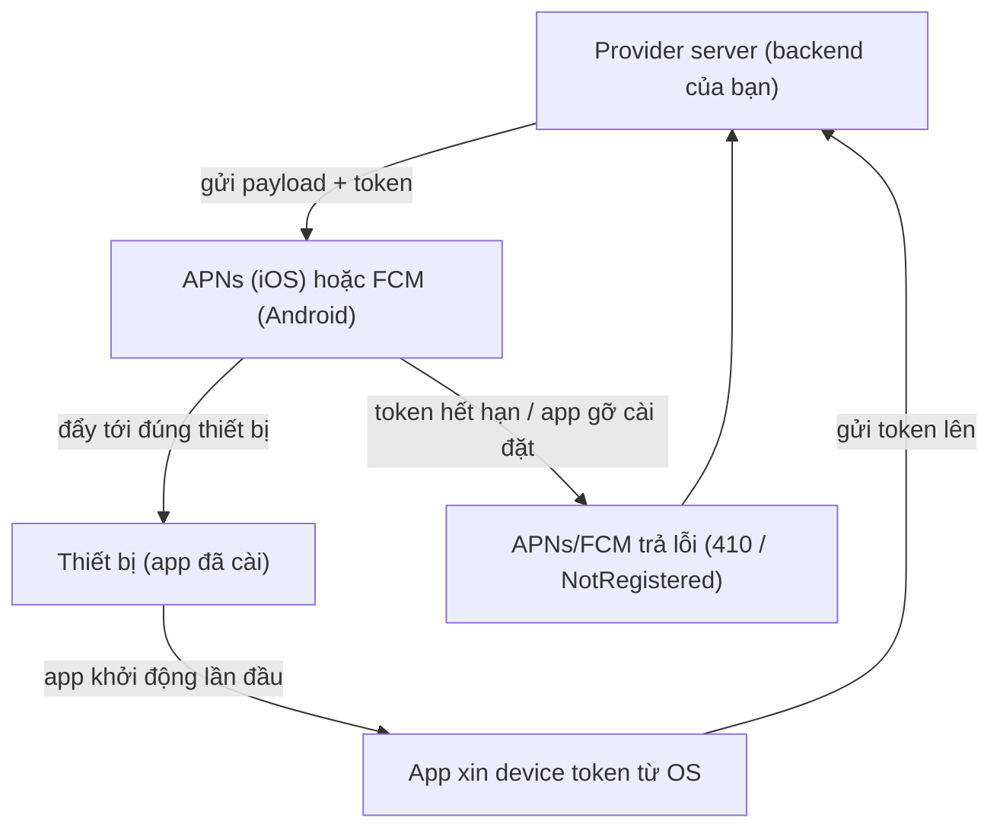
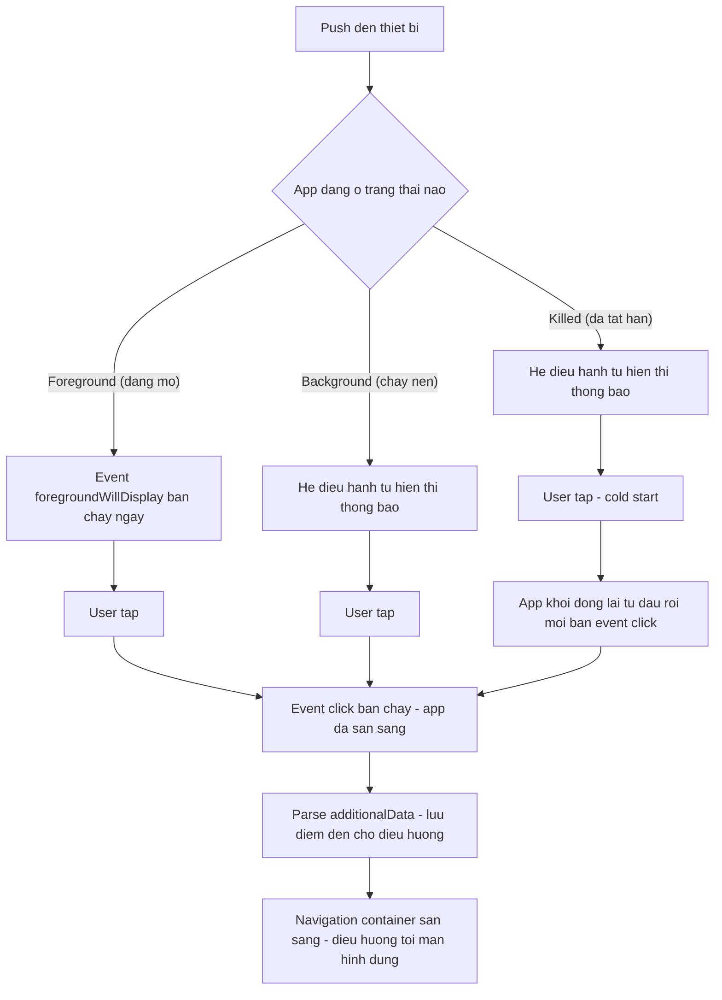
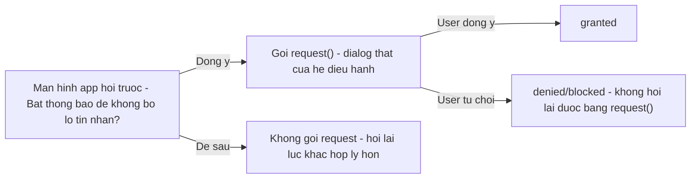

# Push Notification & Permissions

Bài **Interactions** đã giới thiệu sơ lược Push Notifications (notification gửi từ server đến device). Bài này đi sâu vào **cơ chế thật sự phía sau** một push: ai gửi, ai chuyển tiếp, device nhận bằng cách nào, app xử lý ra sao khi đang mở/nền/tắt hẳn, và làm sao xin quyền (**permission**, quyền truy cập tính năng nhạy cảm của hệ điều hành) đúng lúc để người dùng không bực mình. Hai chủ đề này luôn đi cùng nhau: push cần quyền thông báo mới hiển thị được, còn nhiều tính năng khác (camera, micro, thư viện ảnh) cũng theo cùng một luồng xin quyền.

**Tương tự đơn giản:** Push notification giống như **bưu điện chuyển thư**: server của bạn (người gửi) không giao thư trực tiếp đến tay người nhận, mà gửi qua bưu điện của Apple (APNs) hoặc Google (FCM) -- bưu điện biết chính xác địa chỉ (**device token**) để giao đúng nhà. Permission giống như **gõ cửa xin phép** trước khi vào phòng riêng của ai đó (camera, micro, ảnh) -- gõ đúng lúc, đúng lý do thì người ta mở cửa; gõ bừa lúc mới gặp thì bị từ chối và rất khó gõ lại.

---

:::note[Ghi nhớ nhanh]

- ⭐ **APNs (Apple) và FCM (Google) là "bưu điện" duy nhất được phép đẩy dữ liệu tới device đang tắt/nền** -- server của bạn không bao giờ gửi thẳng tới app, luôn phải qua hai dịch vụ này.
- ⭐ **Notification message** (payload có `title`/`body`, do OS tự hiển thị) khác **data message** (chỉ có dữ liệu tuỳ ý, code của bạn tự quyết định hiển thị gì) -- nhầm hai loại này là nguyên nhân phổ biến khiến push "im lặng" hoặc hiện sai nội dung.
- **Dịch vụ trung gian** như OneSignal gom APNs + FCM thành một API duy nhất, quản lý device token hộ bạn, đổi lại bạn phải học thêm khái niệm riêng của họ (`external_id`, `subscription_id`, opt-in).
- **`react-native-permissions`** là thư viện chuẩn để check/request quyền camera, micro, ảnh, thông báo -- luôn `check` trước khi `request`, và phân biệt rõ `denied` (chưa hỏi/bị từ chối, còn hỏi lại được) với `blocked` (bị chặn hẳn, phải dẫn ra Cài đặt).
- ⭐ **iOS chỉ cho hệ thống hỏi quyền thông báo một lần** -- gọi `requestPermission` liên tục sau khi user đã từ chối sẽ không hiện popup nữa và âm thầm trả về `false`; đây là lỗi rất hay gặp khi test.
- **iOS Simulator hỗ trợ nhận push giả lập** từ Xcode 11.4 (file `.apns` hoặc `xcrun simctl push`), nhưng không thay thế được test trên máy thật cho luồng đăng ký token/subscription.

:::

---

## Mục lục

- [Vì sao cần dịch vụ push trung gian?](#vì-sao-cần-dịch-vụ-push-trung-gian)
- [1. Cơ chế push APNs FCM và device token](#1-cơ-chế-push-apns-fcm-và-device-token)
- [2. Notification message và Data message](#2-notification-message-và-data-message)
- [3. Tích hợp OneSignal](#3-tích-hợp-onesignal)
- [4. Trạng thái app và điều hướng khi tap notification](#4-trạng-thái-app-và-điều-hướng-khi-tap-notification)
- [5. Badge](#5-badge)
- [6. Notification channel và quyền POST_NOTIFICATIONS trên Android](#6-notification-channel-và-quyền-post_notifications-trên-android)
- [7. Quyền thông báo trên iOS](#7-quyền-thông-báo-trên-ios)
- [8. react-native-permissions xin quyền đúng lúc](#8-react-native-permissions-xin-quyền-đúng-lúc)
- [9. Test push](#9-test-push)
- [Khi nào dùng?](#khi-nào-dùng)
- [Lỗi thường gặp](#lỗi-thường-gặp)
- [Câu hỏi phỏng vấn](#câu-hỏi-phỏng-vấn)

---

## Vì sao cần dịch vụ push trung gian?

**Vấn đề:** Muốn tự gửi push, backend của bạn phải nói chuyện trực tiếp với **APNs** (Apple Push Notification service) cho iOS và **FCM** (Firebase Cloud Messaging) cho Android -- hai giao thức khác nhau, hai bộ certificate/key khác nhau, hai định dạng payload khác nhau. Mỗi lần cần thêm tính năng (segment người nhận theo hành vi, lên lịch gửi, thống kê tỉ lệ mở) là backend phải tự viết thêm.

```js
// Cach cu - backend phai tu quan ly ca hai duong
async function sendToIOS(deviceToken, payload) {
  // ket noi HTTP/2 rieng toi APNs, tu ky JWT tu private key .p8
  // tu quan ly certificate, tu retry khi APNs tra loi 410 (token het han)
}

async function sendToAndroid(deviceToken, payload) {
  // goi FCM HTTP v1 API, tu quan ly service account JSON cua Firebase
  // dinh dang payload khac hoan toan iOS
}

// Backend phai biet moi device dang dung iOS hay Android de goi dung ham
```

**Giải pháp:** Dùng một **dịch vụ trung gian** (OneSignal là ví dụ phổ biến, ngoài ra còn Firebase Cloud Messaging dùng trực tiếp, hoặc Expo Push Service). Dịch vụ trung gian đứng giữa: app chỉ cần tích hợp một SDK duy nhất, dịch vụ tự lo việc nói chuyện với APNs/FCM, tự quản lý device token, và cho backend một API REST duy nhất để gửi push tới bất kỳ nền tảng nào.

```js
// Cach moi - backend chi goi 1 API duy nhat
async function sendPush(userId, title, body, data) {
  await fetch('https://onesignal.com/api/v1/notifications', {
    method: 'POST',
    headers: { Authorization: 'Basic ' + REST_API_KEY },
    body: JSON.stringify({
      app_id: ONESIGNAL_APP_ID,
      include_aliases: { external_id: [userId] }, // dich vu tu biet gui iOS hay Android
      contents: { en: body },
      headings: { en: title },
      data,
    }),
  });
}
```

:::tip[Dùng thực tế]

- **App chat/social**: gửi push "có tin nhắn mới", kèm `data` để app tự điều hướng đúng cuộc trò chuyện khi user tap.
- **App thương mại điện tử**: nhắc giỏ hàng bỏ quên, thông báo đơn hàng đổi trạng thái -- thường lên lịch gửi hàng loạt qua dashboard của dịch vụ trung gian, không cần code thêm ở backend.
- **App cần định danh người dùng đa thiết bị**: một người dùng login trên nhiều máy, dùng `external_id`/`login(userId)` để nhóm các device lại, gửi push tới đúng người bất kể họ đang cầm máy nào.
- **Test nội bộ / QA**: dùng dashboard của dịch vụ trung gian để gửi push thử tới một segment nhỏ mà không cần đụng vào backend production.

:::

---

## 1. Cơ chế push APNs FCM và device token

Dù dùng dịch vụ trung gian hay tự làm, luồng gốc luôn có 4 vai trò:



- **APNs (Apple Push Notification service)**: dịch vụ của Apple, giao tiếp qua HTTP/2, xác thực bằng file `.p8` key hoặc certificate. Chỉ Apple mới đánh thức được app iOS đang tắt/nền để hiện push.
- **FCM (Firebase Cloud Messaging)**: dịch vụ tương đương của Google cho Android (và cả iOS nếu muốn dùng chung một hạ tầng gửi).
- **Device token / push token**: chuỗi định danh duy nhất mà APNs/FCM cấp cho **một lần cài đặt app trên một thiết bị**. Token có thể đổi (cài lại app, khôi phục backup, xoá dữ liệu) -- app phải gửi token mới lên server mỗi khi khởi động và nhận được token khác token cũ.
- **Provider server**: backend của bạn, người giữ danh sách "user nào có token nào" và là bên khởi tạo việc gửi push.

```ts
// Vi du: luu token/subscription id len backend cua ban (khong phai backend cua OneSignal)
async function registerPushSubscription(subscribeId?: string): Promise<void> {
  await fetch('/api/v1/push/subscriptions/register', {
    method: 'POST',
    headers: { 'Content-Type': 'application/json' },
    body: JSON.stringify(subscribeId ? { subscribe_id: subscribeId } : {}),
  });
}
```

Việc đăng ký này **idempotent** (gọi lại nhiều lần không gây lỗi) nên an toàn để gọi lại mỗi lần app khởi động hoặc mỗi lần token đổi.

---

## 2. Notification message và Data message

Hai payload gửi qua APNs/FCM có ý nghĩa rất khác nhau -- nhầm lẫn ở đây là lỗi hay gặp nhất khi mới làm push.

| | Notification message | Data message |
|---|---|---|
| Nội dung | Có sẵn `title` + `body` chuẩn hoá | Chỉ là object dữ liệu tuỳ ý (key-value) |
| Ai hiển thị | **Hệ điều hành tự hiển thị** khi app ở background/killed | Không tự hiển thị gì -- **code của app** phải tự quyết định |
| Khi app foreground | Thường không tự hiện (tuỳ cấu hình), app có thể tự custom | App luôn nhận được và xử lý |
| Dùng khi nào | Thông báo đơn giản, không cần logic riêng | Cần logic tuỳ biến: badge riêng, chỉ update dữ liệu ngầm không hiện gì, đồng bộ trạng thái |

```json
// Notification message - OS tu hien
{
  "notification": { "title": "Tin nhắn mới", "body": "Bạn có 1 tin nhắn" },
  "data": { "channel_id": "abc123" }
}

// Data message thuan - khong co "notification", app tu quyet dinh
{
  "data": { "type": "sync_only", "channel_id": "abc123" }
}
```

Nhiều dịch vụ trung gian (như OneSignal) luôn gửi kèm cả hai: phần `contents`/`headings` để OS hiển thị, phần `data` (gọi là `additionalData` phía client) để app đọc và tự xử lý routing khi tap.

---

## 3. Tích hợp OneSignal

`react-native-onesignal` là SDK phổ biến để không phải tự viết code nói chuyện với APNs/FCM. Ví dụ dưới đây theo API của bản 5.x.

```bash
npm install react-native-onesignal
cd ios && pod install
```

### Khởi tạo

```ts
import { OneSignal } from 'react-native-onesignal';

// Goi mot lan duy nhat luc app khoi dong (vi du trong App.tsx)
OneSignal.initialize('YOUR_ONESIGNAL_APP_ID');
```

### Định danh người dùng

```ts
// Sau khi user dang nhap thanh cong - gan push cho dung tai khoan
OneSignal.login(userId); // login() v5 tra ve void, khong co promise de await

// Khi user dang xuat - go lien ket, ve trang thai an danh
OneSignal.logout();
```

`login`/`logout` chỉ gán `external_id` phía OneSignal -- không đảm bảo ngay lập tức bạn có `subscription_id` (id thiết bị dùng để gửi trực tiếp), vì SDK còn cần thời gian bắt tay với server OneSignal.

### Xin quyền thông báo

```ts
// fallbackToSettings = false: KHONG tu dong bung dialog "mo Settings"
// khi user da tu choi truoc do - de app tu quyet dinh khi nao dan sang Settings
const granted = await OneSignal.Notifications.requestPermission(false);
```

### Opt-in / opt-out (tắt push mà không thu hồi quyền OS)

```ts
// Nguoi dung bam "Tat thong bao" trong app, khong dong nghia voi thu hoi
// quyen he dieu hanh - chi lam OneSignal ngung gui push toi thiet bi nay
OneSignal.User.pushSubscription.optIn();
OneSignal.User.pushSubscription.optOut();

const isOptedIn = await OneSignal.User.pushSubscription.getOptedInAsync();
const subscriptionId = await OneSignal.User.pushSubscription.getIdAsync();
```

### Lắng nghe sự kiện

```ts
// User tap vao notification (app dang nen, killed, hoac vua mo tu tap)
OneSignal.Notifications.addEventListener('click', (event) => {
  const data = event.notification.additionalData; // payload dinh kem
  console.log('Tapped notification data:', data);
});

// Push toi trong luc app dang FOREGROUND - mac dinh khong tu hien
// preventDefault() de tu kiem soat, hoac bo qua de OneSignal tu hien
OneSignal.Notifications.addEventListener('foregroundWillDisplay', (event) => {
  // Vi du: khong hien push cho dung cuoc tro chuyen dang mo san
  if (event.notification.additionalData?.channel_id === currentOpenChannelId) {
    event.preventDefault();
    return;
  }
  event.notification.display();
});
```

:::tip[Dùng thực tế]

- Gọi `OneSignal.login(userId)` **ngay sau khi đăng nhập thành công**, và `OneSignal.logout()` ngay khi đăng xuất -- tránh push của người dùng A bị gửi nhầm vào máy đang đăng nhập bằng tài khoản B.
- Dùng `additionalData` để mang `id` cần thiết cho việc điều hướng (ví dụ id cuộc trò chuyện), **không suy luận** đích đến từ nội dung `title`/`body` vì đó là text hiển thị, dễ đổi định dạng.
- `foregroundWillDisplay` là chỗ hợp lý để **chặn hiện lại thông báo cho màn đang mở sẵn** (ví dụ đang xem đúng cuộc trò chuyện thì không cần popup thông báo tin mới của chính nó).

:::

---

## 4. Trạng thái app và điều hướng khi tap notification

App có thể ở một trong ba trạng thái khi push tới, và cách xử lý tap khác nhau ở mỗi trạng thái:



Điểm khó nhất là **cold start** (từ trạng thái killed): app phải khởi động lại hoàn toàn (chạy lại `App.tsx` từ đầu, dựng lại `NavigationContainer`) **trước khi** có thể điều hướng. Nếu điều hướng ngay khi vừa nhận được sự kiện `click`, `NavigationContainer` có thể chưa mount xong -- lệnh điều hướng bị rơi mất.

**Cách xử lý an toàn: tách "nhận ý định điều hướng" và "thực hiện điều hướng" thành hai bước, qua một nơi lưu tạm (deep link store).**

```ts
// Buoc 1: dang ky listener o MODULE SCOPE (ngoai component), khong phai
// trong useEffect - de khong bo lo click event ban ra ngay luc app vua mo
let registered = false;

export function registerPushListeners() {
  if (registered) return;
  registered = true;

  OneSignal.Notifications.addEventListener('click', (event) => {
    const raw = event.notification.additionalData;
    const target = parseNotificationPayload(raw); // -> { channelId, messageId, ... } | null
    if (!target) return;
    pendingDeepLinkStore.setPending(target); // chi luu, CHUA dieu huong
  });
}
```

```tsx
// Buoc 2: trong component goc, SAU KHI navigation container da san sang,
// "rut" (drain) diem den dang cho va dieu huong
function RootNavigator() {
  const navigationRef = useNavigationContainerRef();

  useEffect(() => {
    const unsub = pendingDeepLinkStore.subscribe((pending) => {
      if (!pending || !navigationRef.isReady()) return;
      navigationRef.navigate('Conversation', { channelId: pending.channelId });
      pendingDeepLinkStore.clear();
    });
    return unsub;
  }, []);

  return (
    <NavigationContainer ref={navigationRef} onReady={() => { /* trigger drain lai */ }}>
      {/* ... */}
    </NavigationContainer>
  );
}
```

Một vài lưu ý quan trọng khi thiết kế phần này:

- **Đích đến nên hết hạn (TTL)**: nếu người dùng tap push từ rất lâu trước rồi mới thật sự vào app, dữ liệu (cuộc trò chuyện, đơn hàng...) có thể không còn hợp lệ. Đặt TTL vài chục giây đến vài phút cho "ý định điều hướng" đang chờ, hết hạn thì bỏ qua thay vì điều hướng nhầm.
- **Chỉ giữ một đích đến tại một thời điểm**: nếu user tap liên tiếp nhiều push, đích mới nhất mới có ý nghĩa -- ghi đè thay vì xếp hàng.
- **Kết hợp với deep link thường (`myapp://...`)**: về bản chất, tap push cũng là một dạng "được yêu cầu mở đúng một màn hình cụ thể" -- nên dùng chung cơ chế deep linking đã có, chỉ khác nguồn phát sinh yêu cầu.

---

## 5. Badge

**Badge** là số nhỏ hiển thị trên icon app (góc trên bên phải), báo hiệu "có bao nhiêu việc chưa đọc".

```ts
// react-native-onesignal quan ly badge tu dong theo mac dinh (dua vao so
// notification chua doc), nhung ban co the tu tay dat lai, thuong dung khi
// user da doc het trong app va muon xoa badge ngay lap tuc
import { Platform } from 'react-native';

function clearAppBadge() {
  if (Platform.OS === 'ios') {
    // Voi cac SDK ho tro, thuong co ham rieng de reset badge count ve 0
    // (ten ham cu the thay doi giua cac phien ban SDK - kiem tra changelog)
  }
}
```

Vài quy tắc thực tế:

- Badge chỉ có ý nghĩa khi **đồng bộ với dữ liệu thật** trong app -- ví dụ số tin nhắn chưa đọc. Nếu badge và nội dung trong app lệch nhau, người dùng mất niềm tin vào con số đó rất nhanh.
- Trên Android, badge phụ thuộc vào launcher của từng máy (không phải máy nào cũng hỗ trợ), khác với iOS luôn hỗ trợ badge trên icon.
- Khi user **xoá đã đọc trong app** (ví dụ mở đúng cuộc trò chuyện), nên chủ động xoá luôn notification tương ứng đang nằm trên thanh thông báo (cancel-on-open), tránh tình trạng đã đọc trong app nhưng notification cũ vẫn còn trên màn khoá.

---

## 6. Notification channel và quyền POST_NOTIFICATIONS trên Android

### Notification channel

Từ Android 8 (API 26), mọi notification phải thuộc về một **channel** (kênh) -- người dùng có thể tắt/bật âm thanh, rung, mức độ ưu tiên **theo từng channel** trong Cài đặt hệ thống, thay vì tắt cả app.

```ts
// Vi du y tuong (ten API cu the tuy SDK notification ban dang dung):
// tao mot channel rieng cho tin nhan, mot channel rieng cho khuyen mai,
// de nguoi dung co the tat rieng "Khuyen mai" ma van giu "Tin nhan"
createNotificationChannel({
  id: 'messages',
  name: 'Tin nhắn',
  importance: 'high', // uu tien cao - hien popup, phat am thanh
});

createNotificationChannel({
  id: 'promotions',
  name: 'Khuyến mãi',
  importance: 'low',
});
```

Nếu không tự tạo channel, hầu hết SDK push (bao gồm OneSignal) sẽ tự tạo một channel mặc định -- dùng được nhưng người dùng không tách riêng được loại thông báo nào quan trọng hơn.

### Quyền POST_NOTIFICATIONS (Android 13+)

Từ **Android 13 (API 33)**, hiển thị notification cần một **runtime permission** tường minh là `POST_NOTIFICATIONS` -- trước đó, notification trên Android luôn được phép mặc định. Đây là thay đổi lớn nhất về push trên Android những năm gần đây: app build cho Android 13+ mà quên xin quyền này thì **toàn bộ push không hiện được**, kể cả khi token/subscription vẫn đăng ký thành công bình thường.

```ts
import { PERMISSIONS, RESULTS, check, request } from 'react-native-permissions';
import { Platform } from 'react-native';

async function ensureAndroidNotificationPermission() {
  if (Platform.OS !== 'android') return true;
  const status = await check(PERMISSIONS.ANDROID.POST_NOTIFICATIONS);
  if (status === RESULTS.GRANTED) return true;
  const result = await request(PERMISSIONS.ANDROID.POST_NOTIFICATIONS);
  return result === RESULTS.GRANTED;
}
```

Nhiều SDK push (như OneSignal) đã tự động xin quyền này khi bạn gọi `requestPermission()` phía SDK, nên phần lớn trường hợp bạn không cần tự gọi `POST_NOTIFICATIONS` riêng -- nhưng vẫn nên biết nó tồn tại để chẩn đoán khi push "biến mất" trên máy Android 13+.

---

## 7. Quyền thông báo trên iOS

iOS có mô hình xin quyền chặt hơn Android: **chỉ hiện popup hệ thống một lần**. Sau khi người dùng đã chọn (Cho phép / Không cho phép), gọi lại API xin quyền sẽ **không hiện popup nữa** -- chỉ âm thầm trả về trạng thái đã lưu.

```ts
// OneSignal.Notifications.requestPermission(fallbackToSettings)
// fallbackToSettings = true: neu user da tu choi truoc do, SDK se TU DONG
// bung mot dialog rieng moi nguoi dung mo Settings - nen CAN THAN voi option
// nay, vi no co the lam popup hien lai o nhung thoi diem ban khong ngo
const granted = await OneSignal.Notifications.requestPermission(false);
```

Vì popup chỉ hiện một lần, thời điểm gọi xin quyền cực kỳ quan trọng:

- **Sai cách**: xin quyền ngay khi app vừa mở lần đầu, trước khi người dùng hiểu app dùng thông báo để làm gì -- tỉ lệ từ chối rất cao, và một khi đã từ chối thì gần như không xin lại được (phải tự dẫn qua Cài đặt).
- **Đúng cách**: xin quyền **ngay sau một hành động có ngữ cảnh rõ ràng** -- ví dụ ngay sau khi user gửi tin nhắn đầu tiên ("Bật thông báo để biết khi có người trả lời?"), hoặc qua một màn hình giải thích trước (**pre-permission prompt**, xem mục 8).

### Provisional authorization

iOS còn có một chế độ đặc biệt gọi là **provisional** (thử nghiệm): notification được gửi thẳng vào Trung tâm thông báo (Notification Center) **không hiện popup xin quyền, không làm phiền** (không có âm thanh, không banner) -- người dùng tự thấy trong danh sách thông báo và có thể nâng cấp lên "đầy đủ" nếu họ quan tâm. Đây là cách nhẹ nhàng để bắt đầu gửi push mà không cần hỏi trước.

---

## 8. react-native-permissions xin quyền đúng lúc

`react-native-permissions` là thư viện chuẩn để làm việc với **mọi** loại quyền trên cả hai nền tảng theo cùng một API (không riêng thông báo). Ví dụ dưới theo API của bản 5.x.

### Cài đặt

```bash
npm install react-native-permissions
cd ios && pod install
```

Trên iOS, phải khai báo trước **những quyền nào app thật sự dùng** trong `Podfile` (thư viện không tự bật tất cả quyền để tránh Apple review từ chối vì "xin quyền không dùng tới"):

```ruby
# ios/Podfile
setup_permissions([
  'Camera',
  'Microphone',
  'Notifications',
  'PhotoLibrary',
])
```

### `check` trước, `request` sau

```ts
import {
  PERMISSIONS,
  RESULTS,
  check,
  request,
  openSettings,
} from 'react-native-permissions';
import { Platform } from 'react-native';

const CAMERA_PERMISSION = Platform.select({
  ios: PERMISSIONS.IOS.CAMERA,
  android: PERMISSIONS.ANDROID.CAMERA,
})!;

async function ensureCameraPermission() {
  const status = await check(CAMERA_PERMISSION); // KHONG hien dialog nao
  if (status === RESULTS.GRANTED) return true;
  if (status === RESULTS.BLOCKED) {
    // Da bi chan han - request() se khong hien dialog nua, phai dan ra Settings
    return false;
  }
  const result = await request(CAMERA_PERMISSION); // hien dialog he thong
  return result === RESULTS.GRANTED;
}
```

`RESULTS` có 5 giá trị cần phân biệt rõ:

| Giá trị | Ý nghĩa | Xử lý phù hợp |
|---|---|---|
| `UNAVAILABLE` | Thiết bị không có tính năng này (máy không có camera) | Ẩn hẳn tính năng liên quan |
| `DENIED` | Chưa từng hỏi, hoặc hỏi rồi nhưng còn hỏi lại được | Gọi `request()` |
| `LIMITED` | Được cấp quyền **giới hạn** (chỉ có ở một số quyền, ví dụ ảnh trên iOS 14+) | Coi như granted, nhưng UI nên báo cho biết đang giới hạn |
| `GRANTED` | Đã được cấp đầy đủ | Dùng bình thường |
| `BLOCKED` | Bị chặn hẳn (user chọn "Không cho phép" và hệ thống không hỏi lại) | `request()` vô ích -- phải dẫn ra `openSettings()` |

### Quyền thông báo cần API riêng

Thông báo không phải một hằng số `PERMISSIONS.*` đơn giản như camera/micro, vì cấu hình chi tiết hơn (âm thanh, badge, cảnh báo...):

```ts
import { requestNotifications, checkNotifications } from 'react-native-permissions';

const { status } = await checkNotifications();
if (status !== 'granted') {
  const { status: newStatus, settings } = await requestNotifications([
    'alert',
    'sound',
    'badge',
  ]);
}
```

### Ảnh giới hạn (limited access, iOS 14+)

Từ iOS 14, người dùng có thể chọn "Chỉ chọn một số ảnh" thay vì cho toàn bộ thư viện ảnh -- kết quả trả về `RESULTS.LIMITED` thay vì `GRANTED`. App nên xử lý mượt cả hai trường hợp thay vì coi `LIMITED` là lỗi.

```ts
const status = await check(PERMISSIONS.IOS.PHOTO_LIBRARY);
if (status === RESULTS.LIMITED) {
  // Van dung duoc, nhung chi thay duoc anh nguoi dung da chon
  // co the goi API rieng de nguoi dung "chon them anh" neu can
}
```

### Pre-permission prompt

Kỹ thuật quan trọng nhất để tỉ lệ chấp nhận quyền cao: **hỏi bằng UI của riêng app trước**, chỉ gọi `request()` (dialog thật của hệ điều hành) khi người dùng đã đồng ý ở bước hỏi trước đó.



Lợi ích: nếu người dùng từ chối ở **pre-permission prompt** (UI của app), bạn vẫn còn cơ hội hỏi lại sau; nhưng nếu để họ từ chối ngay ở dialog thật của hệ điều hành, cơ hội đó gần như mất hẳn (đặc biệt trên iOS).

:::tip[Dùng thực tế]

- Camera cho tính năng quét mã QR, microphone cho ghi âm tin nhắn thoại hoặc gọi video, photo library cho đổi ảnh đại diện -- cả ba đều nên qua bước `check` trước khi bật tính năng, không giả định đã có quyền.
- Khi trạng thái là `blocked`, hiển thị dialog riêng của app giải thích lý do cần quyền, kèm nút mở thẳng `openSettings()` -- không nên lặng lẽ chặn tính năng mà không giải thích.
- Với thông báo, cân nhắc chiến lược: gọi `requestPermission` mỗi lần user đăng nhập chỉ nếu vẫn ở trạng thái *chưa từng hỏi*; nếu đã bị từ chối, để UI riêng của app (ví dụ trong màn Cài đặt) mời họ tự bật lại qua Settings, thay vì âm thầm gọi lại API mỗi lần mở app.

:::

---

## 9. Test push

Test push notification khó hơn phần lớn tính năng khác vì nó phụ thuộc hạ tầng bên ngoài (APNs/FCM), không chạy được hoàn toàn trong máy ảo như logic thông thường.

- **Máy thật**: cách đáng tin cậy nhất, bắt buộc cho luồng đăng ký token/subscription thật và test toàn bộ vòng đời (foreground/background/killed).
- **Android Emulator**: nhận push bình thường nếu emulator có cài Google Play Services -- không cần máy thật cho Android trong hầu hết trường hợp.
- **iOS Simulator**: theo tài liệu của Apple, kể từ **Xcode 11.4**, Simulator có hỗ trợ nhận push giả lập bằng cách kéo-thả một file `.apns` (payload JSON đúng định dạng, đặt tên đuôi `.apns`) vào Simulator, hoặc chạy lệnh:

```bash
xcrun simctl push booted com.example.app payload.apns
```

```json
// payload.apns - vi du toi thieu
{
  "Simulator Target Bundle": "com.example.app",
  "aps": {
    "alert": { "title": "Test", "body": "Push thu tren Simulator" },
    "sound": "default"
  }
}
```

Cách này hữu ích để test nhanh **giao diện hiển thị** và **luồng xử lý tap** mà không cần chờ hạ tầng gửi push thật, nhưng vẫn có giới hạn: nó không đi qua APNs thật, nên **không kiểm chứng được** được luồng đăng ký device token, độ trễ gửi thật, hay hành vi của dịch vụ trung gian (OneSignal/FCM) -- những phần đó vẫn cần máy thật.

:::tip[Dùng thực tế]

- Giai đoạn phát triển UI xử lý notification (bấm vào hiện đúng màn hình, badge cập nhật đúng): dùng `.apns`/`simctl push` trên Simulator cho nhanh.
- Giai đoạn kiểm thử trước khi phát hành: bắt buộc test trên máy thật cả hai nền tảng, gửi push thật qua dashboard của dịch vụ trung gian hoặc qua API thật của backend.
- Luôn có một kênh test riêng (segment/tag riêng ở OneSignal, hoặc topic test riêng ở FCM) để không lỡ tay gửi push thử tới người dùng thật.

:::

---

## Khi nào dùng?

| Nhu cầu | Lựa chọn phù hợp |
|---|---|
| Gửi push đơn giản, ít tuỳ biến, muốn xong nhanh | Dịch vụ trung gian như OneSignal, hoặc Expo Push Service nếu dùng Expo |
| Cần kiểm soát toàn bộ payload, quy mô rất lớn, đã có hạ tầng backend riêng | Tự tích hợp trực tiếp FCM/APNs |
| Xin quyền camera/micro/ảnh | `react-native-permissions`, luôn `check` trước `request` |
| Notification quan trọng, cần user phân biệt loại | Tạo nhiều notification channel trên Android |
| Muốn tăng tỉ lệ chấp nhận quyền | Pre-permission prompt bằng UI riêng của app, hỏi đúng ngữ cảnh |
| Test nhanh giao diện xử lý push, chưa cần hạ tầng thật | iOS Simulator (`.apns`/`simctl push`) + Android Emulator |
| Kiểm thử trước khi phát hành | Máy thật, cả hai nền tảng |

---

## Lỗi thường gặp

| Lỗi | Nguyên nhân | Cách sửa |
|---|---|---|
| Push không hiện trên Android 13+ | Thiếu quyền `POST_NOTIFICATIONS` (runtime permission mới từ API 33) | `check`/`request` `PERMISSIONS.ANDROID.POST_NOTIFICATIONS`, hoặc để SDK push tự xin |
| Xin quyền thông báo iOS lần hai không hiện popup, luôn trả `false` | iOS chỉ hỏi một lần; user đã từ chối trước đó | Không gọi `request` lặp lại vô ích -- kiểm tra trạng thái hiện tại trước, dẫn ra `openSettings()` nếu cần bật lại |
| Tap push không điều hướng đúng màn hình lúc cold start | Điều hướng được gọi trước khi `NavigationContainer` sẵn sàng | Lưu "ý định điều hướng" vào store tạm, chỉ điều hướng sau khi `navigationRef.isReady()` |
| Push của user A hiện trên máy đang đăng nhập bằng user B | Quên gọi `logout()` phía SDK push khi người dùng đăng xuất | Luôn gọi `login(userId)` sau đăng nhập và `logout()` sau đăng xuất |
| Test trên iOS Simulator không thấy push, tưởng code sai | Nhầm giữa nhận push thật (không hỗ trợ trên bản Xcode cũ) và push giả lập bằng `.apns` | Dùng đúng cú pháp `.apns`/`simctl push` (Xcode 11.4+), hoặc chuyển sang test máy thật |
| Người dùng từ chối quyền ngay khi vừa mở app lần đầu | Xin quyền quá sớm, chưa có ngữ cảnh giải thích | Thêm pre-permission prompt bằng UI riêng, chỉ `request()` thật khi người dùng đã đồng ý trước |
| Đã đọc tin trong app nhưng notification cũ vẫn còn trên màn khoá | Quên xoá notification tương ứng khi nội dung đã được xem trong app | Gọi API xoá notification theo nhóm/id khi user mở đúng màn hình liên quan |

---

## Câu hỏi phỏng vấn

Những câu thường gặp về chủ đề này. Tự trả lời trước, rồi bấm **Xem đáp án** để đối chiếu.

**1. APNs và FCM khác nhau ở đâu, vì sao app không thể tự gửi push mà không qua chúng?**

<details className="qa">
<summary>Xem đáp án</summary>

APNs (Apple) và FCM (Google) là hai dịch vụ độc quyền của từng hệ điều hành để "đánh thức" app đang tắt hoặc chạy nền -- không ứng dụng bên thứ ba nào được phép tự mở kết nối tới thiết bị của người dùng vì lý do bảo mật/pin. Backend của bạn phải gửi payload kèm device token cho APNs/FCM, và chỉ hai dịch vụ này mới có quyền đẩy dữ liệu xuống đúng thiết bị.

</details>

**2. Device token (push token) là gì, vì sao nó có thể thay đổi?**

<details className="qa">
<summary>Xem đáp án</summary>

Là chuỗi định danh duy nhất mà APNs/FCM cấp cho một lần cài đặt app trên một thiết bị cụ thể, dùng để server biết gửi push tới đâu. Token có thể đổi khi: cài lại app, khôi phục từ backup, xoá dữ liệu app, hoặc đôi khi hệ điều hành tự luân chuyển. App cần lấy token mỗi lần khởi động và gửi lên server nếu phát hiện khác token đã lưu.

</details>

**3. Notification message và data message khác nhau thế nào?**

<details className="qa">
<summary>Xem đáp án</summary>

Notification message có sẵn `title`/`body`, hệ điều hành tự hiển thị khi app ở nền/tắt. Data message chỉ là dữ liệu tuỳ ý, không tự hiển thị gì -- code của app phải tự quyết định làm gì với nó (hiện thông báo tuỳ biến, chỉ đồng bộ dữ liệu ngầm...). Nhiều dịch vụ push gửi kèm cả hai trong một payload.

</details>

**4. Vì sao nên dùng dịch vụ trung gian như OneSignal thay vì tự tích hợp APNs/FCM?**

<details className="qa">
<summary>Xem đáp án</summary>

Dịch vụ trung gian gom hai giao thức khác nhau (APNs, FCM) thành một API REST duy nhất, tự quản lý device token, cung cấp thêm tính năng (segment, lên lịch, thống kê) mà không cần backend tự viết. Đánh đổi: phải học thêm khái niệm riêng của dịch vụ đó (external_id, subscription_id...) và phụ thuộc vào bên thứ ba.

</details>

**5. `OneSignal.login(userId)` dùng để làm gì, gọi khi nào?**

<details className="qa">
<summary>Xem đáp án</summary>

Gán `external_id` (id người dùng phía backend của bạn) cho thiết bị hiện tại trong OneSignal, để gửi push đúng người bất kể họ dùng thiết bị nào. Gọi ngay sau khi đăng nhập thành công; gọi `logout()` ngay khi đăng xuất để tránh push của tài khoản cũ tiếp tục hiện trên máy.

</details>

**6. App nhận push ở ba trạng thái foreground/background/killed khác nhau ra sao?**

<details className="qa">
<summary>Xem đáp án</summary>

Foreground: app đang mở, thường có sự kiện riêng (ví dụ `foregroundWillDisplay`) để tự quyết định có hiện popup hay không. Background và killed: hệ điều hành tự hiển thị notification; khi user tap, background nhận sự kiện click ngay vì app vẫn sống, còn killed phải khởi động lại toàn bộ app (cold start) rồi mới nhận được sự kiện click.

</details>

**7. Vì sao không nên điều hướng ngay trong listener click khi app cold start?**

<details className="qa">
<summary>Xem đáp án</summary>

Vì lúc sự kiện click bắn ra, `NavigationContainer` có thể chưa mount xong -- gọi điều hướng lúc đó sẽ bị rơi mất. Giải pháp phổ biến: lưu "ý định điều hướng" (đích đến) vào một store tạm, rồi drain (thực hiện điều hướng) sau khi navigation container báo đã sẵn sàng (`isReady()`).

</details>

**8. Vì sao nên đăng ký listener notification click ở module scope thay vì trong `useEffect`?**

<details className="qa">
<summary>Xem đáp án</summary>

Vì ở cold start, SDK có thể bắn sự kiện click ngay khi bundle JS vừa được nạp -- trước cả khi component đầu tiên kịp render. Nếu đăng ký trong `useEffect`, listener được gắn sau render đầu, có thể lỡ mất sự kiện đó. Đăng ký ở module scope chạy ngay khi file được import, không phụ thuộc vòng đời component.

</details>

**9. Quyền `POST_NOTIFICATIONS` trên Android là gì, từ phiên bản nào bắt buộc?**

<details className="qa">
<summary>Xem đáp án</summary>

Từ Android 13 (API 33), hiển thị notification cần một runtime permission tường minh là `POST_NOTIFICATIONS` -- trước đó notification luôn được phép mặc định trên Android. Thiếu quyền này trên Android 13+ khiến toàn bộ push không hiển thị dù token/subscription vẫn đăng ký thành công.

</details>

**10. Vì sao iOS chỉ cho hỏi quyền thông báo một lần, điều đó ảnh hưởng thiết kế UX ra sao?**

<details className="qa">
<summary>Xem đáp án</summary>

Đây là quy tắc bảo mật/UX của Apple: sau khi user đã chọn ở dialog hệ thống, gọi lại API xin quyền sẽ không hiện dialog nữa mà chỉ trả về trạng thái đã lưu. Vì vậy nên dùng **pre-permission prompt** (UI riêng của app hỏi trước) để lọc bớt người chưa sẵn sàng, chỉ gọi dialog thật của hệ điều hành khi người dùng đã đồng ý ở bước hỏi trước -- tăng tỉ lệ chấp nhận vì cơ hội "hỏi lại" gần như không còn sau khi bị từ chối ở dialog thật.

</details>

**11. `denied` và `blocked` trong `react-native-permissions` khác nhau thế nào, xử lý ra sao?**

<details className="qa">
<summary>Xem đáp án</summary>

`denied`: chưa từng hỏi, hoặc hỏi rồi nhưng hệ thống vẫn cho hỏi lại -- gọi `request()` vẫn hiện dialog bình thường. `blocked`: bị chặn hẳn (thường do user chọn "Không cho phép" và hệ thống không hỏi lại được nữa) -- gọi `request()` lúc này vô ích, phải dẫn người dùng ra `openSettings()` để tự bật lại thủ công.

</details>

**12. Provisional notification trên iOS là gì, khác gì với xin quyền thông thường?**

<details className="qa">
<summary>Xem đáp án</summary>

Provisional là chế độ gửi notification thẳng vào Trung tâm thông báo mà không cần hỏi quyền trước và không làm phiền người dùng (không popup, không âm thanh, không banner) -- người dùng tự thấy trong danh sách thông báo và có thể chọn nâng cấp lên đầy đủ nếu quan tâm. Đây là cách "thử trước, hỏi sau" thay vì bắt người dùng quyết định ngay từ đầu.

</details>

