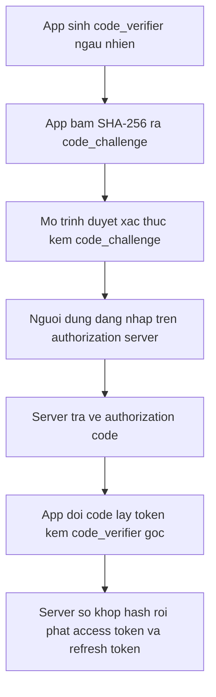
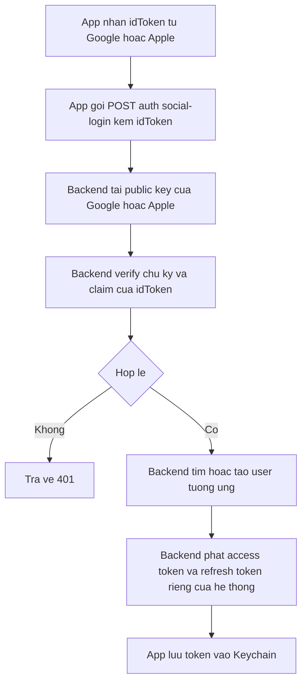

# Authentication: Social Login & quản lý token

Authentication (xác thực danh tính người dùng) trên mobile phức tạp hơn web khá nhiều -- trình duyệt có cookie và session tự động, còn app phải tự tay quản lý toàn bộ vòng đời của token: xin, lưu, làm mới, và xoá đúng lúc. Bài này đi từ luồng đăng nhập cơ bản (email/mật khẩu) đến social login qua Google/Apple bằng chuẩn OAuth 2.0 + PKCE, rồi cách lưu token an toàn và tự động làm mới khi hết hạn.

**Tương tự đơn giản:** Token giống **vé xem phim có giờ hết hạn** -- access token là vé vào rạp ngay bây giờ (hết hạn nhanh, 15 phút - 1 giờ), refresh token là **thẻ thành viên** đổi được vé mới mà không cần xếp hàng mua lại (sống lâu hơn, vài tuần - vài tháng). Mất thẻ thành viên thì phải ra quầy đăng nhập lại từ đầu.

---

:::note[Ghi nhớ nhanh]

- ⭐ **Không bao giờ nhúng client secret vào app** -- app mobile là "public client", ai cũng decompile được; dùng OAuth 2.0 + PKCE (Proof Key for Code Exchange) để không cần secret.
- ⭐ **Token nhạy cảm lưu bằng `react-native-keychain`** -- vào Keychain (iOS) / Keystore (Android), KHÔNG dùng `AsyncStorage` (plain text).
- **`idToken`/`identityToken`** từ Google/Apple chỉ là bằng chứng danh tính -- backend phải tự verify rồi mới phát access token + refresh token riêng của hệ thống.
- **Refresh token nên gộp về một lượt bay** -- nhiều request cùng lúc gặp 401 mà mỗi cái tự gọi refresh sẽ đua nhau, dễ làm token bị revoke nhầm.
- **Logout sạch** không chỉ xoá token -- phải gọi API invalidate ở server, huỷ kết nối realtime, và unregister push token.

:::

---

## Mục lục

- [Vì sao cần luồng đăng nhập riêng cho mobile?](#vì-sao-cần-luồng-đăng-nhập-riêng-cho-mobile)
- [1. Luồng đăng nhập cơ bản email và mật khẩu](#1-luồng-đăng-nhập-cơ-bản-email-và-mật-khẩu)
- [2. Social login và OAuth PKCE](#2-social-login-và-oauth-pkce)
- [3. Google Sign-In](#3-google-sign-in)
- [4. Apple Sign-In](#4-apple-sign-in)
- [5. Backend verify token và phát token](#5-backend-verify-token-và-phát-token)
- [6. Lưu token bằng react-native-keychain](#6-lưu-token-bằng-react-native-keychain)
- [7. Tự động refresh token bằng interceptor](#7-tự-động-refresh-token-bằng-interceptor)
- [8. Session state với Zustand](#8-session-state-với-zustand)
- [9. Logout sạch](#9-logout-sạch)
- [10. Biometric xác thực nhanh](#10-biometric-xác-thực-nhanh)
- [11. Bảo vệ route bằng React Navigation](#11-bảo-vệ-route-bằng-react-navigation)
- [Khi nào dùng?](#khi-nào-dùng)
- [Lỗi thường gặp](#lỗi-thường-gặp)
- [Câu hỏi phỏng vấn](#câu-hỏi-phỏng-vấn)

---

## Vì sao cần luồng đăng nhập riêng cho mobile?

**Vấn đề:** Trên web, đăng nhập OAuth thường dùng **confidential client** -- server của bạn giữ `client_secret`, chỉ trao đổi bí mật đó qua kênh server-to-server nên attacker không nhìn thấy. App mobile thì khác: **mọi thứ nằm trong tay người dùng**. Attacker decompile APK/IPA là đọc được bất kỳ chuỗi nào hardcode trong bundle JS hay native code.

```ts
// SAI -- client_secret nam trong bundle JS, attacker decompile lay duoc ngay
const CLIENT_SECRET = 'super-secret-abc123';

async function exchangeCodeForToken(code: string) {
  return fetch('https://oauth.example.com/token', {
    method: 'POST',
    headers: { 'Content-Type': 'application/json' },
    body: JSON.stringify({
      code,
      client_id: 'app-client-id',
      client_secret: CLIENT_SECRET, // lo bi mat OAuth
    }),
  });
}
```

Đây gọi là bài toán "public client" trong OAuth 2.0 -- client không thể giữ bí mật một cách an toàn.

**Giải pháp:** Chuẩn **OAuth 2.0 Authorization Code Flow with PKCE** (RFC 7636) thay `client_secret` bằng một bí mật **sinh ngẫu nhiên trên máy** ở mỗi lượt đăng nhập, không bao giờ rời khỏi thiết bị dưới dạng thô.

```ts
// DUNG -- khong co client_secret, dung cap code_verifier / code_challenge tam thoi
const { codeVerifier, codeChallenge } = createPkcePair();

// Buoc 1: mo man hinh dang nhap, gui codeChallenge (server chua thay codeVerifier)
openAuthorizationScreen({ codeChallenge });

// Buoc 2: nhan "code" tra ve, doi lay token bang codeVerifier -- chi may nay biet
const tokens = await exchangeCodeForToken({ code, codeVerifier });
```

Với social login (Google, Apple), luồng còn đơn giản hơn -- SDK native xử lý toàn bộ vòng xác thực người dùng và chỉ trả về một token định danh (`idToken`) để app gửi lên backend xác minh.

:::tip[Dùng thực tế]

- **App tiêu dùng (B2C)**: ưu tiên Google Sign-In / Apple Sign-In để giảm ma sát -- người dùng không cần nhớ thêm mật khẩu.
- **Đăng nhập bằng tổ chức (SSO)**: dùng OAuth 2.0 + PKCE trỏ tới identity provider của công ty, app không giữ secret nào.
- **API cần gọi liên tục**: access token sống ngắn (phút - giờ) để giảm thiệt hại nếu bị lộ; refresh token sống dài để không bắt đăng nhập lại mỗi lần mở app.
- **Ứng dụng tài chính, chat nội bộ**: kết hợp thêm biometric (Face ID/vân tay) để khoá lại sau khi đã đăng nhập.

:::

---

## 1. Luồng đăng nhập cơ bản email và mật khẩu

Luồng đơn giản nhất: form nhập email/mật khẩu, gọi API, nhận về token.

```tsx
import { useState } from 'react';
import { View, TextInput, Button, Text } from 'react-native';

type LoginResponse = {
  accessToken: string;
  refreshToken: string;
  expiresIn: number; // giay
  user: { id: string; email: string; displayName: string };
};

async function loginWithPassword(email: string, password: string): Promise<LoginResponse> {
  const res = await fetch('https://api.example.com/auth/login', {
    method: 'POST',
    headers: { 'Content-Type': 'application/json' },
    body: JSON.stringify({ email, password }),
  });
  if (!res.ok) {
    throw new Error(`Dang nhap that bai (HTTP ${res.status})`);
  }
  return (await res.json()) as LoginResponse;
}

export function LoginScreen() {
  const [email, setEmail] = useState('');
  const [password, setPassword] = useState('');
  const [error, setError] = useState<string | null>(null);
  const [loading, setLoading] = useState(false);

  const handleSubmit = async () => {
    setError(null);
    setLoading(true);
    try {
      const data = await loginWithPassword(email, password);
      // luu token -- xem section 6
      await saveTokens(data);
    } catch (e) {
      setError(e instanceof Error ? e.message : 'Loi khong xac dinh');
    } finally {
      setLoading(false);
    }
  };

  return (
    <View style={{ padding: 24, gap: 12 }}>
      <TextInput
        value={email}
        onChangeText={setEmail}
        placeholder="Email"
        autoCapitalize="none"
        keyboardType="email-address"
      />
      <TextInput
        value={password}
        onChangeText={setPassword}
        placeholder="Mat khau"
        secureTextEntry
      />
      {error ? <Text style={{ color: 'red' }}>{error}</Text> : null}
      <Button title={loading ? 'Dang xu ly...' : 'Dang nhap'} onPress={handleSubmit} disabled={loading} />
    </View>
  );
}

// saveTokens(data): luu vao Keychain -- xem section 6
```

Validate client-side (định dạng email, độ dài mật khẩu) chỉ để phản hồi nhanh cho người dùng -- **backend luôn phải validate lại**, client không được tin.

---

## 2. Social login và OAuth PKCE

**Social login** (đăng nhập bằng Google/Apple/Facebook...) về bản chất là một biến thể của **OAuth 2.0 Authorization Code Flow**: identity provider (Google, Apple) xác thực người dùng thay app, rồi trả về một token chứng minh danh tính.

Với luồng OAuth tổng quát hơn (ví dụ đăng nhập bằng tài khoản tổ chức qua một authorization server riêng), mobile app luôn là **public client** -- không có nơi nào an toàn để giữ `client_secret`. PKCE giải quyết việc này:

1. App sinh `code_verifier` -- một chuỗi ngẫu nhiên, chỉ tồn tại trong bộ nhớ của lượt đăng nhập đó.
2. App băm `code_verifier` bằng SHA-256 ra `code_challenge`, gửi kèm khi mở màn hình đăng nhập.
3. Authorization server nhớ `code_challenge`, trả về một `code` sau khi người dùng đăng nhập thành công.
4. App đổi `code` lấy token, gửi kèm `code_verifier` gốc -- server so khớp hash để chắc chắn đúng chính thiết bị đã mở bước 2, không phải kẻ chặn được `code` giữa đường.



```ts
type PkcePair = { codeVerifier: string; codeChallenge: string };

// Vi du minh hoa -- thu vien thuc te (vd expo-auth-session) da lo phan sinh
// ngau nhien an toan va bam SHA-256, khong nen tu viet lai trong app production.
// createPkcePair(): sinh cap { codeVerifier, codeChallenge } noi tren

async function startOrgLogin() {
  const { codeVerifier, codeChallenge } = createPkcePair();
  const authUrl =
    `https://sso.example.com/authorize` +
    `?client_id=app-client-id` +
    `&response_type=code` +
    `&code_challenge=${codeChallenge}` +
    `&code_challenge_method=S256`;

  // mo authUrl bang trinh duyet he thong (vd expo-auth-session, App Auth)
  const code = await openAuthorizationScreen(authUrl);

  return exchangeCodeForToken({ code, codeVerifier });
}

// openAuthorizationScreen: mo trinh duyet he thong, cho user dang nhap, tra ve "code"
// exchangeCodeForToken: POST code + codeVerifier len token endpoint, tra ve token
```

Với Google/Apple Sign-In, SDK native đã đóng gói toàn bộ bước 1-4 -- app chỉ cần gọi một hàm và nhận về `idToken`/`identityToken`, xem hai section tiếp theo.

---

## 3. Google Sign-In

`@react-native-google-signin/google-signin` (v16.x) là wrapper chính thức cho Google Sign-In SDK trên cả iOS và Android.

```bash
npm install @react-native-google-signin/google-signin
```

### Cấu hình

```ts
import { GoogleSignin } from '@react-native-google-signin/google-signin';

// Goi mot lan luc app khoi dong, truoc khi man hinh dang nhap mount.
GoogleSignin.configure({
  // webClientId: lay tu Google Cloud Console (OAuth client loai "Web application")
  // -- BAT BUOC de nhan duoc idToken hop le ma backend verify duoc, dung tren ca
  // iOS lan Android.
  webClientId: 'your-web-client-id.apps.googleusercontent.com',
  // iosClientId: OAuth client rieng cho iOS, doc tu GoogleService-Info.plist.
  iosClientId: 'your-ios-client-id.apps.googleusercontent.com',
});
```

### Đăng nhập

```ts
import { GoogleSignin, statusCodes } from '@react-native-google-signin/google-signin';

type GoogleSignInResult =
  | { ok: true; idToken: string; email: string; displayName: string }
  | { ok: false; reason: 'cancelled' | 'in-progress' | 'play-services' | 'error'; message: string };

export async function signInWithGoogle(): Promise<GoogleSignInResult> {
  try {
    // Android bat buoc kiem tra Google Play Services truoc khi mo sheet dang nhap.
    await GoogleSignin.hasPlayServices({ showPlayServicesUpdateDialog: true });
  } catch (e) {
    return { ok: false, reason: 'play-services', message: 'Google Play Services khong kha dung' };
  }

  let response;
  try {
    response = await GoogleSignin.signIn();
  } catch (e: unknown) {
    const code = (e as { code?: string })?.code;
    if (code === statusCodes.IN_PROGRESS) {
      return { ok: false, reason: 'in-progress', message: 'Da co lan dang nhap khac dang chay' };
    }
    if (code === statusCodes.PLAY_SERVICES_NOT_AVAILABLE) {
      return { ok: false, reason: 'play-services', message: 'Google Play Services khong kha dung' };
    }
    return { ok: false, reason: 'error', message: 'Loi Google Sign-In khong xac dinh' };
  }

  // Tu v13+, ket qua tra ve la mot discriminated union { type, data } thay vi
  // nem exception khi nguoi dung bam Huy nhu ban cu.
  if (response.type === 'cancelled') {
    return { ok: false, reason: 'cancelled', message: 'Nguoi dung huy dang nhap' };
  }

  const { idToken, user } = response.data;
  if (!idToken) {
    return { ok: false, reason: 'error', message: 'Khong nhan duoc idToken tu Google' };
  }

  return { ok: true, idToken, email: user.email, displayName: user.name ?? user.email };
}

export async function signOutGoogle(): Promise<void> {
  try {
    await GoogleSignin.signOut();
  } catch {
    // best-effort -- chi xoa cache SDK local, khong anh huong session backend
  }
}
```

`idToken` là một JWT do Google ký -- app gửi nguyên chuỗi này lên backend, **không tự parse để tin nội dung**; chỉ backend mới verify chữ ký (xem section 5).

### Lỗi thường gặp: `DEVELOPER_ERROR`

Trên Android, `DEVELOPER_ERROR` gần như luôn do **SHA-1 fingerprint của keystore ký app không khớp** với SHA-1 đã khai trong Google Cloud Console cho OAuth client Android. Kiểm tra:

- Debug build dùng keystore debug khác release -- phải khai cả hai SHA-1 nếu test cả debug lẫn release.
- Package name trong Console phải khớp `applicationId` thật của app.

---

## 4. Apple Sign-In

`@invertase/react-native-apple-authentication` (v2.x) bọc API `AuthenticationServices` của Apple. Chỉ hoạt động trên **iOS**, không có bridge Android.

```bash
npm install @invertase/react-native-apple-authentication
```

```ts
import { Platform } from 'react-native';
import { appleAuth } from '@invertase/react-native-apple-authentication';

type AppleSignInResult =
  | { ok: true; idToken: string; nonce: string; email: string; displayName: string }
  | { ok: false; reason: 'cancelled' | 'unsupported' | 'error'; message: string };

export async function signInWithApple(): Promise<AppleSignInResult> {
  if (Platform.OS !== 'ios' || !appleAuth.isSupported) {
    return { ok: false, reason: 'unsupported', message: 'Sign in with Apple khong kha dung tren thiet bi nay' };
  }

  let response: Awaited<ReturnType<typeof appleAuth.performRequest>>;
  try {
    response = await appleAuth.performRequest({
      requestedOperation: appleAuth.Operation.LOGIN,
      requestedScopes: [appleAuth.Scope.FULL_NAME, appleAuth.Scope.EMAIL],
    });
  } catch (e: unknown) {
    const code = (e as { code?: string })?.code;
    if (code === appleAuth.Error.CANCELED) {
      return { ok: false, reason: 'cancelled', message: 'Nguoi dung huy dang nhap' };
    }
    return { ok: false, reason: 'error', message: 'Loi Apple Sign-In khong xac dinh' };
  }

  const idToken = response.identityToken;
  if (!idToken) {
    return { ok: false, reason: 'error', message: 'Khong nhan duoc identityToken tu Apple' };
  }

  const fullName = [response.fullName?.givenName, response.fullName?.familyName]
    .filter(Boolean)
    .join(' ')
    .trim();

  return {
    ok: true,
    idToken,
    // nonce: chuoi ngau nhien app tu sinh truoc khi goi performRequest, dung de
    // backend doi chieu voi claim "nonce" trong identityToken -- chong replay
    // attack (ai do chan duoc mot identityToken cu roi gui lai).
    nonce: response.nonce,
    email: response.email ?? '',
    displayName: fullName || (response.email ?? ''),
  };
}
```

**Hai điểm cần nhớ:**

- **Email và họ tên chỉ trả về ở lần đăng nhập đầu tiên** -- những lần sau, Apple trả `null` cho cả hai vì lý do riêng tư. Backend cần lưu lại các trường này từ lần đầu và không được coi việc thiếu chúng ở lần sau là lỗi.
- **App Store Review Guideline 4.8**: nếu app có sẵn ít nhất một phương thức social login khác (Google, Facebook...), app **bắt buộc phải có** Sign in with Apple, nếu không sẽ bị từ chối khi submit.

---

## 5. Backend verify token và phát token

App **không bao giờ tự quyết định** người dùng đã đăng nhập hợp lệ chỉ dựa vào `idToken`/`identityToken` nhận từ SDK -- token đó phải được gửi lên backend để xác minh, vì chỉ backend mới có thể kiểm tra chữ ký chống giả mạo.



```ts
// Phia server (minh hoa) -- KHONG chay tren app.
type SocialLoginRequest = { provider: 'google' | 'apple'; idToken: string; nonce?: string };
type TokenResponse = { accessToken: string; refreshToken: string; expiresIn: number; user: unknown };

async function handleSocialLogin(req: SocialLoginRequest): Promise<TokenResponse> {
  // 1. Verify chu ky JWT bang public key cua provider (JWKS endpoint cong khai).
  const claims = await verifyIdToken(req.provider, req.idToken, req.nonce);

  // 2. Tim hoac tao user trong database theo email/subject claim.
  const user = await findOrCreateUser(claims);

  // 3. Phat token RIENG cua he thong -- KHONG dung lai idToken cua Google/Apple
  //    cho cac request sau, vi token do khong do he thong minh kiem soat vong doi.
  const accessToken = signAccessToken(user, { expiresIn: '15m' });
  const refreshToken = await issueRefreshToken(user);

  return { accessToken, refreshToken, expiresIn: 900, user };
}

// verifyIdToken: kiem tra chu ky + claim voi JWKS cua Google/Apple
// findOrCreateUser, signAccessToken, issueRefreshToken: logic phia database/JWT cua backend
```

**Access token** sống ngắn (thường 15 phút - 1 giờ) -- nếu bị lộ, thiệt hại giới hạn trong khoảng thời gian ngắn. **Refresh token** sống dài (vài tuần - vài tháng), chỉ dùng để xin access token mới, và có thể bị **revoke** (thu hồi) phía server bất cứ lúc nào -- ví dụ khi người dùng đổi mật khẩu hoặc đăng xuất từ thiết bị khác.

---

## 6. Lưu token bằng react-native-keychain

`react-native-keychain` (v10.x) lưu dữ liệu vào **Keychain Services** (iOS) / **Keystore + EncryptedSharedPreferences** (Android) -- mã hoá phần cứng, sandbox theo bundle id của app.

```bash
npm install react-native-keychain
```

```ts
import * as Keychain from 'react-native-keychain';

const SERVICE = 'com.example.app.auth';

export type PersistedAuth = {
  accessToken: string;
  refreshToken: string;
  expiresAt: number; // epoch ms
};

export async function saveAuth(data: PersistedAuth): Promise<boolean> {
  try {
    const result = await Keychain.setGenericPassword('session', JSON.stringify(data), {
      service: SERVICE,
      // WHEN_UNLOCKED_THIS_DEVICE_ONLY: chi doc duoc khi may da mo khoa, va
      // KHONG bao gio dong bo len iCloud Keychain sang thiet bi khac -- dung
      // cho session, vi mot phien dang nhap khong nen "theo" sang may moi.
      accessible: Keychain.ACCESSIBLE.WHEN_UNLOCKED_THIS_DEVICE_ONLY,
    });
    return result !== false;
  } catch {
    return false;
  }
}

export async function loadAuth(): Promise<PersistedAuth | null> {
  try {
    const result = await Keychain.getGenericPassword({ service: SERVICE });
    if (!result) return null;
    return JSON.parse(result.password) as PersistedAuth;
  } catch {
    // parse loi hoac keychain khong doc duoc -- coi nhu chua dang nhap
    return null;
  }
}

export async function clearAuth(): Promise<void> {
  try {
    await Keychain.resetGenericPassword({ service: SERVICE });
  } catch {
    // best-effort -- logout van tiep tuc du xoa keychain that bai
  }
}
```

**Vì sao không dùng `AsyncStorage`:** `AsyncStorage` lưu **plain text** trên đĩa -- thiết bị bị root/jailbreak đọc được ngay. Token là thứ mở khoá toàn bộ tài khoản người dùng nên luôn phải đi qua lớp mã hoá của hệ điều hành.

**Các option `accessible` hay dùng:**

| Option | Ý nghĩa |
| --- | --- |
| `WHEN_UNLOCKED` | Đọc được bất cứ khi nào máy đã mở khoá; có thể đồng bộ iCloud Keychain (iOS) |
| `WHEN_UNLOCKED_THIS_DEVICE_ONLY` | Giống trên nhưng KHÔNG đồng bộ sang thiết bị khác -- khuyến nghị cho session |
| `AFTER_FIRST_UNLOCK` | Đọc được kể cả khi app chạy nền trước khi người dùng mở khoá máy lần đầu sau khi khởi động lại |

---

## 7. Tự động refresh token bằng interceptor

Access token hết hạn sau vài phút -- nếu bắt người dùng đăng nhập lại mỗi lần token hết hạn thì trải nghiệm rất tệ. Giải pháp: một lớp **interceptor** bọc quanh `fetch`, tự phát hiện `401`, xin access token mới bằng refresh token, rồi gửi lại request ban đầu -- toàn bộ trong suốt với phần code gọi API.

Điểm dễ sai nhất: nếu 5 request cùng gặp `401` gần như đồng thời, **không được để cả 5 cùng gọi refresh** -- vừa lãng phí, vừa có nguy cơ refresh token bị server coi là dùng nhiều lần và revoke luôn. Cách xử lý: gộp mọi lượt refresh đang chạy về **một Promise dùng chung**.

```ts
import { useAuthStore } from './authStore';

let refreshInFlight: Promise<boolean> | null = null;

async function refreshOnce(): Promise<boolean> {
  // Da co mot lot refresh dang bay -- moi request khac chi can "an theo" ket
  // qua cua no, khong tao lot moi.
  if (refreshInFlight) return refreshInFlight;

  refreshInFlight = (async () => {
    const { refreshToken } = useAuthStore.getState();
    if (!refreshToken) return false;

    try {
      const res = await fetch('https://api.example.com/auth/refresh', {
        method: 'POST',
        headers: { 'Content-Type': 'application/json' },
        body: JSON.stringify({ refreshToken }),
      });
      if (!res.ok) return false;

      const data = (await res.json()) as { accessToken: string; refreshToken: string; expiresIn: number };
      useAuthStore.getState().setTokens({
        token: data.accessToken,
        refreshToken: data.refreshToken,
        expiresAt: Date.now() + data.expiresIn * 1000,
      });
      return true;
    } catch {
      return false;
    }
  })();

  try {
    return await refreshInFlight;
  } finally {
    // Xoa co sau khi xong -- lot refresh KE TIEP (vd token lai het han sau do)
    // phai duoc phep chay, khong bi khoa vinh vien boi lot cu.
    refreshInFlight = null;
  }
}

export async function authedFetch(path: string, init: RequestInit = {}, retried = false): Promise<Response> {
  const { token } = useAuthStore.getState();
  const headers: Record<string, string> = {
    Accept: 'application/json',
    ...(init.headers as Record<string, string>),
  };
  if (token) headers.Authorization = `Bearer ${token}`;

  const res = await fetch(`https://api.example.com${path}`, { ...init, headers });

  if (res.status === 401 && !retried && token) {
    const refreshed = await refreshOnce();
    if (refreshed) {
      // Goi lai DUNG MOT LAN -- retried=true chan vong lap vo han neu token
      // moi van bi 401 (vd tai khoan bi khoa phia server).
      return authedFetch(path, init, true);
    }
    // Refresh that bai -- phien thuc su da het, dang xuat nguoi dung.
    useAuthStore.getState().clear();
  }

  return res;
}
```

---

## 8. Session state với Zustand

Zustand giữ toàn bộ trạng thái phiên đăng nhập ở **một nơi duy nhất**, mọi màn hình đọc/ghi qua cùng một store thay vì truyền props qua nhiều tầng.

```ts
import { create } from 'zustand';

type AuthTokens = { token: string; refreshToken: string; expiresAt: number };

export type AuthUser = { id: string; email: string; displayName: string };

// hydrating: app vua mo, chua biet co phien hay khong (dang doc Keychain)
// authed: co token dung duoc
// anon: biet chac chan chua dang nhap
// expired: tung dang nhap nhung refresh that bai -- can bao "phien da het han"
export type AuthStatus = 'hydrating' | 'authed' | 'anon' | 'expired';

type AuthState = AuthTokens & {
  authStatus: AuthStatus;
  user: AuthUser | null;
  setTokens: (tokens: AuthTokens) => void;
  setUser: (user: AuthUser) => void;
  setAnon: () => void;
  clear: () => void;
};

export const useAuthStore = create<AuthState>((set) => ({
  token: '',
  refreshToken: '',
  expiresAt: 0,
  authStatus: 'hydrating',
  user: null,
  setTokens: (tokens) => set({ ...tokens, authStatus: 'authed' }),
  setUser: (user) => set({ user }),
  setAnon: () => set({ authStatus: 'anon' }),
  clear: () => set({ token: '', refreshToken: '', expiresAt: 0, user: null, authStatus: 'expired' }),
}));
```

Tách `authStatus` thành 4 giá trị (thay vì chỉ `boolean isLoggedIn`) giải quyết đúng vấn đề "app đã vẽ xong UI nhưng chưa biết có phiên hay không" -- rất hay gặp khi đọc Keychain là bất đồng bộ.

---

## 9. Logout sạch

Đăng xuất "sạch" không chỉ là xoá token trong bộ nhớ -- bỏ sót một bước là để lại rác (kết nối realtime treo, push notification vẫn gửi tới máy đã đăng xuất...).

```ts
import { useAuthStore } from './authStore';
import { clearAuth } from './keychain';

export async function logout(): Promise<void> {
  const { token } = useAuthStore.getState();

  // 1. Bao server thu hoi refresh token -- neu bo qua, refresh token cu van
  //    dung duoc neu bi lo ra ngoai du app da "quen" no.
  try {
    await fetch('https://api.example.com/auth/logout', {
      method: 'POST',
      headers: { Authorization: `Bearer ${token}` },
    });
  } catch {
    // logout local van tiep tuc du server khong phan hoi
  }

  // 2. Huy dang ky push token -- khong de server con gui push toi may da dang xuat.
  await unregisterPushToken();

  // 3. Dong ket noi realtime (WebSocket/socket.io) -- tranh no tu ket noi lai
  //    bang token cu ngay sau khi bi dong.
  disconnectRealtime();

  // 4. Xoa Keychain.
  await clearAuth();

  // 5. Reset Zustand store SAU CUNG -- cac buoc tren co the con doc token tu store.
  useAuthStore.getState().clear();
}

// unregisterPushToken: goi API xoa device token khoi danh sach nhan push
// disconnectRealtime: dong socket dang mo cua tang chat/realtime
```

Thứ tự quan trọng: xoá store **cuối cùng**, vì các bước gọi API phía trên (logout, unregister push) vẫn cần đọc access token hiện tại.

---

## 10. Biometric xác thực nhanh

Biometric (Face ID, Touch ID, vân tay) không thay thế luồng đăng nhập ban đầu -- nó là một **lớp khoá nhanh** phía trên phiên đã đăng nhập sẵn, dùng cho hai tình huống:

- **Khoá app khi mở lại**: người dùng đã đăng nhập từ trước, nhưng phải xác thực sinh trắc mỗi lần mở app hoặc quay lại từ nền -- tránh người khác cầm máy (đã mở khoá điện thoại) mà xem được nội dung nhạy cảm.
- **Xác nhận hành động nhạy cảm**: chuyển tiền, đổi mật khẩu, xem thông tin thẻ -- yêu cầu xác thực lại ngay trước khi thực hiện.

Về mặt kỹ thuật, hai hướng phổ biến: dùng `accessControl` của `react-native-keychain` (bắt buộc sinh trắc khi **đọc** một entry cụ thể trong Keychain), hoặc dùng một thư viện xác thực sinh trắc riêng (ví dụ `expo-local-authentication`) để hỏi hệ điều hành "người dùng có xác thực thành công không" độc lập với việc đọc dữ liệu. Cả hai đều **không tự cấp token mới** -- chúng chỉ là điều kiện để app cho phép đọc token đã có sẵn hoặc cho phép tiếp tục một hành động.

---

## 11. Bảo vệ route bằng React Navigation

Route được bảo vệ bằng cách **render có điều kiện** dựa trên `authStatus` -- không phải bằng cách chặn từng màn hình riêng lẻ.

```tsx
import { NavigationContainer } from '@react-navigation/native';
import { createNativeStackNavigator } from '@react-navigation/native-stack';
import { useAuthStore } from './authStore';

const Stack = createNativeStackNavigator();

function AuthStack() {
  return (
    <Stack.Navigator>
      <Stack.Screen name="Login" component={LoginScreen} />
      <Stack.Screen name="Register" component={RegisterScreen} />
    </Stack.Navigator>
  );
}

function MainStack() {
  return (
    <Stack.Navigator>
      <Stack.Screen name="Home" component={HomeScreen} />
      <Stack.Screen name="Profile" component={ProfileScreen} />
    </Stack.Navigator>
  );
}

export function RootNavigator() {
  const authStatus = useAuthStore((s) => s.authStatus);

  return (
    <NavigationContainer>
      {authStatus === 'hydrating' ? (
        <SplashScreen />
      ) : authStatus === 'authed' ? (
        <MainStack />
      ) : (
        <AuthStack />
      )}
    </NavigationContainer>
  );
}

// SplashScreen, LoginScreen, RegisterScreen, HomeScreen, ProfileScreen: cac
// man hinh cu the cua app -- luoc bo phan implement de tap trung vao logic dieu huong
```

Điểm quan trọng: pha `hydrating` phải có màn hình riêng (splash/loading) -- nếu để `authStatus` mặc định rơi vào nhánh `AuthStack`, người dùng đã đăng nhập từ trước sẽ **thấy màn hình Login nhấp nháy** một khoảnh khắc trước khi Keychain kịp trả lời, trải nghiệm giật cục.

---

## Khi nào dùng?

| Nhu cầu | Lựa chọn |
| --- | --- |
| Giảm ma sát đăng ký cho app tiêu dùng | Google Sign-In / Apple Sign-In |
| App có social login khác trên iOS | Bắt buộc thêm Apple Sign-In (App Store Guideline 4.8) |
| Đăng nhập bằng tài khoản tổ chức / SSO | OAuth 2.0 Authorization Code + PKCE |
| Lưu access token, refresh token | `react-native-keychain`, không `AsyncStorage` |
| Nhiều request cùng gặp 401 | Gộp refresh về một Promise dùng chung |
| Khoá lại app đã đăng nhập | Biometric (Face ID/vân tay) |
| Điều hướng theo trạng thái đăng nhập | Render `AuthStack`/`MainStack` có điều kiện trong React Navigation |

- **Best practice:**
  - Access token sống ngắn, refresh token sống dài và có thể revoke.
  - Không parse `idToken`/`identityToken` ở client để "tin" nội dung -- luôn để backend verify.
  - Logout gọi API invalidate refresh token phía server, không chỉ xoá local.
  - Tách rõ pha `hydrating` khỏi `anon` trong session state.

---

## Lỗi thường gặp

| Lỗi | Nguyên nhân | Cách sửa |
| --- | --- | --- |
| `DEVELOPER_ERROR` khi Google Sign-In trên Android | SHA-1 fingerprint của keystore ký app không khớp OAuth client trong Google Cloud Console | Khai đúng SHA-1 cho cả debug và release keystore |
| Google Sign-In trả `idToken` rỗng | Thiếu `webClientId` khi `GoogleSignin.configure` | Luôn truyền `webClientId`, kể cả trên iOS |
| App bị Apple từ chối khi submit | Có social login khác nhưng thiếu Sign in with Apple | Thêm Apple Sign-In theo Guideline 4.8 |
| Token lưu `AsyncStorage` | Thói quen cũ từ web, hoặc ngại setup Keychain | Chuyển sang `react-native-keychain`, encrypted |
| Nhiều request 401 cùng lúc gọi refresh song song | Không gộp lượt refresh, mỗi request tự xử lý 401 riêng | Dùng một `Promise` refresh dùng chung (singleton in-flight) |
| Vòng lặp vô hạn khi refresh xong vẫn 401 | Quên cờ `retried`, request lại cứ gọi refresh mãi | Chỉ retry đúng một lần, sau đó coi phiên đã hết hạn |
| Người dùng đăng nhập từ trước vẫn thấy màn Login nhấp nháy | Bỏ qua pha `hydrating`, mặc định render `AuthStack` | Thêm trạng thái `hydrating` riêng với splash/loading |
| Logout nhưng vẫn nhận push notification | Quên unregister push token trước khi xoá phiên | Gọi API huỷ đăng ký push trong luồng logout |

---

## Câu hỏi phỏng vấn

Những câu thường gặp về chủ đề này. Tự trả lời trước, rồi bấm **Xem đáp án** để đối chiếu.

**1. Vì sao mobile app không nên tự nhúng client secret của OAuth?**

<details className="qa">
<summary>Xem đáp án</summary>

Vì app cài trên máy người dùng -- attacker decompile APK/IPA là đọc được mọi chuỗi hardcode, kể cả trong bundle JS đã minify. OAuth gọi đây là bài toán **public client**: không có cách nào giữ bí mật an toàn phía client. Giải pháp là PKCE -- thay `client_secret` cố định bằng một cặp `code_verifier`/`code_challenge` sinh ngẫu nhiên ở mỗi lượt đăng nhập.

</details>

**2. PKCE giải quyết vấn đề gì, hoạt động thế nào?**

<details className="qa">
<summary>Xem đáp án</summary>

PKCE (Proof Key for Code Exchange, RFC 7636) chống việc kẻ tấn công chặn được `authorization code` giữa đường rồi tự đổi lấy token. App sinh `code_verifier` ngẫu nhiên, gửi bản băm SHA-256 của nó (`code_challenge`) khi mở màn hình đăng nhập; lúc đổi `code` lấy token phải gửi kèm `code_verifier` gốc để server so khớp hash. Ai chặn được `code` mà không có `code_verifier` gốc thì không đổi được token.

</details>

**3. `idToken` khác `access token` của hệ thống backend như thế nào?**

<details className="qa">
<summary>Xem đáp án</summary>

`idToken`/`identityToken` là JWT do Google/Apple ký, chỉ chứng minh **danh tính người dùng với provider đó** -- không phải quyền truy cập API của hệ thống backend. App gửi token này lên backend, backend verify chữ ký rồi mới phát **access token + refresh token riêng** của hệ thống mình. Hai loại token này độc lập vòng đời, không dùng lẫn cho nhau.

</details>

**4. Vì sao Apple chỉ trả về email và họ tên ở lần đăng nhập đầu tiên?**

<details className="qa">
<summary>Xem đáp án</summary>

Đây là chính sách riêng tư của Apple -- những lần đăng nhập sau, `fullName` và `email` trả về `null` dù người dùng vẫn xác thực thành công. Backend phải **lưu lại các trường này từ lần đầu tiên** khi tạo tài khoản; những lần sau chỉ dựa vào `identityToken` (chứa claim định danh ổn định) để nhận diện đúng người dùng cũ, không được coi thiếu email là lỗi.

</details>

**5. `DEVELOPER_ERROR` khi Google Sign-In trên Android thường do đâu?**

<details className="qa">
<summary>Xem đáp án</summary>

Gần như luôn do **SHA-1 fingerprint của keystore ký app không khớp** với SHA-1 đã khai cho OAuth client Android trong Google Cloud Console. Debug build và release build dùng keystore khác nhau nên cần khai cả hai SHA-1 nếu test trên cả hai loại build; package name cũng phải khớp `applicationId` thật.

</details>

**6. Vì sao không dùng `AsyncStorage` để lưu access token/refresh token?**

<details className="qa">
<summary>Xem đáp án</summary>

`AsyncStorage` lưu dữ liệu dạng **plain text** trên đĩa -- thiết bị bị root/jailbreak đọc được trực tiếp. Token là chìa khoá mở toàn bộ tài khoản người dùng nên phải đi qua lớp mã hoá phần cứng của hệ điều hành, tức `react-native-keychain` (Keychain iOS / Keystore Android).

</details>

**7. Vì sao cần cả access token lẫn refresh token, không dùng một loại token duy nhất?**

<details className="qa">
<summary>Xem đáp án</summary>

Access token sống ngắn (phút - giờ) để giới hạn thiệt hại nếu bị lộ -- kẻ tấn công chỉ lợi dụng được trong một khoảng thời gian ngắn. Refresh token sống dài hơn nhiều nhưng chỉ dùng để xin access token mới, không gọi trực tiếp API nghiệp vụ, và server có thể **revoke** nó bất cứ lúc nào (đổi mật khẩu, đăng xuất từ xa) mà không cần chờ hết hạn.

</details>

**8. Làm sao tránh nhiều request cùng gọi refresh token song song?**

<details className="qa">
<summary>Xem đáp án</summary>

Gộp mọi lượt refresh đang chạy về **một `Promise` dùng chung** ở phạm vi module: request đầu tiên gặp `401` sẽ khởi tạo `Promise` refresh và lưu vào một biến; các request khác gặp `401` cùng lúc chỉ cần `await` đúng `Promise` đó thay vì tự gọi API refresh riêng. Sau khi refresh xong (thành công hay thất bại), xoá biến để lượt refresh tiếp theo được phép chạy.

</details>

**9. Logout "sạch" cần thực hiện những bước nào?**

<details className="qa">
<summary>Xem đáp án</summary>

Tối thiểu năm bước: (1) gọi API invalidate refresh token phía server, (2) huỷ đăng ký push notification token, (3) đóng kết nối realtime (WebSocket) đang mở, (4) xoá token khỏi Keychain, (5) reset session store (Zustand) về trạng thái chưa đăng nhập. Thứ tự quan trọng -- reset store nên làm **cuối cùng** vì các bước trước vẫn cần đọc access token hiện tại.

</details>

**10. Vì sao session state nên tách `authStatus` thành nhiều giá trị thay vì một `boolean isLoggedIn`?**

<details className="qa">
<summary>Xem đáp án</summary>

Vì app có một khoảng thời gian **đã vẽ xong UI nhưng chưa biết** có phiên đăng nhập hay không -- lúc đang đọc Keychain bất đồng bộ lúc khởi động. Nếu chỉ có `boolean`, giai đoạn này buộc phải gán tạm `false`, khiến người dùng đã đăng nhập từ trước thấy màn hình Login nhấp nháy. Bốn trạng thái `hydrating`/`authed`/`anon`/`expired` cho phép phân biệt rõ "chưa biết" với "biết chắc chưa đăng nhập" và với "từng đăng nhập nhưng phiên đã hết".

</details>

**11. Route trong React Navigation được bảo vệ bằng cách nào?**

<details className="qa">
<summary>Xem đáp án</summary>

Không chặn từng màn hình riêng lẻ -- thay vào đó, render **có điều kiện** toàn bộ cây navigator dựa trên trạng thái đăng nhập: `authStatus === 'authed'` thì render `MainStack`, còn lại render `AuthStack`, và pha `hydrating` cần một màn hình splash/loading riêng để tránh nhấp nháy sai màn hình.

</details>

**12. Biometric (Face ID/vân tay) có thay thế được luồng đăng nhập bằng mật khẩu hoặc token không?**

<details className="qa">
<summary>Xem đáp án</summary>

Không. Biometric chỉ là một **lớp khoá nhanh** phía trên một phiên đã đăng nhập sẵn -- dùng để khoá lại app khi mở lại, hoặc xác nhận một hành động nhạy cảm (chuyển tiền, đổi mật khẩu). Nó không tự cấp token mới; token vẫn phải được xin thông qua luồng đăng nhập hoặc refresh token thông thường.

</details>
