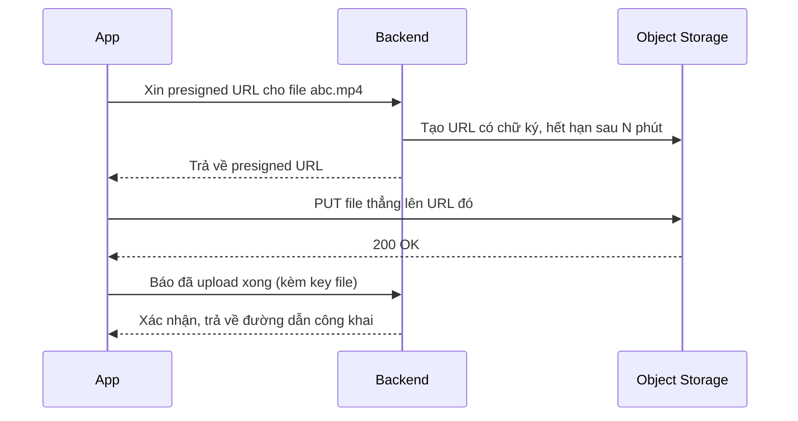
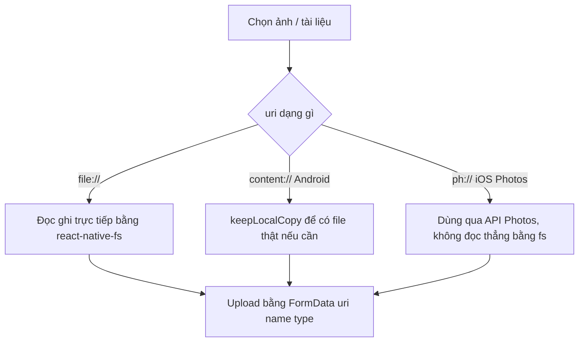

# Media & File: ảnh, video, tài liệu, upload/download

Gần như mọi app di động đều cần xử lý **media** (ảnh, video) và **file** (PDF, docx, excel...): chọn từ thư viện, chụp mới, hiển thị, gửi lên server (**upload**), tải về máy (**download**), lưu lại để xem offline, rồi chia sẻ sang app khác. Mỗi bước lại đụng một thư viện riêng vì React Native (RN) không có API built-in đủ mạnh cho việc này — ảnh cần cache thông minh, video cần player native, file cần đọc/ghi hệ thống file thật của hệ điều hành.

**Tương tự đơn giản:** Coi app như một **bưu cục**. Người dùng mang đồ đến (chọn ảnh/file), bưu cục đóng gói đúng chuẩn (multipart/form-data) rồi gửi đi (upload); khi có đồ gửi đến, bưu cục tải về, cất vào kho tạm (cache thư mục local) để lần sau khỏi tải lại, và có thể đưa cho người khác xem hoặc mang đi (share/view).

---

:::note[Ghi nhớ nhanh]

- ⭐ **Upload multipart luôn dùng `{ uri, name, type }`** trong `FormData` — **KHÔNG** tự set header `Content-Type: multipart/form-data`, vì thiếu `boundary` sẽ khiến server từ chối request.
- ⭐ **URI khác nhau theo nguồn**: `file://` (file local), `content://` (Android, có thể không đọc được trực tiếp bằng thư viện native), `ph://` (iOS Photos asset). Nhầm loại URI là lỗi hay gặp nhất.
- **`react-native-fs`** quản lý đường dẫn thư mục (`DocumentDirectoryPath`, `CachesDirectoryPath`) và tải file có tiến độ (`downloadFile`).
- **`react-native-blob-util`** mạnh về multipart upload có tiến độ và tải file lớn bằng `config({ fileCache, path })`.
- File tải về nên có **cache theo tên xác định** (derive từ URL) để mở lại không tải lại, và phải có cơ chế **dọn cache** để không phình dung lượng máy.

:::

---

## Mục lục

- [Vì sao cần bộ công cụ Media & File riêng?](#vì-sao-cần-bộ-công-cụ-media--file-riêng)
- [1. Chọn ảnh và quay ảnh với Image Picker](#1-chọn-ảnh-và-quay-ảnh-với-image-picker)
- [2. Chọn tài liệu với Document Picker](#2-chọn-tài-liệu-với-document-picker)
- [3. Lưu ảnh vào thư viện với Camera Roll](#3-lưu-ảnh-vào-thư-viện-với-camera-roll)
- [4. Hệ thống file với React Native FS](#4-hệ-thống-file-với-react-native-fs)
- [5. Upload multipart và tải xuống với Blob Util](#5-upload-multipart-và-tải-xuống-với-blob-util)
- [6. Upload file lớn: chunk, resumable và presigned URL](#6-upload-file-lớn-chunk-resumable-và-presigned-url)
- [7. Hiển thị ảnh: Image và Fast Image](#7-hiển-thị-ảnh-image-và-fast-image)
- [8. Video và thumbnail](#8-video-và-thumbnail)
- [9. Xem file và chia sẻ file](#9-xem-file-và-chia-sẻ-file)
- [10. Nén và resize ảnh](#10-nén-và-resize-ảnh)
- [11. URI scheme khác nhau giữa các nền tảng](#11-uri-scheme-khác-nhau-giữa-các-nền-tảng)
- [12. Quyền truy cập, bộ nhớ và MIME type](#12-quyền-truy-cập-bộ-nhớ-và-mime-type)
- [Khi nào dùng?](#khi-nào-dùng)
- [Lỗi thường gặp](#lỗi-thường-gặp)
- [Câu hỏi phỏng vấn](#câu-hỏi-phỏng-vấn)

---

## Vì sao cần bộ công cụ Media & File riêng?

**Vấn đề:** RN core chỉ có component `Image` để hiển thị ảnh và `fetch`/`XMLHttpRequest` để gọi mạng. Không có API built-in nào để: mở camera, mở thư viện ảnh, mở dialog chọn file PDF/docx, đọc/ghi file vào bộ nhớ trong của app, hay phát video có control. Nếu cố tự viết bằng `fetch` thuần, sẽ thiếu tiến độ upload/download, không biết thư mục nào an toàn để ghi, và ảnh lớn tải trực tiếp bằng `Image` sẽ ngốn RAM vì không có cache đĩa.

```jsx
// Không có API chọn ảnh built-in -> phải tự viết cầu nối native (rất tốn công)
// và fetch() thuần không cho biết % tiến độ khi upload file nặng
fetch(uploadUrl, { method: 'POST', body: hugeFileBlob })
  .then(res => res.json()); // im lặng cho tới khi xong hẳn, không có progress
```

**Giải pháp:** Cộng đồng RN có một bộ thư viện chuyên trách cho từng việc: `react-native-image-picker` (chọn/chụp ảnh), `@react-native-documents/picker` (chọn file bất kỳ), `react-native-fs` / `react-native-blob-util` (đọc ghi file, upload/download có tiến độ), `react-native-fast-image` (hiển thị ảnh có cache đĩa), `react-native-video` (phát video native). Mỗi thư viện bọc API native (iOS/Android) qua một interface JS thống nhất.

```tsx
import { launchImageLibrary } from 'react-native-image-picker';

const result = await launchImageLibrary({
  mediaType: 'photo',
  selectionLimit: 1,
  quality: 0.8,
});
const asset = result.assets?.[0];
// asset.uri, asset.fileName, asset.type, asset.fileSize đã sẵn sàng để upload
```

:::tip[Dùng thực tế]

- **Chat app**: chọn ảnh/video/file từ thư viện hoặc chụp mới, gửi kèm tin nhắn, hiển thị lại bằng ảnh cache và video player.
- **App hồ sơ/CV**: chọn file PDF/docx, upload lên server, cho phép mở lại bằng app hệ thống (`FileViewer.open`).
- **Avatar người dùng**: chụp/chọn ảnh, crop vuông, resize nhỏ trước khi upload để tiết kiệm băng thông.
- **Tải tài liệu về xem offline**: tải file về thư mục cache, mở bằng viewer, dọn cache định kỳ.

:::

---

## 1. Chọn ảnh và quay ảnh với Image Picker

**`react-native-image-picker`** (bản 8.x) cho hai hàm chính: `launchImageLibrary` (mở thư viện ảnh/video) và `launchCamera` (mở camera chụp/quay trực tiếp).

```bash
npm install react-native-image-picker
```

```tsx
import { launchImageLibrary, launchCamera } from 'react-native-image-picker';
import type { Asset, ImagePickerResponse } from 'react-native-image-picker';

async function pickFromLibrary(): Promise<Asset[]> {
  const response: ImagePickerResponse = await launchImageLibrary({
    mediaType: 'photo',        // 'photo' | 'video' | 'mixed'
    selectionLimit: 5,         // 0 = không giới hạn (chọn nhiều)
    quality: 0.8,               // 0..1, chỉ áp dụng cho ảnh
    includeBase64: false,       // false để nhẹ, chỉ bật khi thật sự cần base64
  });

  if (response.didCancel) return [];
  if (response.errorCode) {
    // 'camera_unavailable' | 'permission' | 'others'
    console.warn('Image picker error:', response.errorMessage);
    return [];
  }
  return response.assets ?? [];
}

async function takePhoto(): Promise<Asset | undefined> {
  const response = await launchCamera({
    mediaType: 'photo',
    cameraType: 'back',        // 'back' | 'front'
    saveToPhotos: true,        // tự lưu vào thư viện ảnh sau khi chụp
  });
  return response.assets?.[0];
}
```

### Đọc thông tin `Asset`

Mỗi phần tử trong `assets` mang đủ thông tin để hiển thị preview và upload luôn, không cần đọc file lại:

```ts
type PickedAsset = {
  uri?: string;        // đường dẫn local để hiển thị / upload
  fileName?: string;   // tên file gốc, ví dụ "IMG_0012.jpg"
  type?: string;        // MIME type, ví dụ "image/jpeg"
  fileSize?: number;    // dung lượng byte
  width?: number;
  height?: number;
  duration?: number;    // giây, chỉ có khi mediaType là video
};
```

```tsx
const assets = await pickFromLibrary();
for (const a of assets) {
  const uri = a.uri ?? '';
  const name = a.fileName ?? 'unnamed';
  const type = a.type ?? 'application/octet-stream';
  const size = a.fileSize ?? 0;
  // Chặn sớm nếu vượt trần dung lượng, tránh gửi request rồi mới bị server từ chối
  if (size > 20 * 1024 * 1024) {
    console.warn(`${name} quá lớn (${size} bytes)`);
    continue;
  }
  await uploadOne({ uri, name, type });
}
```

Ghi chú quan trọng: `selectionLimit: 1` (mặc định) chỉ cho chọn 1 ảnh; đặt lớn hơn 1 hoặc `0` (không giới hạn) để cho chọn nhiều cùng lúc. `videoQuality` chỉ áp dụng khi quay video bằng camera.

---

## 2. Chọn tài liệu với Document Picker

**`@react-native-documents/picker`** (bản 12.x) mở dialog chọn file hệ thống (PDF, Word, Excel, zip...). Hàm chính là `pick()`.

```bash
npm install @react-native-documents/picker
```

```tsx
import { pick, types, errorCodes, isErrorWithCode } from '@react-native-documents/picker';

async function pickDocument() {
  try {
    const [result] = await pick({
      type: [types.pdf, types.docx, types.images],
      allowMultiSelection: false,
    });
    // result.uri, result.name, result.size, result.type đã có sẵn
    return result;
  } catch (err) {
    if (isErrorWithCode(err) && err.code === errorCodes.OPERATION_CANCELED) {
      return null; // người dùng bấm Huỷ, không phải lỗi thật
    }
    throw err;
  }
}
```

`types` là danh sách MIME/UTI dựng sẵn (`types.pdf`, `types.docx`, `types.images`, `types.allFiles`...), tự map sang định dạng đúng cho từng nền tảng. Có thể truyền thêm chuỗi MIME tuỳ ý trong mảng `type`.

### `DocumentPickerResponse`

```ts
type PickedDoc = {
  uri: string;                 // content:// (Android) hoặc file:// (iOS)
  name: string | null;
  size: number | null;
  type: string | null;         // MIME type
  isVirtual: boolean | null;   // Android: file ảo (Google Docs/Sheets)
};
```

### `keepLocalCopy` — khi cần một file thật trên đĩa

Trên Android, `uri` trả về là `content://` — nhiều thao tác (upload qua thư viện native khác, đọc bằng `react-native-fs`) cần một đường dẫn file thật. `keepLocalCopy` sao chép nội dung đó vào thư mục app:

```ts
import { keepLocalCopy } from '@react-native-documents/picker';

const [copy] = await keepLocalCopy({
  files: [{ uri: doc.uri, fileName: doc.name ?? 'file' }],
  destination: 'cachesDirectory', // hoặc 'documentDirectory'
});
// copy.status === 'success' -> copy.localUri là file:// dùng được ngay
```

Với nhu cầu đơn giản như upload qua `fetch`/`FormData`, thường **không cần** gọi `keepLocalCopy` — `fetch` trên RN đọc được cả `content://` lẫn `file://`.

---

## 3. Lưu ảnh vào thư viện với Camera Roll

**`@react-native-camera-roll/camera-roll`** (bản 7.x) dùng để lưu ảnh/video đã tải về hoặc đã xử lý vào Thư viện ảnh của máy (Photos trên iOS, Gallery trên Android).

```bash
npm install @react-native-camera-roll/camera-roll
```

```ts
import { CameraRoll } from '@react-native-camera-roll/camera-roll';

async function saveImageToGallery(localUri: string): Promise<boolean> {
  try {
    await CameraRoll.saveAsset(localUri, { type: 'photo' });
    return true;
  } catch (err) {
    // Lỗi phổ biến nhất: người dùng từ chối quyền truy cập thư viện ảnh
    console.warn('Lưu ảnh thất bại:', err);
    return false;
  }
}
```

`saveAsset(tag, options)` thay thế cho `save()` (đã deprecated). `options.type` nhận `'photo' | 'video' | 'auto'` (`'auto'` tự đoán theo phần đuôi file); `options.album` cho phép lưu vào album riêng thay vì thư viện chung.

Trên iOS cần khai báo `NSPhotoLibraryAddUsageDescription` trong `Info.plist`; trên Android (API 29+) không cần quyền `WRITE_EXTERNAL_STORAGE` cho việc lưu ảnh của chính app vào bộ sưu tập công khai.

---

## 4. Hệ thống file với React Native FS

**`react-native-fs`** cho phép đọc/ghi file trực tiếp trên đĩa — là nền tảng để cache file đã tải, dọn dẹp dung lượng, hoặc kiểm tra file đã tồn tại chưa trước khi tải lại.

```bash
npm install react-native-fs
```

### Thư mục chuẩn

```ts
import RNFS from 'react-native-fs';

RNFS.DocumentDirectoryPath; // lưu lâu dài, được backup, phù hợp file người dùng cần giữ
RNFS.CachesDirectoryPath;   // hệ điều hành có thể tự xoá khi thiếu dung lượng — hợp cho cache tạm
```

Quy tắc chọn: file quan trọng (đã upload, cần giữ để mở lại) đặt ở `DocumentDirectoryPath`; file tạm để hiển thị nhanh (thumbnail, bản sao để share) đặt ở `CachesDirectoryPath`.

### Kiểm tra tồn tại, xoá file

```ts
const localPath = `${RNFS.DocumentDirectoryPath}/downloads/report.pdf`;

const already = await RNFS.exists(localPath);
if (!already) {
  await RNFS.mkdir(`${RNFS.DocumentDirectoryPath}/downloads`);
  // ... tải file về localPath
}

await RNFS.unlink(localPath); // xoá khi không cần nữa
```

### Tải file có tiến độ

```ts
function downloadWithProgress(
  fromUrl: string,
  toFile: string,
  onProgress: (fraction: number) => void,
) {
  const { promise } = RNFS.downloadFile({
    fromUrl,
    toFile,
    progressInterval: 150, // ms, ổn định trên cả 2 nền tảng hơn progressDivider
    begin: () => onProgress(0.01),
    progress: (res) => {
      if (res.contentLength > 0) {
        onProgress(Math.min(1, res.bytesWritten / res.contentLength));
      }
    },
  });
  return promise; // resolve { statusCode, bytesWritten }
}
```

Chú ý `progressDivider` (bắn theo % nguyên) kém tin cậy khi server dùng chunked transfer (không có `Content-Length` ngay từ đầu) — ưu tiên `progressInterval` cho trường hợp chung.

---

## 5. Upload multipart và tải xuống với Blob Util

**`react-native-blob-util`** (bản 0.2x) mạnh hơn `fetch` thuần ở hai việc: upload multipart có tiến độ, và tải file lớn thẳng ra đĩa (không giữ toàn bộ trong RAM).

```bash
npm install react-native-blob-util
```

### Upload multipart bằng `fetch`/`FormData` (đơn giản, đủ dùng cho phần lớn trường hợp)

```ts
async function uploadFile(uri: string, name: string, type: string) {
  const form = new FormData();
  // Trên RN, phần tử file trong FormData là object { uri, name, type }
  // KHÔNG phải Blob như trên web
  form.append('file', { uri, name, type } as unknown as Blob);

  const res = await fetch('https://api.example.com/upload', {
    method: 'POST',
    body: form,
    // Cố ý KHÔNG set 'Content-Type': đặt tay sẽ mất boundary multipart
    // và server sẽ không parse được form-data
  });
  if (!res.ok) throw new Error(`Upload failed: ${res.status}`);
  return res.json();
}
```

### Upload có tiến độ bằng `react-native-blob-util`

```ts
import ReactNativeBlobUtil from 'react-native-blob-util';

function uploadWithProgress(
  uri: string,
  name: string,
  type: string,
  onProgress: (sent: number, total: number) => void,
) {
  return ReactNativeBlobUtil
    .fetch(
      'POST',
      'https://api.example.com/upload',
      { 'Content-Type': 'multipart/form-data' },
      [{ name: 'file', filename: name, type, data: ReactNativeBlobUtil.wrap(uri) }],
    )
    .uploadProgress((sent, total) => onProgress(sent, total))
    .then((res) => res.json());
}
```

`ReactNativeBlobUtil.wrap(uri)` đánh dấu chuỗi là đường dẫn file để thư viện tự đọc nội dung thay vì gửi chuỗi văn bản.

### Tải file lớn ra thẳng đĩa

```ts
function downloadToCache(url: string, fileName: string) {
  const path = `${ReactNativeBlobUtil.fs.dirs.CacheDir}/${fileName}`;
  return ReactNativeBlobUtil
    .config({ fileCache: true, path })
    .fetch('GET', url)
    .progress((received, total) => {
      console.log(`Đã tải ${received}/${total}`);
    });
}
```

Trên Android còn có tuỳ chọn giao việc tải xuống hẳn cho hệ điều hành qua `addAndroidDownloads` / `useDownloadManager: true` trong `config(...)` — hữu ích cho file rất lớn cần tải nền, có thông báo tiến độ hệ thống, không phụ thuộc vòng đời app đang mở hay đóng.

---

## 6. Upload file lớn: chunk, resumable và presigned URL

Với file rất lớn (video vài trăm MB), gửi một request duy nhất dễ timeout hoặc phải tải lại từ đầu nếu mất mạng giữa chừng. Có hai kỹ thuật hay dùng — cả hai đều là **khái niệm kiến trúc**, cần backend hỗ trợ tương ứng chứ không phải API có sẵn trong một thư viện RN duy nhất.

### Chunk upload / resumable upload

Ý tưởng: chia file thành nhiều phần (chunk) cố định kích thước (ví dụ 5MB/phần), upload từng phần kèm số thứ tự, server ghép lại khi đủ. Nếu một phần thất bại, chỉ gửi lại đúng phần đó thay vì toàn bộ file.

```ts
async function uploadInChunks(
  localPath: string,
  totalSize: number,
  chunkSize = 5 * 1024 * 1024,
) {
  const totalChunks = Math.ceil(totalSize / chunkSize);
  for (let index = 0; index < totalChunks; index += 1) {
    const start = index * chunkSize;
    const end = Math.min(start + chunkSize, totalSize);
    // Đọc đúng đoạn [start, end) từ file rồi upload kèm metadata
    await uploadChunk({ localPath, start, end, index, totalChunks });
  }
  // Gọi endpoint "hoàn tất" để server ghép các phần lại
  await notifyUploadComplete(localPath);
}
```

Muốn **resumable** thực sự (tiếp tục sau khi tắt app), cần lưu lại chunk nào đã gửi thành công (ví dụ vào một file trạng thái local hoặc hỏi server "đã nhận tới đâu") rồi chỉ gửi tiếp phần còn thiếu.

### Presigned URL (thường dùng với Amazon S3 hoặc tương đương)

Thay vì file đi qua backend rồi backend mới đẩy lên kho lưu trữ, client upload **thẳng** lên kho lưu trữ bằng một URL có chữ ký tạm thời (presigned URL) do backend cấp — giảm tải cho backend, tận dụng băng thông trực tiếp tới hạ tầng lưu trữ.



```ts
async function uploadViaPresignedUrl(localUri: string, fileName: string, type: string) {
  const { uploadUrl, publicUrl } = await requestPresignedUrl(fileName, type);
  const fileBlob = await (await fetch(localUri)).blob();
  await fetch(uploadUrl, { method: 'PUT', body: fileBlob, headers: { 'Content-Type': type } });
  await confirmUploadDone(fileName);
  return publicUrl;
}
```

---

## 7. Hiển thị ảnh: Image và Fast Image

`Image` built-in của RN dùng được cho ảnh nhỏ, số lượng ít. Với danh sách ảnh dài (chat, gallery), `Image` không có cache đĩa mạnh và dễ load lại từ mạng mỗi lần re-render — nên đổi sang **`react-native-fast-image`** (bản 8.x), dùng cache native (SDWebImage/Glide).

```tsx
import { Image } from 'react-native';
import FastImage from 'react-native-fast-image';

// Ảnh đơn giản, ít khi thay đổi, số lượng nhỏ
<Image source={{ uri: avatarUrl }} style={{ width: 40, height: 40 }} />

// Danh sách ảnh nhiều, cần cache đĩa + ưu tiên tải
<FastImage
  style={{ width: 200, height: 200 }}
  source={{
    uri: photoUrl,
    priority: FastImage.priority.normal,   // 'low' | 'normal' | 'high'
    cache: FastImage.cacheControl.immutable, // ảnh không đổi nội dung theo URL -> cache mạnh
  }}
  resizeMode={FastImage.resizeMode.cover}
/>
```

`FastImage.preload([{ uri: url1 }, { uri: url2 }])` cho phép tải trước ảnh sắp hiển thị (ví dụ ảnh kế tiếp trong carousel). `FastImage.clearMemoryCache()` và `FastImage.clearDiskCache()` dùng khi cần chủ động dọn cache ảnh (ví dụ khi đăng xuất).

---

## 8. Video và thumbnail

**`react-native-video`** (bản 6.x) là player video native, hỗ trợ local file lẫn stream từ URL.

```tsx
import Video from 'react-native-video';
import { useRef, useState } from 'react';

function VideoPlayer({ uri }: { uri: string }) {
  const ref = useRef(null);
  const [paused, setPaused] = useState(true);

  return (
    <Video
      ref={ref}
      source={{ uri }}
      style={{ width: '100%', aspectRatio: 16 / 9 }}
      paused={paused}
      controls               // hiện thanh điều khiển mặc định của hệ điều hành
      resizeMode="contain"
      onProgress={(data) => {
        // data.currentTime tính bằng giây, bắn định kỳ trong lúc phát
      }}
      onEnd={() => setPaused(true)}
      fullscreen={false}
    />
  );
}
```

### Tạo thumbnail cho video

Trước khi tải/phát video, thường cần một ảnh đại diện để hiển thị trong danh sách — **`react-native-create-thumbnail`** trích một khung hình từ video (local hoặc URL) ra file ảnh.

```ts
import { createThumbnail } from 'react-native-create-thumbnail';

async function makeVideoThumbnail(videoUrl: string) {
  const thumb = await createThumbnail({
    url: videoUrl,
    timeStamp: 1000, // mili-giây, lấy khung hình tại giây thứ 1
  });
  return thumb.path; // đường dẫn ảnh jpeg/png đã tạo, dùng cho Image/FastImage
}
```

---

## 9. Xem file và chia sẻ file

Với file không phải ảnh/video (PDF, docx...), cách phổ biến nhất là giao lại cho **app hệ thống** đã cài trên máy mở thay vì tự vẽ giao diện xem file.

### Mở file bằng app hệ thống

```ts
import FileViewer from 'react-native-file-viewer';

async function openDownloadedFile(localPath: string) {
  try {
    await FileViewer.open(localPath, { showOpenWithDialog: true });
  } catch (err) {
    // Thường gặp khi máy không có app nào hỗ trợ định dạng đó
    console.warn('Không mở được file:', err);
  }
}
```

`localPath` phải là đường dẫn file **thật trên đĩa** (`file://` hoặc đường dẫn tuyệt đối) — nếu đang có `content://` từ document picker, cần `keepLocalCopy` hoặc tải về trước bằng `react-native-fs`.

### Chia sẻ ra app khác

```ts
import Share from 'react-native-share';

async function shareFile(localPath: string, mimeType: string) {
  try {
    await Share.open({ url: localPath, type: mimeType });
  } catch (err) {
    // Người dùng bấm Huỷ trên sheet chia sẻ cũng đi vào catch — không phải lỗi thật
  }
}
```

Trên Android, `react-native-share` có thể không đọc được URI nằm dưới `DocumentDirectoryPath` — cách an toàn là sao chép file cần chia sẻ sang một thư mục cache riêng trước khi gọi `Share.open`.

---

## 10. Nén và resize ảnh

Trước khi upload, nên resize/nén ảnh để giảm dung lượng và thời gian chờ. **`@react-native-community/image-editor`** cung cấp `cropImage` — vừa crop vừa scale lại kích thước hiển thị.

```ts
import ImageEditor from '@react-native-community/image-editor';

async function resizeForUpload(uri: string, width: number, height: number) {
  const result = await ImageEditor.cropImage(uri, {
    offset: { x: 0, y: 0 },
    size: { width, height },          // vùng crop tính theo ảnh gốc
    displaySize: { width: 1024, height: Math.round((1024 * height) / width) }, // scale xuống
    quality: 0.8,
    format: 'jpeg',
  });
  return result.uri; // ảnh mới đã resize, nằm trong thư mục cache
}
```

Nếu chỉ cần "giảm quality" mà không crop, đơn giản hơn là dùng luôn tuỳ chọn `quality` sẵn có của `launchImageLibrary`/`launchCamera` (mục 1) — tránh phải xử lý thêm một bước riêng.

---

## 11. URI scheme khác nhau giữa các nền tảng

Một lỗi rất hay gặp: coi mọi `uri` trả về từ các thư viện trên là giống nhau. Thực tế có ba dạng phổ biến:

| Scheme | Nền tảng | Ý nghĩa |
|---|---|---|
| `file://` | iOS, Android | Đường dẫn file thật trên đĩa — đọc/ghi trực tiếp được bằng `react-native-fs`. |
| `content://` | Android | URI trỏ tới nội dung do content provider quản lý (Google Drive, Files app...) — không phải đường dẫn file vật lý; một số thư viện native cần "xuất" ra file thật trước khi dùng (`keepLocalCopy`). |
| `ph://` | iOS | URI asset trong thư viện ảnh (Photos) — chỉ dùng được qua các API dành riêng cho Photos, không đọc trực tiếp bằng `react-native-fs`. |



`fetch`/`FormData` (mục 5) thường đọc được cả ba dạng vì RN tự phân giải ở tầng native khi build multipart — nhưng các thao tác cấp thấp hơn (copy file, đọc byte trực tiếp bằng `react-native-fs`) thì không phải lúc nào cũng làm được với `content://` hay `ph://`.

---

## 12. Quyền truy cập, bộ nhớ và MIME type

### Quyền truy cập

Phần lớn thư viện ở trên (`image-picker`, `camera-roll`) tự hiện dialog xin quyền hệ điều hành khi gọi hàm tương ứng — không cần code xin quyền thủ công cho trường hợp cơ bản. Tuy vậy vẫn cần khai báo đúng key mô tả quyền:

- iOS (`Info.plist`): `NSCameraUsageDescription`, `NSPhotoLibraryUsageDescription`, `NSPhotoLibraryAddUsageDescription`, `NSMicrophoneUsageDescription` (nếu quay video có tiếng).
- Android (`AndroidManifest.xml`): `CAMERA`; từ Android 13 việc chọn ảnh qua photo picker hệ thống không còn cần khai quyền storage truyền thống.

Luôn kiểm tra nhánh lỗi `errorCode === 'permission'` (image-picker) hoặc lỗi bị bắt (camera-roll) để hiện thông báo hướng dẫn người dùng vào Cài đặt bật quyền, thay vì im lặng thất bại.

### Bộ nhớ và dọn cache

File tải về nên đặt tên **xác định** dựa trên URL/ID gốc (không phải tên ngẫu nhiên mỗi lần), để lần sau kiểm tra `RNFS.exists(path)` là biết đã có sẵn, khỏi tải lại. Vì thư mục cache (`CachesDirectoryPath`) có thể bị hệ điều hành tự xoá khi máy thiếu dung lượng, app không nên coi đây là nơi lưu trữ lâu dài — chỉ hợp cho dữ liệu tải lại được.

```ts
async function clearMediaCache(cacheRoot: string) {
  const exists = await RNFS.exists(cacheRoot);
  if (exists) await RNFS.unlink(cacheRoot); // xoá cả thư mục
  // Lần dùng tiếp theo mkdir lại là đủ, không cần khởi tạo trước
}
```

Nên có màn hình "Xoá dữ liệu tạm" cho người dùng chủ động dọn, và gọi hàm dọn tương tự khi đăng xuất để không để lại dữ liệu của phiên trước.

### MIME type

`type`/`mimeType` trả về từ picker không phải lúc nào cũng đáng tin (một số content provider Android trả `null` hoặc giá trị chung chung). Chiến lược thực tế: ưu tiên MIME server trả về sau khi upload; nếu chưa có, suy ra từ phần đuôi file (`.pdf` → `application/pdf`, `.jpg`/`.jpeg` → `image/jpeg`...); chỉ khi cả hai đều thiếu mới dùng mặc định `application/octet-stream`.

---

## Khi nào dùng?

| Nhu cầu | Thư viện phù hợp |
|---|---|
| Chọn ảnh/video từ thư viện, chụp ảnh mới | `react-native-image-picker` |
| Chọn file bất kỳ (PDF, docx, zip...) | `@react-native-documents/picker` |
| Lưu ảnh đã tải/xử lý vào thư viện ảnh máy | `@react-native-camera-roll/camera-roll` |
| Quản lý thư mục, đọc/ghi file, tải file có tiến độ đơn giản | `react-native-fs` |
| Upload multipart có tiến độ, tải file lớn ra đĩa, tích hợp DownloadManager Android | `react-native-blob-util` |
| Hiển thị ảnh số lượng lớn, cần cache đĩa mạnh | `react-native-fast-image` |
| Phát video có control, xử lý sự kiện tiến độ | `react-native-video` |
| Ảnh đại diện cho video trong danh sách | `react-native-create-thumbnail` |
| Mở file bằng app hệ thống đã cài | `react-native-file-viewer` |
| Chia sẻ file/ảnh sang app khác | `react-native-share` |
| Crop/resize ảnh trước khi upload | `@react-native-community/image-editor` |
| File rất lớn, mạng không ổn định | Chunk upload / resumable upload |
| Giảm tải cho backend khi upload lên cloud storage | Presigned URL |

**Best practice:**

- Luôn kiểm tra dung lượng file (`fileSize`/`size`) **trước** khi upload, đừng để server là nơi phát hiện đầu tiên.
- Resize/nén ảnh trước khi gửi lên nếu ứng dụng không cần ảnh gốc chất lượng cao.
- Đặt tên file cache theo ID/URL xác định để tận dụng lại, tránh tải trùng.
- Luôn xử lý nhánh "người dùng huỷ" (`didCancel`, `OPERATION_CANCELED`, catch của `Share.open`) riêng biệt với lỗi thật.

---

## Lỗi thường gặp

| Lỗi | Nguyên nhân | Cách sửa |
|---|---|---|
| Server trả lỗi 400/415 khi upload | Tự set header `Content-Type: multipart/form-data` khi dùng `fetch`, làm mất `boundary` | Không set `Content-Type` thủ công; để `fetch` tự sinh boundary từ `FormData` |
| Không mở được file vừa tải về | Đường dẫn còn là `content://` thay vì file thật, hoặc file chưa tải xong | Dùng `keepLocalCopy`/tải qua `react-native-fs` trước, chỉ mở khi promise tải đã resolve |
| Chia sẻ file trên Android báo lỗi hoặc không thấy file | `react-native-share` không đọc được URI dưới `DocumentDirectoryPath` | Copy file sang thư mục cache riêng rồi mới gọi `Share.open` |
| Ảnh danh sách dài load chậm, giật khi cuộn | Dùng `Image` built-in cho danh sách lớn, không có cache đĩa | Chuyển sang `react-native-fast-image` với `cache: immutable` |
| Upload video lớn bị timeout, treo mãi không báo lỗi | `fetch` trên RN không có timeout mặc định | Dùng `XMLHttpRequest`/`react-native-blob-util` với theo dõi tiến độ, tự huỷ khi không có byte mới trong một khoảng thời gian |
| Dung lượng máy đầy dần theo thời gian dùng app | Không dọn `CachesDirectoryPath`/`DocumentDirectoryPath` định kỳ | Có màn hình dọn cache thủ công, và tự dọn khi đăng xuất |
| Xin quyền camera/thư viện ảnh nhưng không hiểu tại sao bị từ chối im lặng | Thiếu khai báo mô tả quyền trong `Info.plist`/`AndroidManifest.xml` | Khai đủ `NSCameraUsageDescription`, `NSPhotoLibraryUsageDescription`... và test trên máy thật |

---

## Câu hỏi phỏng vấn

Những câu thường gặp về chủ đề này. Tự trả lời trước, rồi bấm **Xem đáp án** để đối chiếu.

**1. Vì sao khi upload multipart bằng `fetch` không nên tự set header `Content-Type`?**

<details className="qa">
<summary>Xem đáp án</summary>

`multipart/form-data` cần một `boundary` (chuỗi phân tách các phần trong body) do runtime tự sinh dựa trên nội dung `FormData`. Nếu tự set `Content-Type` thủ công, giá trị đó thường thiếu `boundary`, khiến server không parse được các phần trong request và trả lỗi 400/415. Cứ để `fetch`/`XMLHttpRequest` tự thêm header khi thấy body là `FormData`.

</details>

**2. Phần tử file trong `FormData` trên React Native có gì khác so với trên web?**

<details className="qa">
<summary>Xem đáp án</summary>

Trên web, `FormData` nhận `Blob`/`File` thật. Trên RN, không có `Blob` đọc từ input như vậy — thay vào đó truyền một object mô tả `{ uri, name, type }`, RN tự đọc nội dung file tại `uri` đó khi build request ở tầng native.

</details>

**3. `content://`, `file://`, `ph://` khác nhau thế nào?**

<details className="qa">
<summary>Xem đáp án</summary>

- `file://`: đường dẫn file thật trên đĩa, đọc/ghi trực tiếp được.
- `content://` (Android): URI trỏ tới content provider (có thể là Google Drive, Files app...), không phải file vật lý cố định — một số thao tác cần "xuất" ra file thật trước (`keepLocalCopy`).
- `ph://` (iOS): URI asset trong thư viện ảnh Photos, chỉ truy cập được qua API dành riêng cho Photos.

</details>

**4. Tại sao nên dùng `react-native-fast-image` thay vì `Image` cho danh sách ảnh dài?**

<details className="qa">
<summary>Xem đáp án</summary>

`Image` built-in không có cơ chế cache đĩa mạnh và ổn định giữa các nền tảng, dễ tải lại ảnh từ mạng khi re-render hoặc cuộn qua cuộn lại. `react-native-fast-image` dùng thư viện cache ảnh native (SDWebImage/Glide), hỗ trợ `priority` để ưu tiên tải, và `cache: 'immutable'` cho ảnh có URL không đổi nội dung.

</details>

**5. Resumable upload nghĩa là gì, và vì sao cần chia chunk?**

<details className="qa">
<summary>Xem đáp án</summary>

Resumable upload là khả năng tiếp tục một lượt tải lên dang dở thay vì gửi lại từ đầu khi bị gián đoạn (mất mạng, tắt app). Chia file thành các chunk nhỏ giúp: (1) mỗi request nhỏ hơn, ít khả năng timeout hơn; (2) khi một phần thất bại chỉ cần gửi lại đúng phần đó; (3) server có thể theo dõi tiến độ ghép file theo từng chunk đã nhận.

</details>

**6. Presigned URL là gì và giải quyết vấn đề gì?**

<details className="qa">
<summary>Xem đáp án</summary>

Presigned URL là một URL có chữ ký tạm thời, cho phép client upload/tải file **thẳng** tới nơi lưu trữ (ví dụ object storage) mà không cần đi qua backend như một trạm trung chuyển. Backend chỉ cấp URL đó (kèm quyền và thời hạn), còn dữ liệu file đi thẳng client-storage — giảm tải băng thông và CPU cho backend, đặc biệt quan trọng với file lớn.

</details>

**7. Vì sao cần thư mục cache riêng (`CachesDirectoryPath`) thay vì chỉ dùng `DocumentDirectoryPath`?**

<details className="qa">
<summary>Xem đáp án</summary>

`CachesDirectoryPath` là nơi hệ điều hành được phép tự xoá bớt khi máy thiếu dung lượng — phù hợp cho dữ liệu có thể tải lại (ảnh cache, file tạm để share). `DocumentDirectoryPath` bền hơn (được backup, không bị hệ điều hành tự xoá) — dùng cho dữ liệu người dùng cần giữ chắc chắn, như file đã tải về để xem offline lâu dài.

</details>

**8. Vì sao gọi `Share.open` hoặc `launchImageLibrary` xong thấy "lỗi" khi người dùng chỉ bấm Huỷ?**

<details className="qa">
<summary>Xem đáp án</summary>

Nhiều API dạng dialog hệ thống coi việc người dùng bấm Huỷ là một nhánh phản hồi bình thường chứ không phải ngoại lệ thật: `launchImageLibrary` trả `didCancel: true`, document picker ném lỗi mã `OPERATION_CANCELED`, còn `Share.open` có thể reject promise khi người dùng đóng sheet chia sẻ. Cần phân biệt rõ nhánh này với lỗi thật (permission, network...) để tránh hiện thông báo lỗi sai cho người dùng.

</details>

**9. Vì sao nên kiểm tra dung lượng file ở client trước khi upload, thay vì để server kiểm tra?**

<details className="qa">
<summary>Xem đáp án</summary>

Kiểm tra sớm ở client tiết kiệm băng thông và thời gian chờ của người dùng — không mất công gửi cả trăm MB lên rồi mới nhận lỗi. Tuy nhiên kiểm tra client không thay thế được kiểm tra ở server: client có thể bị bỏ qua hoặc sai lệch, nên trần dung lượng vẫn phải được backend xác nhận lại.

</details>

**10. `react-native-fs` và `react-native-blob-util` khác nhau ở điểm nào, khi nào chọn cái nào?**

<details className="qa">
<summary>Xem đáp án</summary>

Cả hai đều thao tác được với hệ thống file, nhưng `react-native-fs` thiên về quản lý đường dẫn/thư mục và tải file đơn giản có tiến độ; `react-native-blob-util` mạnh hơn ở phần network — đặc biệt là upload multipart có theo dõi tiến độ chi tiết (`uploadProgress`) và tích hợp `DownloadManager` của Android cho tải file nền. Nhiều dự án dùng cả hai: `react-native-fs` cho quản lý file cục bộ, `react-native-blob-util` cho phần upload/download nặng.

</details>

**11. Vì sao ảnh chụp bằng camera đôi khi không xuất hiện trong thư viện ảnh dù chụp thành công?**

<details className="qa">
<summary>Xem đáp án</summary>

`launchCamera` mặc định chỉ trả về asset cho app dùng (upload, hiển thị) — không tự động lưu vào thư viện ảnh của máy trừ khi bật tuỳ chọn `saveToPhotos: true`. Nếu cần cả hai (dùng trong app và lưu vào Gallery/Photos), phải bật tuỳ chọn đó hoặc gọi thêm `CameraRoll.saveAsset` sau khi chụp.

</details>

**12. MIME type trả về từ picker không đáng tin ở trường hợp nào, và nên xử lý ra sao?**

<details className="qa">
<summary>Xem đáp án</summary>

Trên Android, một số content provider (đặc biệt các provider của bên thứ ba) không trả đúng MIME type, có thể trả `null` hoặc giá trị chung chung. Chiến lược an toàn: ưu tiên MIME server xác nhận sau khi nhận file; nếu chưa có, suy ra từ phần đuôi file; chỉ dùng `application/octet-stream` khi không còn cách nào khác để xác định.

</details>
