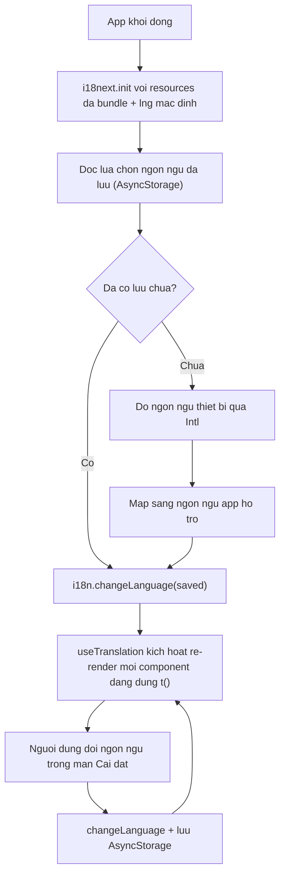

# Đa ngôn ngữ (i18n) với i18next

**i18n** (internationalization -- quốc tế hoá) là việc chuẩn bị app để có thể hiển thị nhiều ngôn ngữ: tách mọi chữ hiển thị ra khỏi code, hỗ trợ số nhiều, định dạng ngày/số/tiền tệ theo từng vùng. **l10n** (localization -- bản địa hoá) là bước sau đó: điền bản dịch thật cho một ngôn ngữ/vùng cụ thể. i18next là thư viện i18n phổ biến nhất cho JavaScript, còn `react-i18next` là lớp binding giúp dùng nó trong component React/React Native qua hook.

**Tương tự đơn giản:** i18n giống như **xây nhà có ổ cắm điện chuẩn quốc tế** -- chuẩn bị sẵn hạ tầng để cắm được phích cắm bất kỳ nước nào. l10n là **cắm đúng phích của từng nước** vào ổ đó.

---

:::note[Ghi nhớ nhanh]

- ⭐ **Không bao giờ hardcode chữ hiển thị trong JSX** -- mọi chữ người dùng đọc phải đi qua `t()`, kể cả khi app mới chỉ có 1 ngôn ngữ.
- ⭐ **`t()` phải được gọi bên trong component (qua `useTranslation`), không gọi ở cấp module** -- gọi ở module chỉ chạy một lần lúc nạp bundle, đổi ngôn ngữ xong chữ vẫn cũ vì component không có gì kích hoạt re-render.
- **`interpolation: { escapeValue: false }`** -- bắt buộc trên React Native vì không có DOM để lo XSS; để mặc định `true` sẽ làm hỏng dấu tiếng Việt khi nội suy.
- **Số nhiều dùng hậu tố `_one` / `_other`** theo chuẩn i18next v4 -- tiếng Việt chỉ có 1 dạng số nhiều (`_other`), tiếng Anh cần cả hai.
- **Kiểm tra Hermes có hỗ trợ đầy đủ `Intl` trước khi phụ thuộc vào `Intl.NumberFormat`/`Intl.DateTimeFormat`** -- một số cấu hình build tối giản bundle size có thể tắt bớt dữ liệu ICU.
- RTL (`I18nManager`) cần **restart app** để áp dụng, không đổi được ngay khi đang chạy.

:::

---

## Mục lục

- [Vì sao cần đa ngôn ngữ (i18n)?](#vì-sao-cần-đa-ngôn-ngữ-i18n)
- [1. Khái niệm i18n và l10n](#1-khái-niệm-i18n-và-l10n)
- [2. Cài đặt và khởi tạo i18next](#2-cài-đặt-và-khởi-tạo-i18next)
- [3. Tổ chức file dịch theo namespace hoặc feature](#3-tổ-chức-file-dịch-theo-namespace-hoặc-feature)
- [4. Hiển thị bản dịch với useTranslation và Trans](#4-hiển-thị-bản-dịch-với-usetranslation-và-trans)
- [5. Số nhiều và ngữ cảnh](#5-số-nhiều-và-ngữ-cảnh)
- [6. Lấy ngôn ngữ của thiết bị](#6-lấy-ngôn-ngữ-của-thiết-bị)
- [7. Đổi ngôn ngữ lúc chạy và lưu lựa chọn](#7-đổi-ngôn-ngữ-lúc-chạy-và-lưu-lựa-chọn)
- [8. Định dạng ngày giờ số và tiền tệ bằng Intl](#8-định-dạng-ngày-giờ-số-và-tiền-tệ-bằng-intl)
- [9. Chữ viết từ phải sang trái (RTL)](#9-chữ-viết-từ-phải-sang-trái-rtl)
- [10. Gõ kiểu TypeScript cho khoá dịch](#10-gõ-kiểu-typescript-cho-khoá-dịch)
- [11. Kiểm tra khoá thiếu và thừa trong CI](#11-kiểm-tra-khoá-thiếu-và-thừa-trong-ci)
- [12. Tải namespace theo nhu cầu (lazy load)](#12-tải-namespace-theo-nhu-cầu-lazy-load)
- [Khi nào dùng?](#khi-nào-dùng)
- [Lỗi thường gặp](#lỗi-thường-gặp)
- [Câu hỏi phỏng vấn](#câu-hỏi-phỏng-vấn)

---

## Vì sao cần đa ngôn ngữ (i18n)?

**Vấn đề:** Cách viết app "một ngôn ngữ" phổ biến nhất là gõ thẳng chữ vào JSX. Lúc đầu nhanh, nhưng khi cần thêm ngôn ngữ thứ hai thì phải lục lại **toàn bộ codebase**, và tệ hơn: không có cách nào biết chắc đã sửa hết hay chưa.

```tsx
// Cach cu -- chu hien thi nam thang trong code
function WelcomeScreen() {
  return (
    <View>
      <Text>Chao mung ban den voi ung dung</Text>
      <Pressable onPress={handleLogout}>
        <Text>Dang xuat</Text>
      </Pressable>
    </View>
  );
}
// Muon them tieng Anh: phai grep tung file, de sot la chuyen thuong xuyen
```

**Giải pháp:** i18next tách chữ ra file JSON/TS riêng theo khoá (key), component chỉ gọi `t('key')`. Đổi ngôn ngữ là đổi **một giá trị state trong instance i18next**, mọi component đang dùng `useTranslation` tự re-render với chữ mới -- không phải sửa JSX.

```tsx
// Cach moi -- component chi biet khoa, khong biet chu that
function WelcomeScreen() {
  const { t } = useTranslation();
  return (
    <View>
      <Text>{t('welcome.title')}</Text>
      <Pressable onPress={handleLogout}>
        <Text>{t('welcome.logout')}</Text>
      </Pressable>
    </View>
  );
}
```

:::tip[Dùng thực tế]

- **App bán hàng ra thị trường quốc tế**: một codebase, nhiều ngôn ngữ theo vùng cài đặt.
- **App nội bộ cần hỗ trợ cả nhân viên nói tiếng Việt lẫn tiếng Anh** cùng lúc.
- **Chuẩn bị trước cho tương lai**: dù chỉ ra mắt 1 ngôn ngữ, tách chữ ra `t()` từ đầu giúp sau này thêm ngôn ngữ mới không phải sửa lại UI.
- **Đồng bộ chữ với đội thiết kế/dịch thuật**: file JSON dịch có thể giao cho người không biết code chỉnh sửa.

:::

---

## 1. Khái niệm i18n và l10n

- **i18n (internationalization)**: công việc kỹ thuật -- thiết kế app để *có khả năng* đa ngôn ngữ. Bao gồm: tách chữ ra khỏi code, xử lý số nhiều đúng ngữ pháp từng ngôn ngữ, chừa chỗ cho chữ dài hơn/ngắn hơn, hỗ trợ chiều viết (LTR/RTL).
- **l10n (localization)**: công việc nội dung -- *điền* bản dịch, định dạng ngày/giờ/tiền tệ theo đúng vùng miền cụ thể (ví dụ `vi-VN` khác `en-US` khác `en-GB`).

Tên viết tắt theo quy ước đếm chữ cái ở giữa: `i18n` = "i" + 18 chữ + "n" (internationalizatio**n**), `l10n` = "l" + 10 chữ + "n" (localizatio**n**).

Trong bài này, **i18next** đảm nhận phần i18n (hạ tầng: khởi tạo, `t()`, số nhiều, đổi ngôn ngữ), còn phần l10n là các file JSON dịch (`vi.json`, `en.json`) cộng với `Intl` để format ngày/số/tiền tệ theo từng locale.

---

## 2. Cài đặt và khởi tạo i18next

```bash
npm install i18next react-i18next
```

Không cần thêm plugin phát hiện ngôn ngữ hay tải bản dịch qua mạng (`i18next-http-backend`) cho app mobile thông thường -- toàn bộ bản dịch đã đóng gói sẵn trong bundle JS, không cần tải lúc chạy.

```ts
// src/i18n/index.ts
import i18n from 'i18next';
import { initReactI18next } from 'react-i18next';

import en from './locales/en.json';
import vi from './locales/vi.json';

export const resources = {
  vi: { translation: vi },
  en: { translation: en },
} as const;

// Khoi tao dong bo ngay khi module duoc nap: t() phai dung duoc tu lan render
// dau tien, khong the cho mot Promise resolve giua chung roi moi co chu.
void i18n.use(initReactI18next).init({
  resources,
  lng: 'vi',           // ngon ngu mac dinh luc app khoi dong
  fallbackLng: 'vi',   // ngon ngu du phong khi thieu khoa dich
  interpolation: {
    escapeValue: false, // RN khong co DOM nen khong can escape HTML,
                         // de true se lam hong dau tieng Viet khi noi suy
  },
  returnNull: false,     // khoa thieu -> tra chuoi rong, khong tra null
  react: {
    useSuspense: false,  // khong dung Suspense vi ban dich da bundle san
  },
});

export default i18n;
```

Import file này **một lần duy nhất** ở điểm vào của app (ví dụ `App.tsx` hoặc file entry), trước khi bất kỳ component nào gọi `useTranslation`.



**`lng` vs `fallbackLng`**: `lng` là ngôn ngữ *đang* dùng, đổi được lúc chạy qua `i18n.changeLanguage()`. `fallbackLng` chỉ được dùng khi **thiếu khoá** trong ngôn ngữ hiện tại -- ví dụ bản tiếng Anh chưa dịch kịp một màn mới, `fallbackLng: 'vi'` sẽ hiện tạm tiếng Việt thay vì hiện trơ khoá thô như `welcome.title`.

---

## 3. Tổ chức file dịch theo namespace hoặc feature

Có hai cách phổ biến, chọn theo quy mô app:

**Cách 1 -- một namespace, gộp theo feature bằng object lồng nhau** (đơn giản, đủ dùng cho phần lớn app mobile vì Metro đã bundle toàn bộ JS vào một file, không có lợi ích "tải theo nhu cầu" như web):

```json
// locales/vi.json
{
  "auth": {
    "loginTitle": "Đăng nhập",
    "loginButton": "Đăng nhập"
  },
  "settings": {
    "language": "Ngôn ngữ",
    "logout": "Đăng xuất"
  }
}
```

```tsx
const { t } = useTranslation();
t('auth.loginTitle'); // "Đăng nhập"
```

**Cách 2 -- nhiều namespace thật sự của i18next** (`ns`), hữu ích khi nhiều nhóm/nhiều mini-app dùng chung một instance i18next nhưng mỗi bên tự quản lý catalog riêng, ví dụ kiến trúc **host-app** chứa nhiều **mini-app** nhúng vào:

```ts
void i18n.use(initReactI18next).init({
  resources: {
    vi: { common: viCommon, chat: viChat },
    en: { common: enCommon, chat: enChat },
  },
  defaultNS: 'common',
  ns: ['common', 'chat'],
  lng: 'vi',
  fallbackLng: 'vi',
});
```

```tsx
const { t } = useTranslation('chat'); // t() mac dinh tra ve namespace "chat"
t('emptyState');            // tim trong namespace "chat"
t('common:cancel');         // chi dinh namespace khac bang tien to "common:"
```

Dù chọn cách nào, quy tắc chung: **đặt tên khoá theo feature/màn hình**, không đặt theo câu chữ tiếng Việt gốc (tránh `t('Đăng nhập thất bại')`) -- vì câu chữ có thể đổi khi dịch lại, còn khoá thì không nên đổi.

---

## 4. Hiển thị bản dịch với useTranslation và Trans

### `useTranslation` và `t()`

```tsx
import { useTranslation } from 'react-i18next';

function ProfileScreen() {
  const { t, i18n } = useTranslation();

  return (
    <View>
      <Text>{t('profile.title')}</Text>
      {/* Noi suy bien: catalog co "greeting": "Xin chao {{name}}" */}
      <Text>{t('profile.greeting', { name: 'An' })}</Text>
      <Text>Ngon ngu hien tai: {i18n.language}</Text>
    </View>
  );
}
```

`useTranslation` đăng ký component với sự kiện đổi ngôn ngữ của i18next -- khi `i18n.changeLanguage()` được gọi, mọi component đang gọi hook này **tự re-render**. Đây là lý do vì sao không nên `import { t } from 'i18next'` rồi gọi trực tiếp trong JSX của component -- cách đó lấy đúng chữ tại thời điểm gọi nhưng không có gì kích hoạt render lại khi ngôn ngữ đổi.

### `Trans` component

Dùng khi chữ dịch cần **nhúng phần tử React** (chữ đậm, link, biến phức tạp) mà nội suy chuỗi thường không đủ:

```tsx
import { Trans } from 'react-i18next';

// catalog: "acceptTerms": "Tôi đồng ý với <b>điều khoản sử dụng</b>"
<Trans i18nKey="acceptTerms" components={{ b: <Text style={styles.bold} /> }} />;
```

`Trans` khớp thẻ `<b>` trong chuỗi dịch với phần tử tương ứng trong `components`, giữ nguyên cấu trúc câu -- rất hữu ích vì thứ tự từ ngữ có thể khác nhau giữa các ngôn ngữ (không thể tách câu thành 3 đoạn `Text` cố định rồi ghép chữ đậm ở giữa).

---

## 5. Số nhiều và ngữ cảnh

i18next dùng hậu tố khoá theo **category số nhiều** của `Intl.PluralRules` cho từng ngôn ngữ, thay vì if/else thủ công.

```json
// locales/en.json
{
  "itemCount_one": "{{count}} item",
  "itemCount_other": "{{count}} items"
}
```

```json
// locales/vi.json -- tieng Viet CHI co 1 category so nhieu (khong chia so it/nhieu)
{
  "itemCount_other": "{{count}} mục"
}
```

```tsx
t('itemCount', { count: 1 }); // en: "1 item" -- vi: "1 mục"
t('itemCount', { count: 5 }); // en: "5 items" -- vi: "5 mục"
```

Vì tiếng Việt không biến đổi hình thái theo số lượng, catalog tiếng Việt chỉ cần viết `_other`; không cần viết `_one` riêng.

### Context

Dùng khi cùng một khoá nhưng cần chữ khác nhau theo một điều kiện khác (không phải số lượng), ví dụ giới tính:

```json
{
  "friendLabel_male": "bạn nam",
  "friendLabel_female": "bạn nữ"
}
```

```tsx
t('friendLabel', { context: 'male' }); // "bạn nam"
```

---

## 6. Lấy ngôn ngữ của thiết bị

React Native (0.85, Hermes) hỗ trợ sẵn API `Intl` chuẩn -- cách đơn giản nhất để dò ngôn ngữ thiết bị là dùng thẳng `Intl`, **không cần cài thêm thư viện** như `react-native-localize` cho nhu cầu cơ bản:

```ts
function getDeviceLocale(): string {
  // Vi du: "vi-VN", "en-US"
  return Intl.DateTimeFormat().resolvedOptions().locale;
}
```

```ts
import { languageFromLocale } from './localeConstants'; // ham tu viet, tach phan dau truoc dau '-'/'_'

const deviceLanguage = languageFromLocale(getDeviceLocale()); // 'vi' | 'en' | null
```

Lưu ý: `Intl` trên Hermes cần được biên dịch với dữ liệu ICU đầy đủ. Một số cấu hình build tối giản (để giảm dung lượng app) có thể tắt bớt phần này, khi đó `Intl.DateTimeFormat`/`Intl.NumberFormat` sẽ thiếu hoặc trả kết quả không đầy đủ locale. Nên **kiểm tra trên thiết bị thật** (không chỉ Simulator) trước khi phụ thuộc hoàn toàn vào `Intl`; nếu thiếu, cân nhắc polyfill (`@formatjs/intl-*`) hoặc dùng thư viện `react-native-localize` (đọc locale qua native module, không phụ thuộc `Intl`) cho các app cần chắc chắn tuyệt đối.

Nếu không dùng `Intl`, cách cũ hơn (native modules có sẵn, không cần cài gì) là đọc trực tiếp từ hệ điều hành:

```ts
import { NativeModules, Platform } from 'react-native';

const deviceLocale =
  Platform.OS === 'ios'
    ? NativeModules.SettingsManager?.settings?.AppleLocale ??
      NativeModules.SettingsManager?.settings?.AppleLanguages?.[0]
    : NativeModules.I18nManager?.localeIdentifier;
```

Cách này hoạt động ổn định nhưng phụ thuộc cấu trúc native module nội bộ (có thể đổi giữa các bản RN) -- ưu tiên `Intl` nếu đã xác nhận Hermes hỗ trợ đầy đủ trên các thiết bị mục tiêu.

---

## 7. Đổi ngôn ngữ lúc chạy và lưu lựa chọn

```ts
import AsyncStorage from '@react-native-async-storage/async-storage';
import i18n from './index';

const STORAGE_KEY = 'pref.language';

export async function changeLanguage(code: 'vi' | 'en'): Promise<void> {
  await i18n.changeLanguage(code);
  await AsyncStorage.setItem(STORAGE_KEY, code);
}

export async function applyStoredLanguage(): Promise<void> {
  const stored = await AsyncStorage.getItem(STORAGE_KEY);
  if (stored && stored !== i18n.language) {
    await i18n.changeLanguage(stored);
  }
}
```

Vì `AsyncStorage` là bất đồng bộ, `i18next.init` vẫn phải chạy đồng bộ với ngôn ngữ mặc định trước, rồi `applyStoredLanguage()` gọi sau đó nếu người dùng đã từng chọn khác mặc định. Chấp nhận một nhịp chớp ngôn ngữ mặc định cho nhóm thiểu số đã đổi ngôn ngữ, đổi lại không phải chặn màn hình đầu tiên chờ đọc storage.

Component chọn ngôn ngữ chỉ cần gọi `changeLanguage`, không cần tự quản lý state hiển thị -- mọi nơi dùng `useTranslation` tự cập nhật:

```tsx
function LanguagePicker() {
  const { i18n } = useTranslation();
  return (
    <Pressable onPress={() => changeLanguage(i18n.language === 'vi' ? 'en' : 'vi')}>
      <Text>{i18n.language === 'vi' ? 'Tiếng Việt' : 'English'}</Text>
    </Pressable>
  );
}
```

**Lưu ý dữ liệu đã "nướng" sẵn chữ dịch**: nếu một màn hình lưu sẵn chuỗi đã dịch vào state (ví dụ danh sách preview tin nhắn định dạng trước), đổi ngôn ngữ sẽ không tự cập nhật phần đó vì nó không đi qua `t()` lúc render. Cách đúng lâu dài là **giữ dữ liệu thô, chỉ format lúc render** trong component (qua `t()`/`Intl`); nếu chưa refactor kịp, có thể dùng một registry callback đơn giản để yêu cầu các nơi đó tự dựng lại dữ liệu ngay sau khi đổi ngôn ngữ.

---

## 8. Định dạng ngày giờ số và tiền tệ bằng Intl

i18next không tự định dạng ngày/số/tiền tệ -- phần này dùng `Intl` chuẩn, truyền `i18n.language` làm locale:

```ts
function formatDate(date: Date, locale: string): string {
  return new Intl.DateTimeFormat(locale, { dateStyle: 'medium' }).format(date);
}

function formatCurrency(amount: number, locale: string, currency: string): string {
  return new Intl.NumberFormat(locale, { style: 'currency', currency }).format(amount);
}

formatDate(new Date(), 'vi'); // "29 thg 9, 2026" (tuy locale data)
formatCurrency(150000, 'vi', 'VND'); // "150.000 ₫"
formatCurrency(150000, 'en', 'USD'); // "$150,000.00"
```

Có thể gói lại thành custom format cho `t()` qua `interpolation.format`, nhưng với hầu hết app mobile, gọi `Intl` trực tiếp tại nơi hiển thị (hoặc qua một hàm `formatDate`/`formatCurrency` dùng chung) đơn giản và dễ kiểm soát hơn.

---

## 9. Chữ viết từ phải sang trái (RTL)

Với app chỉ hỗ trợ tiếng Việt/tiếng Anh thì không cần quan tâm RTL (cả hai đều viết trái sang phải). Nhưng nếu về sau thêm ngôn ngữ RTL (Ả Rập, Hebrew...), React Native có sẵn `I18nManager`:

```ts
import { I18nManager } from 'react-native';

I18nManager.allowRTL(true);
I18nManager.forceRTL(isRTLLanguage);
```

Điểm quan trọng: **đổi `forceRTL` không áp dụng ngay** cho layout đang chạy -- ứng dụng phải **restart** (reload JS bundle, tốt nhất là restart toàn bộ native app) thì `I18nManager.isRTL` mới phản ánh đúng và layout `flexDirection`/căn lề mới lật đúng chiều. Vì vậy màn hình đổi ngôn ngữ sang một ngôn ngữ RTL thường cần hiện thông báo "khởi động lại app để áp dụng" thay vì tự lật giao diện ngay lập tức.

---

## 10. Gõ kiểu TypeScript cho khoá dịch

Không gõ kiểu, gõ sai khoá (`t('wellcome.titel')`) chỉ phát hiện được lúc chạy (hiện chuỗi rỗng hoặc khoá thô), rất dễ lọt qua review. i18next hỗ trợ **module augmentation** để `t()` được autocomplete và type-check theo đúng cấu trúc catalog gốc:

```ts
// src/i18n/react-i18next.d.ts
import type translationVi from './locales/vi.json';

declare module 'i18next' {
  interface CustomTypeOptions {
    resources: {
      translation: typeof translationVi;
    };
    returnNull: false;
  }
}
```

Chọn **một ngôn ngữ nguồn duy nhất** (thường là ngôn ngữ viết code gốc, ở đây giả định là tiếng Việt) làm "nguồn sự thật" cho kiểu -- các ngôn ngữ còn lại không cần khớp kiểu tuyệt đối 1-1 vì bản dịch có thể tạm thiếu khi đang dịch dở, nhưng khoá gọi từ code thì luôn phải khớp với khoá đã khai báo.

Sau khi khai báo, `t('profile.titl')` (gõ sai) sẽ báo lỗi ngay lúc `tsc`, không phải đợi chạy app.

---

## 11. Kiểm tra khoá thiếu và thừa trong CI

Gõ kiểu TypeScript bắt được khoá **sai chính tả**, nhưng không bắt được:

- Chữ hiển thị **hardcode thẳng trong JSX**, không đi qua `t()` (nên hiện đúng như code, người review dễ bỏ sót giữa hàng trăm dòng).
- Khoá tồn tại ở `vi.json` nhưng **thiếu** ở `en.json` (hoặc ngược lại) -- lúc chạy sẽ fallback âm thầm, dễ không ai để ý cho tới khi người dùng thật gặp phải.
- `t()` bị gọi ở **cấp module** thay vì trong component -- chữ đúng nhưng không re-render khi đổi ngôn ngữ.

Một script Node đơn giản chạy trong CI (hoặc `npm run i18n`) có thể quét cây `src/`, dùng regex để phát hiện các trường hợp trên, và **so sánh danh sách khoá** giữa hai file JSON để báo khoá thừa/thiếu:

```js
// script/i18n-check.mjs (rut gon y tuong)
import vi from '../src/i18n/locales/vi.json' with { type: 'json' };
import en from '../src/i18n/locales/en.json' with { type: 'json' };

function flattenKeys(obj, prefix = '') {
  return Object.entries(obj).flatMap(([k, v]) =>
    typeof v === 'object' && v !== null
      ? flattenKeys(v, `${prefix}${k}.`)
      : [`${prefix}${k}`],
  );
}

const viKeys = new Set(flattenKeys(vi));
const enKeys = new Set(flattenKeys(en));

const missingInEn = [...viKeys].filter((k) => !enKeys.has(k));
const missingInVi = [...enKeys].filter((k) => !viKeys.has(k));

if (missingInEn.length || missingInVi.length) {
  console.error('Thiếu khoá:', { missingInEn, missingInVi });
  process.exit(1);
}
```

Vì catalog dịch dần theo từng đợt, một dự án lớn thường thêm thêm cơ chế "ratchet": chốt danh sách vi phạm hiện có vào một file baseline, chỉ chặn CI khi có **vi phạm mới** phát sinh -- tránh việc bật cờ này giữa chừng làm build đỏ hàng loạt vì nợ cũ.

---

## 12. Tải namespace theo nhu cầu (lazy load)

Trên web, "lazy load namespace" thường nghĩa là tải file JSON dịch qua mạng đúng lúc cần (code-splitting). Trên React Native, Metro thường đóng gói **toàn bộ JS thành một bundle**, nên lợi ích "giảm dung lượng tải ban đầu" không áp dụng theo cách giống web.

Điều vẫn có giá trị trên mobile: **tách catalog lớn thành nhiều namespace theo feature**, và chỉ `addResourceBundle` khi feature đó thực sự được dùng -- hữu ích khi:

- App có nhiều **mini-app** nhúng trong một **host-app**, mỗi mini-app tự mang theo catalog riêng, chỉ merge vào instance i18next chung khi mini-app đó được mở.
- Catalog rất lớn (hàng nghìn khoá) và muốn tách nhỏ theo module để dễ maintain, dù vẫn nằm cùng trong bundle.

```ts
import chatViCatalog from '@mini-app/chat/locales/vi.json';

// Goi khi mini-app "chat" duoc mo lan dau, khong can khai bao san trong resources
i18n.addResourceBundle('vi', 'chat', chatViCatalog, true, true);
```

`addResourceBundle(lng, ns, resources, deep, overwrite)` gộp catalog mới vào namespace đã cho tại thời điểm gọi -- component gọi `useTranslation('chat')` **sau** thời điểm này mới thấy được khoá mới; nếu gọi trước khi `addResourceBundle` chạy, `t()` sẽ trả khoá thô cho tới khi component re-render.

---

## Khi nào dùng?

| Tình huống | Gợi ý |
| --- | --- |
| App chỉ dự kiến 1 ngôn ngữ mãi mãi | Vẫn nên tách `t()` từ đầu -- chi phí thấp, tránh nợ kỹ thuật khi cần thêm ngôn ngữ |
| App có 2-3 ngôn ngữ, catalog vừa phải | Một namespace `translation`, gộp theo feature bằng object lồng nhau |
| Kiến trúc nhiều mini-app trong một host-app | Nhiều namespace, mỗi mini-app tự quản lý catalog, merge bằng `addResourceBundle` |
| Cần định dạng ngày/số/tiền tệ theo vùng | `Intl.DateTimeFormat` / `Intl.NumberFormat`, không phải việc của i18next |
| Có kế hoạch hỗ trợ ngôn ngữ RTL | Chuẩn bị `I18nManager` + luồng thông báo restart app từ sớm |

---

## Lỗi thường gặp

| Lỗi | Nguyên nhân | Cách sửa |
| --- | --- | --- |
| Đổi ngôn ngữ xong một vài chữ vẫn cũ | `t()` gọi ở cấp module hoặc chữ đã "nướng" sẵn vào state | Chuyển sang gọi `t()` trong component qua `useTranslation`, hoặc format lại dữ liệu thô lúc render |
| Chữ hiện ra là khoá thô (`profile.title`) | Thiếu khoá ở cả ngôn ngữ hiện tại lẫn `fallbackLng`, hoặc gõ sai khoá | Thêm khoá còn thiếu vào catalog; bật gõ kiểu TypeScript để bắt lỗi gõ sai sớm |
| Dấu tiếng Việt bị lỗi khi nội suy biến | Quên `interpolation: { escapeValue: false }` | Thêm `escapeValue: false` vào cấu hình `init` |
| Số nhiều tiếng Anh sai (`1 items`) | Thiếu hậu tố `_one`/`_other` tương ứng | Viết đủ cả hai hậu tố cho ngôn ngữ có nhiều category số nhiều |
| Đổi sang ngôn ngữ RTL nhưng layout không lật | `forceRTL` không áp dụng cho phiên đang chạy | Yêu cầu người dùng khởi động lại app sau khi đổi |
| `Intl.NumberFormat` báo thiếu locale data trên thiết bị thật | Bản build Hermes tắt bớt dữ liệu ICU để giảm dung lượng | Kiểm tra trên thiết bị thật trước khi release; polyfill nếu cần |

---

## Câu hỏi phỏng vấn

Những câu thường gặp về chủ đề này. Tự trả lời trước, rồi bấm **Xem đáp án** để đối chiếu.

**1. i18n và l10n khác nhau thế nào?**

<details className="qa">
<summary>Xem đáp án</summary>

- **i18n (internationalization)**: chuẩn bị kỹ thuật để app *có thể* đa ngôn ngữ -- tách chữ khỏi code, xử lý số nhiều, chừa chỗ cho chữ dài/ngắn khác nhau.
- **l10n (localization)**: điền nội dung thật cho một ngôn ngữ/vùng cụ thể -- bản dịch, định dạng ngày/giờ/tiền tệ theo vùng.

i18next lo phần i18n (hạ tầng), file catalog + `Intl` lo phần l10n (nội dung/định dạng).

</details>

**2. Vì sao phải khởi tạo i18next đồng bộ ngay lúc app nạp module, thay vì `await` trong một `useEffect`?**

<details className="qa">
<summary>Xem đáp án</summary>

Vì `t()` cần dùng được **ngay từ lần render đầu tiên** của component gốc. Nếu init bất đồng bộ và chưa xong khi màn đầu render, mọi nơi gọi `t()` phải tự phòng trường hợp "i18n chưa sẵn sàng" (loading state, catalog rỗng). Vì catalog đã được bundle sẵn trong JS (không cần tải qua mạng), `init` có thể chạy đồng bộ ngay khi module được import.

</details>

**3. `interpolation: { escapeValue: false }` để làm gì, và vì sao React Native cần bật nó?**

<details className="qa">
<summary>Xem đáp án</summary>

Mặc định i18next escape ký tự HTML trong giá trị nội suy để chống XSS khi render vào DOM trên web. React Native không có DOM, không render HTML, nên escape này là thừa -- và tệ hơn, có thể làm sai lệch một số ký tự dấu tiếng Việt khi nội suy biến. Vì vậy trên RN luôn set `escapeValue: false`.

</details>

**4. Vì sao không nên `import { t } from 'i18next'` rồi gọi trực tiếp trong component?**

<details className="qa">
<summary>Xem đáp án</summary>

Cách đó lấy đúng chữ dịch tại thời điểm gọi, nhưng component **không đăng ký** với sự kiện đổi ngôn ngữ của i18next. Khi người dùng đổi ngôn ngữ, component đó sẽ không tự re-render, chữ vẫn hiện theo ngôn ngữ cũ cho tới khi có nguyên nhân khác khiến nó render lại. Phải dùng `useTranslation()` để có `t` gắn với subscription đúng.

</details>

**5. `Trans` component khác `t()` chỗ nào, khi nào cần dùng?**

<details className="qa">
<summary>Xem đáp án</summary>

`t()` trả về chuỗi thuần, phù hợp khi chữ dịch không cần nhúng phần tử React nào khác. `Trans` dùng khi câu dịch cần **nhúng component/JSX** ở giữa (ví dụ một đoạn chữ đậm, một link) mà không thể tách câu thành nhiều `Text` cố định -- vì thứ tự từ có thể khác nhau giữa các ngôn ngữ. `Trans` khớp thẻ trong chuỗi dịch (`<b>...</b>`) với phần tử tương ứng qua prop `components`.

</details>

**6. i18next xử lý số nhiều thế nào, và vì sao tiếng Việt chỉ cần một hậu tố?**

<details className="qa">
<summary>Xem đáp án</summary>

i18next dùng `Intl.PluralRules` để xác định **category số nhiều** của ngôn ngữ hiện tại (`one`, `other`,...), rồi tìm khoá có hậu tố tương ứng (`key_one`, `key_other`). Tiếng Anh có 2 category (`one` cho số 1, `other` cho còn lại) nên cần viết cả hai hậu tố. Tiếng Việt không biến đổi từ theo số lượng nên chỉ có 1 category duy nhất (`other`) -- catalog tiếng Việt chỉ cần viết `_other`.

</details>

**7. Làm sao lấy ngôn ngữ mặc định của thiết bị mà không cần cài thư viện ngoài?**

<details className="qa">
<summary>Xem đáp án</summary>

Dùng `Intl.DateTimeFormat().resolvedOptions().locale` -- trả về chuỗi locale dạng `vi-VN`/`en-US`, tách phần trước dấu gạch để lấy mã ngôn ngữ. Cách này hoạt động nếu Hermes được build với đầy đủ dữ liệu ICU cho `Intl`; cần kiểm tra trên thiết bị thật vì một số cấu hình build tối giản dung lượng có thể tắt bớt phần này.

</details>

**8. Vì sao đổi ngôn ngữ sang RTL không lật giao diện ngay lập tức?**

<details className="qa">
<summary>Xem đáp án</summary>

`I18nManager.forceRTL()` chỉ đổi **cấu hình sẽ áp dụng** cho lần khởi động tiếp theo, không thay đổi layout của các màn hình đã được tính toán và render trong phiên hiện tại. Ứng dụng cần được **restart** (khởi động lại native app) để `I18nManager.isRTL` phản ánh đúng và toàn bộ `flexDirection` mặc định lật đúng chiều.

</details>

**9. Gõ kiểu TypeScript cho khoá dịch mang lại lợi ích gì so với chỉ dùng chuỗi thường?**

<details className="qa">
<summary>Xem đáp án</summary>

Nhờ module augmentation (`declare module 'i18next' { interface CustomTypeOptions {...} }`), TypeScript biết chính xác cấu trúc catalog gốc. Gọi `t()` với khoá không tồn tại hoặc gõ sai chính tả sẽ báo lỗi ngay lúc biên dịch (`tsc`), thay vì phải chạy app rồi phát hiện chữ hiện ra trơ khoá hoặc chuỗi rỗng.

</details>

**10. Vì sao gõ kiểu TypeScript không đủ để đảm bảo chất lượng bản dịch, cần thêm script CI riêng?**

<details className="qa">
<summary>Xem đáp án</summary>

Gõ kiểu chỉ bắt được **khoá gọi từ code có tồn tại trong catalog nguồn hay không**. Nó không bắt được: chữ hiển thị hardcode thẳng trong JSX (không qua `t()` nên không liên quan gì đến khoá), khoá tồn tại ở ngôn ngữ này nhưng thiếu ở ngôn ngữ khác (fallback âm thầm), hoặc `t()` bị gọi sai chỗ (cấp module thay vì trong component). Cần script quét mã nguồn riêng để bắt các trường hợp này.

</details>

**11. "Lazy load namespace" trên React Native có ý nghĩa gì khác so với trên web?**

<details className="qa">
<summary>Xem đáp án</summary>

Trên web, lazy load namespace thường gắn với code-splitting -- tải file JSON dịch qua mạng đúng lúc cần, giảm dung lượng tải ban đầu. Trên React Native, Metro thường đóng gói toàn bộ JS thành một bundle nên lợi ích giảm tải ban đầu không áp dụng tương tự. Giá trị chính trên mobile là **tổ chức code**: tách catalog lớn thành nhiều namespace theo feature/mini-app, và chỉ gộp (`addResourceBundle`) vào instance i18next đúng lúc feature đó được dùng.

</details>

**12. `fallbackLng` và `returnNull: false` khác nhau ở điểm nào?**

<details className="qa">
<summary>Xem đáp án</summary>

`fallbackLng` xử lý trường hợp **thiếu khoá trong ngôn ngữ hiện tại** -- i18next sẽ thử tìm khoá đó trong ngôn ngữ dự phòng trước khi bỏ cuộc. `returnNull: false` xử lý trường hợp **khoá không tồn tại ở bất kỳ ngôn ngữ nào** (kể cả fallback) -- thay vì trả `null` (có thể làm React báo lỗi khi cố render `null` vào chỗ mong đợi chuỗi), i18next trả về chuỗi rỗng.

</details>
