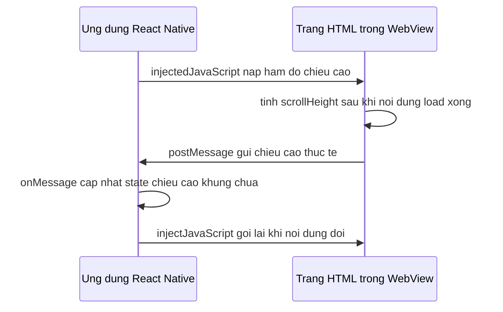
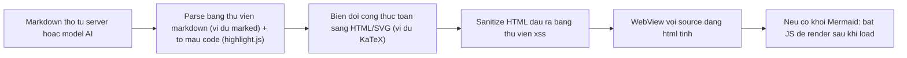

# Đồ hoạ & nội dung web: SVG, Lottie, WebView

Không phải mọi giao diện đều vẽ được bằng `View`/`Text` thuần. Có ba nhu cầu rất hay gặp: vẽ **đồ hoạ vector** co giãn không vỡ nét (icon, biểu đồ, hình minh hoạ) bằng **SVG** (Scalable Vector Graphics — đồ hoạ vector dạng mô tả toán học, không phải ảnh bitmap); phát lại **animation** do designer xuất ra từ After Effects mà không cần lập trình viên tự tay code từng khung hình, dùng định dạng **Lottie**; và hiển thị nội dung mà công cụ native "vẽ" rất mất công (markdown đã format, công thức toán, sơ đồ) bằng cách nhúng thẳng một **WebView** (khung nhìn trình duyệt được nhúng bên trong app native) để tận dụng engine HTML/CSS có sẵn.

**Tương tự đơn giản:** SVG là **bản vẽ kỹ thuật** (co giãn thoải mái, luôn sắc nét); Lottie là **đoạn phim hoạt hình đóng gói sẵn** (chỉ cần bấm play); WebView là **một cửa sổ trình duyệt mini** mở ngay trong app để hiển thị thứ mà "ngôn ngữ native" không tiện diễn đạt.

---

:::note[Ghi nhớ nhanh]

- ⭐ **`react-native-svg`** dựng UI vector bằng component khai báo (`Svg`, `Path`, `Circle`...) — icon, progress ring, biểu đồ đơn giản nên vẽ bằng SVG thay vì import ảnh PNG để tránh vỡ nét trên màn hình mật độ điểm ảnh cao.
- ⭐ **WebView chạy trong tiến trình/engine riêng** — không dùng chung JS thread với RN, nên phù hợp để "mượn" một engine render HTML mạnh (markdown, KaTeX, Mermaid) nhưng đắt tài nguyên nếu tạo tràn lan (mỗi WebView tốn RAM riêng).
- **Lottie** phát animation phức tạp (loading, hiệu ứng chúc mừng, minh hoạ chuyển động) từ file JSON do designer xuất, không cần code lại từng bước bằng Reanimated.
- **Cầu nối hai chiều RN ↔ WebView**: RN gọi vào trang qua `injectedJavaScript`/`injectJavaScript`; trang gọi ngược ra RN qua `window.ReactNativeWebView.postMessage` và sự kiện `onMessage`.
- Nội dung đổ vào WebView qua `source={{ html }}` **luôn phải sanitize** trước — WebView không tự chặn mã độc, và một `<script>` lạ trong HTML coi như chạy JS tuỳ ý trong app.
- Icon vector nên bọc thành component dùng lại được, nhận `color`/`size` làm prop thay vì hard-code màu/kích thước trong từng chỗ gọi.

:::

---

## Mục lục

- [Vì sao cần một tầng đồ hoạ và nội dung web riêng?](#vì-sao-cần-một-tầng-đồ-hoạ-và-nội-dung-web-riêng)
- [1. SVG với react-native-svg](#1-svg-với-react-native-svg)
- [2. Lottie với lottie-react-native](#2-lottie-với-lottie-react-native)
- [3. WebView với react-native-webview](#3-webview-với-react-native-webview)
- [4. Kiến trúc thực tế dùng WebView cho markdown và sơ đồ](#4-kiến-trúc-thực-tế-dùng-webview-cho-markdown-và-sơ-đồ)
- [Khi nào dùng?](#khi-nào-dùng)
- [Lỗi thường gặp](#lỗi-thường-gặp)
- [Câu hỏi phỏng vấn](#câu-hỏi-phỏng-vấn)

---

## Vì sao cần một tầng đồ hoạ và nội dung web riêng?

**Vấn đề:** `View`, `Text`, `Image` xử lý tốt layout và ảnh bitmap, nhưng có ba việc chúng không làm được: vẽ hình học co giãn (một icon phóng to gấp 3 lần vẫn phải sắc nét — ảnh PNG thì vỡ nét, phải export nhiều size); phát animation phức tạp nhiều lớp mà designer đã dựng sẵn trong After Effects (tự code lại bằng `Animated`/Reanimated tốn hàng trăm dòng cho một hiệu ứng "confetti" hay "loading pulse"); và hiển thị nội dung có cấu trúc rich-text phức tạp (bảng, công thức toán, sơ đồ) mà việc tự dựng bằng component native là bất khả thi trong thời gian hợp lý.

```jsx
// Icon bang PNG - phong to la vo net, moi size can 1 file rieng
<Image source={require('./icon-24.png')} style={{ width: 48, height: 48 }} />

// Tu code lai animation phuc tap bang tay - rat nhieu dong, kho maintain
Animated.sequence([
  Animated.timing(scale1, { toValue: 1.2, duration: 200 }),
  Animated.timing(scale2, { toValue: 0.9, duration: 150 }),
  // ...con hang chuc buoc nua cho 1 hieu ung "an mung"
]).start();

// Render markdown/cong thuc toan bang component native - phai tu viet
// parser + tu ve tung ky hieu toan hoc bang Text/View - qua phuc tap
```

**Giải pháp:** Dùng đúng công cụ cho đúng việc. `react-native-svg` cho phép mô tả hình vẽ bằng toạ độ (co giãn vô hạn, không vỡ nét). `lottie-react-native` phát trực tiếp file animation JSON do designer xuất — không cần lập trình viên "dịch" lại từng khung hình. `react-native-webview` mượn một engine hiển thị HTML/CSS/JS đầy đủ để render nội dung phức tạp mà không phải tự viết renderer native từ đầu.

```tsx
// SVG - co gian vo han, luon sac net
import Svg, { Circle } from 'react-native-svg';
<Svg width={48} height={48} viewBox="0 0 24 24">
  <Circle cx={12} cy={12} r={10} fill="tomato" />
</Svg>

// Lottie - phat animation da dung san tu file JSON
import LottieView from 'lottie-react-native';
<LottieView source={require('./celebrate.json')} autoPlay loop={false} />

// WebView - muon engine HTML co san de render markdown/cong thuc toan
import { WebView } from 'react-native-webview';
<WebView source={{ html: safeHtmlString }} />
```

:::tip[Dùng thực tế]

- **Bộ icon toàn app**: vẽ bằng `react-native-svg` thay vì một thư mục PNG @1x/@2x/@3x — nhẹ hơn và đổi màu theo theme (dark/light) dễ dàng chỉ bằng đổi prop `color`.
- **Màn hình loading/chào mừng**: designer xuất animation từ After Effects sang Lottie JSON, kỹ sư chỉ việc `<LottieView source={...} autoPlay loop />`.
- **Hiển thị tin nhắn chat dạng markdown** (bảng, code block, công thức toán): parse markdown thành HTML đã sanitize ở tầng JS, render tĩnh trong một WebView ẩn khung viền.
- **Hiển thị nội dung HTML từ nguồn ngoài** (email, bài viết đã có sẵn HTML): `WebView` với `source={{ uri }}` hoặc `source={{ html }}` tuỳ nguồn.

:::

---

## 1. SVG với react-native-svg

`react-native-svg` (bản 15.x) cung cấp một bộ component ánh xạ gần như 1-1 với thẻ SVG trên web: `Svg` (thẻ gốc, có `viewBox` để định hệ toạ độ và tỉ lệ co giãn), `Path` (vẽ hình bất kỳ bằng chuỗi lệnh `d`), `Circle`, `Rect`, `G` (nhóm nhiều phần tử để áp dụng transform chung), `Defs` + `LinearGradient` (định nghĩa gradient tô màu).

```bash
npm install react-native-svg
```

```tsx
import Svg, { Path, Circle, Rect, G, Defs, LinearGradient, Stop } from 'react-native-svg';

function BadgeIcon() {
  return (
    <Svg width={40} height={40} viewBox="0 0 40 40">
      <Defs>
        <LinearGradient id="grad" x1="0" y1="0" x2="1" y2="1">
          <Stop offset="0" stopColor="#7C3AED" />
          <Stop offset="1" stopColor="#2563EB" />
        </LinearGradient>
      </Defs>
      <Circle cx={20} cy={20} r={18} fill="url(#grad)" />
      <G transform="translate(12, 12)">
        <Rect x={0} y={0} width={16} height={16} rx={3} fill="white" opacity={0.9} />
      </G>
    </Svg>
  );
}
```

### `viewBox` — hệ toạ độ nội bộ của hình vẽ

`viewBox="minX minY width height"` định nghĩa "khung toạ độ ảo" mà các lệnh vẽ bên trong dùng, độc lập với `width`/`height` thực tế hiển thị ra ngoài. Nhờ vậy một icon vẽ trên hệ toạ độ `0 0 24 24` có thể hiển thị ở bất kỳ kích thước nào (16px, 48px, 96px) mà không cần vẽ lại — chỉ đổi `width`/`height` của `Svg`, tỉ lệ bên trong tự co giãn theo.

### Icon component tái sử dụng theo `color`/`size`

Thay vì lặp lại `Svg`/`Path` ở mọi nơi cần icon, nên bọc thành một component nhận `color` và `size` làm prop:

```tsx
type IconProps = { color?: string; size?: number };

const ARROW_PATH = 'M4 12h16M14 6l6 6-6 6';

export function ArrowIcon({ color = '#111827', size = 24 }: IconProps) {
  return (
    <Svg width={size} height={size} viewBox="0 0 24 24" fill="none">
      <Path
        d={ARROW_PATH}
        stroke={color}
        strokeWidth={2}
        strokeLinecap="round"
        strokeLinejoin="round"
      />
    </Svg>
  );
}

// Dung o bat ky dau, doi mau theo theme rat de
<ArrowIcon color={tokens.color.neutral.ink} size={20} />
```

Đây chính là cách một bộ icon system (dozens of icon) được tổ chức trong app thực tế: một bảng dữ liệu `{ tên: đường path }` và một component `Icon` duy nhất render `Path` theo `color`/`size` truyền vào, thay vì hàng chục file component lặp code.

### `SvgXml` / `SvgUri` — render SVG từ chuỗi hoặc URL

Khi có sẵn nội dung SVG dạng **chuỗi XML** (ví dụ icon thương hiệu do team design giao dưới dạng file `.svg` thô, hoặc SVG tải về từ server), dùng `SvgXml` thay vì phải "dịch" tay sang component:

```tsx
import { SvgXml } from 'react-native-svg';

const LOGO_XML = `<svg viewBox="0 0 24 24"><circle cx="12" cy="12" r="10" fill="#111"/></svg>`;

<SvgXml xml={LOGO_XML} width={32} height={32} />;
```

`SvgUri` tương tự nhưng nhận một URL trỏ tới file `.svg` từ xa (tải và render, hữu ích khi icon do CMS/server quản lý thay vì đóng gói sẵn trong app).

### Import file `.svg` như một component

Một cách tiếp cận khác — phổ biến khi làm việc với bộ icon lớn xuất từ Figma — là import thẳng file `.svg` và dùng như JSX component:

```tsx
import Logo from './assets/logo.svg';

<Logo width={48} height={48} />;
```

Cách này **cần một transformer** biến file `.svg` thành component React lúc build, vì Metro/bundler mặc định coi `.svg` là asset tĩnh chứ không phải mã nguồn. Với dự án dùng **Metro** (bundler mặc định của React Native CLI), thư viện `react-native-svg-transformer` làm việc này. Với bundler khác (ví dụ Rspack/Re.Pack) cần một loader tương đương làm cùng việc — nếu dự án dùng cấu hình build khác Metro, nên kiểm tra tài liệu bundler đó thay vì giả định tên gói giống Metro.

### Animate SVG bằng Reanimated

Vì các component của `react-native-svg` cũng là component React bình thường, có thể bọc bằng `Animated.createAnimatedComponent` của Reanimated để animate mượt trên UI thread (xem thêm bài về Reanimated ở phần Interactions):

```tsx
import Animated, { useAnimatedProps, useSharedValue, withTiming } from 'react-native-reanimated';
import { Circle } from 'react-native-svg';

const AnimatedCircle = Animated.createAnimatedComponent(Circle);

function PulsingDot() {
  const radius = useSharedValue(6);

  const animatedProps = useAnimatedProps(() => ({
    r: radius.value,
  }));

  React.useEffect(() => {
    radius.value = withTiming(10, { duration: 600 });
  }, []);

  return (
    <Svg width={40} height={40}>
      <AnimatedCircle cx={20} cy={20} fill="tomato" animatedProps={animatedProps} />
    </Svg>
  );
}
```

Đây là kỹ thuật đứng sau các progress ring động (vòng tròn tiến trình tải file, tiến trình thu âm...) — vẽ hai vòng tròn chồng lên nhau (một làm nền mờ, một làm "cung" tô theo tiến trình bằng `strokeDasharray`/`strokeDashoffset`), rồi animate `strokeDashoffset` khi tiến trình thay đổi.

---

## 2. Lottie với lottie-react-native

**Lottie** là định dạng animation dạng JSON do Airbnb phát triển, xuất trực tiếp từ Adobe After Effects (qua plugin Bodymovin). Khác với GIF/video, Lottie là **vector** (co giãn không vỡ nét) và **nhẹ** (một file JSON vài chục KB có thể thay thế một video vài MB). `lottie-react-native` (bản 7.x) cung cấp component `LottieView` để phát các file này trong RN.

```bash
npm install lottie-react-native
```

```tsx
import LottieView from 'lottie-react-native';

function JoiningLoader() {
  return (
    <LottieView
      source={require('./assets/loading.json')}
      autoPlay
      loop
      style={{ width: 200, height: 200 }}
    />
  );
}
```

### Các prop chính

- `source` — file JSON (import local qua `require`, hoặc `{ uri: '...' }` cho file tải từ xa).
- `autoPlay` — tự chạy ngay khi mount.
- `loop` — lặp vô hạn (`true`) hay chỉ chạy một lần (`false`).
- `progress` — điều khiển animation thủ công theo giá trị 0..1 (hữu ích khi muốn animation "bám theo" một tiến trình khác, ví dụ kéo scroll).

### Điều khiển bằng ref

Khi cần chủ động play/pause/reset (ví dụ animation "chúc mừng" chỉ chạy sau khi một hành động thành công), dùng `ref`:

```tsx
function CelebrateButton() {
  const lottieRef = React.useRef<LottieView>(null);

  const handleSuccess = () => {
    lottieRef.current?.reset();
    lottieRef.current?.play();
  };

  return (
    <>
      <LottieView
        ref={lottieRef}
        source={require('./assets/celebrate.json')}
        loop={false}
        style={{ width: 120, height: 120 }}
      />
      <Pressable onPress={handleSuccess}>
        <Text>Hoàn tất</Text>
      </Pressable>
    </>
  );
}
```

`play()` có thể nhận thêm khoảng khung hình bắt đầu/kết thúc để chỉ phát một đoạn của animation; `pause()` dừng tại khung hình hiện tại; `reset()` đưa animation về khung hình đầu.

### File JSON thường vs `.lottie`

Ngoài file `.json` thô, Lottie còn có định dạng đóng gói `.lottie` — về bản chất là một file nén (zip) gộp JSON animation cùng các asset đi kèm (ảnh, font) vào một file duy nhất, giúp animation phức tạp gọn nhẹ hơn khi phải kèm nhiều ảnh. `LottieView` hỗ trợ cả hai, chỉ cần trỏ `source` đúng file.

### Hiệu năng

Animation Lottie chạy trên native (iOS dùng engine Lottie riêng, Android tương tự) nên không tốn JS thread khi phát — mượt ngay cả khi JS bận. Tuy vậy animation quá phức tạp (nhiều layer, nhiều mask, hiệu ứng particle dày đặc) vẫn có thể nặng CPU/GPU trên thiết bị thấp cấp; nên kiểm tra hiệu năng thực tế trên máy Android tầm trung trước khi dùng Lottie ở những nơi hiển thị liên tục (ví dụ lặp trong danh sách dài).

### Khi nào dùng Lottie thay vì Reanimated?

- **Lottie**: animation nhiều lớp, hình dạng phức tạp do designer dựng sẵn (loading, minh hoạ, hiệu ứng ăn mừng) — không hợp lý để lập trình viên code lại từng khung hình.
- **Reanimated**: animation gắn liền với **tương tác của người dùng** (kéo, vuốt, phản hồi theo gesture) hoặc animation đơn giản trên chính state của UI (mở/đóng, chuyển màn) — cần điều khiển chính xác theo giá trị runtime mà Lottie (vốn là animation "đóng gói sẵn") không làm được.

---

## 3. WebView với react-native-webview

`react-native-webview` (bản 14.x) nhúng một khung nhìn trình duyệt thật (WKWebView trên iOS, Android System WebView trên Android) vào bên trong app native.

```bash
npm install react-native-webview
```

### Nạp nội dung: `uri` hay `html`

```tsx
import { WebView } from 'react-native-webview';

// Nap mot trang web that
<WebView source={{ uri: 'https://example.com' }} />;

// Nap HTML dung san trong bo nho - dung cho noi dung da render san (markdown, email...)
<WebView
  source={{ html: '<h1>Xin chao</h1><p>Noi dung tinh</p>' }}
  originWhitelist={['*']}
/>;
```

Khi dùng `source={{ html }}`, prop `originWhitelist` cần khai báo rõ (thường `['*']` cho HTML tĩnh không điều hướng đi đâu) vì WebView mặc định chỉ cho phép điều hướng trong cùng origin.

### Các prop kiểm soát hành vi quan trọng

```tsx
<WebView
  source={{ html: safeHtml }}
  javaScriptEnabled={false}          // tat JS neu noi dung khong can chay script
  originWhitelist={['*']}
  allowsInlineMediaPlayback           // video/audio phat inline, khong tu bat fullscreen
  onLoadEnd={() => setLoading(false)} // bao hieu da render xong
  onShouldStartLoadWithRequest={(request) => {
    // chan moi dieu huong ra ngoai, chi cho phep trang tinh ban dau
    return request.url === 'about:blank' || request.url.startsWith('data:');
  }}
/>
```

- `javaScriptEnabled` — bật/tắt JS chạy trong trang. Nội dung tĩnh (chỉ hiển thị, không cần tương tác) nên tắt để giảm bề mặt tấn công.
- `onShouldStartLoadWithRequest` — chặn điều hướng: trả `false` sẽ ngăn WebView tải URL đó, dùng để chặn người dùng bấm vào một liên kết lạ rồi bị điều hướng ra khỏi luồng app dự kiến.
- `onLoadEnd` — bắn khi trang tải xong, thường dùng để tắt loading indicator hoặc bắt đầu đo chiều cao nội dung.
- `allowsInlineMediaPlayback` — cho phép media (thẻ `video`) phát ngay trong khung thay vì tự động bật fullscreen (chủ yếu ảnh hưởng iOS).

### Cầu nối hai chiều: `injectedJavaScript` và `onMessage`

Đây là phần quan trọng nhất khi WebView cần **giao tiếp** với phần native, không chỉ hiển thị tĩnh.

**RN → trang web**, có hai cách:

- `injectedJavaScriptBeforeContentLoaded` — chạy **trước khi** nội dung HTML được nạp (phù hợp để thiết lập biến toàn cục, polyfill).
- `injectedJavaScript` — chạy **sau khi** trang đã load xong.
- Gọi thủ công bất kỳ lúc nào qua `ref`: `webviewRef.current?.injectJavaScript('...')`.

**Trang web → RN**: trang gọi `window.ReactNativeWebView.postMessage(string)`, phía RN nhận qua prop `onMessage`.

```tsx
function BridgedWebView() {
  const webviewRef = React.useRef<WebView>(null);
  const [contentHeight, setContentHeight] = React.useState(0);

  const heightReporterScript = `
    (function () {
      function reportHeight() {
        var h = document.documentElement.scrollHeight;
        window.ReactNativeWebView.postMessage(JSON.stringify({ type: 'height', value: h }));
      }
      window.addEventListener('load', reportHeight);
      reportHeight();
    })();
    true;
  `;

  return (
    <WebView
      ref={webviewRef}
      source={{ html: safeHtml }}
      injectedJavaScript={heightReporterScript}
      onMessage={(event) => {
        const data = JSON.parse(event.nativeEvent.data);
        if (data.type === 'height') {
          setContentHeight(data.value);
        }
      }}
      style={{ height: contentHeight || 1 }}
    />
  );
}
```

Đây chính là kỹ thuật **auto-height**: WebView mặc định không tự co giãn theo nội dung bên trong, nên phải đo `document.documentElement.scrollHeight` bên trong trang rồi báo ngược ra RN qua `postMessage`, RN nhận và set lại `height` cho khung chứa.

Chiều ngược lại — RN chủ động gửi dữ liệu **vào** trang đã render — dùng `webviewRef.current?.postMessage(data)`, phía trang lắng nghe bằng `document.addEventListener('message', handler)` (Android) hoặc `window.addEventListener('message', handler)` (iOS); nên đăng ký cả hai để tương thích hai nền tảng.



---

## 4. Kiến trúc thực tế dùng WebView cho markdown và sơ đồ

Một ứng dụng chat hoặc trợ lý AI thường cần hiển thị nội dung **markdown đã format** — bảng, code block có tô màu cú pháp, công thức toán, thậm chí sơ đồ Mermaid. Dựng lại toàn bộ engine đó bằng component native (tự vẽ bảng, tự tô màu code, tự vẽ ký hiệu toán học) là không thực tế. Cách tiếp cận phổ biến: **parse ở tầng JavaScript, render HTML tĩnh trong WebView**.

### Kiến trúc pipeline



Các bước then chốt:

1. **Parse markdown → HTML** bằng một thư viện markdown (ví dụ `marked`), kết hợp plugin tô màu cú pháp code block (`highlight.js`) và plugin công thức toán (KaTeX render ra HTML/SVG tĩnh).
2. **Sanitize HTML** trước khi đưa vào WebView — bắt buộc, không được bỏ qua bước này (xem phần bảo mật bên dưới).
3. **Render trong WebView** qua `source={{ html }}`. Nếu nội dung **không** có khối Mermaid (không cần chạy JS để vẽ sơ đồ), tắt hẳn `javaScriptEnabled` để giảm rủi ro. Nếu **có** Mermaid, bắt buộc bật JS (vì Mermaid tự vẽ sơ đồ bằng JavaScript ngay trong trang) — nên phát hiện trước (ví dụ kiểm tra chuỗi markdown có chứa khối code fence \`\`\`mermaid hay không) để chỉ bật JS khi thật sự cần, không bật tràn lan cho mọi tin nhắn.

### Bảo mật — không được bỏ qua

WebView chạy JS thô từ HTML nếu không kiểm soát chặt sẽ đúng bằng "cho phép chạy code tuỳ ý trong app":

- **Sanitize HTML trước khi đưa vào WebView.** Không thể tin tưởng nội dung có kiểm soát hoàn toàn (kể cả markdown do model AI sinh ra) — luôn lọc qua một whitelist thẻ/thuộc tính cho phép bằng thư viện sanitize (ví dụ thư viện `xss`), loại bỏ thẻ `script`, thuộc tính `on*` (`onclick`, `onerror`...), và bất kỳ thứ gì ngoài whitelist.
- **Không bật `allowFileAccess` một cách bừa bãi.** Thuộc tính cho phép WebView đọc file trên thiết bị — chỉ bật khi thực sự cần và đã kiểm soát chặt nguồn HTML, nếu không sẽ mở đường cho HTML độc hại đọc file cục bộ.
- **Chặn điều hướng tới URL lạ** qua `onShouldStartLoadWithRequest` — HTML sanitize kỹ đến đâu vẫn nên chặn cứng việc trang tự điều hướng ra khỏi `about:blank`/`data:` nội bộ, tránh kiểu tấn công dẫn dụ người dùng bấm link ra ngoài.
- **Content-Security-Policy (CSP)** — nếu có thể, thêm meta tag CSP vào chính HTML được render để giới hạn thêm nguồn script/style được phép chạy, làm lớp phòng thủ thứ hai sau bước sanitize.
- Ghi nhớ: sanitize + tắt JS khi không cần + chặn điều hướng là **ba lớp phòng thủ độc lập** — mất một lớp vẫn còn hai lớp kia chặn lại.

### Hiệu năng — một WebView cho mỗi tin nhắn là đắt

Mỗi WebView là một tiến trình/engine render riêng, tốn bộ nhớ đáng kể. Trong danh sách chat dài, tạo một WebView cho **mỗi** tin nhắn markdown sẽ nhanh chóng làm app chậm hoặc crash vì hết bộ nhớ khi cuộn qua vài chục tin nhắn. Hướng xử lý thực tế:

- **Lazy render**: chỉ mount WebView khi tin nhắn thực sự nằm trong hoặc gần vùng nhìn thấy (kết hợp với cơ chế windowing của danh sách ảo hoá), unmount khi cuộn ra xa.
- **Pool / tái sử dụng**: với danh sách rất dài, cân nhắc một số lượng nhỏ WebView được tái sử dụng luân phiên thay vì tạo mới liên tục.
- **Cân nhắc render native cho phần đơn giản**: không phải mọi markdown đều cần WebView — văn bản thường, in đậm/in nghiêng, danh sách gạch đầu dòng hoàn toàn có thể tự parse và render bằng `Text`/`View` native (nhanh hơn, nhẹ hơn nhiều). Chỉ "leo thang" sang WebView cho phần thật sự khó: bảng phức tạp, công thức toán, sơ đồ Mermaid.

---

## Khi nào dùng?

| Nhu cầu | Công cụ |
| --- | --- |
| Icon, hình minh hoạ đơn giản, cần co giãn không vỡ nét | `react-native-svg` |
| Progress ring, biểu đồ đơn giản có animate theo giá trị | `react-native-svg` + Reanimated |
| Animation nhiều lớp do designer xuất từ After Effects | `lottie-react-native` |
| Animation gắn với gesture/tương tác người dùng | Reanimated (không phải Lottie) |
| Hiển thị trang web thật hoặc HTML từ nguồn ngoài | `react-native-webview` với `source={{ uri }}` |
| Markdown/công thức toán/sơ đồ cần engine render mạnh | `react-native-webview` với `source={{ html }}` đã sanitize |
| Danh sách dài chứa nhiều nội dung markdown | Lazy render WebView + fallback native cho phần đơn giản |

---

## Lỗi thường gặp

| Lỗi | Nguyên nhân | Cách sửa |
| --- | --- | --- |
| Import file `.svg` báo lỗi "Unexpected token" hoặc không render | Thiếu transformer cho bundler (ví dụ chưa cấu hình `react-native-svg-transformer` với Metro) | Cấu hình transformer/loader tương ứng với bundler đang dùng, hoặc chuyển sang `SvgXml` với chuỗi XML |
| Icon luôn ra màu đen dù đã truyền `color` khác | Dùng `fill="currentColor"` trong `Path` nhưng `Svg` cha không có prop `color` để phân giải | Phân giải màu ở tầng component (biến `color` truyền vào thành giá trị `fill` cụ thể) trước khi truyền xuống `Path`, không dựa vào `currentColor` tự động |
| Lottie animation không chạy trên Android dù chạy tốt trên iOS | File JSON dùng tính năng After Effects mà engine Lottie native chưa hỗ trợ đầy đủ | Kiểm tra file trên công cụ xem trước Lottie chính thức, đơn giản hoá layer/hiệu ứng không được hỗ trợ |
| WebView hiển thị trống trơn khi dùng `source={{ html }}` | Thiếu `originWhitelist` nên WebView chặn nội dung không rõ origin | Thêm `originWhitelist={['*']}` khi nạp HTML tĩnh dựng sẵn |
| WebView bị cắt hoặc để trống thừa | Không đo chiều cao nội dung thực tế — WebView không tự co theo `children` | Đo `scrollHeight` trong trang, báo ngược ra RN qua `postMessage`, set lại `style.height` |
| `onMessage` không nhận được gì | Trang gọi sai tên hàm cầu nối (ví dụ tự định nghĩa `postMessage` riêng thay vì dùng `window.ReactNativeWebView.postMessage`) | Luôn gọi đúng `window.ReactNativeWebView.postMessage(string)` — đây là cầu nối do thư viện tiêm vào, không phải `window.postMessage` thông thường |
| App bị chậm/crash khi cuộn danh sách chat dài có nhiều markdown | Mỗi tin nhắn tạo một WebView riêng, tốn bộ nhớ tích luỹ | Lazy render WebView theo vùng nhìn thấy, chỉ leo thang sang WebView cho nội dung thật sự cần (bảng phức tạp, công thức, sơ đồ) |
| Nội dung markdown do người dùng/model AI sinh ra có thể chèn mã độc | Đưa thẳng HTML chưa sanitize vào WebView | Luôn sanitize qua whitelist thẻ/thuộc tính trước khi render, tắt `javaScriptEnabled` khi không cần chạy script |

---

## Câu hỏi phỏng vấn

Những câu thường gặp về chủ đề này. Tự trả lời trước, rồi bấm **Xem đáp án** để đối chiếu.

**1. Vì sao nên dùng SVG thay vì ảnh PNG cho icon?**

<details className="qa">
<summary>Xem đáp án</summary>

SVG là đồ hoạ vector (mô tả bằng toạ độ toán học) nên co giãn ở bất kỳ kích thước nào vẫn sắc nét, trong khi PNG là bitmap cố định điểm ảnh nên phóng to sẽ vỡ nét — phải export nhiều size (`@1x`, `@2x`, `@3x`) mới đủ dùng. SVG cũng thường nhẹ hơn nhiều so với việc gộp nhiều file PNG cho cùng một icon, và dễ đổi màu động (chỉ đổi prop `fill`/`stroke`) mà không cần asset riêng cho mỗi màu.

</details>

**2. `viewBox` trong `Svg` dùng để làm gì?**

<details className="qa">
<summary>Xem đáp án</summary>

`viewBox` định nghĩa hệ toạ độ nội bộ (`minX minY width height`) mà các lệnh vẽ bên trong dùng, tách biệt với `width`/`height` hiển thị thực tế ra bên ngoài. Nhờ vậy một hình vẽ trên hệ toạ độ `0 0 24 24` có thể hiển thị ở 16px hay 96px mà không cần vẽ lại — chỉ cần đổi `width`/`height` của `Svg`, mọi toạ độ bên trong tự co giãn theo tỉ lệ.

</details>

**3. Làm sao để đổi màu/kích thước một icon SVG dùng ở nhiều nơi mà không lặp code?**

<details className="qa">
<summary>Xem đáp án</summary>

Bọc `Svg`/`Path` thành một component nhận `color` và `size` làm prop, rồi render `Path` với `stroke`/`fill` bằng giá trị `color` truyền vào và `width`/`height` của `Svg` bằng `size`. Mọi nơi cần icon chỉ gọi component đó với prop khác nhau, thay vì lặp lại khối `Svg` ở từng chỗ.

</details>

**4. Khi nào cần transformer để import file `.svg` như component?**

<details className="qa">
<summary>Xem đáp án</summary>

Bundler mặc định (ví dụ Metro) coi file `.svg` là asset tĩnh, không phải mã nguồn, nên `import Logo from './logo.svg'` sẽ không tự biến thành component React nếu không có transformer chuyển đổi lúc build (với Metro là gói `react-native-svg-transformer`). Nếu không muốn cấu hình transformer, có thể dùng `SvgXml` với chuỗi XML của file SVG thay thế.

</details>

**5. Lottie khác gì so với video/GIF cho animation loading?**

<details className="qa">
<summary>Xem đáp án</summary>

Lottie là animation vector dạng JSON (xuất từ After Effects), nên co giãn không vỡ nét và file thường nhẹ hơn nhiều so với video/GIF ở cùng chất lượng hình ảnh. Animation cũng chạy trên engine native chuyên dụng thay vì giải mã video, nên mượt và ít tốn tài nguyên hơn cho các hiệu ứng phức tạp nhiều lớp.

</details>

**6. `LottieView` có những prop điều khiển chính nào?**

<details className="qa">
<summary>Xem đáp án</summary>

`source` (file JSON hoặc `.lottie`), `autoPlay` (tự chạy khi mount), `loop` (lặp vô hạn hay chạy một lần), `progress` (điều khiển animation thủ công theo giá trị 0..1). Ngoài ra có thể điều khiển chủ động qua `ref` với các hàm `play()`, `pause()`, `reset()`.

</details>

**7. Khi nào nên dùng Lottie, khi nào nên dùng Reanimated?**

<details className="qa">
<summary>Xem đáp án</summary>

Lottie phù hợp cho animation nhiều lớp, phức tạp mà designer đã dựng sẵn (loading, minh hoạ, hiệu ứng ăn mừng) — không hợp lý để code lại từng khung hình. Reanimated phù hợp cho animation gắn liền với tương tác của người dùng (gesture, kéo, vuốt) hoặc cần điều khiển chính xác theo giá trị runtime, việc mà một animation "đóng gói sẵn" như Lottie không đáp ứng được.

</details>

**8. Sự khác biệt giữa `source={{ uri }}` và `source={{ html }}` trong `WebView`?**

<details className="qa">
<summary>Xem đáp án</summary>

`source={{ uri }}` nạp một trang web thật từ URL (WebView tự tải và render). `source={{ html }}` nạp một chuỗi HTML dựng sẵn trong bộ nhớ, dùng khi nội dung đã được tạo ra ở tầng JS (ví dụ markdown đã parse thành HTML) chứ không tồn tại sẵn ở một địa chỉ web nào.

</details>

**9. Làm sao để trang HTML bên trong WebView gửi dữ liệu ra cho phần native?**

<details className="qa">
<summary>Xem đáp án</summary>

Trang gọi `window.ReactNativeWebView.postMessage(string)` — đây là cầu nối do thư viện tiêm sẵn vào trang, không phải `window.postMessage` thông thường. Phía RN nhận dữ liệu qua prop `onMessage` của `WebView`, đọc chuỗi gửi lên từ `event.nativeEvent.data`.

</details>

**10. Vì sao WebView không tự co giãn chiều cao theo nội dung, và cách khắc phục?**

<details className="qa">
<summary>Xem đáp án</summary>

WebView mặc định là một khung có kích thước cố định theo `style` được truyền vào, không tự đo và co theo nội dung HTML bên trong như một `View` bình thường. Cách khắc phục phổ biến: tiêm một đoạn JavaScript (qua `injectedJavaScript`) để đo `document.documentElement.scrollHeight` sau khi trang load xong, gửi giá trị đó ra ngoài qua `postMessage`, rồi phía RN nhận qua `onMessage` và cập nhật lại `height` cho khung chứa.

</details>

**11. Vì sao phải sanitize HTML trước khi đưa vào WebView, kể cả khi nội dung do model AI sinh ra?**

<details className="qa">
<summary>Xem đáp án</summary>

WebView thực thi HTML/JS như một trình duyệt thật — nếu nội dung chứa thẻ `script` hay thuộc tính `on*` (`onclick`, `onerror`...) không bị lọc bỏ, đó tương đương với cho phép chạy mã tuỳ ý ngay trong app. Nội dung do model AI sinh ra vẫn không đáng tin cậy tuyệt đối (có thể bị dẫn dắt để sinh ra mã độc), nên luôn phải lọc qua whitelist thẻ/thuộc tính cho phép bằng một thư viện sanitize trước khi render, kết hợp thêm việc tắt `javaScriptEnabled` khi không cần và chặn điều hướng URL lạ như các lớp phòng thủ bổ sung.

</details>

**12. Vì sao không nên tạo một WebView cho mỗi tin nhắn trong danh sách chat dài?**

<details className="qa">
<summary>Xem đáp án</summary>

Mỗi WebView là một tiến trình/engine render riêng biệt, tốn bộ nhớ đáng kể so với một component native thông thường. Tạo hàng chục WebView cùng lúc khi cuộn qua một danh sách chat dài sẽ nhanh chóng làm app chậm hoặc hết bộ nhớ. Nên lazy render (chỉ mount WebView khi tin nhắn nằm trong hoặc gần vùng nhìn thấy) và chỉ dùng WebView cho phần nội dung thật sự cần engine HTML (bảng phức tạp, công thức toán, sơ đồ), còn văn bản thường vẫn render bằng component native.

</details>
