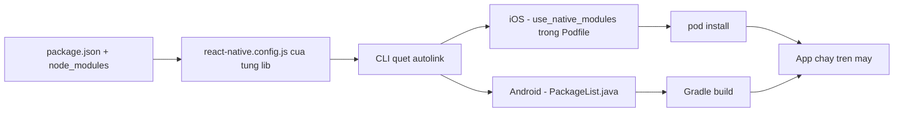

# Build native: CocoaPods, Gradle, signing & patch thư viện

Khi code JavaScript/TypeScript đã sẵn sàng, RN cần "biên dịch" nó cùng phần code gốc (native code) thành file cài đặt chạy được trên máy -- đây gọi là **build native**. Với app RN kiểu bare (tự quản lý code native, không dùng Expo managed workflow), có 2 dự án native độc lập nằm trong thư mục `ios/` (Xcode + CocoaPods) và `android/` (Gradle) phải build đúng thì thư viện native (native module -- thư viện có phần code Swift/Kotlin/Objective-C/Java) mới hoạt động. Bài này đi sâu vào cách 2 hệ build đó vận hành, cách quản lý nhiều môi trường, ký ứng dụng (signing), và cách vá (patch) một thư viện bên thứ ba mà không sửa trực tiếp `node_modules`.

**Tương tự đơn giản:** iOS/Android build giống 2 xưởng lắp ráp riêng biệt dùng chung một bản vẽ (JS bundle) -- xưởng iOS cần "giấy phép nhập phụ tùng" (CocoaPods), xưởng Android cần "dây chuyền lắp ráp" (Gradle), và cả hai phải cùng đóng dấu (signing) mới xuất xưởng được.

---

:::note[Ghi nhớ nhanh]

- ⭐ **Mỗi lần thêm/gỡ thư viện native phải chạy lại `pod install` (iOS)** -- Podfile.lock không tự cập nhật, quên bước này build vẫn có thể pass nhưng app crash lúc chạy vì thiếu module.
- ⭐ **`newArchEnabled=true` (Android) / `RCT_NEW_ARCH_ENABLED=1` (iOS)** -- bật New Architecture; đổi cờ này luôn phải `pod install` lại vì codegen sinh code khác hoàn toàn.
- **Autolinking** -- CLI tự quét `node_modules` để nối thư viện native vào Podfile/Gradle, không cần sửa tay `MainApplication`/`AppDelegate` như RN thời trước 0.60.
- **`pnpm patch` / `patch-package`** -- sửa lỗi thư viện bên thứ ba mà không fork cả repo, nhưng phải làm lại patch mỗi khi nâng version thư viện.
- **`nodeLinker: hoisted`** -- pnpm phải trải `node_modules` phẳng cho React Native, vì Gradle/CocoaPods/CLI đều giả định layout này.

:::

---

## Mục lục

- [Vì sao cần build native đúng cách?](#vì-sao-cần-build-native-đúng-cách)
- [1. Cấu trúc thư mục ios và android](#1-cấu-trúc-thư-mục-ios-và-android)
- [2. Autolinking module native](#2-autolinking-module-native)
- [3. CocoaPods cho iOS](#3-cocoapods-cho-ios)
- [4. Gradle cho Android](#4-gradle-cho-android)
- [5. Product flavor và nhiều môi trường](#5-product-flavor-và-nhiều-môi-trường)
- [6. Signing ứng dụng](#6-signing-ứng-dụng)
- [7. Patch thư viện native](#7-patch-thư-viện-native)
- [8. pnpm với React Native](#8-pnpm-với-react-native)
- [9. Makefile, script build và CI](#9-makefile-script-build-và-ci)
- [Khi nào dùng?](#khi-nào-dùng)
- [Lỗi thường gặp](#lỗi-thường-gặp)
- [Câu hỏi phỏng vấn](#câu-hỏi-phỏng-vấn)

---

## Vì sao cần build native đúng cách?

**Vấn đề:** JS thay đổi thì Metro build lại là đủ, nhưng thư viện native (camera, bluetooth, sinh trắc học...) chứa code biên dịch sẵn -- phải qua Xcode/Gradle mới ra được binary mới. Nếu chỉ "cài package rồi chạy" như thói quen làm web:

```bash
npm install react-native-some-native-lib
npx react-native run-ios     # van dung cau hinh pod cu -> thieu symbol hoac crash
```

Xcode/Gradle không tự biết thư viện mới cần được nối vào project native -- thiếu bước cài lại phần native khiến build hoặc chạy fail theo cách khó đoán (có khi build vẫn "xanh" nhưng app crash lúc mở).

**Giải pháp:** luôn đi kèm bước cài lại phần native sau khi thêm/gỡ thư viện:

```bash
npm install react-native-some-native-lib

# iOS - autolink + cai lai pod
cd ios && bundle exec pod install && cd ..

# Android - xoa cache build cu, autolink chay lai luc build
cd android && ./gradlew clean && cd ..

npx react-native run-ios
npx react-native run-android
```

:::tip[Dùng thực tế]

- Thêm SDK push notification (native) -- luôn `pod install` lại trước khi build iOS.
- Bật New Architecture cho project cũ -- phải `pod install` lại vì Podfile sinh code Fabric khác hoàn toàn.
- Tích hợp Google Sign-In -- phải lấy đúng SHA-1 bằng `./gradlew signingReport` rồi đăng ký với Google, nếu không app luôn báo lỗi đăng nhập.
- Team build song song nhiều môi trường (dev/staging/prod) -- mỗi build cần applicationId/bundle identifier riêng để cài cùng lúc trên 1 máy test.

:::

---

## 1. Cấu trúc thư mục ios và android

RN CLI (bare) sinh 2 project native độc lập, đứng cạnh code JS:

```
MyApp/
├── android/
│   ├── app/
│   │   ├── build.gradle          (cau hinh app: applicationId, signing, dependencies)
│   │   ├── src/main/
│   │   │   ├── AndroidManifest.xml
│   │   │   └── java/...          (MainApplication.kt, MainActivity.kt)
│   │   └── proguard-rules.pro
│   ├── build.gradle               (cau hinh chung toan project)
│   ├── settings.gradle            (khai bao module, autolinking)
│   ├── gradle.properties          (cac co: newArchEnabled, hermesEnabled...)
│   └── gradlew, gradlew.bat
├── ios/
│   ├── MyApp/
│   │   ├── AppDelegate.swift      (hoac .mm)
│   │   ├── Info.plist
│   │   └── Images.xcassets
│   ├── MyApp.xcodeproj
│   ├── MyApp.xcworkspace          (mo file nay, KHONG mo .xcodeproj, sau khi da co Pods)
│   ├── Podfile
│   └── Podfile.lock
├── App.tsx
├── index.js
└── package.json
```

Vài điều cần nhớ:

- `.xcworkspace` khác `.xcodeproj` -- mở `.xcworkspace` sau khi cài Pods, vì workspace gộp cả project app lẫn project Pods.
- `Podfile.lock` **phải commit** -- pin đúng version pod đã cài + test, tương tự `package-lock.json`/`pnpm-lock.yaml`.
- `gradlew`/`gradlew.bat` là **Gradle Wrapper** -- không cần cài Gradle riêng trên máy, mỗi máy tự tải đúng version khai trong `gradle-wrapper.properties`.

---

## 2. Autolinking module native

**Autolinking** = cơ chế CLI tự động quét `node_modules`, tìm package có khai native code (qua `react-native.config.js` của chính thư viện, hoặc field trong `package.json`), rồi tự nối vào Podfile (iOS) và `PackageList` (Android) -- không cần sửa tay `AppDelegate`/`MainApplication` như RN thời trước 0.60.

`react-native.config.js` ở gốc project (app), dùng để tuỳ biến autolinking khi cần:

```js
module.exports = {
  // Bo qua 1 package khong can autolink tren 1 platform (vd package chi dung tren iOS)
  dependencies: {
    'react-native-some-web-only-lib': {
      platforms: { android: null },
    },
  },
  // Khai bao them asset (font...) can link
  assets: ['./src/assets/fonts/'],
};
```

Phía iOS, Podfile gọi `use_native_modules!` để lấy danh sách rồi generate pod tương ứng. Phía Android, `build.gradle` của module `app` gọi `autolinkLibrariesWithApp()` trong block `react { }`, sinh ra file `PackageList.java` chứa danh sách các package native (`new XxxPackage()`).



Vì autolinking dựa trên **cache** (Gradle) và **Podfile.lock** (iOS), thêm/gỡ thư viện native mà không chạy lại bước cài (`pod install`, hoặc build sạch lại Android) có thể để lại trạng thái "build xanh nhưng thiếu module" -- app build thành công nhưng crash lúc chạy với lỗi kiểu native module null (xem [Lỗi thường gặp](#lỗi-thường-gặp)).

---

## 3. CocoaPods cho iOS

**CocoaPods** = dependency manager cho iOS/Objective-C/Swift (tương tự npm nhưng cho code native của Apple).

### Cài đặt qua Bundler (khuyến nghị)

Version CocoaPods khác nhau giữa các máy trong team dễ sinh `Podfile.lock` lệch nhau. Cách ổn định: khai version cụ thể trong `Gemfile`, cài qua **Bundler** (trình quản lý gem của Ruby):

```ruby
# Gemfile
source 'https://rubygems.org'

gem 'cocoapods', '~> 1.15'
gem 'activesupport', '>= 6.1.7.5'
```

```bash
bundle install                 # cai dung version CocoaPods khai trong Gemfile
cd ios && bundle exec pod install
```

`bundle exec pod install` đảm bảo cả team lẫn CI cùng dùng 1 version CocoaPods, tránh `Podfile.lock` đổi qua lại giữa các máy chỉ vì version CocoaPods khác nhau.

### `Podfile` cơ bản

```ruby
require_relative '../node_modules/react-native/scripts/react_native_pods'

platform :ios, min_ios_version_supported
prepare_react_native_project!

target 'MyApp' do
  config = use_native_modules!

  use_react_native!(
    :path => config[:reactNativePath],
    :app_path => "#{Pod::Config.instance.installation_root}/.."
  )

  post_install do |installer|
    react_native_post_install(installer, config[:reactNativePath])
  end
end
```

### Lệnh thường dùng

```bash
cd ios

bundle exec pod install               # cai/cap nhat theo Podfile.lock
bundle exec pod update RNSomeLib      # cap nhat rieng 1 pod

bundle exec pod deintegrate           # go toan bo Pods, ve trang thai truoc khi cai CocoaPods
rm -rf Pods Podfile.lock
bundle exec pod install               # cai lai tu dau -- fix hau het loi pod "la"
```

`pod deintegrate` hữu ích khi `Podfile.lock`/`Pods/` "hỏng" theo cách khó chẩn đoán (xung đột version, cache lỗi) -- xoá sạch rồi cài lại từ đầu thường nhanh hơn debug từng dòng lỗi linker.

### Lỗi thường gặp sau khi đổi thư viện native

- Thêm package có code native mà **quên `pod install`** -- Xcode build báo thiếu symbol hoặc "no such module".
- Đổi version React Native -- `Podfile.lock` vẫn pin version cũ, phải `pod install` lại (đôi khi cần xoá `Pods/` trước).
- **Bật New Architecture** -- Fabric/TurboModule sinh codegen khác hoàn toàn, bắt buộc `pod install` lại toàn bộ, không chỉ pod vừa thêm.

---

## 4. Gradle cho Android

**Gradle** = build system cho Android (tương tự Maven nhưng linh hoạt hơn, cấu hình bằng Groovy hoặc Kotlin DSL).

### `settings.gradle`

Khai báo module nào thuộc project và gọi autolinking cho Android:

```groovy
rootProject.name = 'MyApp'
apply from: file("../node_modules/@react-native-community/cli-platform-android/native_modules.gradle")
applyNativeModulesSettingsGradle(settings)

include ':app'
```

### `android/app/build.gradle` (rút gọn)

```groovy
apply plugin: "com.android.application"
apply plugin: "com.facebook.react"

react {
    autolinkLibrariesWithApp()
}

android {
    namespace "com.example.app"
    defaultConfig {
        applicationId "com.example.app"
        minSdkVersion rootProject.ext.minSdkVersion
        targetSdkVersion rootProject.ext.targetSdkVersion
        versionCode 1
        versionName "1.0"
    }
    signingConfigs {
        release {
            storeFile file(System.getenv("RELEASE_STORE_FILE") ?: "debug.keystore")
            storePassword System.getenv("RELEASE_STORE_PASSWORD") ?: "android"
            keyAlias System.getenv("RELEASE_KEY_ALIAS") ?: "androiddebugkey"
            keyPassword System.getenv("RELEASE_KEY_PASSWORD") ?: "android"
        }
    }
    buildTypes {
        release {
            signingConfig signingConfigs.release
            minifyEnabled true
            proguardFiles getDefaultProguardFile("proguard-android.txt"), "proguard-rules.pro"
        }
    }
}
```

### `gradle.properties`

```properties
newArchEnabled=true      # bat New Architecture (TurboModule + Fabric)
hermesEnabled=true       # dung Hermes engine thay JavaScriptCore
reactNativeArchitectures=armeabi-v7a,arm64-v8a,x86,x86_64
```

### Lệnh build thường dùng

```bash
cd android

./gradlew clean                 # xoa cache build -- fix hau het loi build "la"
./gradlew assembleDebug          # build APK debug
./gradlew assembleRelease        # build APK release (co ky)
./gradlew bundleRelease          # build AAB release (bat buoc de nop Play Store)

# In SHA-1 / SHA-256 cua keystore -- can cho Google Sign-In, Firebase...
./gradlew signingReport
```

`signingReport` in ra SHA-1/SHA-256 của từng `signingConfig` (debug lẫn release). Đây là thông tin bắt buộc phải đăng ký với dịch vụ xác thực theo chữ ký app (Firebase, Google Cloud Console cho OAuth...) -- sai hoặc thiếu SHA là nguyên nhân phổ biến nhất của lỗi đăng nhập Google trên Android.

---

## 5. Product flavor và nhiều môi trường

Team thường cần build song song 3 bản: **dev**, **staging**, **prod** -- khác API endpoint, khác icon, và quan trọng nhất là khác `applicationId`/bundle identifier để **cài đồng thời trên cùng máy** không đè lên nhau.

### Android -- product flavor

```groovy
android {
    flavorDimensions "env"
    productFlavors {
        dev {
            dimension "env"
            applicationIdSuffix ".dev"       // ra com.example.app.dev
            versionNameSuffix "-dev"
        }
        staging {
            dimension "env"
            applicationIdSuffix ".staging"
        }
        prod {
            dimension "env"
            // giu nguyen applicationId goc: com.example.app
        }
    }
}
```

Build theo flavor: `./gradlew assembleDevDebug`, `./gradlew assembleProdRelease`.

### iOS -- nhiều target/scheme

iOS không có khái niệm "flavor" như Gradle; cách tương đương là tạo thêm **Scheme/Configuration** riêng trong Xcode cho từng môi trường, mỗi scheme gắn **Bundle Identifier** riêng (`com.example.app.dev`, `com.example.app.staging`) qua Build Settings, rồi build đúng scheme đó (`xcodebuild -scheme MyApp-Staging`).

### Biến môi trường theo build

Nguyên tắc chung: **file chứa giá trị thật không commit**, chỉ commit file mẫu.

```
.env.development     (khong commit)
.env.staging         (khong commit)
.env.production      (khong commit)
.env.example         (commit -- chi ten bien + gia tri mau)
```

Về mặt khái niệm, giá trị biến môi trường được "inline" thẳng vào bundle **lúc build** (không đọc runtime như server), thông qua babel plugin hoặc bundler plugin dạng `DefinePlugin` -- thay `process.env.API_URL` bằng chuỗi thật ngay trong bước biên dịch JS. Nghĩa là đổi file env xong phải build lại bundle, không thể đổi "nóng" lúc app đang chạy.

```tsx
// Vi du doc bien duoc inline luc build -- gia tri la string co dinh ngay
// trong bundle sau khi build, khong phai gia tri runtime doc tu process that.
const apiUrl: string = process.env.API_URL ?? 'https://api.example.com';

export function getApiUrl(): string {
  return apiUrl;
}
```

---

## 6. Signing ứng dụng

**Signing** = ký số file build bằng một khoá riêng để hệ điều hành/store xác minh app đến từ đúng nhà phát triển và chưa bị chỉnh sửa.

### Android -- Keystore

```bash
keytool -genkeypair -v -keystore release.keystore -alias my-key-alias \
  -keyalg RSA -keysize 2048 -validity 10000
```

- **Debug keystore** -- tự động có sẵn (`~/.android/debug.keystore`), SHA-1 khác nhau trên mỗi máy dev.
- **Release keystore** -- tự tạo, dùng chung cho cả team và CI, **không commit vào git**.
- Mỗi keystore (debug/release) có SHA-1 riêng -- Google Sign-In/Firebase yêu cầu đăng ký đúng SHA-1 của **từng** keystore đang dùng. Build release ký bằng keystore chưa đăng ký SHA sẽ báo lỗi `DEVELOPER_ERROR` khi đăng nhập, dù build debug vẫn chạy bình thường.
- **Mất keystore release đồng nghĩa không thể update app đã lên Play Store nữa** -- backup keystore và mật khẩu vào nơi an toàn (secret manager, password vault), tuyệt đối không để chỉ trên 1 máy.

### iOS -- Certificate, Provisioning Profile, Capability

Ở mức khái niệm (quy trình đăng ký chi tiết trên Apple Developer đã có ở bài Publishing):

- **Certificate** -- chứng thực định danh nhà phát triển (Development hoặc Distribution).
- **Provisioning Profile** -- "giấy phép" khớp Certificate + App ID + danh sách thiết bị (bản Development) hoặc điều kiện phát hành (bản Distribution).
- **Capability** -- quyền/tính năng đặc biệt app khai báo dùng, phải bật đúng trong Xcode và khớp với Provisioning Profile, ví dụ:
  - **Push Notifications** -- bắt buộc để nhận push qua APNs.
  - **Sign in with Apple** -- bắt buộc khai nếu app có tích hợp social login khác (theo yêu cầu review của Apple).
  - **Associated Domains** -- cần cho Universal Links/deep link dạng đường dẫn web mở thẳng vào app.

Thiếu capability hoặc Provisioning Profile không khớp Certificate là nguyên nhân phổ biến khiến build chạy được trên Simulator nhưng fail khi build cho thiết bị thật hoặc khi archive để phát hành.

---

## 7. Patch thư viện native

Đôi khi thư viện bên thứ ba có bug hoặc thiếu tính năng nhỏ, chưa kịp release bản vá. Thay vì fork cả repo, có thể **patch trực tiếp file trong `node_modules`**, rồi lưu lại phần thay đổi (diff) để tự động áp dụng lại mỗi lần cài đặt.

### `patch-package` (npm/yarn)

```bash
# 1. Sua truc tiep file trong node_modules/<package>
# 2. Sinh file patch tu phan da sua
npx patch-package react-native-some-lib

# -> tao file patches/react-native-some-lib+1.2.3.patch
```

```json
{
  "scripts": {
    "postinstall": "patch-package"
  }
}
```

Từ lần install sau, `postinstall` tự áp lại patch vào `node_modules` -- không cần sửa tay lại mỗi lần cài mới.

### `pnpm patch` (khuyến nghị khi dùng pnpm)

pnpm có cơ chế patch built-in, không cần thêm package ngoài:

```bash
# 1. Mo mot ban sao tam cua package de sua
pnpm patch react-native-some-lib@1.2.3
# -> in ra duong dan thu muc tam, vd /tmp/xxxx/react-native-some-lib

# 2. Sua file trong thu muc tam do

# 3. Chot patch -- pnpm tu sinh file .patch + ghi vao patchedDependencies
pnpm patch-commit /tmp/xxxx/react-native-some-lib
```

Kết quả ghi vào `pnpm-workspace.yaml` (hoặc `package.json` với bản pnpm cũ hơn):

```yaml
patchedDependencies:
  react-native-some-lib@1.2.3: patches/react-native-some-lib@1.2.3.patch
```

Từ lần install sau, pnpm tự áp patch -- không cần khai `postinstall` riêng như `patch-package`.

### Cập nhật patch khi nâng version thư viện

Patch là **diff theo đúng nội dung file tại 1 version cụ thể** -- tên file thường gắn kèm version (`react-native-some-lib@1.2.3.patch`). Nâng thư viện lên version mới mà patch cũ áp không khớp (đổi số dòng, đổi nội dung xung quanh) -- phải patch lại từ đầu:

```bash
pnpm patch react-native-some-lib@1.3.0
# sua lai thay doi (co the copy lai tu patch cu neu conflict it)
pnpm patch-commit /tmp/xxxx/react-native-some-lib
```

### Vì sao patch phải đồng bộ giữa các app dùng chung binary

Trong kiến trúc có nhiều app JS chia sẻ **cùng một runtime native** (ví dụ nhiều mini-app chạy trong 1 app host, hoặc nhiều target build ra từ cùng 1 thư mục `node_modules`), patch của một thư viện native/lõi chỉ được biên dịch **một lần** vào binary chung. Nếu chỉ patch ở nơi build ra binary mà quên patch ở chỗ khác đang giả định hành vi đã patch, hai bên sẽ lệch pha: bên "tưởng" thư viện đã có hành vi mới nhưng binary thực tế build từ bản chưa patch, dẫn tới lỗi khó tái hiện (chạy đúng ở môi trường dev đã patch đủ, hỏng ở môi trường build thiếu patch). Nguyên tắc: patch động vào code native/lõi chia sẻ phải coi là một phần "hợp đồng" giữa các app dùng chung, cần review và merge đồng thời, không patch cục bộ ở một chỗ.

---

## 8. pnpm với React Native

Nhiều team chuyển sang **pnpm** để tiết kiệm dung lượng ổ đĩa (dùng chung 1 store, symlink giữa các project) và cài nhanh hơn. Nhưng tooling của React Native (Gradle, CocoaPods, CLI autolinking) được viết với giả định **`node_modules` phẳng** kiểu npm/yarn cũ -- một số file hard-code đường dẫn kiểu tương đối tới `node_modules/@react-native/gradle-plugin`, hoặc autolinking quét trực tiếp các thư mục con của `node_modules`.

pnpm mặc định dùng layout **isolated** (mỗi package chỉ thấy đúng dependency của nó qua symlink lồng nhau) -- layout này làm autolinking/Gradle không tìm thấy package. Bắt buộc chuyển sang chế độ trải phẳng:

```yaml
# pnpm-workspace.yaml (pnpm ban moi doc config o day, khong con doc .npmrc)
nodeLinker: hoisted
```

### Hệ quả -- mất quyền thực thi (exec bit), lỗi exit 126

Ở layout `hoisted`, các file `node_modules/.bin/*` là **symlink trỏ thẳng** vào file gốc trong package, nên quyền thực thi của file phụ thuộc đúng mode được publish lên registry. Nhiều package publish binary ở quyền không có cờ thực thi -- npm/yarn tự cấp lại quyền chạy sau khi cài, nhưng pnpm hoisted **không** tự làm việc này.

Hệ quả: Gradle gọi CLI để autolink (`npx @react-native-community/cli config`), gặp binary không có quyền chạy -- báo **exit code 126** ("tìm thấy nhưng không thực thi được", khác với `127` là "không tìm thấy"). Build fail ngay ở bước `settings.gradle`.

Cách xử lý phổ biến -- thêm bước tự cấp lại quyền thực thi cho các binary sau mỗi lần cài:

```json
{
  "scripts": {
    "postinstall": "node scripts/fix-bin-exec-bit.js"
  }
}
```

```js
// scripts/fix-bin-exec-bit.js (rut gon y tuong)
// Quet node_modules/.bin (va .bin cua tung package con), voi moi symlink:
// resolve ra file dich that su, kiem tra quyen thuc thi, cap lai quyen neu thieu.
```

**Lưu ý quan trọng:** exit 126 chỉ là triệu chứng đầu tiên. Vì Gradle **cache** kết quả autolink (file cấu hình autolink kèm hash của lockfile), nếu lần build trước fail giữa chừng sau khi hash đã được ghi nhận "đã xử lý", build sau có thể "xanh" (thành công) nhưng dùng **cache cũ chưa có thư viện mới** -- app build ra thành công nhưng crash lúc chạy vì thiếu native module. Gặp tình huống build pass nhưng runtime báo native module null ngay sau khi thêm dependency mới, nên thử xoá cache autolinking rồi build lại (xem [Lỗi thường gặp](#lỗi-thường-gặp)).

---

## 9. Makefile, script build và CI

Nhóm nhiều lệnh dài (build, ký, cài, in SHA...) thường được gói vào **Makefile** để cả team gõ 1 lệnh ngắn thay vì nhớ chuỗi flag dài:

```makefile
.DEFAULT_GOAL := help
.PHONY: help apk aab install run-android run-ios sha

help: ## Liet ke cac lenh
	@grep -E '^[a-zA-Z_-]+:.*?## .*$$' $(MAKEFILE_LIST) | \
	  awk 'BEGIN{FS=":.*?## "}{printf "  %-14s %s\n", $$1, $$2}'

sha: ## In SHA-1/SHA-256 tu keystore release
	@bash scripts/android-build.sh sha

apk: ## Build APK release
	@bash scripts/android-build.sh apk release

aab: ## Build AAB release (nop Play Store)
	@bash scripts/android-build.sh aab release

install: ## Cai APK release len thiet bi dang cam
	@adb install -r android/app/build/outputs/apk/release/app-release.apk

run-android: ## Dev: Metro + cai debug
	@npm run android

run-ios: ## Dev: chay iOS simulator
	@npm run ios
```

Bên dưới Makefile, script Bash/Node thật (ví dụ `scripts/android-build.sh`) tự dò Android SDK, tự đọc keystore, gọi `./gradlew assembleRelease`, rồi in ra SHA-1 để đối chiếu -- gói toàn bộ tri thức "làm sao build đúng" vào 1 file thay vì rải trong đầu từng thành viên.

### CI build (khái niệm)

Build native trên CI chậm nhất ở bước tải/biên dịch lại dependency -- nên luôn **cache** các thư mục sau giữa các lần chạy:

- **Gradle** -- cache thư mục cache của Gradle daemon và Gradle wrapper, key theo hash file cấu hình wrapper cùng các file `.gradle`.
- **CocoaPods** -- cache thư mục `Pods/` hoặc cache toàn cục của CocoaPods, key theo hash `Podfile.lock`.
- **node_modules** -- cache theo hash lockfile (`pnpm-lock.yaml`) -- tránh cài lại toàn bộ dependency mỗi lần chạy pipeline.

Cache đúng key (hash đúng file lock tương ứng) là quan trọng nhất: cache "trúng" nhưng dữ liệu đã cũ (ví dụ `Podfile.lock` đổi nhưng cache `Pods/` không bị invalidate) gây đúng loại lỗi "build cache lệch" đã nói ở phần autolinking.

---

## Khi nào dùng?

| Tình huống | Việc cần làm |
| --- | --- |
| Vừa thêm thư viện có native code | `pod install` (iOS) + rebuild sạch (Android) |
| Bật/tắt New Architecture | `pod install` lại toàn bộ, không chỉ pod mới |
| Cần build nhiều môi trường song song trên 1 máy | Product flavor (Android) + scheme riêng (iOS), khác applicationId/bundle id |
| Tích hợp Google Sign-In/Firebase | `./gradlew signingReport` lấy đúng SHA-1 của keystore đang build |
| Thư viện bên thứ ba có bug nhỏ, chưa có bản vá chính thức | `pnpm patch` (dự án dùng pnpm) hoặc `patch-package` |
| Dùng pnpm cho project React Native | Bắt buộc `nodeLinker: hoisted`, kèm bước cấp lại exec bit sau install |
| Build lặp lại trên nhiều máy/CI | Gói lệnh vào Makefile/script, cache Pods/Gradle/node_modules |

---

## Lỗi thường gặp

| Lỗi | Nguyên nhân | Cách sửa |
| --- | --- | --- |
| Build Xcode báo thiếu symbol/module sau khi thêm lib | Quên `pod install` sau khi cài package có native code | `cd ios && bundle exec pod install` |
| Build Android "xanh" nhưng app crash vì thiếu native module | Cache autolinking cũ, chưa nhận thư viện vừa thêm | Xoá thư mục cache autolinking đã sinh ra, rồi build lại |
| Gradle fail ngay ở `settings.gradle`, thoát với mã `126` | pnpm `hoisted` không giữ quyền thực thi cho `node_modules/.bin/*` | Thêm script `postinstall` tự cấp lại quyền thực thi cho các binary bị thiếu |
| Đăng nhập Google báo `DEVELOPER_ERROR` trên build release | SHA-1 của keystore release chưa đăng ký, hoặc đăng ký nhầm SHA của debug keystore | `./gradlew signingReport`, đăng ký đúng SHA-1 tương ứng từng keystore |
| Patch không áp được sau khi nâng version thư viện | File đích đã đổi nội dung/số dòng so với lúc tạo patch | Tạo lại patch trên version mới (`pnpm patch` hoặc `patch-package`) |
| Cài song song 2 môi trường bị đè lên nhau trên cùng máy | Dùng chung 1 applicationId/bundle identifier cho dev và prod | Thêm `applicationIdSuffix`/bundle id riêng theo flavor hoặc scheme |
| Mất khả năng update app đã phát hành | Mất keystore release, không có bản backup | Luôn backup keystore và mật khẩu vào nơi an toàn ngay khi tạo |

---

## Câu hỏi phỏng vấn

Những câu thường gặp về chủ đề này. Tự trả lời trước, rồi bấm **Xem đáp án** để đối chiếu.

**1. Autolinking là gì và giải quyết vấn đề gì?**

<details className="qa">
<summary>Xem đáp án</summary>

Cơ chế CLI tự quét `node_modules` để tìm thư viện có native code, rồi tự nối vào Podfile (iOS) và `PackageList` (Android). Trước RN 0.60, việc này phải làm tay (sửa `AppDelegate`/`MainApplication`) -- dễ quên bước, dễ sai khi gỡ thư viện.

</details>

**2. Vì sao phải chạy lại `pod install` sau khi thêm thư viện native, dù `npm install`/`pnpm install` đã chạy xong?**

<details className="qa">
<summary>Xem đáp án</summary>

`npm install`/`pnpm install` chỉ tải code JS và native source vào `node_modules`. CocoaPods quản lý dependency native iOS riêng qua `Podfile.lock` -- phải chạy `pod install` để CocoaPods đọc lại autolinking, tải đúng version pod, và cập nhật `Podfile.lock`/project Xcode. Bỏ qua bước này, Xcode build với cấu hình pod cũ, thiếu module mới.

</details>

**3. `Podfile.lock` dùng để làm gì, có nên commit không?**

<details className="qa">
<summary>Xem đáp án</summary>

Giống `package-lock.json`/`pnpm-lock.yaml` -- pin chính xác version từng pod đã cài và test. **Phải commit** để cả team và CI cài cùng 1 bộ version pod, tránh tình trạng "chạy máy tôi thì được".

</details>

**4. `newArchEnabled=true` và `RCT_NEW_ARCH_ENABLED` ảnh hưởng gì tới build?**

<details className="qa">
<summary>Xem đáp án</summary>

Bật New Architecture (TurboModule và Fabric renderer). Vì cơ chế codegen sinh code khác hoàn toàn so với kiến trúc cũ, đổi cờ này bắt buộc `pod install` lại toàn bộ (không chỉ pod vừa đổi) và build sạch lại Android, nếu không dễ gặp lỗi linker hoặc thiếu symbol.

</details>

**5. `./gradlew signingReport` dùng để làm gì?**

<details className="qa">
<summary>Xem đáp án</summary>

In ra SHA-1/SHA-256 của từng `signingConfig` (debug lẫn release) trong project. Các giá trị này cần đăng ký với dịch vụ xác thực theo chữ ký app (Google Sign-In, Firebase...) -- thiếu hoặc sai SHA gây lỗi đăng nhập kiểu `DEVELOPER_ERROR`.

</details>

**6. Debug keystore và release keystore khác nhau thế nào?**

<details className="qa">
<summary>Xem đáp án</summary>

Debug keystore tự sinh, khác nhau trên mỗi máy dev, chỉ dùng khi build debug. Release keystore tự tạo, dùng chung cho toàn bộ bản release và CI, phải backup kỹ vì **mất keystore release đồng nghĩa không thể update app đã phát hành**.

</details>

**7. `patch-package` và `pnpm patch` khác nhau ở điểm nào?**

<details className="qa">
<summary>Xem đáp án</summary>

- `patch-package`: sửa trực tiếp trong `node_modules`, sinh file patch, cần khai `postinstall` gọi `patch-package` để tự áp lại.
- `pnpm patch`: cơ chế built-in của pnpm -- mở bản sao tạm để sửa, `pnpm patch-commit` để chốt, patch được khai trong `patchedDependencies` và tự áp khi install, không cần script `postinstall` riêng.

Với project dùng pnpm, `pnpm patch` phù hợp hơn vì tương thích đúng cách pnpm quản lý store (không sửa trực tiếp file trong store dùng chung).

</details>

**8. Vì sao phải tạo lại patch khi nâng version thư viện?**

<details className="qa">
<summary>Xem đáp án</summary>

Patch là diff theo đúng nội dung file tại version cụ thể lúc tạo. Nâng version khác, nội dung file gốc thay đổi (số dòng, code xung quanh) khiến patch cũ áp không khớp hoặc áp sai chỗ -- phải patch lại trên version mới.

</details>

**9. Vì sao `nodeLinker: hoisted` là bắt buộc khi dùng pnpm cho React Native?**

<details className="qa">
<summary>Xem đáp án</summary>

Vì Gradle, CocoaPods và CLI autolinking được viết với giả định `node_modules` phẳng (một số file hard-code đường dẫn tương đối tới package trong `node_modules`, autolinking quét trực tiếp các thư mục con). Layout mặc định "isolated" của pnpm (symlink lồng nhau, mỗi package chỉ thấy đúng dependency của nó) khiến các tool này không tìm thấy package cần thiết.

</details>

**10. Exit code 126 khi build Android với pnpm nghĩa là gì?**

<details className="qa">
<summary>Xem đáp án</summary>

"Tìm thấy file nhưng không thực thi được" (khác `127` là "không tìm thấy"). Nguyên nhân thường gặp: `nodeLinker: hoisted` khiến `node_modules/.bin/*` là symlink trỏ vào file gốc, một số package publish binary không có sẵn quyền thực thi, và pnpm hoisted không tự cấp lại quyền như npm/yarn. Cách sửa: thêm bước tự cấp lại quyền thực thi vào `postinstall`.

</details>

**11. Vì sao cần khác applicationId/bundle identifier giữa các môi trường dev/staging/prod?**

<details className="qa">
<summary>Xem đáp án</summary>

Để cài đồng thời nhiều bản trên cùng 1 máy test mà không đè lên nhau (hệ điều hành coi mỗi applicationId/bundle id là 1 app riêng biệt). Thường dùng `applicationIdSuffix` theo flavor (Android) hoặc Bundle Identifier riêng theo scheme (iOS).

</details>

**12. Vì sao build Gradle có thể báo thành công nhưng app vẫn crash vì thiếu native module?**

<details className="qa">
<summary>Xem đáp án</summary>

Vì autolinking dùng cache riêng (file cấu hình autolink kèm hash lockfile). Nếu một lần build trước đó fail giữa chừng sau khi hash đã được đánh dấu "đã xử lý" (ví dụ do lỗi exec bit không liên quan), lần build sau có thể đọc cache cũ (thiếu module mới) mà vẫn coi là hợp lệ -- build pass nhưng danh sách package thực tế thiếu package mới, gây lỗi runtime native module null. Cách xử lý: xoá thư mục cache autolinking rồi build lại khi nghi ngờ.

</details>
