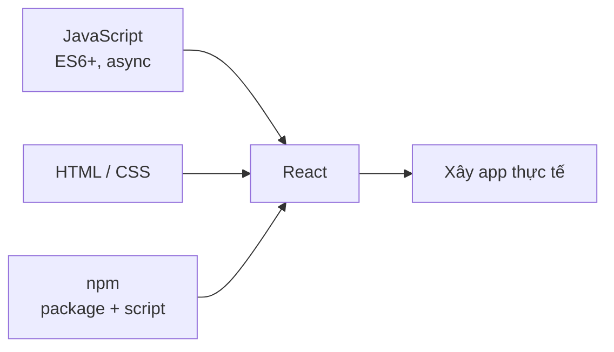
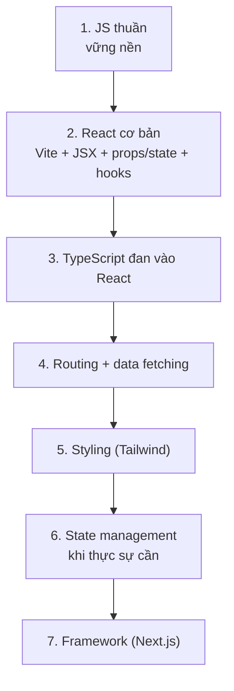

# Chuẩn bị trước khi học React

React là một **thư viện JavaScript** (bộ công cụ viết sẵn để dựng giao diện) giúp xây dựng giao diện web theo từng khối nhỏ tái sử dụng. Trước khi học React, bạn cần một nền tảng vững về JavaScript, HTML và CSS, vì React được xây dựng hoàn toàn dựa trên những kiến thức này. Bài này liệt kê những gì bạn nên nắm chắc và bộ công cụ (**tooling**) nên làm quen trước khi bắt đầu.

[](pathname:///img/react/chuan-bi.webp)

---

:::note[Ghi nhớ nhanh]

- ⭐ **React không phải điểm bắt đầu** — cần nắm chắc JavaScript, HTML/CSS và ES6+ trước, vì React xây hoàn toàn trên nền này.
- **JavaScript nền tảng** — thành thạo `map`/`filter`/`reduce`, destructuring, arrow function, `async`/`await`, ES Modules trước khi vào React.
- **TypeScript không bắt buộc nhưng rất khuyến nghị** — biết interface, generic, utility types (`Partial`, `Pick`, `Omit`).
- **JSX khác HTML** — `class` → `className`, `for` → `htmlFor`, inline style là object, attribute camelCase.
- ⭐ **Học theo lộ trình từng bước** — đừng dồn React + TypeScript + Tailwind + Redux + Next.js cùng lúc; mỗi bước build dự án thật.

:::

---

## Mục lục

- [Yêu cầu nền tảng](#yêu-cầu-nền-tảng)
- [JavaScript checklist](#javascript-checklist)
- [TypeScript checklist](#typescript-checklist)
- [HTML và CSS checklist](#html-và-css-checklist)
- [Tooling cần biết](#tooling-cần-biết)
- [Câu hỏi phỏng vấn](#câu-hỏi-phỏng-vấn)

---

## Yêu cầu nền tảng

React **không phải** là điểm bắt đầu của hành trình frontend. Trước khi
học React, bạn cần nắm chắc các kiến thức nền:

| Kiến thức | Tại sao? |
|-----------|----------|
| **JavaScript** | React là JS — không qua được JS thì học React rất khổ |
| **HTML / CSS** | JSX là syntax HTML-like, styling vẫn dùng CSS |
| **ES6+** | Arrow, destructuring, spread, module — dùng mọi lúc |
| **Promise / async** | Mọi data fetching đều async |
| **npm** | Cài thư viện, chạy script |

Các mảnh kiến thức nền đều là điều kiện đầu vào trước khi thực sự dựng app React:



---

## JavaScript checklist

Tham khảo [roadmap JavaScript](/docs/javascript/01-gioi-thieu/1_javascript-la-gi):

- [ ] Variables: `let`, `const`, scope, hoisting
- [ ] Data types & immutability
- [ ] Functions: arrow, default params, rest/spread, closures
- [ ] Array methods: `map`, `filter`, `reduce`, `find`, `forEach`
- [ ] Destructuring (array + object)
- [ ] Spread / Rest operator
- [ ] Template literals
- [ ] ES Modules (`import` / `export`)
- [ ] Promise, `async`/`await`, `fetch`
- [ ] DOM events, event bubbling
- [ ] `this` keyword (chỉ cần để đọc code cũ)

:::tip[Mẹo]

Không cần **thuộc lòng**, nhưng phải đủ **nhận biết** khi gặp trong code.
React code điển hình:

```jsx
function UserList({ users, onSelect }) {
  return (
    <ul>
      {users.map(user => (
        <li key={user.id} onClick={() => onSelect(user.id)}>
          {user.name}
        </li>
      ))}
    </ul>
  );
}
```

Trong 5 dòng có: destructuring, arrow, callback, `map`, template-like
(`{user.name}`), spread (key prop), event handler. Nếu chưa quen các
khái niệm này → quay lại JS trước.

:::

---

## TypeScript checklist

TypeScript **không bắt buộc** nhưng **rất khuyến nghị** với React. Tham
khảo [roadmap TypeScript](/docs/typescript/01-gioi-thieu/1_typescript-la-gi).

Tối thiểu cần biết:

- [ ] Primitive types, union, intersection
- [ ] Interface vs type alias
- [ ] Generic cơ bản (`<T>`)
- [ ] Utility types: `Partial`, `Pick`, `Omit`, `Record`
- [ ] Type assertion (`as`, `satisfies`)
- [ ] Type cho props component, event handler

---

## HTML và CSS checklist

- [ ] Semantic HTML (header, nav, main, section, article, footer)
- [ ] Form elements và `<label>` đúng cách
- [ ] Box model, Flexbox, Grid
- [ ] CSS selectors, specificity
- [ ] Responsive: media query, mobile-first
- [ ] CSS Variables (`--var`, `var()`)
- [ ] Pseudo-class, pseudo-element

:::info[Phân tích]

**JSX khác HTML ở vài điểm**:

- `class` → `className` (vì `class` là từ khoá JS).
- `for` → `htmlFor`.
- Inline style là object: `style={{ color: "red" }}`.
- Self-closing bắt buộc cho thẻ không có content: ``, `<br />`.
- Attribute camelCase: `onclick` → `onClick`, `tabindex` → `tabIndex`.

Khi chuyển từ HTML thuần sang JSX, nhớ những điểm này. Tools (Tailwind
IntelliSense, Prettier) sẽ tự động nhắc.

:::

---

## Tooling cần biết

- [ ] **npm / pnpm / yarn / bun** — cài package, chạy script.
- [ ] **Git** — version control cơ bản.
- [ ] **VSCode** — extension cần thiết:
  - ESLint
  - Prettier
  - Tailwind CSS IntelliSense (nếu dùng Tailwind)
  - Error Lens
  - GitLens
- [ ] **Browser DevTools** — Elements, Console, Network, React DevTools extension.
- [ ] **Terminal** — chạy command, navigation cơ bản.

Lộ trình học từng bước để tránh quá tải:



:::warning[Cần lưu ý]

**Đừng dồn học cùng lúc React + TypeScript + Tailwind + Redux + Next.js**
— quá tải sẽ làm bạn nản. Lộ trình hợp lý:

1. **JS thuần** → vững nền.
2. **React cơ bản** (Vite + JSX + props/state + hooks) → 2-3 tuần.
3. **TypeScript** đan vào React → 1-2 tuần.
4. **Routing + data fetching** → 1 tuần.
5. **Styling solution** (Tailwind) → vài ngày.
6. **State management** chỉ khi thực sự cần → vài ngày.
7. **Framework (Next.js)** khi đã quen React → 2-3 tuần.

Mỗi bước **build dự án thật** — không phải xem video. Học bằng cách
gặp bug và sửa, không phải bằng cách đọc.

:::

---

## Câu hỏi phỏng vấn

Những câu thường gặp về chủ đề này. Tự trả lời trước, rồi bấm **Xem đáp án** để đối chiếu.

**1. Vì sao nói React "không phải điểm bắt đầu"? Kể năm tính năng ES6+ xuất hiện dày đặc trong code React hằng ngày.**

<details className="qa">
<summary>Xem đáp án</summary>

React chỉ là một **thư viện JavaScript** dựng giao diện — nó không thay thế JS mà xây hoàn toàn trên nền JS, HTML và CSS. Không vững nền thì mọi lỗi React đều biến thành lỗi JS bạn không đọc nổi: `undefined is not a function`, mảng render sai, `this` lạc mất. Vì vậy thứ tự đúng là JS → HTML/CSS → React.

Năm tính năng ES6+ gặp mỗi ngày:

- **Arrow function** — callback, event handler: `onClick={() => onSelect(id)}`.
- **Destructuring** — nhận props: `function UserList({ users, onSelect })`.
- **Spread / rest** — copy state, truyền props: `{...props}`.
- **Template literal** — ghép chuỗi class, URL.
- **ES Modules** — `import` / `export` mọi component.

Cộng thêm array method (`map`, `filter`), `Promise` / `async`-`await` cho data fetching.

</details>

**2. `map`, `filter`, `reduce` khác `forEach` ở điểm nào? Vì sao render danh sách trong JSX luôn dùng `map` mà không bao giờ dùng `forEach`?**

<details className="qa">
<summary>Xem đáp án</summary>

| Method | Trả về | Dùng để |
|---|---|---|
| `map` | Mảng mới cùng độ dài | Biến đổi từng phần tử |
| `filter` | Mảng mới ngắn hơn/bằng | Lọc theo điều kiện |
| `reduce` | Một giá trị bất kỳ | Gộp mảng thành tổng, object, chuỗi... |
| `forEach` | `undefined` | Chỉ chạy side effect, không lấy kết quả |

Điểm mấu chốt: ba method đầu **trả về giá trị**, `forEach` thì không.

JSX là biểu thức — mọi thứ trong dấu ngoặc nhọn phải **là một giá trị** để React render. `map` trả về mảng phần tử JSX nên React hiển thị được; `forEach` trả về `undefined` nên không hiển thị gì cả.

```jsx
<ul>{users.map(u => <li key={u.id}>{u.name}</li>)}</ul>
```

</details>

**3. Destructuring hoạt động ra sao với object lồng nhau và giá trị mặc định? Viết lại `function C(props)` thành dạng destructure kèm default.**

<details className="qa">
<summary>Xem đáp án</summary>

Destructuring lấy giá trị ra khỏi object/array theo **tên key** (object) hoặc **vị trí** (array). Với object lồng nhau, viết tiếp một cặp ngoặc nhọn theo đúng cấu trúc. Giá trị mặc định (`= giá trị`) chỉ áp dụng khi thuộc tính là `undefined` — chú ý `null` **không** kích hoạt default.

```jsx
// Trước
function Card(props) {
  const size = props.size || "md";
  return <div>{props.user.name} - {size}</div>;
}

// Sau: destructure kèm default và lồng nhau
function Card({ user: { name, avatar = "/default.png" }, size = "md" }) {
  return <div>{name} - {size}</div>;
}
```

Lưu ý destructure object lồng nhau sẽ lỗi nếu `user` là `undefined`, nên thường đặt default cho cả cấp cha: `{ user = {} }`.

</details>

**4. Toán tử spread tạo bản sao nông (`shallow copy`) — điều đó nghĩa là gì và vì sao nó là cái bẫy khi cập nhật state dạng object lồng nhau?**

<details className="qa">
<summary>Xem đáp án</summary>

**Shallow copy** nghĩa là spread chỉ sao chép **một tầng**: các giá trị nguyên thủy được copy thật, còn object/array bên trong chỉ được copy **tham chiếu** — bản mới và bản cũ vẫn trỏ chung một object con.

```js
const state = { user: { name: "A" }, tags: ["x"] };
const next = { ...state };
next.user.name = "B";       // sửa luôn state.user — cùng tham chiếu!
console.log(state.user.name); // "B"
```

Trong React, state phải được cập nhật **bất biến**: nếu bạn sửa trực tiếp object con, tham chiếu ngoài cùng không đổi, React so sánh thấy "giống cũ" nên có thể không re-render, hoặc re-render nhưng `useMemo` / `React.memo` so sánh sai. Cách đúng là spread từng tầng bị chạm tới:

```js
setState(s => ({ ...s, user: { ...s.user, name: "B" } }));
```

</details>

**5. `closure` là gì? Giải thích vì sao closure là gốc rễ của lỗi `stale state` mà bạn sẽ gặp khi học `useEffect`.**

<details className="qa">
<summary>Xem đáp án</summary>

**Closure** là khả năng một hàm "nhớ" được các biến trong phạm vi nơi nó **được định nghĩa**, kể cả khi hàm đó chạy ở nơi khác, thời điểm khác.

Mỗi lần component React render, thân function chạy lại và tạo ra một **bộ biến mới** — `count` của lần render này là một biến khác với `count` của lần render trước. Hàm callback bạn đưa vào `useEffect`, `setTimeout` hay event handler là closure bám vào bộ biến của **lần render tạo ra nó**. Nếu callback sống lâu hơn lần render đó (timer, subscription, effect có dependency rỗng), nó vẫn đọc giá trị cũ — gọi là **stale state/closure**.

```jsx
useEffect(() => {
  const id = setInterval(() => console.log(count), 1000);
  return () => clearInterval(id);
}, []); // count mãi mãi là giá trị lần render đầu
```

Cách xử lý: khai báo đủ dependency, hoặc dùng dạng updater `setCount(c => c + 1)`, hoặc lưu vào `useRef`.

</details>

**6. Arrow function khác function thường ở cách xử lý `this` như thế nào? Điều đó liên quan gì tới việc phải bind method trong class component?**

<details className="qa">
<summary>Xem đáp án</summary>

Function thường có `this` **động** — xác định theo *cách gọi*: gọi như method của object thì `this` là object đó, gọi rời rạc thì `this` là `undefined` (strict mode) hoặc global. Arrow function **không có `this` riêng**, nó lấy `this` từ scope bao ngoài lúc định nghĩa (lexical `this`), và không thể đổi bằng `call` / `apply` / `bind`.

Trong class component, khi truyền method làm event handler, nó bị tách khỏi instance:

```jsx
<button onClick={this.handleClick}>OK</button>
// this.handleClick chạy "rời" → this là undefined → lỗi
```

Ba cách khắc phục: bind trong constructor (`this.handleClick = this.handleClick.bind(this)`), gói bằng arrow trong JSX (`onClick={() => this.handleClick()}`), hoặc khai báo class field bằng arrow — cách phổ biến nhất vì `this` được chốt sẵn. Hàm function component không gặp vấn đề này vì không dùng `this`.

</details>

**7. `var`, `let`, `const` khác nhau ở scope và hoisting ra sao? `TDZ` là gì?**

<details className="qa">
<summary>Xem đáp án</summary>

| | `var` | `let` | `const` |
|---|---|---|---|
| Scope | Function scope | Block scope | Block scope |
| Hoisting | Có, khởi tạo sẵn `undefined` | Có, nhưng chưa khởi tạo (TDZ) | Như `let` |
| Gán lại | Được | Được | Không |
| Khai báo lại cùng scope | Được | Không | Không |

**TDZ (Temporal Dead Zone)** là khoảng từ đầu block cho tới dòng khai báo `let` / `const`. Trong khoảng đó biến đã "tồn tại" nhưng chưa được khởi tạo, truy cập sẽ ném `ReferenceError` thay vì trả `undefined` như `var`.

```js
console.log(a); // undefined
var a = 1;

console.log(b); // ReferenceError: Cannot access 'b' before initialization
let b = 2;
```

`const` chỉ cấm **gán lại biến**, không làm object bất biến — vẫn sửa được thuộc tính bên trong. Thực hành: mặc định dùng `const`, cần gán lại mới dùng `let`, tránh `var`.

</details>

**8. `Promise` và `async`/`await` liên hệ thế nào? Vì sao `fetch` KHÔNG reject khi server trả về 404 hay 500, và bạn phải kiểm tra gì?**

<details className="qa">
<summary>Xem đáp án</summary>

`async`/`await` là **cú pháp viết gọn** trên nền Promise, không phải cơ chế mới: hàm `async` luôn trả về Promise, còn `await` chỉ là cách chờ Promise resolve mà không cần `.then()` lồng nhau. Lỗi được bắt bằng `try`/`catch` thay vì `.catch()`.

`fetch` chỉ **reject khi request không tới nơi** — mất mạng, DNS sai, CORS chặn, request bị abort. Một response 404 hay 500 vẫn là "server đã trả lời thành công về mặt mạng", nên Promise **resolve** bình thường. Vì vậy phải tự kiểm tra `response.ok` (hoặc `response.status`):

```js
const res = await fetch("/api/users");
if (!res.ok) {
  throw new Error(`HTTP ${res.status}`);
}
const data = await res.json();
```

Đây là khác biệt lớn so với `axios` — axios tự ném lỗi với status ngoài 2xx. Bỏ quên `res.ok` là bug kinh điển: giao diện hiển thị trang lỗi HTML như thể đó là dữ liệu hợp lệ.

</details>

**9. `ES Modules` khác `CommonJS` ở đâu? Phân biệt named export và default export, cái nào thân thiện hơn với `tree-shaking` và vì sao?**

<details className="qa">
<summary>Xem đáp án</summary>

| | ES Modules | CommonJS |
|---|---|---|
| Cú pháp | `import` / `export` | `require` / `module.exports` |
| Thời điểm phân tích | Tĩnh, lúc parse | Động, lúc chạy |
| Vị trí | Phải ở top-level | Gọi ở bất kỳ đâu |
| Môi trường | Trình duyệt + Node | Node (truyền thống) |
| Bất đồng bộ | Hỗ trợ top-level `await` | Không |

**Named export** xuất nhiều thứ theo tên, import phải đúng tên: `export function Button() {}` → `import { Button } from "./Button"`. **Default export** mỗi file một cái, import đặt tên tùy ý: `import Bat from "./Button"`.

Named export **thân thiện với tree-shaking** hơn. Vì ESM phân tích được **tĩnh**, bundler biết chính xác bạn dùng tên nào và loại bỏ phần còn lại khỏi bundle. Default export gói mọi thứ vào một giá trị duy nhất, bundler khó tách nhỏ; ngoài ra tên tùy ý còn làm rối rename và autocomplete.

</details>

**10. Giải thích `event bubbling` và `capturing`. React gắn event listener lên từng phần tử hay lên gốc ứng dụng, và `synthetic event` là gì?**

<details className="qa">
<summary>Xem đáp án</summary>

Một sự kiện DOM đi qua ba pha: **capturing** (từ `document` xuống dần tới phần tử đích), **target**, rồi **bubbling** (từ đích nổi ngược lên gốc). Mặc định listener chạy ở pha bubbling; muốn bắt ở pha capture phải truyền cờ `capture`.

React **không** gắn listener lên từng DOM node. Từ React 17 trở đi, React gắn listener ở **container gốc** nơi ứng dụng được mount (trước đó là `document`), rồi tự phân phối sự kiện xuống đúng component — kỹ thuật gọi là event delegation, giúp giảm số listener và dễ quản lý.

**Synthetic event** là object sự kiện do React bọc quanh event gốc của trình duyệt, cung cấp API thống nhất trên mọi trình duyệt (`e.target`, `e.preventDefault()`, `e.stopPropagation()`). Truy cập event thật qua `e.nativeEvent`. Trong JSX dùng `onClick`, `onChange`, và bản capture là `onClickCapture`.

</details>

**11. Kể ít nhất năm điểm JSX khác HTML. Vì sao `class` phải viết thành `className` và `for` thành `htmlFor`?**

<details className="qa">
<summary>Xem đáp án</summary>

Năm điểm khác biệt chính:

- `class` viết thành `className`.
- `for` (trên `label`) viết thành `htmlFor`.
- Inline style là **object**, không phải chuỗi: `style={{ color: "red" }}`.
- Thẻ không có nội dung **bắt buộc tự đóng**: ``, `<br />`, `<input />`.
- Attribute dùng **camelCase**: `onclick` → `onClick`, `tabindex` → `tabIndex`, `maxlength` → `maxLength`.

Thêm: mỗi biểu thức JS nhúng trong cặp ngoặc nhọn; một component chỉ trả về một phần tử gốc (dùng Fragment nếu cần); comment viết trong ngoặc nhọn.

Lý do đổi tên: JSX không phải HTML, nó được biên dịch thành **JavaScript**, mà `class` và `for` đều là **từ khóa dành riêng của JS**. Dùng chúng làm tên thuộc tính sẽ đụng cú pháp ngôn ngữ, nên React chọn `className` và `htmlFor` — chính là tên thuộc tính tương ứng trong DOM API.

</details>

**12. JSX được biên dịch thành cái gì trước khi trình duyệt chạy? Vì sao code cũ phải `import React` ở đầu file còn code mới thì không?**

<details className="qa">
<summary>Xem đáp án</summary>

Trình duyệt không hiểu JSX. Công cụ build (Babel, esbuild trong Vite, SWC) biên dịch JSX thành **lời gọi hàm JavaScript** tạo ra object mô tả UI.

Cách cũ (classic runtime) biên dịch thành `React.createElement`:

```jsx
<h1 className="t">Hi</h1>
// →
React.createElement("h1", { className: "t" }, "Hi");
```

Vì code sinh ra tham chiếu trực tiếp tới biến `React`, biến đó **phải có trong scope**, nên mọi file JSX đều bắt đầu bằng `import React from "react"` — dù bạn không viết chữ `React` nào.

Từ React 17, **JSX Transform mới** (automatic runtime) biên dịch thành `_jsx` và tự động chèn `import { jsx as _jsx } from "react/jsx-runtime"` vào đầu file. Vì import được sinh tự động nên bạn không cần khai báo thủ công nữa. Vẫn phải import khi dùng trực tiếp API như `useState` (dạng named import) hay `React.memo`.

</details>

**13. Style nội tuyến trong JSX là một object — viết `background-color: red` như thế nào và vì sao React chọn `camelCase` cho tên thuộc tính?**

<details className="qa">
<summary>Xem đáp án</summary>

Viết bằng camelCase trong một object:

```jsx
<div style={{ backgroundColor: "red", fontSize: 16 }}>Hi</div>
```

Cặp ngoặc nhọn ngoài là cú pháp nhúng biểu thức JS vào JSX, cặp trong là object literal — nên mới thấy hai lớp ngoặc.

Lý do dùng camelCase: JSX biên dịch thành JavaScript, và object này được React gán thẳng vào thuộc tính `element.style` của DOM. Trong **CSSOM**, tên thuộc tính CSS vốn đã là camelCase (`element.style.backgroundColor`), vì dấu gạch ngang không hợp lệ cho tên định danh JS — muốn viết kiểu gạch ngang phải bọc nháy, rất bất tiện. React chỉ bám theo quy ước sẵn có của DOM API.

Chi tiết hữu ích: giá trị số sẽ tự động được thêm `px` cho các thuộc tính độ dài (`fontSize: 16` → `16px`), nhưng không áp dụng cho thuộc tính không đơn vị như `lineHeight` hay `zIndex`.

</details>

**14. TypeScript có bắt buộc với React không? Nêu ba lợi ích cụ thể mà TypeScript mang lại khi làm việc với props và event handler.**

<details className="qa">
<summary>Xem đáp án</summary>

**Không bắt buộc** — React chạy hoàn toàn bình thường với JavaScript thuần. Nhưng TypeScript **rất được khuyến nghị**, và gần như là mặc định trong các dự án đi làm.

Ba lợi ích cụ thể:

- **Hợp đồng props rõ ràng**: khai báo kiểu props là tự động có tài liệu. Truyền thiếu prop bắt buộc, sai kiểu, hay gõ sai tên prop đều báo lỗi ngay trong editor thay vì để component render ra `undefined` lúc chạy.
- **Autocomplete và refactor an toàn**: đổi tên một prop, TypeScript chỉ ra mọi nơi cần sửa. Với codebase vài trăm component, đây là khác biệt giữa refactor tự tin và refactor đoán mò.
- **Event handler đúng kiểu**: biết chính xác `e.target.value` có tồn tại không, tránh nhầm sự kiện.

```tsx
type Props = { label: string; onSave: (v: string) => void };

function Input({ label, onSave }: Props) {
  const handle = (e: React.ChangeEvent<HTMLInputElement>) => onSave(e.target.value);
  return <input aria-label={label} onChange={handle} />;
}
```

</details>

**15. `interface` khác `type` ở những điểm nào? Khi nào bạn chọn cái nào để khai báo props?**

<details className="qa">
<summary>Xem đáp án</summary>

| | `interface` | `type` |
|---|---|---|
| Mô tả được gì | Chủ yếu shape của object/class | Mọi kiểu: union, tuple, primitive, mapped type |
| Mở rộng | `extends` | Giao bằng `&` |
| Khai báo trùng tên | Tự **merge** (declaration merging) | Lỗi trùng tên |
| Dùng với utility type | Được | Được |

Điểm khác biệt thực tế lớn nhất là `type` làm được union (`type Status = "idle" | "loading"`) còn `interface` thì không; ngược lại `interface` merge được nên thích hợp khi cần mở rộng kiểu của thư viện bên thứ ba.

Chọn cho props: cả hai đều ổn, quan trọng là **nhất quán trong dự án**. Quy ước phổ biến — dùng `type` cho props vì props hay cần union hoặc giao với kiểu HTML gốc; dùng `interface` khi xây API công khai mà người dùng có thể muốn mở rộng.

</details>

**16. Các utility type `Partial`, `Pick`, `Omit`, `Record` giải quyết bài toán gì? Cho một ví dụ dùng `Omit` khi kế thừa props của thẻ HTML gốc.**

<details className="qa">
<summary>Xem đáp án</summary>

Chúng cho phép **tạo kiểu mới từ kiểu có sẵn** thay vì chép tay, giữ mọi thứ đồng bộ khi kiểu gốc thay đổi:

- `Partial<T>` — biến mọi thuộc tính thành tùy chọn. Hợp cho hàm update từng phần hoặc props có default.
- `Pick<T, K>` — lấy ra một vài thuộc tính. Hợp khi component chỉ cần vài field của model.
- `Omit<T, K>` — loại bỏ một vài thuộc tính. Hợp khi muốn ghi đè hoặc giấu một prop.
- `Record<K, V>` — dựng object map với key và value cho trước, ví dụ bảng tra cứu.

Ví dụ với `Omit` khi bọc thẻ `button` gốc — nhận hết mọi prop của button nhưng thay `size` bằng định nghĩa riêng:

```tsx
type ButtonProps = Omit<React.ComponentPropsWithoutRef<"button">, "size"> & {
  size: "sm" | "md" | "lg";
};

function Button({ size, ...rest }: ButtonProps) {
  return <button className={`btn-${size}`} {...rest} />;
}
```

</details>

**17. `as` khác `satisfies` ra sao? Vì sao lạm dụng `as` là dấu hiệu xấu?**

<details className="qa">
<summary>Xem đáp án</summary>

`as` là **type assertion** — bạn *ra lệnh* cho compiler coi giá trị là kiểu nào đó. Nó chỉ tồn tại lúc biên dịch, không kiểm tra gì lúc chạy và làm compiler im lặng.

`satisfies` **kiểm tra** giá trị có thỏa mãn kiểu hay không nhưng **giữ nguyên kiểu suy luận cụ thể** của giá trị.

```ts
const a = { bg: "red" } as Record<string, string>;
// a.bg là string, mất thông tin literal

const b = { bg: "red" } satisfies Record<string, string>;
// vẫn được kiểm tra, nhưng b.bg có kiểu literal "red"
```

Lạm dụng `as` là dấu hiệu xấu vì nó **tắt đúng cái công cụ bạn cài TypeScript để có**. Assertion sai không báo lỗi lúc build mà nổ lúc chạy — ví dụ `as User` cho dữ liệu API chưa validate, rồi `user.name` là `undefined` trên production. Thay vào đó nên dùng type guard, kiểm tra thực sự, hoặc `satisfies`. Nguy hiểm nhất là `as any` và `as unknown as X`.

</details>

**18. Semantic HTML và accessibility ảnh hưởng thế nào tới cách bạn viết component? Ghép `label` với input đúng cách trong JSX ra sao?**

<details className="qa">
<summary>Xem đáp án</summary>

Semantic HTML nghĩa là chọn thẻ theo **ý nghĩa**, không theo hình thức: `header`, `nav`, `main`, `section`, `article`, `footer`, `button`, `ul`. Trong React rất dễ sa vào thói quen bọc mọi thứ bằng `div` — hậu quả là screen reader không hiểu cấu trúc trang, không điều hướng được bằng bàn phím, và SEO kém.

Nguyên tắc khi viết component: dùng `button` cho hành động (có sẵn focus, phím Enter/Space, vai trò đúng) thay vì `div` gắn `onClick`; giữ thứ tự heading hợp lý; mỗi ảnh có `alt`; trạng thái động thông báo qua thuộc tính `aria-*`.

Ghép label với input — dùng `htmlFor` trỏ tới `id` của input:

```jsx
const id = useId();
return (
  <>
    <label htmlFor={id}>Email</label>
    <input id={id} type="email" />
  </>
);
```

Cách này giúp click vào label là focus vào input, và screen reader đọc đúng tên trường. Có thể bọc input bên trong label để khỏi cần `id`.

</details>

**19. `npm`, `pnpm`, `yarn`, `bun` khác nhau ở đâu? File lock dùng để làm gì, và `dependencies` khác `devDependencies` thế nào?**

<details className="qa">
<summary>Xem đáp án</summary>

Cả bốn đều là package manager cho hệ sinh thái npm, cùng đọc `package.json`, khác nhau chủ yếu ở tốc độ và cách lưu trữ:

- **npm** — đi kèm Node, phổ biến nhất, lock file `package-lock.json`.
- **yarn** — ra đời sớm để sửa nhược điểm npm cũ, lock file `yarn.lock`.
- **pnpm** — dùng kho chung và symlink nên tiết kiệm đĩa và cài nhanh, `node_modules` chặt chẽ hơn, lock file `pnpm-lock.yaml`.
- **bun** — vừa là runtime vừa là package manager, cài rất nhanh, `bun.lock`.

**Lock file** ghi lại phiên bản **chính xác** của mọi package, kể cả phụ thuộc lồng nhau, để mọi máy và CI cài ra cây phụ thuộc y hệt nhau — tránh cảnh "chạy trên máy tôi thì được". Phải commit vào git.

`dependencies` là thứ cần để **ứng dụng chạy** (react, react-dom, react-router). `devDependencies` chỉ cần lúc **phát triển và build** (vite, eslint, prettier, typescript) và không đi vào bundle production.

</details>

**20. React DevTools cho bạn thấy điều gì mà DevTools thường của trình duyệt không thấy được? Bạn dùng nó để tìm nguyên nhân render thừa ra sao?**

<details className="qa">
<summary>Xem đáp án</summary>

DevTools của trình duyệt chỉ thấy **kết quả cuối** — cây DOM và CSS. React DevTools nhìn vào tầng trên đó:

- **Cây component** theo đúng cách bạn viết, kèm tên component thay vì một rừng `div`.
- **Props và state** của từng component, sửa trực tiếp để thử.
- **Hooks** của function component và giá trị hiện tại.
- Component nào bị bọc trong Context provider nào, giá trị context là gì.
- Tab **Profiler** ghi lại từng lần commit: component nào render, mất bao lâu, vì sao render.

Tìm render thừa: bật tùy chọn highlight khi component render để thấy ngay vùng nào nhấp nháy dù dữ liệu không đổi. Sau đó dùng Profiler, ghi lại một thao tác, xem flamegraph và mục "Why did this render?" — thường là do props mới được tạo lại mỗi lần (object/function inline), context đổi giá trị, hoặc state đặt quá cao trong cây. Cách xử lý tương ứng: đưa state xuống thấp hơn, tách context, hoặc dùng `useMemo` / `useCallback` / `React.memo` đúng chỗ.

</details>

**21. Vì sao không nên học React + TypeScript + Tailwind + Redux + Next.js cùng lúc? Bạn sẽ sắp xếp lộ trình cho một người mới thế nào và vì sao mỗi bước phải kèm dự án thật?**

<details className="qa">
<summary>Xem đáp án</summary>

Học tất cả cùng lúc gây **quá tải**: khi gặp bug bạn không phân biệt nổi lỗi đến từ đâu — React, kiểu dữ liệu, build tool hay routing — nên mất rất nhiều thời gian mò mà chẳng học được gì chắc chắn. Kết quả thường là nản và bỏ dở.

Lộ trình hợp lý:

1. **JS thuần** cho vững nền.
2. **React cơ bản** (Vite + JSX + props/state + hooks) — 2-3 tuần.
3. **TypeScript** đan dần vào React — 1-2 tuần.
4. **Routing + data fetching** — 1 tuần.
5. **Styling** (Tailwind) — vài ngày.
6. **State management** chỉ khi thực sự cần — vài ngày.
7. **Framework (Next.js)** khi đã quen React — 2-3 tuần.

Mỗi bước phải **build dự án thật** vì xem video tạo ảo giác hiểu bài. Chỉ khi tự viết bạn mới gặp những thứ tutorial bỏ qua: state đặt ở đâu, chia component thế nào, xử lý loading và lỗi ra sao. Học bằng cách gặp bug và sửa, không phải bằng cách đọc.

</details>
