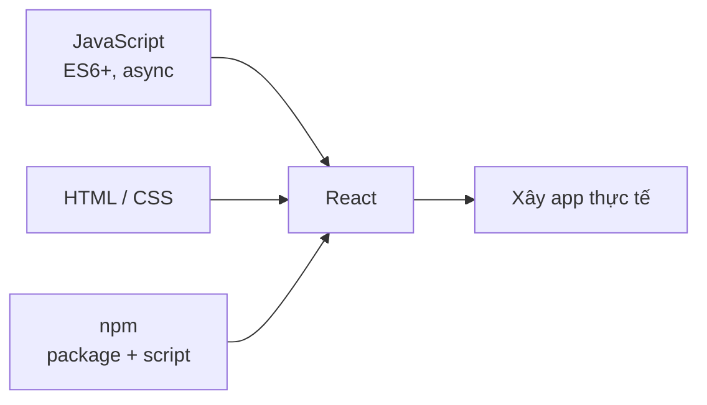
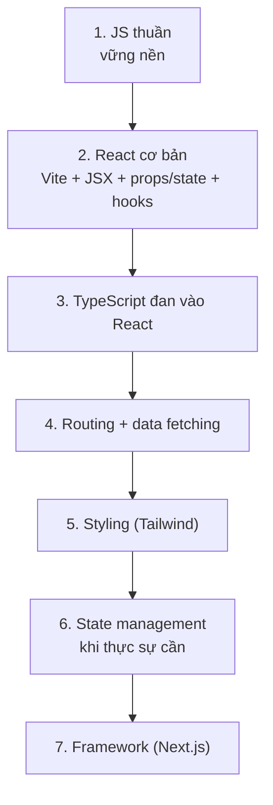

# Chuẩn bị trước khi học React

React là một **thư viện JavaScript** (bộ công cụ viết sẵn để dựng giao diện) giúp xây dựng giao diện web theo từng khối nhỏ tái sử dụng. Trước khi học React, bạn cần một nền tảng vững về JavaScript, HTML và CSS, vì React được xây dựng hoàn toàn dựa trên những kiến thức này. Bài này liệt kê những gì bạn nên nắm chắc và bộ công cụ (**tooling**) nên làm quen trước khi bắt đầu.

---

:::note[Ghi nhớ nhanh]

- ⭐ **React không phải điểm bắt đầu** — cần nắm chắc JavaScript, HTML/CSS và ES6+ trước, vì React xây hoàn toàn trên nền này.
- **JavaScript nền tảng** — thành thạo `map`/`filter`/`reduce`, destructuring, arrow function, `async`/`await`, ES Modules trước khi vào React.
- **TypeScript không bắt buộc nhưng rất khuyến nghị** — biết interface, generic, utility types (`Partial`, `Pick`, `Omit`).
- **JSX khác HTML** — `class` → `className`, `for` → `htmlFor`, inline style là object, attribute camelCase.
- ⭐ **Học theo lộ trình từng bước** — đừng dồn React + TypeScript + Tailwind + Redux + Next.js cùng lúc; mỗi bước build dự án thật.

:::

---

## Mục lục

- [Yêu cầu nền tảng](#yêu-cầu-nền-tảng)
- [JavaScript checklist](#javascript-checklist)
- [TypeScript checklist](#typescript-checklist)
- [HTML và CSS checklist](#html-và-css-checklist)
- [Tooling cần biết](#tooling-cần-biết)
- [Câu hỏi phỏng vấn](#câu-hỏi-phỏng-vấn)

---

## Yêu cầu nền tảng

React **không phải** là điểm bắt đầu của hành trình frontend. Trước khi
học React, bạn cần nắm chắc các kiến thức nền:

| Kiến thức | Tại sao? |
|-----------|----------|
| **JavaScript** | React là JS — không qua được JS thì học React rất khổ |
| **HTML / CSS** | JSX là syntax HTML-like, styling vẫn dùng CSS |
| **ES6+** | Arrow, destructuring, spread, module — dùng mọi lúc |
| **Promise / async** | Mọi data fetching đều async |
| **npm** | Cài thư viện, chạy script |

Các mảnh kiến thức nền đều là điều kiện đầu vào trước khi thực sự dựng app React:



---

## JavaScript checklist

Tham khảo [roadmap JavaScript](/docs/javascript/01-gioi-thieu/1_javascript-la-gi):

- [ ] Variables: `let`, `const`, scope, hoisting
- [ ] Data types & immutability
- [ ] Functions: arrow, default params, rest/spread, closures
- [ ] Array methods: `map`, `filter`, `reduce`, `find`, `forEach`
- [ ] Destructuring (array + object)
- [ ] Spread / Rest operator
- [ ] Template literals
- [ ] ES Modules (`import` / `export`)
- [ ] Promise, `async`/`await`, `fetch`
- [ ] DOM events, event bubbling
- [ ] `this` keyword (chỉ cần để đọc code cũ)

:::tip[Mẹo]

Không cần **thuộc lòng**, nhưng phải đủ **nhận biết** khi gặp trong code.
React code điển hình:

```jsx
function UserList({ users, onSelect }) {
  return (
    <ul>
      {users.map(user => (
        <li key={user.id} onClick={() => onSelect(user.id)}>
          {user.name}
        </li>
      ))}
    </ul>
  );
}
```

Trong 5 dòng có: destructuring, arrow, callback, `map`, template-like
(`{user.name}`), spread (key prop), event handler. Nếu chưa quen các
khái niệm này → quay lại JS trước.

:::

---

## TypeScript checklist

TypeScript **không bắt buộc** nhưng **rất khuyến nghị** với React. Tham
khảo [roadmap TypeScript](/docs/typescript/01-gioi-thieu/1_typescript-la-gi).

Tối thiểu cần biết:

- [ ] Primitive types, union, intersection
- [ ] Interface vs type alias
- [ ] Generic cơ bản (`<T>`)
- [ ] Utility types: `Partial`, `Pick`, `Omit`, `Record`
- [ ] Type assertion (`as`, `satisfies`)
- [ ] Type cho props component, event handler

---

## HTML và CSS checklist

- [ ] Semantic HTML (header, nav, main, section, article, footer)
- [ ] Form elements và `<label>` đúng cách
- [ ] Box model, Flexbox, Grid
- [ ] CSS selectors, specificity
- [ ] Responsive: media query, mobile-first
- [ ] CSS Variables (`--var`, `var()`)
- [ ] Pseudo-class, pseudo-element

:::info[Phân tích]

**JSX khác HTML ở vài điểm**:

- `class` → `className` (vì `class` là từ khoá JS).
- `for` → `htmlFor`.
- Inline style là object: `style={{ color: "red" }}`.
- Self-closing bắt buộc cho thẻ không có content: ``, `<br />`.
- Attribute camelCase: `onclick` → `onClick`, `tabindex` → `tabIndex`.

Khi chuyển từ HTML thuần sang JSX, nhớ những điểm này. Tools (Tailwind
IntelliSense, Prettier) sẽ tự động nhắc.

:::

---

## Tooling cần biết

- [ ] **npm / pnpm / yarn / bun** — cài package, chạy script.
- [ ] **Git** — version control cơ bản.
- [ ] **VSCode** — extension cần thiết:
  - ESLint
  - Prettier
  - Tailwind CSS IntelliSense (nếu dùng Tailwind)
  - Error Lens
  - GitLens
- [ ] **Browser DevTools** — Elements, Console, Network, React DevTools extension.
- [ ] **Terminal** — chạy command, navigation cơ bản.

Lộ trình học từng bước để tránh quá tải:



:::warning[Cần lưu ý]

**Đừng dồn học cùng lúc React + TypeScript + Tailwind + Redux + Next.js**
— quá tải sẽ làm bạn nản. Lộ trình hợp lý:

1. **JS thuần** → vững nền.
2. **React cơ bản** (Vite + JSX + props/state + hooks) → 2-3 tuần.
3. **TypeScript** đan vào React → 1-2 tuần.
4. **Routing + data fetching** → 1 tuần.
5. **Styling solution** (Tailwind) → vài ngày.
6. **State management** chỉ khi thực sự cần → vài ngày.
7. **Framework (Next.js)** khi đã quen React → 2-3 tuần.

Mỗi bước **build dự án thật** — không phải xem video. Học bằng cách
gặp bug và sửa, không phải bằng cách đọc.

:::

---

## Câu hỏi phỏng vấn

Những câu thường gặp về chủ đề này. Tự trả lời trước, rồi đối chiếu lại với nội dung phía trên.

1. Vì sao nói React "không phải điểm bắt đầu"? Kể năm tính năng ES6+ xuất hiện dày đặc trong code React hằng ngày.
2. `map`, `filter`, `reduce` khác `forEach` ở điểm nào? Vì sao render danh sách trong JSX luôn dùng `map` mà không bao giờ dùng `forEach`?
3. Destructuring hoạt động ra sao với object lồng nhau và giá trị mặc định? Viết lại `function C(props)` thành dạng destructure kèm default.
4. Toán tử spread tạo bản sao nông (`shallow copy`) — điều đó nghĩa là gì và vì sao nó là cái bẫy khi cập nhật state dạng object lồng nhau?
5. `closure` là gì? Giải thích vì sao closure là gốc rễ của lỗi `stale state` mà bạn sẽ gặp khi học `useEffect`.
6. Arrow function khác function thường ở cách xử lý `this` như thế nào? Điều đó liên quan gì tới việc phải bind method trong class component?
7. `var`, `let`, `const` khác nhau ở scope và hoisting ra sao? `TDZ` là gì?
8. `Promise` và `async`/`await` liên hệ thế nào? Vì sao `fetch` KHÔNG reject khi server trả về 404 hay 500, và bạn phải kiểm tra gì?
9. `ES Modules` khác `CommonJS` ở đâu? Phân biệt named export và default export, cái nào thân thiện hơn với `tree-shaking` và vì sao?
10. Giải thích `event bubbling` và `capturing`. React gắn event listener lên từng phần tử hay lên gốc ứng dụng, và `synthetic event` là gì?
11. Kể ít nhất năm điểm JSX khác HTML. Vì sao `class` phải viết thành `className` và `for` thành `htmlFor`?
12. JSX được biên dịch thành cái gì trước khi trình duyệt chạy? Vì sao code cũ phải `import React` ở đầu file còn code mới thì không?
13. Style nội tuyến trong JSX là một object — viết `background-color: red` như thế nào và vì sao React chọn `camelCase` cho tên thuộc tính?
14. TypeScript có bắt buộc với React không? Nêu ba lợi ích cụ thể mà TypeScript mang lại khi làm việc với props và event handler.
15. `interface` khác `type` ở những điểm nào? Khi nào bạn chọn cái nào để khai báo props?
16. Các utility type `Partial`, `Pick`, `Omit`, `Record` giải quyết bài toán gì? Cho một ví dụ dùng `Omit` khi kế thừa props của thẻ HTML gốc.
17. `as` khác `satisfies` ra sao? Vì sao lạm dụng `as` là dấu hiệu xấu?
18. Semantic HTML và accessibility ảnh hưởng thế nào tới cách bạn viết component? Ghép `label` với input đúng cách trong JSX ra sao?
19. `npm`, `pnpm`, `yarn`, `bun` khác nhau ở đâu? File lock dùng để làm gì, và `dependencies` khác `devDependencies` thế nào?
20. React DevTools cho bạn thấy điều gì mà DevTools thường của trình duyệt không thấy được? Bạn dùng nó để tìm nguyên nhân render thừa ra sao?
21. Vì sao không nên học React + TypeScript + Tailwind + Redux + Next.js cùng lúc? Bạn sẽ sắp xếp lộ trình cho một người mới thế nào và vì sao mỗi bước phải kèm dự án thật?
