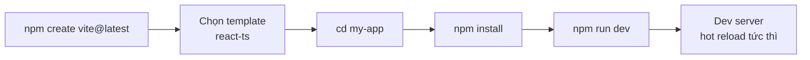
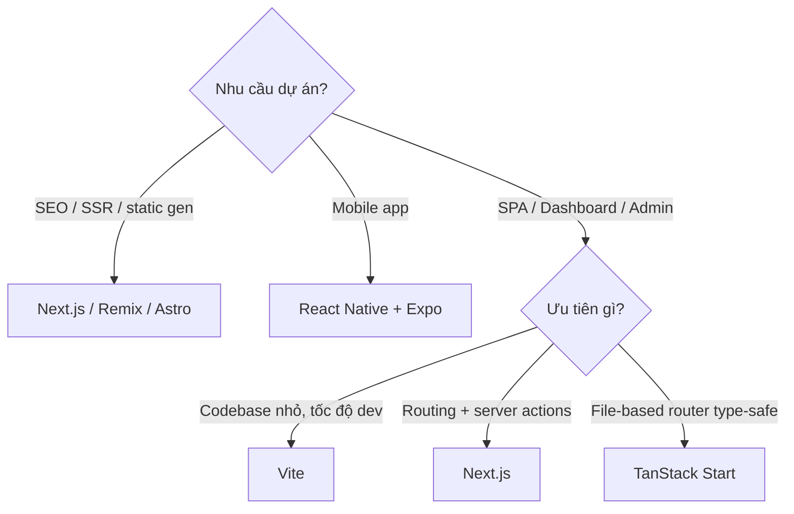

# CLI Tools để tạo project React

**CLI tools** (công cụ chạy bằng dòng lệnh trong terminal) giúp tạo nhanh một dự án React đã cấu hình sẵn, thay vì phải thiết lập thủ công từ đầu. Chỉ với một câu lệnh, bạn có ngay cấu trúc thư mục, file cấu hình và các package cần thiết để bắt đầu code. Bài này so sánh các công cụ phổ biến (Vite, Next.js, Bun) và giúp bạn chọn đúng công cụ cho từng loại dự án.

---

:::note[Ghi nhớ nhanh]

- ⭐ **Năm 2026 chỉ còn 2 lựa chọn chính: Vite và Next.js** — chọn Vite cho SPA/dashboard, Next.js cho website cần SEO/SSR.
- **Vite** — nhanh nhờ native ES Module + esbuild, dùng `npm create vite@latest my-app -- --template react-ts`.
- **Next.js** — framework full-stack, hỗ trợ SSR/SSG/App Router/Server Components, hợp SaaS và website công ty.
- **Bun create** — cực nhanh (`bun create vite my-app`), tương thích API Node.js.
- ⭐ **CRA đã bị deprecate từ 2023** — không bao giờ tạo project mới bằng Create React App.

:::

---

## Mục lục

- [Tổng quan](#tổng-quan)
- [Vite](#vite)
- [Next.js CLI](#nextjs-cli)
- [Bun create](#bun-create)
- [Create React App (CRA - Legacy)](#create-react-app-cra---legacy)
- [Khi nào chọn cái nào?](#khi-nào-chọn-cái-nào)

---

## Tổng quan

| Tool | Tốc độ | Khuyến nghị | Khi nào? |
|------|--------|-------------|----------|
| **Vite** | Rất nhanh | **Có** | SPA, dashboard, tool nội bộ |
| **Next.js** | Nhanh | **Có** | Website công ty, SaaS, có SEO |
| **Bun create** | Cực nhanh | Có | Project mới, thử nghiệm |
| **CRA** | Chậm | **Không** | Legacy, đã deprecated |

Năm 2026, **Vite** và **Next.js** là 2 lựa chọn chính.

---

## Vite

[Vite](https://vitejs.dev) — bundler nhanh, dùng esbuild + Rollup, hot
reload tức thì.

Tạo project:

```bash
npm create vite@latest my-app -- --template react-ts
cd my-app
npm install
npm run dev
```

Các bước tạo và chạy một dự án Vite theo trình tự:



Template phổ biến:

- `react` — JavaScript
- `react-ts` — TypeScript (khuyến nghị)
- `react-swc` — SWC compiler (nhanh hơn Babel)
- `react-swc-ts` — SWC + TypeScript

Structure mặc định:

```
my-app/
├── public/           # static files
├── src/
│   ├── App.tsx
│   ├── main.tsx     # entry
│   └── assets/
├── index.html       # root HTML
├── vite.config.ts
├── tsconfig.json
└── package.json
```

:::info[Phân tích]

**Tại sao Vite nhanh hơn Webpack/CRA?**

1. **Dev mode**: Vite serve file qua **native ES Module** trong browser
   — không cần bundle toàn bộ codebase. Mỗi file được transform on-demand.
2. **Pre-bundle dependencies**: chỉ bundle thư viện `node_modules` 1 lần
   bằng esbuild (Go binary, nhanh hơn JS 10-100x).
3. **HMR thông minh**: chỉ rebuild file thay đổi, không touch tree.
4. **Build production**: dùng Rollup với code splitting, tree-shaking
   chuẩn ES Module.

Webpack/CRA bundle toàn bộ trước khi serve → chậm khi codebase lớn.
Vite chỉ làm việc thật sự cần → scale tốt cho project lớn.

:::

---

## Next.js CLI

[Next.js](https://nextjs.org) — framework full-stack React của Vercel,
hỗ trợ SSR/SSG/ISR, App Router, Server Components.

```bash
npx create-next-app@latest my-app
```

Wizard hỏi:

- TypeScript? → Yes
- ESLint? → Yes
- Tailwind? → tùy
- `src/` directory? → tùy
- App Router? → **Yes** (React 19 + Server Components)
- Turbopack? → Yes (nhanh hơn Webpack)
- Custom import alias? → `@/*`

Structure (App Router):

```
my-app/
├── app/
│   ├── layout.tsx
│   ├── page.tsx
│   └── globals.css
├── public/
├── next.config.ts
└── package.json
```

---

## Bun create

[Bun](https://bun.sh) — runtime + bundler + package manager bằng Zig,
nhanh hơn Node + npm rất nhiều.

```bash
bun create vite my-app
# Hoặc
bun create next-app my-app
```

Bun có template riêng cho React:

```bash
bun create react ./my-app
```

:::tip[Mẹo]

Bun có **API tương thích với Node.js** + nhanh hơn 3-4x. Khi tạo project
mới, dùng `bun` cho package install thay vì `npm` — nhanh hơn nhiều
lần:

```bash
bun install   # thay vì npm install
bun add react
bun run dev
```

Nếu lib không tương thích Bun runtime, vẫn build/dev được — chỉ là tốc
độ npm install bình thường.

:::

---

## Create React App (CRA - Legacy)

```bash
npx create-react-app my-app
```

:::warning[Cần lưu ý]

**CRA đã được Facebook deprecate chính thức từ 2023**. React docs đã gỡ
khỏi trang Get Started.

Vấn đề của CRA:

- Webpack chậm, không update lên Webpack 5 hiện đại.
- Không hỗ trợ ES Module native.
- HMR yếu.
- Không có code splitting tự động tốt.
- Cộng đồng không maintain.

**Không bao giờ** tạo project mới với CRA. Đề xuất:

- SPA → **Vite**.
- App lớn / cần SSR → **Next.js**.
- Migrate khỏi CRA cũ → chạy `vite-plugin-react-swc` hoặc `nx migrate`.

:::

---

## Khi nào chọn cái nào?

```
┌─ Cần SEO / SSR / static gen? ─ YES → Next.js / Remix / Astro
│
├─ Mobile app? ─ YES → React Native + Expo
│
└─ SPA / Dashboard / Admin?
   ├─ Cần TanStack Start (file-based router)? → TanStack Start
   ├─ Codebase nhỏ, ưu tiên tốc độ dev? → Vite
   └─ Cần routing + server actions? → Next.js
```

Cùng cây quyết định trên dưới dạng sơ đồ:



:::info[Phân tích]

**TanStack Start** (2024+) là framework mới đáng chú ý:

- File-based router type-safe (TanStack Router).
- SSR / streaming.
- Cùng team với TanStack Query, Form, Table.
- Tích hợp tốt với React 19 features.

Đang stage early — production-ready dần. Khi quyết định framework, cân
nhắc:

- **Maturity**: Next.js > Remix > TanStack Start > Astro (cho React app).
- **Ecosystem**: Next.js > Remix > TanStack Start.
- **DX (developer experience)**: Vite > TanStack Start > Next.js.

:::

:::tip[Mẹo]

**Quick start commands cheatsheet:**

```bash
# Vite + React + TS
npm create vite@latest my-app -- --template react-ts

# Vite + React + SWC (build nhanh hơn)
npm create vite@latest my-app -- --template react-swc-ts

# Next.js
npx create-next-app@latest my-app

# Astro với React integration
npm create astro@latest my-app -- --template basics
npx astro add react

# Remix (React Router v7)
npx create-remix@latest my-app

# Với Bun (nhanh nhất)
bun create vite my-app -- --template react-ts
```

:::
