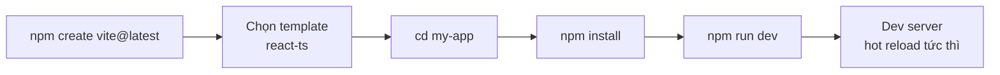
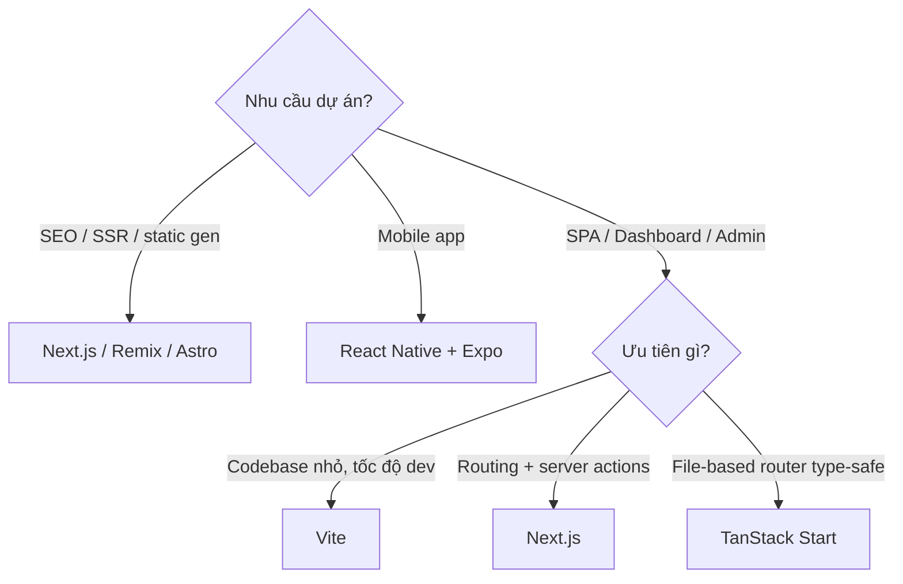

# CLI Tools để tạo project React

**CLI tools** (công cụ chạy bằng dòng lệnh trong terminal) giúp tạo nhanh một dự án React đã cấu hình sẵn, thay vì phải thiết lập thủ công từ đầu. Chỉ với một câu lệnh, bạn có ngay cấu trúc thư mục, file cấu hình và các package cần thiết để bắt đầu code. Bài này so sánh các công cụ phổ biến (Vite, Next.js, Bun) và giúp bạn chọn đúng công cụ cho từng loại dự án.

[](pathname:///img/react/cli-tools.webp)

---

:::note[Ghi nhớ nhanh]

- ⭐ **Năm 2026 chỉ còn 2 lựa chọn chính: Vite và Next.js** — chọn Vite cho SPA/dashboard, Next.js cho website cần SEO/SSR.
- **Vite** — nhanh nhờ native ES Module + esbuild, dùng `npm create vite@latest my-app -- --template react-ts`.
- **Next.js** — framework full-stack, hỗ trợ SSR/SSG/App Router/Server Components, hợp SaaS và website công ty.
- **Bun create** — cực nhanh (`bun create vite my-app`), tương thích API Node.js.
- ⭐ **CRA đã bị deprecate từ 2023** — không bao giờ tạo project mới bằng Create React App.

:::

---

## Mục lục

- [Tổng quan](#tổng-quan)
- [Vite](#vite)
- [Next.js CLI](#nextjs-cli)
- [Bun create](#bun-create)
- [Create React App (CRA - Legacy)](#create-react-app-cra---legacy)
- [Khi nào chọn cái nào?](#khi-nào-chọn-cái-nào)
- [Câu hỏi phỏng vấn](#câu-hỏi-phỏng-vấn)

---

## Tổng quan

| Tool | Tốc độ | Khuyến nghị | Khi nào? |
|------|--------|-------------|----------|
| **Vite** | Rất nhanh | **Có** | SPA, dashboard, tool nội bộ |
| **Next.js** | Nhanh | **Có** | Website công ty, SaaS, có SEO |
| **Bun create** | Cực nhanh | Có | Project mới, thử nghiệm |
| **CRA** | Chậm | **Không** | Legacy, đã deprecated |

Năm 2026, **Vite** và **Next.js** là 2 lựa chọn chính.

---

## Vite

[Vite](https://vitejs.dev) — bundler nhanh, dùng esbuild + Rollup, hot
reload tức thì.

Tạo project:

```bash
npm create vite@latest my-app -- --template react-ts
cd my-app
npm install
npm run dev
```

Các bước tạo và chạy một dự án Vite theo trình tự:



Template phổ biến:

- `react` — JavaScript
- `react-ts` — TypeScript (khuyến nghị)
- `react-swc` — SWC compiler (nhanh hơn Babel)
- `react-swc-ts` — SWC + TypeScript

Structure mặc định:

```
my-app/
├── public/           # static files
├── src/
│   ├── App.tsx
│   ├── main.tsx     # entry
│   └── assets/
├── index.html       # root HTML
├── vite.config.ts
├── tsconfig.json
└── package.json
```

:::info[Phân tích]

**Tại sao Vite nhanh hơn Webpack/CRA?**

1. **Dev mode**: Vite serve file qua **native ES Module** trong browser
   — không cần bundle toàn bộ codebase. Mỗi file được transform on-demand.
2. **Pre-bundle dependencies**: chỉ bundle thư viện `node_modules` 1 lần
   bằng esbuild (Go binary, nhanh hơn JS 10-100x).
3. **HMR thông minh**: chỉ rebuild file thay đổi, không touch tree.
4. **Build production**: dùng Rollup với code splitting, tree-shaking
   chuẩn ES Module.

Webpack/CRA bundle toàn bộ trước khi serve → chậm khi codebase lớn.
Vite chỉ làm việc thật sự cần → scale tốt cho project lớn.

:::

---

## Next.js CLI

[Next.js](https://nextjs.org) — framework full-stack React của Vercel,
hỗ trợ SSR/SSG/ISR, App Router, Server Components.

```bash
npx create-next-app@latest my-app
```

Wizard hỏi:

- TypeScript? → Yes
- ESLint? → Yes
- Tailwind? → tùy
- `src/` directory? → tùy
- App Router? → **Yes** (React 19 + Server Components)
- Turbopack? → Yes (nhanh hơn Webpack)
- Custom import alias? → `@/*`

Structure (App Router):

```
my-app/
├── app/
│   ├── layout.tsx
│   ├── page.tsx
│   └── globals.css
├── public/
├── next.config.ts
└── package.json
```

---

## Bun create

[Bun](https://bun.sh) — runtime + bundler + package manager bằng Zig,
nhanh hơn Node + npm rất nhiều.

```bash
bun create vite my-app
# Hoặc
bun create next-app my-app
```

Bun có template riêng cho React:

```bash
bun create react ./my-app
```

:::tip[Mẹo]

Bun có **API tương thích với Node.js** + nhanh hơn 3-4x. Khi tạo project
mới, dùng `bun` cho package install thay vì `npm` — nhanh hơn nhiều
lần:

```bash
bun install   # thay vì npm install
bun add react
bun run dev
```

Nếu lib không tương thích Bun runtime, vẫn build/dev được — chỉ là tốc
độ npm install bình thường.

:::

---

## Create React App (CRA - Legacy)

```bash
npx create-react-app my-app
```

:::warning[Cần lưu ý]

**CRA đã được Facebook deprecate chính thức từ 2023**. React docs đã gỡ
khỏi trang Get Started.

Vấn đề của CRA:

- Webpack chậm, không update lên Webpack 5 hiện đại.
- Không hỗ trợ ES Module native.
- HMR yếu.
- Không có code splitting tự động tốt.
- Cộng đồng không maintain.

**Không bao giờ** tạo project mới với CRA. Đề xuất:

- SPA → **Vite**.
- App lớn / cần SSR → **Next.js**.
- Migrate khỏi CRA cũ → chạy `vite-plugin-react-swc` hoặc `nx migrate`.

:::

---

## Khi nào chọn cái nào?

```
┌─ Cần SEO / SSR / static gen? ─ YES → Next.js / Remix / Astro
│
├─ Mobile app? ─ YES → React Native + Expo
│
└─ SPA / Dashboard / Admin?
   ├─ Cần TanStack Start (file-based router)? → TanStack Start
   ├─ Codebase nhỏ, ưu tiên tốc độ dev? → Vite
   └─ Cần routing + server actions? → Next.js
```

Cùng cây quyết định trên dưới dạng sơ đồ:



:::info[Phân tích]

**TanStack Start** (2024+) là framework mới đáng chú ý:

- File-based router type-safe (TanStack Router).
- SSR / streaming.
- Cùng team với TanStack Query, Form, Table.
- Tích hợp tốt với React 19 features.

Đang stage early — production-ready dần. Khi quyết định framework, cân
nhắc:

- **Maturity**: Next.js > Remix > TanStack Start > Astro (cho React app).
- **Ecosystem**: Next.js > Remix > TanStack Start.
- **DX (developer experience)**: Vite > TanStack Start > Next.js.

:::

:::tip[Mẹo]

**Quick start commands cheatsheet:**

```bash
# Vite + React + TS
npm create vite@latest my-app -- --template react-ts

# Vite + React + SWC (build nhanh hơn)
npm create vite@latest my-app -- --template react-swc-ts

# Next.js
npx create-next-app@latest my-app

# Astro với React integration
npm create astro@latest my-app -- --template basics
npx astro add react

# Remix (React Router v7)
npx create-remix@latest my-app

# Với Bun (nhanh nhất)
bun create vite my-app -- --template react-ts
```

:::

---

## Câu hỏi phỏng vấn

Những câu thường gặp về chủ đề này. Tự trả lời trước, rồi bấm **Xem đáp án** để đối chiếu.

**1. Vì sao tới năm 2026 chỉ còn hai lựa chọn chính là `Vite` và `Next.js`? Bạn dựa vào tiêu chí nào để chọn giữa hai cái đó?**

<details className="qa">
<summary>Xem đáp án</summary>

Thị trường đã phân hóa rõ: CRA bị deprecate từ 2023 vì Webpack chậm và không còn ai maintain, còn các lựa chọn khác hoặc quá non hoặc quá hẹp. Hai công cụ còn lại chia nhau hai bài toán khác nhau chứ không cạnh tranh trực tiếp:

- **Vite** là build tool thuần — cho bạn dev server cực nhanh và bản build tối ưu, không áp đặt kiến trúc. Hợp SPA, dashboard, admin, tool nội bộ.
- **Next.js** là framework full-stack — kèm routing, SSR/SSG/ISR, Server Components, API route. Hợp website công ty, SaaS, thương mại điện tử.

Tiêu chí chọn:

- **Cần SEO hoặc HTML render sẵn từ server?** → Next.js.
- **App sau đăng nhập, không cần SEO?** → Vite.
- **Cần backend nhẹ nằm chung dự án?** → Next.js.
- **Muốn tự do chọn router, data layer, deploy tĩnh ở đâu cũng được?** → Vite.

</details>

**2. Vite nhanh hơn `Create React App` nhờ cơ chế nào? Giải thích sự khác biệt giữa dev server dựa trên `native ES Module` và bundler truyền thống.**

<details className="qa">
<summary>Xem đáp án</summary>

Bundler truyền thống (Webpack trong CRA) phải **bundle toàn bộ codebase trước khi serve** dòng đầu tiên: đọc mọi file, dựng đồ thị phụ thuộc, transform, gộp lại. Codebase càng lớn thì thời gian khởi động càng tăng tuyến tính — dự án vài nghìn file có thể chờ hàng chục giây tới vài phút.

Vite lật ngược cách làm: trình duyệt hiện đại đã hỗ trợ **native ES Module**, nên Vite chỉ cần serve `index.html`, trình duyệt tự gửi request cho từng module qua `import`. Vite **transform on-demand** đúng file được yêu cầu. Khởi động gần như tức thì bất kể kích thước dự án.

Ba yếu tố tăng tốc chính:

- Dev server không bundle, chỉ transform từng file khi được hỏi.
- **Pre-bundle** thư viện trong `node_modules` một lần bằng esbuild (viết bằng Go, nhanh hơn công cụ JS rất nhiều).
- **HMR** chỉ rebuild đúng file đổi, không đụng cả cây phụ thuộc.

</details>

**3. Vì sao Vite dùng `esbuild` cho môi trường dev nhưng lại dùng `Rollup` cho bản build production? Hai công cụ này mạnh ở chỗ nào khác nhau?**

<details className="qa">
<summary>Xem đáp án</summary>

Hai giai đoạn có mục tiêu khác nhau nên chọn công cụ khác nhau.

| | esbuild (dev) | Rollup (production) |
|---|---|---|
| Viết bằng | Go, chạy song song | JavaScript |
| Mạnh ở | Tốc độ transform và pre-bundle | Chất lượng output |
| Tính năng | Tối giản, nhanh là chính | Code splitting, tree-shaking tinh vi, hệ plugin trưởng thành |

Ở **dev**, thứ quan trọng nhất là **độ trễ** — bạn sửa file và muốn thấy kết quả ngay. Chất lượng bundle không quan trọng vì code không đi ra người dùng. esbuild nhanh hơn công cụ JS hàng chục lần nên hoàn hảo cho việc này.

Ở **production**, ngược lại, biên dịch lâu vài chục giây không sao, nhưng mỗi KB gửi xuống người dùng đều tốn tiền và thời gian tải. Rollup cho code splitting và tree-shaking chuẩn ES Module tốt hơn, cùng hệ sinh thái plugin phong phú để tối ưu. (Vite đang dần chuyển sang Rolldown — bản Rollup viết bằng Rust — để có cả hai.)

</details>

**4. `Dependency pre-bundling` của Vite giải quyết vấn đề gì? Nếu không có nó thì dev server gặp hiện tượng gì với thư viện nhiều module nhỏ?**

<details className="qa">
<summary>Xem đáp án</summary>

Pre-bundling giải quyết hai vấn đề:

- **Chuẩn hóa định dạng**: nhiều package trong `node_modules` vẫn xuất bản dạng CommonJS hoặc UMD, mà trình duyệt chỉ hiểu ES Module. Vite chuyển hết về ESM một lần bằng esbuild.
- **Giảm số lượng request**: gộp hàng trăm file nhỏ của một thư viện thành một module duy nhất.

Nếu **không** pre-bundle, mỗi `import` sâu bên trong thư viện trở thành một HTTP request riêng. Một thư viện như `lodash-es` gồm hơn 600 module nhỏ sẽ khiến trình duyệt bắn ra hàng trăm request chỉ để load một trang — dev server tắc nghẽn, tab Network đầy ắp, và trang load chậm hẳn dù code của bạn chỉ vài file. Đây chính là nhược điểm kinh điển của mô hình "unbundled dev server".

Kết quả pre-bundle được cache trong `node_modules/.vite` và chỉ chạy lại khi danh sách dependency thay đổi.

</details>

**5. CRA bị deprecate vì những lý do gì? Đang giữ một dự án CRA thật, bạn lên kế hoạch migrate sang Vite ra sao và rủi ro lớn nhất nằm ở đâu?**

<details className="qa">
<summary>Xem đáp án</summary>

Lý do CRA bị khai tử: Webpack chậm và không được nâng cấp theo kịp thời đại, không hỗ trợ ES Module native, HMR yếu, code splitting tự động kém, và quan trọng nhất là **không còn ai maintain** — React docs đã gỡ CRA khỏi trang Get Started.

Kế hoạch migrate sang Vite:

1. Cài `vite` và `@vitejs/plugin-react`, gỡ `react-scripts`.
2. Chuyển `public/index.html` ra thư mục gốc, bỏ các placeholder kiểu `%PUBLIC_URL%`, thêm thẻ script trỏ tới entry.
3. Viết `vite.config.ts`, khai báo alias và proxy tương đương cấu hình cũ.
4. Đổi biến môi trường: `process.env.REACT_APP_X` thành `import.meta.env.VITE_X`, đổi tiền tố trong file `.env`.
5. Đổi script trong `package.json` sang `vite`, `vite build`, `vite preview`.
6. Đổi đuôi file có JSX thành `.jsx` / `.tsx` — Vite không transform JSX trong file `.js`.

**Rủi ro lớn nhất** là các phụ thuộc chỉ chạy được với CommonJS hoặc dựa vào global của Node (`process`, `Buffer`) mà Webpack tự polyfill còn Vite thì không; kèm theo đó là hệ thống test (Jest) thường phải chuyển sang Vitest.

</details>

**6. `eject` trong CRA nghĩa là gì và vì sao gần như luôn nên tránh? Vite giải quyết nhu cầu tuỳ biến đó bằng cách nào?**

<details className="qa">
<summary>Xem đáp án</summary>

CRA giấu toàn bộ cấu hình Webpack, Babel, ESLint bên trong package `react-scripts`. Lệnh `npm run eject` **đổ hết cấu hình đó ra dự án của bạn** để chỉnh tay.

Vì sao nên tránh:

- **Không thể hoàn tác** — một khi eject là xong, không quay lại được.
- Bạn nhận về hàng nghìn dòng cấu hình Webpack phức tạp mà mình không viết và phải **tự bảo trì mãi mãi**.
- Mất khả năng nâng cấp: `react-scripts` phát hành bản mới cũng không dùng được nữa, phải tự cập nhật từng package một.

Vite tiếp cận ngược lại: cấu hình **công khai ngay từ đầu** trong `vite.config.ts` — một file ngắn, dễ đọc. Muốn thêm alias, proxy, biến môi trường, plugin thì sửa vài dòng, không cần eject gì cả. Hệ plugin tương thích Rollup nên mở rộng thoải mái mà vẫn nhận được bản cập nhật từ upstream.

</details>

**7. Khi nào bạn chọn Next.js thay vì Vite? `SEO` đóng vai trò gì trong quyết định này, và vì sao SPA thuần lại yếu về SEO?**

<details className="qa">
<summary>Xem đáp án</summary>

Chọn Next.js khi: cần SEO, cần HTML render sẵn từ server, cần routing kèm layout lồng nhau, cần một lớp backend nhẹ (API route, server action), hoặc muốn tận dụng Server Components để giảm bundle. Điển hình là website công ty, blog, thương mại điện tử, landing page, SaaS có phần công khai.

Chọn Vite khi ứng dụng nằm **sau màn hình đăng nhập** — dashboard, admin, tool nội bộ — nơi Google không cần index, và bạn muốn tự do chọn router, deploy tĩnh lên bất kỳ CDN nào.

**Vì sao SPA thuần yếu về SEO:** HTML ban đầu của SPA gần như rỗng, chỉ có một `div` gốc; toàn bộ nội dung do JavaScript tạo ra sau khi tải và chạy bundle. Crawler phải render JS mới thấy nội dung — tốn thêm một lượt xử lý, dễ bị trì hoãn hoặc bỏ sót, và các bot khác (mạng xã hội khi tạo preview link) thường không chạy JS nên chỉ thấy trang trắng. Ngoài ra thẻ meta và Open Graph đặt bằng JS thường tới quá muộn.

</details>

**8. Phân biệt `CSR`, `SSR`, `SSG` và `ISR`. Cho một ví dụ trang thực tế hợp với từng kiểu.**

<details className="qa">
<summary>Xem đáp án</summary>

| Kiểu | HTML được tạo ở đâu và lúc nào | Ví dụ phù hợp |
|---|---|---|
| **CSR** (Client-Side Rendering) | Trong trình duyệt, sau khi tải JS | Dashboard quản trị, tool nội bộ sau đăng nhập |
| **SSR** (Server-Side Rendering) | Trên server, **mỗi request** | Trang cá nhân hóa theo người dùng, kết quả tìm kiếm, giỏ hàng |
| **SSG** (Static Site Generation) | Lúc **build**, thành file tĩnh | Trang tài liệu, blog, landing page |
| **ISR** (Incremental Static Regeneration) | Lúc build, rồi **tự tạo lại nền** sau một khoảng thời gian | Trang sản phẩm thương mại điện tử, trang tin cập nhật định kỳ |

Đánh đổi chính: CSR nhẹ cho server nhưng người dùng thấy nội dung chậm và SEO kém; SSG nhanh nhất và rẻ nhất nhưng nội dung chỉ mới tới thời điểm build; SSR luôn tươi nhưng tốn tài nguyên server mỗi lần truy cập; ISR là dung hòa — tốc độ của tĩnh với độ tươi chấp nhận được. Một ứng dụng thật thường trộn nhiều kiểu, chọn theo từng route.

</details>

**9. `React Server Components` là gì và khác `SSR` truyền thống ra sao? Nó ảnh hưởng thế nào tới kích thước bundle gửi xuống trình duyệt?**

<details className="qa">
<summary>Xem đáp án</summary>

**React Server Components (RSC)** là loại component **chỉ chạy trên server**. Chúng không bao giờ được gửi xuống trình duyệt dưới dạng JavaScript — React gửi đi mô tả kết quả render đã được serialize, rồi ghép vào cây UI phía client.

Khác biệt với SSR truyền thống:

| | SSR truyền thống | Server Components |
|---|---|---|
| Component chạy ở đâu | Server render HTML, rồi **chạy lại trên client** để hydrate | Chỉ chạy trên server |
| JS của component | Vẫn nằm trong bundle client | Không có trong bundle |
| Đơn vị | Cả trang | Từng component |

Tác động lên bundle rất lớn: mọi thư viện chỉ dùng trong Server Component — thư viện parse markdown, format ngày tháng, client database, SDK nặng — **biến mất hoàn toàn** khỏi bundle người dùng tải về. Component cần tương tác (state, event handler, hook trình duyệt) thì đánh dấu `"use client"` và mới đi vào bundle. Mô hình này khuyến khích đẩy phần nặng lên server, giữ phần client mỏng nhất có thể.

</details>

**10. Câu lệnh `npm create vite@latest my-app` thực chất làm gì phía sau? `@latest` có ý nghĩa gì và vì sao nên có nó?**

<details className="qa">
<summary>Xem đáp án</summary>

`npm create <x>` là bí danh của `npm init <x>`, và nó được dịch thành: tải package `create-<x>` (ở đây là `create-vite`) rồi **chạy file thực thi của package đó** — tương đương `npx create-vite`. Package này là một scaffolder: hỏi bạn tên dự án và template, chép bộ file mẫu ra thư mục, sinh `package.json`, `vite.config.ts`, `index.html`, rồi kết thúc. Nó **không** cài dependency — đó là lý do sau đó bạn vẫn phải chạy `npm install`.

`@latest` là **specifier phiên bản**, yêu cầu npm lấy đúng bản mới nhất được publish. Nên có vì npx/npm có cache: nếu từng chạy lệnh này vài tháng trước mà không ghi rõ phiên bản, bạn có thể vô tình dùng lại bản `create-vite` cũ trong cache và tạo ra dự án với template lỗi thời. Thêm `@latest` đảm bảo luôn scaffold bằng bản mới nhất.

Phần `-- --template react-ts` dùng dấu `--` để nói với npm rằng các tham số phía sau là dành cho `create-vite`, không phải cho npm.

</details>

**11. Template `react-ts` khác `react-swc-ts` ở điểm nào? Khi nào việc đổi sang `SWC` thực sự đáng?**

<details className="qa">
<summary>Xem đáp án</summary>

Khác biệt duy nhất là **công cụ transform JSX/TypeScript**:

- `react-ts` dùng `@vitejs/plugin-react`, chạy qua **Babel**.
- `react-swc-ts` dùng `@vitejs/plugin-react-swc`, chạy qua **SWC** — viết bằng Rust nên nhanh hơn Babel đáng kể.

Cấu trúc dự án, cấu hình, code React sinh ra hoàn toàn giống nhau; bạn đổi qua lại bằng cách thay plugin trong `vite.config.ts`.

Khi nào đổi sang SWC thực sự đáng:

- Codebase **lớn**, nhiều nghìn file — chênh lệch thời gian transform mới cảm nhận rõ.
- CI build chạy thường xuyên và bạn muốn cắt thời gian pipeline.
- Máy phát triển yếu, HMR bắt đầu có độ trễ.

Khi nào **không** nên đổi: dự án đang phụ thuộc vào plugin Babel cụ thể — một số thư viện styling hoặc macro chỉ có bản Babel, chuyển sang SWC sẽ mất tính năng. Với dự án nhỏ, khác biệt gần như không cảm nhận được, nên cứ dùng mặc định.

</details>

**12. `npx` khác `npm install -g` thế nào? Vì sao dùng `npx` cho công cụ scaffold lại an toàn hơn?**

<details className="qa">
<summary>Xem đáp án</summary>

`npm install -g` cài package **vĩnh viễn** vào thư mục global của hệ thống, tạo lệnh dùng được ở mọi nơi. `npx` **tải tạm** package (hoặc dùng bản đã có trong `node_modules` của dự án), chạy một lần rồi thôi — không để lại gì trong global.

Vì sao `npx` an toàn hơn cho công cụ scaffold:

- **Luôn là bản mới nhất**: scaffolder cài global rất dễ bị bỏ quên. Bạn có thể đang dùng `create-next-app` từ hai năm trước và không biết, sinh ra dự án với cấu hình lỗi thời.
- **Không rác hệ thống**: công cụ scaffold chỉ dùng đúng một lần cho mỗi dự án, chẳng có lý do gì phải nằm lại máy mãi mãi.
- **Không xung đột phiên bản** giữa các dự án cần bản khác nhau.
- **Không cần quyền admin**, tránh cảnh `sudo npm install -g`.

Lưu ý: `npx` sẽ tự tải package từ registry nếu chưa có, nên vẫn phải chắc chắn gõ đúng tên package — gõ nhầm có thể rơi vào package giả mạo.

</details>

**13. `HMR` khác `live reload` ra sao? Vì sao HMR giữ được state của component còn reload thì không?**

<details className="qa">
<summary>Xem đáp án</summary>

**Live reload** phát hiện file thay đổi rồi **tải lại cả trang** — giống bạn bấm F5. Đơn giản nhưng mọi thứ trong bộ nhớ trình duyệt bị xóa sạch.

**HMR (Hot Module Replacement)** chỉ **thay thế đúng module vừa sửa** ngay trong ứng dụng đang chạy, không reload trang.

Vì sao HMR giữ được state: state của React sống trong bộ nhớ JavaScript của tab. Reload trang nghĩa là hủy toàn bộ context JS và khởi tạo lại từ đầu — mọi `useState`, form đang điền dở, modal đang mở, vị trí cuộn đều mất. HMR thì giữ nguyên cây React đang sống, chỉ đánh tráo phần code của component rồi yêu cầu render lại; React Fast Refresh biết cách khớp component cũ với bản mới và **bảo toàn state** của nó.

Thực tế HMR không phải lúc nào cũng giữ được: sửa export không phải component, đổi chữ ký của hook, hay sửa file ngoài tầm Fast Refresh sẽ khiến Vite rơi về full reload.

</details>

**14. Biến môi trường trong Vite (`import.meta.env`, tiền tố `VITE_`) khác CRA (`process.env.REACT_APP_`) thế nào? Vì sao đặt khoá bí mật vào đó là lỗi bảo mật nghiêm trọng?**

<details className="qa">
<summary>Xem đáp án</summary>

| | Vite | CRA |
|---|---|---|
| Cách truy cập | `import.meta.env.VITE_API_URL` | `process.env.REACT_APP_API_URL` |
| Tiền tố bắt buộc | `VITE_` | `REACT_APP_` |
| Nền tảng | Chuẩn ES Module | Giả lập biến của Node trong trình duyệt |

Cả hai dùng tiền tố để **cố tình chặn** việc lộ nhầm những biến khác trong môi trường shell — chỉ biến có tiền tố đúng mới được đưa vào code client.

Vì sao đặt khóa bí mật vào đó là lỗi nghiêm trọng: đây **không phải biến môi trường lúc chạy**. Lúc build, công cụ **thay thế tĩnh** từng chỗ xuất hiện bằng giá trị thật — chuỗi bí mật nằm nguyên văn trong file JavaScript mà mọi người dùng tải về. Bất kỳ ai mở DevTools, xem source hoặc tìm chuỗi trong bundle đều đọc được. Nhiều vụ lộ khóa API thanh toán, khóa dịch vụ đám mây đến từ đúng lỗi này.

Quy tắc: mọi thứ trong bundle client là **công khai**. Khóa bí mật phải nằm trên server, client gọi qua API trung gian.

</details>

**15. Gọi API bị chặn `CORS` khi chạy dev — bạn dùng tính năng nào của Vite để xử lý, và vì sao cách đó không áp dụng được cho production?**

<details className="qa">
<summary>Xem đáp án</summary>

Dùng **dev server proxy** của Vite, khai báo trong `vite.config.ts`:

```ts
export default defineConfig({
  server: {
    proxy: {
      "/api": {
        target: "http://localhost:8080",
        changeOrigin: true,
      },
    },
  },
});
```

Cơ chế: frontend gọi `/api/users` — cùng origin với dev server nên trình duyệt **không kích hoạt kiểm tra CORS**. Dev server nhận request rồi chuyển tiếp tới backend **từ phía server**, mà CORS là chính sách của trình duyệt nên request server-tới-server không bị chặn.

Vì sao không dùng được cho production: `vite.config.ts` chỉ điều khiển **dev server**, một tiến trình Node chạy trên máy bạn. Bản build production chỉ là tập file tĩnh (HTML, JS, CSS) — không có tiến trình Vite nào chạy để proxy cả.

Giải pháp production: cấu hình CORS header đúng trên backend, hoặc đặt reverse proxy (Nginx, Caddy, CDN) phục vụ cả frontend và API dưới cùng một domain.

</details>

**16. `Bun` nhanh hơn ở những khâu nào? Rủi ro khi đưa Bun vào một dự án production hôm nay là gì?**

<details className="qa">
<summary>Xem đáp án</summary>

Bun viết bằng Zig và dùng engine JavaScriptCore, nhanh hơn rõ rệt ở:

- **Cài package** (`bun install`) — thường nhanh hơn npm nhiều lần, đây là khâu cảm nhận rõ nhất.
- **Khởi động runtime** — thời gian boot thấp, hợp script và CLI.
- **Chạy test** bằng test runner tích hợp sẵn.
- **Transpile TypeScript/JSX** — làm trực tiếp, không cần bước cấu hình riêng.

Rủi ro khi đưa vào production:

- **Tương thích chưa hoàn toàn** với Node: Bun tuyên bố tương thích API Node nhưng vẫn có góc khuất, thư viện dùng native addon hoặc API ít gặp có thể hỏng.
- **Hệ sinh thái deploy**: không phải nền tảng hosting nào cũng có runtime Bun sẵn.
- **Công cụ phụ trợ** — APM, profiler, debugger — vẫn xoay quanh Node là chính.
- **Đội ngũ**: ít người quen debug khi có sự cố.

Lối đi an toàn phổ biến: dùng Bun làm **package manager và test runner** cho nhanh, nhưng vẫn chạy production trên Node.

</details>

**17. So sánh `Remix`, `Astro` và `TanStack Start` — mỗi cái mạnh cho loại sản phẩm nào?**

<details className="qa">
<summary>Xem đáp án</summary>

| | Triết lý | Mạnh cho |
|---|---|---|
| **Remix** (nay hợp nhất vào React Router v7) | Bám sát nền web: form, loader, action, progressive enhancement | Ứng dụng nhiều thao tác dữ liệu — form phức tạp, CRUD, luồng nhiều bước |
| **Astro** | Gửi **không JavaScript** theo mặc định, kiến trúc island, đa framework | Trang thiên về nội dung — blog, tài liệu, marketing, tạp chí |
| **TanStack Start** | File-based router **type-safe** hoàn toàn, SSR/streaming, cùng nhà với TanStack Query/Table/Form | SPA giàu tương tác muốn thêm SSR, dự án TypeScript coi trọng an toàn kiểu |

Diễn giải: Remix hợp khi ứng dụng xoay quanh mutation và bạn muốn code hoạt động tốt cả khi JS chưa tải xong. Astro hợp khi hiệu năng tải trang là ưu tiên số một và phần tương tác chỉ lác đác vài chỗ. TanStack Start mới hơn, hấp dẫn khi đã dùng sẵn hệ TanStack và muốn router hiểu kiểu dữ liệu đến tận tham số URL — bù lại độ trưởng thành và hệ sinh thái còn sau Next.js.

</details>

**18. Ba tiêu chí `maturity`, `ecosystem`, `DX` thường xung đột nhau. Với một team mới toanh và deadline gấp, bạn ưu tiên tiêu chí nào và vì sao?**

<details className="qa">
<summary>Xem đáp án</summary>

Với team mới và deadline gấp, thứ tự ưu tiên nên là **maturity → ecosystem → DX**.

Lý do: khi gặp bug lúc 11 giờ đêm trước ngày demo, thứ cứu bạn không phải là cú pháp đẹp mà là **đã có người gặp đúng lỗi này và viết câu trả lời trên mạng**. Công cụ trưởng thành nghĩa là ít bug lạ, breaking change hiếm, tài liệu đầy đủ; hệ sinh thái lớn nghĩa là thư viện auth, UI, biểu đồ, thanh toán đều có bản tích hợp sẵn thay vì phải tự viết. Hai thứ đó trực tiếp cắt giảm thời gian.

**DX** đáng giá nhưng nó trả lãi theo thời gian dài, còn rủi ro công nghệ non trả giá ngay: một tính năng chưa hỗ trợ có thể chặn cả sprint mà không có đường vòng.

Ngược lại, khi team đã dày dạn, dự án dài hơi và không chịu sức ép ra mắt, đặt DX lên trước là hợp lý — công cụ mượt giúp giữ tốc độ ổn định qua nhiều tháng. Nói ngắn gọn: deadline gấp thì chọn thứ **chán mà chắc**.

</details>

**19. `Code splitting` và `lazy loading` — Vite làm sẵn phần nào, còn phần nào lập trình viên phải chủ động làm? Bạn đo kích thước bundle bằng công cụ gì?**

<details className="qa">
<summary>Xem đáp án</summary>

**Vite (qua Rollup) làm sẵn:**

- Tách `node_modules` khỏi code ứng dụng thành chunk riêng, giúp cache tốt hơn giữa các lần deploy.
- Tree-shaking loại bỏ export không dùng nhờ phân tích tĩnh ES Module.
- Tạo chunk riêng và chèn sẵn preload cho mỗi `import()` động bạn viết.
- Băm tên file để cache lâu dài an toàn.

**Bạn phải chủ động:**

- Quyết định **chỗ nào cần tách** — thường là theo route, bằng `React.lazy` kèm `import()` động và bọc trong `Suspense`.
- Trì hoãn các thư viện nặng chỉ dùng ở một màn hình (trình soạn thảo, thư viện biểu đồ, bản đồ).
- Chọn thư viện gọn, tránh import cả package khi chỉ cần một hàm.
- Tinh chỉnh `manualChunks` khi cách chia mặc định không hợp lý.

**Công cụ đo:** `rollup-plugin-visualizer` để xem treemap của bundle Vite, cảnh báo chunk lớn ngay trong log build, trang Bundlephobia để tra kích thước một package trước khi cài, và tab Coverage cùng Lighthouse trong DevTools để xem bao nhiêu JS tải về mà không hề chạy.

</details>

**20. Một dự án cần cả trang marketing chuẩn SEO lẫn một dashboard nội bộ nặng tương tác — bạn tách thành mấy ứng dụng, dùng công cụ nào cho mỗi phần, và đánh đổi là gì?**

<details className="qa">
<summary>Xem đáp án</summary>

Hai phần có yêu cầu trái ngược nhau: marketing cần HTML render sẵn, tải nhanh, index tốt; dashboard nằm sau đăng nhập, không cần SEO nhưng cần tương tác mượt và state phong phú.

**Phương án A — tách hai ứng dụng.** Next.js (hoặc Astro) cho `www` với SSG/ISR; Vite + React cho `app` dưới subdomain riêng, deploy tĩnh sau CDN.

- *Được*: mỗi bên tối ưu đúng bài toán; build nhanh; deploy độc lập, dashboard hỏng không kéo sập trang bán hàng; team có thể làm song song.
- *Mất*: hai codebase, dễ lệch design system nếu không tách UI ra package dùng chung; cần xử lý phiên đăng nhập xuyên subdomain; hai pipeline CI/CD.

**Phương án B — một ứng dụng Next.js duy nhất**, route marketing dùng SSG, route dashboard đặt trong route group riêng, render phía client.

- *Được*: một repo, một hệ thiết kế, một lần đăng nhập, chia sẻ type và component dễ dàng.
- *Mất*: build chậm dần khi dashboard phình to; mọi thay đổi nhỏ đều deploy lại cả trang marketing.

Thực tế: team nhỏ chọn B cho đơn giản; khi dashboard đủ lớn hoặc có team riêng thì tách sang A.

</details>
