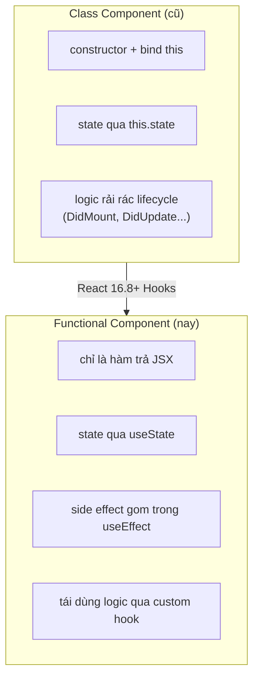
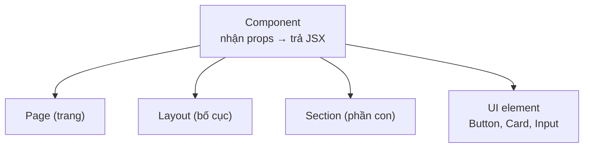

# Functional Components

**Functional component** (component viết dưới dạng hàm JavaScript) là cách hiện đại và phổ biến nhất để tạo một khối giao diện trong React. Đó chỉ là một hàm nhận **props** (dữ liệu truyền vào từ component cha) và trả về **JSX** (đoạn mô tả giao diện trông giống HTML). Bài này hướng dẫn cách khai báo functional component, truyền props, ghép các component lại với nhau và quy tắc đặt tên.

[](pathname:///img/react/functional-components.webp)

---

:::note[Ghi nhớ nhanh]

- ⭐ **Functional component chỉ là một hàm nhận props và trả về JSX** — cách viết chuẩn từ React 16.8+, gọn hơn class component.
- **Kết hợp Hooks** — dùng `useState`, `useEffect` để quản state và side effect ngay trong hàm; tái dùng logic qua custom hook.
- **Props là readonly** — không mutate trong component; muốn báo ngược lên cha thì dùng callback prop (`onClick`, `onChange`).
- **`children` là prop đặc biệt** — chứa nội dung giữa thẻ mở/đóng; React ưu tiên "composition over configuration".
- ⭐ **Đặt tên component PascalCase** (`UserCard`) và tránh `React.FC` — khai báo type props tường minh qua interface.

:::

---

## Mục lục

- [Vì sao dùng functional component?](#vì-sao-dùng-functional-component)
- [Component là gì?](#component-là-gì)
- [Functional Component cơ bản](#functional-component-cơ-bản)
- [Component nhận props](#component-nhận-props)
- [Composition và children](#composition-và-children)
- [Naming convention](#naming-convention)
- [Câu hỏi phỏng vấn](#câu-hỏi-phỏng-vấn)

---

## Vì sao dùng functional component?

**Vấn đề:** Class component dài dòng — phải có `constructor`, bind `this`, và
logic bị rải rác qua nhiều lifecycle method. Tái sử dụng logic stateful rất
khó, phải dùng HOC hoặc render props gây lồng nhau rối rắm:

```jsx
// Cách cũ — class component
class Counter extends React.Component {
  constructor(props) {
    super(props);
    this.state = { count: 0 };
    this.handleClick = this.handleClick.bind(this); // phải bind this
  }

  componentDidMount() {
    document.title = `Đã bấm ${this.state.count} lần`;
  }

  componentDidUpdate() {
    document.title = `Đã bấm ${this.state.count} lần`; // lặp lại logic
  }

  handleClick() {
    this.setState({ count: this.state.count + 1 });
  }

  render() {
    return <button onClick={this.handleClick}>{this.state.count}</button>;
  }
}
```

**Giải pháp:** Functional component chỉ là một hàm trả về JSX nên gọn hơn
hẳn. Kết hợp **Hooks** (`useState`, `useEffect`) để quản lý state và side
effect ngay trong hàm, và tái sử dụng logic qua **custom hook**. Đây là cách
viết chuẩn từ React 16.8+:

```jsx
import { useState, useEffect } from "react";

// Cách mới — functional component + Hooks
function Counter() {
  const [count, setCount] = useState(0);

  useEffect(() => {
    document.title = `Đã bấm ${count} lần`; // gom logic về một chỗ
  }, [count]);

  return <button onClick={() => setCount(count + 1)}>{count}</button>;
}
```

So sánh hai cách viết component và bước chuyển đổi từ React 16.8:



:::tip[Dùng thực tế]

- **Mọi component UI mới** — luôn bắt đầu bằng functional component.
- **Chia nhỏ UI** — tách màn hình thành nhiều hàm component gọn, dễ đọc.
- **Tái dùng logic** — bóc logic stateful ra **custom hook** (`useAuth`,
  `useFetch`) để xài lại nhiều nơi.
- **Code dễ test** — hàm thuần với props rõ ràng, dễ viết unit test hơn class.

:::

---

## Component là gì?

**Component** là khối **UI tái sử dụng**, nhận **input (props)** và trả về
**JSX (mô tả UI)**.

Mỗi component có thể là:

- **Page** — một trang.
- **Layout** — bố cục chung.
- **Section** — phần con của page.
- **UI element** — Button, Card, Input...

Các dạng component đều chung một khuôn: nhận props và trả về JSX:



```jsx
// Component đơn giản
function Welcome() {
  return <h1>Hello, React!</h1>;
}

// Dùng nó
<Welcome />
```

---

## Functional Component cơ bản

Một function trả về JSX **là** một component:

```jsx
function Greeting() {
  return <p>Xin chào</p>;
}

// Arrow function cũng được
const Greeting = () => <p>Xin chào</p>;

// Multi-line cần return tường minh
const Greeting = () => {
  return (
    <div>
      <h1>Title</h1>
      <p>Xin chào</p>
    </div>
  );
};
```

Component có thể trả về:

- JSX element (`<div>...</div>`).
- String, number, boolean (render text).
- Array của element.
- Fragment (`<>...</>`).
- `null` (không render gì).

---

## Component nhận props

**Props** = parameter của component, là object chứa dữ liệu từ parent.

```jsx
function Greeting(props) {
  return <p>Xin chào {props.name}</p>;
}

// Dùng
<Greeting name="An" />
<Greeting name="Bình" />
```

Destructure props (idiom phổ biến):

```jsx
function Greeting({ name, age }) {
  return <p>Xin chào {name}, {age} tuổi</p>;
}
```

Default value:

```jsx
function Greeting({ name = "bạn" }) {
  return <p>Xin chào {name}</p>;
}
```

Với TypeScript:

```tsx
interface GreetingProps {
  name: string;
  age?: number;
}

function Greeting({ name, age }: GreetingProps) {
  return <p>Xin chào {name} {age && `, ${age} tuổi`}</p>;
}
```

:::warning[Cần lưu ý]

**Props là readonly** — không được sửa trong component:

```jsx
function Greeting({ name }) {
  name = name.toUpperCase(); // KHÔNG nên — mutation props
  return <p>Hi {name}</p>;
}
```

Đúng cách — tạo biến mới:

```jsx
function Greeting({ name }) {
  const displayName = name.toUpperCase();
  return <p>Hi {displayName}</p>;
}
```

Quy tắc: **props từ trên xuống**, không bao giờ bottom-up. Muốn parent
biết thay đổi, dùng **callback prop** (`onChange`, `onClick`...).

:::

---

## Composition và children

`children` là **prop đặc biệt** — chứa nội dung giữa thẻ mở và đóng:

```jsx
function Card({ children }) {
  return <div className="card">{children}</div>;
}

// Dùng
<Card>
  <h1>Title</h1>
  <p>Body</p>
</Card>
```

Với TypeScript:

```tsx
import { ReactNode } from "react";

interface CardProps {
  title: string;
  children: ReactNode;
}

function Card({ title, children }: CardProps) {
  return (
    <div className="card">
      <h2>{title}</h2>
      <div>{children}</div>
    </div>
  );
}
```

:::info[Phân tích]

**Composition** là pattern tổ chức UI **mạnh nhất** trong React. Thay vì:

```jsx
// Tệ — quá nhiều prop config
<Card
  title="Hello"
  showHeader
  showFooter
  headerStyle="big"
  bodyText="..."
  footerButton="Save"
/>
```

Dùng composition:

```jsx
// Tốt — linh hoạt, dễ đọc
<Card>
  <Card.Header>Hello</Card.Header>
  <Card.Body>...</Card.Body>
  <Card.Footer>
    <Button>Save</Button>
  </Card.Footer>
</Card>
```

React khuyên: **"composition over configuration"**. Lý do:

- Parent control 100% layout, không bị "khoá" trong API của child.
- Reuse component dễ hơn — không phải predict mọi use case.
- TypeScript intellisense rõ — child có type cụ thể.

Pattern này dùng khắp nơi: **Radix UI**, **shadcn/ui**, **Mantine** đều
build trên composition.

:::

---

## Naming convention

| Quy tắc | Ví dụ |
|--------|-------|
| **PascalCase** cho component | `UserCard`, `LoginForm` |
| **camelCase** cho prop | `onClick`, `userName` |
| File name = component name | `UserCard.tsx` |
| Index file barrel | `index.ts` re-export |

:::tip[Mẹo]

**Quy tắc gọi component**:

- HTML tag → lowercase: `<div>`, `<input>`.
- Component → **PascalCase**: `<UserCard>`, `<Button>`.

JSX phân biệt qua chữ cái đầu:

```jsx
<button />  // HTML <button>
<Button />  // Component Button
```

Nếu đặt tên component lowercase:

```jsx
function userCard() { return <div /> }

<userCard /> // React coi là HTML <usercard>, không render component
```

→ Luôn PascalCase cho component. ESLint rule `react/jsx-pascal-case` sẽ
ép.

:::

:::warning[Cần lưu ý]

**Không nên dùng `React.FC`** trong code mới:

```tsx
// Tránh
const Button: React.FC<Props> = ({ children }) => <button>{children}</button>;

// Khuyến nghị
function Button({ children }: Props) {
  return <button>{children}</button>;
}
```

Lý do:

- `React.FC` ngầm thêm `children` vào type → khó kiểm soát (component
  không nhận children vẫn pass type-check).
- Không hỗ trợ generic component tốt.
- React docs đã loại bỏ khỏi example.

Khai báo type prop tường minh qua interface là pattern hiện đại nhất.

:::

---

## Câu hỏi phỏng vấn

Những câu thường gặp về chủ đề này. Tự trả lời trước, rồi bấm **Xem đáp án** để đối chiếu.

**1. Component là gì? Vì sao chia UI thành nhiều component nhỏ lại tốt hơn một component lớn?**

<details className="qa">
<summary>Xem đáp án</summary>

**Component** là khối UI tái sử dụng, nhận **input (props)** và trả về **JSX (mô tả UI)**. Nó có thể là cả một page, một layout, một section, hay chỉ là một UI element nhỏ như Button, Card, Input.

Vì sao chia nhỏ tốt hơn:

- **Dễ đọc** — mỗi hàm gọn, tên nói rõ nó làm gì; đọc component cha là thấy ngay cấu trúc màn hình.
- **Tái sử dụng** — một `Button` viết một lần, dùng khắp nơi.
- **Dễ test** — hàm nhỏ với props rõ ràng viết unit test đơn giản hơn nhiều so với một khối trăm dòng.
- **Tối ưu render** — React chỉ render lại nhánh thay đổi; component to thì mọi thay đổi nhỏ đều kéo theo cả khối.
- **Dễ chia việc** — nhiều người sửa nhiều file khác nhau, ít đụng độ khi merge.

Nhưng đừng cực đoan: tách ra chỉ để tách sẽ tạo ra hàng chục file bé xíu phải nhảy qua lại mới hiểu được một màn hình.

</details>

**2. `Functional component` là gì và khác `class component` ở những điểm nào về cú pháp, state và lifecycle?**

<details className="qa">
<summary>Xem đáp án</summary>

**Functional component** chỉ là một hàm JavaScript nhận props và trả về JSX.

| | Functional component | Class component |
|---|---|---|
| Cú pháp | Một hàm thuần | `class` kế thừa `React.Component`, có `render()` |
| `this` | Không dùng | Dùng khắp nơi, phải bind khi truyền method |
| State | `useState`, `useReducer` | `this.state` + `this.setState` |
| Side effect | `useEffect` gom theo mối quan tâm | Rải rác qua `componentDidMount`, `componentDidUpdate`, `componentWillUnmount` |
| Tái dùng logic stateful | Custom hook | HOC hoặc render props, dễ lồng nhau rối rắm |
| Độ dài | Ngắn hơn hẳn | Nhiều boilerplate: constructor, `super(props)`, bind |

Ví dụ điển hình trong bài: bộ đếm viết bằng class cần constructor, bind `this`, và lặp lại đúng một dòng cập nhật `document.title` ở cả `componentDidMount` lẫn `componentDidUpdate`; bản functional gom hết vào một `useEffect` với dependency `[count]`.

</details>

**3. Vì sao từ React 16.8 cộng đồng chuyển hẳn sang functional component + Hooks? Hooks giải quyết được vấn đề gì mà class không giải quyết nổi?**

<details className="qa">
<summary>Xem đáp án</summary>

Ba vấn đề cố hữu của class mà Hooks giải quyết:

- **Khó tái sử dụng logic stateful**. Trước Hooks, muốn chia sẻ logic có state (theo dõi kích thước cửa sổ, fetch dữ liệu, kiểm tra đăng nhập) chỉ có HOC và render props — cả hai đều bọc thêm tầng component, tạo ra "wrapper hell" trong DevTools và làm luồng props khó lần. **Custom hook** chia sẻ logic mà không đẻ thêm component nào.
- **Logic bị xé lẻ theo lifecycle**. Một mối quan tâm duy nhất (ví dụ đăng ký và hủy đăng ký một subscription) nằm ở hai method cách xa nhau, trong khi hai mối quan tâm chẳng liên quan lại bị nhét chung vào `componentDidMount`. `useEffect` gom theo **mối quan tâm**, kèm hàm cleanup ngay bên cạnh.
- **`this` gây nhầm lẫn**. Phải nhớ bind, dễ quên, và là rào cản với người mới.

Ngoài ra hàm dễ tối ưu và minify hơn class, và React đang phát triển các tính năng mới (Server Components, hook mới) tập trung cho function component.

</details>

**4. `props` là gì? Vì sao props chỉ đọc, và điều gì xảy ra nếu bạn gán lại giá trị cho props bên trong component?**

<details className="qa">
<summary>Xem đáp án</summary>

**Props** là tham số của component — một object chứa dữ liệu do component cha truyền xuống.

Props **chỉ đọc** vì React xây trên nguyên tắc component phải là **hàm thuần**: cùng props thì luôn cho cùng kết quả. Nếu component được phép sửa props, kết quả render sẽ phụ thuộc vào lịch sử chạy, việc suy luận luồng dữ liệu trở nên bất khả thi, và React không còn cách nào so sánh props cũ với mới để quyết định render.

Nếu bạn gán lại: với biến đã destructure, bạn chỉ đổi **biến cục bộ** — component cha không biết gì, và lần render tới giá trị bị ghi đè lại từ đầu, nên thay đổi "biến mất" một cách khó hiểu. Nguy hiểm hơn là **mutate** object/array trong props: bạn sửa luôn dữ liệu của cha, gây bug rất khó truy vết.

```jsx
// Sai
function Greeting({ name }) {
  name = name.toUpperCase();
  return <p>Hi {name}</p>;
}

// Đúng — tạo biến mới
function Greeting({ name }) {
  const displayName = name.toUpperCase();
  return <p>Hi {displayName}</p>;
}
```

</details>

**5. Dữ liệu trong React chảy một chiều từ trên xuống. Vậy khi component con cần báo thay đổi ngược lên cha thì làm thế nào? Cho ví dụ với `onChange`.**

<details className="qa">
<summary>Xem đáp án</summary>

Dùng **callback prop**: cha truyền xuống một **hàm**, con gọi hàm đó khi có sự kiện. Dữ liệu vẫn đi một chiều xuống dưới, chỉ có *tín hiệu* đi ngược lên — cha là người thực sự cập nhật state.

```jsx
function SearchInput({ value, onChange }) {
  return <input value={value} onChange={(e) => onChange(e.target.value)} />;
}

function Page() {
  const [query, setQuery] = useState("");
  return (
    <>
      <SearchInput value={query} onChange={setQuery} />
      <p>Đang tìm: {query}</p>
    </>
  );
}
```

Đây chính là pattern **controlled component**: state nằm ở cha (nguồn sự thật duy nhất), con chỉ hiển thị `value` và báo lên qua `onChange`. Quy ước đặt tên là tiền tố `on` cho prop (`onChange`, `onSelect`, `onSubmit`) và `handle` cho hàm xử lý bên trong.

Khi state cần dùng chung ở nhiều nhánh xa nhau, kỹ thuật tương ứng là **lifting state up** — đẩy state lên tổ tiên chung gần nhất.

</details>

**6. Giá trị mặc định qua destructuring khác `defaultProps` ra sao? Vì sao `defaultProps` không còn được khuyến nghị cho function component?**

<details className="qa">
<summary>Xem đáp án</summary>

Default qua destructuring là cơ chế **của JavaScript**, xử lý ngay trong chữ ký hàm:

```jsx
function Greeting({ name = "bạn", size = "md" }) {
  return <p>Xin chào {name}</p>;
}
```

`defaultProps` là cơ chế **của React**, gán vào thuộc tính tĩnh của component và được React áp dụng trước khi gọi hàm render.

Vì sao `defaultProps` không còn được khuyến nghị cho function component:

- React đã chính thức **deprecate** nó cho function component; console cảnh báo và tương lai sẽ gỡ bỏ. Nó vẫn còn hiệu lực cho class component.
- Nó tách giá trị mặc định ra khỏi chỗ khai báo props, đọc code phải nhảy xuống cuối file mới biết mặc định là gì.
- Nó cần thêm một bước xử lý lúc chạy, trong khi cú pháp JS không tốn gì.
- Tích hợp với TypeScript kém mượt hơn hẳn.

Điểm chung cần nhớ: cả hai chỉ kích hoạt khi giá trị là `undefined`, còn `null` được truyền vào thì giữ nguyên `null`.

</details>

**7. `children` là gì và nó có phải một prop bình thường không? Có thể truyền nó dưới dạng thuộc tính tường minh được không?**

<details className="qa">
<summary>Xem đáp án</summary>

`children` là nội dung nằm **giữa thẻ mở và thẻ đóng** của component. Nó **là một prop hoàn toàn bình thường** — chỉ đặc biệt ở chỗ JSX có cú pháp riêng để truyền nó, giúp code trông giống HTML.

```jsx
function Card({ children }) {
  return <div className="card">{children}</div>;
}
```

Và **có**, truyền tường minh được, hai cách dưới đây tương đương:

```jsx
<Card>Nội dung</Card>
<Card children="Nội dung" />
```

Trên thực tế không ai viết cách thứ hai vì nó khó đọc và mất đi lợi thế lồng nhau. Lưu ý nếu viết cả hai cùng lúc, nội dung giữa thẻ sẽ **ghi đè** thuộc tính `children`.

Vài điểm cần biết thêm: `children` có thể là một phần tử, một mảng, một chuỗi, `null`, hay thậm chí là một **hàm** (nền tảng của render prop). Kiểu TypeScript thường dùng là `ReactNode`.

</details>

**8. "Composition over configuration" nghĩa là gì? So sánh một `Card` nhận mười prop cấu hình với một `Card` dùng `children` — mỗi cách gãy ở đâu?**

<details className="qa">
<summary>Xem đáp án</summary>

Nguyên tắc: thay vì cố nhồi mọi biến thể vào **cờ cấu hình**, hãy để người dùng **ghép** các mảnh UI lại với nhau.

```jsx
// Configuration — mọi thứ qua prop
<Card title="Hello" showHeader showFooter headerStyle="big" bodyText="..." footerButton="Save" />

// Composition — người dùng tự ghép
<Card>
  <Card.Header>Hello</Card.Header>
  <Card.Body>...</Card.Body>
  <Card.Footer><Button>Save</Button></Card.Footer>
</Card>
```

**Cách cấu hình gãy ở đâu:** bạn phải đoán trước mọi tình huống sử dụng. Mỗi yêu cầu mới lại đẻ thêm một prop, đến lúc cần một nút thứ hai trong footer hoặc một icon cạnh tiêu đề thì API không đỡ nổi. Danh sách prop phình ra, nhiều tổ hợp mâu thuẫn nhau, bên trong đầy điều kiện lồng nhau.

**Cách composition gãy ở đâu:** người dùng có thể ghép sai cấu trúc hoặc quên một phần bắt buộc; kiểu dữ liệu khó ràng buộc chặt; nếu cần chia sẻ state giữa các phần con thì phải thêm Context nội bộ. Bù lại nó linh hoạt hơn nhiều — đó là lý do Radix UI, shadcn/ui, Mantine đều xây theo hướng này.

</details>

**9. Ngoài `children`, còn cách nào truyền JSX vào component (slot prop, `render prop`)? Khi nào render prop hợp hơn children?**

<details className="qa">
<summary>Xem đáp án</summary>

Ba cách chính:

- **`children`** — nội dung giữa hai thẻ, dùng cho "một khoảng trống" duy nhất.
- **Slot prop** — truyền JSX qua prop có tên, dùng khi component có **nhiều vị trí** cần lấp: `<Modal header={<Title />} footer={<Actions />} />`.
- **Render prop** — truyền một **hàm** trả về JSX; component gọi hàm đó và truyền dữ liệu nội bộ vào.

```jsx
function List({ items, renderItem }) {
  return <ul>{items.map((it) => <li key={it.id}>{renderItem(it)}</li>)}</ul>;
}

<List items={users} renderItem={(u) => <b>{u.name}</b>} />
```

**Render prop hợp hơn khi component cha cần *nhận dữ liệu từ bên trong* con mới quyết định được render gì** — ví dụ từng phần tử của danh sách, trạng thái đóng/mở của một dropdown, kết quả đo kích thước. `children` thuần là JSX tĩnh, không nhận được dữ liệu đó. (Cũng có thể viết `children` dưới dạng hàm để đạt hiệu quả tương tự.)

Lưu ý: từ khi có Hooks, phần lớn nhu cầu **chia sẻ logic** nên chuyển sang custom hook; render prop giờ chủ yếu dành cho việc tùy biến **hiển thị**.

</details>

**10. Vì sao React chọn composition thay vì kế thừa (`inheritance`) để tái sử dụng? Logic dùng chung giữa các component thì tái sử dụng bằng cách nào?**

<details className="qa">
<summary>Xem đáp án</summary>

React docs nói thẳng: họ **chưa từng gặp** trường hợp nào nên dùng kế thừa giữa các component. Lý do:

- Kế thừa tạo **ràng buộc cứng** giữa cha và con; sửa lớp cha có thể làm vỡ mọi lớp con mà không ai lường trước.
- Nó chỉ mô hình hóa được quan hệ "là một", trong khi UI thường là quan hệ "chứa" và "kết hợp".
- Phân cấp sâu rất khó lần dấu: một hành vi đến từ tầng nào trong chuỗi kế thừa?
- Composition linh hoạt hơn — ghép hai ba mảnh lại dễ hơn nhiều so với đẻ ra một lớp con mới cho từng tổ hợp.

Còn **tái sử dụng logic** thì dùng:

- **Custom hook** — cách chuẩn hiện nay cho logic có state hoặc side effect (`useAuth`, `useFetch`, `useDebounce`).
- **Hàm tiện ích thuần** — cho logic không liên quan tới React.
- **Context** — cho dữ liệu dùng chung xuyên nhiều tầng.
- **HOC / render prop** — vẫn còn trong codebase cũ, nhưng custom hook thay thế gần hết.

Nguyên tắc: **ghép UI bằng composition, ghép logic bằng hook**.

</details>

**11. Vì sao tên component bắt buộc phải `PascalCase`? JSX phân biệt `button` và `Button` dựa vào đâu, và nếu đặt tên thường thì React render ra cái gì?**

<details className="qa">
<summary>Xem đáp án</summary>

JSX phân biệt hoàn toàn dựa vào **chữ cái đầu tiên**:

- Bắt đầu bằng **chữ thường** → biên dịch thành **chuỗi**, coi là thẻ HTML gốc: `<button />` thành `createElement("button")`.
- Bắt đầu bằng **chữ hoa** → biên dịch thành **tham chiếu biến**, coi là component: `<Button />` thành `createElement(Button)`.

Quy ước này tồn tại vì JSX cần một cách rõ ràng, không mơ hồ để biết bạn đang nói tới thẻ HTML hay component của mình, mà không phải giữ một danh sách mọi tên thẻ HTML.

Nếu đặt tên component viết thường:

```jsx
function userCard() { return <div /> }

<userCard /> // React hiểu là thẻ HTML tên "usercard"
```

Kết quả: React tạo ra một phần tử DOM lạ tên `usercard` — trang không hiển thị gì như mong đợi, và thường kèm cảnh báo về thẻ không hợp lệ. Hàm `userCard` không bao giờ được gọi.

ESLint rule `react/jsx-pascal-case` giúp chặn lỗi này từ sớm.

</details>

**12. Component phải là hàm thuần (`pure`) nghĩa là gì? Cho một ví dụ vi phạm tính thuần và hậu quả của nó khi React render lại.**

<details className="qa">
<summary>Xem đáp án</summary>

**Thuần** nghĩa là: với cùng một bộ props, state và context, component luôn trả về cùng một kết quả JSX, và **không gây tác động phụ trong lúc render** — không sửa biến bên ngoài, không mutate props, không ghi vào DOM, không gọi API.

Ví dụ vi phạm:

```jsx
let total = 0;

function Item({ price }) {
  total += price;          // mutate biến ngoài ngay trong render
  return <li>{price} — cộng dồn: {total}</li>;
}
```

Hậu quả: React có quyền render lại bất cứ lúc nào, render nhiều lần rồi bỏ kết quả đi, hoặc render trước rồi mới commit. Trong **Strict Mode** ở môi trường dev, React cố tình gọi hàm component hai lần để phơi bày đúng loại bug này — `total` sẽ cộng gấp đôi. Với các tính năng concurrent, kết quả còn khó đoán hơn: cùng dữ liệu nhưng hiển thị khác nhau giữa các lần render.

Cách đúng: mọi tác động phụ đưa vào `useEffect` hoặc event handler; giá trị tính toán thì derive từ props/state ngay trong render, hoặc lưu bằng `useState` / `useRef` nếu cần bền vững.

</details>

**13. Vì sao không nên định nghĩa một component bên trong thân của component khác? Bug biểu hiện ra sao khi làm vậy?**

<details className="qa">
<summary>Xem đáp án</summary>

Vì mỗi lần component cha render, thân hàm chạy lại và tạo ra một **hàm component hoàn toàn mới** — một tham chiếu khác với lần trước.

```jsx
function Parent() {
  const [n, setN] = useState(0);

  function Child() {          // hàm mới mỗi lần Parent render
    const [text, setText] = useState("");
    return <input value={text} onChange={(e) => setText(e.target.value)} />;
  }

  return <><button onClick={() => setN(n + 1)}>{n}</button><Child /></>;
}
```

React so sánh cây theo **kiểu (type)** của element. Vì `Child` lần này khác `Child` lần trước, React kết luận đây là component khác loại nên **hủy toàn bộ cây con cũ và mount lại từ đầu**.

Biểu hiện bug:

- **State bên trong bị reset** mỗi lần cha render — chữ đang gõ dở biến mất, checkbox tự bỏ chọn.
- **Mất focus** khỏi ô input đang nhập.
- `useEffect` chạy lại liên tục vì component unmount rồi mount lại.
- Hiệu năng kém và animation bị giật.

Cách sửa: đưa component ra **ngoài**, ở cấp module, rồi truyền dữ liệu qua props.

</details>

**14. Vì sao React khuyên tránh `React.FC` trong code mới? Hai nhược điểm cụ thể của nó là gì?**

<details className="qa">
<summary>Xem đáp án</summary>

```tsx
// Tránh
const Button: React.FC<Props> = ({ children }) => <button>{children}</button>;

// Khuyến nghị
function Button({ children }: Props) {
  return <button>{children}</button>;
}
```

Hai nhược điểm chính:

- **Ngầm thêm `children` vào kiểu props**. Một component không hề nhận children vẫn qua được type-check khi ai đó truyền children vào — đúng cái lỗi mà TypeScript đáng lẽ phải bắt. (Từ React 18 và `@types/react` mới, hành vi ngầm này đã bị gỡ, nhưng nhiều codebase vẫn mang thói quen cũ.)
- **Hỗ trợ generic component kém**. Viết một component nhận kiểu tổng quát, ví dụ một `List<T>`, bằng `React.FC` rất vụng; khai báo hàm bình thường thì tự nhiên.

Ngoài ra nó còn dài dòng hơn mà chẳng đem lại lợi ích gì — kiểu trả về đã được TypeScript suy luận sẵn. React docs cũng đã bỏ `React.FC` khỏi mọi ví dụ. Cách hiện đại là khai báo props qua `interface` hoặc `type` rồi chú thích thẳng vào tham số.

</details>

**15. Khai báo kiểu cho `children`: `ReactNode`, `ReactElement` và `JSX.Element` khác nhau thế nào? Khi nào bắt buộc phải dùng loại hẹp hơn?**

<details className="qa">
<summary>Xem đáp án</summary>

| Kiểu | Bao gồm những gì |
|---|---|
| `ReactNode` | Rộng nhất: element, chuỗi, số, mảng, `null`, `undefined`, `boolean`, Fragment |
| `ReactElement` | Chỉ object element do JSX hoặc `createElement` tạo ra; có generic cho props |
| `JSX.Element` | Gần như `ReactElement<any, any>` — dạng cụ thể nằm trong namespace `JSX` |

Thực tế `JSX.Element` là trường hợp riêng hẹp hơn của `ReactElement`, còn `ReactNode` bao trùm cả hai cộng thêm mọi thứ React render được.

**Mặc định dùng `ReactNode` cho `children`** vì người dùng có thể truyền chuỗi, số, mảng hoặc `null`:

```tsx
interface CardProps {
  title: string;
  children: ReactNode;
}
```

**Khi nào cần hẹp hơn:** khi component thực sự thao tác trên element — ví dụ dùng `React.Children.map` kèm `cloneElement` để chèn thêm props vào từng con, hoặc đọc `child.props`. Lúc đó nhận vào một chuỗi sẽ vỡ ở runtime, nên khai báo `ReactElement` để TypeScript chặn từ đầu. Với trường hợp chỉ có đúng một phần tử con, cũng nên khai báo hẹp lại thay vì `ReactNode`.

</details>

**16. Component muốn trả về nhiều phần tử ngang cấp thì làm sao? `Fragment` giải quyết vấn đề gì và khi nào phải viết dạng đầy đủ thay vì cú pháp rút gọn?**

<details className="qa">
<summary>Xem đáp án</summary>

JSX yêu cầu mỗi biểu thức chỉ có **một node gốc**, vì nó biên dịch thành một lời gọi hàm và hàm chỉ trả về được một giá trị. Muốn trả nhiều phần tử ngang cấp thì bọc chúng trong **Fragment**.

Fragment gom các phần tử lại về mặt cú pháp nhưng **không tạo thêm node DOM nào**. Điều này quan trọng khi thẻ bọc thừa sẽ phá layout — đặc biệt với Flexbox, Grid, hoặc cấu trúc bắt buộc như `table`, `tr`, `ul`.

```jsx
function Row() {
  return (
    <>
      <td>A</td>
      <td>B</td>
    </>
  );
}
```

**Khi nào phải viết dạng đầy đủ `<React.Fragment>`:** khi cần truyền prop `key` — điển hình là lúc render danh sách mà mỗi mục gồm nhiều phần tử ngang cấp. Cú pháp rút gọn không nhận được thuộc tính nào.

```jsx
items.map((it) => (
  <React.Fragment key={it.id}>
    <dt>{it.term}</dt>
    <dd>{it.desc}</dd>
  </React.Fragment>
))
```

Component cũng có thể trả về một mảng phần tử (mỗi phần tử cần `key`), nhưng Fragment dễ đọc hơn.

</details>

**17. Dấu hiệu nào cho thấy một component đã quá to và cần tách? Bạn tách theo tiêu chí nào — theo UI hay theo trách nhiệm?**

<details className="qa">
<summary>Xem đáp án</summary>

Dấu hiệu cần tách:

- Phải cuộn nhiều lần mới đọc hết một hàm; JSX lồng sâu hơn bốn năm tầng.
- Quá nhiều `useState` rời rạc, hoặc một `useEffect` làm nhiều việc chẳng liên quan.
- Khó đặt tên cho component vì nó làm quá nhiều thứ.
- Có những khối JSX lặp lại gần giống nhau.
- Đổi một chi tiết nhỏ khiến cả màn hình render lại.
- Viết test phải dựng quá nhiều thứ mới chạy được một trường hợp.

Tiêu chí tách: **ưu tiên theo trách nhiệm**, UI chỉ là dấu hiệu bề mặt. Hỏi "phần này thay đổi vì lý do gì?" — những mảnh thay đổi vì cùng một lý do thì ở chung, khác lý do thì tách. Tách theo UI thuần túy dễ đẻ ra component chỉ là cái vỏ, phải xuyên hàng chục prop qua nhiều tầng.

Cách chia hiệu quả trong thực tế: **component hiển thị** (nhận props, không biết dữ liệu từ đâu) tách khỏi **component có logic** (nắm state, gọi API); còn logic thuần thì bóc sang **custom hook** để component chỉ còn phần JSX.

</details>

**18. Một component nhận quá nhiều props, có nhiều prop dạng cờ bật/tắt. Bạn tái cấu trúc thế nào cho gọn?**

<details className="qa">
<summary>Xem đáp án</summary>

Nhiều cờ boolean là mùi code điển hình: `n` cờ tạo ra `2^n` tổ hợp, phần lớn vô nghĩa hoặc mâu thuẫn, và chỗ gọi đọc như một câu đố.

Các hướng xử lý:

- **Gộp cờ loại trừ nhau thành một prop dạng union**: thay `isPrimary`, `isDanger`, `isGhost` bằng `variant: "primary" | "danger" | "ghost"`. Không thể bật hai cái cùng lúc, TypeScript gợi ý sẵn.
- **Chuyển sang composition**: cờ `showHeader`, `showFooter` biến mất khi người dùng tự đặt `<Card.Header>` và `<Card.Footer>`.
- **Nhóm props liên quan thành object**: mọi thứ về phân trang gom vào `pagination`.
- **Tách thành nhiều component riêng** khi các nhánh cờ dẫn tới hành vi khác hẳn nhau — hai component rõ ràng tốt hơn một component đầy `if`.
- **Dùng discriminated union** cho các tổ hợp hợp lệ, để TypeScript cấm luôn trạng thái không hợp lệ.
- **Spread props gốc của thẻ HTML** thay vì khai báo lại từng cái.

Tiêu chí kiểm tra nhanh: nhìn một chỗ gọi component, có hiểu ngay nó hiển thị cái gì không?

</details>

**19. Khi render danh sách bằng `map`, `key` dùng để làm gì? Vì sao dùng chỉ số mảng làm key là nguy hiểm, và component con có đọc được `key` như một prop không?**

<details className="qa">
<summary>Xem đáp án</summary>

`key` giúp React **nhận diện** từng phần tử qua các lần render, để biết mục nào được giữ, thêm, xóa hay đổi chỗ — thay vì so sánh mù theo vị trí. Nhờ đó React tái sử dụng đúng DOM node và giữ đúng state của từng mục.

**Vì sao chỉ số mảng nguy hiểm:** chỉ số mô tả *vị trí*, không mô tả *danh tính*. Khi chèn vào đầu danh sách, xóa giữa, sắp xếp hay lọc, cùng một chỉ số giờ trỏ vào dữ liệu khác. React tưởng "mục số 0 chỉ đổi nội dung" nên giữ nguyên DOM và state cũ — kết quả là checkbox tích nhầm dòng, chữ đang gõ nhảy sang ô khác, animation sai.

```jsx
// Nguy hiểm nếu danh sách có thể thêm/xóa/sắp xếp
{todos.map((t, i) => <TodoItem key={i} todo={t} />)}

// An toàn — dùng id ổn định từ dữ liệu
{todos.map((t) => <TodoItem key={t.id} todo={t} />)}
```

Chỉ số chấp nhận được khi danh sách tĩnh, không bao giờ đổi thứ tự và các mục không có state riêng.

**Con không đọc được `key` như prop.** `key` là thuộc tính React giữ riêng, không nằm trong `props`. Cần dùng giá trị đó bên trong thì truyền thêm một prop khác, ví dụ `id={t.id}`.

</details>

**20. Truyền một arrow function inline làm prop sẽ tạo tham chiếu mới mỗi lần render — điều đó ảnh hưởng thế nào tới `React.memo` và bạn xử lý ra sao?**

<details className="qa">
<summary>Xem đáp án</summary>

`React.memo` bỏ qua việc render lại khi props **nông bằng nhau** với lần trước. Hàm là object, mà mỗi lần render cha lại tạo một hàm mới nên so sánh luôn cho ra "khác" — component con render lại mọi lúc, memo trở nên vô dụng.

```jsx
const Child = React.memo(function Child({ onClick }) { /* ... */ });

function Parent() {
  const [n, setN] = useState(0);
  // onClick là hàm mới mỗi lần render → Child luôn render lại
  return <Child onClick={() => doSomething(n)} />;
}
```

Cách xử lý:

- Bọc hàm trong `useCallback` với dependency đúng; object/array inline thì dùng `useMemo`.
- Nếu hàm không phụ thuộc gì trong component, khai báo nó **ngoài** component.
- Dùng dạng updater (`setN(c => c + 1)`) để giảm dependency.
- Đưa state xuống gần nơi dùng, hoặc chèn `children` để cha render mà con không đổi.

Quan trọng: **đừng tối ưu sớm**. Với component nhẹ, render lại rẻ hơn chi phí so sánh và ghi nhớ. Chỉ áp dụng khi Profiler chỉ ra đúng chỗ nghẽn. Trình biên dịch React (React Compiler) đang hướng tới việc tự lo phần này.

</details>
