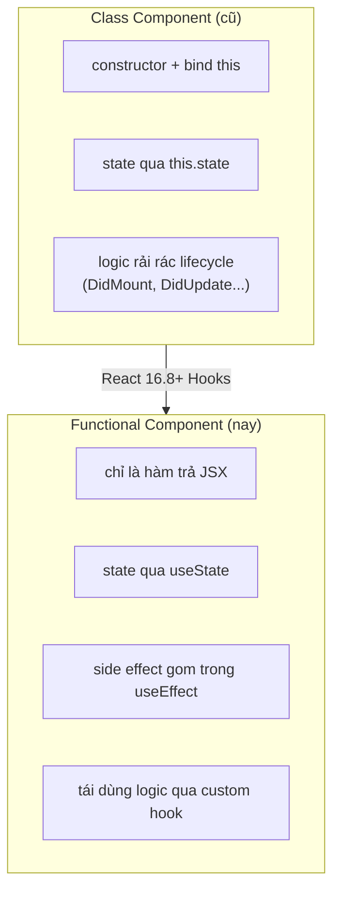
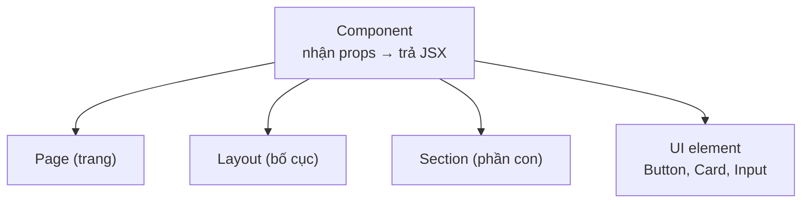

# Functional Components

**Functional component** (component viết dưới dạng hàm JavaScript) là cách hiện đại và phổ biến nhất để tạo một khối giao diện trong React. Đó chỉ là một hàm nhận **props** (dữ liệu truyền vào từ component cha) và trả về **JSX** (đoạn mô tả giao diện trông giống HTML). Bài này hướng dẫn cách khai báo functional component, truyền props, ghép các component lại với nhau và quy tắc đặt tên.

---

:::note[Ghi nhớ nhanh]

- ⭐ **Functional component chỉ là một hàm nhận props và trả về JSX** — cách viết chuẩn từ React 16.8+, gọn hơn class component.
- **Kết hợp Hooks** — dùng `useState`, `useEffect` để quản state và side effect ngay trong hàm; tái dùng logic qua custom hook.
- **Props là readonly** — không mutate trong component; muốn báo ngược lên cha thì dùng callback prop (`onClick`, `onChange`).
- **`children` là prop đặc biệt** — chứa nội dung giữa thẻ mở/đóng; React ưu tiên "composition over configuration".
- ⭐ **Đặt tên component PascalCase** (`UserCard`) và tránh `React.FC` — khai báo type props tường minh qua interface.

:::

---

## Mục lục

- [Vì sao dùng functional component?](#vì-sao-dùng-functional-component)
- [Component là gì?](#component-là-gì)
- [Functional Component cơ bản](#functional-component-cơ-bản)
- [Component nhận props](#component-nhận-props)
- [Composition và children](#composition-và-children)
- [Naming convention](#naming-convention)

---

## Vì sao dùng functional component?

**Vấn đề:** Class component dài dòng — phải có `constructor`, bind `this`, và
logic bị rải rác qua nhiều lifecycle method. Tái sử dụng logic stateful rất
khó, phải dùng HOC hoặc render props gây lồng nhau rối rắm:

```jsx
// Cách cũ — class component
class Counter extends React.Component {
  constructor(props) {
    super(props);
    this.state = { count: 0 };
    this.handleClick = this.handleClick.bind(this); // phải bind this
  }

  componentDidMount() {
    document.title = `Đã bấm ${this.state.count} lần`;
  }

  componentDidUpdate() {
    document.title = `Đã bấm ${this.state.count} lần`; // lặp lại logic
  }

  handleClick() {
    this.setState({ count: this.state.count + 1 });
  }

  render() {
    return <button onClick={this.handleClick}>{this.state.count}</button>;
  }
}
```

**Giải pháp:** Functional component chỉ là một hàm trả về JSX nên gọn hơn
hẳn. Kết hợp **Hooks** (`useState`, `useEffect`) để quản lý state và side
effect ngay trong hàm, và tái sử dụng logic qua **custom hook**. Đây là cách
viết chuẩn từ React 16.8+:

```jsx
import { useState, useEffect } from "react";

// Cách mới — functional component + Hooks
function Counter() {
  const [count, setCount] = useState(0);

  useEffect(() => {
    document.title = `Đã bấm ${count} lần`; // gom logic về một chỗ
  }, [count]);

  return <button onClick={() => setCount(count + 1)}>{count}</button>;
}
```

So sánh hai cách viết component và bước chuyển đổi từ React 16.8:



:::tip[Dùng thực tế]

- **Mọi component UI mới** — luôn bắt đầu bằng functional component.
- **Chia nhỏ UI** — tách màn hình thành nhiều hàm component gọn, dễ đọc.
- **Tái dùng logic** — bóc logic stateful ra **custom hook** (`useAuth`,
  `useFetch`) để xài lại nhiều nơi.
- **Code dễ test** — hàm thuần với props rõ ràng, dễ viết unit test hơn class.

:::

---

## Component là gì?

**Component** là khối **UI tái sử dụng**, nhận **input (props)** và trả về
**JSX (mô tả UI)**.

Mỗi component có thể là:

- **Page** — một trang.
- **Layout** — bố cục chung.
- **Section** — phần con của page.
- **UI element** — Button, Card, Input...

Các dạng component đều chung một khuôn: nhận props và trả về JSX:



```jsx
// Component đơn giản
function Welcome() {
  return <h1>Hello, React!</h1>;
}

// Dùng nó
<Welcome />
```

---

## Functional Component cơ bản

Một function trả về JSX **là** một component:

```jsx
function Greeting() {
  return <p>Xin chào</p>;
}

// Arrow function cũng được
const Greeting = () => <p>Xin chào</p>;

// Multi-line cần return tường minh
const Greeting = () => {
  return (
    <div>
      <h1>Title</h1>
      <p>Xin chào</p>
    </div>
  );
};
```

Component có thể trả về:

- JSX element (`<div>...</div>`).
- String, number, boolean (render text).
- Array của element.
- Fragment (`<>...</>`).
- `null` (không render gì).

---

## Component nhận props

**Props** = parameter của component, là object chứa dữ liệu từ parent.

```jsx
function Greeting(props) {
  return <p>Xin chào {props.name}</p>;
}

// Dùng
<Greeting name="An" />
<Greeting name="Bình" />
```

Destructure props (idiom phổ biến):

```jsx
function Greeting({ name, age }) {
  return <p>Xin chào {name}, {age} tuổi</p>;
}
```

Default value:

```jsx
function Greeting({ name = "bạn" }) {
  return <p>Xin chào {name}</p>;
}
```

Với TypeScript:

```tsx
interface GreetingProps {
  name: string;
  age?: number;
}

function Greeting({ name, age }: GreetingProps) {
  return <p>Xin chào {name} {age && `, ${age} tuổi`}</p>;
}
```

:::warning[Cần lưu ý]

**Props là readonly** — không được sửa trong component:

```jsx
function Greeting({ name }) {
  name = name.toUpperCase(); // KHÔNG nên — mutation props
  return <p>Hi {name}</p>;
}
```

Đúng cách — tạo biến mới:

```jsx
function Greeting({ name }) {
  const displayName = name.toUpperCase();
  return <p>Hi {displayName}</p>;
}
```

Quy tắc: **props từ trên xuống**, không bao giờ bottom-up. Muốn parent
biết thay đổi, dùng **callback prop** (`onChange`, `onClick`...).

:::

---

## Composition và children

`children` là **prop đặc biệt** — chứa nội dung giữa thẻ mở và đóng:

```jsx
function Card({ children }) {
  return <div className="card">{children}</div>;
}

// Dùng
<Card>
  <h1>Title</h1>
  <p>Body</p>
</Card>
```

Với TypeScript:

```tsx
import { ReactNode } from "react";

interface CardProps {
  title: string;
  children: ReactNode;
}

function Card({ title, children }: CardProps) {
  return (
    <div className="card">
      <h2>{title}</h2>
      <div>{children}</div>
    </div>
  );
}
```

:::info[Phân tích]

**Composition** là pattern tổ chức UI **mạnh nhất** trong React. Thay vì:

```jsx
// Tệ — quá nhiều prop config
<Card
  title="Hello"
  showHeader
  showFooter
  headerStyle="big"
  bodyText="..."
  footerButton="Save"
/>
```

Dùng composition:

```jsx
// Tốt — linh hoạt, dễ đọc
<Card>
  <Card.Header>Hello</Card.Header>
  <Card.Body>...</Card.Body>
  <Card.Footer>
    <Button>Save</Button>
  </Card.Footer>
</Card>
```

React khuyên: **"composition over configuration"**. Lý do:

- Parent control 100% layout, không bị "khoá" trong API của child.
- Reuse component dễ hơn — không phải predict mọi use case.
- TypeScript intellisense rõ — child có type cụ thể.

Pattern này dùng khắp nơi: **Radix UI**, **shadcn/ui**, **Mantine** đều
build trên composition.

:::

---

## Naming convention

| Quy tắc | Ví dụ |
|--------|-------|
| **PascalCase** cho component | `UserCard`, `LoginForm` |
| **camelCase** cho prop | `onClick`, `userName` |
| File name = component name | `UserCard.tsx` |
| Index file barrel | `index.ts` re-export |

:::tip[Mẹo]

**Quy tắc gọi component**:

- HTML tag → lowercase: `<div>`, `<input>`.
- Component → **PascalCase**: `<UserCard>`, `<Button>`.

JSX phân biệt qua chữ cái đầu:

```jsx
<button />  // HTML <button>
<Button />  // Component Button
```

Nếu đặt tên component lowercase:

```jsx
function userCard() { return <div /> }

<userCard /> // React coi là HTML <usercard>, không render component
```

→ Luôn PascalCase cho component. ESLint rule `react/jsx-pascal-case` sẽ
ép.

:::

:::warning[Cần lưu ý]

**Không nên dùng `React.FC`** trong code mới:

```tsx
// Tránh
const Button: React.FC<Props> = ({ children }) => <button>{children}</button>;

// Khuyến nghị
function Button({ children }: Props) {
  return <button>{children}</button>;
}
```

Lý do:

- `React.FC` ngầm thêm `children` vào type → khó kiểm soát (component
  không nhận children vẫn pass type-check).
- Không hỗ trợ generic component tốt.
- React docs đã loại bỏ khỏi example.

Khai báo type prop tường minh qua interface là pattern hiện đại nhất.

:::
