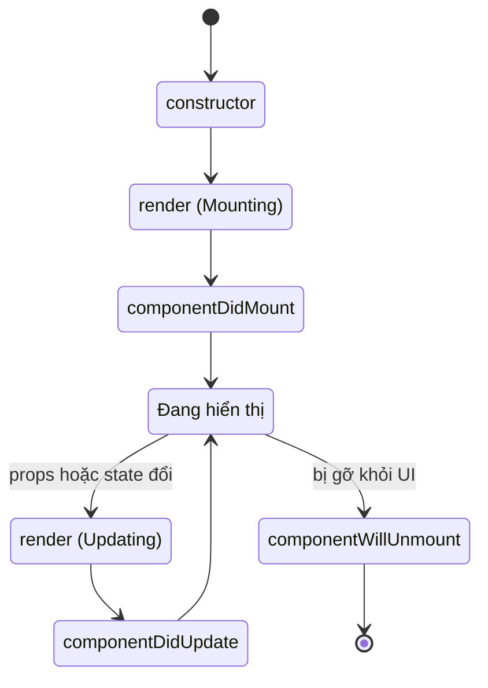

# Class Components (Legacy)

**Class component** (component viết dưới dạng lớp ES6) là cách tạo component cũ trong React, trước khi **hooks** (các hàm giúp dùng state và vòng đời trong functional component) ra đời năm 2019. Ngày nay hầu như không ai viết code mới bằng class component nữa, nhưng bạn vẫn nên hiểu nó để đọc code cũ và nắm được lý do hooks xuất hiện. Bài này giới thiệu cách khai báo class component, quản lý **state** (dữ liệu nội bộ thay đổi theo thời gian) và các **lifecycle method** (phương thức chạy ở từng giai đoạn vòng đời component).

[](pathname:///img/react/class-components.webp)

---

:::note[Ghi nhớ nhanh]

- ⭐ **Class component là cách viết cũ** — Hooks (React 16.8, 2019) đã thay thế cho 99% use case mới; không viết code mới bằng class.
- **State qua `this.state` / `this.setState`** — `setState` là async và batched, dùng dạng updater `setState(prev => ...)` khi phụ thuộc state cũ.
- **Lifecycle 3 giai đoạn** — `componentDidMount`, `componentDidUpdate`, `componentWillUnmount`; một `useEffect` thay được cả ba.
- ⭐ **Error Boundary vẫn buộc dùng class** — React chưa có hook tương đương (`getDerivedStateFromError`, `componentDidCatch`).
- **Vẫn cần biết để đọc & maintain code legacy** — codebase trước 2019 đầy class component; migrate dần sang hooks.

:::

---

## Mục lục

- [Vì sao (từng) có class component?](#vì-sao-từng-có-class-component)
- [Tại sao vẫn cần biết?](#tại-sao-vẫn-cần-biết)
- [Khai báo class component](#khai-báo-class-component)
- [State và setState](#state-và-setstate)
- [Lifecycle methods](#lifecycle-methods)
- [Khi nào còn gặp class component?](#khi-nào-còn-gặp-class-component)
- [Câu hỏi phỏng vấn](#câu-hỏi-phỏng-vấn)

---

## Vì sao (từng) có class component?

**Vấn đề:** Trước khi có Hooks (React < 16.8), functional component
**không giữ được state** và **không có lifecycle** — chỉ là "dumb
component" nhận props rồi render ra UI. Không có cách nào để component
có dữ liệu nội bộ thay đổi theo thời gian hay phản ứng theo vòng đời
(mount/update/unmount).

```jsx
// Trước Hooks: functional component chỉ render, không state
function Counter() {
  let count = 0; // reset mỗi lần render, không giữ được
  return <button onClick={() => count++}>Count: {count}</button>;
  // Bấm nút → count++ nhưng UI không cập nhật, không có gì re-render
}
```

**Giải pháp:** Class component (`extends React.Component`) cho component
một nơi giữ **state** riêng (`this.state` / `this.setState`) và bộ
**lifecycle method** (`componentDidMount`, `componentDidUpdate`,
`componentWillUnmount`...) để chạy logic ở từng giai đoạn vòng đời.

```jsx
import { Component } from "react";

class Counter extends Component {
  state = { count: 0 }; // state riêng, giữ qua các lần render

  render() {
    return (
      <button onClick={() => this.setState(p => ({ count: p.count + 1 }))}>
        Count: {this.state.count}
      </button>
    );
  }
}
```

Ngày nay phần lớn việc này đã được thay bằng Hooks, nhưng vẫn cần hiểu
class component vì còn trong codebase cũ và Error Boundary đến nay vẫn
phải dùng class.

:::tip[Dùng thực tế]

- **Đọc & bảo trì code cũ** — codebase trước 2019 đầy class component.
- **Error Boundary** — React vẫn chưa có hook tương đương, buộc dùng class.
- **Hiểu lịch sử lifecycle** — biết vì sao `useEffect` ra đời để thay thế.
- **Migrate dần sang hooks** — nắm class để convert an toàn từng phần.

:::

---

## Tại sao vẫn cần biết?

Hooks (React 16.8, 2019) đã thay thế class component cho 99% use case
mới. Nhưng vẫn nên biết để:

- **Đọc code legacy** — codebase trước 2019.
- **Maintain dự án cũ** — migrate dần sang hooks.
- **Hiểu khái niệm** — lifecycle, this, bind... để giải thích tại sao
  hooks ra đời.

:::warning[Cần lưu ý]

**Không viết code mới bằng class component.** React docs đã chuyển sang
hooks-first hoàn toàn. Hooks:

- Code ngắn hơn 30-50%.
- Không có `this` binding rắc rối.
- Reuse logic dễ qua custom hooks.
- Type-safe với TypeScript tốt hơn.

Class component **vẫn được hỗ trợ** vô thời hạn — không bị remove. Chỉ
là không khuyến nghị cho code mới.

:::

---

## Khai báo class component

```jsx
import { Component } from "react";

class Welcome extends Component {
  render() {
    return <h1>Hello, {this.props.name}</h1>;
  }
}

// Dùng
<Welcome name="An" />
```

Với TypeScript:

```tsx
interface Props { name: string; }
interface State { count: number; }

class Counter extends Component<Props, State> {
  state: State = { count: 0 };

  render() {
    return <p>Count: {this.state.count}</p>;
  }
}
```

---

## State và setState

State khởi tạo trong constructor hoặc class field:

```jsx
class Counter extends Component {
  state = { count: 0 };

  increment = () => {
    this.setState({ count: this.state.count + 1 });
  };

  render() {
    return (
      <button onClick={this.increment}>
        Count: {this.state.count}
      </button>
    );
  }
}
```

`setState` có 2 dạng:

```jsx
// Dạng 1: object — không nên khi update dựa vào state cũ
this.setState({ count: this.state.count + 1 });

// Dạng 2: updater function — đúng khi dựa vào state trước
this.setState(prev => ({ count: prev.count + 1 }));
```

:::warning[Cần lưu ý]

**`setState` là async + batched** — đừng dựa vào `this.state` ngay sau
khi gọi:

```jsx
this.setState({ count: 1 });
console.log(this.state.count); // có thể vẫn là giá trị cũ

// Multiple setState gộp lại
this.setState({ count: this.state.count + 1 });
this.setState({ count: this.state.count + 1 });
// Cả 2 thấy count cũ → kết quả +1, không phải +2

// Đúng cách
this.setState(prev => ({ count: prev.count + 1 }));
this.setState(prev => ({ count: prev.count + 1 }));
// +2
```

Cùng issue áp dụng cho hooks `useState` — nguyên tắc giống nhau.

:::

---

## Lifecycle methods

3 giai đoạn lifecycle:

| Phase | Method |
|-------|--------|
| **Mounting** | `constructor` → `render` → `componentDidMount` |
| **Updating** | `shouldComponentUpdate` → `render` → `componentDidUpdate` |
| **Unmounting** | `componentWillUnmount` |

Vòng đời của một class component đi qua các trạng thái sau:



```jsx
class DataLoader extends Component {
  state = { data: null, loading: true };

  componentDidMount() {
    // Chạy sau khi component mount
    fetch("/api").then(r => r.json()).then(data => {
      this.setState({ data, loading: false });
    });
  }

  componentDidUpdate(prevProps) {
    // Chạy sau khi update
    if (this.props.id !== prevProps.id) {
      this.reload();
    }
  }

  componentWillUnmount() {
    // Cleanup trước khi unmount
    this.abortController?.abort();
  }

  render() {
    if (this.state.loading) return <p>Loading...</p>;
    return <div>{JSON.stringify(this.state.data)}</div>;
  }
}
```

:::info[Phân tích]

**Hooks tương đương lifecycle:**

| Lifecycle | Hooks |
|-----------|-------|
| `constructor` | `useState` initial value |
| `componentDidMount` | `useEffect(() => {}, [])` |
| `componentDidUpdate` | `useEffect(() => {}, [deps])` |
| `componentWillUnmount` | `useEffect` return cleanup |
| `shouldComponentUpdate` | `React.memo` + `useMemo`/`useCallback` |
| `getDerivedStateFromProps` | Tính từ props trong render |
| `getSnapshotBeforeUpdate` | `useLayoutEffect` |

Một `useEffect` thay thế **3 lifecycle method** (mount, update, unmount)
trong một chỗ — dễ đọc, không bị tách logic.

Vd Pattern data fetching:

```jsx
// Class — 3 chỗ
class C extends Component {
  componentDidMount() { this.fetch(); }
  componentDidUpdate(prev) { if (prev.id !== this.props.id) this.fetch(); }
  componentWillUnmount() { this.controller.abort(); }
}

// Hook — 1 chỗ
function C({ id }) {
  useEffect(() => {
    const ctrl = new AbortController();
    fetchData(id, ctrl.signal);
    return () => ctrl.abort(); // cleanup
  }, [id]); // re-fetch khi id đổi
}
```

:::

---

## Khi nào còn gặp class component?

Năm 2026, gần như **chỉ còn 2 lý do**:

**1. Error Boundary** — đến nay React **vẫn chưa có hook tương đương**:

```jsx
class ErrorBoundary extends Component {
  state = { hasError: false };

  static getDerivedStateFromError() {
    return { hasError: true };
  }

  componentDidCatch(error, info) {
    logErrorToSentry(error, info);
  }

  render() {
    if (this.state.hasError) {
      return <p>Đã có lỗi</p>;
    }
    return this.props.children;
  }
}
```

Có thư viện `react-error-boundary` wrap thành component dễ dùng hơn.

**2. Codebase legacy** — không bao giờ migrate hết. Hiểu để đọc.

:::tip[Mẹo]

**Migrate class → hook**: làm dần từng component, không phải đập đi xây
lại toàn bộ. Tool hỗ trợ:

- **react-codemod** — script tự convert lifecycle → hooks.
- **VSCode refactor** — đôi khi work.
- Làm tay với pattern đã biết — an toàn nhất.

Ưu tiên migrate component có **logic đơn giản** trước. Component có
`shouldComponentUpdate`, `getSnapshotBeforeUpdate`, error boundary —
để cuối hoặc giữ class.

:::

---

## Câu hỏi phỏng vấn

Những câu thường gặp về chủ đề này. Tự trả lời trước, rồi bấm **Xem đáp án** để đối chiếu.

**1. Class component là gì? Tối thiểu cần những gì để một class trở thành component React hợp lệ?**

<details className="qa">
<summary>Xem đáp án</summary>

**Class component** là component viết dưới dạng lớp ES6, cách làm chuẩn của React trước khi Hooks ra đời năm 2019. Nó cho component một nơi giữ state riêng (`this.state`) và bộ lifecycle method để chạy logic theo từng giai đoạn vòng đời.

Tối thiểu cần đúng hai thứ:

- **Kế thừa `React.Component`** (hoặc `React.PureComponent`).
- **Có method `render()`** trả về JSX, chuỗi, mảng, hay `null`.

```jsx
import { Component } from "react";

class Welcome extends Component {
  render() {
    return <h1>Hello, {this.props.name}</h1>;
  }
}
```

Constructor, state, lifecycle đều là **tùy chọn**. Tên class vẫn phải PascalCase như mọi component. Props nhận qua `this.props` và **chỉ đọc** — y hệt function component.

</details>

**2. Vì sao `render()` phải thuần và không có side effect? Điều gì xảy ra nếu gọi `setState` ngay trong `render()`?**

<details className="qa">
<summary>Xem đáp án</summary>

`render()` chỉ được phép **mô tả UI dựa trên props và state hiện tại**. React có quyền gọi nó nhiều lần, hoãn lại, hoặc bỏ kết quả đi mà không commit — đặc biệt với các tính năng concurrent. Nếu `render()` gây tác động phụ (gọi API, ghi vào DOM, sửa biến ngoài), số lần tác động đó xảy ra trở nên không đoán được, và ứng dụng cho ra kết quả khác nhau giữa các lần chạy.

Gọi `setState` ngay trong `render()` tạo **vòng lặp vô hạn**: `setState` lên lịch render lại, render lại gọi `setState`, cứ thế. React phát hiện và ném lỗi "Maximum update depth exceeded", trang treo hoặc crash.

```jsx
render() {
  this.setState({ n: 1 }); // SAI — vòng lặp vô hạn
  return <p>{this.state.n}</p>;
}
```

Side effect phải đặt ở `componentDidMount`, `componentDidUpdate`, `componentWillUnmount` hoặc trong event handler — tức là **sau khi** React đã commit kết quả render.

</details>

**3. Vì sao trong class phải viết `this.props.name` chứ không phải `props.name` như function component?**

<details className="qa">
<summary>Xem đáp án</summary>

Vì hai mô hình nhận dữ liệu khác nhau về bản chất.

Function component nhận props làm **tham số của hàm**, nên bên trong nó `props` là một biến cục bộ bình thường:

```jsx
function Welcome(props) {
  return <h1>{props.name}</h1>;
}
```

Class component thì React tạo ra một **instance** và gán props vào **thuộc tính của instance** — chính lời gọi `super(props)` trong constructor làm việc đó. `render()` là method của instance, không nhận tham số nào, nên muốn đọc props phải đi qua `this`.

Hệ quả thực tế rất đáng chú ý: props trong function component được "đóng băng" theo từng lần render (nhờ closure), còn `this.props` trong class **luôn trỏ tới giá trị mới nhất**. Vì vậy một callback bất đồng bộ trong class có thể đọc được props đã đổi sau đó, dẫn tới hành vi khó lường — đây là một trong những lý do Hooks được đánh giá dễ suy luận hơn. Trong class, muốn "chốt" giá trị thì phải destructure ra biến cục bộ ngay từ đầu.

</details>

**4. Khởi tạo state bằng `constructor` khác bằng class field ra sao? `super(props)` dùng để làm gì và quên nó thì lỗi gì xảy ra?**

<details className="qa">
<summary>Xem đáp án</summary>

Hai cách cho kết quả tương đương, class field chỉ là cú pháp gọn hơn (được Babel/TypeScript biên dịch về đúng constructor):

```jsx
// Constructor
class A extends Component {
  constructor(props) {
    super(props);
    this.state = { count: 0 };
  }
}

// Class field — gọn hơn, phổ biến hơn
class B extends Component {
  state = { count: 0 };
}
```

Dùng constructor khi cần đọc props để tính state ban đầu, hoặc cần bind method. Ngoài ra thì dùng class field.

`super(props)` gọi constructor của lớp cha `React.Component`, làm hai việc: khởi tạo phần nội tại của lớp cha, và **gán `this.props`**.

Quên gọi `super()` hoàn toàn: JavaScript ném `ReferenceError` — không được phép chạm vào `this` trước khi gọi `super` trong lớp dẫn xuất.

Gọi `super()` nhưng **quên truyền `props`**: không lỗi ngay, nhưng `this.props` là `undefined` **bên trong constructor** — rất khó lần ra. Sau khi constructor chạy xong thì React tự gán props nên các method khác vẫn dùng bình thường.

</details>

**5. Vì sao method của class bị mất `this` khi truyền làm event handler? Kể ba cách khắc phục và ưu nhược của từng cách.**

<details className="qa">
<summary>Xem đáp án</summary>

Trong JavaScript, `this` của một function thường được xác định theo **cách gọi**, không theo nơi định nghĩa. Viết `onClick={this.handleClick}` là bạn lấy **tham chiếu hàm** ra khỏi object rồi đưa cho React gọi sau — lúc gọi không còn ngữ cảnh object, và thân class luôn ở strict mode nên `this` là `undefined`.

Ba cách khắc phục:

| Cách | Ưu | Nhược |
|---|---|---|
| Bind trong constructor: `this.f = this.f.bind(this)` | Chỉ tạo hàm một lần, tham chiếu ổn định | Dài dòng, phải nhớ thêm dòng cho mỗi method |
| Class field arrow: `f = () => {}` | Gọn nhất, `this` chốt sẵn theo lexical scope | Method nằm trên từng instance thay vì prototype, khó gọi từ lớp con qua `super` |
| Arrow inline trong JSX: `onClick={() => this.f()}` | Tiện khi cần truyền tham số | Tạo hàm mới mỗi lần render, phá `PureComponent` / `React.memo` của con |

Trong thực tế class field arrow là lựa chọn phổ biến nhất. Function component không gặp vấn đề này vì không dùng `this`.

</details>

**6. `setState` là bất đồng bộ và được gộp lô (`batched`) nghĩa là gì? Vì sao gọi `this.setState({count: this.state.count + 1})` hai lần liên tiếp chỉ tăng một?**

<details className="qa">
<summary>Xem đáp án</summary>

`setState` **không** cập nhật `this.state` ngay lập tức. Nó **xếp hàng** một yêu cầu cập nhật; React gom nhiều `setState` trong cùng một lượt xử lý lại (**batching**), rồi áp dụng một lần và render một lần duy nhất. Làm vậy để tránh render lại nhiều lần liên tiếp một cách vô ích.

Vì thế:

```jsx
this.setState({ count: this.state.count + 1 });
this.setState({ count: this.state.count + 1 });
// this.state.count vẫn là giá trị cũ ở cả hai dòng
// Giả sử đang là 0 → cả hai đều xếp hàng { count: 1 } → kết quả 1, không phải 2
```

Cả hai lời gọi đều đọc `this.state.count` **trước khi** bất kỳ cập nhật nào được áp dụng, nên cùng tính ra một giá trị; lời gọi sau ghi đè lời gọi trước.

Cách đúng là dùng dạng updater, mỗi hàm nhận state của bước ngay trước nó:

```jsx
this.setState(prev => ({ count: prev.count + 1 }));
this.setState(prev => ({ count: prev.count + 1 })); // +2
```

Từ React 18, batching được áp dụng tự động cho mọi ngữ cảnh, kể cả trong `setTimeout` hay callback của promise.

</details>

**7. Khi nào bắt buộc phải dùng dạng updater `setState(prev => ...)`? Nguyên tắc này có áp dụng cho `useState` không?**

<details className="qa">
<summary>Xem đáp án</summary>

Bắt buộc dùng updater khi **giá trị mới phụ thuộc vào giá trị cũ**. Những tình huống điển hình:

- Tăng/giảm bộ đếm, cộng dồn.
- Bật/tắt một cờ: `setState(p => ({ open: !p.open }))`.
- Thêm/bớt phần tử trong mảng hoặc object trong state.
- Gọi nhiều lần cập nhật liên tiếp trong cùng một handler.
- Cập nhật từ trong callback bất đồng bộ, timer, hoặc event listener sống lâu — nơi giá trị bắt được có thể đã cũ.

Ngược lại, khi giá trị mới **độc lập** với giá trị cũ (gán thẳng dữ liệu vừa fetch về, đặt lại form về rỗng) thì dạng object bình thường là đủ.

**Có, nguyên tắc y hệt với `useState`** — thậm chí còn quan trọng hơn, vì function component còn dính thêm closure: callback giữ lại giá trị state của đúng lần render tạo ra nó.

```jsx
setCount(c => c + 1); // an toàn trong mọi ngữ cảnh
```

Lợi ích kèm theo: hàm updater không cần state trong dependency, nên `useCallback` bọc quanh nó giữ được tham chiếu ổn định.

</details>

**8. `setState` nhận thêm một callback thứ hai — dùng để làm gì và tương đương với cái gì trong thế giới Hooks?**

<details className="qa">
<summary>Xem đáp án</summary>

Tham số thứ hai là hàm chạy **sau khi state đã được áp dụng và component đã render lại xong**. Nó tồn tại chính vì `setState` bất đồng bộ — đọc `this.state` ngay dòng sau sẽ thấy giá trị cũ.

```jsx
this.setState({ query: value }, () => {
  this.search(this.state.query); // chắc chắn dùng state mới
});
```

Dùng cho: gọi API sau khi state đã cập nhật, đo kích thước DOM sau khi render, ghi log, cuộn tới vị trí mới.

Trong thế giới Hooks **không có tham số tương đương** — `setCount` chỉ nhận một đối số. Cách làm tương ứng là `useEffect` với dependency là state đó:

```jsx
useEffect(() => {
  search(query);
}, [query]);
```

Khác biệt về tư duy đáng chú ý: callback của `setState` là "làm việc này **sau khi** tôi vừa set", còn `useEffect` là "đồng bộ với giá trị này **mỗi khi** nó đổi" — nên effect chạy cả khi giá trị thay đổi từ nguồn khác. Cần chạy ngay sau khi commit và trước khi trình duyệt vẽ thì dùng `useLayoutEffect`.

</details>

**9. `setState` gộp nông (`shallow merge`) state cũ với state mới, còn `useState` thì thay thế hoàn toàn. Sự khác biệt này gây bug thế nào khi migrate?**

<details className="qa">
<summary>Xem đáp án</summary>

`setState` trong class **trộn** object bạn truyền vào với state hiện tại ở **tầng một**: các key không nhắc tới vẫn được giữ nguyên. `useState` thì **thay thế** trọn vẹn giá trị.

```jsx
// Class — các field khác được giữ
this.state = { name: "A", age: 20, city: "HN" };
this.setState({ age: 21 }); // → { name: "A", age: 21, city: "HN" }

// Hook — mất sạch các field khác
const [user, setUser] = useState({ name: "A", age: 20, city: "HN" });
setUser({ age: 21 }); // → { age: 21 }  — name và city biến mất!
```

Bug khi migrate rất hiểm vì nó **im lặng**: không lỗi, không cảnh báo, chỉ là vài trường bỗng thành `undefined` — giao diện hiện ô trống, hoặc gửi lên server một payload thiếu field.

Cách xử lý: luôn spread state cũ khi cập nhật một phần.

```jsx
setUser(prev => ({ ...prev, age: 21 }));
```

Lưu ý: cả hai đều **nông**, nên object lồng nhau vẫn phải spread từng tầng. Tốt nhất là tách state to thành nhiều `useState` nhỏ độc lập, hoặc dùng `useReducer` khi các field liên quan chặt với nhau.

</details>

**10. Kể ba giai đoạn của vòng đời class component và các method thuộc từng giai đoạn theo đúng thứ tự chạy.**

<details className="qa">
<summary>Xem đáp án</summary>

| Giai đoạn | Thứ tự các method |
|---|---|
| **Mounting** | `constructor` → `getDerivedStateFromProps` → `render` → `componentDidMount` |
| **Updating** | `getDerivedStateFromProps` → `shouldComponentUpdate` → `render` → `getSnapshotBeforeUpdate` → `componentDidUpdate` |
| **Unmounting** | `componentWillUnmount` |

Bản rút gọn hay dùng trong thực tế, đúng như bài nêu: `constructor` → `render` → `componentDidMount` cho mounting; `shouldComponentUpdate` → `render` → `componentDidUpdate` cho updating; `componentWillUnmount` cho unmounting.

Điểm cần nắm: các method trước `render` thuộc **render phase** — phải thuần, có thể bị React gọi lại hoặc hủy bỏ. Các method sau `render` thuộc **commit phase** — DOM đã cập nhật, là nơi hợp lệ để gây side effect và gọi `setState` (có điều kiện).

Ngoài ba giai đoạn trên còn có nhóm xử lý lỗi: `getDerivedStateFromError` và `componentDidCatch`, chạy khi một component con ném lỗi.

</details>

**11. `componentDidMount` dùng để làm gì? Vì sao nên gọi API ở đây thay vì trong `constructor` hay `render`?**

<details className="qa">
<summary>Xem đáp án</summary>

`componentDidMount` chạy **một lần duy nhất**, ngay sau khi component được chèn vào DOM thật. Đây là chỗ dành cho: gọi API lấy dữ liệu, đăng ký event listener hoặc subscription, khởi tạo timer, thao tác DOM cần đo đạc thật, tích hợp thư viện bên thứ ba.

Vì sao không đặt trong `constructor`:

- Constructor chạy **trước khi** component có mặt trên màn hình; dữ liệu về sớm cũng chẳng hiển thị được gì, mà `setState` lúc này là sai cách.
- Constructor nên chỉ làm đúng việc khởi tạo, giữ cho mount nhanh.
- Nếu request thất bại, chưa có gì trên màn hình để hiển thị lỗi.

Vì sao không đặt trong `render`:

- `render` phải **thuần**, và có thể bị gọi nhiều lần — mỗi lần một request, dẫn tới vòng lặp vô hạn khi response gọi `setState`.

Tại `componentDidMount`, DOM đã sẵn sàng nên bạn có thể hiển thị trạng thái loading trước, rồi `setState` khi dữ liệu về để render lại. Bản tương đương trong Hooks là `useEffect(() => {}, [])`.

</details>

**12. Trong `componentDidUpdate(prevProps)`, vì sao phải so sánh `prevProps` trước khi gọi `setState`? Không so sánh thì hiện tượng gì xảy ra?**

<details className="qa">
<summary>Xem đáp án</summary>

Vì `componentDidUpdate` chạy **sau mỗi lần render lại**, mà `setState` lại **kích hoạt một lần render lại**. Gọi thẳng không điều kiện sẽ tạo **vòng lặp vô hạn**: update → `componentDidUpdate` → `setState` → update → ...

Biểu hiện: CPU tăng vọt, tab đơ, React ném lỗi "Maximum update depth exceeded". Với trường hợp gọi API thì còn tệ hơn — bắn request liên tục, có thể bị rate-limit hoặc sập backend.

Cách đúng là chỉ hành động khi thứ mình quan tâm thực sự đổi:

```jsx
componentDidUpdate(prevProps) {
  if (this.props.id !== prevProps.id) {
    this.reload();
  }
}
```

Điều này tương ứng chính xác với **mảng dependency** của `useEffect` — React tự so sánh giúp bạn, thay vì phải viết tay:

```jsx
useEffect(() => { reload(id); }, [id]);
```

Lưu ý so sánh là **tham chiếu**: props dạng object hoặc mảng được tạo mới mỗi lần render sẽ luôn "khác", nên hãy so sánh theo field cụ thể hoặc bảo đảm tham chiếu ổn định từ phía cha.

</details>

**13. `componentWillUnmount` thường phải dọn những thứ gì? Không dọn thì hậu quả cụ thể là gì?**

<details className="qa">
<summary>Xem đáp án</summary>

Những thứ cần dọn:

- `setInterval` / `setTimeout` — hủy bằng `clearInterval` / `clearTimeout`.
- Event listener gắn thủ công lên `window` hoặc `document`.
- Subscription: WebSocket, EventSource, observable, store bên ngoài.
- Request đang bay — hủy bằng `AbortController`.
- Tài nguyên của thư viện bên thứ ba: instance biểu đồ, bản đồ, editor.
- `ResizeObserver`, `IntersectionObserver`.

Hậu quả nếu quên:

- **Rò rỉ bộ nhớ**: listener và timer còn giữ tham chiếu tới component đã chết, nên nó không được thu hồi; ứng dụng chạy lâu càng ngày càng chậm.
- **Cảnh báo cập nhật state trên component đã unmount**: callback về muộn gọi `setState` vào chỗ trống.
- **Hành vi sai**: interval vẫn bắn API sau khi người dùng rời trang; điều hướng qua lại nhiều lần thì có bao nhiêu interval cùng chạy song song.

Bản tương đương trong Hooks là hàm **cleanup** trả về từ `useEffect` — nằm ngay cạnh phần thiết lập nên rất khó quên:

```jsx
useEffect(() => {
  const id = setInterval(tick, 1000);
  return () => clearInterval(id);
}, []);
```

</details>

**14. `shouldComponentUpdate` và `PureComponent` hoạt động ra sao? So sánh nông có cạm bẫy gì với props dạng object hay function?**

<details className="qa">
<summary>Xem đáp án</summary>

`shouldComponentUpdate(nextProps, nextState)` cho bạn tự quyết định có render lại hay không — trả `false` thì React bỏ qua `render` và `componentDidUpdate` của component đó.

`PureComponent` cài sẵn logic đó: nó tự **so sánh nông** props và state (so sánh từng key ở tầng một bằng `Object.is`), trả `false` khi mọi thứ bằng nhau. Bản tương đương cho function component là `React.memo`.

Cạm bẫy của so sánh nông:

- **Object/mảng/hàm tạo mới mỗi lần render** luôn khác tham chiếu, dù nội dung y hệt. `<Child style={{ m: 4 }} onClick={() => f()} />` khiến mọi tối ưu mất tác dụng.
- **Ngược lại — mutate tại chỗ**: sửa `this.state.items.push(x)` rồi set lại cùng tham chiếu thì so sánh nông thấy "không đổi" và **bỏ qua render**, giao diện đứng im dù dữ liệu đã đổi. Đây là lỗi nguy hiểm hơn vì nó im lặng.
- `children` là JSX nên gần như luôn là tham chiếu mới.

Cách xử lý: giữ dữ liệu bất biến, dùng `useCallback` / `useMemo` hoặc bind sẵn trong constructor, và chỉ tối ưu khi Profiler chỉ ra chỗ nghẽn thật.

</details>

**15. Vì sao các method `componentWillMount`, `componentWillReceiveProps`, `componentWillUpdate` bị đánh dấu unsafe? Chúng xung đột với cơ chế render bất đồng bộ ở điểm nào?**

<details className="qa">
<summary>Xem đáp án</summary>

Ba method này thuộc **render phase** — chạy trước khi React commit thay đổi lên DOM. Chúng bị đổi tên thành `UNSAFE_componentWillMount` và tương tự từ React 16.3.

Xung đột với render bất đồng bộ: với concurrent rendering, React có thể **tạm dừng, hủy bỏ, hoặc chạy lại** quá trình render để ưu tiên việc gấp hơn. Nghĩa là các method trong render phase có thể bị gọi **nhiều lần cho cùng một lần cập nhật**, hoặc gọi rồi kết quả bị vứt đi.

Hệ quả thực tế của việc lạm dụng chúng:

- Đặt `fetch` hoặc `subscribe` trong `componentWillMount` — request bắn đi nhiều lần, subscription đăng ký mà không bao giờ hủy (vì `componentWillUnmount` không chạy cho lần render bị hủy) → rò rỉ bộ nhớ.
- Thao tác DOM trong `componentWillUpdate` — DOM lúc đó chưa được cập nhật, dữ liệu đọc ra không khớp.
- `componentWillReceiveProps` hay bị dùng để đồng bộ state theo props, dẫn tới state trùng lặp và lệch nguồn sự thật.

Thay thế: `componentDidMount` cho khởi tạo, `getDerivedStateFromProps` hoặc tính thẳng trong render cho việc dẫn xuất, `getSnapshotBeforeUpdate` cho việc đọc DOM trước commit.

</details>

**16. `getDerivedStateFromProps` vì sao là `static` và không truy cập được `this`? Khi nào thật sự cần tới nó, và vì sao đa số trường hợp là dùng sai?**

<details className="qa">
<summary>Xem đáp án</summary>

Nó là `static` một cách **có chủ đích**: không có `this` nghĩa là không đụng được tới instance, không gọi được `setState`, không gây được side effect. React ép nó thành một hàm thuần nhận `(props, state)` và trả về object cập nhật state hoặc `null` — đúng tinh thần an toàn cho render bất đồng bộ, nơi method này có thể bị gọi nhiều lần.

Trường hợp thật sự cần: khi state phải **thay đổi theo props mà vẫn giữ được thay đổi nội bộ của chính nó** — ví dụ một component chuyển cảnh so sánh prop hướng đi trước/sau, hoặc reset một phần state khi prop định danh đổi mà không muốn mount lại.

Vì sao đa số là dùng sai: người ta dùng nó để **sao chép props vào state** rồi coi đó là nguồn sự thật. Hệ quả là hai nguồn dữ liệu lệch nhau, cập nhật từ cha bị nuốt mất, và bug rất khó lần.

Thay thế tốt hơn:

- Cần giá trị dẫn xuất → **tính thẳng trong `render`**, không lưu vào state.
- Cần reset toàn bộ state khi props đổi → đổi prop `key` của component, React sẽ mount lại instance mới.

</details>

**17. `getSnapshotBeforeUpdate` giải quyết bài toán gì? Cho một tình huống thực tế như giữ vị trí cuộn trong khung chat.**

<details className="qa">
<summary>Xem đáp án</summary>

Nó chạy **sau `render` nhưng ngay trước khi React ghi thay đổi lên DOM**, cho bạn cơ hội cuối cùng đọc trạng thái DOM **cũ**. Giá trị nó trả về được truyền vào `componentDidUpdate` làm **tham số thứ ba**.

Bài toán: khi DOM đã cập nhật xong rồi mới đọc thì thông tin cũ (vị trí cuộn, kích thước, vùng chọn văn bản) đã mất.

Tình huống khung chat — tin nhắn mới chèn vào **đầu** danh sách. Nếu không xử lý, nội dung bị đẩy xuống và người dùng đang đọc lịch sử bỗng nhảy mất chỗ:

```jsx
getSnapshotBeforeUpdate(prevProps) {
  if (prevProps.messages.length < this.props.messages.length) {
    const el = this.listRef.current;
    return el.scrollHeight - el.scrollTop; // khoảng cách tới đáy
  }
  return null;
}

componentDidUpdate(prevProps, prevState, snapshot) {
  if (snapshot !== null) {
    const el = this.listRef.current;
    el.scrollTop = el.scrollHeight - snapshot; // giữ nguyên chỗ đang đọc
  }
}
```

Trong Hooks **không có bản tương đương một-một**; cách gần nhất là `useLayoutEffect` kết hợp `useRef` để tự lưu giá trị trước khi trình duyệt vẽ.

</details>

**18. Ánh xạ vòng đời sang Hooks: một `useEffect` thay thế được cả mount, update và unmount như thế nào? Có lifecycle nào KHÔNG có bản tương đương một-một không?**

<details className="qa">
<summary>Xem đáp án</summary>

Một `useEffect` gom cả ba giai đoạn: thân hàm chạy **sau mount** và **sau mỗi lần dependency đổi**, còn hàm **trả về** là cleanup, chạy trước lần chạy kế tiếp và khi **unmount**.

```jsx
// Class — 3 chỗ rời rạc
componentDidMount()    { this.fetch(); }
componentDidUpdate(p)  { if (p.id !== this.props.id) this.fetch(); }
componentWillUnmount() { this.controller.abort(); }

// Hook — 1 chỗ
useEffect(() => {
  const ctrl = new AbortController();
  fetchData(id, ctrl.signal);
  return () => ctrl.abort();
}, [id]);
```

Bảng ánh xạ chính: `constructor` → giá trị khởi tạo của `useState`; `componentDidMount` → `useEffect(() => {}, [])`; `componentDidUpdate` → `useEffect(() => {}, [deps])`; `componentWillUnmount` → cleanup; `shouldComponentUpdate` → `React.memo` kèm `useMemo` / `useCallback`; `getDerivedStateFromProps` → tính từ props ngay trong render; `getSnapshotBeforeUpdate` → `useLayoutEffect`.

**Không có bản tương đương một-một:** `getSnapshotBeforeUpdate` (chỉ mô phỏng gần đúng) và đặc biệt là `getDerivedStateFromError` cùng `componentDidCatch` — Error Boundary đến nay vẫn buộc phải viết bằng class.

</details>

**19. `Error Boundary` là gì? `getDerivedStateFromError` khác `componentDidCatch` ở vai trò nào, và nên đặt chúng ở đâu trong cây component?**

<details className="qa">
<summary>Xem đáp án</summary>

**Error Boundary** là component bắt lỗi JavaScript xảy ra trong **cây con** của nó lúc render, trong lifecycle và trong constructor, rồi hiển thị giao diện dự phòng thay vì để cả ứng dụng trắng trang.

| | `getDerivedStateFromError` | `componentDidCatch` |
|---|---|---|
| Loại | `static`, thuộc render phase | Method thường, thuộc commit phase |
| Vai trò | Trả về state mới để render fallback | Gây side effect: ghi log, gửi lỗi về Sentry |
| Nhận gì | `error` | `error` và `info` (kèm component stack) |

```jsx
class ErrorBoundary extends Component {
  state = { hasError: false };
  static getDerivedStateFromError() { return { hasError: true }; }
  componentDidCatch(error, info) { logErrorToSentry(error, info); }
  render() {
    if (this.state.hasError) return <p>Đã có lỗi</p>;
    return this.props.children;
  }
}
```

Đặt ở đâu: nên **nhiều tầng**. Một boundary ở gốc để không bao giờ trắng trang; thêm boundary bao quanh từng khu vực độc lập (mỗi route, mỗi widget của dashboard, mỗi panel) để một phần hỏng không kéo sập phần còn lại — người dùng vẫn dùng được chỗ khác.

</details>

**20. Error Boundary KHÔNG bắt được những loại lỗi nào (event handler, code bất đồng bộ, lỗi trong chính boundary)? Với những loại đó bạn xử lý ra sao?**

<details className="qa">
<summary>Xem đáp án</summary>

Bốn nhóm nằm ngoài tầm với:

- **Lỗi trong event handler** — chúng chạy ngoài chu trình render nên React không bao bọc.
- **Code bất đồng bộ** — callback của `setTimeout`, `.then`, `async` function.
- **Lỗi khi render phía server (SSR)**.
- **Lỗi ném ra từ chính error boundary đó** — phải do một boundary ở tầng trên bắt.

Cách xử lý từng nhóm:

- Event handler và code bất đồng bộ: bọc `try`/`catch` ngay tại chỗ, đưa lỗi vào state rồi hiển thị thông báo, hoặc dùng `setState` để kích hoạt một boundary một cách chủ động (thư viện `react-error-boundary` có sẵn `useErrorHandler` cho việc này).
- Lưới an toàn toàn cục: lắng nghe sự kiện `error` và `unhandledrejection` trên `window` để ghi log những gì lọt lưới.
- Lỗi khi fetch dữ liệu: xử lý như **trạng thái** (loading / error / success) thay vì như ngoại lệ — hiển thị thông báo kèm nút thử lại.
- SSR: bọc `try`/`catch` ở tầng server và trả về trang lỗi phù hợp.

Nguyên tắc chung: boundary là lưới cuối cùng chống trắng trang, không phải cơ chế xử lý lỗi chính.

</details>

**21. Vì sao tới nay Error Boundary vẫn buộc phải viết bằng class? Thư viện `react-error-boundary` giúp gì cho bạn?**

<details className="qa">
<summary>Xem đáp án</summary>

Vì React **chưa cung cấp hook tương đương** cho `getDerivedStateFromError` và `componentDidCatch`. Cơ chế bắt lỗi nằm sâu trong quá trình reconcile: khi một component con ném lỗi, React phải tìm ngược lên tổ tiên gần nhất **có khai báo các method đó trên class** rồi render lại nhánh đó với state lỗi. Đây là hành vi gắn với instance của class, không phải thứ mà một hook gọi bên trong hàm render có thể biểu đạt. React team đã ghi nhận nhu cầu này nhưng chưa chốt được API.

Thư viện `react-error-boundary` không thay đổi điều đó — bên trong nó vẫn là một class — nhưng gói lại thành API dễ dùng hơn nhiều:

- Component `ErrorBoundary` nhận prop `fallback` hoặc `FallbackComponent`, không phải tự viết class mỗi lần.
- Hàm `resetErrorBoundary` để người dùng bấm "Thử lại" mà không cần tải lại trang, cùng `resetKeys` để tự reset khi dữ liệu đổi.
- `onError` để nối thẳng vào Sentry hay hệ thống log.
- Hook `useErrorBoundary` cho phép ném lỗi từ event handler hoặc code bất đồng bộ vào boundary — vốn là những chỗ boundary không tự bắt được.

</details>

**22. Trước khi có Hooks, người ta chia sẻ logic bằng `HOC` và `render props`. Hai cách đó gặp vấn đề gì (`wrapper hell`, va chạm tên prop) mà custom hook giải quyết được?**

<details className="qa">
<summary>Xem đáp án</summary>

**HOC** là hàm nhận component và trả về component mới đã bọc thêm logic; **render props** truyền một hàm để component gọi lại kèm dữ liệu nội bộ. Cả hai đều chia sẻ logic bằng cách **thêm tầng component**, và từ đó sinh ra vấn đề:

- **Wrapper hell**: mỗi logic là một lớp bọc. Dùng năm thứ là cây DevTools sâu thêm năm tầng toàn `withRouter(withTheme(withAuth(...)))`, rất khó lần. Với render props thì code JSX lồng nhau hình bậc thang.
- **Va chạm tên prop**: hai HOC cùng bơm xuống một prop tên `data` — cái sau ghi đè cái trước, im lặng, không cảnh báo.
- **Không rõ nguồn gốc prop**: nhìn component không biết prop nào từ cha, prop nào do HOC chèn.
- **Kiểu TypeScript rất khó viết** cho HOC.

**Custom hook** giải quyết gọn: nó chỉ là một hàm JavaScript, **không tạo component nào**, nên cây component phẳng như cũ. Bạn **tự đặt tên** giá trị nhận về nên không bao giờ va chạm; và nhìn dòng gọi hook là biết ngay dữ liệu đến từ đâu:

```jsx
const { user } = useAuth();
const theme = useTheme();
```

Ghép bao nhiêu hook cũng được mà không thêm một tầng nào.

</details>

**23. Bạn lập kế hoạch migrate một codebase đầy class component sang Hooks thế nào? Component nào làm trước, component nào để cuối, và bạn bảo đảm không hỏng bằng cách nào?**

<details className="qa">
<summary>Xem đáp án</summary>

Nguyên tắc đầu tiên: **làm dần từng component, không đập đi xây lại**. Class component vẫn được React hỗ trợ vô thời hạn, nên không có áp lực phải xong trong một đợt.

Thứ tự ưu tiên:

1. **Làm trước** — component logic đơn giản: chỉ có state cục bộ, chỉ dùng `componentDidMount` và `componentWillUnmount`, component lá không có con phức tạp.
2. **Làm giữa** — component có data fetching theo pattern quen thuộc; nhân dịp này bóc logic ra custom hook dùng lại được.
3. **Để cuối hoặc giữ nguyên class** — component có `shouldComponentUpdate`, `getSnapshotBeforeUpdate`, `getDerivedStateFromProps`; và **Error Boundary thì giữ class** vì chưa có hook tương đương.

Thêm một quy tắc vàng: **mọi component mới viết bằng function + Hooks** ngay từ hôm nay, để đống class không phình thêm.

Bảo đảm không hỏng:

- Có **test** bao phủ trước khi sửa; nếu chưa có thì viết test cho hành vi hiện tại trước.
- Mỗi PR chỉ một hoặc vài component, dễ review và dễ revert.
- Cẩn thận hai bẫy kinh điển: `setState` gộp nông còn `useState` thay thế hoàn toàn, và stale closure trong `useEffect` — khai báo đủ dependency, bật ESLint rule `react-hooks/exhaustive-deps`.
- Có thể dùng **react-codemod** để tự động hóa phần thô, nhưng vẫn phải đọc lại tay.

</details>
